# API 参考文档

<cite>
**本文引用的文件**
- [agents.py](file://backend/app/gateway/routers/agents.py)
- [threads.py](file://backend/app/gateway/routers/threads.py)
- [skills.py](file://backend/app/gateway/routers/skills.py)
- [models.py](file://backend/app/gateway/routers/models.py)
- [artifacts.py](file://backend/app/gateway/routers/artifacts.py)
- [memory.py](file://backend/app/gateway/routers/memory.py)
- [uploads.py](file://backend/app/gateway/routers/uploads.py)
- [suggestions.py](file://backend/app/gateway/routers/suggestions.py)
- [channels.py](file://backend/app/gateway/routers/channels.py)
- [mcp.py](file://backend/app/gateway/routers/mcp.py)
- [app.py](file://backend/app/gateway/app.py)
- [config.py](file://backend/app/gateway/config.py)
- [app_config.py](file://backend/packages/harness/deerflow/config/app_config.py)
- [model_config.py](file://backend/packages/harness/deerflow/config/model_config.py)
- [API.md](file://backend/docs/API.md)
</cite>

## 目录
1. [简介](#简介)
2. [项目结构](#项目结构)
3. [核心组件](#核心组件)
4. [架构总览](#架构总览)
5. [详细组件分析](#详细组件分析)
6. [依赖分析](#依赖分析)
7. [性能考虑](#性能考虑)
8. [故障排除指南](#故障排除指南)
9. [结论](#结论)
10. [附录](#附录)

## 简介
本文件为 DeerFlow API 系统的全面 API 参考文档，覆盖后端网关（Gateway）与 LangGraph 代理运行时（LangGraph API）两大类接口。重点聚焦于以下模块：
- 智能体 API：自定义智能体的创建、查询、更新、删除及全局用户档案管理
- 线程 API：线程本地文件系统的清理
- 技能 API：技能列表、详情、启用/禁用、从 .skill 文件安装
- 模型 API：可用模型列表与详情查询
- 资产与上传 API：线程资产访问与文件上传、列出、删除
- 内存 API：全局记忆数据与配置的读取与刷新
- 建议 API：基于对话上下文生成后续问题建议
- 渠道 API：IM 渠道状态与重启
- MCP 配置 API：MCP 服务器配置的读取与更新

同时提供版本管理、速率限制、安全注意事项、常见用例、客户端实现指南与性能优化建议。

## 项目结构
后端采用 FastAPI 网关服务统一暴露模型、MCP、技能、内存、资产、上传、线程清理、智能体、建议、渠道等接口；LangGraph 的线程、运行、流式输出通过反向代理由独立的 LangGraph 服务处理。

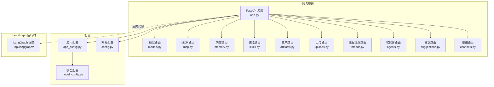

**图表来源**
- [app.py:1-201](file://backend/app/gateway/app.py#L1-L201)
- [models.py:1-117](file://backend/app/gateway/routers/models.py#L1-L117)
- [mcp.py:1-170](file://backend/app/gateway/routers/mcp.py#L1-L170)
- [memory.py:1-202](file://backend/app/gateway/routers/memory.py#L1-L202)
- [skills.py:1-174](file://backend/app/gateway/routers/skills.py#L1-L174)
- [artifacts.py:1-159](file://backend/app/gateway/routers/artifacts.py#L1-L159)
- [uploads.py:1-147](file://backend/app/gateway/routers/uploads.py#L1-L147)
- [threads.py:1-42](file://backend/app/gateway/routers/threads.py#L1-L42)
- [agents.py:1-384](file://backend/app/gateway/routers/agents.py#L1-L384)
- [suggestions.py:1-133](file://backend/app/gateway/routers/suggestions.py#L1-L133)
- [channels.py:1-53](file://backend/app/gateway/routers/channels.py#L1-L53)
- [app_config.py:1-334](file://backend/packages/harness/deerflow/config/app_config.py#L1-L334)
- [model_config.py:1-38](file://backend/packages/harness/deerflow/config/model_config.py#L1-L38)
- [config.py:1-28](file://backend/app/gateway/config.py#L1-L28)

**章节来源**
- [app.py:73-196](file://backend/app/gateway/app.py#L73-L196)
- [API.md:14-151](file://backend/docs/API.md#L14-L151)

## 核心组件
- 网关应用与生命周期：启动时加载应用配置、尝试启动 IM 渠道服务；关闭时停止服务；健康检查端点。
- 路由注册：按模块挂载各路由，如模型、MCP、内存、技能、资产、上传、线程、智能体、建议、渠道。
- 配置系统：应用配置支持环境变量解析、配置版本校验、自动重载；网关配置支持主机、端口、CORS 来源。

**章节来源**
- [app.py:32-71](file://backend/app/gateway/app.py#L32-L71)
- [app.py:156-196](file://backend/app/gateway/app.py#L156-L196)
- [config.py:17-27](file://backend/app/gateway/config.py#L17-L27)
- [app_config.py:263-288](file://backend/packages/harness/deerflow/config/app_config.py#L263-L288)

## 架构总览
- 接入层：Nginx 反向代理，将 /api/langgraph 请求转发至 LangGraph 服务，将 /api 请求交由网关服务处理。
- 网关服务：聚合模型、MCP、技能、内存、资产、上传、线程清理、智能体、建议、渠道等接口。
- LangGraph 服务：处理线程、运行、流式事件等代理交互。

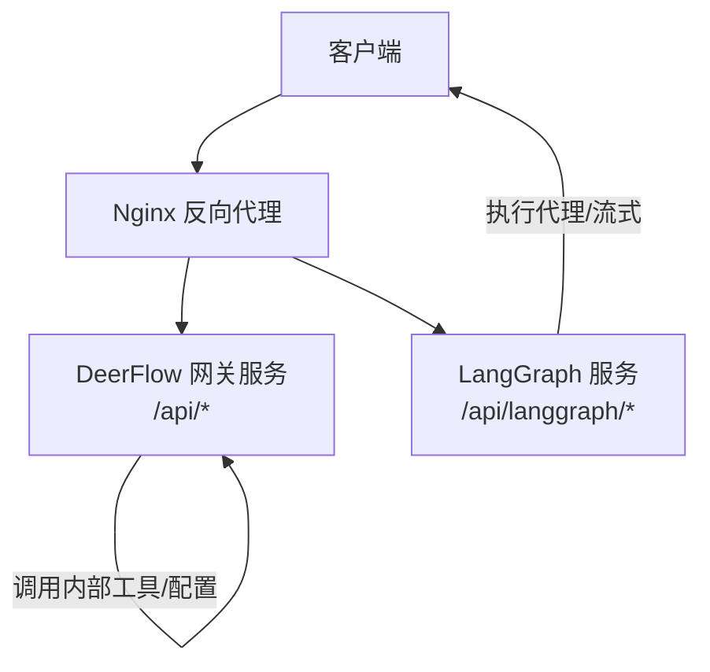

**图表来源**
- [API.md:9-12](file://backend/docs/API.md#L9-L12)
- [app.py:187-196](file://backend/app/gateway/app.py#L187-L196)

## 详细组件分析

### 智能体 API（agents）
- 功能：自定义智能体的创建、查询、更新、删除；检查名称可用性；全局用户档案读写。
- 关键端点
  - GET /api/agents：列出所有自定义智能体元数据（不含 SOUL 内容）
  - GET /api/agents/check?name={name}：校验并检查智能体名称是否可用
  - GET /api/agents/{name}：获取指定智能体详情（含 SOUL.md）
  - POST /api/agents：创建新智能体（写入 config.yaml 与 SOUL.md）
  - PUT /api/agents/{name}：更新现有智能体（可选更新描述、模型、工具组、SOUL.md）
  - DELETE /api/agents/{name}：删除智能体及其目录
  - GET /api/user-profile：读取全局 USER.md
  - PUT /api/user-profile：写入全局 USER.md
- 数据模型
  - AgentResponse/AgentsListResponse：智能体元数据与列表
  - AgentCreateRequest/AgentUpdateRequest：创建与更新请求体
  - UserProfileResponse/UserProfileUpdateRequest：用户档案读取与更新
- 错误处理
  - 404：智能体不存在
  - 409：智能体已存在
  - 422：名称不合法或路径非法
  - 500：内部错误（含清理失败）

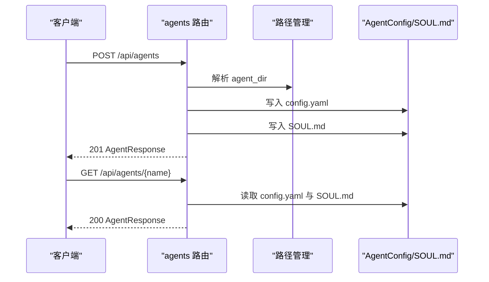

**图表来源**
- [agents.py:165-225](file://backend/app/gateway/routers/agents.py#L165-L225)
- [agents.py:134-163](file://backend/app/gateway/routers/agents.py#L134-L163)

**章节来源**
- [agents.py:91-163](file://backend/app/gateway/routers/agents.py#L91-L163)
- [agents.py:165-225](file://backend/app/gateway/routers/agents.py#L165-L225)
- [agents.py:227-292](file://backend/app/gateway/routers/agents.py#L227-L292)
- [agents.py:306-353](file://backend/app/gateway/routers/agents.py#L306-L353)
- [agents.py:355-384](file://backend/app/gateway/routers/agents.py#L355-L384)

### 线程 API（threads）
- 功能：清理 DeerFlow 管理的线程本地文件系统数据（LangGraph 线程状态删除由 LangGraph API 处理）。
- 端点
  - DELETE /api/threads/{thread_id}：删除线程本地目录
- 返回
  - 成功：200 + {success: true, message: "..."}
  - 422：无效 thread_id
  - 500：内部错误

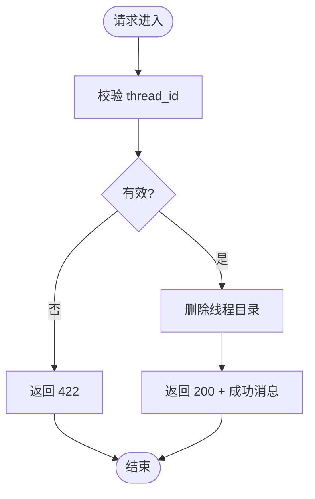

**图表来源**
- [threads.py:19-32](file://backend/app/gateway/routers/threads.py#L19-L32)

**章节来源**
- [threads.py:34-42](file://backend/app/gateway/routers/threads.py#L34-L42)

### 技能 API（skills）
- 功能：列出技能、获取技能详情、更新技能启用状态、从 .skill 文件安装技能。
- 端点
  - GET /api/skills：列出所有技能（公共与自定义）
  - GET /api/skills/{skill_name}：获取技能详情
  - PUT /api/skills/{skill_name}：更新技能 enabled 状态（写入 extensions_config.json 并重载缓存）
  - POST /api/skills/install：从线程 user-data 中的 .skill 文件安装
- 数据模型
  - SkillResponse/SkillsListResponse：技能列表与单项
  - SkillUpdateRequest：启用/禁用请求
  - SkillInstallRequest/SkillInstallResponse：安装请求与结果
- 错误处理
  - 404：技能不存在
  - 409：技能已存在（安装）
  - 400：无效输入或路径错误
  - 500：内部错误

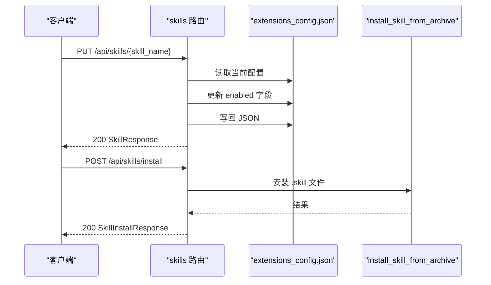

**图表来源**
- [skills.py:103-144](file://backend/app/gateway/routers/skills.py#L103-L144)
- [skills.py:152-174](file://backend/app/gateway/routers/skills.py#L152-L174)

**章节来源**
- [skills.py:66-101](file://backend/app/gateway/routers/skills.py#L66-L101)
- [skills.py:103-144](file://backend/app/gateway/routers/skills.py#L103-L144)
- [skills.py:152-174](file://backend/app/gateway/routers/skills.py#L152-L174)

### 模型 API（models）
- 功能：查询可用模型列表与单个模型详情。
- 端点
  - GET /api/models：返回模型列表（过滤敏感字段）
  - GET /api/models/{model_name}：返回指定模型详情
- 数据模型
  - ModelResponse/ModelsListResponse：模型信息
- 错误处理
  - 404：模型不存在
  - 500：内部错误

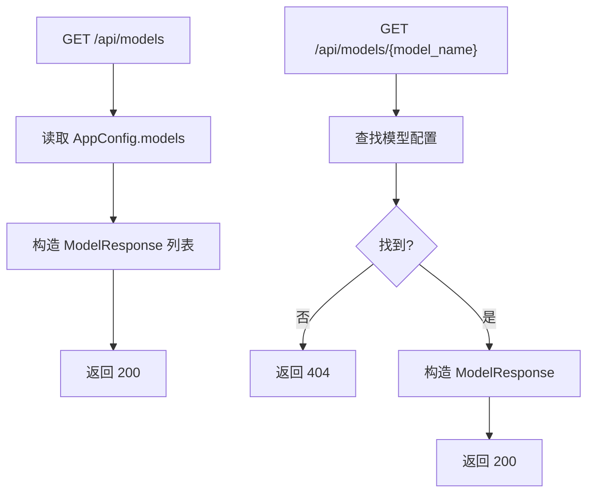

**图表来源**
- [models.py:32-73](file://backend/app/gateway/routers/models.py#L32-L73)
- [models.py:82-117](file://backend/app/gateway/routers/models.py#L82-L117)

**章节来源**
- [models.py:26-73](file://backend/app/gateway/routers/models.py#L26-L73)
- [models.py:76-117](file://backend/app/gateway/routers/models.py#L76-L117)

### 资产 API（artifacts）
- 功能：根据线程 ID 获取生成的资产文件（HTML、文本、二进制），支持下载参数与 .skill 归档内文件提取。
- 端点
  - GET /api/threads/{thread_id}/artifacts/{path}：获取资产文件
- 查询参数
  - download：强制下载（Content-Disposition）
- 支持类型
  - HTML：直接渲染
  - 文本：纯文本内容
  - 二进制：内联显示或下载
- 错误处理
  - 400：路径非法或非文件
  - 403：路径穿越检测
  - 404：文件未找到
  - 500：内部错误

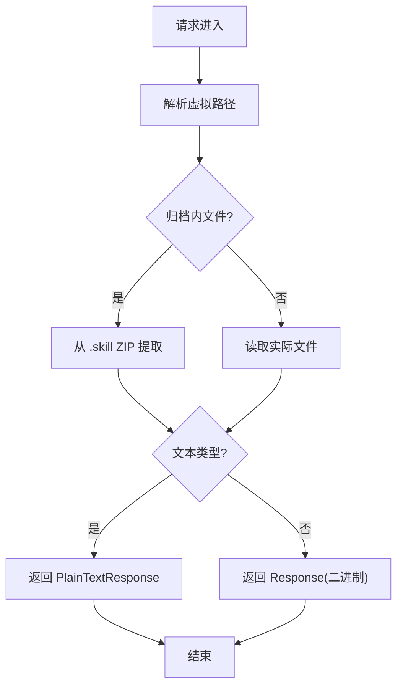

**图表来源**
- [artifacts.py:61-159](file://backend/app/gateway/routers/artifacts.py#L61-L159)

**章节来源**
- [artifacts.py:61-159](file://backend/app/gateway/routers/artifacts.py#L61-L159)

### 上传 API（uploads）
- 功能：多文件上传到线程上传目录，自动转换部分文档为 Markdown，并同步到沙箱。
- 端点
  - POST /api/threads/{thread_id}/uploads：上传多个文件
  - GET /api/threads/{thread_id}/uploads/list：列出上传文件
  - DELETE /api/threads/{thread_id}/uploads/{filename}：删除文件
- 数据模型
  - UploadResponse：上传成功响应
- 错误处理
  - 400：无文件或路径非法
  - 404：文件不存在
  - 500：内部错误

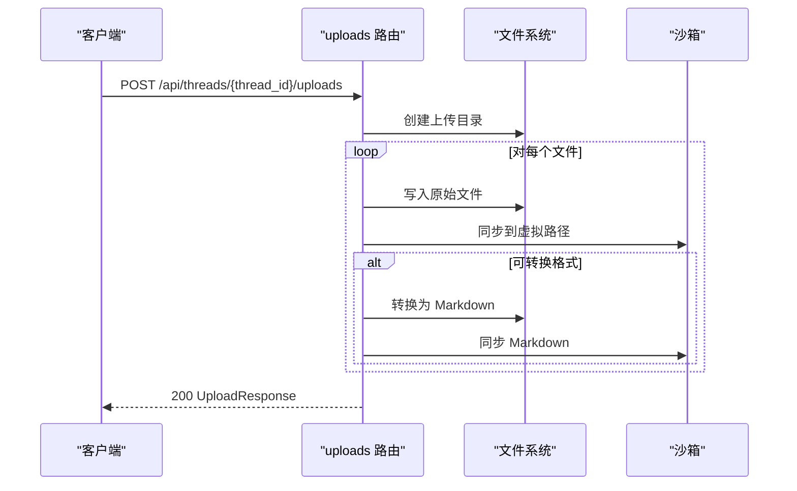

**图表来源**
- [uploads.py:36-111](file://backend/app/gateway/routers/uploads.py#L36-L111)

**章节来源**
- [uploads.py:36-111](file://backend/app/gateway/routers/uploads.py#L36-L111)
- [uploads.py:113-129](file://backend/app/gateway/routers/uploads.py#L113-L129)
- [uploads.py:131-147](file://backend/app/gateway/routers/uploads.py#L131-L147)

### 内存 API（memory）
- 功能：读取全局记忆数据、重新加载、获取配置、获取状态（配置+数据）。
- 端点
  - GET /api/memory：返回记忆数据
  - POST /api/memory/reload：重新加载记忆数据
  - GET /api/memory/config：返回内存配置
  - GET /api/memory/status：返回配置与数据组合
- 数据模型
  - MemoryResponse/MemoryConfigResponse/MemoryStatusResponse：记忆相关模型

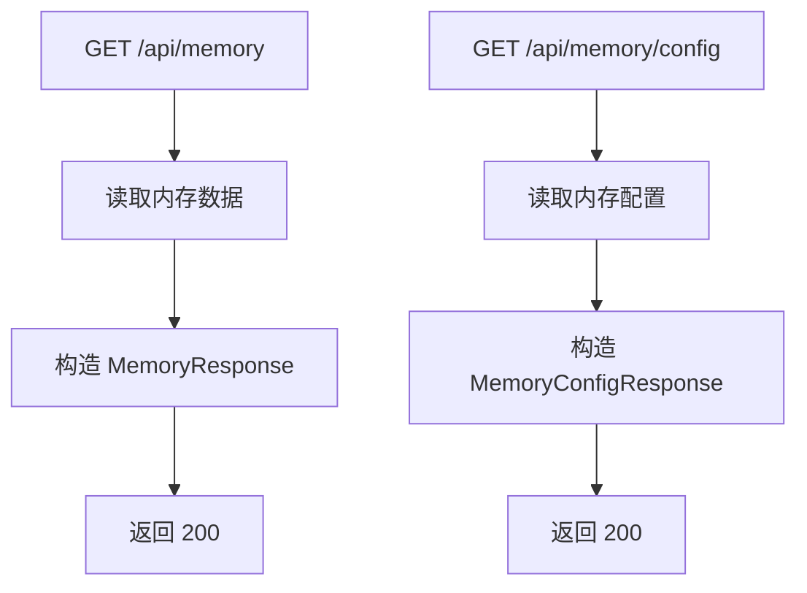

**图表来源**
- [memory.py:75-117](file://backend/app/gateway/routers/memory.py#L75-L117)
- [memory.py:138-172](file://backend/app/gateway/routers/memory.py#L138-L172)

**章节来源**
- [memory.py:75-117](file://backend/app/gateway/routers/memory.py#L75-L117)
- [memory.py:119-136](file://backend/app/gateway/routers/memory.py#L119-L136)
- [memory.py:138-172](file://backend/app/gateway/routers/memory.py#L138-L172)
- [memory.py:175-202](file://backend/app/gateway/routers/memory.py#L175-L202)

### 建议 API（suggestions）
- 功能：基于最近对话生成后续问题建议。
- 端点
  - POST /api/threads/{thread_id}/suggestions：生成建议
- 请求模型
  - SuggestionsRequest：消息列表、数量、模型名
- 响应模型
  - SuggestionsResponse：建议数组
- 处理流程
  - 格式化对话
  - 构造提示词
  - 调用模型
  - 解析 JSON 数组
  - 清洗与截断

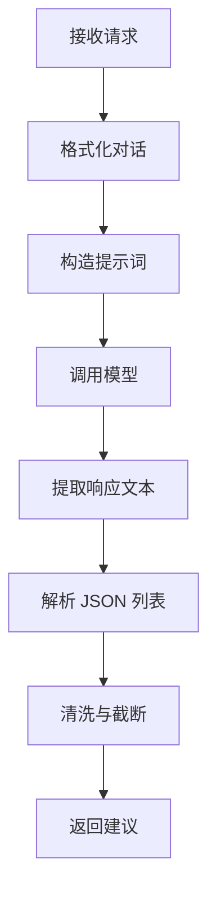

**图表来源**
- [suggestions.py:94-133](file://backend/app/gateway/routers/suggestions.py#L94-L133)

**章节来源**
- [suggestions.py:94-133](file://backend/app/gateway/routers/suggestions.py#L94-L133)

### 渠道 API（channels）
- 功能：获取 IM 渠道状态、重启指定渠道。
- 端点
  - GET /api/channels/：获取通道状态
  - POST /api/channels/{name}/restart：重启指定通道
- 错误处理
  - 503：通道服务未运行

**章节来源**
- [channels.py:25-53](file://backend/app/gateway/routers/channels.py#L25-L53)

### MCP 配置 API（mcp）
- 功能：读取与更新 MCP 服务器配置（含 OAuth 参数），保存到 extensions_config.json 并重载缓存。
- 端点
  - GET /api/mcp/config：获取 MCP 配置
  - PUT /api/mcp/config：更新 MCP 配置
- 数据模型
  - McpServerConfigResponse/McpConfigResponse/McpConfigUpdateRequest：MCP 配置相关模型
- 注意
  - 配置变更由 LangGraph 服务监听文件时间戳变化后自动重初始化工具

**章节来源**
- [mcp.py:66-96](file://backend/app/gateway/routers/mcp.py#L66-L96)
- [mcp.py:98-170](file://backend/app/gateway/routers/mcp.py#L98-L170)

## 依赖分析
- 组件耦合
  - 网关应用集中注册各路由，路由间低耦合，主要通过配置与路径工具交互。
  - 模型与 MCP 配置来自应用配置（AppConfig），具备自动重载能力。
  - 技能与 MCP 配置共享 extensions_config.json，保持一致性。
- 外部依赖
  - LangGraph 服务通过反向代理提供线程与流式运行接口。
  - Nginx 承担 CORS、认证与速率限制等边缘控制。

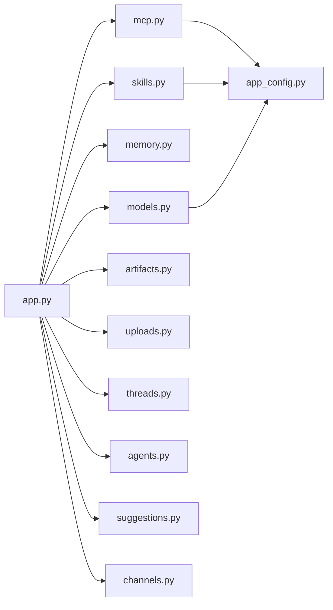

**图表来源**
- [app.py:156-186](file://backend/app/gateway/app.py#L156-L186)
- [mcp.py:93-95](file://backend/app/gateway/routers/mcp.py#L93-L95)
- [skills.py:117-134](file://backend/app/gateway/routers/skills.py#L117-L134)
- [models.py:61-73](file://backend/app/gateway/routers/models.py#L61-L73)

**章节来源**
- [app.py:156-186](file://backend/app/gateway/app.py#L156-L186)

## 性能考虑
- 配置缓存与自动重载：应用配置在文件修改时自动重载，避免频繁重启。
- 资产访问缓存：.skill 归档内文件提取结果设置短时缓存头，减少重复解压开销。
- 上传转换：仅对特定扩展名进行文档转 Markdown，降低不必要的处理。
- 流式传输：LangGraph 运行使用 SSE/WS，前端按需消费事件，降低内存占用。
- 建议生成：模型调用与 JSON 解析在服务端完成，建议数量受控（1-5）。

[本节为通用指导，无需具体文件分析]

## 故障排除指南
- 400 错误
  - 上传无文件、路径非法、安装技能路径错误
- 404 错误
  - 资产不存在、文件不存在、技能不存在、模型不存在
- 409 错误
  - 智能体已存在、技能已存在
- 422 错误
  - 线程清理无效 ID、智能体名称不合法
- 500 错误
  - 内部异常（含创建/更新/删除失败），详细日志见服务端
- 建议
  - 使用健康检查端点确认服务状态
  - 在生产环境通过 Nginx 实施认证与速率限制

**章节来源**
- [agents.py:189-191](file://backend/app/gateway/routers/agents.py#L189-L191)
- [skills.py:163-168](file://backend/app/gateway/routers/skills.py#L163-L168)
- [threads.py:24-28](file://backend/app/gateway/routers/threads.py#L24-L28)
- [uploads.py:42-48](file://backend/app/gateway/routers/uploads.py#L42-L48)
- [app.py:187-196](file://backend/app/gateway/app.py#L187-L196)

## 结论
本 API 文档系统性梳理了 DeerFlow 网关侧的全部公共接口，明确了端点、请求/响应模式与错误处理策略。结合 LangGraph 的线程与流式运行接口，开发者可快速构建基于智能体的 AI 应用。建议在生产环境中配合 Nginx 实施认证、限流与 TLS，确保安全与稳定性。

[本节为总结，无需具体文件分析]

## 附录

### API 规范汇总（按模块）
- 智能体（agents）
  - GET /api/agents
  - GET /api/agents/check?name={name}
  - GET /api/agents/{name}
  - POST /api/agents
  - PUT /api/agents/{name}
  - DELETE /api/agents/{name}
  - GET /api/user-profile
  - PUT /api/user-profile
- 线程（threads）
  - DELETE /api/threads/{thread_id}
- 技能（skills）
  - GET /api/skills
  - GET /api/skills/{skill_name}
  - PUT /api/skills/{skill_name}
  - POST /api/skills/install
- 模型（models）
  - GET /api/models
  - GET /api/models/{model_name}
- 资产（artifacts）
  - GET /api/threads/{thread_id}/artifacts/{path}?download={bool}
- 上传（uploads）
  - POST /api/threads/{thread_id}/uploads
  - GET /api/threads/{thread_id}/uploads/list
  - DELETE /api/threads/{thread_id}/uploads/{filename}
- 内存（memory）
  - GET /api/memory
  - POST /api/memory/reload
  - GET /api/memory/config
  - GET /api/memory/status
- 建议（suggestions）
  - POST /api/threads/{thread_id}/suggestions
- 渠道（channels）
  - GET /api/channels/
  - POST /api/channels/{name}/restart
- MCP 配置（mcp）
  - GET /api/mcp/config
  - PUT /api/mcp/config

**章节来源**
- [agents.py:91-384](file://backend/app/gateway/routers/agents.py#L91-L384)
- [threads.py:34-42](file://backend/app/gateway/routers/threads.py#L34-L42)
- [skills.py:66-174](file://backend/app/gateway/routers/skills.py#L66-L174)
- [models.py:26-117](file://backend/app/gateway/routers/models.py#L26-L117)
- [artifacts.py:61-159](file://backend/app/gateway/routers/artifacts.py#L61-L159)
- [uploads.py:36-147](file://backend/app/gateway/routers/uploads.py#L36-L147)
- [memory.py:75-202](file://backend/app/gateway/routers/memory.py#L75-L202)
- [suggestions.py:94-133](file://backend/app/gateway/routers/suggestions.py#L94-L133)
- [channels.py:25-53](file://backend/app/gateway/routers/channels.py#L25-L53)
- [mcp.py:66-170](file://backend/app/gateway/routers/mcp.py#L66-L170)

### 认证与安全
- 当前 API 未内置认证，建议通过 Nginx 实现基本认证、OAuth 或私有网络部署。
- MCP 出站连接可配置 OAuth（令牌注入、过期刷新等）。

**章节来源**
- [API.md:526-536](file://backend/docs/API.md#L526-L536)
- [mcp.py:15-32](file://backend/app/gateway/routers/mcp.py#L15-L32)

### 速率限制
- 默认未实现速率限制，推荐在 Nginx 层配置。

**章节来源**
- [API.md:539-551](file://backend/docs/API.md#L539-L551)

### 版本管理
- 应用配置支持版本检查与升级提示，确保与示例配置一致。
- 模型配置包含额外字段以支持不同提供商特性。

**章节来源**
- [app_config.py:134-177](file://backend/packages/harness/deerflow/config/app_config.py#L134-L177)
- [model_config.py:16-38](file://backend/packages/harness/deerflow/config/model_config.py#L16-L38)

### 客户端实现要点
- 使用 LangGraph SDK 进行线程与运行操作，使用 fetch/EventSource 访问网关与流式接口。
- cURL 示例可用于快速验证端点。

**章节来源**
- [API.md:564-631](file://backend/docs/API.md#L564-L631)