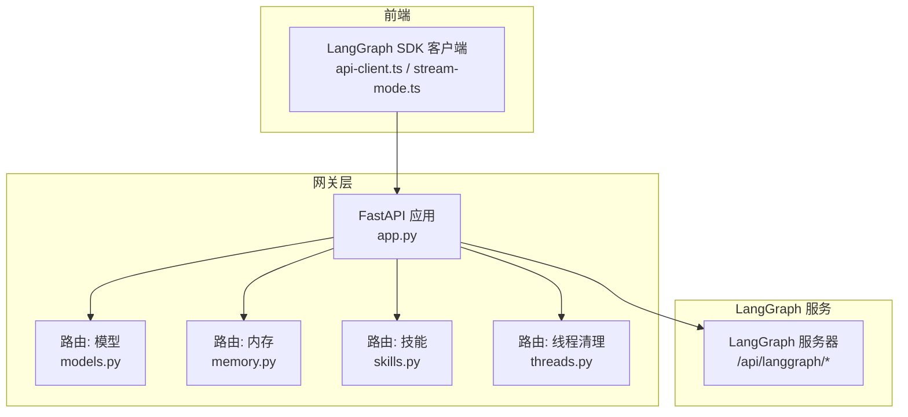
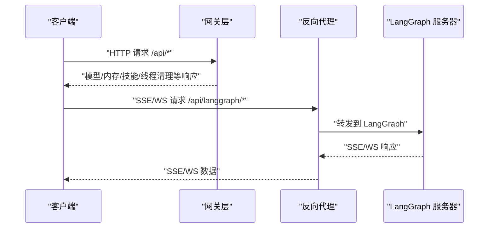
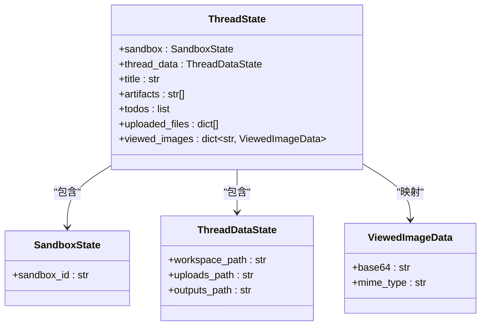
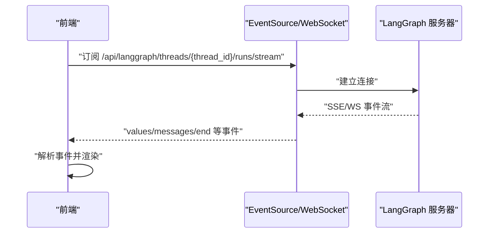
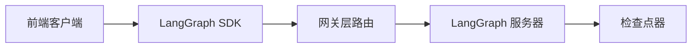

# LangGraph API

<cite>
**本文引用的文件**
- [API.md](file://backend/docs/API.md)
- [app.py](file://backend/app/gateway/app.py)
- [threads.py](file://backend/app/gateway/routers/threads.py)
- [models.py](file://backend/app/gateway/routers/models.py)
- [memory.py](file://backend/app/gateway/routers/memory.py)
- [skills.py](file://backend/app/gateway/routers/skills.py)
- [manager.py](file://backend/app/channels/manager.py)
- [client.py](file://backend/packages/harness/deerflow/client.py)
- [thread_state.py](file://backend/packages/harness/deerflow/agents/thread_state.py)
- [provider.py](file://backend/packages/harness/deerflow/agents/checkpointer/provider.py)
- [model_config.py](file://backend/packages/harness/deerflow/config/model_config.py)
- [agents_config.py](file://backend/packages/harness/deerflow/config/agents_config.py)
- [api-client.ts](file://frontend/src/core/api/api-client.ts)
- [stream-mode.ts](file://frontend/src/core/api/stream-mode.ts)
</cite>

## 目录
1. [简介](#简介)
2. [项目结构](#项目结构)
3. [核心组件](#核心组件)
4. [架构总览](#架构总览)
5. [详细组件分析](#详细组件分析)
6. [依赖分析](#依赖分析)
7. [性能考虑](#性能考虑)
8. [故障排查指南](#故障排查指南)
9. [结论](#结论)
10. [附录](#附录)

## 简介
本文件为 LangGraph API 的详细技术文档，聚焦于智能体交互、线程管理与实时流式传输接口。内容覆盖：
- 线程创建、状态获取、运行执行、历史查询等核心能力
- SSE 流式响应格式、事件类型与数据结构
- 配置参数说明：model_name、thinking_enabled、is_plan_mode 的作用与使用场景
- WebSocket 连接支持与实时通信实现指南
- 前端集成与流模式兼容性建议

LangGraph API 由 LangGraph 服务器提供，通过反向代理统一暴露在 /api/langgraph 路径下；网关层（Gateway）提供模型、内存、技能、上传与工件等扩展能力。

## 项目结构
后端采用 FastAPI 应用，按路由模块组织：
- 网关层：/api 下挂载模型、内存、技能、上传、工件、线程清理、通道、建议等路由
- LangGraph 层：由独立 LangGraph 服务提供，网关通过反向代理转发至 /api/langgraph
- 前端：基于 LangGraph SDK 客户端，封装流模式兼容逻辑

图表来源
- [app.py:73-196](file://backend/app/gateway/app.py#L73-L196)
- [models.py:26-73](file://backend/app/gateway/routers/models.py#L26-L73)
- [memory.py:75-201](file://backend/app/gateway/routers/memory.py#L75-L201)
- [skills.py:66-174](file://backend/app/gateway/routers/skills.py#L66-L174)
- [threads.py:34-42](file://backend/app/gateway/routers/threads.py#L34-L42)

章节来源
- [app.py:73-196](file://backend/app/gateway/app.py#L73-L196)

## 核心组件
- LangGraph 线程与运行
  - 线程创建、状态读取、运行执行、历史查询、流式输出
- 网关扩展能力
  - 模型列表与详情、内存数据与配置、技能管理、线程本地数据清理
- 实时通信
  - SSE 流式事件、WebSocket 支持、流模式兼容与过滤
- 配置与中间件
  - 检查点器（持久化）、线程状态结构、模型配置

章节来源
- [API.md:14-151](file://backend/docs/API.md#L14-L151)
- [models.py:26-117](file://backend/app/gateway/routers/models.py#L26-L117)
- [memory.py:75-201](file://backend/app/gateway/routers/memory.py#L75-L201)
- [skills.py:66-174](file://backend/app/gateway/routers/skills.py#L66-L174)
- [threads.py:19-42](file://backend/app/gateway/routers/threads.py#L19-L42)

## 架构总览
LangGraph API 通过反向代理统一入口，网关层负责模型、内存、技能等扩展能力，LangGraph 服务负责智能体交互与线程状态管理。

图表来源
- [app.py:156-186](file://backend/app/gateway/app.py#L156-L186)
- [API.md:14-151](file://backend/docs/API.md#L14-L151)

## 详细组件分析

### 线程与运行（LangGraph）
- 线程创建
  - 方法：POST
  - 路径：/api/langgraph/threads
  - 请求体：metadata（可选）
  - 响应：thread_id、created_at、metadata
- 获取线程状态
  - 方法：GET
  - 路径：/api/langgraph/threads/{thread_id}/state
  - 响应：values（消息、沙箱、工件、线程数据、标题等）、next、config
- 执行运行（一次性）
  - 方法：POST
  - 路径：/api/langgraph/threads/{thread_id}/runs
  - 请求体：input（messages 等）、config（configurable：model_name、thinking_enabled、is_plan_mode）、stream_mode（数组）
  - 响应：SSE 流事件（values、messages、end 等）
- 获取运行历史
  - 方法：GET
  - 路径：/api/langgraph/threads/{thread_id}/runs
  - 响应：runs 列表（run_id、status、created_at）
- 流式运行
  - 方法：POST
  - 路径：/api/langgraph/threads/{thread_id}/runs/stream
  - 请求体同上，返回 SSE 流

SSE 事件类型与数据结构
- values：增量状态片段（如 messages、title）
- messages：单条消息片段（content、role）
- end：流结束标记
- 其他：updates、events、debug、tasks、checkpoints、custom（取决于 stream_mode）

WebSocket 支持
- 支持通过 ws://host/api/langgraph/threads/{thread_id}/runs/stream 进行实时通信

章节来源
- [API.md:20-151](file://backend/docs/API.md#L20-L151)

### 线程状态模型与检查点
线程状态结构扩展自 AgentState，包含沙箱、线程数据、标题、工件、待办、上传文件、已查看图片等字段，并定义了合并规则（去重、清空等）。

图表来源
- [thread_state.py:6-56](file://backend/packages/harness/deerflow/agents/thread_state.py#L6-L56)

检查点器（持久化）
- 支持 memory、sqlite、postgres 后端
- 提供同步单例与上下文管理器两种使用方式
- 未配置时默认使用 InMemorySaver

章节来源
- [provider.py:47-204](file://backend/packages/harness/deerflow/agents/checkpointer/provider.py#L47-L204)
- [thread_state.py:48-56](file://backend/packages/harness/deerflow/agents/thread_state.py#L48-L56)

### 网关扩展：模型、内存、技能与线程清理
- 模型
  - GET /api/models：列出可用模型（名称、显示名、描述、是否支持思考/推理）
  - GET /api/models/{model_name}：获取指定模型详情
- 内存
  - GET /api/memory：获取全局记忆数据（用户上下文、历史、事实）
  - POST /api/memory/reload：从存储文件重新加载内存
  - GET /api/memory/config：获取内存配置
  - GET /api/memory/status：同时返回配置与数据
- 技能
  - GET /api/skills：列出所有技能
  - GET /api/skills/{skill_name}：获取技能详情
  - PUT /api/skills/{skill_name}：更新技能启用状态
  - POST /api/skills/install：从 .skill 文件安装技能
- 线程清理
  - DELETE /api/threads/{thread_id}：删除 DeerFlow 管理的线程本地目录（LangGraph 状态删除由 LangGraph API 处理）

章节来源
- [models.py:26-117](file://backend/app/gateway/routers/models.py#L26-L117)
- [memory.py:75-201](file://backend/app/gateway/routers/memory.py#L75-L201)
- [skills.py:66-174](file://backend/app/gateway/routers/skills.py#L66-L174)
- [threads.py:19-42](file://backend/app/gateway/routers/threads.py#L19-L42)

### 配置参数说明与使用场景
- model_name
  - 作用：覆盖默认模型
  - 使用场景：针对不同任务选择合适模型
- thinking_enabled
  - 作用：为支持的模型启用扩展思考
  - 使用场景：需要更深入推理的任务
- is_plan_mode
  - 作用：启用 TodoList 中间件进行任务跟踪
  - 使用场景：需要结构化任务分解与执行的场景

章节来源
- [API.md:103-107](file://backend/docs/API.md#L103-L107)
- [model_config.py:16-37](file://backend/packages/harness/deerflow/config/model_config.py#L16-L37)

### 实时流式传输与 WebSocket
- SSE 流式事件
  - 支持 values、messages、updates、events、debug、tasks、checkpoints、custom 等模式
  - 前端可通过 EventSource 订阅 /api/langgraph/threads/{thread_id}/runs/stream
- WebSocket
  - 支持 ws://host/api/langgraph/threads/{thread_id}/runs/stream
- 流模式兼容
  - 前端对不支持的流模式会进行过滤与告警
  - 支持多模式组合，仅保留受支持集合

图表来源
- [API.md:554-602](file://backend/docs/API.md#L554-L602)
- [api-client.ts:9-37](file://frontend/src/core/api/api-client.ts#L9-L37)
- [stream-mode.ts:1-68](file://frontend/src/core/api/stream-mode.ts#L1-L68)

章节来源
- [API.md:554-602](file://backend/docs/API.md#L554-L602)
- [api-client.ts:9-37](file://frontend/src/core/api/api-client.ts#L9-L37)
- [stream-mode.ts:1-68](file://frontend/src/core/api/stream-mode.ts#L1-L68)

### 客户端与中间件集成
- LangGraph SDK 客户端
  - 自动注入流模式兼容逻辑，丢弃不受支持的模式并发出警告
- 默认运行配置
  - recursion_limit、thinking_enabled、is_plan_mode、subagent_enabled 等
- 线程状态中间件
  - 在中间件中可清空 viewed_images 等状态，便于流程控制

章节来源
- [client.py:312-333](file://backend/packages/harness/deerflow/client.py#L312-L333)
- [manager.py:21-26](file://backend/app/channels/manager.py#L21-L26)
- [manager.py:565-592](file://backend/app/channels/manager.py#L565-L592)
- [thread_state.py:31-45](file://backend/packages/harness/deerflow/agents/thread_state.py#L31-L45)

## 依赖分析
- 组件耦合
  - 网关层路由与 LangGraph 服务解耦，通过反向代理访问
  - 客户端与网关层通过 SDK 与 SSE/WS 交互
- 外部依赖
  - LangGraph SDK、Nginx 反向代理
  - 检查点器后端（memory/sqlite/postgres）
- 潜在循环依赖
  - 未见直接循环导入；各模块职责清晰

图表来源
- [app.py:156-186](file://backend/app/gateway/app.py#L156-L186)
- [provider.py:114-157](file://backend/packages/harness/deerflow/agents/checkpointer/provider.py#L114-L157)

章节来源
- [app.py:156-186](file://backend/app/gateway/app.py#L156-L186)
- [provider.py:114-157](file://backend/packages/harness/deerflow/agents/checkpointer/provider.py#L114-L157)

## 性能考虑
- SSE/WS 并发
  - 控制最大并发数，避免过载
- 流更新节流
  - 前端/后端对频繁更新进行节流，减少抖动
- 检查点器选择
  - 生产环境优先使用 sqlite/postgres，避免内存后端丢失状态
- 模型选择
  - 根据任务复杂度选择合适模型，合理设置 recursion_limit

## 故障排查指南
- 线程清理失败
  - 现象：删除线程本地数据报错
  - 排查：确认路径存在、权限正确、异常日志
- SSE/WS 连接问题
  - 现象：无法接收事件或连接中断
  - 排查：确认反向代理配置、WebSocket 支持、网络连通性
- 不支持的流模式
  - 现象：部分模式被丢弃
  - 排查：检查前端流模式过滤逻辑，确保只传入受支持集合
- 检查点器错误
  - 现象：导入缺失或连接字符串错误
  - 排查：安装对应包、检查配置项

章节来源
- [threads.py:19-42](file://backend/app/gateway/routers/threads.py#L19-L42)
- [API.md:554-602](file://backend/docs/API.md#L554-L602)
- [stream-mode.ts:15-34](file://frontend/src/core/api/stream-mode.ts#L15-L34)
- [provider.py:38-41](file://backend/packages/harness/deerflow/agents/checkpointer/provider.py#L38-L41)

## 结论
LangGraph API 提供了完整的智能体交互与线程管理能力，结合网关层扩展能力与实时流式传输，满足多样化应用场景。通过合理的流模式配置、检查点器选择与前端兼容处理，可在保证稳定性的同时获得良好的用户体验。

## 附录
- 常用路径速览
  - 线程：/api/langgraph/threads
  - 状态：/api/langgraph/threads/{thread_id}/state
  - 运行：/api/langgraph/threads/{thread_id}/runs
  - 流式：/api/langgraph/threads/{thread_id}/runs/stream
  - 历史：/api/langgraph/threads/{thread_id}/runs
  - 模型：/api/models、/api/models/{model_name}
  - 内存：/api/memory、/api/memory/config、/api/memory/status、/api/memory/reload
  - 技能：/api/skills、/api/skills/{skill_name}、/api/skills/install
  - 线程清理：/api/threads/{thread_id}