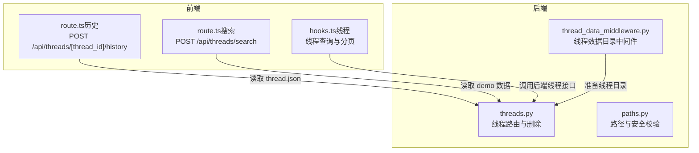
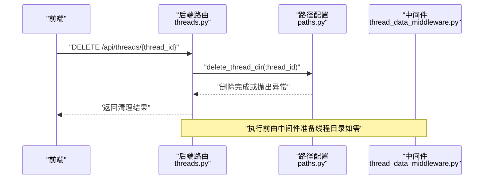
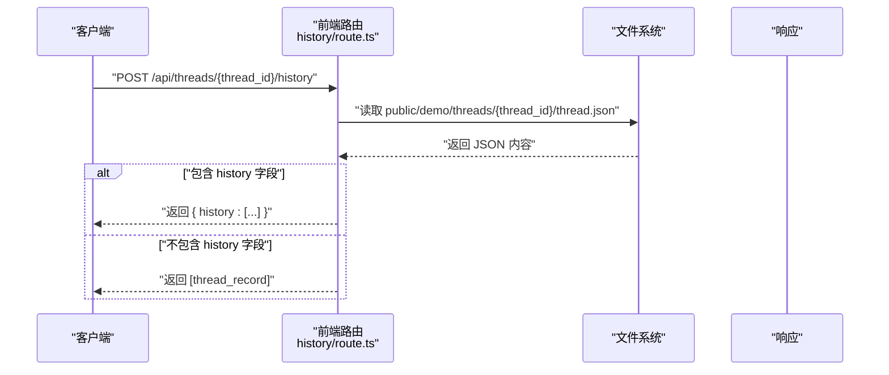
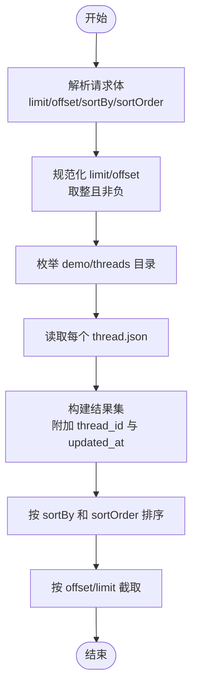
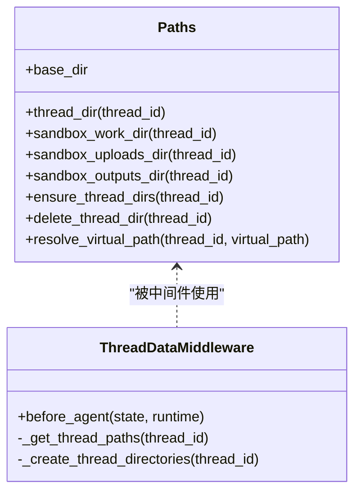
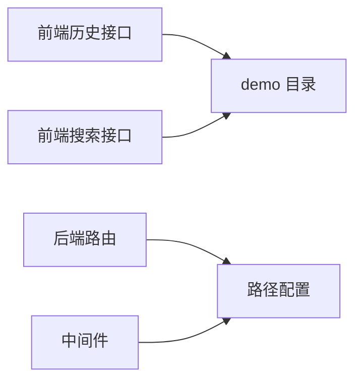
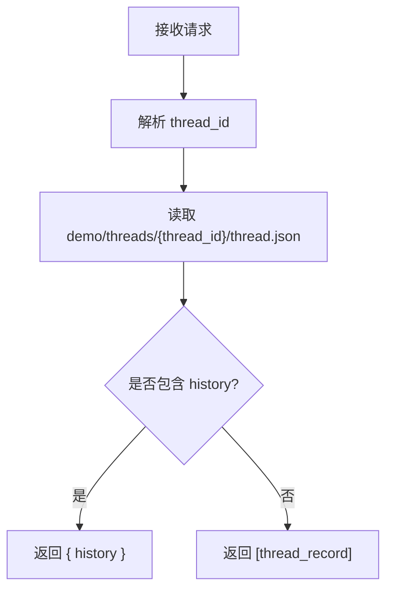

# 历史查询

<cite>
**本文引用的文件**
- [threads.py](file://backend/app/gateway/routers/threads.py)
- [paths.py](file://backend/packages/harness/deerflow/config/paths.py)
- [thread_data_middleware.py](file://backend/packages/harness/deerflow/agents/middlewares/thread_data_middleware.py)
- [route.ts（历史）](file://frontend/src/app/mock/api/threads/[thread_id]/history/route.ts)
- [route.ts（搜索）](file://frontend/src/app/mock/api/threads/search/route.ts)
- [hooks.ts（线程）](file://frontend/src/core/threads/hooks.ts)
</cite>

## 目录
1. [简介](#简介)
2. [项目结构](#项目结构)
3. [核心组件](#核心组件)
4. [架构总览](#架构总览)
5. [详细组件分析](#详细组件分析)
6. [依赖分析](#依赖分析)
7. [性能考虑](#性能考虑)
8. [故障排查指南](#故障排查指南)
9. [结论](#结论)
10. [附录](#附录)

## 简介
本文件聚焦“历史查询”能力，围绕后端线程数据管理与前端历史接口展开，系统性说明以下内容：
- Get Run History 接口的功能与使用方式
- 返回数据结构（runs 数组及其字段）的语义与来源
- 历史记录的查询、筛选与排序方法
- 历史数据的存储策略与清理机制
- 使用示例与最佳实践建议

说明：当前仓库中存在一个用于演示的“历史”接口实现，其返回结构与后端实际线程数据模型存在差异；本文在描述接口行为时严格依据现有源码实现，并对后端真实线程数据模型进行补充说明。

## 项目结构
与历史查询直接相关的模块分布如下：
- 后端网关路由：提供线程数据删除等操作的 API
- 路径配置：定义线程数据目录布局与安全校验
- 中间件：在执行前为线程准备数据目录
- 前端历史接口：演示用的历史查询接口（返回 thread.json 及其 history 字段）
- 前端线程搜索接口：演示用的线程列表查询与分页排序

图表来源
- [threads.py:1-42](file://backend/app/gateway/routers/threads.py#L1-L42)
- [paths.py:95-183](file://backend/packages/harness/deerflow/config/paths.py#L95-L183)
- [thread_data_middleware.py:73-96](file://backend/packages/harness/deerflow/agents/middlewares/thread_data_middleware.py#L73-L96)
- [route.ts（历史）:1-21](file://frontend/src/app/mock/api/threads/[thread_id]/history/route.ts#L1-L21)
- [route.ts（搜索）:1-85](file://frontend/src/app/mock/api/threads/search/route.ts#L1-L85)
- [hooks.ts（线程）:441-477](file://frontend/src/core/threads/hooks.ts#L441-L477)

章节来源
- [threads.py:1-42](file://backend/app/gateway/routers/threads.py#L1-L42)
- [paths.py:12-183](file://backend/packages/harness/deerflow/config/paths.py#L12-L183)
- [thread_data_middleware.py:18-96](file://backend/packages/harness/deerflow/agents/middlewares/thread_data_middleware.py#L18-L96)
- [route.ts（历史）:1-21](file://frontend/src/app/mock/api/threads/[thread_id]/history/route.ts#L1-L21)
- [route.ts（搜索）:1-85](file://frontend/src/app/mock/api/threads/search/route.ts#L1-L85)
- [hooks.ts（线程）:441-477](file://frontend/src/core/threads/hooks.ts#L441-L477)

## 核心组件
- 后端线程路由与删除
  - 提供删除线程本地持久化数据的接口，仅清理 DeerFlow 管理的线程目录，LangGraph 线程状态删除由 LangGraph API 处理
- 路径配置与安全校验
  - 定义线程数据目录布局，提供线程目录创建、删除与虚拟路径解析能力，并对 thread_id 进行安全校验
- 线程数据目录中间件
  - 在代理执行前为线程准备 user-data 下的工作区、上传与输出目录，支持惰性/急切两种初始化模式
- 前端历史接口（演示）
  - 读取 demo 目录下的 thread.json，若其中包含 history 字段则原样返回，否则将单条记录包装为数组返回
- 前端线程搜索接口（演示）
  - 读取 demo 目录下所有线程，按 updated_at 或 created_at 排序并支持分页

章节来源
- [threads.py:19-41](file://backend/app/gateway/routers/threads.py#L19-L41)
- [paths.py:95-183](file://backend/packages/harness/deerflow/config/paths.py#L95-L183)
- [thread_data_middleware.py:18-96](file://backend/packages/harness/deerflow/agents/middlewares/thread_data_middleware.py#L18-L96)
- [route.ts（历史）:10-20](file://frontend/src/app/mock/api/threads/[thread_id]/history/route.ts#L10-L20)
- [route.ts（搜索）:39-84](file://frontend/src/app/mock/api/threads/search/route.ts#L39-L84)

## 架构总览
后端通过 FastAPI 路由暴露线程数据清理能力；路径配置模块负责线程目录的安全创建与删除；中间件在执行阶段确保线程数据目录可用。前端演示接口从本地 demo 数据读取线程信息，用于展示历史查询与线程搜索的行为。

图表来源
- [threads.py:34-41](file://backend/app/gateway/routers/threads.py#L34-L41)
- [paths.py:175-183](file://backend/packages/harness/deerflow/config/paths.py#L175-L183)
- [thread_data_middleware.py:73-96](file://backend/packages/harness/deerflow/agents/middlewares/thread_data_middleware.py#L73-L96)

## 详细组件分析

### Get Run History 接口（演示实现）
- 请求方法与路径
  - 方法：POST
  - 路径：/api/threads/[thread_id]/history
- 请求体
  - 无请求体参数
- 响应
  - 成功：返回 thread.json 的完整内容；若其中包含 history 字段，则直接返回该字段；否则将单条记录包装为数组返回
- 行为说明
  - 该接口为演示用途，直接读取 demo 目录中的 thread.json 并返回
  - 实际生产环境可参考后端线程数据模型与路径配置，结合中间件提供的目录结构组织历史数据

图表来源
- [route.ts（历史）:6-20](file://frontend/src/app/mock/api/threads/[thread_id]/history/route.ts#L6-L20)

章节来源
- [route.ts（历史）:6-20](file://frontend/src/app/mock/api/threads/[thread_id]/history/route.ts#L6-L20)

### 历史记录查询、筛选与排序（演示实现）
- 查询范围
  - 演示接口读取 demo 目录下所有线程记录
- 分页参数
  - limit：每页数量，默认 50，取整数且非负
  - offset：偏移量，默认 0，取整数且非负
- 排序参数
  - sortBy：排序字段，支持 updated_at 或 created_at
  - sortOrder：排序方向，asc 升序或 desc 降序
- 返回结构
  - 返回线程数组，每个元素包含 thread_id 与排序字段 updated_at（若不存在则回退到 created_at）

图表来源
- [route.ts（搜索）:16-84](file://frontend/src/app/mock/api/threads/search/route.ts#L16-L84)

章节来源
- [route.ts（搜索）:4-9](file://frontend/src/app/mock/api/threads/search/route.ts#L4-L9)
- [route.ts（搜索）:16-84](file://frontend/src/app/mock/api/threads/search/route.ts#L16-L84)

### 历史数据存储策略与清理机制
- 存储位置与布局
  - 线程数据根目录由路径配置决定，线程目录结构包含 user-data/workspace、user-data/uploads、user-data/outputs 等子目录
- 目录创建与权限
  - 支持惰性/急切两种初始化模式；创建目录时设置权限，确保沙箱容器可写
- 清理机制
  - 删除线程本地持久化数据：仅清理 DeerFlow 管理的线程目录；LangGraph 线程状态删除由 LangGraph API 处理
- 安全校验
  - 对 thread_id 进行字符集限制，防止路径遍历攻击；对虚拟路径解析进行前缀匹配与相对路径校验

图表来源
- [paths.py:95-183](file://backend/packages/harness/deerflow/config/paths.py#L95-L183)
- [thread_data_middleware.py:46-96](file://backend/packages/harness/deerflow/agents/middlewares/thread_data_middleware.py#L46-L96)

章节来源
- [paths.py:95-183](file://backend/packages/harness/deerflow/config/paths.py#L95-L183)
- [thread_data_middleware.py:18-96](file://backend/packages/harness/deerflow/agents/middlewares/thread_data_middleware.py#L18-L96)
- [threads.py:19-41](file://backend/app/gateway/routers/threads.py#L19-L41)

### 返回结构说明（基于演示接口）
- 响应主体
  - 若 thread.json 包含 history 字段：返回 { history: [...] }
  - 否则返回 [thread_record]，其中 thread_record 为 thread.json 的内容
- 字段语义（以演示接口为准）
  - thread_id：线程序列号
  - updated_at：更新时间（若不存在则回退 created_at）
  - created_at：创建时间（演示接口中作为回退值参与排序）

注意：上述字段来源于演示接口对 thread.json 的直接读取与处理。后端真实线程数据模型与历史记录组织方式请参考路径配置与中间件的目录结构设计。

章节来源
- [route.ts（历史）:10-20](file://frontend/src/app/mock/api/threads/[thread_id]/history/route.ts#L10-L20)
- [route.ts（搜索）:56-65](file://frontend/src/app/mock/api/threads/search/route.ts#L56-L65)

### 使用示例与最佳实践
- 示例一：获取指定线程的历史
  - 步骤：调用 POST /api/threads/{thread_id}/history
  - 结果：若 thread.json 含 history 则返回该字段，否则返回单条记录数组
- 示例二：分页与排序列出线程
  - 步骤：调用 POST /api/threads/search，传入 limit、offset、sortBy、sortOrder
  - 结果：返回按排序规则截取的线程列表
- 最佳实践
  - 前端分页：使用 hooks.ts 中的分页逻辑，避免一次性加载过多数据
  - 参数校验：确保 limit/offset 为非负整数，sortBy 为受支持的字段
  - 安全性：后端对 thread_id 进行字符集限制，避免路径遍历；前端应避免拼接不受信任的 thread_id

章节来源
- [route.ts（历史）:6-20](file://frontend/src/app/mock/api/threads/[thread_id]/history/route.ts#L6-L20)
- [route.ts（搜索）:16-84](file://frontend/src/app/mock/api/threads/search/route.ts#L16-L84)
- [hooks.ts（线程）:441-477](file://frontend/src/core/threads/hooks.ts#L441-L477)

## 依赖分析
- 组件耦合
  - 前端历史接口依赖 demo 目录结构；后端线程路由依赖路径配置模块
  - 中间件依赖路径配置模块以准备线程数据目录
- 外部依赖
  - 文件系统读写（演示接口）
  - FastAPI 路由（后端）
- 潜在循环依赖
  - 当前实现未见循环依赖迹象

图表来源
- [route.ts（历史）:10-14](file://frontend/src/app/mock/api/threads/[thread_id]/history/route.ts#L10-L14)
- [route.ts（搜索）:39-54](file://frontend/src/app/mock/api/threads/search/route.ts#L39-L54)
- [threads.py:34-41](file://backend/app/gateway/routers/threads.py#L34-L41)
- [paths.py:95-183](file://backend/packages/harness/deerflow/config/paths.py#L95-L183)
- [thread_data_middleware.py:46-71](file://backend/packages/harness/deerflow/agents/middlewares/thread_data_middleware.py#L46-L71)

章节来源
- [route.ts（历史）:10-14](file://frontend/src/app/mock/api/threads/[thread_id]/history/route.ts#L10-L14)
- [route.ts（搜索）:39-54](file://frontend/src/app/mock/api/threads/search/route.ts#L39-L54)
- [threads.py:34-41](file://backend/app/gateway/routers/threads.py#L34-L41)
- [paths.py:95-183](file://backend/packages/harness/deerflow/config/paths.py#L95-L183)
- [thread_data_middleware.py:46-71](file://backend/packages/harness/deerflow/agents/middlewares/thread_data_middleware.py#L46-L71)

## 性能考虑
- 演示接口
  - 直接读取文件系统，适合小规模 demo 数据；大规模场景建议后端实现分页与缓存
- 分页与排序
  - 建议在后端实现分页与排序，避免一次性读取全部线程文件
- 目录初始化
  - 惰性初始化可减少不必要的 IO；急切初始化可提前暴露错误

## 故障排查指南
- 删除线程数据失败
  - 现象：删除接口返回 500 或 422
  - 排查：检查 thread_id 是否符合安全校验规则；查看日志是否提示路径不存在或权限问题
- 历史接口返回空或格式异常
  - 现象：返回空数组或缺少字段
  - 排查：确认 demo 目录下是否存在对应 thread_id 的 thread.json；确认文件内容是否为合法 JSON
- 排序与分页异常
  - 现象：排序结果不符合预期或分页越界
  - 排查：确认 sortBy 与 sortOrder 的取值；确认 limit/offset 的数值范围

章节来源
- [threads.py:19-31](file://backend/app/gateway/routers/threads.py#L19-L31)
- [paths.py:106-108](file://backend/packages/harness/deerflow/config/paths.py#L106-L108)
- [route.ts（历史）:10-14](file://frontend/src/app/mock/api/threads/[thread_id]/history/route.ts#L10-L14)
- [route.ts（搜索）:19-35](file://frontend/src/app/mock/api/threads/search/route.ts#L19-L35)

## 结论
- 演示接口展示了历史查询与线程搜索的基本形态：前者返回 thread.json 及其 history 字段，后者提供分页与排序
- 后端提供了完善的线程数据目录管理与安全校验机制，可作为生产环境历史数据组织与清理的基础
- 建议在生产环境中将历史查询与线程搜索迁移至后端实现，结合路径配置与中间件，统一管理线程数据生命周期

## 附录
- 关键流程图（历史接口）

图表来源
- [route.ts（历史）:6-20](file://frontend/src/app/mock/api/threads/[thread_id]/history/route.ts#L6-L20)