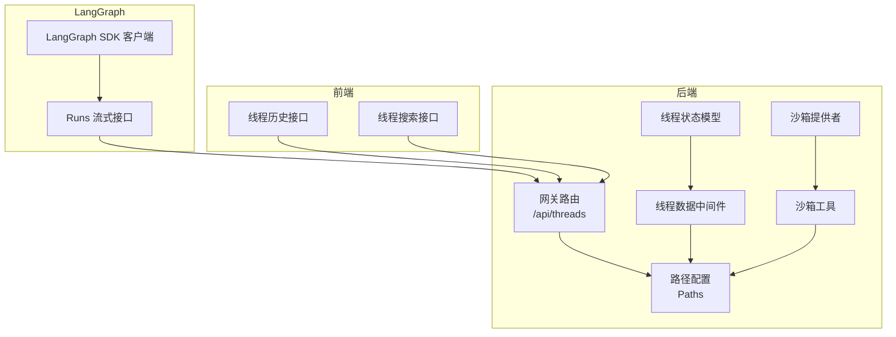
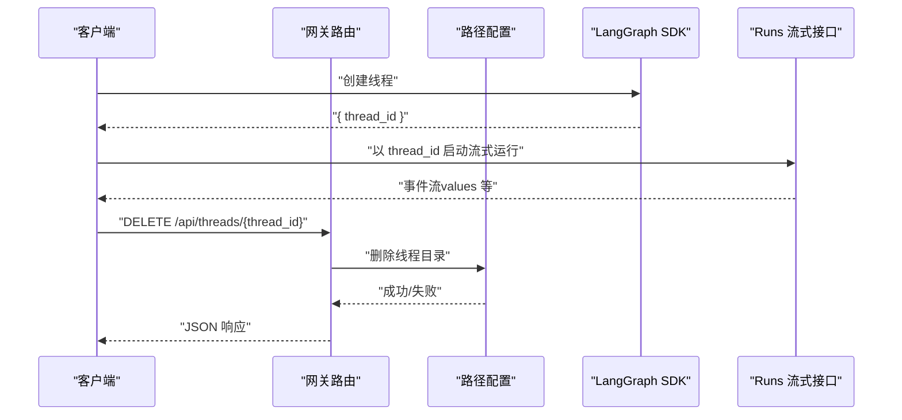
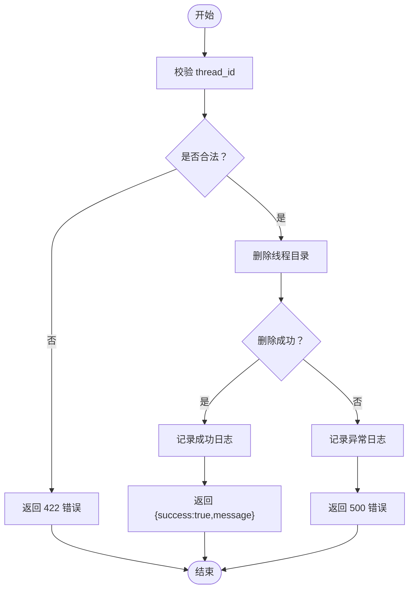
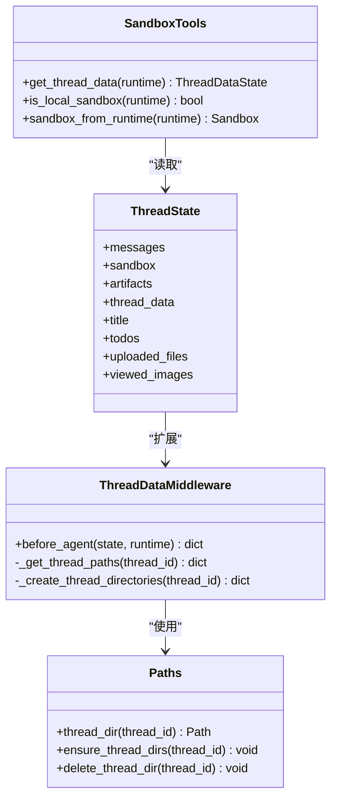
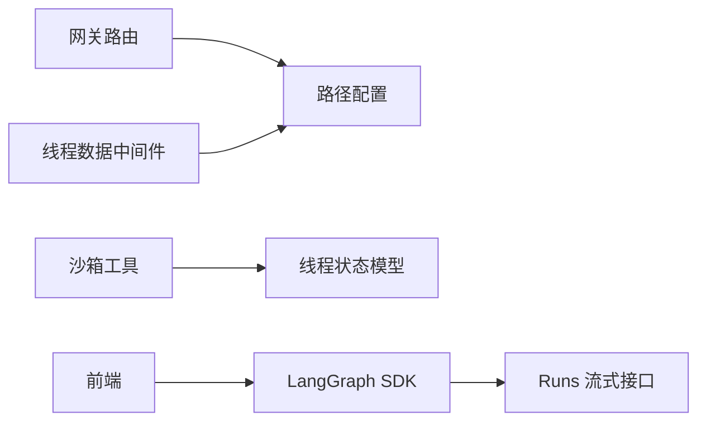

# 线程管理

<cite>
**本文引用的文件**
- [threads.py](file://backend/app/gateway/routers/threads.py)
- [paths.py](file://backend/packages/harness/deerflow/config/paths.py)
- [thread_state.py](file://backend/packages/harness/deerflow/agents/thread_state.py)
- [thread_data_middleware.py](file://backend/packages/harness/deerflow/agents/middlewares/thread_data_middleware.py)
- [aio_sandbox_provider.py](file://backend/packages/harness/deerflow/community/aio_sandbox/aio_sandbox_provider.py)
- [tools.py](file://backend/packages/harness/deerflow/sandbox/tools.py)
- [API.md](file://backend/docs/API.md)
- [ARCHITECTURE.md](file://backend/docs/ARCHITECTURE.md)
- [test_threads_router.py](file://backend/tests/test_threads_router.py)
- [manager.py](file://backend/app/channels/manager.py)
- [route.ts（前端线程历史）](file://frontend/src/app/mock/api/threads/[thread_id]/history/route.ts)
- [route.ts（前端线程搜索）](file://frontend/src/app/mock/api/threads/search/route.ts)
</cite>

## 目录
1. [简介](#简介)
2. [项目结构](#项目结构)
3. [核心组件](#核心组件)
4. [架构总览](#架构总览)
5. [详细组件分析](#详细组件分析)
6. [依赖分析](#依赖分析)
7. [性能考虑](#性能考虑)
8. [故障排查指南](#故障排查指南)
9. [结论](#结论)
10. [附录](#附录)

## 简介
本文件为“线程管理”功能的详细 API 文档，覆盖以下主题：
- 线程创建：通过 LangGraph SDK 创建线程，返回 thread_id。
- 线程状态获取：通过 LangGraph runs 流式接口获取 values 结构，理解其中 messages、sandbox、artifacts、thread_data、title 等字段的含义与用途。
- 线程清理：删除本地持久化数据（不涉及 LangGraph 状态），支持幂等与安全校验。
- 线程 ID 生成规则、生命周期管理与最佳实践。
- 提供 cURL 示例与错误处理指南。

## 项目结构
线程管理相关能力由后端网关路由、路径配置、中间件与 LangGraph SDK 共同实现；前端提供示例接口用于演示。

图表来源
- [threads.py:1-42](file://backend/app/gateway/routers/threads.py#L1-L42)
- [paths.py:12-243](file://backend/packages/harness/deerflow/config/paths.py#L12-L243)
- [thread_data_middleware.py:18-97](file://backend/packages/harness/deerflow/agents/middlewares/thread_data_middleware.py#L18-L97)
- [thread_state.py:48-56](file://backend/packages/harness/deerflow/agents/thread_state.py#L48-L56)
- [tools.py:539-636](file://backend/packages/harness/deerflow/sandbox/tools.py#L539-L636)
- [aio_sandbox_provider.py:352-427](file://backend/packages/harness/deerflow/community/aio_sandbox/aio_sandbox_provider.py#L352-L427)
- [API.md:570-632](file://backend/docs/API.md#L570-L632)

章节来源
- [threads.py:1-42](file://backend/app/gateway/routers/threads.py#L1-L42)
- [paths.py:12-243](file://backend/packages/harness/deerflow/config/paths.py#L12-L243)
- [thread_data_middleware.py:18-97](file://backend/packages/harness/deerflow/agents/middlewares/thread_data_middleware.py#L18-L97)
- [thread_state.py:48-56](file://backend/packages/harness/deerflow/agents/thread_state.py#L48-L56)
- [tools.py:539-636](file://backend/packages/harness/deerflow/sandbox/tools.py#L539-L636)
- [aio_sandbox_provider.py:352-427](file://backend/packages/harness/deerflow/community/aio_sandbox/aio_sandbox_provider.py#L352-L427)
- [API.md:570-632](file://backend/docs/API.md#L570-L632)

## 核心组件
- 网关路由（线程清理）
  - 路径：/api/threads/{thread_id}
  - 方法：DELETE
  - 功能：删除本地持久化线程目录（不删除 LangGraph 线程状态）
  - 响应：包含 success 与 message 的 JSON 对象
- 路径配置（Paths）
  - 提供线程目录结构解析、安全校验与删除逻辑
  - 支持线程目录的创建与权限设置
- 线程数据中间件（ThreadDataMiddleware）
  - 在运行前注入 thread_data（工作区、上传、输出目录路径）
  - 支持惰性/急切初始化策略
- 线程状态模型（ThreadState）
  - 扩展 AgentState，新增 sandbox、artifacts、thread_data、title、todos、uploaded_files、viewed_images 等字段
- 沙箱工具（Sandbox Tools）
  - 提供从运行时提取 thread_data、判断本地沙箱、从运行时获取沙箱实例等能力
- LangGraph SDK
  - 通过 client.threads.create() 创建线程并返回 thread_id
  - 通过 client.runs.stream(...) 获取 values 结构

章节来源
- [threads.py:19-41](file://backend/app/gateway/routers/threads.py#L19-L41)
- [paths.py:95-183](file://backend/packages/harness/deerflow/config/paths.py#L95-L183)
- [thread_data_middleware.py:46-96](file://backend/packages/harness/deerflow/agents/middlewares/thread_data_middleware.py#L46-L96)
- [thread_state.py:48-56](file://backend/packages/harness/deerflow/agents/thread_state.py#L48-L56)
- [tools.py:539-636](file://backend/packages/harness/deerflow/sandbox/tools.py#L539-L636)
- [API.md:570-585](file://backend/docs/API.md#L570-L585)

## 架构总览
线程管理在系统中的交互流程如下：

图表来源
- [threads.py:34-41](file://backend/app/gateway/routers/threads.py#L34-L41)
- [paths.py:175-183](file://backend/packages/harness/deerflow/config/paths.py#L175-L183)
- [API.md:570-585](file://backend/docs/API.md#L570-L585)

## 详细组件分析

### 组件一：线程创建（Create Thread）
- 请求方式与地址
  - 方法：POST
  - 地址：/api/langgraph/threads
  - 内容类型：application/json
- 请求体
  - 无参数（空对象 {}）
- 响应体
  - 返回值包含 thread_id 字段
- cURL 示例
  - 参考文档中的 cURL 示例，创建线程部分
- 注意事项
  - 该接口由 LangGraph SDK 提供，返回的 thread_id 用于后续 runs 流式调用

章节来源
- [API.md:570-585](file://backend/docs/API.md#L570-L585)
- [API.md:620-631](file://backend/docs/API.md#L620-L631)

### 组件二：获取线程状态（Get Thread State）
- 流式接口
  - 地址：/api/langgraph/threads/{thread_id}/runs/stream
  - 使用 EventSource 或 SDK 的 runs.stream
- values 结构字段说明
  - messages
    - 类型：消息数组
    - 含义：对话或推理过程中的消息序列
  - sandbox
    - 类型：字典
    - 含义：当前沙箱环境信息（如 sandbox_id）
  - artifacts
    - 类型：字符串数组
    - 含义：本次或累计生成的产物文件路径列表（去重合并）
  - thread_data
    - 类型：字典
    - 字段：
      - workspace_path：工作区路径
      - uploads_path：上传文件路径
      - outputs_path：输出产物路径
    - 含义：线程相关的三类目录路径（宿主机与沙箱映射）
  - title
    - 类型：字符串或空
    - 含义：自动生成的会话标题
- cURL 示例
  - 参考文档中的 cURL 示例，运行 agent 部分

章节来源
- [thread_state.py:48-56](file://backend/packages/harness/deerflow/agents/thread_state.py#L48-L56)
- [thread_state.py:10-14](file://backend/packages/harness/deerflow/agents/thread_state.py#L10-L14)
- [API.md:570-585](file://backend/docs/API.md#L570-L585)
- [API.md:620-631](file://backend/docs/API.md#L620-L631)

### 组件三：线程清理（Delete Thread Data）
- 请求方式与地址
  - 方法：DELETE
  - 地址：/api/threads/{thread_id}
- 输入
  - 路径参数：thread_id（仅允许字母数字、连字符、下划线，且不能包含路径遍历片段）
- 处理流程
  - 校验 thread_id 安全性
  - 删除线程目录（幂等）
  - 记录日志并返回 JSON 响应
- 响应
  - 成功：success=true，message=描述信息
  - 失败：
    - 422：thread_id 不合法
    - 500：删除过程中发生异常（日志记录）
- cURL 示例
  - 参考文档中的 cURL 示例，上传文件部分（可类比构造 DELETE）

图表来源
- [threads.py:19-31](file://backend/app/gateway/routers/threads.py#L19-L31)
- [paths.py:95-108](file://backend/packages/harness/deerflow/config/paths.py#L95-L108)
- [paths.py:175-183](file://backend/packages/harness/deerflow/config/paths.py#L175-L183)

章节来源
- [threads.py:19-41](file://backend/app/gateway/routers/threads.py#L19-L41)
- [paths.py:95-108](file://backend/packages/harness/deerflow/config/paths.py#L95-L108)
- [paths.py:175-183](file://backend/packages/harness/deerflow/config/paths.py#L175-L183)
- [test_threads_router.py:11-39](file://backend/tests/test_threads_router.py#L11-L39)
- [test_threads_router.py:41-49](file://backend/tests/test_threads_router.py#L41-L49)
- [test_threads_router.py:82-94](file://backend/tests/test_threads_router.py#L82-L94)
- [test_threads_router.py:96-109](file://backend/tests/test_threads_router.py#L96-L109)

### 组件四：线程 ID 生成规则与生命周期管理
- 线程 ID 生成规则
  - 仅允许字符：字母、数字、连字符、下划线
  - 不允许路径遍历片段（如 ..、/）
  - 违规将触发 422 错误
- 生命周期管理
  - 创建：LangGraph SDK 创建线程并返回 thread_id
  - 运行：通过 runs.stream 获取 values 等状态
  - 清理：调用 /api/threads/{thread_id} 删除本地持久化数据
  - 注意：LangGraph 线程状态删除由 LangGraph API 负责，网关清理不涉及
- 最佳实践
  - 使用惰性初始化（默认）以减少不必要的磁盘 IO
  - 在需要时再创建目录，避免资源浪费
  - 严格校验 thread_id，防止路径遍历攻击
  - 清理操作幂等，可重复执行

章节来源
- [paths.py:95-108](file://backend/packages/harness/deerflow/config/paths.py#L95-L108)
- [thread_data_middleware.py:33-44](file://backend/packages/harness/deerflow/agents/middlewares/thread_data_middleware.py#L33-L44)
- [threads.py:34-41](file://backend/app/gateway/routers/threads.py#L34-L41)

### 组件五：线程数据注入与沙箱集成
- 线程数据注入
  - 中间件在 before_agent 阶段根据 thread_id 注入 thread_data（工作区、上传、输出路径）
  - 支持惰性/急切两种初始化策略
- 沙箱集成
  - 工具函数从运行时提取 thread_data、判断本地沙箱、按需获取/初始化沙箱实例
  - 沙箱提供者支持确定性容器名（基于 thread_id），便于复用与发现

图表来源
- [thread_data_middleware.py:46-96](file://backend/packages/harness/deerflow/agents/middlewares/thread_data_middleware.py#L46-L96)
- [paths.py:95-183](file://backend/packages/harness/deerflow/config/paths.py#L95-L183)
- [thread_state.py:48-56](file://backend/packages/harness/deerflow/agents/thread_state.py#L48-L56)
- [tools.py:539-636](file://backend/packages/harness/deerflow/sandbox/tools.py#L539-L636)

章节来源
- [thread_data_middleware.py:18-97](file://backend/packages/harness/deerflow/agents/middlewares/thread_data_middleware.py#L18-L97)
- [paths.py:153-173](file://backend/packages/harness/deerflow/config/paths.py#L153-L173)
- [tools.py:539-636](file://backend/packages/harness/deerflow/sandbox/tools.py#L539-L636)

### 组件六：前端线程历史与搜索（参考）
- 历史接口
  - 路由：/api/threads/[thread_id]/history
  - 行为：读取 demo 数据目录下的 thread.json 并返回
- 搜索接口
  - 路由：/api/threads/search
  - 行为：列出 demo 数据目录下的线程并支持分页与排序

章节来源
- [route.ts（前端线程历史）:1-20](file://frontend/src/app/mock/api/threads/[thread_id]/history/route.ts#L1-L20)
- [route.ts（前端线程搜索）:1-44](file://frontend/src/app/mock/api/threads/search/route.ts#L1-L44)

## 依赖分析
- 组件耦合
  - 网关路由依赖路径配置进行安全校验与删除
  - 中间件依赖路径配置创建/获取线程目录
  - 沙箱工具依赖运行时状态读取 thread_data
- 外部依赖
  - LangGraph SDK 负责线程创建与运行流式接口
  - 前端通过 EventSource 或 SDK 订阅流式事件

图表来源
- [threads.py:1-42](file://backend/app/gateway/routers/threads.py#L1-L42)
- [paths.py:12-243](file://backend/packages/harness/deerflow/config/paths.py#L12-L243)
- [thread_data_middleware.py:18-97](file://backend/packages/harness/deerflow/agents/middlewares/thread_data_middleware.py#L18-L97)
- [thread_state.py:48-56](file://backend/packages/harness/deerflow/agents/thread_state.py#L48-L56)
- [tools.py:539-636](file://backend/packages/harness/deerflow/sandbox/tools.py#L539-L636)
- [API.md:570-602](file://backend/docs/API.md#L570-L602)

章节来源
- [threads.py:1-42](file://backend/app/gateway/routers/threads.py#L1-L42)
- [paths.py:12-243](file://backend/packages/harness/deerflow/config/paths.py#L12-L243)
- [thread_data_middleware.py:18-97](file://backend/packages/harness/deerflow/agents/middlewares/thread_data_middleware.py#L18-L97)
- [thread_state.py:48-56](file://backend/packages/harness/deerflow/agents/thread_state.py#L48-L56)
- [tools.py:539-636](file://backend/packages/harness/deerflow/sandbox/tools.py#L539-L636)
- [API.md:570-602](file://backend/docs/API.md#L570-L602)

## 性能考虑
- 惰性初始化：默认惰性初始化可减少不必要的磁盘 IO 与权限变更
- 目录权限：确保目录权限为 0o777，避免沙箱容器写入时报错
- 沙箱复用：基于 thread_id 的确定性容器名可提升复用率，降低冷启动成本
- 幂等删除：清理接口幂等，避免重复调用带来的副作用

## 故障排查指南
- 422 错误（无效 thread_id）
  - 触发条件：thread_id 包含非法字符或路径遍历片段
  - 处理建议：检查 thread_id 是否仅包含字母、数字、连字符、下划线
- 500 错误（删除失败）
  - 触发条件：删除线程目录时发生异常（如权限问题）
  - 处理建议：检查后端进程对 base_dir 的写权限；确认路径解析正确
- 404 错误（路由层）
  - 触发条件：路由匹配不到对应处理器（通常与路径拼写有关）
  - 处理建议：确认请求路径与路由定义一致

章节来源
- [paths.py:95-108](file://backend/packages/harness/deerflow/config/paths.py#L95-L108)
- [threads.py:24-28](file://backend/app/gateway/routers/threads.py#L24-L28)
- [test_threads_router.py:41-49](file://backend/tests/test_threads_router.py#L41-L49)
- [test_threads_router.py:69-79](file://backend/tests/test_threads_router.py#L69-L79)
- [test_threads_router.py:82-94](file://backend/tests/test_threads_router.py#L82-L94)
- [test_threads_router.py:96-109](file://backend/tests/test_threads_router.py#L96-L109)

## 结论
- 线程管理由 LangGraph SDK 与后端网关共同协作完成
- 网关负责本地持久化数据的清理，LangGraph 负责线程状态的维护
- 通过中间件与路径配置，系统实现了安全、可扩展的线程数据目录管理
- 建议遵循惰性初始化、严格校验与幂等删除的最佳实践

## 附录

### API 一览（线程相关）
- 创建线程
  - 方法：POST
  - 地址：/api/langgraph/threads
  - 请求体：{}
  - 响应：包含 thread_id
- 获取线程状态（values）
  - 方法：GET（EventSource）或 SDK 流式
  - 地址：/api/langgraph/threads/{thread_id}/runs/stream
  - 响应：事件流，values 包含 messages、sandbox、artifacts、thread_data、title 等
- 清理线程数据
  - 方法：DELETE
  - 地址：/api/threads/{thread_id}
  - 请求体：无
  - 响应：{success, message}

章节来源
- [API.md:570-602](file://backend/docs/API.md#L570-L602)
- [API.md:620-631](file://backend/docs/API.md#L620-L631)
- [threads.py:34-41](file://backend/app/gateway/routers/threads.py#L34-L41)