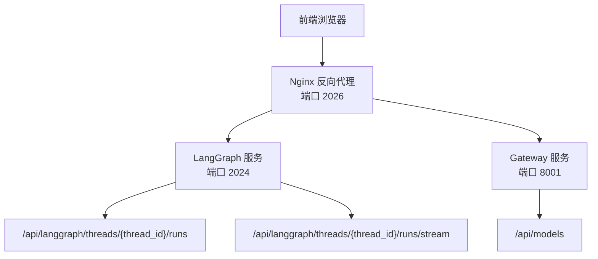
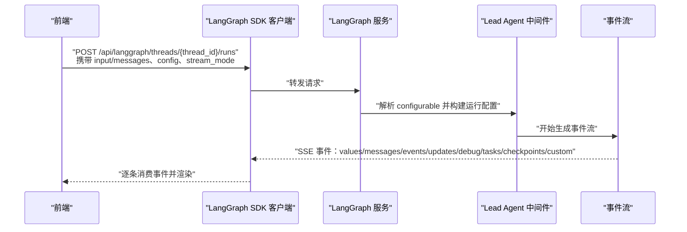
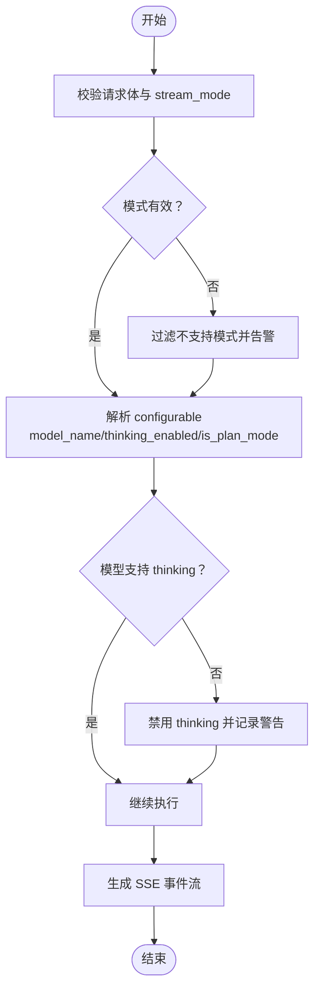
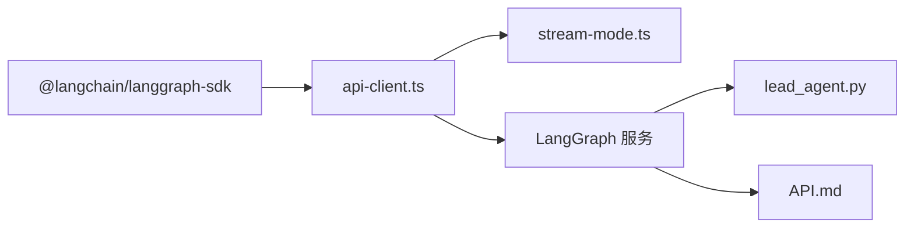

# 创建运行

<cite>
**本文引用的文件**
- [API.md](file://backend/docs/API.md)
- [stream-mode.ts](file://frontend/src/core/api/stream-mode.ts)
- [lead_agent.py](file://backend/packages/harness/deerflow/agents/lead_agent/agent.py)
- [manager.py](file://backend/app/channels/manager.py)
- [api-client.ts](file://frontend/src/core/api/api-client.ts)
- [chat.sh](file://skills/public/claude-to-deerflow/scripts/chat.sh)
- [ARCHITECTURE.md](file://backend/docs/ARCHITECTURE.md)
- [pyproject.toml](file://backend/pyproject.toml)
</cite>

## 目录
1. [简介](#简介)
2. [项目结构](#项目结构)
3. [核心组件](#核心组件)
4. [架构总览](#架构总览)
5. [详细组件分析](#详细组件分析)
6. [依赖分析](#依赖分析)
7. [性能考虑](#性能考虑)
8. [故障排查指南](#故障排查指南)
9. [结论](#结论)

## 简介
本文件面向“创建运行”接口，即 POST /api/langgraph/threads/{thread_id}/runs 的完整 API 规范与使用说明。内容涵盖：
- 请求体 input.messages 的消息格式与字段语义
- configurable 配置项 model_name、thinking_enabled、is_plan_mode 的作用与使用场景
- stream_mode 兼容模式列表及其行为差异
- 完整的请求与响应示例路径
- 前后端交互流程与错误处理要点

## 项目结构
该系统通过 Nginx 统一入口分发到 LangGraph 服务与 Gateway 服务：
- 前端通过 LangGraph SDK 客户端调用 /api/langgraph 路由
- LangGraph 服务负责代理实际的 /api/langgraph/* 接口（含 runs）
- Gateway 服务提供模型、MCP、技能等其他 API

图表来源
- [ARCHITECTURE.md:5-51](file://backend/docs/ARCHITECTURE.md#L5-L51)

章节来源
- [ARCHITECTURE.md:5-51](file://backend/docs/ARCHITECTURE.md#L5-L51)

## 核心组件
- LangGraph 运行接口：接收 input.messages 与 configurable 配置，返回 SSE 流事件
- 前端流模式适配：对不支持的 stream_mode 进行过滤与告警
- Lead Agent 中间件：解析 configurable 并应用模型选择、思维模式与计划模式

章节来源
- [API.md:66-120](file://backend/docs/API.md#L66-L120)
- [stream-mode.ts:1-68](file://frontend/src/core/api/stream-mode.ts#L1-L68)
- [lead_agent.py:273-298](file://backend/packages/harness/deerflow/agents/lead_agent/agent.py#L273-L298)

## 架构总览
下图展示从前端发起“创建运行”请求到 LangGraph 服务处理并返回 SSE 的关键步骤。

图表来源
- [API.md:66-120](file://backend/docs/API.md#L66-L120)
- [lead_agent.py:273-298](file://backend/packages/harness/deerflow/agents/lead_agent/agent.py#L273-L298)
- [stream-mode.ts:1-68](file://frontend/src/core/api/stream-mode.ts#L1-L68)

## 详细组件分析

### 接口定义：POST /api/langgraph/threads/{thread_id}/runs
- 方法与路径：POST /api/langgraph/threads/{thread_id}/runs
- 内容类型：application/json
- 功能：执行指定线程上的智能体运行，返回 Server-Sent Events 流

请求体字段
- input
  - messages：数组，元素为消息对象
    - role：字符串，取值范围包含 user、assistant、system、tool 等（具体以 LangGraph 协议为准）
    - content：字符串或结构化内容（如文本块列表），用于承载用户输入或工具输出
- config：可选
  - configurable：键值对
    - model_name：字符串，覆盖默认模型名称
    - thinking_enabled：布尔，启用受支持模型的扩展思考能力
    - is_plan_mode：布尔，启用任务清单中间件进行计划跟踪
- stream_mode：字符串或字符串数组，控制事件流输出粒度与类型
  - 兼容模式：values、messages、messages-tuple、updates、events、debug、tasks、checkpoints、custom
  - 不建议使用：tools（当前 langgraph-api 中已废弃）

响应：Server-Sent Events（SSE）流，事件类型与数据结构遵循 LangGraph 协议

章节来源
- [API.md:66-120](file://backend/docs/API.md#L66-L120)

### 输入消息格式：messages 数组
- role 支持的常见取值（依据 LangGraph 协议与前端消息类型映射）：
  - user：用户输入
  - assistant：AI 输出
  - system：系统提示或上下文
  - tool：工具调用结果
- content 字段
  - 字符串：纯文本
  - 结构化：文本块列表或其他结构化内容（前端会按类型提取文本）

章节来源
- [API.md:77-97](file://backend/docs/API.md#L77-L97)
- [manager.py:84-100](file://backend/app/channels/manager.py#L84-L100)

### configurable 配置项详解
- model_name
  - 作用：在请求级别覆盖默认模型名称，优先于 Agent 配置与全局默认
  - 使用场景：多模型对比、临时切换模型、按线程定制
- thinking_enabled
  - 作用：启用受支持模型的扩展思考能力；若模型不支持，将自动降级
  - 使用场景：需要更强推理能力的任务（如复杂计算、深度分析）
- is_plan_mode
  - 作用：启用任务清单中间件，便于任务跟踪与后续处理
  - 使用场景：需要将对话转化为可追踪的待办事项

章节来源
- [API.md:103-107](file://backend/docs/API.md#L103-L107)
- [lead_agent.py:273-298](file://backend/packages/harness/deerflow/agents/lead_agent/agent.py#L273-L298)

### stream_mode 兼容性与行为
- 兼容模式（可安全使用）：
  - values：全量状态快照（包含 messages、title、artifacts 等）
  - messages：单条消息事件（content、role 等）
  - messages-tuple：消息元组事件（AI 文本、工具调用、工具结果等）
  - updates：增量更新事件
  - events：通用事件
  - debug：调试事件
  - tasks：任务相关事件
  - checkpoints：检查点事件
  - custom：自定义事件
- 不建议使用：
  - tools：当前 langgraph-api 已废弃，会导致校验错误

前端适配逻辑（当传入不支持的模式时会自动过滤并告警）：
- 对 streamMode 进行白名单过滤
- 记录并警告未被支持的模式
- 返回清洗后的模式集合

章节来源
- [API.md:99-101](file://backend/docs/API.md#L99-L101)
- [stream-mode.ts:1-68](file://frontend/src/core/api/stream-mode.ts#L1-L68)
- [api-client.ts:9-31](file://frontend/src/core/api/api-client.ts#L9-L31)

### 请求与响应示例
- 请求示例（路径）
  - [API.md 请求体示例:77-97](file://backend/docs/API.md#L77-L97)
  - [skills/chat.sh 请求体示例:70-90](file://skills/public/claude-to-deerflow/scripts/chat.sh#L70-L90)
- 响应示例（事件流片段）
  - [API.md SSE 示例:108-119](file://backend/docs/API.md#L108-L119)

章节来源
- [API.md:77-119](file://backend/docs/API.md#L77-L119)
- [chat.sh:70-90](file://skills/public/claude-to-deerflow/scripts/chat.sh#L70-L90)

### 处理流程与错误处理
- 前端层
  - SDK 客户端在调用 runs.stream 之前会对 streamMode 进行清洗与告警
  - 若传入不支持的模式，将被过滤并记录警告
- 后端层
  - LangGraph 服务根据请求体与 configurable 执行运行
  - 若模型不支持 thinking_enabled，将触发降级并记录警告
  - SSE 事件按 stream_mode 输出，直至 end 事件结束

图表来源
- [stream-mode.ts:1-68](file://frontend/src/core/api/stream-mode.ts#L1-L68)
- [lead_agent.py:273-298](file://backend/packages/harness/deerflow/agents/lead_agent/agent.py#L273-L298)
- [API.md:66-120](file://backend/docs/API.md#L66-L120)

章节来源
- [stream-mode.ts:1-68](file://frontend/src/core/api/stream-mode.ts#L1-L68)
- [lead_agent.py:273-298](file://backend/packages/harness/deerflow/agents/lead_agent/agent.py#L273-L298)
- [API.md:66-120](file://backend/docs/API.md#L66-L120)

## 依赖分析
- 前端依赖
  - @langchain/langgraph-sdk：用于与 LangGraph 服务通信
  - 自身实现的 stream-mode.ts 与 api-client.ts：负责模式清洗与客户端包装
- 后端依赖
  - langgraph-api、langgraph：LangGraph 运行时与 SDK
  - fastapi、sse-starlette：后端服务与 SSE 支持

图表来源
- [pyproject.toml:7-19](file://backend/pyproject.toml#L7-L19)
- [api-client.ts:1-37](file://frontend/src/core/api/api-client.ts#L1-L37)
- [stream-mode.ts:1-68](file://frontend/src/core/api/stream-mode.ts#L1-L68)
- [lead_agent.py:273-298](file://backend/packages/harness/deerflow/agents/lead_agent/agent.py#L273-L298)
- [API.md:66-120](file://backend/docs/API.md#L66-L120)

章节来源
- [pyproject.toml:7-19](file://backend/pyproject.toml#L7-L19)
- [api-client.ts:1-37](file://frontend/src/core/api/api-client.ts#L1-L37)
- [stream-mode.ts:1-68](file://frontend/src/core/api/stream-mode.ts#L1-L68)
- [lead_agent.py:273-298](file://backend/packages/harness/deerflow/agents/lead_agent/agent.py#L273-L298)
- [API.md:66-120](file://backend/docs/API.md#L66-L120)

## 性能考虑
- 合理选择 stream_mode：高频实时渲染建议使用 messages-tuple 或 messages；需要全量状态时使用 values
- 控制 messages 数组长度：避免过长的历史消息导致延迟与带宽压力
- thinking_enabled 仅在必要时开启：部分模型开启思考会增加耗时与成本
- is_plan_mode：任务清单中间件可能引入额外处理开销，按需启用

## 故障排查指南
- stream_mode 报错
  - 症状：使用 tools 等不支持模式导致校验失败
  - 处理：前端自动过滤不支持模式并告警；请改用 values、messages-tuple、custom 等
  - 参考：[stream-mode.ts:1-68](file://frontend/src/core/api/stream-mode.ts#L1-L68)
- thinking_enabled 不生效
  - 症状：启用 thinking 但模型不支持
  - 处理：后端会自动降级并记录警告；请更换支持思考的模型或关闭该选项
  - 参考：[lead_agent.py:296-298](file://backend/packages/harness/deerflow/agents/lead_agent/agent.py#L296-L298)
- 模型名称无效
  - 症状：请求中 model_name 未解析或未配置
  - 处理：确保配置文件中存在对应模型，或移除覆盖项使用默认模型
  - 参考：[lead_agent.py:286-296](file://backend/packages/harness/deerflow/agents/lead_agent/agent.py#L286-L296)
- SSE 事件缺失
  - 症状：未收到预期事件
  - 处理：确认 stream_mode 是否正确；检查网络与反向代理配置；查看 LangGraph 日志
  - 参考：[API.md:108-119](file://backend/docs/API.md#L108-L119)

章节来源
- [stream-mode.ts:1-68](file://frontend/src/core/api/stream-mode.ts#L1-L68)
- [lead_agent.py:273-298](file://backend/packages/harness/deerflow/agents/lead_agent/agent.py#L273-L298)
- [API.md:108-119](file://backend/docs/API.md#L108-L119)

## 结论
POST /api/langgraph/threads/{thread_id}/runs 提供了灵活可控的运行接口，结合 configurable 与 stream_mode 可满足多种业务场景。建议在前端使用 stream-mode.ts 对模式进行清洗，在后端根据模型能力与业务需求合理启用 thinking_enabled 与 is_plan_mode，并通过合适的 stream_mode 平衡实时性与资源消耗。