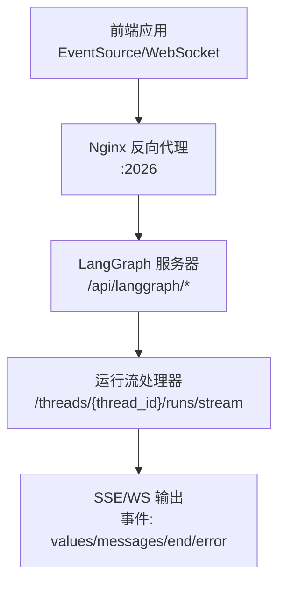
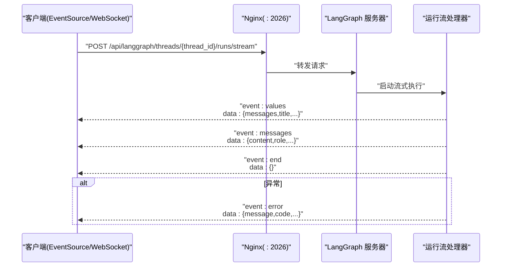
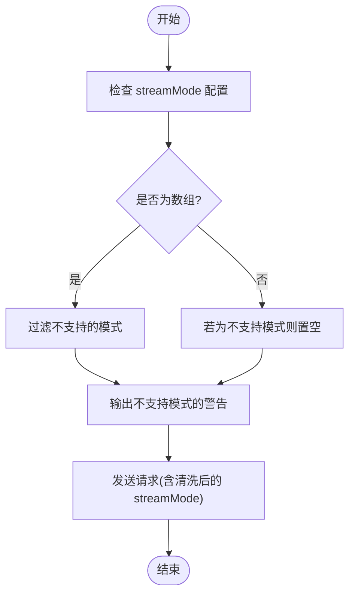
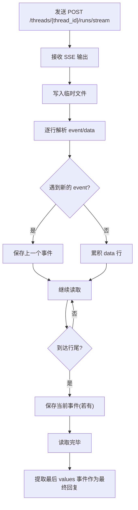
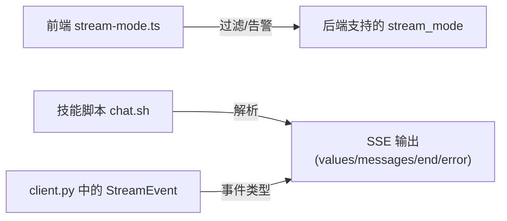

# 流式运行

<cite>
**本文引用的文件**
- [API.md](file://backend/docs/API.md)
- [client.py](file://backend/packages/harness/deerflow/client.py)
- [stream-mode.ts](file://frontend/src/core/api/stream-mode.ts)
- [stream-mode.test.ts](file://frontend/src/core/api/stream-mode.test.ts)
- [chat.sh](file://skills/public/claude-to-deerflow/scripts/chat.sh)
</cite>

## 目录
1. [简介](#简介)
2. [项目结构](#项目结构)
3. [核心组件](#核心组件)
4. [架构总览](#架构总览)
5. [详细组件分析](#详细组件分析)
6. [依赖关系分析](#依赖关系分析)
7. [性能考量](#性能考量)
8. [故障排查指南](#故障排查指南)
9. [结论](#结论)
10. [附录](#附录)

## 简介
本文件为流式运行接口的详细 API 文档，聚焦于 POST /api/langgraph/threads/{thread_id}/runs/stream 端点。内容涵盖：
- Server-Sent Events (SSE) 流式响应的数据格式与事件类型（values、messages、end、error 等）
- WebSocket 实时连接支持与 URL 规范
- 前端 EventSource 客户端实现要点与消息处理逻辑
- 错误处理与连接断开后的恢复机制建议
- 与后端 LangGraph 协议的一致性说明

## 项目结构
围绕流式运行接口的关键位置如下：
- 后端文档：包含 LangGraph API 的端点定义、请求体与 SSE 示例
- 客户端协议模型：定义了流式事件类型与数据结构
- 前端流模式校验：对不支持的 stream_mode 进行过滤与告警
- 技能脚本示例：展示如何使用 cURL 发送 SSE 流并解析最终结果

**图表来源**
- [API.md:140-151](file://backend/docs/API.md#L140-L151)

**章节来源**
- [API.md:1-151](file://backend/docs/API.md#L1-L151)

## 核心组件
- LangGraph SSE 协议事件类型
  - values：全量状态快照（如 messages、title 等）
  - messages：单条消息增量更新（如 AI 回复片段）
  - end：流结束标记
  - error：错误事件（见下节）
- WebSocket 支持
  - 连接地址：ws://localhost:2026/api/langgraph/threads/{thread_id}/runs/stream
- 前端流模式兼容性
  - 支持的 stream_mode 列表与不支持项的过滤逻辑
- 技能脚本示例
  - 使用 cURL 接收 SSE 并解析最终 values 事件

**章节来源**
- [API.md:140-151](file://backend/docs/API.md#L140-L151)
- [API.md:554-561](file://backend/docs/API.md#L554-L561)
- [client.py:57-73](file://backend/packages/harness/deerflow/client.py#L57-L73)
- [stream-mode.ts:1-68](file://frontend/src/core/api/stream-mode.ts#L1-L68)
- [chat.sh:97-138](file://skills/public/claude-to-deerflow/scripts/chat.sh#L97-L138)

## 架构总览
以下序列图展示了从客户端到后端的典型交互流程（SSE/WS），以及错误事件的传播路径。

**图表来源**
- [API.md:140-151](file://backend/docs/API.md#L140-L151)
- [client.py:57-73](file://backend/packages/harness/deerflow/client.py#L57-L73)

## 详细组件分析

### 端点规范：POST /api/langgraph/threads/{thread_id}/runs/stream
- 方法与路径
  - POST /api/langgraph/threads/{thread_id}/runs/stream
- 内容类型
  - application/json
- 请求体字段
  - input：输入消息数组等
  - config：可配置参数（如 model_name、thinking_enabled、is_plan_mode 等）
  - stream_mode：事件类型数组或标量，支持的值见“支持的流模式”
- 响应
  - Server-Sent Events 或 WebSocket 实时流
  - 事件类型：values、messages、end、error

**章节来源**
- [API.md:140-151](file://backend/docs/API.md#L140-L151)

### SSE 事件类型与数据结构
- values
  - 语义：全量状态快照（如 messages、title 等）
  - 典型 data 字段：messages、title 等
- messages
  - 语义：单条消息增量更新（如 AI 回复片段）
  - 典型 data 字段：content、role 等
- end
  - 语义：流结束
  - data：空对象
- error
  - 语义：发生错误
  - data：包含错误信息的对象（如 message、code 等）

上述事件类型与数据结构与 LangGraph SSE 协议保持一致。

**章节来源**
- [API.md:108-119](file://backend/docs/API.md#L108-L119)
- [client.py:57-73](file://backend/packages/harness/deerflow/client.py#L57-L73)

### WebSocket 支持与连接 URL
- WebSocket 地址
  - ws://localhost:2026/api/langgraph/threads/{thread_id}/runs/stream
- 说明
  - 与 SSE 共用同一后端处理器，事件类型与数据结构一致

**章节来源**
- [API.md:554-561](file://backend/docs/API.md#L554-L561)

### 前端 EventSource 客户端实现要点
- 使用 EventSource 订阅 SSE
  - 订阅路径：/api/langgraph/threads/{thread_id}/runs/stream
  - 处理 onmessage 事件，解析 event.data
- 流模式兼容性
  - 前端会过滤掉不被支持的 stream_mode，并发出警告
  - 支持的 stream_mode：values、messages、messages-tuple、updates、events、debug、tasks、checkpoints、custom
  - 不支持的 stream_mode（如 tools）会被丢弃

**图表来源**
- [stream-mode.ts:36-68](file://frontend/src/core/api/stream-mode.ts#L36-L68)

**章节来源**
- [API.md:99-101](file://backend/docs/API.md#L99-L101)
- [stream-mode.ts:1-68](file://frontend/src/core/api/stream-mode.ts#L1-L68)
- [stream-mode.test.ts:1-43](file://frontend/src/core/api/stream-mode.test.ts#L1-L43)

### 技能脚本中的 SSE 解析示例
- 使用 cURL 发送 POST 请求并接收 SSE
- 解析 SSE：提取最后一条 values 事件作为最终回复
- 步骤要点
  - 将 SSE 输出写入临时文件
  - 按 event/data 行解析，收集事件
  - 提取最后 values 事件的内容

**图表来源**
- [chat.sh:97-138](file://skills/public/claude-to-deerflow/scripts/chat.sh#L97-L138)

**章节来源**
- [chat.sh:97-138](file://skills/public/claude-to-deerflow/scripts/chat.sh#L97-L138)

### 错误处理与连接断开恢复机制
- 错误事件
  - 当运行过程中出现异常，后端会推送 event: error，data 包含错误信息
- 连接断开与重连
  - SSE：浏览器 EventSource 默认具备自动重连能力，可根据 Last-Event-ID 续传（需后端支持）
  - WebSocket：客户端应监听 close/error 事件，实现指数退避重连
- 最佳实践
  - 在前端记录最后一次成功事件的标识，用于断点续传
  - 对于关键业务，建议在客户端实现幂等处理，避免重复消费

**章节来源**
- [API.md:108-119](file://backend/docs/API.md#L108-L119)

## 依赖关系分析
- 前端流模式校验依赖后端支持的 stream_mode 列表
- 技能脚本示例依赖后端 SSE 输出格式
- 客户端协议模型与后端 LangGraph 协议保持一致

**图表来源**
- [stream-mode.ts:1-68](file://frontend/src/core/api/stream-mode.ts#L1-L68)
- [chat.sh:97-138](file://skills/public/claude-to-deerflow/scripts/chat.sh#L97-L138)
- [client.py:57-73](file://backend/packages/harness/deerflow/client.py#L57-L73)

**章节来源**
- [stream-mode.ts:1-68](file://frontend/src/core/api/stream-mode.ts#L1-L68)
- [chat.sh:97-138](file://skills/public/claude-to-deerflow/scripts/chat.sh#L97-L138)
- [client.py:57-73](file://backend/packages/harness/deerflow/client.py#L57-L73)

## 性能考量
- SSE/WS 的事件粒度
  - values 适合全量状态同步；messages 适合增量渲染
- 流模式选择
  - 仅启用必要的 stream_mode，减少带宽与解析成本
- 客户端缓冲与渲染
  - 对 messages 事件进行节流/合并，提升 UI 渲染性能
- 超时与背压
  - 后端应设置合理的超时与背压策略，避免长时间占用连接

## 故障排查指南
- 问题：收到不支持的 stream_mode 导致行为异常
  - 现象：部分事件未返回或被忽略
  - 处理：确认前端已过滤不支持的模式；后端日志中应有相应提示
- 问题：SSE/WS 连接频繁断开
  - 现象：EventSource/WS 主动关闭
  - 处理：检查网络稳定性；为客户端实现指数退避重连；必要时开启心跳
- 问题：最终结果缺失
  - 现象：仅收到中间事件，未见 end 或 error
  - 处理：确认后端是否正常结束；前端应以 end 为准终止处理；若无 end，结合超时策略进行兜底

**章节来源**
- [stream-mode.test.ts:1-43](file://frontend/src/core/api/stream-mode.test.ts#L1-L43)
- [API.md:108-119](file://backend/docs/API.md#L108-L119)

## 结论
POST /api/langgraph/threads/{thread_id}/runs/stream 提供了标准的 LangGraph SSE/WS 流式接口，事件类型与数据结构清晰明确。前端应遵循 stream_mode 兼容性规则，合理选择事件类型，并实现健壮的错误处理与重连机制，以获得稳定可靠的实时体验。

## 附录

### 支持的流模式清单
- values、messages、messages-tuple、updates、events、debug、tasks、checkpoints、custom
- 不支持的 stream_mode（如 tools）会被丢弃并触发告警

**章节来源**
- [API.md:99-101](file://backend/docs/API.md#L99-L101)
- [stream-mode.ts:1-68](file://frontend/src/core/api/stream-mode.ts#L1-L68)