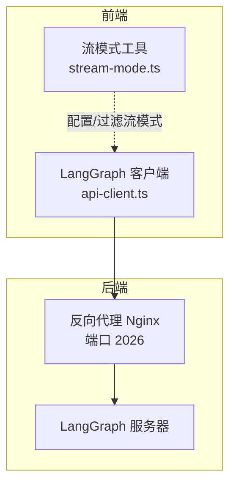
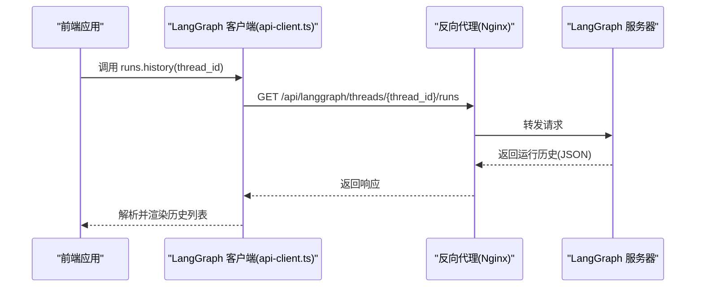
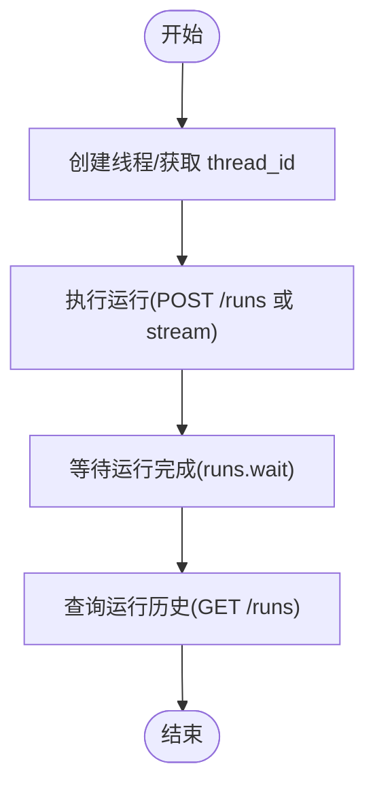
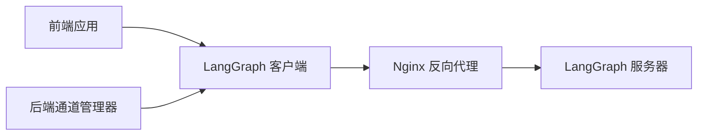

# 运行历史

<cite>
**本文引用的文件**
- [API.md](file://backend/docs/API.md)
- [API 客户端](file://frontend/src/core/api/api-client.ts)
- [流模式工具](file://frontend/src/core/api/stream-mode.ts)
- [LangGraph 客户端路由](file://frontend/src/app/mock/api/threads/[thread_id]/history/route.ts)
- [通道管理器](file://backend/app/channels/manager.py)
- [测试：通道](file://backend/tests/test_channels.py)
</cite>

## 目录
1. [简介](#简介)
2. [项目结构](#项目结构)
3. [核心组件](#核心组件)
4. [架构总览](#架构总览)
5. [详细组件分析](#详细组件分析)
6. [依赖关系分析](#依赖关系分析)
7. [性能考量](#性能考量)
8. [故障排查指南](#故障排查指南)
9. [结论](#结论)

## 简介
本文件面向“运行历史”接口，聚焦于 LangGraph API 的 GET /api/langgraph/threads/{thread_id}/runs 端点，提供完整的接口规范、响应结构说明、运行状态语义、响应示例与错误处理策略，并给出基于运行历史进行调试与问题排查的方法论。

## 项目结构
- 后端通过 Nginx 反向代理统一暴露 /api 前缀，其中 LangGraph API 暴露在 /api/langgraph 下，Gateway API 在 /api 下。
- 运行历史接口属于 LangGraph API 的一部分，由 LangGraph 服务直接提供；前端通过 LangGraph SDK 客户端访问该接口。
- 测试用例展示了运行等待（runs.wait）与运行历史（history）在通道管理器中的使用方式，有助于理解运行生命周期与历史数据来源。

图表来源
- [API 客户端:1-37](file://frontend/src/core/api/api-client.ts#L1-L37)
- [流模式工具:1-68](file://frontend/src/core/api/stream-mode.ts#L1-L68)

章节来源
- [API.md:14-151](file://backend/docs/API.md#L14-L151)

## 核心组件
- 接口定义：GET /api/langgraph/threads/{thread_id}/runs
- 返回体：包含 runs 数组，数组元素为运行对象，字段包括 run_id、status、created_at
- 错误响应：遵循统一格式，常见状态码 404（资源不存在）、422（参数校验失败）、500（服务器内部错误）

章节来源
- [API.md:121-138](file://backend/docs/API.md#L121-L138)

## 架构总览
下图展示从前端到 LangGraph 服务器的调用链路，以及与通道管理器的关系（通道管理器在后端负责协调 runs.wait 与 runs.stream 等操作，便于理解运行历史的生成时机）。

图表来源
- [API 客户端:1-37](file://frontend/src/core/api/api-client.ts#L1-L37)
- [API.md:121-138](file://backend/docs/API.md#L121-L138)

## 详细组件分析

### 接口规范：GET /api/langgraph/threads/{thread_id}/runs
- 方法与路径
  - 方法：GET
  - 路径：/api/langgraph/threads/{thread_id}/runs
- 请求参数
  - 路径参数：thread_id（线程标识符）
- 响应体
  - 结构：包含 runs 数组
  - 数组元素（运行对象）字段：
    - run_id：运行标识符（字符串）
    - status：运行状态（字符串）
    - created_at：创建时间（ISO 8601 字符串）
- 示例响应
  - 参考：[API.md:128-138](file://backend/docs/API.md#L128-L138)

章节来源
- [API.md:121-138](file://backend/docs/API.md#L121-L138)

### 运行状态语义
- status 字段取值与含义（基于仓库文档与通用实践）
  - success：表示该次运行成功完成
  - pending：表示运行尚未开始或仍在排队
  - running：表示运行正在进行中
  - failed：表示运行过程中发生错误而终止
  - cancelled：表示运行被取消
- 注意：具体可用值以 LangGraph 实际返回为准；若发现未列出的状态，请以实际响应为准并记录以便后续兼容

章节来源
- [API.md:128-138](file://backend/docs/API.md#L128-L138)

### 响应示例
- 成功示例（单个运行）
  - 参考：[API.md:128-138](file://backend/docs/API.md#L128-L138)
- 多个运行的历史列表
  - 参考：[API.md:128-138](file://backend/docs/API.md#L128-L138)

章节来源
- [API.md:128-138](file://backend/docs/API.md#L128-L138)

### 错误处理
- 统一错误格式
  - 结构：{"detail": "错误消息"}
- 常见状态码
  - 404：未找到指定 thread_id 对应的运行历史
  - 422：thread_id 参数无效（如包含非法字符）
  - 500：LangGraph 服务器内部错误
- 建议处理流程
  - 对 404：提示用户检查 thread_id 是否正确，或确认该线程是否存在历史
  - 对 422：提示用户修正 thread_id 格式
  - 对 500：重试请求或联系管理员，并记录日志

章节来源
- [API.md:508-523](file://backend/docs/API.md#L508-L523)

### 与通道管理器及运行生命周期的关系
- 通道管理器在后端负责协调 runs.wait 与 runs.stream 等操作，这有助于理解运行历史的生成时机与状态流转
- 测试用例展示了 runs.wait 的使用方式，可作为理解运行历史来源的参考

图表来源
- [通道管理器:360-394](file://backend/app/channels/manager.py#L360-L394)
- [测试：通道:1331-1450](file://backend/tests/test_channels.py#L1331-L1450)

章节来源
- [通道管理器:360-394](file://backend/app/channels/manager.py#L360-L394)
- [测试：通道:1331-1450](file://backend/tests/test_channels.py#L1331-L1450)

### 前端集成要点
- LangGraph 客户端封装
  - 前端通过 LangGraph SDK 客户端访问 LangGraph API，客户端会自动拼接基础 URL 并转发请求
  - 参考：[API 客户端:1-37](file://frontend/src/core/api/api-client.ts#L1-L37)
- 流模式兼容性
  - 前端对不支持的流模式进行过滤与告警，虽然与运行历史无直接关系，但体现了对 LangGraph 协议的兼容处理
  - 参考：[流模式工具:1-68](file://frontend/src/core/api/stream-mode.ts#L1-L68)

章节来源
- [API 客户端:1-37](file://frontend/src/core/api/api-client.ts#L1-L37)
- [流模式工具:1-68](file://frontend/src/core/api/stream-mode.ts#L1-L68)

### 历史数据的前端消费示例
- 前端 mock 路由演示了如何读取本地 demo 数据并返回历史结构，便于理解历史数据的组织形式
- 参考：[LangGraph 客户端路由:1-20](file://frontend/src/app/mock/api/threads/[thread_id]/history/route.ts#L1-L20)

章节来源
- [LangGraph 客户端路由:1-20](file://frontend/src/app/mock/api/threads/[thread_id]/history/route.ts#L1-L20)

## 依赖关系分析
- 前端依赖 LangGraph SDK 客户端进行 API 访问
- 反向代理将 /api/langgraph/* 请求转发至 LangGraph 服务器
- 后端通道管理器与 LangGraph SDK 协作，支撑运行等待与流式输出等能力

图表来源
- [API 客户端:1-37](file://frontend/src/core/api/api-client.ts#L1-L37)
- [通道管理器:384-394](file://backend/app/channels/manager.py#L384-L394)

章节来源
- [API 客户端:1-37](file://frontend/src/core/api/api-client.ts#L1-L37)
- [通道管理器:384-394](file://backend/app/channels/manager.py#L384-L394)

## 性能考量
- 历史查询通常为轻量级读操作，建议在前端缓存最近一次查询结果，避免频繁重复请求
- 当 runs 数组较大时，建议分页或限制返回条数，以减少网络与渲染压力
- 对于高频查询场景，可在网关层增加合理的缓存策略（需结合部署环境配置）

## 故障排查指南
- 无法获取运行历史
  - 检查 thread_id 是否有效且存在历史
  - 查看是否返回 404 或 422，并按错误处理建议修正
- 响应异常或状态缺失
  - 确认 LangGraph 服务器正常运行
  - 若返回 500，尝试重试并记录日志
- 历史为空或不完整
  - 确认运行已结束（非 pending/running），再发起历史查询
  - 检查运行是否被取消或失败，这些状态也应体现在历史中
- 调试步骤建议
  - 使用 cURL 直接调用接口验证响应结构与状态码
  - 在前端控制台查看网络请求与响应详情
  - 结合通道管理器的 runs.wait 行为，确认运行是否已完成

章节来源
- [API.md:508-523](file://backend/docs/API.md#L508-L523)
- [测试：通道:1331-1450](file://backend/tests/test_channels.py#L1331-L1450)

## 结论
GET /api/langgraph/threads/{thread_id}/runs 提供了查询指定线程运行历史的能力，返回的 runs 数组可用于展示运行概览与状态。结合 LangGraph 服务器的运行生命周期与前端 SDK 的集成方式，可以稳定地构建基于历史的调试与排障流程。建议在生产环境中关注错误处理、缓存与限流策略，以提升用户体验与系统稳定性。