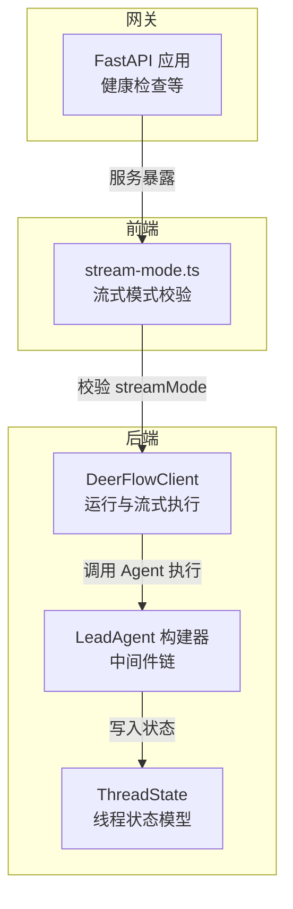
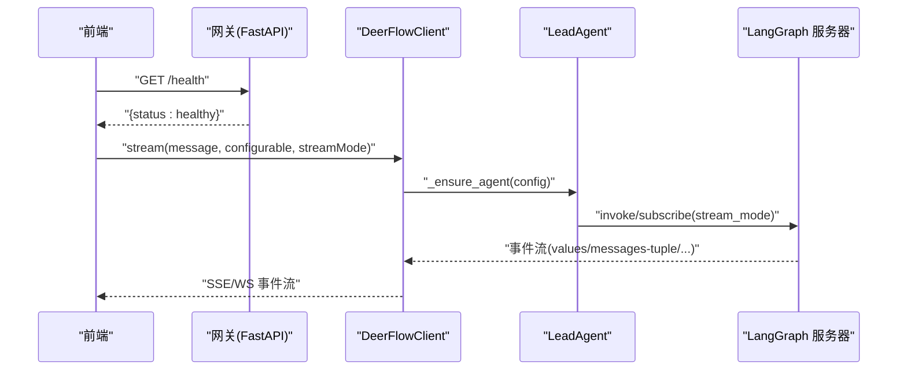
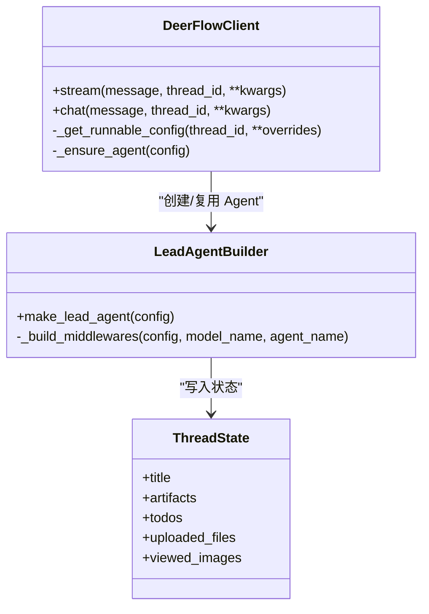
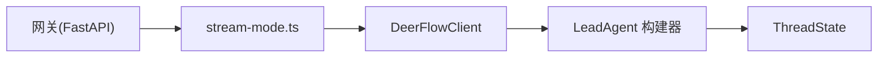
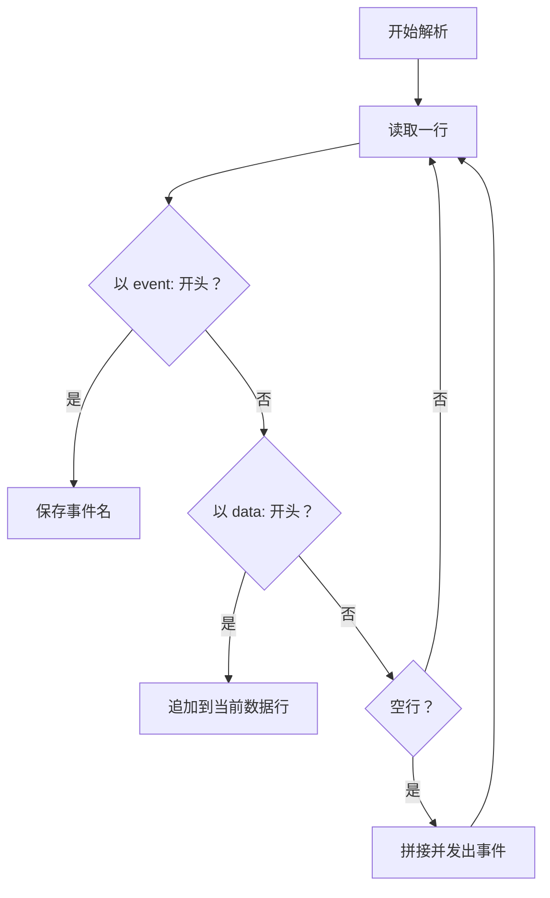

# 运行执行

<cite>
**本文引用的文件**
- [client.py](file://backend/packages/harness/deerflow/client.py)
- [agent.py](file://backend/packages/harness/deerflow/agents/lead_agent/agent.py)
- [thread_state.py](file://backend/packages/harness/deerflow/agents/thread_state.py)
- [stream-mode.ts](file://frontend/src/core/api/stream-mode.ts)
- [stream-mode.test.ts](file://frontend/src/core/api/stream-mode.test.ts)
- [app.py](file://backend/app/gateway/app.py)
- [agents.py](file://backend/app/gateway/routers/agents.py)
- [threads.py](file://backend/app/gateway/routers/threads.py)
- [task_tool.py](file://backend/packages/harness/deerflow/tools/builtins/task_tool.py)
- [chat.sh](file://skills/public/claude-to-deerflow/scripts/chat.sh)
</cite>

## 目录
1. [简介](#简介)
2. [项目结构](#项目结构)
3. [核心组件](#核心组件)
4. [架构总览](#架构总览)
5. [详细组件分析](#详细组件分析)
6. [依赖分析](#依赖分析)
7. [性能考虑](#性能考虑)
8. [故障排查指南](#故障排查指南)
9. [结论](#结论)
10. [附录：API 规范与示例](#附录api-规范与示例)

## 简介
本章节面向需要在 DeerFlow 中执行“运行”（Run）与“流式运行”（Stream Run）的开发者，提供从消息输入格式、可配置参数、流式模式到 SSE/WS 实时通信的完整 API 文档。文档同时覆盖前端对流式模式的校验与过滤逻辑，并给出请求与响应解析要点。

## 项目结构
围绕“运行执行”的相关模块主要分布在后端 Harness 客户端与前端流式模式工具中：
- 后端嵌入式客户端：负责构建 Agent、注入中间件、生成事件流
- 前端流式模式工具：定义并校验支持的流式模式集合
- 网关应用与路由：提供健康检查等网关能力；LangGraph 请求由反向代理转发

图表来源
- [client.py:75-240](file://backend/packages/harness/deerflow/client.py#L75-L240)
- [agent.py:208-265](file://backend/packages/harness/deerflow/agents/lead_agent/agent.py#L208-L265)
- [thread_state.py:48-56](file://backend/packages/harness/deerflow/agents/thread_state.py#L48-L56)
- [stream-mode.ts:1-68](file://frontend/src/core/api/stream-mode.ts#L1-L68)
- [app.py:187-196](file://backend/app/gateway/app.py#L187-L196)

章节来源
- [app.py:73-196](file://backend/app/gateway/app.py#L73-L196)

## 核心组件
- 运行执行客户端（DeerFlowClient）
  - 提供同步与流式两种执行方式，内部通过 RunnableConfig 注入可配置项（如模型名、思维模式、计划模式、子代理开关等），并按需创建 Agent 与中间件链。
- Lead Agent 构建器
  - 按配置动态组装中间件链，包括记忆、标题生成、任务管理（计划模式）、循环检测、图像视图、工具错误处理等。
- 线程状态模型（ThreadState）
  - 定义线程上下文中的标题、工件、待办、上传文件、已查看图片等字段及合并策略。
- 前端流式模式工具（stream-mode.ts）
  - 维护支持的流式模式集合，对请求中的 streamMode 进行过滤与告警提示。

章节来源
- [client.py:75-240](file://backend/packages/harness/deerflow/client.py#L75-L240)
- [agent.py:208-265](file://backend/packages/harness/deerflow/agents/lead_agent/agent.py#L208-L265)
- [thread_state.py:48-56](file://backend/packages/harness/deerflow/agents/thread_state.py#L48-L56)
- [stream-mode.ts:1-68](file://frontend/src/core/api/stream-mode.ts#L1-L68)

## 架构总览
下图展示一次“流式运行”的端到端流程：前端发起请求（含 streamMode 与可选 configurable），后端根据配置构建 Agent 并返回事件流（SSE/WS）。LangGraph 请求由反向代理转发至 LangGraph Server，网关提供健康检查等辅助能力。

图表来源
- [app.py:187-196](file://backend/app/gateway/app.py#L187-L196)
- [client.py:185-240](file://backend/packages/harness/deerflow/client.py#L185-L240)
- [agent.py:268-344](file://backend/packages/harness/deerflow/agents/lead_agent/agent.py#L268-L344)

## 详细组件分析

### 运行执行 API 规范（Create Run 与 Stream Run）

- 路径与方法
  - Create Run：POST /api/threads/{thread_id}/runs
  - Stream Run：GET /api/threads/{thread_id}/runs/stream
- 输入参数
  - message：用户输入文本（字符串）
  - configurable：可选对象，包含以下键
    - model_name：字符串，指定模型名称（若无效则回退到默认模型）
    - thinking_enabled：布尔，启用模型扩展思考能力（受模型能力限制）
    - is_plan_mode：布尔，启用计划模式（TodoList 中间件）
    - subagent_enabled：布尔，允许子代理并发执行
    - recursion_limit：整数，递归深度限制（默认 100）
    - thread_id：字符串，会话线程标识（用于状态持久化与文件隔离）
  - streamMode：字符串或字符串数组，支持的模式见下节
- 响应
  - Create Run：返回最终文本或聚合结果（具体取决于后端实现）
  - Stream Run：SSE/WS 事件流，事件类型与数据结构见下节

章节来源
- [client.py:185-240](file://backend/packages/harness/deerflow/client.py#L185-L240)
- [client.py:312-444](file://backend/packages/harness/deerflow/client.py#L312-L444)

### configurable 配置项详解
- model_name
  - 作用：选择推理模型；若无效或未配置，回退到默认模型
  - 场景：多模型切换、按需降级
- thinking_enabled
  - 作用：启用模型的扩展思考能力；若模型不支持则自动降级
  - 场景：复杂推理、长链路规划
- is_plan_mode
  - 作用：开启 TodoList 中间件，将复杂任务结构化为待办清单
  - 场景：多步骤任务编排、进度可视化
- subagent_enabled
  - 作用：允许并发子代理执行，配合并发限制参数控制
  - 场景：并行工具调用、多任务分解

章节来源
- [agent.py:268-344](file://backend/packages/harness/deerflow/agents/lead_agent/agent.py#L268-L344)
- [client.py:185-240](file://backend/packages/harness/deerflow/client.py#L185-L240)

### stream_mode 支持模式与适用场景
- 支持模式集合（来自前端工具）
  - values、messages、messages-tuple、updates、events、debug、tasks、checkpoints、custom
- 语义与用途
  - values：全量状态快照（标题、消息、工件）
  - messages 或 messages-tuple：逐条消息增量（AI 文本、工具调用、工具结果）
  - updates：中间态更新（如中间值）
  - events：事件驱动（如任务状态变更）
  - debug：调试信息
  - tasks：任务相关事件
  - checkpoints：检查点事件
  - custom：自定义事件
- 前端过滤与告警
  - 对请求中的 streamMode 进行白名单过滤，丢弃不支持的模式并输出警告

章节来源
- [stream-mode.ts:1-68](file://frontend/src/core/api/stream-mode.ts#L1-L68)
- [stream-mode.test.ts:1-43](file://frontend/src/core/api/stream-mode.test.ts#L1-L43)

### SSE 流式响应格式与事件类型
- 事件类型
  - values：全量状态快照
    - 数据字段：title、messages、artifacts
  - messages-tuple：单条消息增量
    - 数据字段：type（ai/tool）、content、id、usage_metadata（可选）、tool_calls（可选）
  - end：流结束
    - 数据字段：usage（累计 token 使用）
- 解析要点
  - 按行解析 event 与 data
  - 将多个 data 行拼接为完整 JSON
  - 注意去重（基于消息 id）

章节来源
- [client.py:57-73](file://backend/packages/harness/deerflow/client.py#L57-L73)
- [client.py:312-444](file://backend/packages/harness/deerflow/client.py#L312-L444)
- [chat.sh:112-138](file://skills/public/claude-to-deerflow/scripts/chat.sh#L112-L138)

### WebSocket 连接支持与实时通信
- 说明
  - 后端嵌入式客户端以生成器形式提供事件流；WebSocket 适配可通过标准适配层实现
  - 建议复用前端 stream-mode.ts 的模式过滤逻辑，确保兼容性
- 实现建议
  - 将 values 与 messages-tuple 事件映射为 WS 文本帧
  - 保持事件顺序与去重策略一致

章节来源
- [client.py:312-444](file://backend/packages/harness/deerflow/client.py#L312-L444)
- [stream-mode.ts:1-68](file://frontend/src/core/api/stream-mode.ts#L1-L68)

### 计划模式（is_plan_mode）与任务事件
- 机制
  - 开启 is_plan_mode 时加载 TodoList 中间件，将复杂任务拆解为待办项
  - 工具执行过程中可产生 task_running、task_failed 等事件
- 事件类型
  - task_running：携带 task_id、message、message_index、total_messages
  - task_failed：携带 task_id 与错误信息

章节来源
- [agent.py:83-195](file://backend/packages/harness/deerflow/agents/lead_agent/agent.py#L83-L195)
- [task_tool.py:132-162](file://backend/packages/harness/deerflow/tools/builtins/task_tool.py#L132-L162)

### 类关系图（代码级）

图表来源
- [client.py:75-240](file://backend/packages/harness/deerflow/client.py#L75-L240)
- [agent.py:268-344](file://backend/packages/harness/deerflow/agents/lead_agent/agent.py#L268-L344)
- [thread_state.py:48-56](file://backend/packages/harness/deerflow/agents/thread_state.py#L48-L56)

## 依赖分析
- 组件耦合
  - DeerFlowClient 依赖 LeadAgent 构建器与 ThreadState
  - LeadAgent 构建器依赖中间件链与模型工厂
  - 前端 stream-mode.ts 仅依赖自身常量与告警函数
- 外部集成
  - LangGraph 请求经由反向代理转发
  - 网关提供健康检查与静态路由

图表来源
- [stream-mode.ts:1-68](file://frontend/src/core/api/stream-mode.ts#L1-L68)
- [client.py:75-240](file://backend/packages/harness/deerflow/client.py#L75-L240)
- [agent.py:208-265](file://backend/packages/harness/deerflow/agents/lead_agent/agent.py#L208-L265)
- [thread_state.py:48-56](file://backend/packages/harness/deerflow/agents/thread_state.py#L48-L56)
- [app.py:187-196](file://backend/app/gateway/app.py#L187-L196)

章节来源
- [app.py:73-196](file://backend/app/gateway/app.py#L73-L196)

## 性能考虑
- 流式模式选择
  - values：适合需要全量状态的场景，但带宽与计算开销较高
  - messages-tuple：轻量增量，适合实时渲染
- 去重与累积
  - 基于消息 id 去重，避免重复渲染
  - 累积 token 使用，便于计费与监控
- 中间件影响
  - 记忆、摘要、任务管理等中间件会增加处理时间，建议按需启用

章节来源
- [client.py:350-420](file://backend/packages/harness/deerflow/client.py#L350-L420)
- [agent.py:208-265](file://backend/packages/harness/deerflow/agents/lead_agent/agent.py#L208-L265)

## 故障排查指南
- streamMode 不生效
  - 检查是否使用了前端工具进行过滤与告警
  - 确认请求中 streamMode 是否在支持集合内
- 模型不可用或降级
  - 检查 model_name 是否有效；若无效将回退默认模型
  - 若启用 thinking_enabled 但模型不支持，将自动降级
- 任务事件异常
  - 关注 task_failed 事件，定位任务消失或失败原因
- SSE/WS 解析问题
  - 确保按行解析 event 与 data，并正确拼接多行数据

章节来源
- [stream-mode.ts:1-68](file://frontend/src/core/api/stream-mode.ts#L1-L68)
- [agent.py:268-344](file://backend/packages/harness/deerflow/agents/lead_agent/agent.py#L268-L344)
- [task_tool.py:132-162](file://backend/packages/harness/deerflow/tools/builtins/task_tool.py#L132-L162)
- [chat.sh:112-138](file://skills/public/claude-to-deerflow/scripts/chat.sh#L112-L138)

## 结论
本文档提供了 DeerFlow 运行执行的完整 API 规范与实现指引，涵盖消息格式、可配置参数、流式模式、SSE/WS 事件流以及计划模式的任务事件。建议在生产环境中结合前端模式过滤与后端中间件策略，平衡实时性与性能。

## 附录：API 规范与示例

### Create Run
- 方法与路径
  - POST /api/threads/{thread_id}/runs
- 请求体
  - message: 字符串
  - configurable: 可选对象，包含 model_name、thinking_enabled、is_plan_mode、subagent_enabled、recursion_limit、thread_id
- 响应
  - 返回最终文本或聚合结果

章节来源
- [client.py:422-444](file://backend/packages/harness/deerflow/client.py#L422-L444)

### Stream Run
- 方法与路径
  - GET /api/threads/{thread_id}/runs/stream
- 查询参数
  - message: 字符串
  - streamMode: 字符串或字符串数组（支持 values、messages、messages-tuple、updates、events、debug、tasks、checkpoints、custom）
  - configurable: 可选对象，同上
- 响应
  - SSE/WS 事件流，事件类型与数据结构见前文

章节来源
- [client.py:312-444](file://backend/packages/harness/deerflow/client.py#L312-L444)
- [stream-mode.ts:1-68](file://frontend/src/core/api/stream-mode.ts#L1-L68)

### 事件解析流程（SSE）

图表来源
- [chat.sh:112-138](file://skills/public/claude-to-deerflow/scripts/chat.sh#L112-L138)