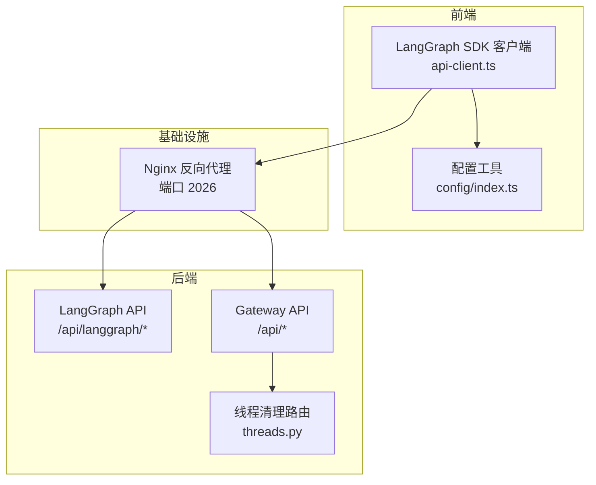
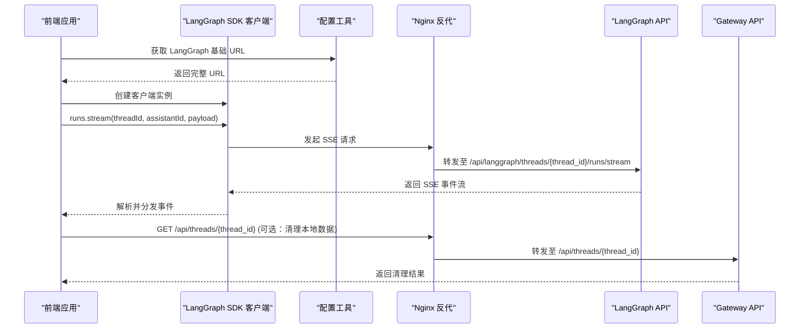
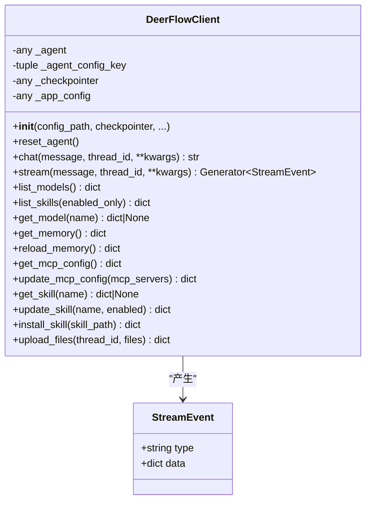
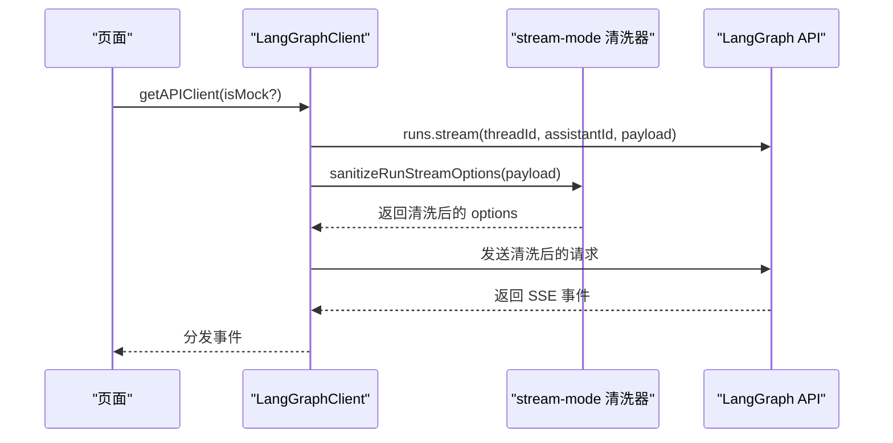
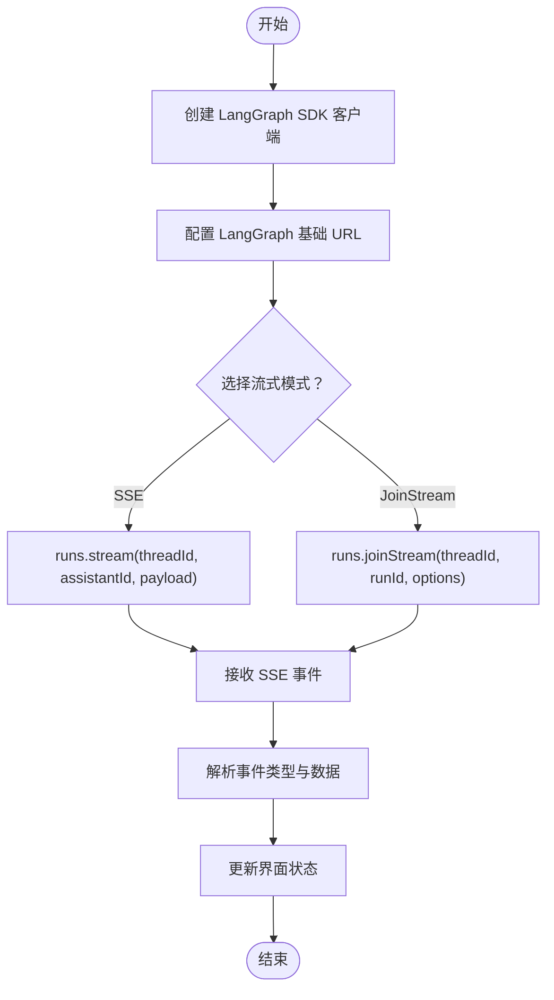
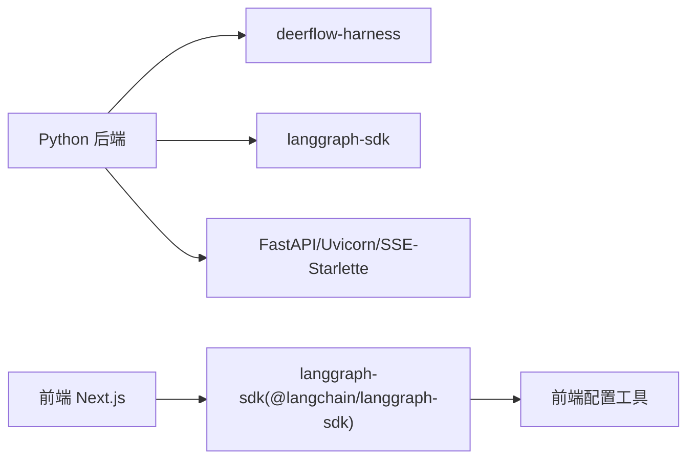

# SDK 和客户端集成

<cite>
**本文引用的文件**
- [backend/packages/harness/deerflow/client.py](file://backend/packages/harness/deerflow/client.py)
- [backend/packages/harness/deerflow/__init__.py](file://backend/packages/harness/deerflow/__init__.py)
- [backend/pyproject.toml](file://backend/pyproject.toml)
- [backend/docs/API.md](file://backend/docs/API.md)
- [backend/app/gateway/routers/threads.py](file://backend/app/gateway/routers/threads.py)
- [frontend/src/core/api/api-client.ts](file://frontend/src/core/api/api-client.ts)
- [frontend/src/core/api/stream-mode.ts](file://frontend/src/core/api/stream-mode.ts)
- [frontend/src/core/config/index.ts](file://frontend/src/core/config/index.ts)
</cite>

## 目录
1. [简介](#简介)
2. [项目结构](#项目结构)
3. [核心组件](#核心组件)
4. [架构总览](#架构总览)
5. [详细组件分析](#详细组件分析)
6. [依赖分析](#依赖分析)
7. [性能考虑](#性能考虑)
8. [故障排查指南](#故障排查指南)
9. [结论](#结论)
10. [附录](#附录)

## 简介
本文件面向希望在应用中集成 DeerFlow API 的开发者，提供多语言客户端与 SDK 的使用指南与最佳实践。内容覆盖：
- Python LangGraph SDK 集成：初始化、客户端创建、异步调用与流式处理
- JavaScript/TypeScript 前端客户端：基于 LangGraph SDK 的封装与 SSE/JoinStream 使用
- cURL 示例：直接对接后端 API（LangGraph 与 Gateway）
- 流式处理：SSE 事件解析、WebSocket（如需）与实时数据接收
- 配置项、错误处理与性能优化建议
- 第三方集成与自定义客户端开发指引

## 项目结构
DeerFlow 后端同时提供两类 API：
- LangGraph API：用于代理交互、线程管理与流式输出（SSE）
- Gateway API：用于模型、MCP、技能、上传与制品等管理

前端通过 LangGraph SDK 客户端访问后端 LangGraph API；后端通过 Nginx 反向代理统一暴露在固定端口。

图表来源
- [frontend/src/core/api/api-client.ts:1-38](file://frontend/src/core/api/api-client.ts#L1-L38)
- [frontend/src/core/config/index.ts:1-34](file://frontend/src/core/config/index.ts#L1-L34)
- [backend/docs/API.md:1-200](file://backend/docs/API.md#L1-L200)
- [backend/app/gateway/routers/threads.py:1-42](file://backend/app/gateway/routers/threads.py#L1-L42)

章节来源
- [backend/docs/API.md:1-200](file://backend/docs/API.md#L1-L200)
- [frontend/src/core/api/api-client.ts:1-38](file://frontend/src/core/api/api-client.ts#L1-L38)
- [frontend/src/core/config/index.ts:1-34](file://frontend/src/core/config/index.ts#L1-L34)
- [backend/app/gateway/routers/threads.py:1-42](file://backend/app/gateway/routers/threads.py#L1-L42)

## 核心组件
- Python LangGraph SDK 客户端（嵌入式）：deerflow.client.DeerFlowClient
  - 支持同步 chat 与流式 stream，事件类型与 LangGraph SSE 协议对齐
  - 提供模型查询、技能管理、MCP 配置更新、内存与文件上传等能力
- 前端 LangGraph SDK 客户端：LangGraphClient 封装
  - 自动注入基础 URL 并兼容 streamMode
  - 提供 runs.stream 与 runs.joinStream 的包装
- 后端 API 文档：LangGraph 与 Gateway API 的请求/响应规范与 SSE 事件格式
- 线程清理接口：删除本地线程持久化数据

章节来源
- [backend/packages/harness/deerflow/client.py:75-500](file://backend/packages/harness/deerflow/client.py#L75-L500)
- [frontend/src/core/api/api-client.ts:1-38](file://frontend/src/core/api/api-client.ts#L1-L38)
- [backend/docs/API.md:1-200](file://backend/docs/API.md#L1-L200)
- [backend/app/gateway/routers/threads.py:1-42](file://backend/app/gateway/routers/threads.py#L1-L42)

## 架构总览
下图展示了从前端到后端的典型调用链路，以及流式返回的数据路径。

图表来源
- [frontend/src/core/api/api-client.ts:1-38](file://frontend/src/core/api/api-client.ts#L1-L38)
- [frontend/src/core/config/index.ts:1-34](file://frontend/src/core/config/index.ts#L1-L34)
- [backend/docs/API.md:140-151](file://backend/docs/API.md#L140-L151)
- [backend/app/gateway/routers/threads.py:34-42](file://backend/app/gateway/routers/threads.py#L34-L42)

## 详细组件分析

### Python LangGraph SDK 客户端（deerflow.client.DeerFlowClient）
- 初始化与配置
  - 支持传入配置路径、检查点器、模型名、思维开关、子代理开关、计划模式、代理名称等
  - 首次使用时按配置动态构建代理，支持热刷新
- 主要方法
  - chat(message, thread_id, **kwargs)：一次性获取最终回复文本
  - stream(message, thread_id, **kwargs)：生成器，逐条产出事件
  - list_models()/list_skills()/get_model()/get_memory()/reload_memory()
  - get_mcp_config()/update_mcp_config()
  - get_skill()/update_skill()/install_skill()
  - upload_files(thread_id, files)
- 事件模型与流式协议
  - 事件类型与 LangGraph SSE 对齐：values、messages-tuple、end
  - values 包含标题、消息列表、制品
  - messages-tuple 包含 ai/tool 消息及工具调用信息
  - end 包含累计用量统计

图表来源
- [backend/packages/harness/deerflow/client.py:57-107](file://backend/packages/harness/deerflow/client.py#L57-L107)
- [backend/packages/harness/deerflow/client.py:312-444](file://backend/packages/harness/deerflow/client.py#L312-L444)

章节来源
- [backend/packages/harness/deerflow/client.py:75-500](file://backend/packages/harness/deerflow/client.py#L75-L500)

### 前端 LangGraph SDK 客户端（LangGraphClient 封装）
- 客户端创建
  - 通过 getAPIClient(isMock?) 获取单例客户端
  - 自动注入 LangGraph 基础 URL（优先环境变量，否则根据当前域构造）
- 流式模式兼容
  - runs.stream 与 runs.joinStream 在内部对 streamMode 进行清洗，丢弃不支持的模式并发出警告
- 使用建议
  - 在前端页面中统一通过 getAPIClient 获取客户端实例
  - 对于 Mock 场景，可通过 isMock 参数切换到 /mock/api

图表来源
- [frontend/src/core/api/api-client.ts:9-31](file://frontend/src/core/api/api-client.ts#L9-L31)
- [frontend/src/core/api/stream-mode.ts:36-68](file://frontend/src/core/api/stream-mode.ts#L36-L68)

章节来源
- [frontend/src/core/api/api-client.ts:1-38](file://frontend/src/core/api/api-client.ts#L1-L38)
- [frontend/src/core/api/stream-mode.ts:1-69](file://frontend/src/core/api/stream-mode.ts#L1-L69)
- [frontend/src/core/config/index.ts:1-34](file://frontend/src/core/config/index.ts#L1-L34)

### 后端 API 规范与流式事件
- LangGraph API
  - 基础路径：/api/langgraph
  - 支持的 streamMode：values、messages、messages-tuple、updates、events、debug、tasks、checkpoints、custom
  - SSE 事件示例：values、messages、end
- Gateway API
  - 基础路径：/api
  - 包含模型、MCP、技能、上传、制品等管理接口
- 线程清理
  - 删除本地线程持久化目录，LangGraph 线程状态由 LangGraph API 处理

章节来源
- [backend/docs/API.md:14-151](file://backend/docs/API.md#L14-L151)
- [backend/app/gateway/routers/threads.py:19-41](file://backend/app/gateway/routers/threads.py#L19-L41)

### 流式处理：SSE 与 JoinStream
- SSE（Server-Sent Events）
  - 事件类型：values、messages、messages-tuple、end
  - 前端通过 LangGraph SDK 的 runs.stream 接收事件
- JoinStream
  - 前端通过 runs.joinStream 接收合并后的事件流
- WebSocket（可选）
  - 若业务需要 WebSocket，可在前端自行封装 ws:// 协议接入后端 SSE 或代理服务

图表来源
- [frontend/src/core/api/api-client.ts:9-31](file://frontend/src/core/api/api-client.ts#L9-L31)
- [frontend/src/core/api/stream-mode.ts:36-68](file://frontend/src/core/api/stream-mode.ts#L36-L68)
- [backend/docs/API.md:140-151](file://backend/docs/API.md#L140-L151)

## 依赖分析
- Python 后端依赖
  - deerflow-harness：提供 deerflow.client 与相关工具
  - langgraph-sdk：前端 SDK 依赖，后端亦可使用
  - FastAPI、Uvicorn、SSE-Starlette：提供 LangGraph API 与 SSE 支持
- 前端依赖
  - @langchain/langgraph-sdk：LangGraph SDK 客户端
  - Next.js 环境变量：NEXT_PUBLIC_LANGGRAPH_BASE_URL、NEXT_PUBLIC_BACKEND_BASE_URL

图表来源
- [backend/pyproject.toml:1-29](file://backend/pyproject.toml#L1-L29)
- [frontend/src/core/api/api-client.ts:3-3](file://frontend/src/core/api/api-client.ts#L3-L3)

章节来源
- [backend/pyproject.toml:1-29](file://backend/pyproject.toml#L1-L29)

## 性能考虑
- 流式消费
  - 优先使用 runs.stream 或 runs.joinStream，避免一次性缓冲大量事件
  - 在前端对事件进行节流/防抖处理，减少 UI 更新频率
- 模型与中间件
  - 合理设置 thinking_enabled、is_plan_mode、subagent_enabled，避免不必要的计算开销
- 文件上传与转换
  - 对大文件上传采用异步转换策略，必要时复用线程池以降低并发成本
- 缓存与重用
  - 客户端实例尽量单例化，避免重复创建与配置加载
  - 长生命周期进程定期调用 reset_agent 以刷新系统提示与工具集

## 故障排查指南
- 常见问题
  - 无法连接后端：确认 NEXT_PUBLIC_LANGGRAPH_BASE_URL 是否正确，或默认 URL 是否指向 /api/langgraph
  - 不支持的 streamMode：前端会自动清洗并告警，检查请求中的 streamMode 列表
  - SSE 事件缺失：确认后端是否启用 SSE，以及 Nginx 反代是否透传长连接
  - 线程数据清理失败：检查线程 ID 与本地路径权限
- 错误处理建议
  - 前端：对 runs.stream/joinStream 的异常进行捕获与重试
  - 后端：记录 LangGraph API 的异常日志，并返回标准 HTTP 状态码

章节来源
- [frontend/src/core/api/stream-mode.ts:15-34](file://frontend/src/core/api/stream-mode.ts#L15-L34)
- [backend/app/gateway/routers/threads.py:24-28](file://backend/app/gateway/routers/threads.py#L24-L28)

## 结论
通过本指南，您可以在 Python、JavaScript/TypeScript 与 cURL 中无缝集成 DeerFlow API。推荐优先使用 LangGraph SDK 的 runs.stream 与 runs.joinStream 进行流式交互，并结合前端配置工具与后端 API 文档完成端到端开发。对于复杂工作流，建议在前端进行事件聚合与状态管理，在后端利用检查点器与中间件实现多轮对话与任务追踪。

## 附录

### Python 客户端使用要点
- 初始化与检查点
  - 需要多轮对话时，提供 checkpointer 以保持上下文
- 流式事件
  - values：全量状态快照（标题、消息、制品）
  - messages-tuple：增量消息（AI 文本、工具调用、工具结果）
  - end：流结束，携带用量统计
- 配置项
  - model_name、thinking_enabled、is_plan_mode、subagent_enabled、agent_name 等
- 文件上传
  - upload_files(thread_id, files) 支持批量上传与自动转换

章节来源
- [backend/packages/harness/deerflow/client.py:109-152](file://backend/packages/harness/deerflow/client.py#L109-L152)
- [backend/packages/harness/deerflow/client.py:312-444](file://backend/packages/harness/deerflow/client.py#L312-L444)
- [backend/packages/harness/deerflow/client.py:715-800](file://backend/packages/harness/deerflow/client.py#L715-L800)

### 前端客户端使用要点
- 客户端创建
  - getAPIClient(isMock?) 返回单例客户端
- 流式模式
  - sanitizeRunStreamOptions 会过滤不支持的模式并告警
- 基础 URL
  - getLangGraphBaseURL 根据环境变量或当前域构造

章节来源
- [frontend/src/core/api/api-client.ts:9-37](file://frontend/src/core/api/api-client.ts#L9-L37)
- [frontend/src/core/api/stream-mode.ts:36-68](file://frontend/src/core/api/stream-mode.ts#L36-L68)
- [frontend/src/core/config/index.ts:14-33](file://frontend/src/core/config/index.ts#L14-L33)

### cURL 示例（LangGraph API）
- 创建线程
  - POST /api/langgraph/threads
- 创建运行并流式返回
  - POST /api/langgraph/threads/{thread_id}/runs/stream
  - Content-Type: application/json
  - 请求体包含 input、config、stream_mode
- 获取运行历史
  - GET /api/langgraph/threads/{thread_id}/runs
- 清理线程本地数据
  - DELETE /api/threads/{thread_id}

章节来源
- [backend/docs/API.md:20-151](file://backend/docs/API.md#L20-L151)
- [backend/app/gateway/routers/threads.py:34-41](file://backend/app/gateway/routers/threads.py#L34-L41)