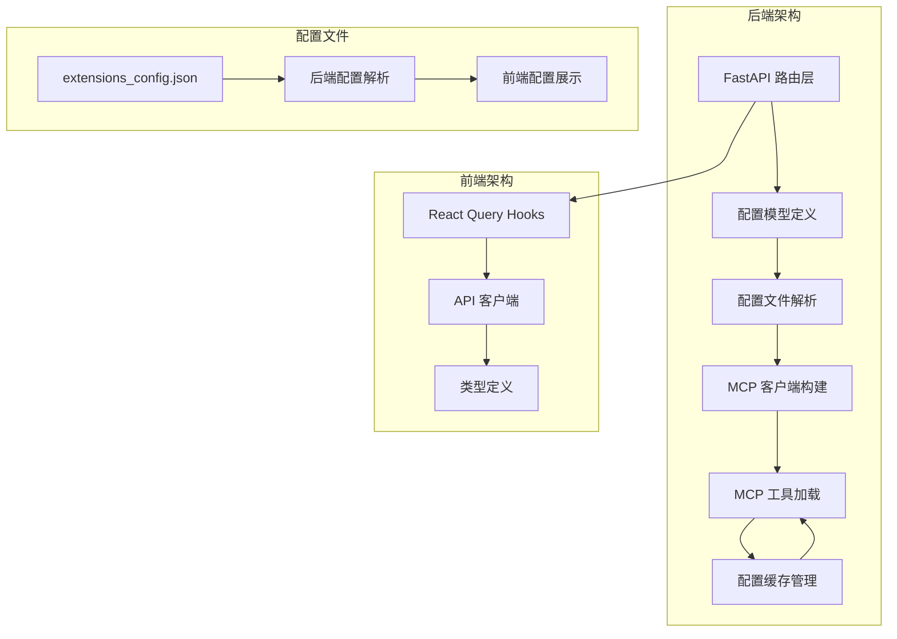
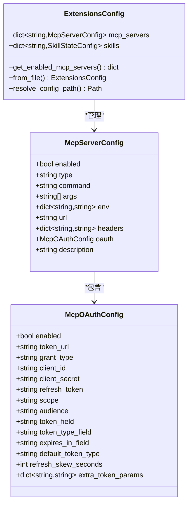
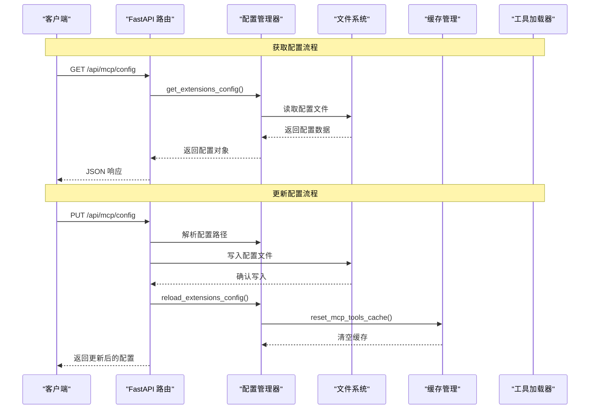
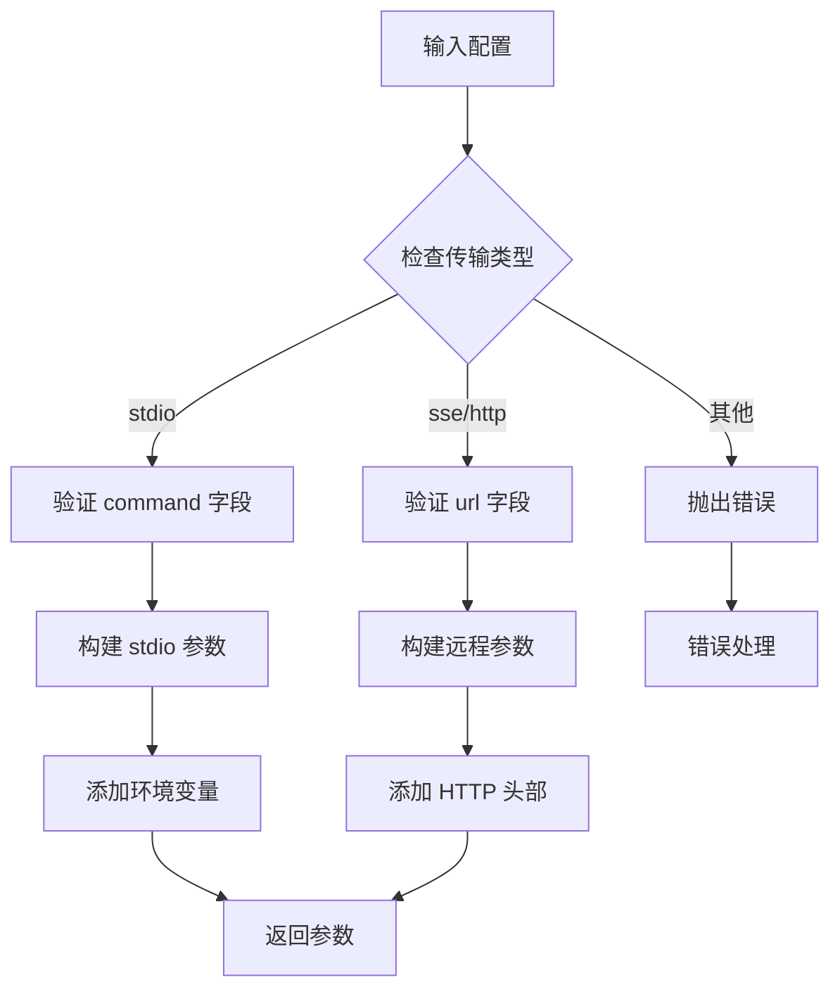
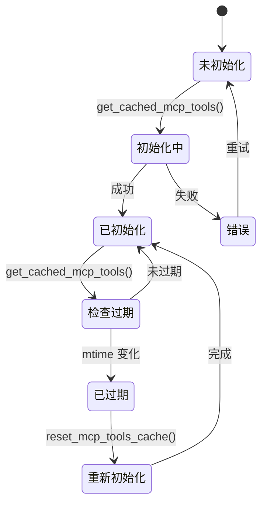
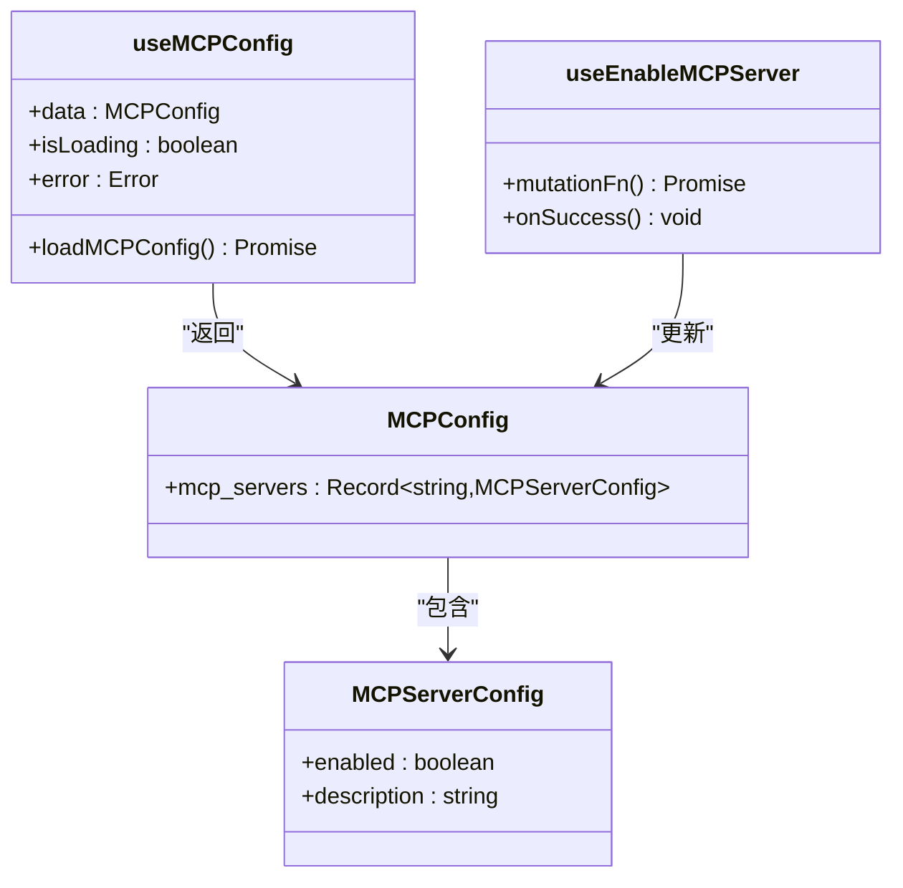
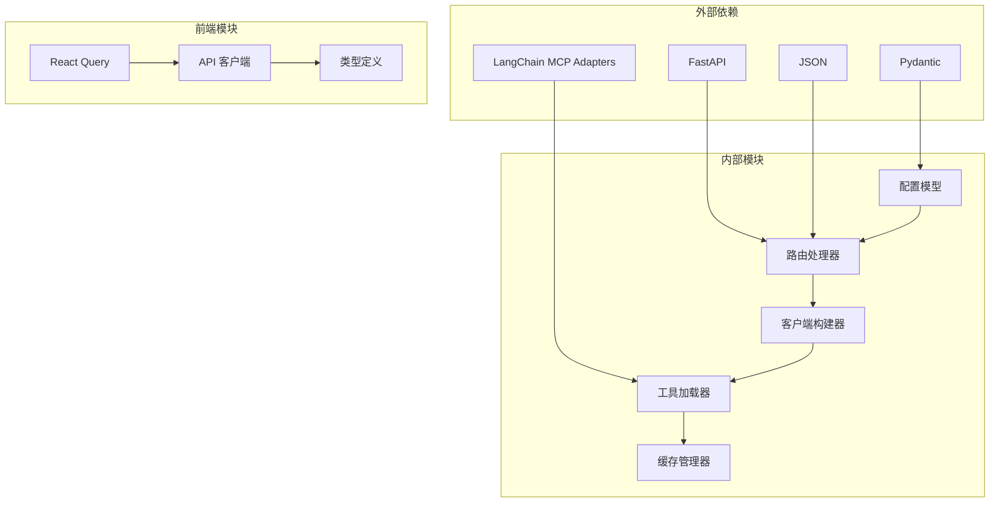

# MCP 配置 API

<cite>
**本文档引用的文件**
- [mcp.py](file://backend/app/gateway/routers/mcp.py)
- [extensions_config.py](file://backend/packages/harness/deerflow/config/extensions_config.py)
- [client.py](file://backend/packages/harness/deerflow/mcp/client.py)
- [cache.py](file://backend/packages/harness/deerflow/mcp/cache.py)
- [tools.py](file://backend/packages/harness/deerflow/mcp/tools.py)
- [api.ts](file://frontend/src/core/mcp/api.ts)
- [types.ts](file://frontend/src/core/mcp/types.ts)
- [hooks.ts](file://frontend/src/core/mcp/hooks.ts)
- [extensions_config.example.json](file://extensions_config.example.json)
- [test_mcp_client_config.py](file://backend/tests/test_mcp_client_config.py)
</cite>

## 目录
1. [简介](#简介)
2. [项目结构](#项目结构)
3. [核心组件](#核心组件)
4. [架构概览](#架构概览)
5. [详细组件分析](#详细组件分析)
6. [依赖关系分析](#依赖关系分析)
7. [性能考虑](#性能考虑)
8. [故障排除指南](#故障排除指南)
9. [结论](#结论)

## 简介

MCP（Model Context Protocol）配置 API 提供了对 MCP 服务器配置的完整管理功能。该 API 允许用户获取当前的 MCP 配置状态，并动态更新 MCP 服务器的启动参数、环境变量和连接配置。系统支持多种传输协议（stdio、sse、http），并提供了完整的生命周期管理和动态配置更新机制。

## 项目结构

MCP 配置 API 的实现分布在后端和前端两个主要部分：



**图表来源**
- [mcp.py:1-170](file://backend/app/gateway/routers/mcp.py#L1-L170)
- [extensions_config.py:1-259](file://backend/packages/harness/deerflow/config/extensions_config.py#L1-L259)

**章节来源**
- [mcp.py:1-170](file://backend/app/gateway/routers/mcp.py#L1-L170)
- [extensions_config.py:1-259](file://backend/packages/harness/deerflow/config/extensions_config.py#L1-L259)

## 核心组件

### 后端路由组件

后端使用 FastAPI 实现了两个核心路由：
- GET `/api/mcp/config` - 获取当前 MCP 配置
- PUT `/api/mcp/config` - 更新 MCP 配置

### 配置模型组件

系统定义了完整的配置模型层次结构：



**图表来源**
- [extensions_config.py:34-67](file://backend/packages/harness/deerflow/config/extensions_config.py#L34-L67)
- [extensions_config.py:11-31](file://backend/packages/harness/deerflow/config/extensions_config.py#L11-L31)

**章节来源**
- [extensions_config.py:34-67](file://backend/packages/harness/deerflow/config/extensions_config.py#L34-L67)
- [extensions_config.py:11-31](file://backend/packages/harness/deerflow/config/extensions_config.py#L11-L31)

## 架构概览

MCP 配置 API 采用分层架构设计，确保配置管理的完整性和可靠性：



**图表来源**
- [mcp.py:72-169](file://backend/app/gateway/routers/mcp.py#L72-L169)
- [extensions_config.py:205-235](file://backend/packages/harness/deerflow/config/extensions_config.py#L205-L235)
- [cache.py:129-138](file://backend/packages/harness/deerflow/mcp/cache.py#L129-L138)

## 详细组件分析

### GET /api/mcp/config 接口

该接口提供当前 MCP 配置的完整视图：

**响应格式规范：**
```json
{
  "mcp_servers": {
    "server_name": {
      "enabled": true,
      "type": "stdio",
      "command": "npx",
      "args": ["-y", "@modelcontextprotocol/server-github"],
      "env": {"GITHUB_TOKEN": "$GITHUB_TOKEN"},
      "description": "GitHub MCP server for repository operations"
    }
  }
}
```

**字段详细说明：**
- `enabled`: 布尔值，指示服务器是否启用
- `type`: 字符串，传输类型（"stdio"、"sse"、"http"）
- `command`: 字符串，启动 MCP 服务器的命令（仅 stdio 类型）
- `args`: 字符串数组，传递给命令的参数（仅 stdio 类型）
- `env`: 环境变量映射，传递给 MCP 服务器进程
- `url`: 服务器 URL（仅 sse/http 类型）
- `headers`: HTTP 头部映射（仅 sse/http 类型）
- `oauth`: OAuth 配置对象（可选）
- `description`: 人类可读的描述信息

**章节来源**
- [mcp.py:66-95](file://backend/app/gateway/routers/mcp.py#L66-L95)
- [extensions_config.py:34-46](file://backend/packages/harness/deerflow/config/extensions_config.py#L34-L46)

### PUT /api/mcp/config 接口

该接口用于更新 MCP 配置并触发系统重新初始化：

**请求格式：**
```json
{
  "mcp_servers": {
    "github": {
      "enabled": true,
      "command": "npx",
      "args": ["-y", "@modelcontextprotocol/server-github"],
      "env": {"GITHUB_TOKEN": "$GITHUB_TOKEN"},
      "description": "GitHub MCP server for repository operations"
    }
  }
}
```

**更新流程：**
1. 解析配置文件路径（支持多种查找策略）
2. 加载当前配置以保留技能设置
3. 将新配置转换为 JSON 格式
4. 写入配置文件
5. 重新加载配置缓存
6. 重置 MCP 工具缓存

**错误处理：**
- 文件写入失败时返回 500 错误
- 配置解析错误时抛出异常
- 环境变量未找到时替换为空字符串

**章节来源**
- [mcp.py:98-169](file://backend/app/gateway/routers/mcp.py#L98-L169)
- [extensions_config.py:70-117](file://backend/packages/harness/deerflow/config/extensions_config.py#L70-L117)

### MCP 客户端构建组件

系统提供了灵活的 MCP 客户端构建机制：



**图表来源**
- [client.py:11-42](file://backend/packages/harness/deerflow/mcp/client.py#L11-L42)

**章节来源**
- [client.py:11-42](file://backend/packages/harness/deerflow/mcp/client.py#L11-L42)
- [test_mcp_client_config.py:9-48](file://backend/tests/test_mcp_client_config.py#L9-L48)

### 配置缓存管理

系统实现了智能的配置缓存机制：



**图表来源**
- [cache.py:56-126](file://backend/packages/harness/deerflow/mcp/cache.py#L56-L126)

**章节来源**
- [cache.py:56-126](file://backend/packages/harness/deerflow/mcp/cache.py#L56-L126)

### 前端集成组件

前端提供了完整的 React Query 集成：



**图表来源**
- [hooks.ts:5-44](file://frontend/src/core/mcp/hooks.ts#L5-L44)
- [types.ts:1-9](file://frontend/src/core/mcp/types.ts#L1-L9)

**章节来源**
- [hooks.ts:5-44](file://frontend/src/core/mcp/hooks.ts#L5-L44)
- [types.ts:1-9](file://frontend/src/core/mcp/types.ts#L1-L9)

## 依赖关系分析

MCP 配置 API 的依赖关系清晰且模块化：



**图表来源**
- [mcp.py:1-12](file://backend/app/gateway/routers/mcp.py#L1-L12)
- [extensions_config.py:1-8](file://backend/packages/harness/deerflow/config/extensions_config.py#L1-L8)

**章节来源**
- [mcp.py:1-12](file://backend/app/gateway/routers/mcp.py#L1-L12)
- [extensions_config.py:1-8](file://backend/packages/harness/deerflow/config/extensions_config.py#L1-L8)

## 性能考虑

### 缓存策略
- MCP 工具缓存支持懒初始化，避免不必要的资源消耗
- 配置文件修改时间监控确保缓存的及时更新
- 线程池管理同步工具调用，提高并发性能

### 异步处理
- 使用 asyncio 支持异步工具执行
- 多线程池管理同步操作，避免阻塞事件循环
- 自动检测运行中的事件循环，优化性能

### 配置解析优化
- 环境变量解析采用递归算法，支持嵌套结构
- 配置文件路径解析具有优先级顺序，减少查找时间
- 缓存机制避免重复的文件 I/O 操作

## 故障排除指南

### 常见问题及解决方案

**配置文件找不到**
- 检查 DEER_FLOW_EXTENSIONS_CONFIG_PATH 环境变量
- 确认配置文件位于项目根目录或父目录
- 验证文件权限和格式

**MCP 服务器启动失败**
- 验证 stdio 传输类型的 command 字段
- 检查 sse/http 传输类型的 url 字段
- 确认网络连接和防火墙设置

**环境变量未生效**
- 检查环境变量名称和值
- 验证环境变量在进程启动前已设置
- 注意特殊字符转义

**工具加载失败**
- 确认 langchain-mcp-adapters 已安装
- 检查 MCP 服务器的可用性
- 验证工具拦截器配置

**章节来源**
- [extensions_config.py:147-175](file://backend/packages/harness/deerflow/config/extensions_config.py#L147-L175)
- [tools.py:64-66](file://backend/packages/harness/deerflow/mcp/tools.py#L64-L66)

### 调试建议

1. **启用详细日志**：设置日志级别为 DEBUG 查看详细信息
2. **验证配置格式**：使用 JSON Schema 验证配置文件格式
3. **测试连接**：手动测试 MCP 服务器的可达性
4. **检查权限**：确认必要的文件和网络权限

## 结论

MCP 配置 API 提供了一个完整、可靠且高性能的配置管理解决方案。通过清晰的分层架构、智能的缓存机制和完善的错误处理，系统能够满足各种复杂的 MCP 服务器配置需求。前端集成提供了良好的用户体验，而后端的健壮性确保了系统的稳定运行。

该 API 的设计充分考虑了生产环境的需求，支持动态配置更新、自动缓存管理和服务发现，为构建现代化的 AI 应用程序奠定了坚实的基础。