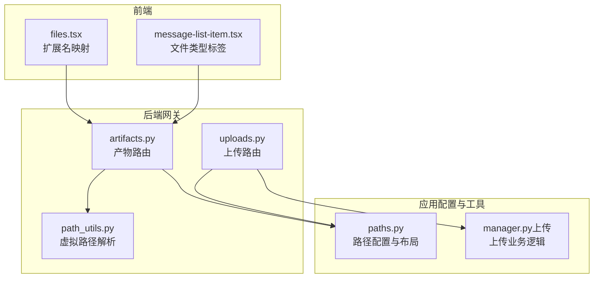
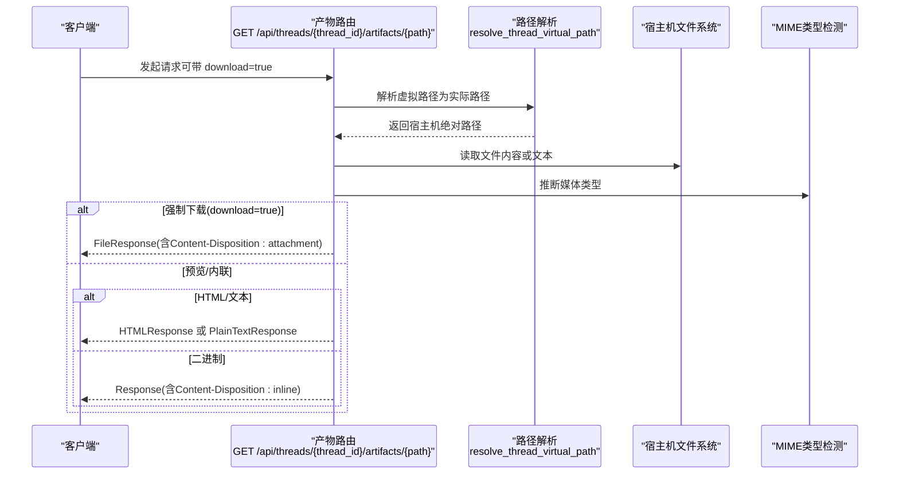
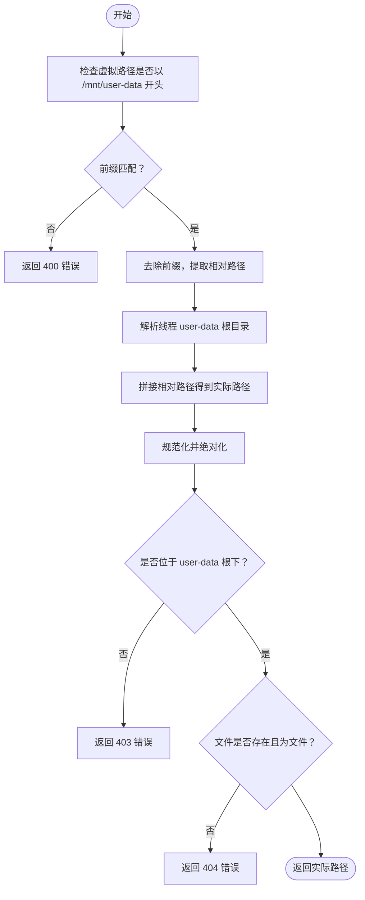
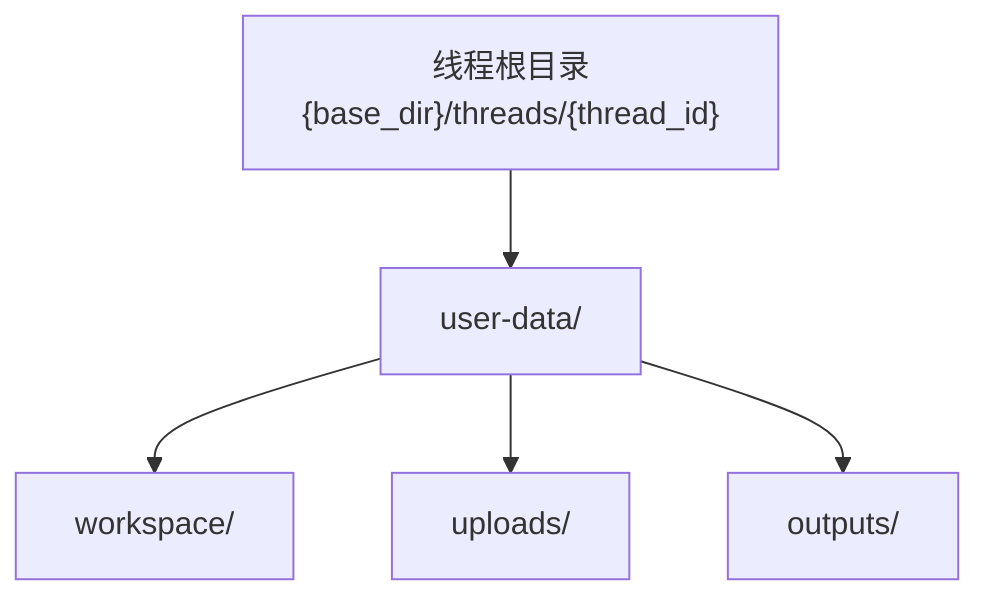
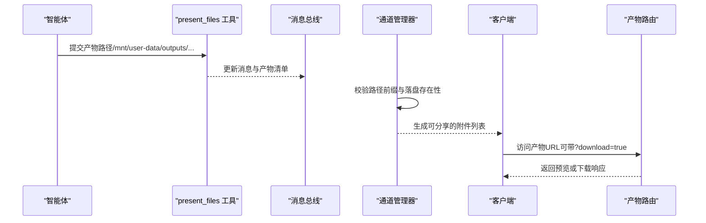
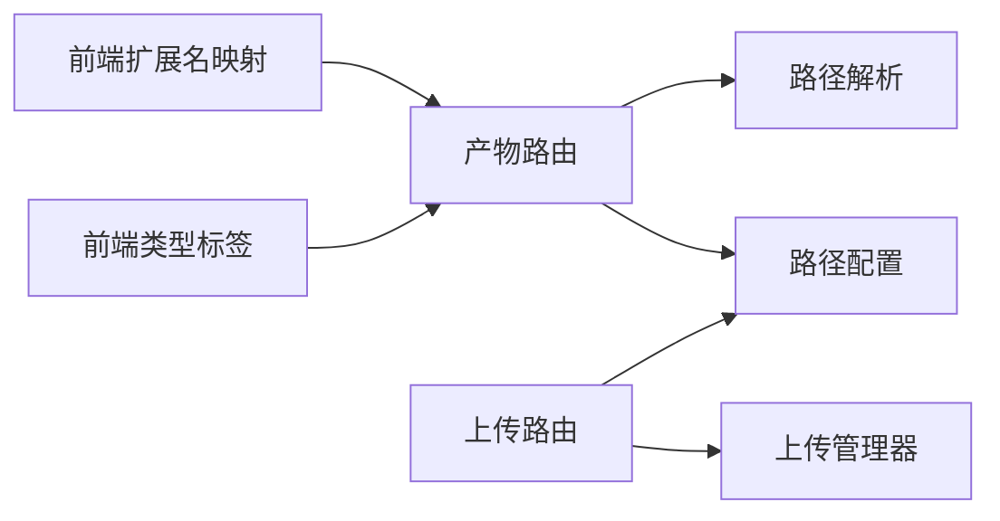

# 产物管理 API

<cite>
**本文引用的文件**
- [artifacts.py](file://backend/app/gateway/routers/artifacts.py)
- [path_utils.py](file://backend/app/gateway/path_utils.py)
- [paths.py](file://backend/packages/harness/deerflow/config/paths.py)
- [uploads.py](file://backend/app/gateway/routers/uploads.py)
- [manager.py](file://backend/packages/harness/deerflow/uploads/manager.py)
- [test_artifacts_router.py](file://backend/tests/test_artifacts_router.py)
- [PATH_EXAMPLES.md](file://backend/docs/PATH_EXAMPLES.md)
- [present_file_tool.py](file://backend/packages/harness/deerflow/tools/builtins/present_file_tool.py)
- [manager.py（通道管理器）](file://backend/app/channels/manager.py)
- [message_bus.py](file://backend/app/channels/message_bus.py)
- [files.tsx（前端工具）](file://frontend/src/core/utils/files.tsx)
- [message-list-item.tsx（消息列表项）](file://frontend/src/components/workspace/messages/message-list-item.tsx)
</cite>

## 目录
1. [简介](#简介)
2. [项目结构](#项目结构)
3. [核心组件](#核心组件)
4. [架构总览](#架构总览)
5. [详细组件分析](#详细组件分析)
6. [依赖分析](#依赖分析)
7. [性能考虑](#性能考虑)
8. [故障排查指南](#故障排查指南)
9. [结论](#结论)
10. [附录](#附录)

## 简介
本文件为“产物管理 API”的权威技术文档，聚焦于智能体生成产物的访问与下载能力，重点覆盖以下内容：
- GET /api/threads/{thread_id}/artifacts/{path} 的产物获取接口规范
- 路径参数格式要求与虚拟路径映射机制
- download 查询参数的作用与强制下载行为
- 支持的产物类型与 Content-Type 处理策略
- 产物路径组织结构：user-data/outputs 与 user-data/uploads 的用途
- 产物生命周期管理、存储位置与访问权限控制
- 产物预览、下载与分享的完整工作流程

## 项目结构
产物管理 API 由后端网关路由、路径解析工具、配置与上传管理模块协同实现，并在前端侧提供产物展示与交互。

**图表来源**
- [artifacts.py:1-159](file://backend/app/gateway/routers/artifacts.py#L1-L159)
- [path_utils.py:1-29](file://backend/app/gateway/path_utils.py#L1-L29)
- [paths.py:12-243](file://backend/packages/harness/deerflow/config/paths.py#L12-L243)
- [uploads.py:1-147](file://backend/app/gateway/routers/uploads.py#L1-L147)
- [manager.py:1-202](file://backend/packages/harness/deerflow/uploads/manager.py#L1-L202)
- [files.tsx:1-171](file://frontend/src/core/utils/files.tsx#L1-L171)
- [message-list-item.tsx:222-273](file://frontend/src/components/workspace/messages/message-list-item.tsx#L222-L273)

**章节来源**
- [artifacts.py:1-159](file://backend/app/gateway/routers/artifacts.py#L1-L159)
- [path_utils.py:1-29](file://backend/app/gateway/path_utils.py#L1-L29)
- [paths.py:12-243](file://backend/packages/harness/deerflow/config/paths.py#L12-L243)
- [uploads.py:1-147](file://backend/app/gateway/routers/uploads.py#L1-L147)
- [manager.py:1-202](file://backend/packages/harness/deerflow/uploads/manager.py#L1-L202)
- [files.tsx:1-171](file://frontend/src/core/utils/files.tsx#L1-L171)
- [message-list-item.tsx:222-273](file://frontend/src/components/workspace/messages/message-list-item.tsx#L222-L273)

## 核心组件
- 产物路由（GET /api/threads/{thread_id}/artifacts/{path}）
  - 负责根据虚拟路径解析到宿主机实际路径，判断文件类型并返回相应响应（文本、HTML、二进制），支持强制下载。
- 虚拟路径解析工具
  - 将沙箱内可见的虚拟路径（如 /mnt/user-data/outputs/...）解析为宿主机安全路径，内置路径穿越防护。
- 路径配置（Paths）
  - 定义线程级数据目录布局，明确 user-data/outputs 与 user-data/uploads 的职责边界。
- 上传路由与上传管理器
  - 提供文件上传、列出、删除与虚拟路径/产物 URL 生成；支持上传即转 Markdown 并生成配套链接。
- 前端工具
  - 扩展名映射与文件类型标签，辅助产物预览与展示。

**章节来源**
- [artifacts.py:61-159](file://backend/app/gateway/routers/artifacts.py#L61-L159)
- [path_utils.py:10-29](file://backend/app/gateway/path_utils.py#L10-L29)
- [paths.py:184-218](file://backend/packages/harness/deerflow/config/paths.py#L184-L218)
- [uploads.py:36-147](file://backend/app/gateway/routers/uploads.py#L36-L147)
- [manager.py:178-202](file://backend/packages/harness/deerflow/uploads/manager.py#L178-L202)
- [files.tsx:11-144](file://frontend/src/core/utils/files.tsx#L11-L144)
- [message-list-item.tsx:228-259](file://frontend/src/components/workspace/messages/message-list-item.tsx#L228-L259)

## 架构总览
产物管理 API 的调用链路如下：

**图表来源**
- [artifacts.py:66-159](file://backend/app/gateway/routers/artifacts.py#L66-L159)
- [path_utils.py:10-29](file://backend/app/gateway/path_utils.py#L10-L29)

## 详细组件分析

### 接口定义：GET /api/threads/{thread_id}/artifacts/{path}
- 功能概述
  - 获取智能体生成的产物文件，支持文本、HTML 与二进制文件的自动类型识别与响应。
  - 支持通过查询参数 download=true 强制下载并附加 Content-Disposition 头部。
- 路径参数
  - thread_id：线程标识符，用于定位线程级 user-data 目录。
  - path：虚拟路径，需以 /mnt/user-data 开头，指向 user-data 下的 outputs 或 uploads 子目录。
- 查询参数
  - download：布尔值，为真时返回附件形式的下载响应。
- 响应类型
  - HTML 文件：HTMLResponse
  - 纯文本文件：PlainTextResponse
  - 其他文本内容：PlainTextResponse
  - 二进制文件：Response（默认内联显示，可配合 download=true 强制下载）
- 错误码
  - 400：路径无效或非文件
  - 403：路径穿越检测失败
  - 404：文件不存在

**章节来源**
- [artifacts.py:61-159](file://backend/app/gateway/routers/artifacts.py#L61-L159)

### 虚拟路径映射与解析机制
- 虚拟路径前缀
  - 必须以 /mnt/user-data 开头，否则拒绝访问。
- 解析流程
  - 将 thread_id 与虚拟路径拼接至线程 user-data 根目录，进行相对路径拼接与绝对路径规范化。
  - 通过相对路径校验确保不发生路径穿越。
- 安全性
  - 若解析后路径不在允许范围内，抛出 403 错误；非法前缀或非文件路径抛出 400 错误；不存在则 404。

**图表来源**
- [paths.py:184-218](file://backend/packages/harness/deerflow/config/paths.py#L184-L218)
- [path_utils.py:10-29](file://backend/app/gateway/path_utils.py#L10-L29)

**章节来源**
- [paths.py:184-218](file://backend/packages/harness/deerflow/config/paths.py#L184-L218)
- [path_utils.py:10-29](file://backend/app/gateway/path_utils.py#L10-L29)

### download 查询参数与强制下载
- 行为说明
  - 当 download=true 时，返回 FileResponse 并设置 Content-Disposition 为 attachment，触发浏览器下载。
  - 文件名采用 RFC 5987 编码，避免特殊字符问题。
- 默认行为
  - 未携带 download 参数时，按文件类型选择内联显示（HTML/文本）或二进制内联（其他），并设置 Content-Disposition: inline。

**章节来源**
- [artifacts.py:145-158](file://backend/app/gateway/routers/artifacts.py#L145-L158)

### 支持的产物类型与 Content-Type 处理
- 类型判定顺序
  1) 若 MIME 类型为 text/html：返回 HTMLResponse
  2) 若 MIME 类型以 text/ 开头：返回 PlainTextResponse
  3) 若内容不含空字节（疑似文本）：返回 PlainTextResponse
  4) 否则：返回二进制 Response
- 特殊场景
  - .skill 归档内的文件：从 ZIP 中提取指定内部路径，基于内部文件扩展名推断 MIME 类型，缓存控制为私有 5 分钟。
- 前端辅助
  - 扩展名映射与文件类型标签用于产物展示与预览。

**章节来源**
- [artifacts.py:17-26](file://backend/app/gateway/routers/artifacts.py#L17-L26)
- [artifacts.py:96-129](file://backend/app/gateway/routers/artifacts.py#L96-L129)
- [files.tsx:11-144](file://frontend/src/core/utils/files.tsx#L11-L144)
- [message-list-item.tsx:228-259](file://frontend/src/components/workspace/messages/message-list-item.tsx#L228-L259)

### 产物路径组织结构
- 线程级目录布局（宿主机）
  - {base_dir}/threads/{thread_id}/user-data/
    - workspace/：工作区（沙箱内 /mnt/user-data/workspace/）
    - uploads/：用户上传文件（沙箱内 /mnt/user-data/uploads/）
    - outputs/：智能体生成产物（沙箱内 /mnt/user-data/outputs/）
- 虚拟路径与沙箱映射
  - /mnt/user-data 对应线程 user-data 根目录
  - /mnt/user-data/outputs 专用于产物访问
  - /mnt/user-data/uploads 用于上传文件访问与分享

**图表来源**
- [paths.py:25-31](file://backend/packages/harness/deerflow/config/paths.py#L25-L31)

**章节来源**
- [paths.py:25-31](file://backend/packages/harness/deerflow/config/paths.py#L25-L31)

### 产物生命周期管理、存储位置与访问权限控制
- 生命周期
  - 生成：智能体将产物写入 /mnt/user-data/outputs，随后可通过 API 访问。
  - 上传：用户可通过上传接口将文件放入 uploads，生成 artifact_url 以便分享。
  - 删除：支持删除 uploads 目录中的文件，必要时清理配套 Markdown。
- 存储位置
  - 宿主机：{base_dir}/threads/{thread_id}/user-data/{workspace|uploads|outputs}/
  - 沙箱：/mnt/user-data/{workspace|uploads|outputs}/
- 权限控制
  - 路由层：路径解析严格限制在 user-data 根下，拒绝路径穿越。
  - 通道管理器：仅接受 /mnt/user-data/outputs 下的产物作为附件，防止上传目录外文件被泄露。
  - 上传管理器：对文件名进行清洗与长度校验，防止危险字符与过长文件名。

**章节来源**
- [paths.py:184-218](file://backend/packages/harness/deerflow/config/paths.py#L184-L218)
- [manager.py（通道管理器）:253-280](file://backend/app/channels/manager.py#L253-L280)
- [manager.py（上传）:46-71](file://backend/packages/harness/deerflow/uploads/manager.py#L46-L71)

### 产物预览、下载与分享工作流
- 预览
  - 直接访问产物 URL（如 /api/threads/{thread_id}/artifacts/mnt/user-data/outputs/...），若为 HTML/文本，将直接渲染或以纯文本显示。
- 下载
  - 在 URL 上追加 ?download=true，触发强制下载（Content-Disposition: attachment）。
- 分享
  - 上传文件：通过上传接口生成 artifact_url，该 URL 指向 /api/threads/{thread_id}/artifacts{VIRTUAL_PATH_PREFIX}/uploads/{filename}，便于分享。
  - 产物分享：智能体通过 present_files 工具将产物路径加入消息附件，通道管理器仅接受 outputs 目录下的产物。

**图表来源**
- [present_file_tool.py:84-100](file://backend/packages/harness/deerflow/tools/builtins/present_file_tool.py#L84-L100)
- [manager.py（通道管理器）:253-280](file://backend/app/channels/manager.py#L253-L280)
- [artifacts.py:66-159](file://backend/app/gateway/routers/artifacts.py#L66-L159)

**章节来源**
- [present_file_tool.py:84-100](file://backend/packages/harness/deerflow/tools/builtins/present_file_tool.py#L84-L100)
- [manager.py（通道管理器）:253-280](file://backend/app/channels/manager.py#L253-L280)
- [uploads.py:178-188](file://backend/app/gateway/routers/uploads.py#L178-L188)
- [manager.py（上传）:178-202](file://backend/packages/harness/deerflow/uploads/manager.py#L178-L202)

## 依赖分析
- 组件耦合
  - 产物路由依赖路径解析工具与路径配置，确保安全与一致性。
  - 上传路由与上传管理器共同维护 uploads 目录的生命周期与 URL 生成。
  - 前端工具依赖产物路由返回的 MIME 类型与扩展名映射，提升用户体验。
- 外部依赖
  - MIME 类型检测用于自动选择响应类型。
  - ZIP 解析用于 .skill 归档内文件的提取与缓存控制。

**图表来源**
- [artifacts.py:10-11](file://backend/app/gateway/routers/artifacts.py#L10-L11)
- [path_utils.py:10-29](file://backend/app/gateway/path_utils.py#L10-L29)
- [paths.py:12-243](file://backend/packages/harness/deerflow/config/paths.py#L12-L243)
- [uploads.py:10-21](file://backend/app/gateway/routers/uploads.py#L10-L21)
- [manager.py:1-202](file://backend/packages/harness/deerflow/uploads/manager.py#L1-L202)
- [files.tsx:11-144](file://frontend/src/core/utils/files.tsx#L11-L144)
- [message-list-item.tsx:228-259](file://frontend/src/components/workspace/messages/message-list-item.tsx#L228-L259)

**章节来源**
- [artifacts.py:10-11](file://backend/app/gateway/routers/artifacts.py#L10-L11)
- [uploads.py:10-21](file://backend/app/gateway/routers/uploads.py#L10-L21)
- [manager.py:1-202](file://backend/packages/harness/deerflow/uploads/manager.py#L1-L202)

## 性能考虑
- 缓存策略
  - .skill 归档内文件提取结果设置私有缓存（5 分钟），减少重复 ZIP 解压开销。
- I/O 优化
  - 文本文件优先按字节读取并判定是否为文本，避免不必要的编码转换。
- 前端缓存
  - 前端对产物内容设置 5 分钟的 staleTime，降低重复请求频率。

**章节来源**
- [artifacts.py:118-128](file://backend/app/gateway/routers/artifacts.py#L118-L128)
- [frontend hooks.ts:34-36](file://frontend/src/core/artifacts/hooks.ts#L34-L36)

## 故障排查指南
- 400 错误
  - 路径无效或目标不是文件。请确认 path 以 /mnt/user-data 开头且指向具体文件。
- 403 错误
  - 路径穿越检测失败。请勿使用 ../ 等相对路径片段。
- 404 错误
  - 文件不存在。请确认产物已写入 outputs 或上传至 uploads。
- 下载异常
  - 确认 URL 是否带有 ?download=true；检查文件名是否包含特殊字符（已做 RFC 5987 编码）。
- 预览失败
  - 若为二进制文件，默认内联显示；如需下载，请使用强制下载参数。

**章节来源**
- [path_utils.py:24-29](file://backend/app/gateway/path_utils.py#L24-L29)
- [artifacts.py:134-138](file://backend/app/gateway/routers/artifacts.py#L134-L138)
- [artifacts.py:145-158](file://backend/app/gateway/routers/artifacts.py#L145-L158)

## 结论
产物管理 API 通过严格的虚拟路径解析与 MIME 类型判定，实现了对智能体生成产物的安全访问与灵活展示。结合上传路由与分享 URL，构建了从生成、预览、下载到分享的完整闭环。建议在生产环境中：
- 始终使用 artifact_url 进行分享，避免直接暴露宿主机路径
- 对 .skill 归档类产物利用缓存策略提升访问性能
- 通过 present_files 工具规范产物提交，确保仅 outputs 目录下的产物参与分享

## 附录
- 最佳实践
  - 产物路径必须以 /mnt/user-data 开头
  - 预览优先，下载通过 ?download=true 显式触发
  - 上传文件后优先使用生成的 artifact_url 进行分享
- 相关文档
  - 路径示例与注意事项参见 PATH_EXAMPLES.md

**章节来源**
- [PATH_EXAMPLES.md:269-290](file://backend/docs/PATH_EXAMPLES.md#L269-L290)