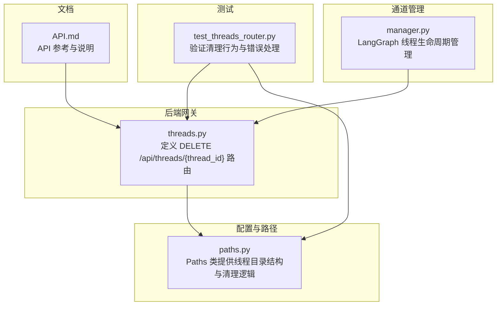
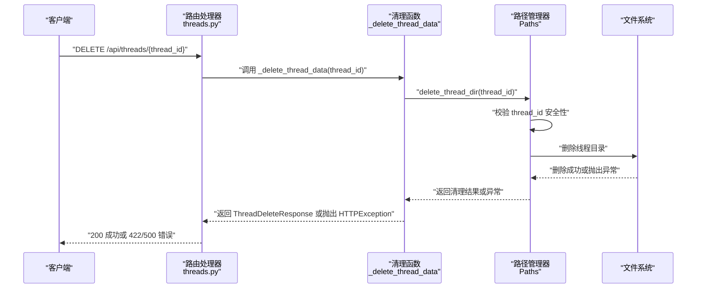
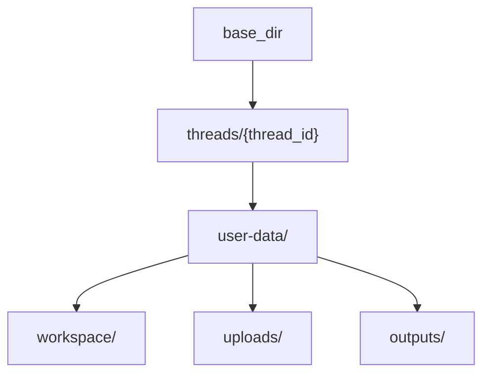
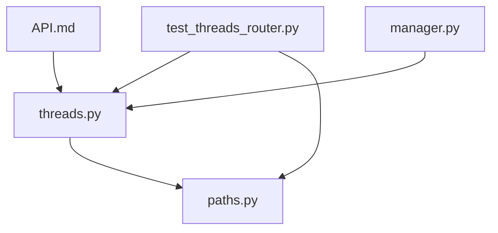

# 会话清理 API

<cite>
**本文引用的文件**
- [threads.py](file://backend/app/gateway/routers/threads.py)
- [paths.py](file://backend/packages/harness/deerflow/config/paths.py)
- [test_threads_router.py](file://backend/tests/test_threads_router.py)
- [API.md](file://backend/docs/API.md)
- [manager.py](file://backend/app/channels/manager.py)
</cite>

## 目录
1. [简介](#简介)
2. [项目结构](#项目结构)
3. [核心组件](#核心组件)
4. [架构概览](#架构概览)
5. [详细组件分析](#详细组件分析)
6. [依赖分析](#依赖分析)
7. [性能考虑](#性能考虑)
8. [故障排除指南](#故障排除指南)
9. [结论](#结论)
10. [附录](#附录)

## 简介
本文档专门介绍 DeerFlow 后端的会话清理 API，重点说明 DELETE /api/threads/{thread_id} 接口的功能与使用方法。该接口用于删除 DeerFlow 管理的本地线程文件，但不会影响 LangGraph 线程本身。文档详细阐述了清理操作的触发条件（LangGraph 线程删除后进行本地数据清理）、错误处理机制（422 无效线程 ID 和 500 服务器错误的响应格式）、最佳实践与注意事项（数据备份建议和清理前的状态检查）、本地线程数据的存储位置与文件结构、以及会话管理的完整生命周期与数据持久化策略。

## 项目结构
会话清理 API 位于后端网关路由中，与路径配置模块紧密协作，测试用例覆盖了关键行为与错误场景。

图表来源
- [threads.py:1-42](file://backend/app/gateway/routers/threads.py#L1-L42)
- [paths.py:12-243](file://backend/packages/harness/deerflow/config/paths.py#L12-L243)
- [test_threads_router.py:1-109](file://backend/tests/test_threads_router.py#L1-L109)
- [API.md:1-200](file://backend/docs/API.md#L1-L200)
- [manager.py:465-491](file://backend/app/channels/manager.py#L465-L491)

章节来源
- [threads.py:1-42](file://backend/app/gateway/routers/threads.py#L1-L42)
- [paths.py:12-243](file://backend/packages/harness/deerflow/config/paths.py#L12-L243)
- [test_threads_router.py:1-109](file://backend/tests/test_threads_router.py#L1-L109)
- [API.md:1-200](file://backend/docs/API.md#L1-L200)
- [manager.py:465-491](file://backend/app/channels/manager.py#L465-L491)

## 核心组件
- 路由与处理器：定义并实现 DELETE /api/threads/{thread_id}，负责调用路径管理器执行清理。
- 路径管理器：提供线程目录结构、安全校验与删除逻辑。
- 测试用例：覆盖正常清理、幂等性、无效线程 ID、路径穿越检测与 500 错误处理。
- 文档：提供 API 参考与使用说明。
- 通道管理：LangGraph 线程生命周期管理，与清理流程协同工作。

章节来源
- [threads.py:12-42](file://backend/app/gateway/routers/threads.py#L12-L42)
- [paths.py:95-183](file://backend/packages/harness/deerflow/config/paths.py#L95-L183)
- [test_threads_router.py:11-109](file://backend/tests/test_threads_router.py#L11-L109)
- [API.md:1-200](file://backend/docs/API.md#L1-L200)
- [manager.py:465-491](file://backend/app/channels/manager.py#L465-L491)

## 架构概览
会话清理 API 的调用链如下：
- 客户端请求 DELETE /api/threads/{thread_id}
- 路由处理器解析 thread_id 并调用清理函数
- 清理函数通过路径管理器执行删除操作
- 路径管理器对 thread_id 进行安全校验，删除线程目录
- 返回统一的清理结果模型

图表来源
- [threads.py:34-41](file://backend/app/gateway/routers/threads.py#L34-L41)
- [threads.py:19-31](file://backend/app/gateway/routers/threads.py#L19-L31)
- [paths.py:175-183](file://backend/packages/harness/deerflow/config/paths.py#L175-L183)

## 详细组件分析

### DELETE /api/threads/{thread_id} 接口
- 功能：删除 DeerFlow 管理的本地线程文件，不涉及 LangGraph 线程状态。
- 请求：DELETE /api/threads/{thread_id}
- 响应：ThreadDeleteResponse，包含 success 与 message 字段。
- 触发条件：LangGraph 线程删除后进行本地数据清理（LangGraph 线程状态删除由 LangGraph API 处理）。

章节来源
- [threads.py:34-41](file://backend/app/gateway/routers/threads.py#L34-L41)
- [threads.py:36-40](file://backend/app/gateway/routers/threads.py#L36-L40)

### 清理函数与错误处理
- _delete_thread_data(thread_id)：
  - 使用路径管理器删除线程目录
  - 对无效 thread_id 抛出 422
  - 对其他异常记录日志并抛出 500
- ThreadDeleteResponse：统一响应模型

章节来源
- [threads.py:19-31](file://backend/app/gateway/routers/threads.py#L19-L31)
- [threads.py:12-17](file://backend/app/gateway/routers/threads.py#L12-L17)

### 路径管理与线程目录结构
- 线程根目录：{base_dir}/threads/{thread_id}/
- 用户数据挂载点：{base_dir}/threads/{thread_id}/user-data/
- 子目录：
  - workspace：工作区
  - uploads：用户上传文件
  - outputs：代理生成的产物
- 删除逻辑：删除整个线程目录，支持幂等（不存在也视为成功）

图表来源
- [paths.py:16-31](file://backend/packages/harness/deerflow/config/paths.py#L16-L31)
- [paths.py:95-132](file://backend/packages/harness/deerflow/config/paths.py#L95-L132)

章节来源
- [paths.py:16-31](file://backend/packages/harness/deerflow/config/paths.py#L16-L31)
- [paths.py:95-132](file://backend/packages/harness/deerflow/config/paths.py#L95-L132)
- [paths.py:175-183](file://backend/packages/harness/deerflow/config/paths.py#L175-L183)

### LangGraph 线程生命周期与清理时机
- 线程创建：通道管理器通过 LangGraph SDK 创建线程，并在本地存储映射关系
- 线程复用：同一频道/聊天/话题可复用已有线程
- 清理时机：LangGraph 线程删除后，再调用本 API 清理本地持久化数据

章节来源
- [manager.py:465-491](file://backend/app/channels/manager.py#L465-L491)

### 错误处理机制
- 422 无效线程 ID：
  - 当 thread_id 包含非法字符或路径穿越时触发
  - 响应包含 "Invalid thread_id" 详情
- 500 服务器错误：
  - 文件系统删除失败时触发
  - 统一返回 "Failed to delete local thread data."，日志记录具体异常
- 404 未找到：
  - 路由层对无效线程 ID 的安全校验可能返回 404（取决于路由匹配）

章节来源
- [threads.py:24-28](file://backend/app/gateway/routers/threads.py#L24-L28)
- [test_threads_router.py:41-48](file://backend/tests/test_threads_router.py#L41-L48)
- [test_threads_router.py:96-109](file://backend/tests/test_threads_router.py#L96-L109)
- [test_threads_router.py:69-80](file://backend/tests/test_threads_router.py#L69-L80)

### 数据备份与清理前状态检查
- 最佳实践：
  - 在调用清理 API 前，确保已从 LangGraph 端完成线程删除
  - 对重要数据进行备份（如 outputs 中的产物）
  - 检查线程目录是否存在，避免不必要的删除操作
- 注意事项：
  - 清理是幂等的，重复调用不会产生副作用
  - 清理仅影响本地持久化数据，不影响 LangGraph 线程状态

章节来源
- [test_threads_router.py:32-39](file://backend/tests/test_threads_router.py#L32-L39)
- [threads.py:36-40](file://backend/app/gateway/routers/threads.py#L36-L40)

## 依赖分析
- 路由依赖路径管理器：清理函数通过 Paths.delete_thread_dir 执行删除
- 测试依赖路由与路径管理器：验证清理行为、幂等性与错误处理
- 文档依赖路由与路径管理器：提供 API 参考与说明

图表来源
- [threads.py:1-7](file://backend/app/gateway/routers/threads.py#L1-L7)
- [paths.py:6-7](file://backend/packages/harness/deerflow/config/paths.py#L6-L7)
- [test_threads_router.py:7-8](file://backend/tests/test_threads_router.py#L7-L8)
- [API.md:1-12](file://backend/docs/API.md#L1-L12)
- [manager.py:1-19](file://backend/app/channels/manager.py#L1-L19)

章节来源
- [threads.py:1-7](file://backend/app/gateway/routers/threads.py#L1-L7)
- [paths.py:6-7](file://backend/packages/harness/deerflow/config/paths.py#L6-L7)
- [test_threads_router.py:7-8](file://backend/tests/test_threads_router.py#L7-L8)
- [API.md:1-12](file://backend/docs/API.md#L1-L12)
- [manager.py:1-19](file://backend/app/channels/manager.py#L1-L19)

## 性能考虑
- 清理操作为文件系统级删除，通常较快；若线程目录较大，需注意磁盘 I/O 影响
- 幂等设计避免重复删除带来的额外开销
- 建议在批量清理时控制并发，避免对文件系统造成过大压力

## 故障排除指南
- 422 无效线程 ID：
  - 检查 thread_id 是否仅包含允许的字符（字母、数字、下划线、连字符）
  - 避免路径穿越（如 ../）
- 500 服务器错误：
  - 查看后端日志中的异常堆栈
  - 确认 base_dir 权限与磁盘空间
- 404 未找到：
  - 确认路由路径正确且 thread_id 符合安全规则

章节来源
- [threads.py:24-28](file://backend/app/gateway/routers/threads.py#L24-L28)
- [test_threads_router.py:41-48](file://backend/tests/test_threads_router.py#L41-L48)
- [test_threads_router.py:96-109](file://backend/tests/test_threads_router.py#L96-L109)

## 结论
DELETE /api/threads/{thread_id} 是 DeerFlow 会话管理的重要组成部分，专注于清理本地持久化数据。它与 LangGraph 线程生命周期解耦，确保在 LangGraph 线程删除后再进行本地清理，从而保持数据一致性。通过严格的输入校验、统一的错误处理与幂等设计，该接口具备良好的安全性与可靠性。遵循本文档的最佳实践与注意事项，可有效保障数据安全与系统稳定。

## 附录
- API 参考与使用说明请参阅后端文档
- LangGraph 线程生命周期与通道管理请参阅相关源码

章节来源
- [API.md:1-200](file://backend/docs/API.md#L1-L200)
- [manager.py:465-491](file://backend/app/channels/manager.py#L465-L491)