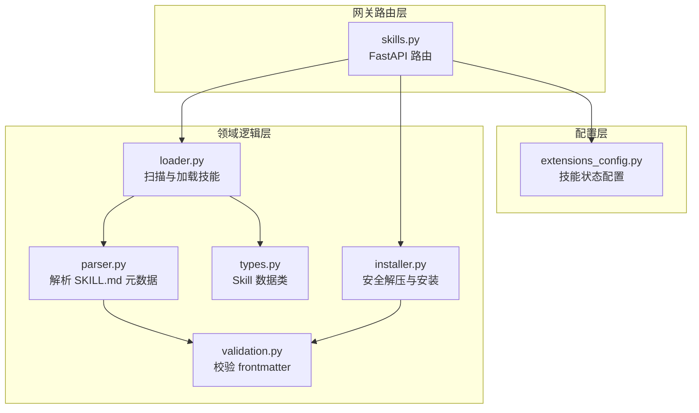
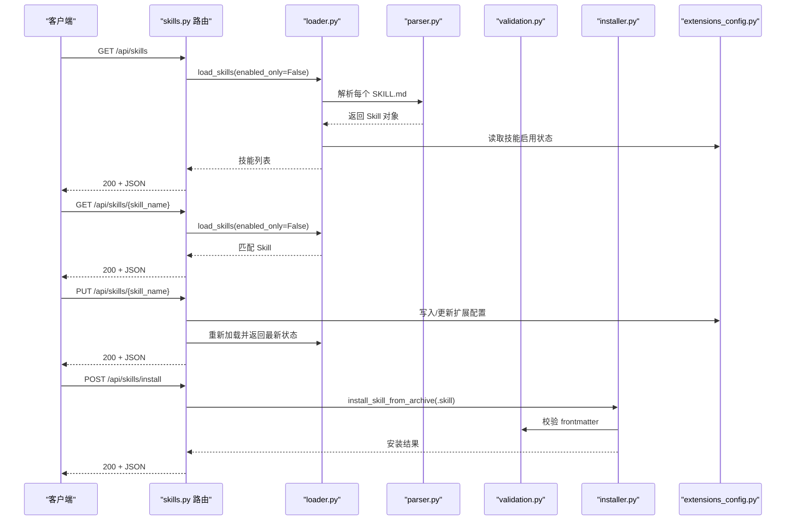
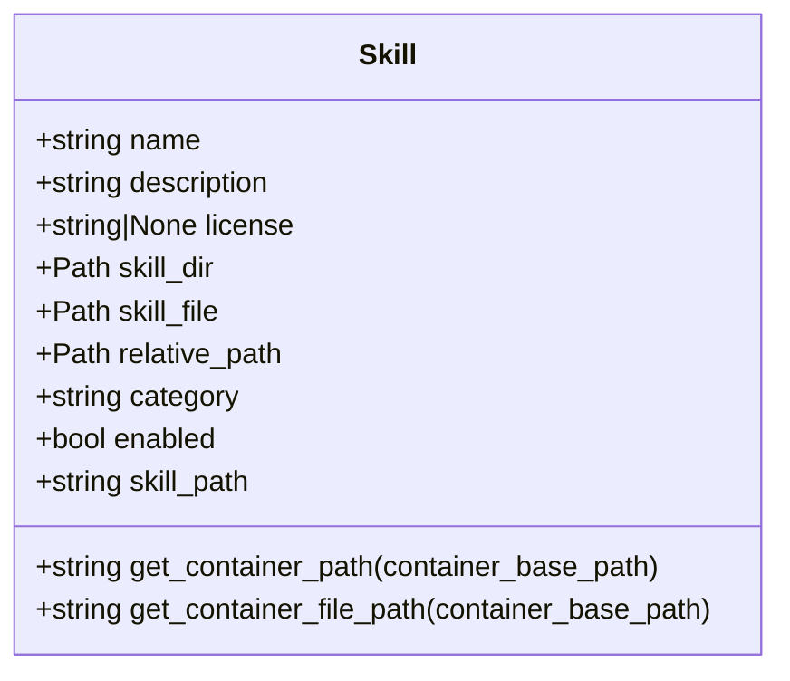
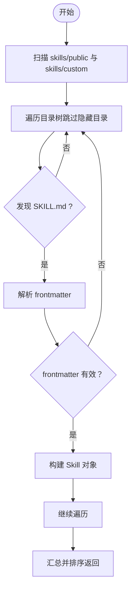
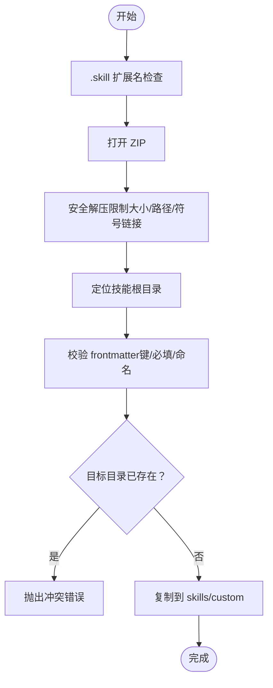
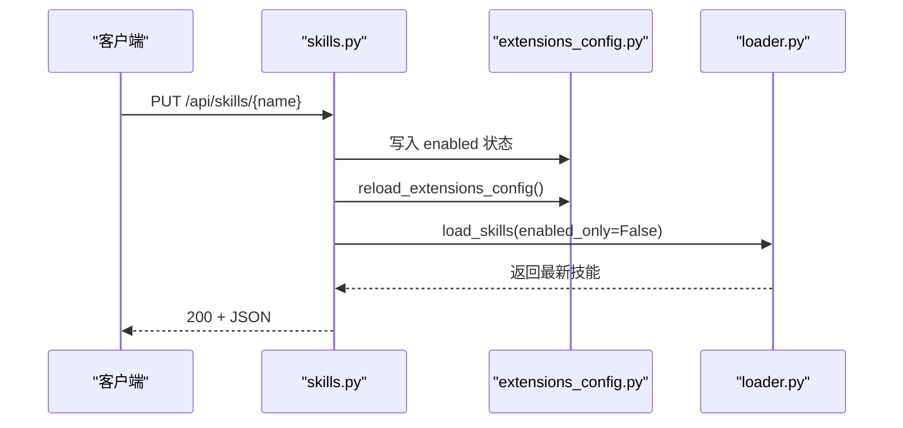
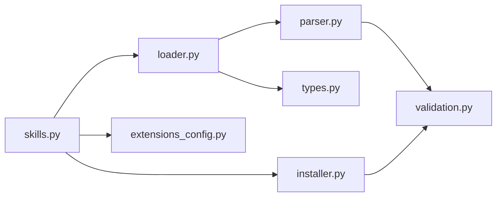

# 技能管理 API

<cite>
**本文引用的文件**
- [skills.py](file://backend/app/gateway/routers/skills.py)
- [__init__.py](file://backend/packages/harness/deerflow/skills/__init__.py)
- [types.py](file://backend/packages/harness/deerflow/skills/types.py)
- [loader.py](file://backend/packages/harness/deerflow/skills/loader.py)
- [installer.py](file://backend/packages/harness/deerflow/skills/installer.py)
- [parser.py](file://backend/packages/harness/deerflow/skills/parser.py)
- [validation.py](file://backend/packages/harness/deerflow/skills/validation.py)
- [extensions_config.py](file://backend/packages/harness/deerflow/config/extensions_config.py)
- [API.md](file://backend/docs/API.md)
- [test_skills_router.py](file://backend/tests/test_skills_router.py)
- [test_skills_installer.py](file://backend/tests/test_skills_installer.py)
- [test_skills_loader.py](file://backend/tests/test_skills_loader.py)
- [SKILL.md（示例）](file://skills/public/chart-visualization/SKILL.md)
- [SKILL.md（示例）](file://skills/public/data-analysis/SKILL.md)
- [SKILL.md（示例）](file://skills/public/skill-creator/SKILL.md)
</cite>

## 目录
1. [简介](#简介)
2. [项目结构](#项目结构)
3. [核心组件](#核心组件)
4. [架构总览](#架构总览)
5. [详细组件分析](#详细组件分析)
6. [依赖分析](#依赖分析)
7. [性能考虑](#性能考虑)
8. [故障排查指南](#故障排查指南)
9. [结论](#结论)
10. [附录：技能开发与部署工作流](#附录技能开发与部署工作流)

## 简介
本文件为 DeerFlow 技能管理 API 的权威文档，覆盖以下能力：
- 列出所有可用技能（公共与自定义）
- 查询指定技能的元数据
- 启用/禁用技能
- 从 .skill 压缩包安装新技能
- 技能元数据与容器内路径映射
- 安全安装策略与前端校验规则

同时提供技能开发、测试与部署的完整工作流程，帮助开发者快速构建高质量可复用技能。

## 项目结构
技能系统由“网关路由层”和“领域逻辑层”组成：
- 路由层：FastAPI 路由，负责请求解析、错误处理与响应模型
- 领域层：加载器、解析器、验证器、安装器与配置管理
- 配置层：统一扩展配置（MCP 与技能状态）

图表来源
- [skills.py:1-174](file://backend/app/gateway/routers/skills.py#L1-L174)
- [loader.py:1-99](file://backend/packages/harness/deerflow/skills/loader.py#L1-L99)
- [parser.py:1-66](file://backend/packages/harness/deerflow/skills/parser.py#L1-L66)
- [validation.py:1-86](file://backend/packages/harness/deerflow/skills/validation.py#L1-L86)
- [installer.py:1-177](file://backend/packages/harness/deerflow/skills/installer.py#L1-L177)
- [types.py:1-54](file://backend/packages/harness/deerflow/skills/types.py#L1-L54)
- [extensions_config.py:1-259](file://backend/packages/harness/deerflow/config/extensions_config.py#L1-L259)

章节来源
- [skills.py:1-174](file://backend/app/gateway/routers/skills.py#L1-L174)
- [loader.py:1-99](file://backend/packages/harness/deerflow/skills/loader.py#L1-L99)
- [extensions_config.py:1-259](file://backend/packages/harness/deerflow/config/extensions_config.py#L1-L259)

## 核心组件
- 路由与响应模型
  - 列表与详情：返回技能名称、描述、许可证、分类与启用状态
  - 更新：通过写入扩展配置文件控制技能启用状态
  - 安装：基于 .skill 压缩包的安全安装流程
- 领域模型
  - Skill：封装技能元数据、相对路径与容器路径计算
- 加载与解析
  - 递归扫描 skills/public 与 skills/custom，解析 SKILL.md frontmatter
  - 读取扩展配置决定启用状态
- 安装与安全
  - 拒绝绝对路径、目录穿越、符号链接与 zip bomb
  - 校验 frontmatter 字段与命名规范

章节来源
- [skills.py:18-174](file://backend/app/gateway/routers/skills.py#L18-L174)
- [types.py:5-54](file://backend/packages/harness/deerflow/skills/types.py#L5-L54)
- [loader.py:22-99](file://backend/packages/harness/deerflow/skills/loader.py#L22-L99)
- [parser.py:7-66](file://backend/packages/harness/deerflow/skills/parser.py#L7-L66)
- [validation.py:15-86](file://backend/packages/harness/deerflow/skills/validation.py#L15-L86)
- [installer.py:110-177](file://backend/packages/harness/deerflow/skills/installer.py#L110-L177)

## 架构总览
技能管理 API 的端到端调用链如下：

图表来源
- [skills.py:66-174](file://backend/app/gateway/routers/skills.py#L66-L174)
- [loader.py:22-99](file://backend/packages/harness/deerflow/skills/loader.py#L22-L99)
- [parser.py:7-66](file://backend/packages/harness/deerflow/skills/parser.py#L7-L66)
- [validation.py:15-86](file://backend/packages/harness/deerflow/skills/validation.py#L15-L86)
- [installer.py:110-177](file://backend/packages/harness/deerflow/skills/installer.py#L110-L177)
- [extensions_config.py:119-200](file://backend/packages/harness/deerflow/config/extensions_config.py#L119-L200)

## 详细组件分析

### 接口规范与响应模型

- GET /api/skills
  - 功能：列出所有可用技能（公共与自定义）
  - 响应模型：包含 skills 数组，每项包含 name、description、license、category、enabled
  - 错误：500 服务器内部错误时返回统一错误体
  - 参考：[skills.py:66-79](file://backend/app/gateway/routers/skills.py#L66-L79)

- GET /api/skills/{skill_name}
  - 功能：按名称获取技能详情
  - 响应模型：同上（不包含 allowed_tools/content 字段）
  - 错误：404 未找到、500 服务器内部错误
  - 参考：[skills.py:81-101](file://backend/app/gateway/routers/skills.py#L81-L101)

- PUT /api/skills/{skill_name}
  - 功能：更新技能启用状态
  - 请求体：enabled 布尔值
  - 行为：写入扩展配置文件，刷新缓存并重新加载技能
  - 响应：返回更新后的技能对象
  - 错误：404 未找到、500 服务器内部错误
  - 参考：[skills.py:103-149](file://backend/app/gateway/routers/skills.py#L103-L149)

- POST /api/skills/install
  - 功能：从 .skill 压缩包安装技能
  - 请求体：multipart/form-data，包含 file 字段
  - 行为：安全解压、过滤 macOS 元数据、校验 frontmatter、去重检查、复制到 skills/custom
  - 响应：success、skill_name、message
  - 错误：400 参数无效、404 文件不存在、409 冲突、500 服务器内部错误
  - 参考：[skills.py:152-174](file://backend/app/gateway/routers/skills.py#L152-L174)

章节来源
- [skills.py:66-174](file://backend/app/gateway/routers/skills.py#L66-L174)
- [API.md:281-387](file://backend/docs/API.md#L281-L387)

### 数据模型与容器路径

Skill 数据类包含以下关键字段与方法：
- name、description、license、skill_dir、skill_file、relative_path、category、enabled
- 计算容器内路径的方法：get_container_path、get_container_file_path
- 相对路径 skill_path 的计算逻辑

图表来源
- [types.py:5-54](file://backend/packages/harness/deerflow/skills/types.py#L5-L54)

章节来源
- [types.py:5-54](file://backend/packages/harness/deerflow/skills/types.py#L5-L54)

### 技能加载与解析流程

- 加载器
  - 递归扫描 public/custom 目录，跳过隐藏目录
  - 发现 SKILL.md 即解析为 Skill 对象
  - 读取扩展配置决定 enabled 状态
  - 按名称排序返回

- 解析器
  - 提取 YAML frontmatter，要求 name 与 description 存在
  - 其余字段作为可选元数据（如 license、version、author 等）

图表来源
- [loader.py:22-99](file://backend/packages/harness/deerflow/skills/loader.py#L22-L99)
- [parser.py:7-66](file://backend/packages/harness/deerflow/skills/parser.py#L7-L66)

章节来源
- [loader.py:22-99](file://backend/packages/harness/deerflow/skills/loader.py#L22-L99)
- [parser.py:7-66](file://backend/packages/harness/deerflow/skills/parser.py#L7-L66)

### 安装器与安全策略

- 安全检查
  - 拒绝绝对路径与目录穿越
  - 过滤符号链接
  - 过滤 macOS 元数据目录与点文件
  - 限制总解压大小，防御 zip bomb

- 安装步骤
  - 校验 .skill 扩展名与 ZIP 格式
  - 定位技能根目录（过滤后）
  - 校验 frontmatter（键名、必填项、命名规范）
  - 去重检查（同名技能已存在）
  - 复制到 skills/custom/{name}

图表来源
- [installer.py:110-177](file://backend/packages/harness/deerflow/skills/installer.py#L110-L177)
- [validation.py:15-86](file://backend/packages/harness/deerflow/skills/validation.py#L15-L86)

章节来源
- [installer.py:110-177](file://backend/packages/harness/deerflow/skills/installer.py#L110-L177)
- [validation.py:15-86](file://backend/packages/harness/deerflow/skills/validation.py#L15-L86)

### 技能启用/禁用流程

- 更新请求
  - 写入扩展配置文件（skills 映射）
  - 刷新配置缓存
  - 重新加载技能并返回最新状态

图表来源
- [skills.py:109-143](file://backend/app/gateway/routers/skills.py#L109-L143)
- [extensions_config.py:220-235](file://backend/packages/harness/deerflow/config/extensions_config.py#L220-L235)
- [loader.py:81-98](file://backend/packages/harness/deerflow/skills/loader.py#L81-L98)

章节来源
- [skills.py:109-143](file://backend/app/gateway/routers/skills.py#L109-L143)
- [extensions_config.py:220-235](file://backend/packages/harness/deerflow/config/extensions_config.py#L220-L235)
- [loader.py:81-98](file://backend/packages/harness/deerflow/skills/loader.py#L81-L98)

## 依赖分析

图表来源
- [skills.py:1-174](file://backend/app/gateway/routers/skills.py#L1-L174)
- [loader.py:1-99](file://backend/packages/harness/deerflow/skills/loader.py#L1-L99)
- [parser.py:1-66](file://backend/packages/harness/deerflow/skills/parser.py#L1-L66)
- [validation.py:1-86](file://backend/packages/harness/deerflow/skills/validation.py#L1-L86)
- [installer.py:1-177](file://backend/packages/harness/deerflow/skills/installer.py#L1-L177)
- [types.py:1-54](file://backend/packages/harness/deerflow/skills/types.py#L1-L54)
- [extensions_config.py:1-259](file://backend/packages/harness/deerflow/config/extensions_config.py#L1-L259)

章节来源
- [skills.py:1-174](file://backend/app/gateway/routers/skills.py#L1-L174)
- [loader.py:1-99](file://backend/packages/harness/deerflow/skills/loader.py#L1-L99)
- [parser.py:1-66](file://backend/packages/harness/deerflow/skills/parser.py#L1-L66)
- [validation.py:1-86](file://backend/packages/harness/deerflow/skills/validation.py#L1-L86)
- [installer.py:1-177](file://backend/packages/harness/deerflow/skills/installer.py#L1-L177)
- [types.py:1-54](file://backend/packages/harness/deerflow/skills/types.py#L1-L54)
- [extensions_config.py:1-259](file://backend/packages/harness/deerflow/config/extensions_config.py#L1-L259)

## 性能考虑
- 加载性能
  - 递归扫描目录时跳过隐藏目录，减少 IO
  - 使用最小必要字段构建 Skill 对象，避免重复解析
- 安装性能
  - 安全解压阶段限制总写入字节数，防止 zip bomb
  - 解压后一次性复制到目标目录，减少多次系统调用
- 配置读取
  - 扩展配置采用延迟加载与缓存，更新后显式刷新

[本节为通用建议，无需源码引用]

## 故障排查指南
- 400 错误（参数无效）
  - 安装：非 .skill 文件、压缩包损坏、frontmatter 缺失或非法键
  - 启用/禁用：请求体缺失 enabled 字段
  - 参考：[skills.py:163-168](file://backend/app/gateway/routers/skills.py#L163-L168)
- 404 错误（资源未找到）
  - 安装：.skill 文件不存在
  - 技能：技能名称不存在
  - 参考：[skills.py:163-164](file://backend/app/gateway/routers/skills.py#L163-L164)
- 409 冲突（技能已存在）
  - 安装：目标目录已存在同名技能
  - 参考：[installer.py:166-167](file://backend/packages/harness/deerflow/skills/installer.py#L166-L167)
- 500 错误（服务器内部错误）
  - 技能加载失败、配置写入失败、异常未捕获
  - 参考：[skills.py:77-78](file://backend/app/gateway/routers/skills.py#L77-L78)

章节来源
- [skills.py:158-174](file://backend/app/gateway/routers/skills.py#L158-L174)
- [installer.py:130-177](file://backend/packages/harness/deerflow/skills/installer.py#L130-L177)

## 结论
技能管理 API 提供了从加载、解析、校验到安装与启停的完整闭环。通过严格的 frontmatter 校验与安全安装策略，确保技能生态的可维护性与安全性；通过扩展配置集中管理技能启用状态，便于运维与审计。

[本节为总结，无需源码引用]

## 附录：技能开发与部署工作流

### 开发前准备
- 在本地仓库 skills/public 或 skills/custom 下创建技能目录
- 编写 SKILL.md，至少包含 name 与 description，遵循命名规范（小写字母、数字、短横线，不超过 64 字符）
- 可选：添加脚本、参考文档与资源文件

章节来源
- [validation.py:58-72](file://backend/packages/harness/deerflow/skills/validation.py#L58-L72)
- [SKILL.md（示例）:1-73](file://skills/public/chart-visualization/SKILL.md#L1-L73)
- [SKILL.md（示例）:1-249](file://skills/public/data-analysis/SKILL.md#L1-L249)
- [SKILL.md（示例）:1-486](file://skills/public/skill-creator/SKILL.md#L1-L486)

### 本地调试
- 启动后端服务，访问 /api/skills 查看技能是否被正确加载
- 使用 /api/skills/{skill_name} 校验元数据
- 通过 /api/skills/{skill_name} 启用/禁用技能，观察扩展配置文件变化

章节来源
- [loader.py:22-99](file://backend/packages/harness/deerflow/skills/loader.py#L22-L99)
- [extensions_config.py:185-199](file://backend/packages/harness/deerflow/config/extensions_config.py#L185-L199)

### 打包与安装
- 使用打包工具生成 .skill 压缩包（包含 SKILL.md 与资源文件）
- 通过 /api/skills/install 安装至 skills/custom/{name}
- 安装后再次加载技能，确认 frontmatter 与容器路径

章节来源
- [installer.py:110-177](file://backend/packages/harness/deerflow/skills/installer.py#L110-L177)
- [parser.py:7-66](file://backend/packages/harness/deerflow/skills/parser.py#L7-L66)
- [types.py:24-50](file://backend/packages/harness/deerflow/skills/types.py#L24-L50)

### 测试建议
- 单元测试覆盖
  - frontmatter 校验：允许合法可选字段，拒绝未知键
  - 安装器：拒绝绝对路径、目录穿越、符号链接、zip bomb
  - 加载器：递归发现、隐藏目录过滤、容器路径计算
- 参考测试文件
  - [test_skills_router.py:18-89](file://backend/tests/test_skills_router.py#L18-L89)
  - [test_skills_installer.py:167-224](file://backend/tests/test_skills_installer.py#L167-L224)
  - [test_skills_loader.py:22-65](file://backend/tests/test_skills_loader.py#L22-L65)

章节来源
- [test_skills_router.py:18-89](file://backend/tests/test_skills_router.py#L18-L89)
- [test_skills_installer.py:167-224](file://backend/tests/test_skills_installer.py#L167-L224)
- [test_skills_loader.py:22-65](file://backend/tests/test_skills_loader.py#L22-L65)