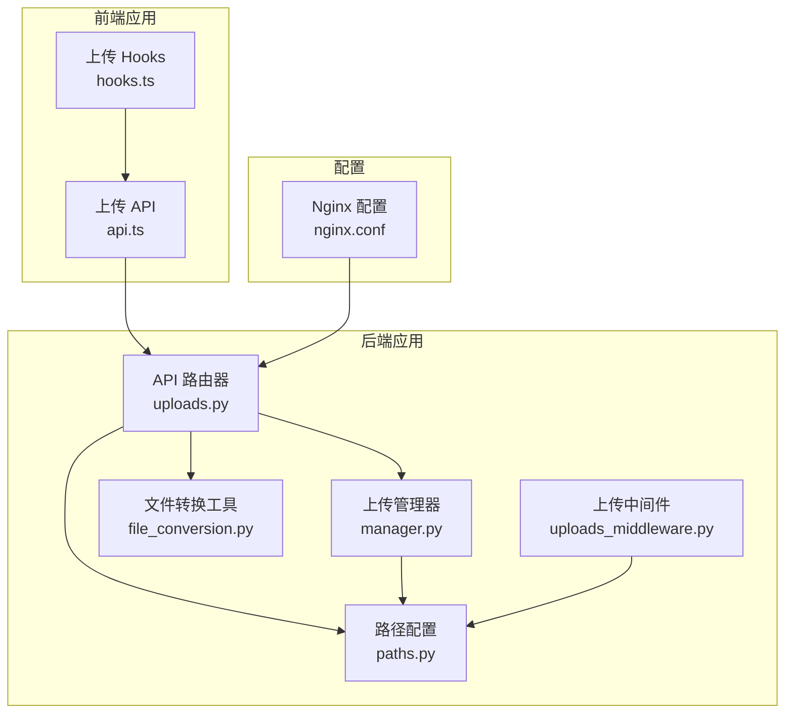
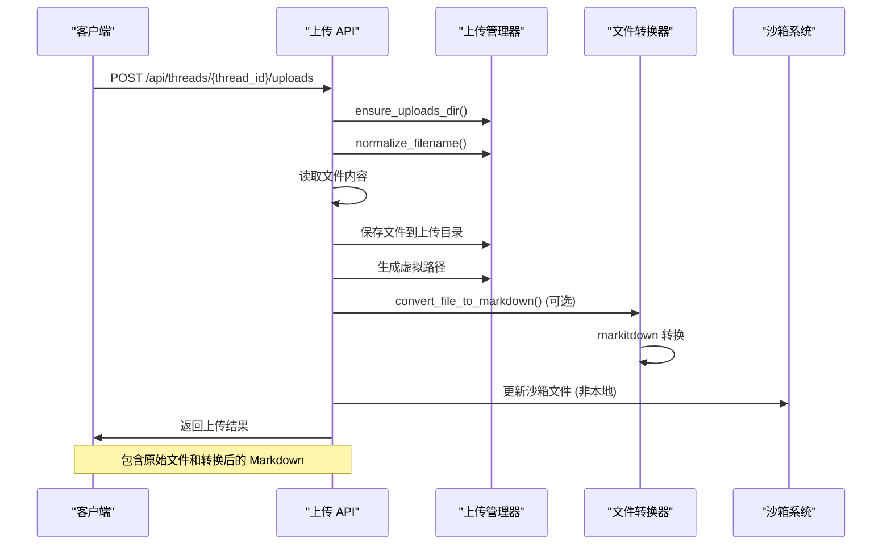
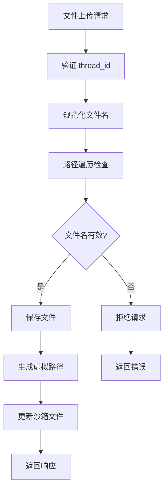

# 文件上传 API

<cite>
**本文档引用的文件**
- [uploads.py](file://backend/app/gateway/routers/uploads.py)
- [manager.py](file://backend/packages/harness/deerflow/uploads/manager.py)
- [file_conversion.py](file://backend/packages/harness/deerflow/utils/file_conversion.py)
- [paths.py](file://backend/packages/harness/deerflow/config/paths.py)
- [uploads_middleware.py](file://backend/packages/harness/deerflow/agents/middlewares/uploads_middleware.py)
- [FILE_UPLOAD.md](file://backend/docs/FILE_UPLOAD.md)
- [nginx.conf](file://docker/nginx/nginx.conf)
- [nginx.local.conf](file://docker/nginx/nginx.local.conf)
- [test_uploads_router.py](file://backend/tests/test_uploads_router.py)
- [test_uploads_manager.py](file://backend/tests/test_uploads_manager.py)
- [test_uploads_middleware_core_logic.py](file://backend/tests/test_uploads_middleware_core_logic.py)
- [api.ts](file://frontend/src/core/uploads/api.ts)
- [hooks.ts](file://frontend/src/core/uploads/hooks.ts)
</cite>

## 目录
1. [简介](#简介)
2. [项目结构](#项目结构)
3. [核心组件](#核心组件)
4. [架构概览](#架构概览)
5. [详细组件分析](#详细组件分析)
6. [依赖关系分析](#依赖关系分析)
7. [性能考虑](#性能考虑)
8. [故障排除指南](#故障排除指南)
9. [结论](#结论)

## 简介

文件上传 API 是 DeerFlow 平台的核心功能之一，提供完整的文件上传、管理和访问能力。该系统支持多文件上传，自动将 Office 文档和 PDF 转换为 Markdown 格式，并提供安全的文件访问机制。

主要特性包括：
- ✅ 多文件同时上传
- ✅ 自动文档转换为 Markdown（PDF、PPT、Excel、Word）
- ✅ 线程隔离的文件存储
- ✅ Agent 自动感知已上传文件
- ✅ 完整的文件管理功能（列表、删除）

## 项目结构

文件上传功能分布在多个模块中：



**图表来源**
- [uploads.py:1-147](file://backend/app/gateway/routers/uploads.py#L1-L147)
- [manager.py:1-202](file://backend/packages/harness/deerflow/uploads/manager.py#L1-L202)
- [file_conversion.py:1-48](file://backend/packages/harness/deerflow/utils/file_conversion.py#L1-L48)

**章节来源**
- [uploads.py:1-147](file://backend/app/gateway/routers/uploads.py#L1-L147)
- [paths.py:12-243](file://backend/packages/harness/deerflow/config/paths.py#L12-L243)

## 核心组件

### API 路由器

API 路由器提供三个主要端点：
- `POST /api/threads/{thread_id}/uploads` - 多文件上传
- `GET /api/threads/{thread_id}/uploads/list` - 文件列表查询
- `DELETE /api/threads/{thread_id}/uploads/{filename}` - 文件删除

### 上传管理器

负责文件系统的安全操作，包括：
- 文件名安全验证
- 路径遍历防护
- 文件删除操作
- 虚拟路径生成

### 文件转换工具

支持多种文档格式的自动转换：
- PDF (.pdf)
- PowerPoint (.ppt, .pptx)
- Excel (.xls, .xlsx)
- Word (.doc, .docx)

**章节来源**
- [uploads.py:36-147](file://backend/app/gateway/routers/uploads.py#L36-L147)
- [manager.py:15-202](file://backend/packages/harness/deerflow/uploads/manager.py#L15-L202)
- [file_conversion.py:12-48](file://backend/packages/harness/deerflow/utils/file_conversion.py#L12-L48)

## 架构概览



**图表来源**
- [uploads.py:37-110](file://backend/app/gateway/routers/uploads.py#L37-L110)
- [file_conversion.py:24-47](file://backend/packages/harness/deerflow/utils/file_conversion.py#L24-L47)

## 详细组件分析

### POST /api/threads/{thread_id}/uploads - 多文件上传

#### 请求格式
- **方法**: POST
- **路径参数**: 
  - `thread_id` (字符串): 线程标识符，仅允许字母数字、连字符、下划线和点
- **请求体**: `multipart/form-data`
  - `files` (文件数组): 一个或多个文件对象

#### 成功响应
响应包含以下字段：
- `success` (布尔): 操作是否成功
- `files` (数组): 上传文件的详细信息
- `message` (字符串): 操作结果描述

每个文件对象包含：
- `filename` (字符串): 原始文件名
- `size` (字符串): 文件大小（字节）
- `path` (字符串): 实际文件系统路径
- `virtual_path` (字符串): Agent 虚拟路径
- `artifact_url` (字符串): 前端访问 URL
- `markdown_file` (字符串, 可选): 转换后的 Markdown 文件名
- `markdown_path` (字符串, 可选): Markdown 文件的实际路径
- `markdown_virtual_path` (字符串, 可选): Markdown 文件的虚拟路径
- `markdown_artifact_url` (字符串, 可选): Markdown 文件的访问 URL

#### 错误处理
- **400 Bad Request**: 无文件提供或无效的 thread_id
- **500 Internal Server Error**: 文件保存失败

#### 文件转换机制
当上传的文件扩展名属于可转换列表时，系统会自动执行转换：
1. 使用 markitdown 库进行文档转换
2. 保存转换后的 Markdown 文件
3. 更新沙箱文件系统
4. 返回 Markdown 相关字段

**章节来源**
- [uploads.py:36-110](file://backend/app/gateway/routers/uploads.py#L36-L110)
- [file_conversion.py:12-48](file://backend/packages/harness/deerflow/utils/file_conversion.py#L12-L48)

### GET /api/threads/{thread_id}/uploads/list - 文件列表查询

#### 请求格式
- **方法**: GET
- **路径参数**: `thread_id` (字符串): 线程标识符

#### 响应格式
- `files` (数组): 文件列表
- `count` (整数): 文件总数

每个文件对象包含：
- `filename` (字符串): 文件名
- `size` (字符串): 文件大小（字节）
- `path` (字符串): 实际文件系统路径
- `virtual_path` (字符串): 虚拟路径
- `artifact_url` (字符串): 访问 URL
- `extension` (字符串): 文件扩展名
- `modified` (浮点数): 修改时间戳

#### 安全特性
- 自动验证 thread_id 的安全性
- 防止路径遍历攻击
- 线程间文件隔离

**章节来源**
- [uploads.py:113-128](file://backend/app/gateway/routers/uploads.py#L113-L128)
- [manager.py:111-141](file://backend/packages/harness/deerflow/uploads/manager.py#L111-L141)

### DELETE /api/threads/{thread_id}/uploads/{filename} - 文件删除

#### 请求格式
- **方法**: DELETE
- **路径参数**:
  - `thread_id` (字符串): 线程标识符
  - `filename` (字符串): 要删除的文件名

#### 响应格式
- `success` (布尔): 操作是否成功
- `message` (字符串): 操作结果描述

#### 删除规则
- 删除主文件时，如果存在对应的 Markdown 文件也会被删除
- 支持路径遍历防护
- 确保文件存在性检查

**章节来源**
- [uploads.py:131-147](file://backend/app/gateway/routers/uploads.py#L131-L147)
- [manager.py:144-175](file://backend/packages/harness/deerflow/uploads/manager.py#L144-L175)

### 文件路径安全控制

系统实现了多层次的安全保护：



**图表来源**
- [manager.py:23-71](file://backend/packages/harness/deerflow/uploads/manager.py#L23-L71)
- [manager.py:99-109](file://backend/packages/harness/deerflow/uploads/manager.py#L99-L109)

**章节来源**
- [manager.py:15-71](file://backend/packages/harness/deerflow/uploads/manager.py#L15-L71)
- [manager.py:99-109](file://backend/packages/harness/deerflow/uploads/manager.py#L99-L109)

### 虚拟路径映射

系统使用统一的虚拟路径前缀 `/mnt/user-data`：

```mermaid
graph LR
subgraph "沙箱内部"
A[/mnt/user-data/uploads/]
B[/mnt/user-data/workspace/]
C[/mnt/user-data/outputs/]
end
subgraph "主机文件系统"
D[.deer-flow/threads/{thread_id}/user-data/uploads/]
E[.deer-flow/threads/{thread_id}/user-data/workspace/]
F[.deer-flow/threads/{thread_id}/user-data/outputs/]
end
A -.-> D
B -.-> E
C -.-> F
```

**图表来源**
- [paths.py:6-VIRTUAL_PATH_PREFIX:6-7](file://backend/packages/harness/deerflow/config/paths.py#L6-L7)
- [paths.py:118-124](file://backend/packages/harness/deerflow/config/paths.py#L118-L124)

**章节来源**
- [paths.py:6-7](file://backend/packages/harness/deerflow/config/paths.py#L6-L7)
- [paths.py:118-124](file://backend/packages/harness/deerflow/config/paths.py#L118-L124)

### 文件访问权限

#### 前端访问
- 使用 `artifact_url` 字段访问文件
- 支持 `?download=true` 参数强制下载
- 遵循 Nginx 配置的文件大小限制

#### Agent 权限
- Agent 只能访问虚拟路径
- 无法直接访问主机文件系统
- 通过沙箱系统进行文件访问

#### 线程隔离
- 每个线程有独立的上传目录
- 文件访问严格限制在对应线程内
- 防止跨线程文件访问

**章节来源**
- [nginx.conf:133-144](file://docker/nginx/nginx.conf#L133-L144)
- [uploads_middleware.py:104-116](file://backend/packages/harness/deerflow/agents/middlewares/uploads_middleware.py#L104-L116)

## 依赖关系分析

```mermaid
classDiagram
class UploadRouter {
+upload_files(thread_id, files)
+list_uploaded_files(thread_id)
+delete_uploaded_file(thread_id, filename)
}
class UploadManager {
+normalize_filename(filename)
+validate_path_traversal(path, base)
+delete_file_safe(base_dir, filename)
+upload_virtual_path(filename)
+upload_artifact_url(thread_id, filename)
}
class FileConverter {
+convert_file_to_markdown(file_path)
+CONVERTIBLE_EXTENSIONS
}
class PathConfig {
+VIRTUAL_PATH_PREFIX
+sandbox_uploads_dir(thread_id)
+resolve_virtual_path(thread_id, virtual_path)
}
UploadRouter --> UploadManager : "使用"
UploadRouter --> FileConverter : "使用"
UploadRouter --> PathConfig : "使用"
UploadManager --> PathConfig : "使用"
```



**图表来源**
- [uploads.py:10-21](file://backend/app/gateway/routers/uploads.py#L10-L21)
- [manager.py:12-12](file://backend/packages/harness/deerflow/uploads/manager.py#L12-L12)
- [file_conversion.py:13-21](file://backend/packages/harness/deerflow/utils/file_conversion.py#L13-L21)
- [paths.py:7-7](file://backend/packages/harness/deerflow/config/paths.py#L7-L7)

**章节来源**
- [uploads.py:10-21](file://backend/app/gateway/routers/uploads.py#L10-L21)
- [manager.py:12-12](file://backend/packages/harness/deerflow/uploads/manager.py#L12-L12)

## 性能考虑

### 文件大小限制
- Nginx 配置支持最大 100MB 文件上传
- 可根据需要调整 `client_max_body_size` 参数

### 转换性能优化
- 对于本地沙箱环境，跳过不必要的文件同步
- 非本地沙箱环境才进行文件同步操作
- Markdown 转换使用异步处理避免阻塞

### 缓存策略
- 文件列表查询结果可根据需要进行缓存
- Agent 文件感知通过中间件实时生成

## 故障排除指南

### 常见问题及解决方案

#### 文件上传失败
1. **检查文件大小**: 确保文件不超过 100MB 限制
2. **验证 thread_id**: 确保 thread_id 仅包含允许的字符
3. **检查磁盘空间**: 确保有足够的磁盘空间
4. **查看日志**: 使用 `make gateway` 查看后端日志

#### 文档转换失败
1. **检查依赖**: 确保 markitdown 库正确安装
2. **查看错误日志**: 分析具体的转换错误信息
3. **文件完整性**: 某些损坏或加密的文档可能无法转换

#### Agent 无法访问文件
1. **确认中间件**: 确保 UploadsMiddleware 已正确注册
2. **检查文件存在**: 验证文件确实存在于上传目录
3. **沙箱同步**: 非本地沙箱环境下确认同步操作成功

**章节来源**
- [FILE_UPLOAD.md:232-252](file://backend/docs/FILE_UPLOAD.md#L232-L252)
- [test_uploads_router.py:11-116](file://backend/tests/test_uploads_router.py#L11-L116)

## 结论

文件上传 API 提供了安全、可靠的文件管理功能，具有以下优势：

1. **安全性**: 多层防护机制防止路径遍历和跨线程访问
2. **自动化**: 支持多种文档格式的自动转换
3. **隔离性**: 线程级别的文件隔离确保数据安全
4. **易用性**: 简洁的 API 设计和完善的错误处理
5. **可扩展性**: 模块化设计便于功能扩展和维护

该系统为 DeerFlow 平台的文档处理和文件管理奠定了坚实的基础，支持从简单文件上传到复杂文档分析的完整工作流。