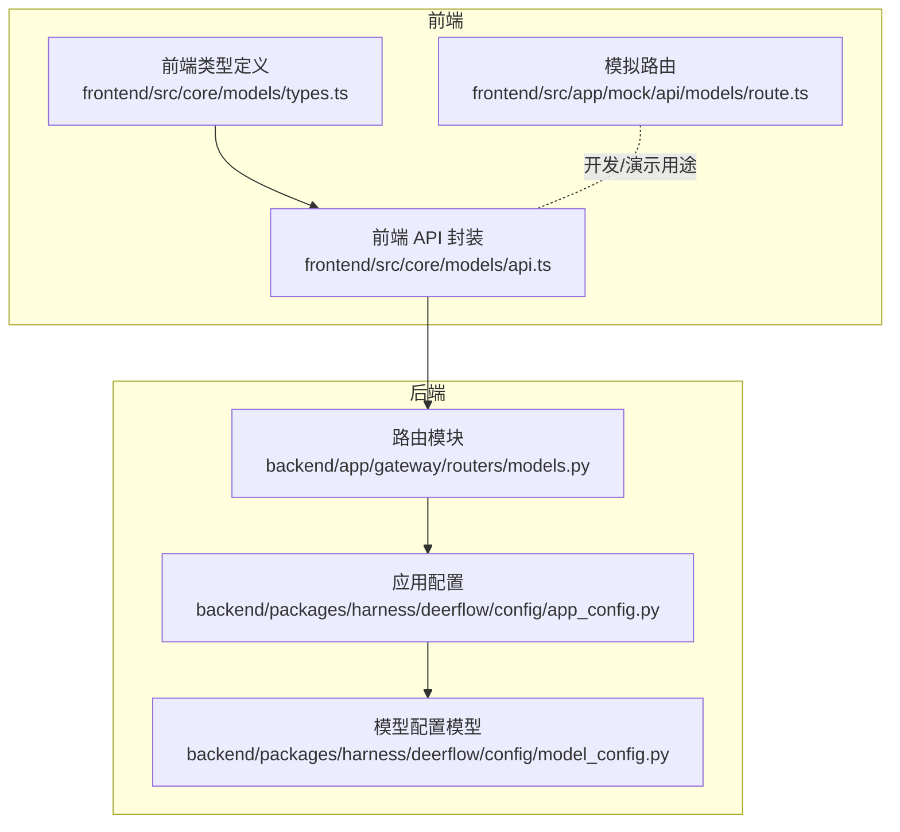
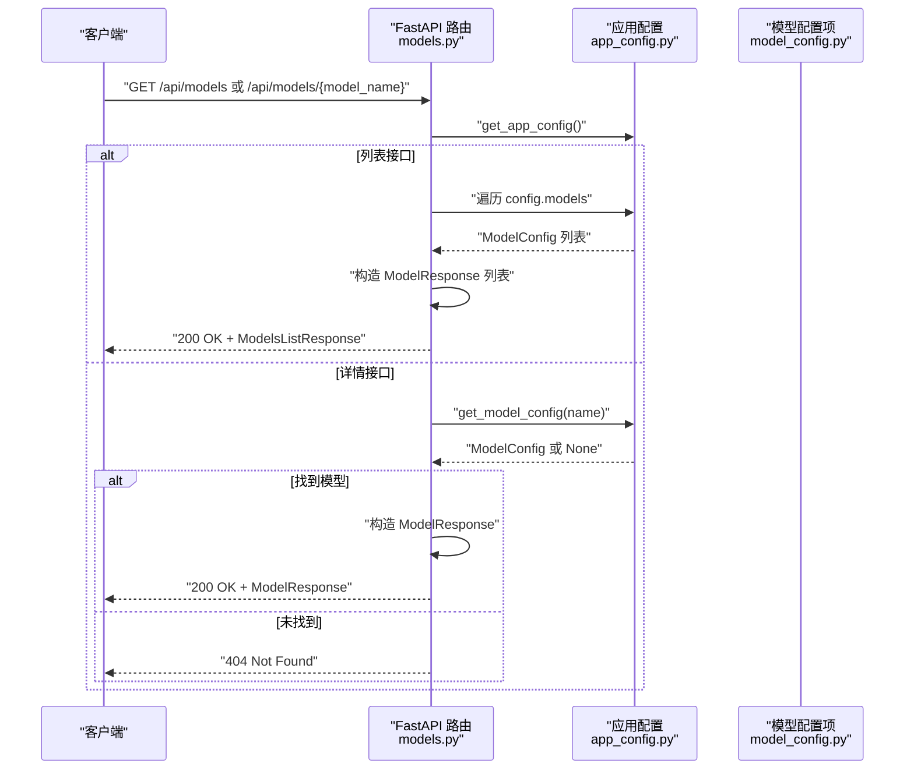
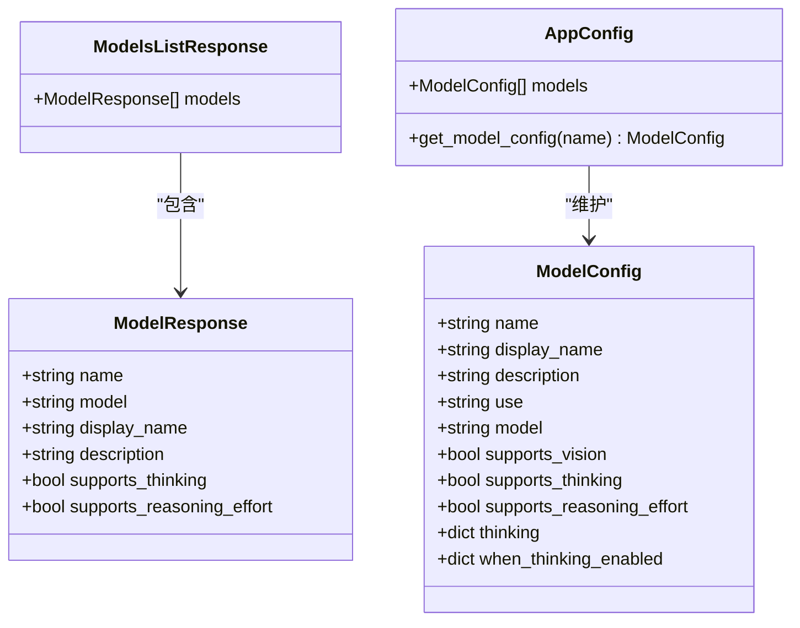
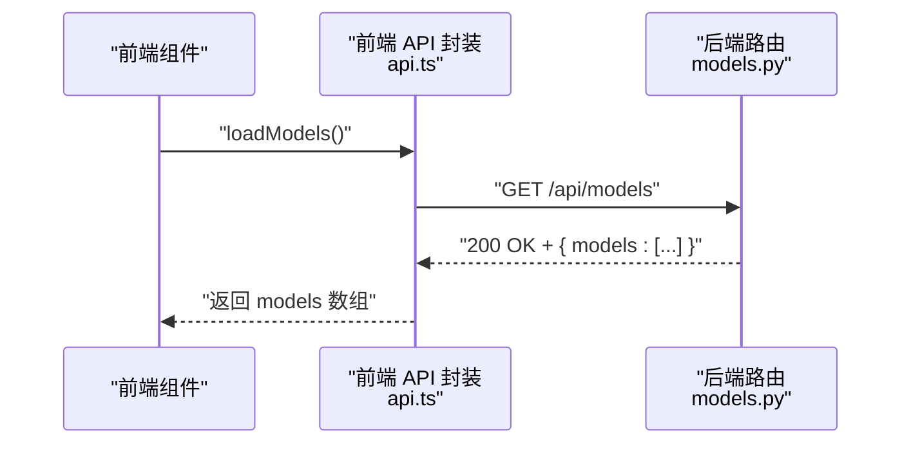
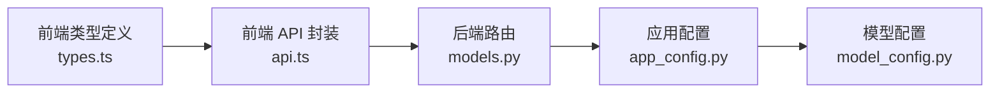

# 模型管理 API

<cite>
**本文引用的文件**
- [models.py](file://backend/app/gateway/routers/models.py)
- [model_config.py](file://backend/packages/harness/deerflow/config/model_config.py)
- [app_config.py](file://backend/packages/harness/deerflow/config/app_config.py)
- [api.ts](file://frontend/src/core/models/api.ts)
- [types.ts](file://frontend/src/core/models/types.ts)
- [route.ts](file://frontend/src/app/mock/api/models/route.ts)
</cite>

## 目录
1. [简介](#简介)
2. [项目结构](#项目结构)
3. [核心组件](#核心组件)
4. [架构概览](#架构概览)
5. [详细组件分析](#详细组件分析)
6. [依赖分析](#依赖分析)
7. [性能考虑](#性能考虑)
8. [故障排除指南](#故障排除指南)
9. [结论](#结论)

## 简介
本文件为模型管理 API 的详细技术文档，覆盖以下内容：
- GET /api/models：列出系统中所有可用的 LLM 模型，返回模型名称、显示名称、描述、思维能力支持与推理努力支持等元数据。
- GET /api/models/{model_name}：按名称获取特定模型的详细信息。
- 请求与响应格式、参数校验、错误处理策略。
- 模型配置选项、支持的推理模式（思维模式、推理努力）以及性能相关特征的说明。

该 API 由后端 FastAPI 路由实现，数据来源于应用配置中的模型配置集合，并通过统一的应用配置加载器进行缓存与热重载。

## 项目结构
模型管理 API 所在的关键模块与文件如下：
- 后端路由层：负责定义 API 端点、参数与响应模型
- 配置层：定义模型配置的数据结构与应用配置的加载逻辑
- 前端集成：提供模型列表的前端调用封装与类型定义

图表来源
- [models.py:1-117](file://backend/app/gateway/routers/models.py#L1-L117)
- [app_config.py:30-334](file://backend/packages/harness/deerflow/config/app_config.py#L30-L334)
- [model_config.py:4-38](file://backend/packages/harness/deerflow/config/model_config.py#L4-L38)
- [api.ts:1-10](file://frontend/src/core/models/api.ts#L1-L10)
- [types.ts:1-10](file://frontend/src/core/models/types.ts#L1-L10)
- [route.ts:1-35](file://frontend/src/app/mock/api/models/route.ts#L1-L35)

章节来源
- [models.py:1-117](file://backend/app/gateway/routers/models.py#L1-L117)
- [app_config.py:30-334](file://backend/packages/harness/deerflow/config/app_config.py#L30-L334)
- [model_config.py:4-38](file://backend/packages/harness/deerflow/config/model_config.py#L4-L38)
- [api.ts:1-10](file://frontend/src/core/models/api.ts#L1-L10)
- [types.ts:1-10](file://frontend/src/core/models/types.ts#L1-L10)
- [route.ts:1-35](file://frontend/src/app/mock/api/models/route.ts#L1-L35)

## 核心组件
- 路由与端点
  - GET /api/models：返回所有模型的列表，使用 ModelsListResponse 包裹。
  - GET /api/models/{model_name}：按名称返回单个模型的详细信息，使用 ModelResponse。
- 数据模型
  - ModelResponse：包含模型标识、实际提供者模型名、显示名、描述、是否支持思维模式、是否支持推理努力。
  - ModelsListResponse：包含 models 字段，为 ModelResponse 数组。
  - ModelConfig：应用配置中的模型配置项，包含名称、显示名、描述、提供者类路径、模型名、是否支持视觉、是否支持思维、是否支持推理努力、思维设置等。
- 应用配置加载
  - AppConfig：提供 get_model_config(name) 方法用于按名称查找模型配置；内部维护 models 列表。
  - get_app_config()：全局配置实例的缓存与热重载机制。

章节来源
- [models.py:9-24](file://backend/app/gateway/routers/models.py#L9-L24)
- [models.py:26-117](file://backend/app/gateway/routers/models.py#L26-L117)
- [model_config.py:4-38](file://backend/packages/harness/deerflow/config/model_config.py#L4-L38)
- [app_config.py:203-212](file://backend/packages/harness/deerflow/config/app_config.py#L203-L212)

## 架构概览
下图展示了模型管理 API 的端到端交互流程：客户端发起请求 → 路由处理 → 读取应用配置 → 返回标准化响应。

图表来源
- [models.py:26-117](file://backend/app/gateway/routers/models.py#L26-L117)
- [app_config.py:203-212](file://backend/packages/harness/deerflow/config/app_config.py#L203-L212)
- [model_config.py:4-38](file://backend/packages/harness/deerflow/config/model_config.py#L4-L38)

## 详细组件分析

### GET /api/models 接口
- 功能：返回系统中所有已配置的模型列表。
- 请求
  - 方法：GET
  - 路径：/api/models
  - 查询参数：无
- 响应
  - 成功：200 OK，返回 ModelsListResponse，包含 models 字段（ModelResponse 数组）
  - 错误：无错误分支（空列表也视为成功）
- 响应字段说明（来自 ModelResponse）
  - name：模型唯一标识符（字符串）
  - model：实际提供者模型标识（字符串）
  - display_name：人类可读的显示名称（字符串或 null）
  - description：模型描述（字符串或 null）
  - supports_thinking：是否支持思维模式（布尔）
  - supports_reasoning_effort：是否支持推理努力（布尔）

请求示例
- curl
  - curl -X GET http(s)://<host>/api/models

响应示例
- 200 OK
  - {
      "models": [
        {
          "name": "gpt-4",
          "model": "gpt-4",
          "display_name": "GPT-4",
          "description": "OpenAI GPT-4 模型",
          "supports_thinking": false,
          "supports_reasoning_effort": false
        },
        {
          "name": "claude-3-opus",
          "model": "claude-3-opus",
          "display_name": "Claude 3 Opus",
          "description": "Anthropic Claude 3 Opus 模型",
          "supports_thinking": true,
          "supports_reasoning_effort": false
        }
      ]
    }

章节来源
- [models.py:26-74](file://backend/app/gateway/routers/models.py#L26-L74)

### GET /api/models/{model_name} 接口
- 功能：根据模型名称返回该模型的详细信息。
- 请求
  - 方法：GET
  - 路径：/api/models/{model_name}
  - 路径参数：model_name（字符串，模型唯一标识）
- 响应
  - 成功：200 OK，返回 ModelResponse
  - 错误：404 Not Found（当模型不存在时）
- 响应字段说明（同上）

请求示例
- curl
  - curl -X GET http(s)://<host>/api/models/gpt-4

响应示例
- 200 OK
  - {
      "name": "gpt-4",
      "model": "gpt-4",
      "display_name": "GPT-4",
      "description": "OpenAI GPT-4 模型",
      "supports_thinking": false,
      "supports_reasoning_effort": false
    }
- 404 Not Found
  - {
      "detail": "Model 'gpt-4' not found"
    }

章节来源
- [models.py:76-117](file://backend/app/gateway/routers/models.py#L76-L117)

### 数据模型与配置
- ModelResponse（后端响应模型）
  - 字段：name、model、display_name、description、supports_thinking、supports_reasoning_effort
  - 作用：统一对外输出模型元数据
- ModelsListResponse（后端列表响应模型）
  - 字段：models（ModelResponse 数组）
  - 作用：包装模型列表响应
- ModelConfig（应用配置模型）
  - 关键字段：name、display_name、description、use、model、supports_vision、supports_thinking、supports_reasoning_effort、thinking、when_thinking_enabled 等
  - 作用：描述模型的提供者、能力与行为开关
- AppConfig
  - 关键方法：get_model_config(name)
  - 作用：按名称检索模型配置，供路由层使用

图表来源
- [models.py:9-24](file://backend/app/gateway/routers/models.py#L9-L24)
- [model_config.py:4-38](file://backend/packages/harness/deerflow/config/model_config.py#L4-L38)
- [app_config.py:30-44](file://backend/packages/harness/deerflow/config/app_config.py#L30-L44)

章节来源
- [models.py:9-24](file://backend/app/gateway/routers/models.py#L9-L24)
- [model_config.py:4-38](file://backend/packages/harness/deerflow/config/model_config.py#L4-L38)
- [app_config.py:30-44](file://backend/packages/harness/deerflow/config/app_config.py#L30-L44)

### 前端集成
- 前端 API 封装
  - loadModels()：调用 /api/models 并解析返回的 models 数组
- 类型定义
  - Model 接口：id、name、model、display_name、description、supports_thinking、supports_reasoning_effort
- 开发/演示用途
  - 模拟路由 route.ts：提供静态模型列表，便于前端联调

图表来源
- [api.ts:5-9](file://frontend/src/core/models/api.ts#L5-L9)
- [models.py:26-74](file://backend/app/gateway/routers/models.py#L26-L74)

章节来源
- [api.ts:1-10](file://frontend/src/core/models/api.ts#L1-L10)
- [types.ts:1-10](file://frontend/src/core/models/types.ts#L1-L10)
- [route.ts:1-35](file://frontend/src/app/mock/api/models/route.ts#L1-L35)

## 依赖分析
- 路由层依赖应用配置加载器，通过 get_app_config() 获取全局配置实例。
- 应用配置层维护模型配置列表，并提供按名称检索的方法。
- 前端通过统一的 API 封装访问后端路由，类型定义与后端响应保持一致。

图表来源
- [models.py:1-117](file://backend/app/gateway/routers/models.py#L1-L117)
- [app_config.py:30-334](file://backend/packages/harness/deerflow/config/app_config.py#L30-L334)
- [model_config.py:4-38](file://backend/packages/harness/deerflow/config/model_config.py#L4-L38)
- [api.ts:1-10](file://frontend/src/core/models/api.ts#L1-L10)
- [types.ts:1-10](file://frontend/src/core/models/types.ts#L1-L10)

章节来源
- [models.py:1-117](file://backend/app/gateway/routers/models.py#L1-L117)
- [app_config.py:30-334](file://backend/packages/harness/deerflow/config/app_config.py#L30-L334)
- [model_config.py:4-38](file://backend/packages/harness/deerflow/config/model_config.py#L4-L38)
- [api.ts:1-10](file://frontend/src/core/models/api.ts#L1-L10)
- [types.ts:1-10](file://frontend/src/core/models/types.ts#L1-L10)

## 性能考虑
- 配置缓存与热重载
  - get_app_config() 提供缓存与基于文件修改时间的自动重载，避免频繁磁盘 IO。
  - 当配置文件被修改时，会记录日志并重新加载，确保运行时变更生效。
- 列表与详情接口
  - 列表接口直接遍历内存中的模型配置数组，复杂度 O(n)，n 为模型数量。
  - 详情接口通过线性查找定位模型，复杂度 O(n)；若需高频查询，建议在应用层引入索引映射以优化至 O(1)。
- 响应序列化
  - 使用 Pydantic 模型进行序列化，保证字段一致性与类型安全。

章节来源
- [app_config.py:263-288](file://backend/packages/harness/deerflow/config/app_config.py#L263-L288)
- [models.py:61-73](file://backend/app/gateway/routers/models.py#L61-L73)
- [models.py:104-116](file://backend/app/gateway/routers/models.py#L104-L116)

## 故障排除指南
- 404 Not Found（详情接口）
  - 现象：请求 /api/models/{model_name} 返回 404。
  - 可能原因：模型名称不正确或配置中不存在该模型。
  - 处理建议：确认 model_name 与配置中的 name 字段一致；检查配置文件是否正确加载。
- 响应字段缺失
  - 现象：前端收到的模型对象缺少某些字段。
  - 可能原因：后端 ModelResponse 与前端 Model 类型不匹配。
  - 处理建议：核对后端响应模型字段与前端类型定义；确保前端类型与后端保持一致。
- 配置未更新
  - 现象：新增或修改模型后，列表未反映最新结果。
  - 可能原因：配置缓存未刷新。
  - 处理建议：触发配置重载或重启服务；确认配置文件路径与权限正确。

章节来源
- [models.py:104-107](file://backend/app/gateway/routers/models.py#L104-L107)
- [app_config.py:276-287](file://backend/packages/harness/deerflow/config/app_config.py#L276-L287)

## 结论
模型管理 API 提供了简洁稳定的模型元数据查询能力，通过统一的配置模型与缓存机制，确保前后端的一致性与可维护性。建议在生产环境中：
- 明确模型命名规范，确保 model_name 与配置一致；
- 对高频查询场景考虑引入索引以提升详情接口性能；
- 在前端严格遵循响应模型字段，避免类型不匹配导致的渲染问题。