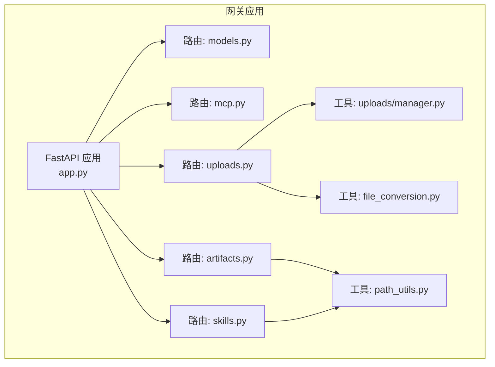
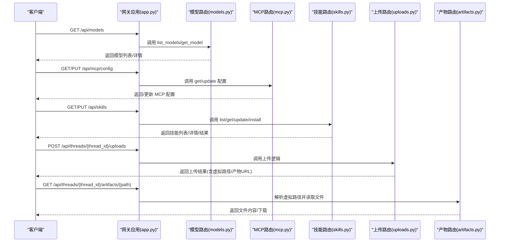
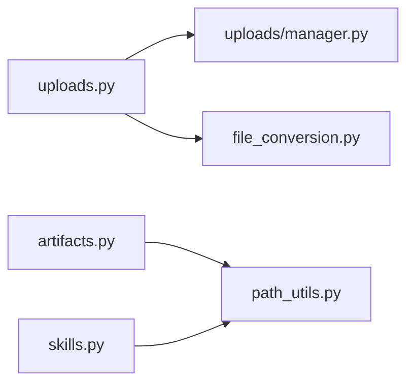
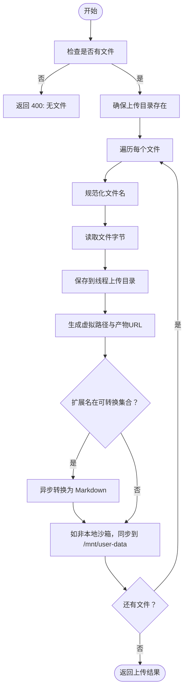
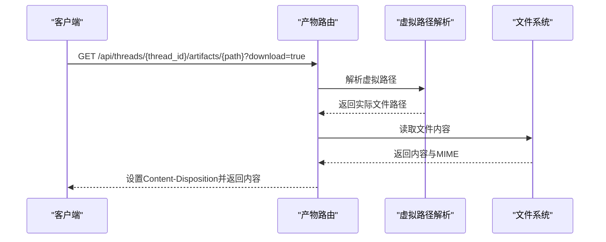

# 网关 API

<cite>
**本文引用的文件**
- [backend/app/gateway/app.py](file://backend/app/gateway/app.py)
- [backend/app/gateway/routers/models.py](file://backend/app/gateway/routers/models.py)
- [backend/app/gateway/routers/mcp.py](file://backend/app/gateway/routers/mcp.py)
- [backend/app/gateway/routers/skills.py](file://backend/app/gateway/routers/skills.py)
- [backend/app/gateway/routers/uploads.py](file://backend/app/gateway/routers/uploads.py)
- [backend/app/gateway/routers/artifacts.py](file://backend/app/gateway/routers/artifacts.py)
- [backend/app/gateway/path_utils.py](file://backend/app/gateway/path_utils.py)
- [backend/packages/harness/deerflow/utils/file_conversion.py](file://backend/packages/harness/deerflow/utils/file_conversion.py)
- [backend/packages/harness/deerflow/uploads/manager.py](file://backend/packages/harness/deerflow/uploads/manager.py)
- [backend/docs/API.md](file://backend/docs/API.md)
- [backend/docs/FILE_UPLOAD.md](file://backend/docs/FILE_UPLOAD.md)
- [frontend/src/core/uploads/api.ts](file://frontend/src/core/uploads/api.ts)
- [frontend/src/core/models/api.ts](file://frontend/src/core/models/api.ts)
</cite>

## 目录
1. [简介](#简介)
2. [项目结构](#项目结构)
3. [核心组件](#核心组件)
4. [架构总览](#架构总览)
5. [详细组件分析](#详细组件分析)
6. [依赖分析](#依赖分析)
7. [性能考虑](#性能考虑)
8. [故障排查指南](#故障排查指南)
9. [结论](#结论)
10. [附录](#附录)

## 简介
本文件为 DeerFlow 网关 API 的全面文档，覆盖模型管理、MCP 配置、技能管理、文件上传与产物下载等核心能力。文档提供各端点的请求/响应规范、参数校验规则、错误处理策略，并说明文件上传的多格式支持、自动转换机制与虚拟路径映射；同时阐述产物访问的下载模式与内容类型处理。最后给出多种编程语言的使用示例与最佳实践。

## 项目结构
网关 API 基于 FastAPI 构建，路由按功能模块划分，统一挂载在 /api 前缀下，部分端点位于 /api/threads/{thread_id}/... 路径空间内，以线程隔离的方式管理用户上传与产物。

图表来源
- [backend/app/gateway/app.py:156-186](file://backend/app/gateway/app.py#L156-L186)
- [backend/app/gateway/routers/models.py:6](file://backend/app/gateway/routers/models.py#L6)
- [backend/app/gateway/routers/mcp.py:12](file://backend/app/gateway/routers/mcp.py#L12)
- [backend/app/gateway/routers/skills.py:15](file://backend/app/gateway/routers/skills.py#L15)
- [backend/app/gateway/routers/uploads.py:25](file://backend/app/gateway/routers/uploads.py#L25)
- [backend/app/gateway/routers/artifacts.py:14](file://backend/app/gateway/routers/artifacts.py#L14)
- [backend/app/gateway/path_utils.py:10](file://backend/app/gateway/path_utils.py#L10)
- [backend/packages/harness/deerflow/utils/file_conversion.py:24](file://backend/packages/harness/deerflow/utils/file_conversion.py#L24)
- [backend/packages/harness/deerflow/uploads/manager.py:33](file://backend/packages/harness/deerflow/uploads/manager.py#L33)

章节来源
- [backend/app/gateway/app.py:156-186](file://backend/app/gateway/app.py#L156-L186)

## 核心组件
- 模型管理：提供模型列表与详情查询，返回名称、显示名、描述、推理能力开关等元数据。
- MCP 配置：提供获取与更新 MCP 服务器配置的能力，支持 stdio/sse/http 传输与可选 OAuth。
- 技能管理：提供技能列表、详情、启用/禁用、从 .skill 归档安装等能力。
- 文件上传：支持多文件上传、自动转换（PDF/PPT/Excel/Word）、列出与删除、生成虚拟路径与产物 URL。
- 产物访问：根据路径解析到线程产物目录，自动判断内容类型，支持下载模式与 .skill 内部文件访问。

章节来源
- [backend/app/gateway/routers/models.py:26-117](file://backend/app/gateway/routers/models.py#L26-L117)
- [backend/app/gateway/routers/mcp.py:66-170](file://backend/app/gateway/routers/mcp.py#L66-L170)
- [backend/app/gateway/routers/skills.py:66-174](file://backend/app/gateway/routers/skills.py#L66-L174)
- [backend/app/gateway/routers/uploads.py:36-147](file://backend/app/gateway/routers/uploads.py#L36-L147)
- [backend/app/gateway/routers/artifacts.py:61-159](file://backend/app/gateway/routers/artifacts.py#L61-L159)

## 架构总览
网关应用启动时加载配置并注册各路由模块，模型与 MCP 等配置来源于全局配置对象；文件上传与产物访问通过虚拟路径解析到线程隔离的本地目录，非本地沙箱环境还会同步到沙箱内的 /mnt/user-data 目录。

图表来源
- [backend/app/gateway/app.py:156-186](file://backend/app/gateway/app.py#L156-L186)
- [backend/app/gateway/routers/models.py:26-117](file://backend/app/gateway/routers/models.py#L26-L117)
- [backend/app/gateway/routers/mcp.py:66-170](file://backend/app/gateway/routers/mcp.py#L66-L170)
- [backend/app/gateway/routers/skills.py:66-174](file://backend/app/gateway/routers/skills.py#L66-L174)
- [backend/app/gateway/routers/uploads.py:36-147](file://backend/app/gateway/routers/uploads.py#L36-L147)
- [backend/app/gateway/routers/artifacts.py:61-159](file://backend/app/gateway/routers/artifacts.py#L61-L159)

## 详细组件分析

### 模型管理
- 端点
  - GET /api/models：返回所有可用模型的简要信息。
  - GET /api/models/{model_name}：返回指定模型的详细信息。
- 数据模型
  - 模型响应：包含唯一标识、提供方模型名、显示名、描述、思考模式与推理努力开关等字段。
  - 列表响应：包含 models 数组。
- 参数与校验
  - 路径参数 model_name 必填且需存在于配置中，否则返回 404。
- 错误处理
  - 未找到模型：404。
- 示例
  - 列表示例与详情示例见后文“附录”。

章节来源
- [backend/app/gateway/routers/models.py:9-117](file://backend/app/gateway/routers/models.py#L9-L117)

### MCP 配置
- 端点
  - GET /api/mcp/config：获取当前 MCP 服务器配置。
  - PUT /api/mcp/config：更新 MCP 服务器配置并持久化。
- 数据模型
  - OAuth 配置：包含启用标志、令牌端点、授权类型、客户端凭据、作用域、audience、令牌字段映射、刷新偏移、附加参数等。
  - MCP 服务器配置：包含启用标志、传输类型（stdio/sse/http）、命令/参数/环境变量、URL/头部、OAuth 配置、描述等。
  - 配置响应：包含 mcp_servers 映射。
  - 更新请求：包含 mcp_servers 映射。
- 参数与校验
  - 保存配置时会保留现有技能配置，仅更新 MCP 部分。
- 错误处理
  - 写入配置失败：500。
- 示例
  - 获取/更新示例见后文“附录”。

章节来源
- [backend/app/gateway/routers/mcp.py:15-170](file://backend/app/gateway/routers/mcp.py#L15-L170)

### 技能管理
- 端点
  - GET /api/skills：返回所有技能列表。
  - GET /api/skills/{skill_name}：返回指定技能详情。
  - PUT /api/skills/{skill_name}：更新技能启用状态（修改 extensions_config.json）。
  - POST /api/skills/install：从 .skill 归档安装技能。
- 数据模型
  - 技能响应：包含名称、描述、许可证、分类（public/custom）、启用状态。
  - 技能列表响应：包含 skills 数组。
  - 更新请求：包含 enabled 布尔值。
  - 安装请求：包含 thread_id 与虚拟路径（指向 .skill 文件）。
  - 安装响应：包含 success、skill_name、message。
- 参数与校验
  - 更新技能时会写入 extensions_config.json 并重载配置。
  - 安装技能时通过虚拟路径解析到实际文件，若不存在或已存在则返回相应错误码。
- 错误处理
  - 未找到技能：404。
  - 已存在：409。
  - 参数无效：400。
  - 其他异常：500。
- 示例
  - 列表/详情/安装示例见后文“附录”。

章节来源
- [backend/app/gateway/routers/skills.py:18-174](file://backend/app/gateway/routers/skills.py#L18-L174)

### 文件上传与管理
- 端点
  - POST /api/threads/{thread_id}/uploads：多文件上传。
  - GET /api/threads/{thread_id}/uploads/list：列出上传文件。
  - DELETE /api/threads/{thread_id}/uploads/{filename}：删除指定文件。
- 数据模型
  - 上传响应：包含 success、files（每项含 filename、size、path、virtual_path、artifact_url，以及可选的 markdown_* 字段）、message。
  - 文件条目：包含 filename、size（字符串）、path、virtual_path、artifact_url、extension、modified。
- 多格式支持与自动转换
  - 支持 PDF、PPT、PPTX、XLS、XLSX、DOC、DOCX。
  - 上传后自动转换为 Markdown，并生成同名 .md 文件；非本地沙箱环境也会同步到 /mnt/user-data/uploads。
- 虚拟路径映射
  - 上传目录：线程隔离的 user-data/uploads。
  - 虚拟路径：/mnt/user-data/uploads/{filename}。
  - 产物 URL：/api/threads/{thread_id}/artifacts{虚拟路径前缀}/uploads/{filename}。
- 参数与校验
  - thread_id 必须符合安全字符集，否则抛出 400/403。
  - 文件名必须安全（去除路径组件、长度限制、禁止反斜杠等），否则跳过或报错。
  - 删除时检测路径穿越，防止越权删除。
- 错误处理
  - 无文件：400。
  - 线程 ID 不合法：400/403。
  - 文件名不安全：400。
  - 删除文件不存在：404。
  - 路径穿越：400。
  - 其他异常：500。
- 示例
  - 上传/列出/删除示例见后文“附录”。

章节来源
- [backend/app/gateway/routers/uploads.py:28-147](file://backend/app/gateway/routers/uploads.py#L28-L147)
- [backend/packages/harness/deerflow/uploads/manager.py:15-202](file://backend/packages/harness/deerflow/uploads/manager.py#L15-L202)
- [backend/packages/harness/deerflow/utils/file_conversion.py:12-48](file://backend/packages/harness/deerflow/utils/file_conversion.py#L12-L48)

### 产物访问
- 端点
  - GET /api/threads/{thread_id}/artifacts/{path}：按虚拟路径访问产物文件。
- 行为与内容类型处理
  - 自动推断 MIME 类型；HTML 文件直接渲染，文本类文件返回纯文本，其他二进制文件默认内联显示并提供下载选项。
  - 支持 ?download=true 强制下载（设置 Content-Disposition 附件头）。
  - 对 .skill 归档内的文件，支持通过 “xxx.skill/内部路径” 的形式访问，自动解压并返回内容，带缓存头避免重复解压。
- 虚拟路径解析
  - 通过 resolve_thread_virtual_path 将虚拟路径映射到线程 user-data 目录的实际文件。
- 错误处理
  - 路径不存在：404。
  - 非文件路径：400。
  - 路径穿越：403。
- 示例
  - 访问 HTML/CSV 下载示例见后文“附录”。

章节来源
- [backend/app/gateway/routers/artifacts.py:17-159](file://backend/app/gateway/routers/artifacts.py#L17-L159)
- [backend/app/gateway/path_utils.py:10-29](file://backend/app/gateway/path_utils.py#L10-L29)

## 依赖分析
- 组件耦合
  - 路由层仅负责请求/响应与调用业务工具函数，耦合度低，便于扩展。
  - 上传与产物访问依赖虚拟路径解析与线程隔离目录结构。
- 外部依赖
  - 文件转换依赖 markitdown。
  - 产物访问依赖 MIME 类型推断与文件读取。
- 循环依赖
  - 未发现循环导入；工具函数无 HTTP 依赖，便于复用。

图表来源
- [backend/app/gateway/routers/uploads.py:10-21](file://backend/app/gateway/routers/uploads.py#L10-L21)
- [backend/packages/harness/deerflow/uploads/manager.py:12](file://backend/packages/harness/deerflow/uploads/manager.py#L12)
- [backend/packages/harness/deerflow/utils/file_conversion.py:34](file://backend/packages/harness/deerflow/utils/file_conversion.py#L34)
- [backend/app/gateway/routers/artifacts.py:10](file://backend/app/gateway/routers/artifacts.py#L10)
- [backend/app/gateway/path_utils.py:7](file://backend/app/gateway/path_utils.py#L7)
- [backend/app/gateway/routers/skills.py:8](file://backend/app/gateway/routers/skills.py#L8)

## 性能考虑
- 文件转换
  - 对可转换文件采用异步转换并在事件循环内复用线程池，避免频繁创建线程。
- 缓存
  - .skill 内部文件访问设置缓存头，减少重复解压开销。
- I/O
  - 上传与产物访问均基于本地文件系统，建议在高并发场景下配合合适的文件系统与磁盘策略。

## 故障排查指南
- 模型管理
  - 若返回 404，请确认模型名存在于配置中。
- MCP 配置
  - 更新失败请检查 extensions_config.json 权限与磁盘空间。
- 技能管理
  - 安装 .skill 失败：确认归档有效且未重复安装；检查 thread_id 与虚拟路径。
- 文件上传
  - 上传失败：检查文件大小、磁盘空间、Nginx 上传上限；查看后端日志。
  - 转换失败：确认 markitdown 已安装且文件未损坏。
  - Agent 无法看到文件：确认上传接口返回成功且沙箱已同步。
- 产物访问
  - 403/400：检查虚拟路径是否越权或非文件；确认 download 查询参数使用正确。

章节来源
- [backend/docs/FILE_UPLOAD.md:232-294](file://backend/docs/FILE_UPLOAD.md#L232-L294)

## 结论
该网关 API 提供了完善的模型、MCP、技能、上传与产物访问能力，具备清晰的虚拟路径映射与线程隔离设计，支持多格式文档自动转换与灵活的内容类型处理。通过标准化的错误码与一致的响应格式，便于前端与第三方客户端集成。

## 附录

### 接口规范与示例

- 模型管理
  - GET /api/models
    - 响应：包含 models 数组，每项含 name、display_name、description、supports_thinking、supports_reasoning_effort 等。
    - 示例参考：[backend/docs/API.md:159-210](file://backend/docs/API.md#L159-L210)
  - GET /api/models/{model_name}
    - 响应：单个模型详情。
    - 示例参考：[backend/docs/API.md:193-210](file://backend/docs/API.md#L193-L210)

- MCP 配置
  - GET /api/mcp/config
    - 响应：mcp_servers 映射。
    - 示例参考：[backend/docs/API.md:213-244](file://backend/docs/API.md#L213-L244)
  - PUT /api/mcp/config
    - 请求体：mcp_servers 映射。
    - 响应：更新后的配置。
    - 示例参考：[backend/docs/API.md:246-280](file://backend/docs/API.md#L246-L280)

- 技能管理
  - GET /api/skills
    - 响应：skills 数组。
    - 示例参考：[backend/docs/API.md:283-313](file://backend/docs/API.md#L283-L313)
  - GET /api/skills/{skill_name}
    - 响应：技能详情。
    - 示例参考：[backend/docs/API.md:315-333](file://backend/docs/API.md#L315-L333)
  - PUT /api/skills/{skill_name}
    - 请求体：{ enabled: boolean }
    - 响应：更新后的技能。
  - POST /api/skills/install
    - 请求体：multipart/form-data，包含 thread_id 与 .skill 文件的虚拟路径。
    - 响应：安装结果。

- 文件上传与管理
  - POST /api/threads/{thread_id}/uploads
    - 请求体：multipart/form-data，files 为数组。
    - 响应：包含 success、files（含虚拟路径与产物 URL）、message。
    - 示例参考：[backend/docs/API.md:390-421](file://backend/docs/API.md#L390-L421)
  - GET /api/threads/{thread_id}/uploads/list
    - 响应：files 数组与 count。
    - 示例参考：[backend/docs/API.md:429-451](file://backend/docs/API.md#L429-L451)
  - DELETE /api/threads/{thread_id}/uploads/{filename}
    - 响应：删除成功消息。
    - 示例参考：[backend/docs/API.md:453-465](file://backend/docs/API.md#L453-L465)

- 产物访问
  - GET /api/threads/{thread_id}/artifacts/{path}
    - 查询参数：download=true 强制下载。
    - 响应：根据 MIME 类型返回 HTML/纯文本/二进制内容。
    - 示例参考：[backend/docs/API.md:489-506](file://backend/docs/API.md#L489-L506)

- 错误响应
  - 统一格式：{"detail": "错误信息"}。
  - 常见状态码：400（请求无效）、404（未找到）、500（服务器错误）。
  - 示例参考：[backend/docs/API.md:508-523](file://backend/docs/API.md#L508-L523)

### 参数验证与安全
- 线程 ID
  - 仅允许字母、数字、点、连字符、下划线；否则 400/403。
- 文件名
  - 去除路径组件、长度限制、禁止反斜杠；否则 400。
- 路径穿越
  - 解析虚拟路径时严格校验，越界则 403。
- 删除文件
  - 严格校验文件存在性与路径，越界则 400，不存在则 404。

章节来源
- [backend/packages/harness/deerflow/uploads/manager.py:19-71](file://backend/packages/harness/deerflow/uploads/manager.py#L19-L71)
- [backend/app/gateway/path_utils.py:24-29](file://backend/app/gateway/path_utils.py#L24-L29)

### 文件上传流程（算法）

图表来源
- [backend/app/gateway/routers/uploads.py:36-110](file://backend/app/gateway/routers/uploads.py#L36-L110)
- [backend/packages/harness/deerflow/utils/file_conversion.py:24-48](file://backend/packages/harness/deerflow/utils/file_conversion.py#L24-L48)
- [backend/packages/harness/deerflow/uploads/manager.py:178-189](file://backend/packages/harness/deerflow/uploads/manager.py#L178-L189)

### 产物访问序列（下载模式与内容类型）

图表来源
- [backend/app/gateway/routers/artifacts.py:61-159](file://backend/app/gateway/routers/artifacts.py#L61-L159)
- [backend/app/gateway/path_utils.py:10-29](file://backend/app/gateway/path_utils.py#L10-L29)

### 使用示例与最佳实践

- Python（requests）
  - 上传文件
    - 参考：[backend/docs/FILE_UPLOAD.md:161-189](file://backend/docs/FILE_UPLOAD.md#L161-L189)
  - 列出与删除
    - 参考：[backend/docs/FILE_UPLOAD.md:180-188](file://backend/docs/FILE_UPLOAD.md#L180-L188)

- JavaScript/TypeScript（fetch）
  - 上传文件
    - 参考：[frontend/src/core/uploads/api.ts:45-68](file://frontend/src/core/uploads/api.ts#L45-L68)
  - 列出与删除
    - 参考：[frontend/src/core/uploads/api.ts:73-109](file://frontend/src/core/uploads/api.ts#L73-L109)
  - 加载模型
    - 参考：[frontend/src/core/models/api.ts:5-9](file://frontend/src/core/models/api.ts#L5-L9)

- cURL
  - 列表模型、获取 MCP 配置、上传文件、启用技能、创建线程与运行代理等示例
  - 参考：[backend/docs/API.md:604-631](file://backend/docs/API.md#L604-L631)

- 最佳实践
  - 上传前先检查文件大小与类型，避免超限与不支持的格式。
  - 使用虚拟路径与产物 URL 进行前后端协作，确保 Agent 可见性。
  - 在生产环境部署时，结合 Nginx 配置认证与限流策略。
  - 参考：[backend/docs/API.md:526-550](file://backend/docs/API.md#L526-L550)