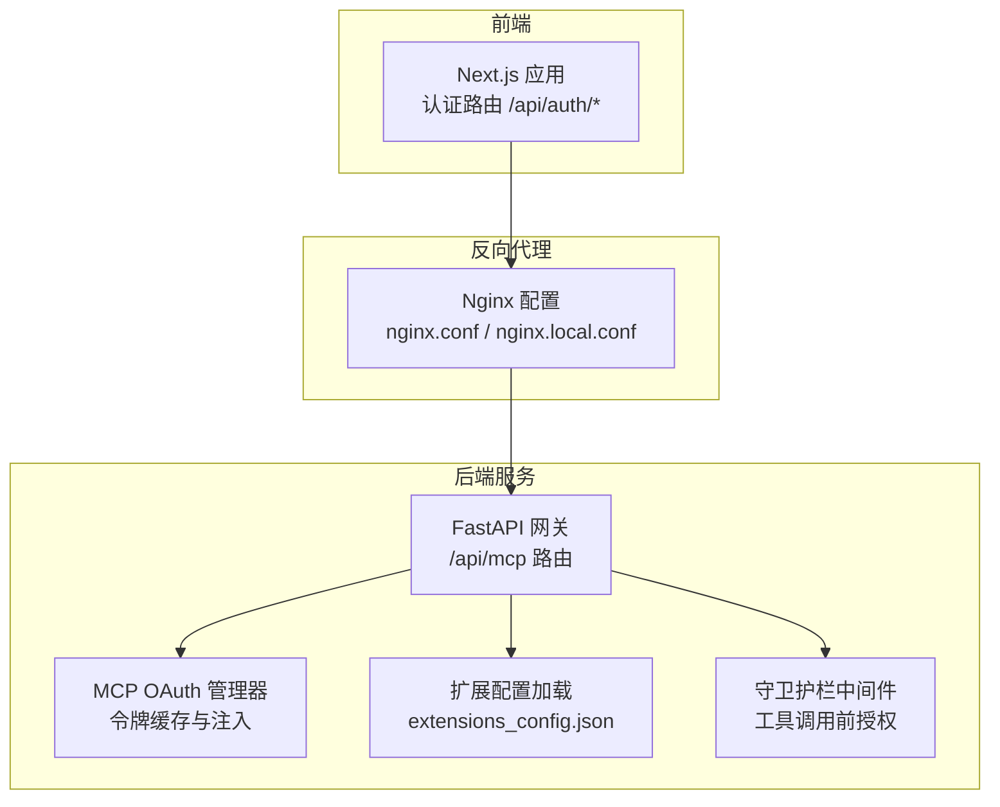
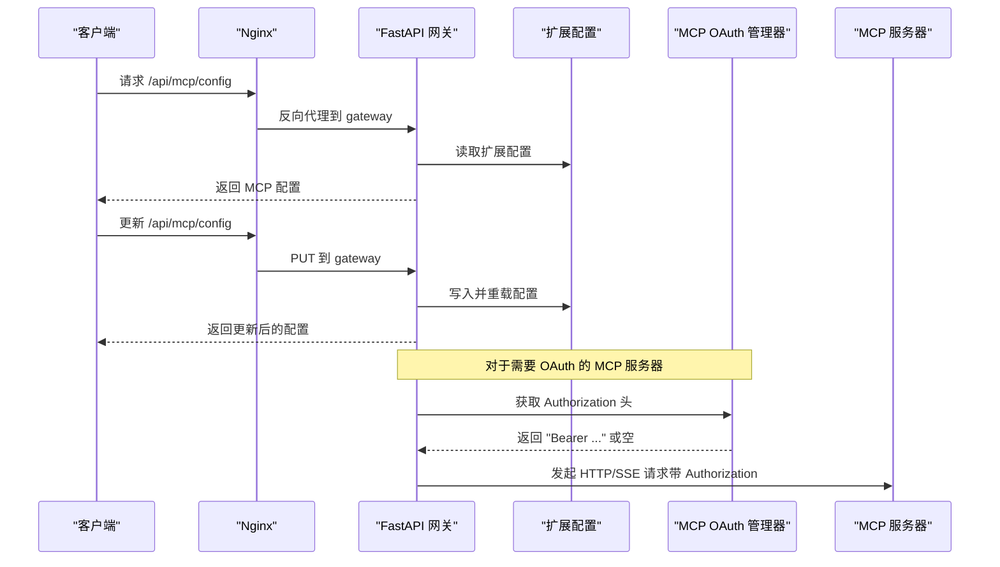
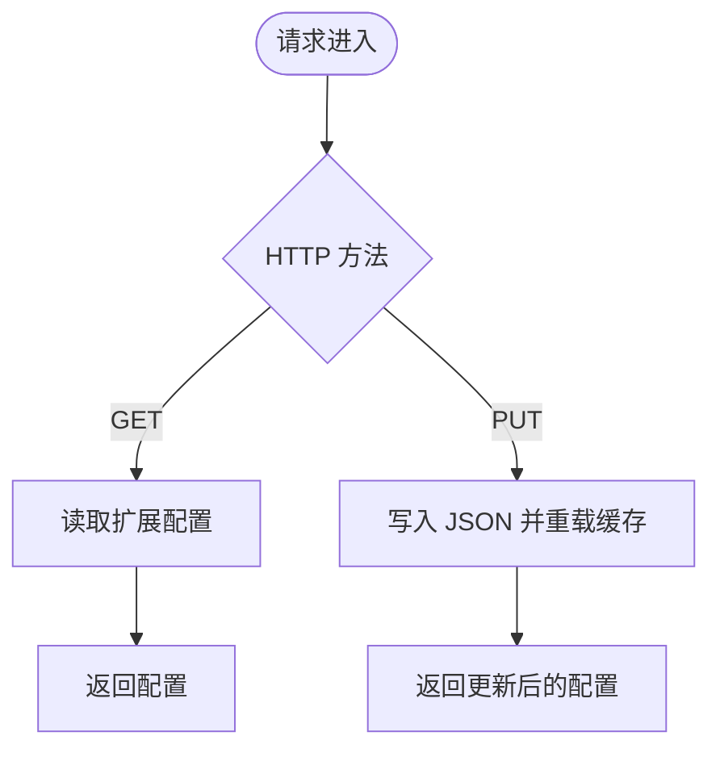
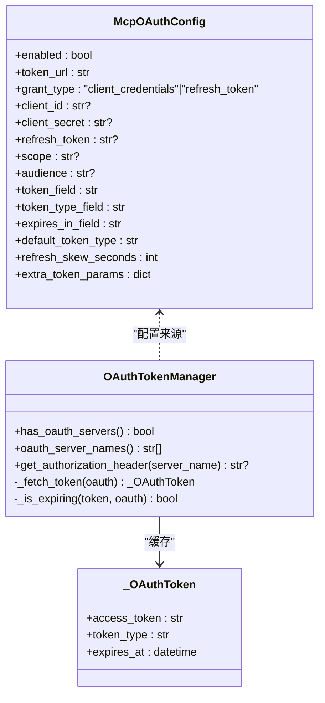
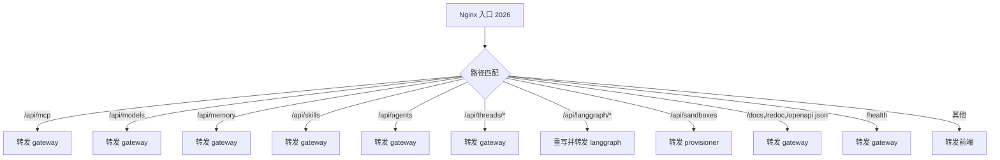
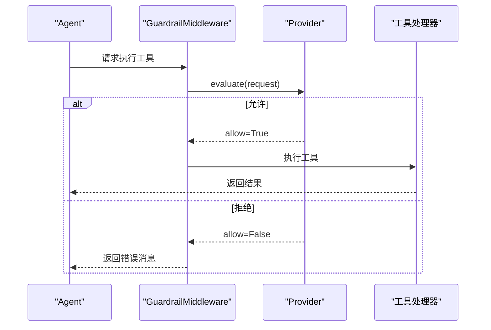
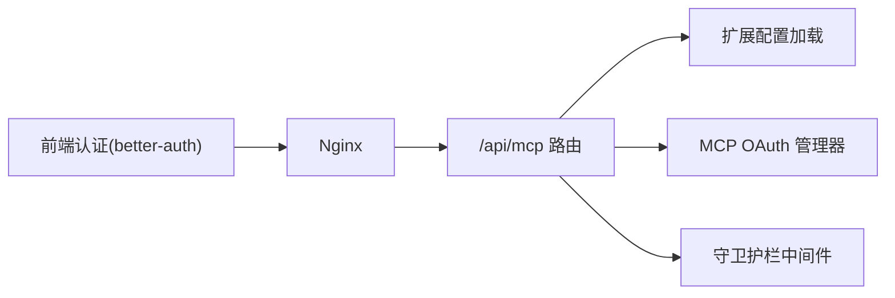

# 认证和授权

<cite>
**本文引用的文件**
- [mcp.py](file://backend/app/gateway/routers/mcp.py)
- [oauth.py](file://backend/packages/harness/deerflow/mcp/oauth.py)
- [extensions_config.py](file://backend/packages/harness/deerflow/config/extensions_config.py)
- [nginx.conf](file://docker/nginx/nginx.conf)
- [nginx.local.conf](file://docker/nginx/nginx.local.conf)
- [MCP_SERVER.md](file://backend/docs/MCP_SERVER.md)
- [GUARDRAILS.md](file://backend/docs/GUARDRAILS.md)
- [middleware.py](file://backend/packages/harness/deerflow/guardrails/middleware.py)
- [config.ts](file://frontend/src/server/better-auth/config.ts)
- [route.ts](file://frontend/src/app/api/auth/[...all]/route.ts)
- [test_mcp_oauth.py](file://backend/tests/test_mcp_oauth.py)
</cite>

## 目录
1. [简介](#简介)
2. [项目结构](#项目结构)
3. [核心组件](#核心组件)
4. [架构总览](#架构总览)
5. [详细组件分析](#详细组件分析)
6. [依赖分析](#依赖分析)
7. [性能考量](#性能考量)
8. [故障排除指南](#故障排除指南)
9. [结论](#结论)
10. [附录](#附录)

## 简介
本文件聚焦 DeerFlow API 的认证与授权现状与生产级安全加固方案，覆盖以下方面：
- 当前 API 在网关层未强制认证，仅通过 Nginx 进行路径代理与基础 CORS 处理
- 生产环境推荐的安全措施：Nginx 基础认证、OAuth 集成、VPN/内网部署
- MCP 出站连接的 OAuth 认证机制与安全注意事项
- 安全最佳实践、漏洞防护与访问控制策略
- 测试方法与故障排除指南

## 项目结构
围绕认证与授权的关键目录与文件：
- 后端网关路由：/api/mcp 配置读取与更新
- MCP OAuth 支持：令牌获取、缓存与注入
- 扩展配置：MCP 服务器与技能配置、OAuth 参数
- Nginx 反向代理：统一入口、CORS、静态资源与健康检查
- 前端认证：基于 better-auth 的邮箱/密码登录（可扩展为 OAuth）
- 守卫护栏（Guardrails）：工具调用前的授权中间件

图表来源
- [nginx.conf:34-229](file://docker/nginx/nginx.conf#L34-L229)
- [mcp.py:66-169](file://backend/app/gateway/routers/mcp.py#L66-L169)
- [oauth.py:25-151](file://backend/packages/harness/deerflow/mcp/oauth.py#L25-L151)
- [extensions_config.py:55-259](file://backend/packages/harness/deerflow/config/extensions_config.py#L55-L259)
- [GUARDRAILS.md:38-70](file://backend/docs/GUARDRAILS.md#L38-L70)

章节来源
- [nginx.conf:34-229](file://docker/nginx/nginx.conf#L34-L229)
- [mcp.py:66-169](file://backend/app/gateway/routers/mcp.py#L66-L169)
- [extensions_config.py:55-259](file://backend/packages/harness/deerflow/config/extensions_config.py#L55-L259)

## 核心组件
- 网关路由 /api/mcp
  - 提供获取与更新 MCP 配置的接口，支持从扩展配置文件加载与持久化
  - 未内置认证/授权逻辑，所有请求直接透传至后端处理
- MCP OAuth 管理器
  - 按服务器维度缓存访问令牌，自动刷新，注入到出站请求头
  - 支持 client_credentials 与 refresh_token 两种授权模式
- 扩展配置系统
  - 统一管理 MCP 服务器与技能启用状态，支持从 JSON 文件加载与环境变量解析
- Nginx 反向代理
  - 提供路径级路由、CORS 处理、长连接与大文件上传支持
  - 未内置认证，建议在上游服务或前置网关增加认证
- 前端认证（可选）
  - better-auth 提供邮箱/密码登录能力，可扩展为 OAuth 登录
- 守卫护栏中间件
  - 工具调用前进行策略评估，支持允许/拒绝与失败闭合策略

章节来源
- [mcp.py:66-169](file://backend/app/gateway/routers/mcp.py#L66-L169)
- [oauth.py:25-151](file://backend/packages/harness/deerflow/mcp/oauth.py#L25-L151)
- [extensions_config.py:55-259](file://backend/packages/harness/deerflow/config/extensions_config.py#L55-L259)
- [GUARDRAILS.md:38-70](file://backend/docs/GUARDRAILS.md#L38-L70)

## 架构总览
下图展示从客户端到后端服务的典型请求链路，以及认证与授权在各层的落点。

图表来源
- [mcp.py:66-169](file://backend/app/gateway/routers/mcp.py#L66-L169)
- [oauth.py:122-151](file://backend/packages/harness/deerflow/mcp/oauth.py#L122-L151)
- [extensions_config.py:55-259](file://backend/packages/harness/deerflow/config/extensions_config.py#L55-L259)

## 详细组件分析

### 组件 A：MCP 配置与认证状态
- 功能要点
  - GET /api/mcp/config：返回当前 MCP 服务器配置（含类型、命令/URL、环境变量、HTTP 头、OAuth 配置）
  - PUT /api/mcp/config：保存新配置到 JSON 文件并重载缓存
- 认证状态
  - 该路由未内置认证/授权校验；生产环境需在 Nginx 或上游服务中增加认证
- 安全建议
  - 将 /api/mcp/config 限制为内部可信网络访问
  - 使用只读策略：仅允许特定角色读取，写操作通过 CI/CD 或受控通道下发

图表来源
- [mcp.py:66-169](file://backend/app/gateway/routers/mcp.py#L66-L169)

章节来源
- [mcp.py:66-169](file://backend/app/gateway/routers/mcp.py#L66-L169)

### 组件 B：MCP OAuth 认证机制
- 数据模型
  - McpOAuthConfig：定义令牌端点、授权类型、客户端凭据、作用域、audience、字段映射、过期偏移等
  - McpServerConfig：包含 OAuth 字段，用于 HTTP/SSE 类型的 MCP 服务器
- 实现要点
  - OAuthTokenManager：按服务器名缓存令牌，使用 asyncio.Lock 避免并发重复拉取
  - 自动刷新：在过期前若干秒触发刷新
  - 注入流程：构建工具拦截器，在请求头中注入 Authorization
- 安全注意
  - client_id/client_secret/refresh_token 应通过环境变量注入
  - token_url 必须使用 HTTPS
  - refresh_skew_seconds 控制提前刷新窗口，避免临界时间点失效

图表来源
- [extensions_config.py:11-31](file://backend/packages/harness/deerflow/config/extensions_config.py#L11-L31)
- [oauth.py:25-120](file://backend/packages/harness/deerflow/mcp/oauth.py#L25-L120)

章节来源
- [extensions_config.py:11-31](file://backend/packages/harness/deerflow/config/extensions_config.py#L11-L31)
- [oauth.py:25-151](file://backend/packages/harness/deerflow/mcp/oauth.py#L25-L151)
- [MCP_SERVER.md:17-46](file://backend/docs/MCP_SERVER.md#L17-L46)

### 组件 C：Nginx 基础认证与安全配置
- 路由与代理
  - /api/mcp、/api/models、/api/memory、/api/skills、/api/agents、/api/threads 等路径转发至 gateway
  - /api/langgraph/ 重写为 / 后转发至 langgraph
  - /api/sandboxes 转发至 provisioner（动态解析）
- CORS 与长连接
  - 统一添加 CORS 头，隐藏上游重复头
  - SSE/Streaming 关闭缓冲、设置 X-Accel-Buffering=no
- 安全加固建议
  - 在 Nginx 层启用基础认证（auth_basic），仅对敏感路径开放
  - 限制 /api/mcp/config 的写操作仅允许来自受信 IP/子网
  - 引入速率限制与请求体大小限制（client_max_body_size）

图表来源
- [nginx.conf:34-229](file://docker/nginx/nginx.conf#L34-L229)

章节来源
- [nginx.conf:34-229](file://docker/nginx/nginx.conf#L34-L229)
- [nginx.local.conf:30-212](file://docker/nginx/nginx.local.conf#L30-L212)

### 组件 D：前端认证（可选）
- better-auth 提供邮箱/密码登录，可扩展为 GitHub 等 OAuth 提供商
- 会话获取与路由适配：/api/auth/[...all] 转发到 better-auth handler
- 建议
  - 生产环境启用 HTTPS、强密码策略与多因素认证
  - 将认证态与后端会话绑定，避免跨域共享 Cookie

章节来源
- [config.ts:1-10](file://frontend/src/server/better-auth/config.ts#L1-L10)
- [route.ts:1-5](file://frontend/src/app/api/auth/[...all]/route.ts#L1-L5)

### 组件 E：守卫护栏（工具调用前授权）
- 中间件职责
  - 在工具执行前评估策略，支持同步/异步评估
  - 失败闭合时阻断调用并返回错误消息
  - 保留 LangGraph 控制信号（中断/暂停/恢复）
- 适用场景
  - 防止危险工具（如 bash、write_file）被滥用
  - 结合 OAP 通行证实现策略驱动的授权

图表来源
- [middleware.py:20-99](file://backend/packages/harness/deerflow/guardrails/middleware.py#L20-L99)
- [GUARDRAILS.md:38-70](file://backend/docs/GUARDRAILS.md#L38-L70)

章节来源
- [middleware.py:20-99](file://backend/packages/harness/deerflow/guardrails/middleware.py#L20-L99)
- [GUARDRAILS.md:38-70](file://backend/docs/GUARDRAILS.md#L38-L70)

## 依赖分析
- 组件耦合
  - /api/mcp 路由依赖扩展配置加载模块
  - MCP OAuth 管理器依赖扩展配置中的 OAuth 设置
  - 守卫护栏中间件独立于认证层，但与工具执行链路耦合
- 外部依赖
  - Nginx 作为统一入口，负责路由与基础安全（建议在此层增加认证）
  - better-auth 为前端可选认证方案

图表来源
- [mcp.py:66-169](file://backend/app/gateway/routers/mcp.py#L66-L169)
- [extensions_config.py:55-259](file://backend/packages/harness/deerflow/config/extensions_config.py#L55-L259)
- [oauth.py:25-151](file://backend/packages/harness/deerflow/mcp/oauth.py#L25-L151)
- [middleware.py:20-99](file://backend/packages/harness/deerflow/guardrails/middleware.py#L20-L99)
- [nginx.conf:34-229](file://docker/nginx/nginx.conf#L34-L229)

章节来源
- [mcp.py:66-169](file://backend/app/gateway/routers/mcp.py#L66-L169)
- [extensions_config.py:55-259](file://backend/packages/harness/deerflow/config/extensions_config.py#L55-L259)
- [oauth.py:25-151](file://backend/packages/harness/deerflow/mcp/oauth.py#L25-L151)
- [middleware.py:20-99](file://backend/packages/harness/deerflow/guardrails/middleware.py#L20-L99)
- [nginx.conf:34-229](file://docker/nginx/nginx.conf#L34-L229)

## 性能考量
- Nginx
  - SSE/Streaming 关闭缓冲与缓存，减少内存占用
  - 合理设置超时参数，避免长时间连接导致资源泄漏
- MCP OAuth
  - 令牌缓存与并发锁避免重复拉取
  - refresh_skew_seconds 控制刷新频率，平衡可用性与成本
- 前端认证
  - 使用会话缓存与最小权限原则，降低鉴权开销

## 故障排除指南
- /api/mcp/config 写入失败
  - 检查目标 JSON 文件权限与磁盘空间
  - 查看后端日志定位异常（HTTP 500）
- OAuth 令牌获取失败
  - 校验 token_url、grant_type、client_id/client_secret/refresh_token
  - 使用测试用例验证拦截器行为与初始头部生成
- Nginx 跨域问题
  - 确认已隐藏上游 CORS 头并添加统一 CORS 头
  - 检查 OPTIONS 预检是否正确返回
- 前端登录异常
  - 检查 BETTER_AUTH_* 环境变量与会话密钥
  - 确保 HTTPS 与 SameSite/Cross-Site 配置正确

章节来源
- [mcp.py:167-170](file://backend/app/gateway/routers/mcp.py#L167-L170)
- [test_mcp_oauth.py:1-192](file://backend/tests/test_mcp_oauth.py#L1-L192)
- [nginx.conf:40-53](file://docker/nginx/nginx.conf#L40-L53)
- [route.ts:1-5](file://frontend/src/app/api/auth/[...all]/route.ts#L1-L5)

## 结论
- 当前 API 在网关层未强制认证，生产环境必须在 Nginx 或前置网关引入认证与访问控制
- MCP 出站连接可通过 OAuth 管理器自动注入令牌，建议结合 VPN/内网部署与最小权限原则
- 建议采用“多层纵深防御”：Nginx 基础认证 + 前端会话 + 后端守卫护栏 + 最小权限与审计
- 通过测试用例验证 OAuth 行为与拦截器注入，确保变更可控

## 附录

### 生产环境推荐安全配置清单
- Nginx
  - 启用基础认证（auth_basic）于敏感路径
  - 限制 /api/mcp/config 的写操作来源
  - 设置合理的超时与缓冲策略
- OAuth
  - 使用 HTTPS 令牌端点
  - 严格管理 client_id/client_secret/refresh_token
  - 合理设置 refresh_skew_seconds
- 网络
  - 优先内网/VPN 访问，必要时启用 WAF 与 IDS/IPS
- 前端
  - 启用 HTTPS、强密码与 MFA
  - 严格控制 Cookie 属性（Secure、SameSite、HttpOnly）
- 审计
  - 记录认证与授权事件，定期审查访问日志

### MCP OAuth 配置示例（路径参考）
- 示例 JSON 结构与字段说明参见：
  - [MCP_SERVER.md:25-46](file://backend/docs/MCP_SERVER.md#L25-L46)
- OAuth 管理器与拦截器实现参见：
  - [oauth.py:25-151](file://backend/packages/harness/deerflow/mcp/oauth.py#L25-L151)
- 扩展配置模型参见：
  - [extensions_config.py:11-31](file://backend/packages/harness/deerflow/config/extensions_config.py#L11-L31)