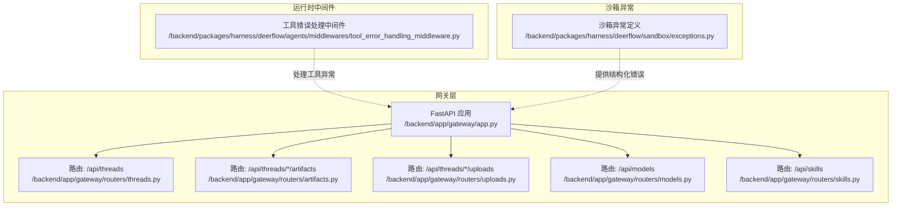
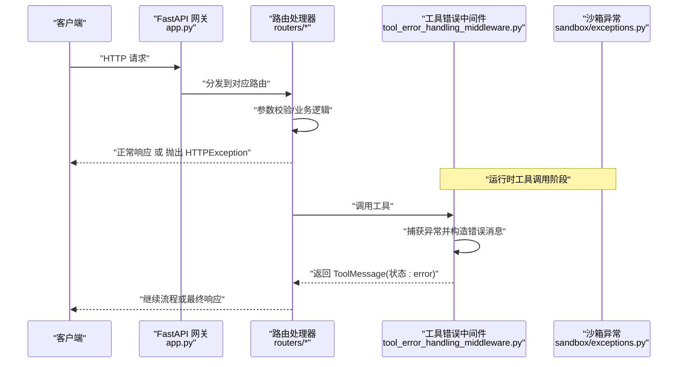
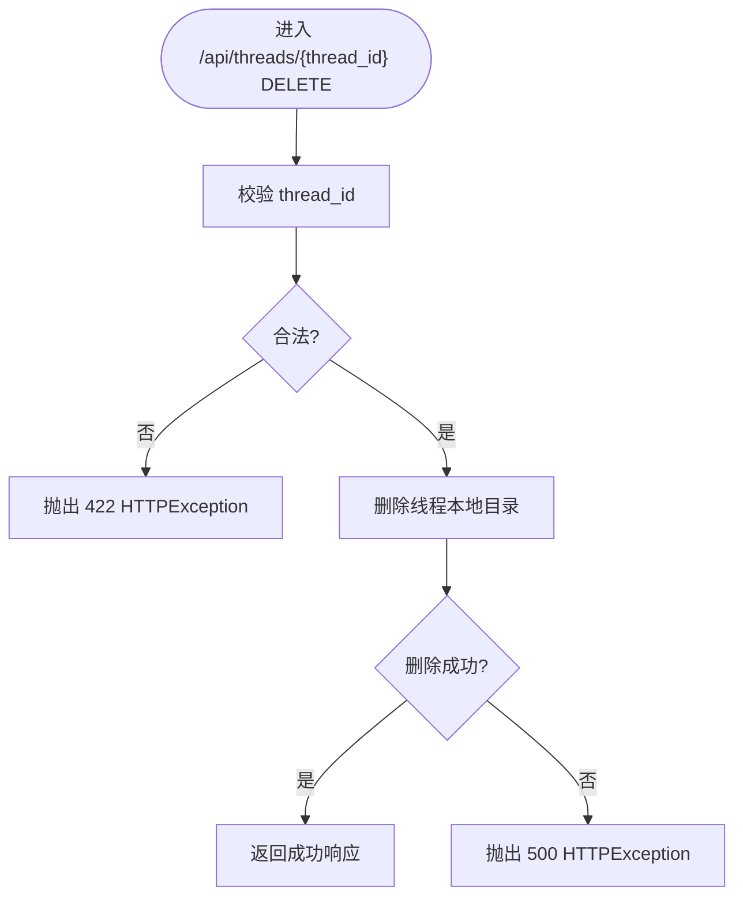
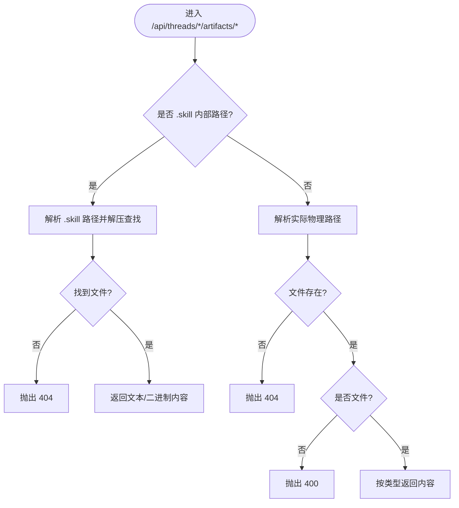
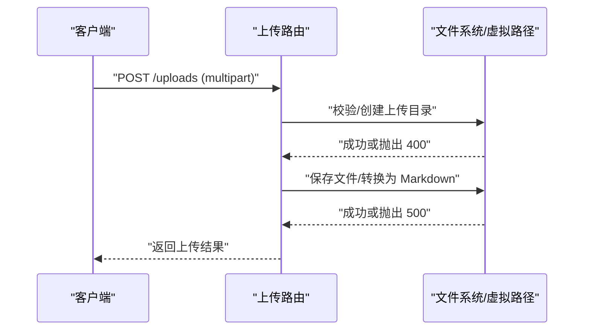
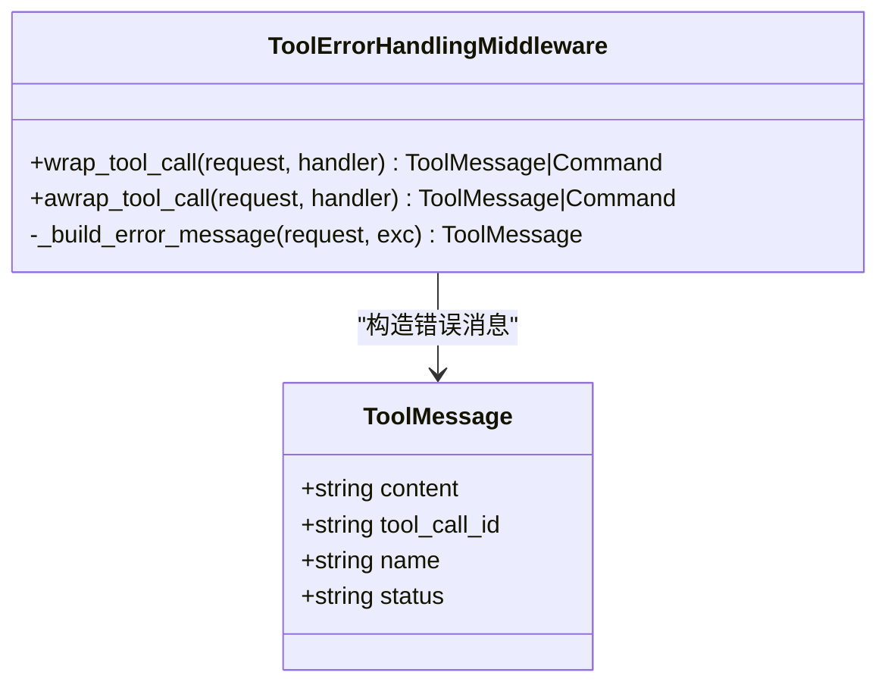
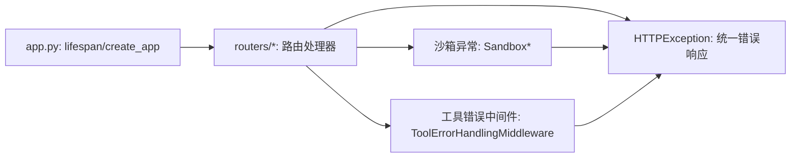

# 错误处理和状态码

<cite>
**本文引用的文件**   
- [backend/app/gateway/app.py](file://backend/app/gateway/app.py)
- [backend/app/gateway/routers/threads.py](file://backend/app/gateway/routers/threads.py)
- [backend/app/gateway/routers/artifacts.py](file://backend/app/gateway/routers/artifacts.py)
- [backend/app/gateway/routers/uploads.py](file://backend/app/gateway/routers/uploads.py)
- [backend/app/gateway/routers/models.py](file://backend/app/gateway/routers/models.py)
- [backend/app/gateway/routers/skills.py](file://backend/app/gateway/routers/skills.py)
- [backend/packages/harness/deerflow/agents/middlewares/tool_error_handling_middleware.py](file://backend/packages/harness/deerflow/agents/middlewares/tool_error_handling_middleware.py)
- [backend/packages/harness/deerflow/sandbox/exceptions.py](file://backend/packages/harness/deerflow/sandbox/exceptions.py)
- [backend/tests/test_tool_error_handling_middleware.py](file://backend/tests/test_tool_error_handling_middleware.py)
- [backend/scripts/tool-error-degradation-detection.sh](file://backend/scripts/tool-error-degradation-detection.sh)
</cite>

## 目录
1. [简介](#简介)
2. [项目结构](#项目结构)
3. [核心组件](#核心组件)
4. [架构总览](#架构总览)
5. [详细组件分析](#详细组件分析)
6. [依赖关系分析](#依赖关系分析)
7. [性能考量](#性能考量)
8. [故障排除指南](#故障排除指南)
9. [结论](#结论)
10. [附录](#附录)

## 简介
本文件系统性梳理 DeerFlow API 的错误处理机制与统一的错误响应格式，明确各路由在不同场景下的标准 HTTP 状态码使用规范，并给出 400、404、422、409、403、500 等状态码的触发条件与错误信息格式。同时，结合工具调用中间件与沙箱异常体系，解释从网关层到运行时的错误传播路径与日志记录策略，提供客户端错误处理最佳实践与重试策略建议。

## 项目结构
- 后端采用 FastAPI 网关应用，挂载多条业务路由（模型、技能、工件、上传、线程等），统一通过 HTTPException 抛出标准化错误。
- 运行时中间件负责捕获工具执行异常并转换为可继续流程的消息，避免中断整个推理链路。
- 沙箱模块提供结构化异常类型，便于上层根据具体错误类别进行差异化处理。

**图表来源**
- [backend/app/gateway/app.py:73-196](file://backend/app/gateway/app.py#L73-L196)
- [backend/app/gateway/routers/threads.py:19-31](file://backend/app/gateway/routers/threads.py#L19-L31)
- [backend/app/gateway/routers/artifacts.py:66-158](file://backend/app/gateway/routers/artifacts.py#L66-L158)
- [backend/app/gateway/routers/uploads.py:36-146](file://backend/app/gateway/routers/uploads.py#L36-L146)
- [backend/app/gateway/routers/models.py:82-116](file://backend/app/gateway/routers/models.py#L82-L116)
- [backend/app/gateway/routers/skills.py:87-173](file://backend/app/gateway/routers/skills.py#L87-L173)
- [backend/packages/harness/deerflow/agents/middlewares/tool_error_handling_middleware.py:19-65](file://backend/packages/harness/deerflow/agents/middlewares/tool_error_handling_middleware.py#L19-L65)
- [backend/packages/harness/deerflow/sandbox/exceptions.py:4-71](file://backend/packages/harness/deerflow/sandbox/exceptions.py#L4-L71)

**章节来源**
- [backend/app/gateway/app.py:73-196](file://backend/app/gateway/app.py#L73-L196)

## 核心组件
- 统一错误响应格式
  - 所有 HTTP 异常均通过 HTTPException 抛出，由 FastAPI 自动序列化为 JSON 响应。
  - 典型结构包含状态码、错误类型与详细描述，便于前端解析与展示。
- 标准 HTTP 状态码使用规范
  - 400：请求参数或路径非法、路径穿越检测失败、非文件路径访问等。
  - 403：访问被拒绝（例如路径穿越检测命中）。
  - 404：资源不存在（模型、技能、工件、线程数据、上传文件等）。
  - 409：资源冲突（如已存在同名代理）。
  - 422：输入校验失败（线程清理时传入非法线程 ID）。
  - 500：服务内部错误（配置加载失败、未知异常等）。
- 工具调用错误处理
  - 工具执行异常被捕获并转换为 ToolMessage，携带工具名、调用 ID 与错误摘要，保证流程继续。
- 沙箱异常体系
  - 提供 SandboxError 及其子类（如 SandboxNotFoundError、SandboxFileError 等），用于结构化错误信息与细节。

**章节来源**
- [backend/app/gateway/routers/threads.py:24-28](file://backend/app/gateway/routers/threads.py#L24-L28)
- [backend/app/gateway/routers/artifacts.py:84-87](file://backend/app/gateway/routers/artifacts.py#L84-L87)
- [backend/app/gateway/routers/uploads.py:42-48](file://backend/app/gateway/routers/uploads.py#L42-L48)
- [backend/app/gateway/routers/models.py:106-107](file://backend/app/gateway/routers/models.py#L106-L107)
- [backend/app/gateway/routers/skills.py:93](file://backend/app/gateway/routers/skills.py#L93)
- [backend/app/gateway/routers/skills.py:164-166](file://backend/app/gateway/routers/skills.py#L164-L166)
- [backend/packages/harness/deerflow/agents/middlewares/tool_error_handling_middleware.py:22-35](file://backend/packages/harness/deerflow/agents/middlewares/tool_error_handling_middleware.py#L22-L35)
- [backend/packages/harness/deerflow/sandbox/exceptions.py:4-71](file://backend/packages/harness/deerflow/sandbox/exceptions.py#L4-L71)

## 架构总览
下图展示了从客户端请求到错误响应的关键路径，包括网关路由、工具中间件与沙箱异常的协作关系。

**图表来源**
- [backend/app/gateway/app.py:73-196](file://backend/app/gateway/app.py#L73-L196)
- [backend/app/gateway/routers/artifacts.py:66-158](file://backend/app/gateway/routers/artifacts.py#L66-L158)
- [backend/packages/harness/deerflow/agents/middlewares/tool_error_handling_middleware.py:38-65](file://backend/packages/harness/deerflow/agents/middlewares/tool_error_handling_middleware.py#L38-L65)
- [backend/packages/harness/deerflow/sandbox/exceptions.py:4-71](file://backend/packages/harness/deerflow/sandbox/exceptions.py#L4-L71)

## 详细组件分析

### 线程清理接口（/api/threads/{thread_id}）
- 触发条件与状态码
  - 422：传入线程 ID 非法导致路径解析失败。
  - 500：其他未预期异常。
- 错误信息格式
  - detail 字段包含具体错误描述，便于前端提示用户修正输入。
- 典型场景
  - 输入空值、特殊字符或超长字符串导致路径解析器抛出异常。

**图表来源**
- [backend/app/gateway/routers/threads.py:19-31](file://backend/app/gateway/routers/threads.py#L19-L31)

**章节来源**
- [backend/app/gateway/routers/threads.py:24-28](file://backend/app/gateway/routers/threads.py#L24-L28)

### 工件获取接口（/api/threads/{thread_id}/artifacts/{path}）
- 触发条件与状态码
  - 400：请求路径不是文件、路径穿越检测失败。
  - 403：检测到路径穿越，拒绝访问。
  - 404：目标工件不存在。
- 错误信息格式
  - detail 字段明确指出“文件未找到”、“路径不是文件”等。
- 典型场景
  - 访问 .skill 归档内文件时，若归档不存在或内部路径不匹配，返回 404。
  - 普通文件访问时，若路径指向目录或越界，返回 400/403。

**图表来源**
- [backend/app/gateway/routers/artifacts.py:66-158](file://backend/app/gateway/routers/artifacts.py#L66-L158)

**章节来源**
- [backend/app/gateway/routers/artifacts.py:84-87](file://backend/app/gateway/routers/artifacts.py#L84-L87)
- [backend/app/gateway/routers/artifacts.py:134-138](file://backend/app/gateway/routers/artifacts.py#L134-L138)

### 文件上传接口（/api/threads/{thread_id}/uploads）
- 触发条件与状态码
  - 400：上传目录初始化失败（非法线程 ID）、路径穿越检测失败。
  - 404：删除文件时文件不存在。
  - 500：写入失败、转换失败或未知异常。
- 错误信息格式
  - detail 字段包含“Failed to upload ...”或“File not found ...”。

**图表来源**
- [backend/app/gateway/routers/uploads.py:36-146](file://backend/app/gateway/routers/uploads.py#L36-L146)

**章节来源**
- [backend/app/gateway/routers/uploads.py:42-48](file://backend/app/gateway/routers/uploads.py#L42-L48)
- [backend/app/gateway/routers/uploads.py:140-146](file://backend/app/gateway/routers/uploads.py#L140-L146)

### 模型查询接口（/api/models）
- 触发条件与状态码
  - 404：模型名称不存在。
- 错误信息格式
  - detail 字段包含“Model '...' not found”。

**章节来源**
- [backend/app/gateway/routers/models.py:106-107](file://backend/app/gateway/routers/models.py#L106-L107)

### 技能管理接口（/api/skills）
- 触发条件与状态码
  - 404：技能不存在。
  - 409：安装时技能已存在。
  - 400：安装时输入参数非法。
  - 500：加载/更新/安装过程中发生未知错误。
- 错误信息格式
  - detail 字段包含“Skill '...' not found”、“already exists”、“Failed to ...”。

**章节来源**
- [backend/app/gateway/routers/skills.py:93](file://backend/app/gateway/routers/skills.py#L93)
- [backend/app/gateway/routers/skills.py:164-166](file://backend/app/gateway/routers/skills.py#L164-L166)
- [backend/app/gateway/routers/skills.py:140](file://backend/app/gateway/routers/skills.py#L140)
- [backend/app/gateway/routers/skills.py:78](file://backend/app/gateway/routers/skills.py#L78)
- [backend/app/gateway/routers/skills.py:99](file://backend/app/gateway/routers/skills.py#L99)
- [backend/app/gateway/routers/skills.py:148](file://backend/app/gateway/routers/skills.py#L148)

### 工具错误处理中间件
- 功能概述
  - 将工具执行异常转换为 ToolMessage，携带工具名、调用 ID 与错误摘要，避免中断推理流程。
  - 对于 GraphBubbleUp 控制信号保持原样，确保流程控制不受影响。
- 错误消息要点
  - 包含工具名、异常类型与简要详情。
  - 当调用 ID 缺失时，使用占位标识以保证消息完整性。
- 测试覆盖
  - 成功路径直接返回原始 ToolMessage。
  - 异常路径返回状态为 error 的 ToolMessage。
  - 缺失调用 ID 时自动填充占位符。
  - GraphInterrupt 异常会被重新抛出，不被吞掉。

**图表来源**
- [backend/packages/harness/deerflow/agents/middlewares/tool_error_handling_middleware.py:19-65](file://backend/packages/harness/deerflow/agents/middlewares/tool_error_handling_middleware.py#L19-L65)

**章节来源**
- [backend/packages/harness/deerflow/agents/middlewares/tool_error_handling_middleware.py:22-35](file://backend/packages/harness/deerflow/agents/middlewares/tool_error_handling_middleware.py#L22-L35)
- [backend/tests/test_tool_error_handling_middleware.py:17-41](file://backend/tests/test_tool_error_handling_middleware.py#L17-L41)
- [backend/tests/test_tool_error_handling_middleware.py:70-84](file://backend/tests/test_tool_error_handling_middleware.py#L70-L84)

### 沙箱异常体系
- 类型与用途
  - SandboxError：基础异常，支持结构化 details。
  - SandboxNotFoundError：沙箱不存在或不可用。
  - SandboxRuntimeError：运行时不可用或配置错误。
  - SandboxCommandError：命令执行失败，携带 command 与 exit_code。
  - SandboxFileError：文件操作失败，携带 path 与 operation。
  - SandboxPermissionError：权限错误。
  - SandboxFileNotFoundError：文件或目录不存在。
- 使用建议
  - 在网关或运行时捕获后，映射为合适的 HTTP 状态码（如 404、400、500）并返回统一 JSON 错误体。

**章节来源**
- [backend/packages/harness/deerflow/sandbox/exceptions.py:4-71](file://backend/packages/harness/deerflow/sandbox/exceptions.py#L4-L71)

## 依赖关系分析
- 网关应用生命周期与健康检查
  - 应用启动时加载配置并记录日志；健康检查端点返回服务状态。
- 路由对异常的集中处理
  - 各路由在业务逻辑中显式抛出 HTTPException，确保错误语义清晰且一致。
- 中间件与沙箱异常的协作
  - 运行时工具异常经中间件转换为消息；沙箱异常作为底层错误来源，向上游映射为 HTTP 状态码。

**图表来源**
- [backend/app/gateway/app.py:32-71](file://backend/app/gateway/app.py#L32-L71)
- [backend/app/gateway/routers/artifacts.py:66-158](file://backend/app/gateway/routers/artifacts.py#L66-L158)
- [backend/packages/harness/deerflow/agents/middlewares/tool_error_handling_middleware.py:19-65](file://backend/packages/harness/deerflow/agents/middlewares/tool_error_handling_middleware.py#L19-L65)
- [backend/packages/harness/deerflow/sandbox/exceptions.py:4-71](file://backend/packages/harness/deerflow/sandbox/exceptions.py#L4-L71)

**章节来源**
- [backend/app/gateway/app.py:32-71](file://backend/app/gateway/app.py#L32-L71)

## 性能考量
- 日志记录
  - 网关与路由层广泛使用 logger.exception 记录堆栈，便于定位问题。
  - 工具错误中间件记录同步/异步失败上下文（工具名、调用 ID）。
- 资源访问优化
  - 工件接口对 .skill 内容设置缓存头，减少重复解压开销。
- 重试策略
  - 运行时对外部服务调用采用指数退避（含抖动），并尊重服务端 Retry-After 建议（见模型提供方实现）。

**章节来源**
- [backend/app/gateway/routers/artifacts.py:119-120](file://backend/app/gateway/routers/artifacts.py#L119-L120)
- [backend/packages/harness/deerflow/models/claude_provider.py:247-262](file://backend/packages/harness/deerflow/models/claude_provider.py#L247-L262)
- [backend/packages/harness/deerflow/agents/middlewares/tool_error_handling_middleware.py:49-50](file://backend/packages/harness/deerflow/agents/middlewares/tool_error_handling_middleware.py#L49-L50)

## 故障排除指南
- 常见错误场景与处理
  - 无效线程 ID 导致线程清理失败（422）：检查输入是否符合命名规范与长度限制。
  - 工件不存在（404）：确认路径前缀与线程 ID 正确，避免路径穿越。
  - 文件上传失败（500）：查看日志中的具体异常原因，检查磁盘空间与权限。
  - 技能安装冲突（409）：先卸载旧版本或更换名称。
  - 工具调用异常（运行时）：中间件会将其转换为状态为 error 的 ToolMessage，前端可据此提示用户或重试。
- 调试信息与日志
  - 启动阶段：关注配置加载与通道服务启动日志。
  - 运行阶段：工具执行失败日志包含工具名与调用 ID，有助于定位问题。
- 故障演练脚本
  - 提供模拟工具 SSL 握手失败的脚本，便于验证工具错误降级与日志输出。

**章节来源**
- [backend/app/gateway/routers/threads.py:24-28](file://backend/app/gateway/routers/threads.py#L24-L28)
- [backend/app/gateway/routers/artifacts.py:134-138](file://backend/app/gateway/routers/artifacts.py#L134-L138)
- [backend/app/gateway/routers/uploads.py:102-104](file://backend/app/gateway/routers/uploads.py#L102-L104)
- [backend/app/gateway/routers/skills.py:164-166](file://backend/app/gateway/routers/skills.py#L164-L166)
- [backend/packages/harness/deerflow/agents/middlewares/tool_error_handling_middleware.py:49-50](file://backend/packages/harness/deerflow/agents/middlewares/tool_error_handling_middleware.py#L49-L50)
- [backend/scripts/tool-error-degradation-detection.sh:48-81](file://backend/scripts/tool-error-degradation-detection.sh#L48-L81)

## 结论
DeerFlow API 通过统一的 HTTPException 与标准化的错误响应格式，实现了清晰、一致的错误语义；在运行时引入工具错误中间件与沙箱异常体系，进一步增强了系统的健壮性与可观测性。遵循本文的状态码使用规范与最佳实践，可帮助客户端高效定位问题并实现稳健的重试与降级策略。

## 附录
- 客户端错误处理最佳实践
  - 对 400/422：立即提示用户修正输入并阻止重复提交。
  - 对 404：友好提示资源不存在，并引导用户检查路径或权限。
  - 对 409：提示冲突并提供解决建议（如重命名）。
  - 对 500：记录错误日志并向用户显示通用错误提示，允许稍后重试。
- 重试策略建议
  - 对幂等 GET/HEAD：可安全重试，指数退避（含抖动）。
  - 对非幂等 POST/PUT/DELETE：谨慎重试，必要时引入去重键或幂等令牌。
  - 遵循服务端 Retry-After 建议，避免对下游造成冲击。
- JSON 错误响应字段说明（示例结构）
  - status_code：HTTP 状态码
  - detail：错误描述
  - timestamp：错误时间戳（由客户端或服务端附加）
  - request_id：请求唯一标识（可选）