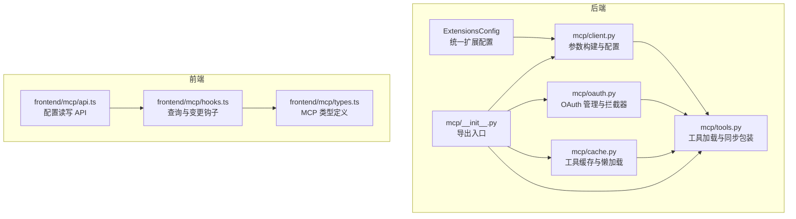
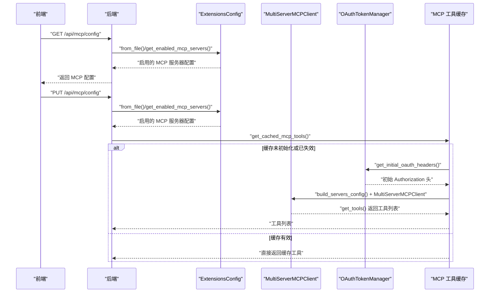
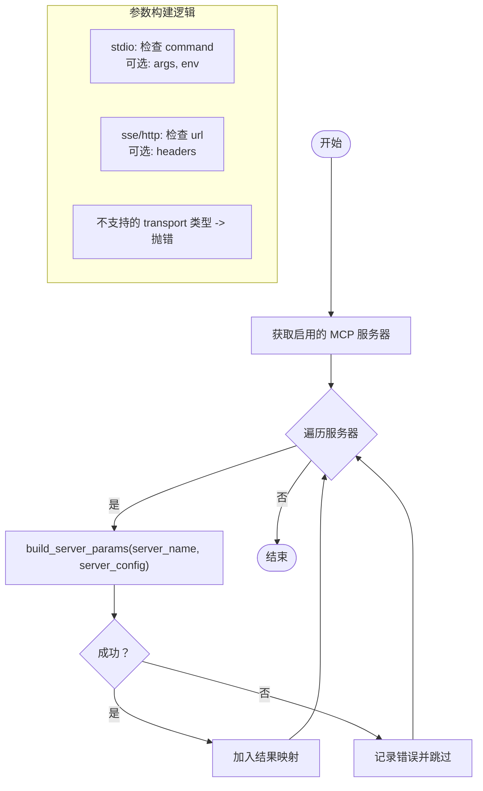
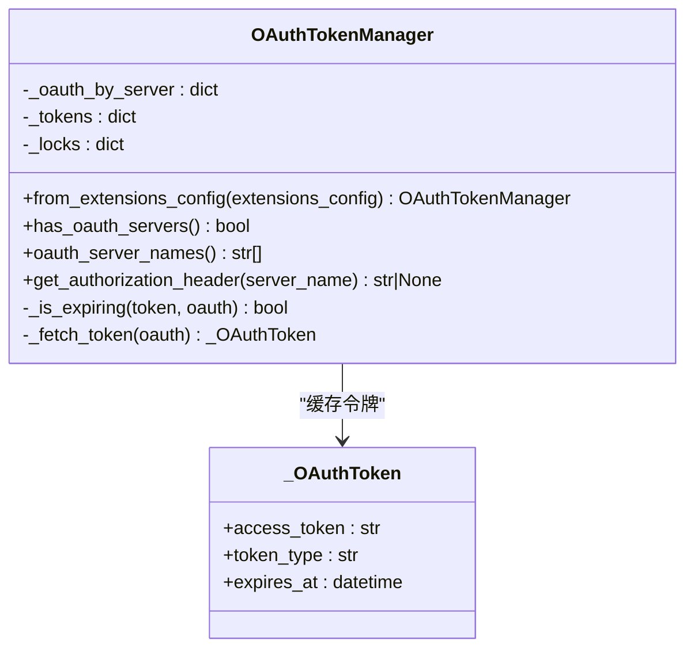
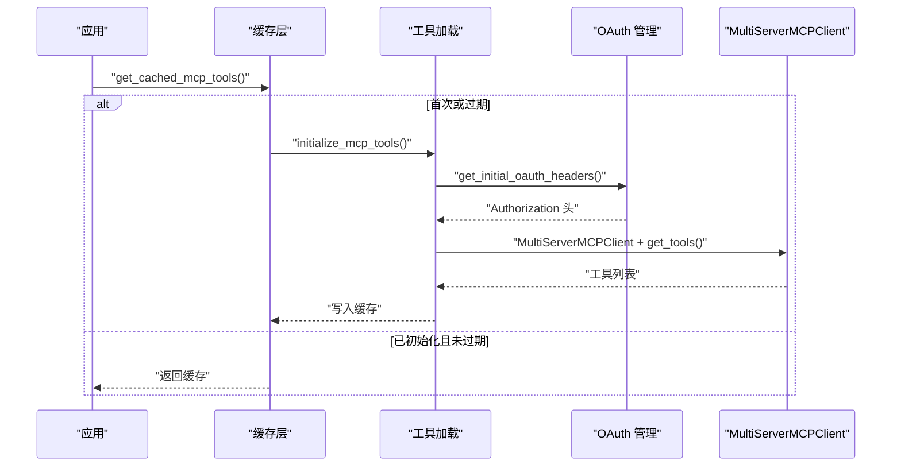
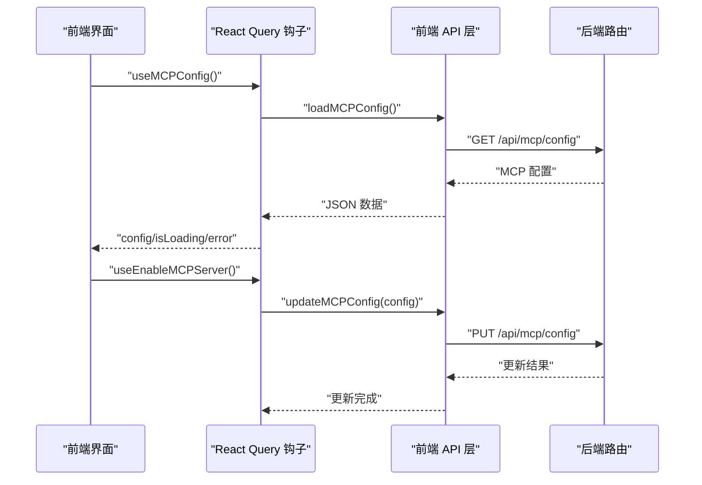
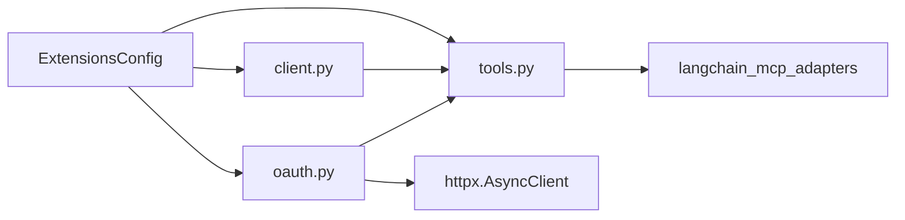

# MCP 客户端实现

<cite>
**本文引用的文件**
- [backend/packages/harness/deerflow/mcp/client.py](file://backend/packages/harness/deerflow/mcp/client.py)
- [backend/packages/harness/deerflow/mcp/__init__.py](file://backend/packages/harness/deerflow/mcp/__init__.py)
- [backend/packages/harness/deerflow/mcp/cache.py](file://backend/packages/harness/deerflow/mcp/cache.py)
- [backend/packages/harness/deerflow/mcp/oauth.py](file://backend/packages/harness/deerflow/mcp/oauth.py)
- [backend/packages/harness/deerflow/mcp/tools.py](file://backend/packages/harness/deerflow/mcp/tools.py)
- [backend/packages/harness/deerflow/config/extensions_config.py](file://backend/packages/harness/deerflow/config/extensions_config.py)
- [backend/docs/MCP_SERVER.md](file://backend/docs/MCP_SERVER.md)
- [backend/tests/test_mcp_client_config.py](file://backend/tests/test_mcp_client_config.py)
- [backend/tests/test_mcp_oauth.py](file://backend/tests/test_mcp_oauth.py)
- [backend/tests/test_mcp_sync_wrapper.py](file://backend/tests/test_mcp_sync_wrapper.py)
- [frontend/src/core/mcp/index.ts](file://frontend/src/core/mcp/index.ts)
- [frontend/src/core/mcp/types.ts](file://frontend/src/core/mcp/types.ts)
- [frontend/src/core/mcp/hooks.ts](file://frontend/src/core/mcp/hooks.ts)
- [frontend/src/core/mcp/api.ts](file://frontend/src/core/mcp/api.ts)
</cite>

## 目录
1. [简介](#简介)
2. [项目结构](#项目结构)
3. [核心组件](#核心组件)
4. [架构总览](#架构总览)
5. [详细组件分析](#详细组件分析)
6. [依赖分析](#依赖分析)
7. [性能考虑](#性能考虑)
8. [故障排查指南](#故障排查指南)
9. [结论](#结论)
10. [附录](#附录)

## 简介
本文件面向 MCP（Model Context Protocol）客户端在 DeerFlow 中的实现，系统性阐述 MultiServerMCPClient 的构建流程、服务器参数配置与传输类型支持（stdio、sse、http）、build_server_params 的实现逻辑、服务器配置验证与错误处理机制，并覆盖 MCP 客户端初始化、连接管理与工具发现流程。同时提供不同传输类型的配置示例与最佳实践，以及 MCP 客户端与 DeerFlow 工具系统的集成方式。

## 项目结构
MCP 客户端相关代码主要位于后端 harness 包下的 deerflow.mcp 子模块，配合统一的扩展配置 deerflow.config.extensions_config，前端通过 API 提供 MCP 配置的读取与更新能力。

图表来源
- [backend/packages/harness/deerflow/mcp/__init__.py:1-15](file://backend/packages/harness/deerflow/mcp/__init__.py#L1-L15)
- [backend/packages/harness/deerflow/mcp/client.py:1-69](file://backend/packages/harness/deerflow/mcp/client.py#L1-L69)
- [backend/packages/harness/deerflow/mcp/oauth.py:1-151](file://backend/packages/harness/deerflow/mcp/oauth.py#L1-L151)
- [backend/packages/harness/deerflow/mcp/cache.py:1-139](file://backend/packages/harness/deerflow/mcp/cache.py#L1-L139)
- [backend/packages/harness/deerflow/mcp/tools.py:1-114](file://backend/packages/harness/deerflow/mcp/tools.py#L1-L114)
- [backend/packages/harness/deerflow/config/extensions_config.py:1-259](file://backend/packages/harness/deerflow/config/extensions_config.py#L1-L259)
- [frontend/src/core/mcp/types.ts:1-9](file://frontend/src/core/mcp/types.ts#L1-L9)
- [frontend/src/core/mcp/hooks.ts:1-45](file://frontend/src/core/mcp/hooks.ts#L1-L45)
- [frontend/src/core/mcp/api.ts:1-22](file://frontend/src/core/mcp/api.ts#L1-L22)

章节来源
- [backend/packages/harness/deerflow/mcp/__init__.py:1-15](file://backend/packages/harness/deerflow/mcp/__init__.py#L1-L15)
- [backend/packages/harness/deerflow/mcp/client.py:1-69](file://backend/packages/harness/deerflow/mcp/client.py#L1-L69)
- [backend/packages/harness/deerflow/mcp/oauth.py:1-151](file://backend/packages/harness/deerflow/mcp/oauth.py#L1-L151)
- [backend/packages/harness/deerflow/mcp/cache.py:1-139](file://backend/packages/harness/deerflow/mcp/cache.py#L1-L139)
- [backend/packages/harness/deerflow/mcp/tools.py:1-114](file://backend/packages/harness/deerflow/mcp/tools.py#L1-L114)
- [backend/packages/harness/deerflow/config/extensions_config.py:1-259](file://backend/packages/harness/deerflow/config/extensions_config.py#L1-L259)
- [frontend/src/core/mcp/types.ts:1-9](file://frontend/src/core/mcp/types.ts#L1-L9)
- [frontend/src/core/mcp/hooks.ts:1-45](file://frontend/src/core/mcp/hooks.ts#L1-L45)
- [frontend/src/core/mcp/api.ts:1-22](file://frontend/src/core/mcp/api.ts#L1-L22)

## 核心组件
- 参数构建与配置
  - build_server_params：根据 McpServerConfig 构建 MultiServerMCPClient 所需的服务器参数字典，包含传输类型校验、字段完整性检查与参数映射。
  - build_servers_config：遍历启用的 MCP 服务器，逐个调用 build_server_params 并收集结果，对单个服务器失败进行日志记录但不影响其他服务器。
- OAuth 支持
  - OAuthTokenManager：按服务器聚合 OAuth 配置，负责令牌获取、缓存与刷新，支持并发安全与过期策略。
  - build_oauth_tool_interceptor/get_initial_oauth_headers：为工具调用注入 Authorization 头或在连接阶段预注入初始头。
- 工具加载与缓存
  - get_mcp_tools：使用 MultiServerMCPClient 发现并加载工具，注入拦截器与初始头，对异步工具进行同步包装以适配同步调用场景。
  - initialize_mcp_tools/get_cached_mcp_tools/reset_mcp_tools_cache：提供线程安全的懒加载、缓存失效检测与重置。
- 统一配置
  - ExtensionsConfig：解析 extensions_config.json，支持环境变量替换、路径解析与启用过滤；提供全局缓存与重载能力。

章节来源
- [backend/packages/harness/deerflow/mcp/client.py:11-68](file://backend/packages/harness/deerflow/mcp/client.py#L11-L68)
- [backend/packages/harness/deerflow/mcp/oauth.py:25-151](file://backend/packages/harness/deerflow/mcp/oauth.py#L25-L151)
- [backend/packages/harness/deerflow/mcp/tools.py:56-114](file://backend/packages/harness/deerflow/mcp/tools.py#L56-L114)
- [backend/packages/harness/deerflow/mcp/cache.py:56-139](file://backend/packages/harness/deerflow/mcp/cache.py#L56-L139)
- [backend/packages/harness/deerflow/config/extensions_config.py:55-259](file://backend/packages/harness/deerflow/config/extensions_config.py#L55-L259)

## 架构总览
下图展示从配置到工具加载、OAuth 注入与缓存的整体流程：

图表来源
- [backend/packages/harness/deerflow/mcp/tools.py:56-114](file://backend/packages/harness/deerflow/mcp/tools.py#L56-L114)
- [backend/packages/harness/deerflow/mcp/cache.py:56-139](file://backend/packages/harness/deerflow/mcp/cache.py#L56-L139)
- [backend/packages/harness/deerflow/mcp/oauth.py:140-151](file://backend/packages/harness/deerflow/mcp/oauth.py#L140-L151)
- [frontend/src/core/mcp/api.ts:5-22](file://frontend/src/core/mcp/api.ts#L5-L22)

## 详细组件分析

### MultiServerMCPClient 构建与参数配置
- build_server_params
  - 依据 transport 字段选择分支：
    - stdio：要求提供 command；可选 args、env。
    - sse/http：要求提供 url；可选 headers。
    - 其他类型：抛出异常。
  - 返回值为适配 langchain-mcp-adapters 的参数字典。
- build_servers_config
  - 从 ExtensionsConfig 获取启用的服务器集合；
  - 对每个服务器调用 build_server_params，捕获异常并记录错误，跳过失败项；
  - 返回服务器名到参数字典的映射。

图表来源
- [backend/packages/harness/deerflow/mcp/client.py:11-68](file://backend/packages/harness/deerflow/mcp/client.py#L11-L68)

章节来源
- [backend/packages/harness/deerflow/mcp/client.py:11-68](file://backend/packages/harness/deerflow/mcp/client.py#L11-L68)
- [backend/tests/test_mcp_client_config.py:9-94](file://backend/tests/test_mcp_client_config.py#L9-L94)

### OAuth 支持与拦截器
- OAuthTokenManager
  - 基于每服务器的 McpOAuthConfig 进行令牌获取与缓存；
  - 使用 asyncio.Lock 保证并发安全；
  - 刷新策略：基于 expires_at 与 refresh_skew_seconds 的过期判断；
  - 支持 client_credentials 与 refresh_token 两种授权类型。
- 工具拦截器与初始头
  - build_oauth_tool_interceptor：在工具调用前注入 Authorization 头；
  - get_initial_oauth_headers：在连接阶段为服务器配置注入 Authorization 头。

图表来源
- [backend/packages/harness/deerflow/mcp/oauth.py:25-151](file://backend/packages/harness/deerflow/mcp/oauth.py#L25-L151)

章节来源
- [backend/packages/harness/deerflow/mcp/oauth.py:25-151](file://backend/packages/harness/deerflow/mcp/oauth.py#L25-L151)
- [backend/tests/test_mcp_oauth.py:39-192](file://backend/tests/test_mcp_oauth.py#L39-L192)

### 工具加载、同步包装与缓存
- get_mcp_tools
  - 从磁盘读取最新 ExtensionsConfig；
  - 调用 build_servers_config 构建服务器参数；
  - 为 HTTP/SSE 服务器注入初始 Authorization 头；
  - 创建 MultiServerMCPClient 并调用 get_tools；
  - 对异步工具添加 func 同步包装，确保同步调用兼容。
- initialize_mcp_tools/get_cached_mcp_tools/reset_mcp_tools_cache
  - 懒加载与线程安全初始化；
  - 基于配置文件修改时间检测缓存是否过期；
  - 在无事件循环或已有运行中循环时分别采用线程池或当前循环执行。

图表来源
- [backend/packages/harness/deerflow/mcp/tools.py:56-114](file://backend/packages/harness/deerflow/mcp/tools.py#L56-L114)
- [backend/packages/harness/deerflow/mcp/cache.py:56-139](file://backend/packages/harness/deerflow/mcp/cache.py#L56-L139)
- [backend/packages/harness/deerflow/mcp/oauth.py:140-151](file://backend/packages/harness/deerflow/mcp/oauth.py#L140-L151)

章节来源
- [backend/packages/harness/deerflow/mcp/tools.py:56-114](file://backend/packages/harness/deerflow/mcp/tools.py#L56-L114)
- [backend/packages/harness/deerflow/mcp/cache.py:56-139](file://backend/packages/harness/deerflow/mcp/cache.py#L56-L139)
- [backend/tests/test_mcp_sync_wrapper.py:15-86](file://backend/tests/test_mcp_sync_wrapper.py#L15-L86)

### 前端集成与配置管理
- 类型与接口
  - MCPServerConfig/MCPConfig：定义 MCP 服务器与整体配置的数据结构。
- 查询与变更
  - useMCPConfig/useEnableMCPServer：通过 React Query 访问后端 API，支持读取与更新 MCP 配置。
- API 调用
  - loadMCPConfig/updateMCPConfig：封装后端 /api/mcp/config 的 GET/PUT 请求。

图表来源
- [frontend/src/core/mcp/hooks.ts:5-45](file://frontend/src/core/mcp/hooks.ts#L5-L45)
- [frontend/src/core/mcp/api.ts:5-22](file://frontend/src/core/mcp/api.ts#L5-L22)
- [frontend/src/core/mcp/types.ts:1-9](file://frontend/src/core/mcp/types.ts#L1-L9)

章节来源
- [frontend/src/core/mcp/hooks.ts:5-45](file://frontend/src/core/mcp/hooks.ts#L5-L45)
- [frontend/src/core/mcp/api.ts:5-22](file://frontend/src/core/mcp/api.ts#L5-L22)
- [frontend/src/core/mcp/types.ts:1-9](file://frontend/src/core/mcp/types.ts#L1-L9)

## 依赖分析
- 模块耦合
  - mcp/client.py 依赖 ExtensionsConfig 的 McpServerConfig/McpOAuthConfig；
  - mcp/tools.py 依赖 langchain_mcp_adapters 的 MultiServerMCPClient；
  - mcp/oauth.py 依赖 httpx.AsyncClient 进行令牌获取；
  - mcp/cache.py 依赖 ExtensionsConfig 的配置路径解析与 mtime 检测。
- 外部依赖
  - langchain-mcp-adapters：提供 MultiServerMCPClient 与工具发现能力；
  - httpx：用于 OAuth 令牌端点请求；
  - pydantic：用于配置模型校验与序列化。

图表来源
- [backend/packages/harness/deerflow/mcp/client.py:6-7](file://backend/packages/harness/deerflow/mcp/client.py#L6-L7)
- [backend/packages/harness/deerflow/mcp/tools.py:12-14](file://backend/packages/harness/deerflow/mcp/tools.py#L12-L14)
- [backend/packages/harness/deerflow/mcp/oauth.py:11,73](file://backend/packages/harness/deerflow/mcp/oauth.py#L11,L73)

章节来源
- [backend/packages/harness/deerflow/mcp/client.py:6-7](file://backend/packages/harness/deerflow/mcp/client.py#L6-L7)
- [backend/packages/harness/deerflow/mcp/tools.py:12-14](file://backend/packages/harness/deerflow/mcp/tools.py#L12-L14)
- [backend/packages/harness/deerflow/mcp/oauth.py:11,73](file://backend/packages/harness/deerflow/mcp/oauth.py#L11,L73)

## 性能考虑
- 线程池与嵌套事件循环
  - 同步工具包装使用全局线程池执行异步协程，避免嵌套事件循环问题，提升并发调用稳定性。
- 缓存与懒加载
  - 工具缓存基于配置文件 mtime 检测，减少重复初始化开销；首次访问自动触发初始化。
- 并发安全
  - OAuth 令牌获取使用 per-server 锁，避免重复拉取；多服务器并发场景下保持一致性。
- I/O 优化
  - HTTP/SSE 服务器在连接阶段注入初始 Authorization 头，减少后续请求额外开销。

章节来源
- [backend/packages/harness/deerflow/mcp/tools.py:18-54](file://backend/packages/harness/deerflow/mcp/tools.py#L18-L54)
- [backend/packages/harness/deerflow/mcp/cache.py:31-53](file://backend/packages/harness/deerflow/mcp/cache.py#L31-L53)
- [backend/packages/harness/deerflow/mcp/oauth.py:31,67-70](file://backend/packages/harness/deerflow/mcp/oauth.py#L31,L67-L70)

## 故障排查指南
- 无法加载 MCP 工具
  - 检查是否安装 langchain-mcp-adapters；若未安装，工具加载会返回空列表并记录警告。
  - 确认 extensions_config.json 路径与权限正确，必要时设置 DEER_FLOW_EXTENSIONS_CONFIG_PATH。
- 传输类型配置错误
  - stdio：缺少 command 将抛出异常；请提供命令与参数。
  - sse/http：缺少 url 将抛出异常；请提供正确的服务地址与可选 headers。
  - 不支持的 transport 类型将抛出异常；请使用 stdio/sse/http。
- OAuth 相关问题
  - client_credentials：缺少 client_id 或 client_secret 将抛出异常。
  - refresh_token：缺少 refresh_token 将抛出异常。
  - 令牌响应缺少 token_field 将抛出异常；检查 token_url 与响应格式。
- 工具同步调用失败
  - 若工具仅提供 coroutine，系统会自动添加 func 同步包装；如仍报错，请检查工具名称与参数。
- 前端配置更新无效
  - 确认后端 /api/mcp/config 接口可用；检查网络与跨域设置；确认前端已触发查询失效。

章节来源
- [backend/packages/harness/deerflow/mcp/tools.py:64-66](file://backend/packages/harness/deerflow/mcp/tools.py#L64-L66)
- [backend/packages/harness/deerflow/mcp/client.py:24-40](file://backend/packages/harness/deerflow/mcp/client.py#L24-L40)
- [backend/packages/harness/deerflow/mcp/oauth.py:85-99,106-119](file://backend/packages/harness/deerflow/mcp/oauth.py#L85-L99,L106-L119)
- [backend/tests/test_mcp_client_config.py:27-63](file://backend/tests/test_mcp_client_config.py#L27-L63)
- [backend/tests/test_mcp_oauth.py:39-192](file://backend/tests/test_mcp_oauth.py#L39-L192)
- [backend/tests/test_mcp_sync_wrapper.py:15-86](file://backend/tests/test_mcp_sync_wrapper.py#L15-L86)

## 结论
DeerFlow 的 MCP 客户端实现围绕“配置即服务”的理念，通过统一的扩展配置驱动多服务器连接，结合 OAuth 自动令牌注入与工具缓存机制，实现了稳定、可扩展且易于维护的工具发现与调用体系。前端通过标准 API 提供配置读写能力，便于用户在运行时动态启用/禁用 MCP 服务器并观察效果。

## 附录

### 不同传输类型的配置示例与最佳实践
- stdio
  - 必填：command
  - 可选：args、env
  - 最佳实践：将敏感参数通过环境变量注入，避免硬编码；在 args 中传递最小必要参数。
- sse/http
  - 必填：url
  - 可选：headers
  - 最佳实践：为需要鉴权的服务开启 oauth；合理设置 refresh_skew_seconds；在 headers 中仅放置必要头部。
- OAuth（http/sse）
  - 支持 client_credentials 与 refresh_token；
  - secrets 通过环境变量注入，避免明文存储；
  - 建议为每个服务器单独配置 oauth，避免全局污染。

章节来源
- [backend/docs/MCP_SERVER.md:17-65](file://backend/docs/MCP_SERVER.md#L17-L65)
- [backend/packages/harness/deerflow/mcp/client.py:24-40](file://backend/packages/harness/deerflow/mcp/client.py#L24-L40)
- [backend/packages/harness/deerflow/mcp/oauth.py:16-31](file://backend/packages/harness/deerflow/mcp/oauth.py#L16-L31)

### MCP 客户端与 DeerFlow 工具系统的集成方式
- 工具发现与注册
  - MultiServerMCPClient.get_tools 动态发现工具并返回 LangChain BaseTool 列表；
  - 系统对异步工具进行 func 同步包装，确保与同步调用场景兼容。
- 缓存与热更新
  - 通过配置文件 mtime 检测缓存有效性；后端独立进程修改配置后，LangGraph Server 侧可感知变更并重新初始化。
- 前端配置联动
  - 前端通过 /api/mcp/config 读取与更新 MCP 配置，配合后端懒加载与缓存，实现“即改即生效”。

章节来源
- [backend/packages/harness/deerflow/mcp/tools.py:56-114](file://backend/packages/harness/deerflow/mcp/tools.py#L56-L114)
- [backend/packages/harness/deerflow/mcp/cache.py:17-53](file://backend/packages/harness/deerflow/mcp/cache.py#L17-L53)
- [frontend/src/core/mcp/api.ts:5-22](file://frontend/src/core/mcp/api.ts#L5-L22)