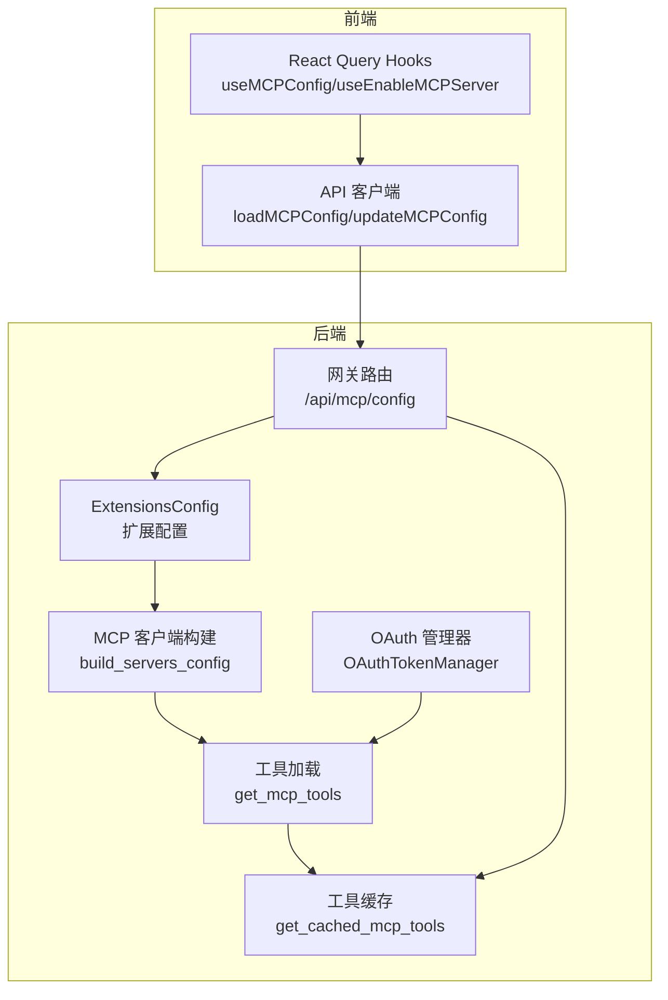
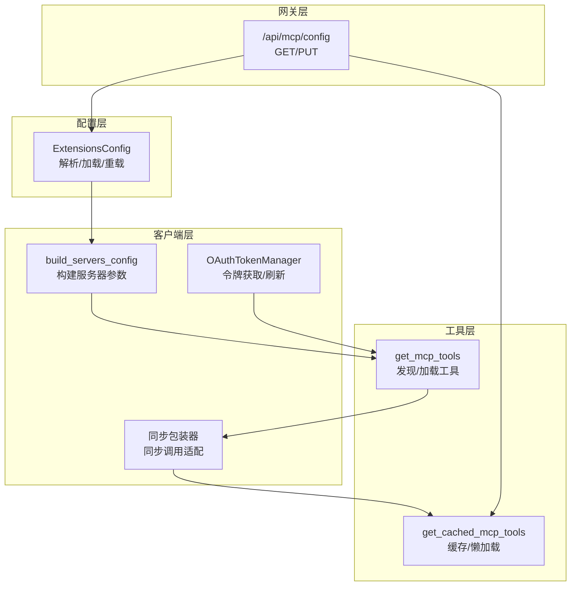
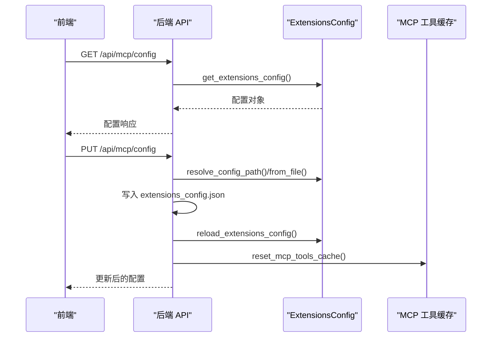
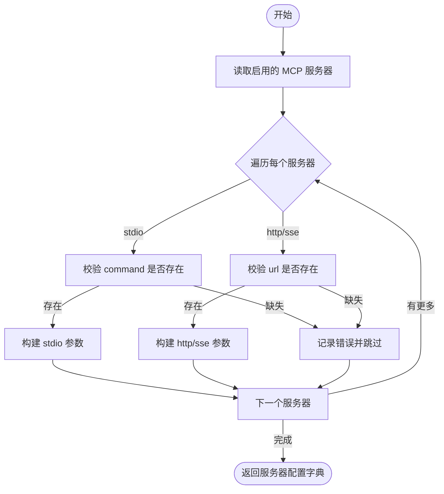
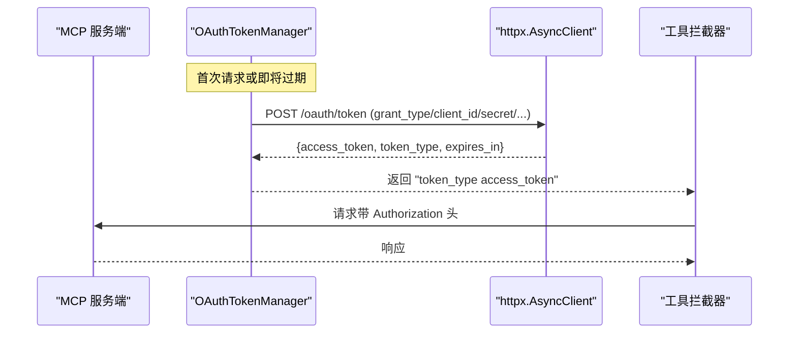
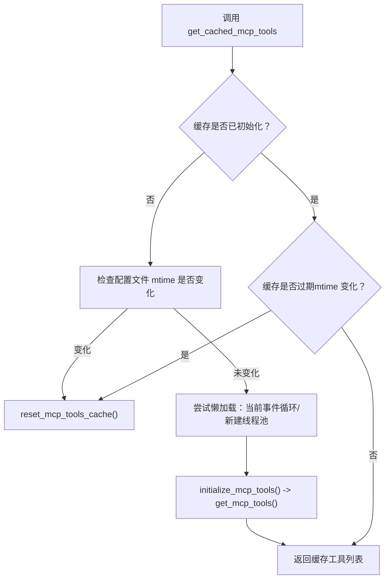
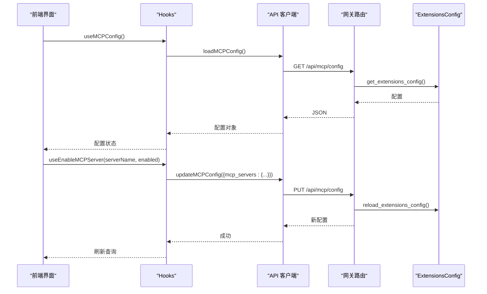
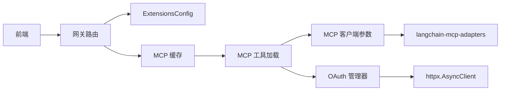

# MCP 服务器集成

<cite>
**本文引用的文件**
- [backend/packages/harness/deerflow/mcp/__init__.py](file://backend/packages/harness/deerflow/mcp/__init__.py)
- [backend/packages/harness/deerflow/mcp/cache.py](file://backend/packages/harness/deerflow/mcp/cache.py)
- [backend/packages/harness/deerflow/mcp/client.py](file://backend/packages/harness/deerflow/mcp/client.py)
- [backend/packages/harness/deerflow/mcp/oauth.py](file://backend/packages/harness/deerflow/mcp/oauth.py)
- [backend/packages/harness/deerflow/mcp/tools.py](file://backend/packages/harness/deerflow/mcp/tools.py)
- [backend/packages/harness/deerflow/config/extensions_config.py](file://backend/packages/harness/deerflow/config/extensions_config.py)
- [backend/app/gateway/routers/mcp.py](file://backend/app/gateway/routers/mcp.py)
- [backend/docs/MCP_SERVER.md](file://backend/docs/MCP_SERVER.md)
- [backend/tests/test_mcp_client_config.py](file://backend/tests/test_mcp_client_config.py)
- [backend/tests/test_mcp_oauth.py](file://backend/tests/test_mcp_oauth.py)
- [frontend/src/core/mcp/api.ts](file://frontend/src/core/mcp/api.ts)
- [frontend/src/core/mcp/hooks.ts](file://frontend/src/core/mcp/hooks.ts)
- [frontend/src/core/mcp/types.ts](file://frontend/src/core/mcp/types.ts)
</cite>

## 目录
1. [简介](#简介)
2. [项目结构](#项目结构)
3. [核心组件](#核心组件)
4. [架构总览](#架构总览)
5. [详细组件分析](#详细组件分析)
6. [依赖关系分析](#依赖关系分析)
7. [性能考虑](#性能考虑)
8. [故障排除指南](#故障排除指南)
9. [结论](#结论)
10. [附录](#附录)

## 简介
本文件面向 DeerFlow 的 MCP（模型上下文协议）服务器集成，系统性阐述 MCP 架构设计、客户端实现与 OAuth 认证流程；详细说明 MCP 工具缓存机制、连接管理与错误处理策略；涵盖 MCP 服务器配置、认证设置与性能优化建议；并提供 MCP 服务器集成示例与自定义 MCP 客户端开发指南，解释 MCP 系统与工具系统、智能体的集成关系。

## 项目结构
MCP 集成由后端 Python 包装层与前端交互层共同组成：
- 后端封装层：负责 MCP 服务器配置构建、工具加载、OAuth 令牌管理、缓存与同步包装等
- 前端交互层：通过 API 路由读取/更新 MCP 配置，并在 UI 中启用/禁用服务器
- 网关路由：提供 /api/mcp/config 的 GET/PUT 接口，支持运行时配置变更

**图表来源**
- [backend/packages/harness/deerflow/mcp/client.py:45-68](file://backend/packages/harness/deerflow/mcp/client.py#L45-L68)
- [backend/packages/harness/deerflow/mcp/oauth.py:25-151](file://backend/packages/harness/deerflow/mcp/oauth.py#L25-L151)
- [backend/packages/harness/deerflow/mcp/cache.py:82-126](file://backend/packages/harness/deerflow/mcp/cache.py#L82-L126)
- [backend/packages/harness/deerflow/mcp/tools.py:56-113](file://backend/packages/harness/deerflow/mcp/tools.py#L56-L113)
- [backend/app/gateway/routers/mcp.py:66-169](file://backend/app/gateway/routers/mcp.py#L66-L169)
- [frontend/src/core/mcp/api.ts:1-21](file://frontend/src/core/mcp/api.ts#L1-L21)
- [frontend/src/core/mcp/hooks.ts:1-44](file://frontend/src/core/mcp/hooks.ts#L1-L44)

**章节来源**
- [backend/packages/harness/deerflow/mcp/__init__.py:1-15](file://backend/packages/harness/deerflow/mcp/__init__.py#L1-L15)
- [backend/app/gateway/routers/mcp.py:1-170](file://backend/app/gateway/routers/mcp.py#L1-L170)
- [backend/docs/MCP_SERVER.md:1-65](file://backend/docs/MCP_SERVER.md#L1-L65)

## 核心组件
- 扩展配置（ExtensionsConfig）
  - 统一管理 MCP 服务器与技能配置，支持从 JSON 文件动态加载与环境变量解析
  - 提供获取启用服务器、重载配置、重置缓存等能力
- MCP 客户端参数构建（build_servers_config/build_server_params）
  - 将配置映射为 MultiServerMCPClient 的服务器参数，支持 stdio/sse/http 传输类型
  - 对无效或缺失字段进行校验并记录错误
- OAuth 令牌管理（OAuthTokenManager）
  - 支持 client_credentials 与 refresh_token 两种授权模式
  - 缓存令牌并在过期前自动刷新，线程安全并发控制
- 工具加载与缓存（get_mcp_tools/get_cached_mcp_tools）
  - 使用 langchain-mcp-adapters 发现并加载工具
  - 注入初始 OAuth 头部用于服务端会话初始化
  - 为同步调用场景提供工具包装，避免嵌套事件循环问题
- 网关路由（/api/mcp/config）
  - 提供 MCP 配置的查询与更新接口，保存到 extensions_config.json 并触发缓存失效

**章节来源**
- [backend/packages/harness/deerflow/config/extensions_config.py:55-259](file://backend/packages/harness/deerflow/config/extensions_config.py#L55-L259)
- [backend/packages/harness/deerflow/mcp/client.py:11-68](file://backend/packages/harness/deerflow/mcp/client.py#L11-L68)
- [backend/packages/harness/deerflow/mcp/oauth.py:25-151](file://backend/packages/harness/deerflow/mcp/oauth.py#L25-L151)
- [backend/packages/harness/deerflow/mcp/tools.py:56-113](file://backend/packages/harness/deerflow/mcp/tools.py#L56-L113)
- [backend/packages/harness/deerflow/mcp/cache.py:82-138](file://backend/packages/harness/deerflow/mcp/cache.py#L82-L138)
- [backend/app/gateway/routers/mcp.py:66-169](file://backend/app/gateway/routers/mcp.py#L66-L169)

## 架构总览
下图展示 MCP 服务器集成的整体架构与数据流：

**图表来源**
- [backend/packages/harness/deerflow/config/extensions_config.py:119-144](file://backend/packages/harness/deerflow/config/extensions_config.py#L119-L144)
- [backend/packages/harness/deerflow/mcp/client.py:45-68](file://backend/packages/harness/deerflow/mcp/client.py#L45-L68)
- [backend/packages/harness/deerflow/mcp/oauth.py:122-151](file://backend/packages/harness/deerflow/mcp/oauth.py#L122-L151)
- [backend/packages/harness/deerflow/mcp/tools.py:56-113](file://backend/packages/harness/deerflow/mcp/tools.py#L56-L113)
- [backend/packages/harness/deerflow/mcp/cache.py:82-126](file://backend/packages/harness/deerflow/mcp/cache.py#L82-L126)
- [backend/app/gateway/routers/mcp.py:66-169](file://backend/app/gateway/routers/mcp.py#L66-L169)

## 详细组件分析

### 配置与路由组件
- ExtensionsConfig
  - 支持多级配置路径解析与环境变量替换
  - 提供 get_enabled_mcp_servers 过滤启用服务器
  - 提供 get_extensions_config/reload_extensions_config/reset_extensions_config 缓存控制
- 网关路由 /api/mcp/config
  - GET 返回当前 MCP 配置
  - PUT 更新配置文件并重载缓存，LangGraph Server 通过 mtime 自动感知变更并重新初始化工具

**图表来源**
- [backend/app/gateway/routers/mcp.py:66-169](file://backend/app/gateway/routers/mcp.py#L66-L169)
- [backend/packages/harness/deerflow/config/extensions_config.py:119-144](file://backend/packages/harness/deerflow/config/extensions_config.py#L119-L144)
- [backend/packages/harness/deerflow/mcp/cache.py:129-138](file://backend/packages/harness/deerflow/mcp/cache.py#L129-L138)

**章节来源**
- [backend/packages/harness/deerflow/config/extensions_config.py:55-259](file://backend/packages/harness/deerflow/config/extensions_config.py#L55-L259)
- [backend/app/gateway/routers/mcp.py:66-169](file://backend/app/gateway/routers/mcp.py#L66-L169)

### 客户端参数构建
- build_server_params
  - 校验 stdio 必需字段 command，校验 http/sse 必需字段 url
  - 支持 env/headers 注入
- build_servers_config
  - 过滤 disabled 服务器，逐个构建参数并记录错误

**图表来源**
- [backend/packages/harness/deerflow/mcp/client.py:11-68](file://backend/packages/harness/deerflow/mcp/client.py#L11-L68)

**章节来源**
- [backend/packages/harness/deerflow/mcp/client.py:11-68](file://backend/packages/harness/deerflow/mcp/client.py#L11-L68)
- [backend/tests/test_mcp_client_config.py:1-93](file://backend/tests/test_mcp_client_config.py#L1-L93)

### OAuth 认证流程
- OAuthTokenManager
  - 按服务器聚合需要 OAuth 的配置
  - 令牌缓存与过期判断（支持 refresh_skew_seconds 提前刷新）
  - 并发安全：按服务器加锁，避免重复拉取
- 工具拦截器与初始头部
  - build_oauth_tool_interceptor 注入 Authorization 头
  - get_initial_oauth_headers 在工具发现/会话初始化阶段注入初始头部

**图表来源**
- [backend/packages/harness/deerflow/mcp/oauth.py:25-151](file://backend/packages/harness/deerflow/mcp/oauth.py#L25-L151)

**章节来源**
- [backend/packages/harness/deerflow/mcp/oauth.py:25-151](file://backend/packages/harness/deerflow/mcp/oauth.py#L25-L151)
- [backend/tests/test_mcp_oauth.py:1-192](file://backend/tests/test_mcp_oauth.py#L1-L192)

### 工具加载与缓存
- get_mcp_tools
  - 从最新磁盘配置加载服务器列表
  - 注入初始 OAuth 头部用于服务端会话建立
  - 构建 MultiServerMCPClient 并获取工具
  - 为同步调用场景包装异步工具，避免嵌套事件循环
- get_cached_mcp_tools
  - 全局缓存 + mtime 检测，LangGraph Server 变更通过文件时间戳触发重载
  - 懒加载：首次访问时初始化，支持运行中事件循环与无事件循环两种场景

**图表来源**
- [backend/packages/harness/deerflow/mcp/cache.py:82-126](file://backend/packages/harness/deerflow/mcp/cache.py#L82-L126)
- [backend/packages/harness/deerflow/mcp/tools.py:56-113](file://backend/packages/harness/deerflow/mcp/tools.py#L56-L113)

**章节来源**
- [backend/packages/harness/deerflow/mcp/tools.py:56-113](file://backend/packages/harness/deerflow/mcp/tools.py#L56-L113)
- [backend/packages/harness/deerflow/mcp/cache.py:82-138](file://backend/packages/harness/deerflow/mcp/cache.py#L82-L138)

### 前端集成与使用
- API 客户端
  - loadMCPConfig：GET /api/mcp/config
  - updateMCPConfig：PUT /api/mcp/config
- React Query Hooks
  - useMCPConfig：查询 MCP 配置
  - useEnableMCPServer：按服务器启用/禁用并刷新缓存

**图表来源**
- [frontend/src/core/mcp/api.ts:1-21](file://frontend/src/core/mcp/api.ts#L1-L21)
- [frontend/src/core/mcp/hooks.ts:1-44](file://frontend/src/core/mcp/hooks.ts#L1-L44)
- [backend/app/gateway/routers/mcp.py:66-169](file://backend/app/gateway/routers/mcp.py#L66-L169)

**章节来源**
- [frontend/src/core/mcp/api.ts:1-21](file://frontend/src/core/mcp/api.ts#L1-L21)
- [frontend/src/core/mcp/hooks.ts:1-44](file://frontend/src/core/mcp/hooks.ts#L1-L44)
- [frontend/src/core/mcp/types.ts:1-9](file://frontend/src/core/mcp/types.ts#L1-L9)

## 依赖关系分析
- 组件耦合
  - mcp/tools 依赖 mcp/client 与 mcp/oauth，形成“加载层”
  - mcp/cache 依赖 mcp/tools 与 config/extensions_config，形成“缓存层”
  - gateway/routers/mcp 依赖 config/extensions_config 与 mcp/cache，形成“配置层”
  - 前端仅依赖后端 API，解耦于具体实现细节
- 外部依赖
  - langchain-mcp-adapters：MCP 工具发现与客户端
  - httpx：OAuth 令牌获取
  - FastAPI：网关路由
- 循环依赖
  - 未见直接循环依赖；通过模块导入顺序与延迟初始化规避潜在问题

**图表来源**
- [backend/packages/harness/deerflow/mcp/tools.py:56-113](file://backend/packages/harness/deerflow/mcp/tools.py#L56-L113)
- [backend/packages/harness/deerflow/mcp/client.py:45-68](file://backend/packages/harness/deerflow/mcp/client.py#L45-L68)
- [backend/packages/harness/deerflow/mcp/oauth.py:122-151](file://backend/packages/harness/deerflow/mcp/oauth.py#L122-L151)
- [backend/app/gateway/routers/mcp.py:66-169](file://backend/app/gateway/routers/mcp.py#L66-L169)

**章节来源**
- [backend/packages/harness/deerflow/mcp/tools.py:56-113](file://backend/packages/harness/deerflow/mcp/tools.py#L56-L113)
- [backend/packages/harness/deerflow/mcp/client.py:45-68](file://backend/packages/harness/deerflow/mcp/client.py#L45-L68)
- [backend/packages/harness/deerflow/mcp/oauth.py:122-151](file://backend/packages/harness/deerflow/mcp/oauth.py#L122-L151)
- [backend/app/gateway/routers/mcp.py:66-169](file://backend/app/gateway/routers/mcp.py#L66-L169)

## 性能考虑
- 工具加载与缓存
  - 使用全局缓存与 mtime 检测，避免重复初始化
  - 懒加载策略在 LangGraph Studio 等复杂事件循环环境中仍可工作
- 并发与同步
  - OAuthTokenManager 为每个服务器加锁，避免并发重复拉取
  - 工具同步包装使用线程池执行嵌套事件循环，减少阻塞
- 网络与超时
  - OAuth 令牌请求设置超时，降低阻塞风险
- 配置热更新
  - 通过文件时间戳检测实现跨进程热更新，无需重启应用

[本节为通用性能指导，不直接分析具体文件]

## 故障排除指南
- MCP 服务器无法启动（stdio）
  - 检查命令是否存在与权限是否正确
  - 确认参数与环境变量配置
- HTTP/SSE 服务器无法连接
  - 检查 URL 与网络连通性
  - 如需 OAuth，确认 token_url、grant_type、client_id/client_secret 等配置
- 工具未出现在智能体可用工具列表
  - 确认服务器已启用且可访问
  - 查看后端日志中的工具加载失败信息
  - 若刚更新配置，等待 LangGraph Server 检测到 mtime 变化并重新初始化
- OAuth 401/令牌过期
  - 检查 refresh_skew_seconds 设置是否合理
  - 确认令牌响应字段与默认值匹配

**章节来源**
- [backend/packages/harness/deerflow/mcp/client.py:24-40](file://backend/packages/harness/deerflow/mcp/client.py#L24-L40)
- [backend/packages/harness/deerflow/mcp/oauth.py:72-119](file://backend/packages/harness/deerflow/mcp/oauth.py#L72-L119)
- [backend/packages/harness/deerflow/mcp/tools.py:111-113](file://backend/packages/harness/deerflow/mcp/tools.py#L111-L113)
- [backend/app/gateway/routers/mcp.py:167-169](file://backend/app/gateway/routers/mcp.py#L167-L169)

## 结论
DeerFlow 的 MCP 集成通过清晰的分层设计实现了灵活的服务器配置、可靠的 OAuth 认证、高效的工具缓存与同步适配，并提供了前后端一体化的配置管理体验。该方案既满足本地开发场景，也支持生产环境的热更新与高可用需求。

[本节为总结性内容，不直接分析具体文件]

## 附录

### MCP 服务器配置示例与最佳实践
- 配置文件位置与命名
  - 优先使用 extensions_config.json；若不存在则回退至 mcp_config.json
  - 可通过环境变量指定配置文件路径
- 传输类型选择
  - 本地二进制：stdio（需提供 command 与 args）
  - 远程服务：http/sse（需提供 url；如为 http/sse，可选配置 OAuth）
- OAuth 配置要点
  - 支持 client_credentials 与 refresh_token
  - secrets 建议通过环境变量注入
  - 注意 refresh_skew_seconds 的设置以避免临界点过期

**章节来源**
- [backend/docs/MCP_SERVER.md:1-65](file://backend/docs/MCP_SERVER.md#L1-L65)
- [backend/packages/harness/deerflow/config/extensions_config.py:70-117](file://backend/packages/harness/deerflow/config/extensions_config.py#L70-L117)
- [backend/packages/harness/deerflow/mcp/client.py:21-40](file://backend/packages/harness/deerflow/mcp/client.py#L21-L40)
- [backend/packages/harness/deerflow/mcp/oauth.py:16-31](file://backend/packages/harness/deerflow/mcp/oauth.py#L16-L31)

### 自定义 MCP 客户端开发指南
- 步骤概要
  - 定义 McpServerConfig 与可选的 McpOAuthConfig
  - 使用 build_servers_config 构建参数字典
  - 如需 OAuth，使用 build_oauth_tool_interceptor 注入 Authorization 头
  - 初始化 MultiServerMCPClient 并调用 get_tools 获取工具
  - 使用 get_cached_mcp_tools 或自行实现缓存与懒加载
- 关键注意点
  - stdio 服务器必须提供 command；http/sse 必须提供 url
  - 对于同步调用场景，确保工具具备 func 包装
  - 跨进程热更新：监听配置文件 mtime 变化并重置缓存

**章节来源**
- [backend/packages/harness/deerflow/mcp/client.py:45-68](file://backend/packages/harness/deerflow/mcp/client.py#L45-L68)
- [backend/packages/harness/deerflow/mcp/oauth.py:122-151](file://backend/packages/harness/deerflow/mcp/oauth.py#L122-L151)
- [backend/packages/harness/deerflow/mcp/tools.py:56-113](file://backend/packages/harness/deerflow/mcp/tools.py#L56-L113)
- [backend/packages/harness/deerflow/mcp/cache.py:82-138](file://backend/packages/harness/deerflow/mcp/cache.py#L82-L138)