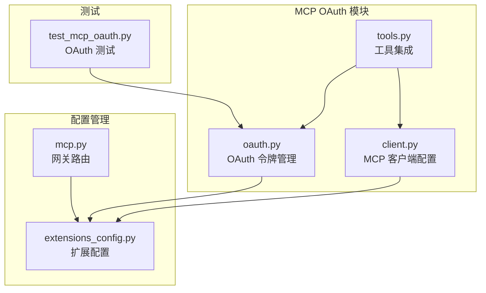
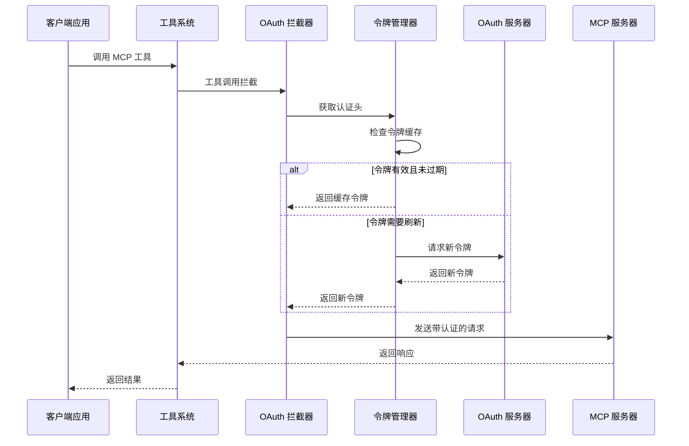
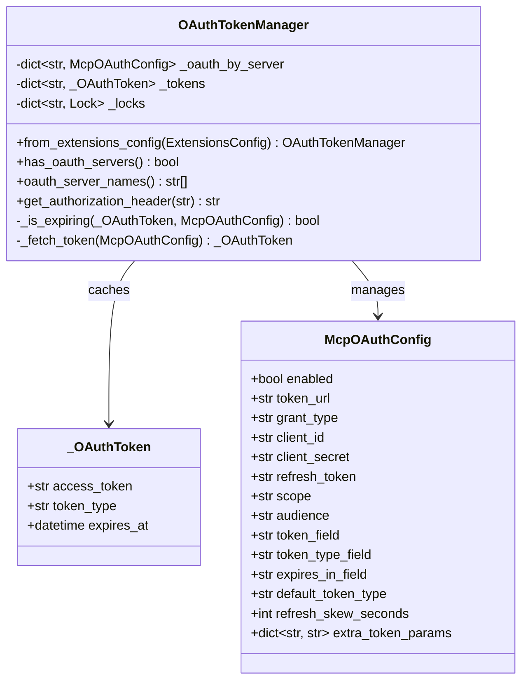
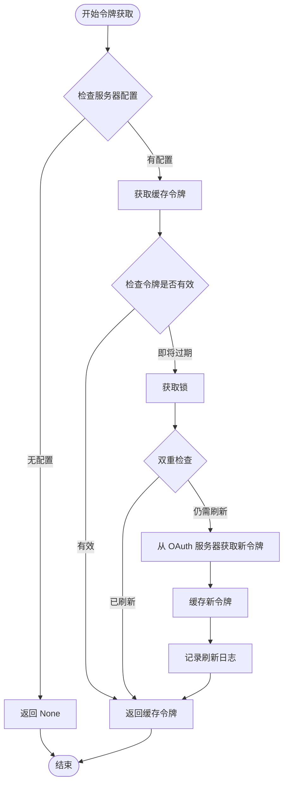
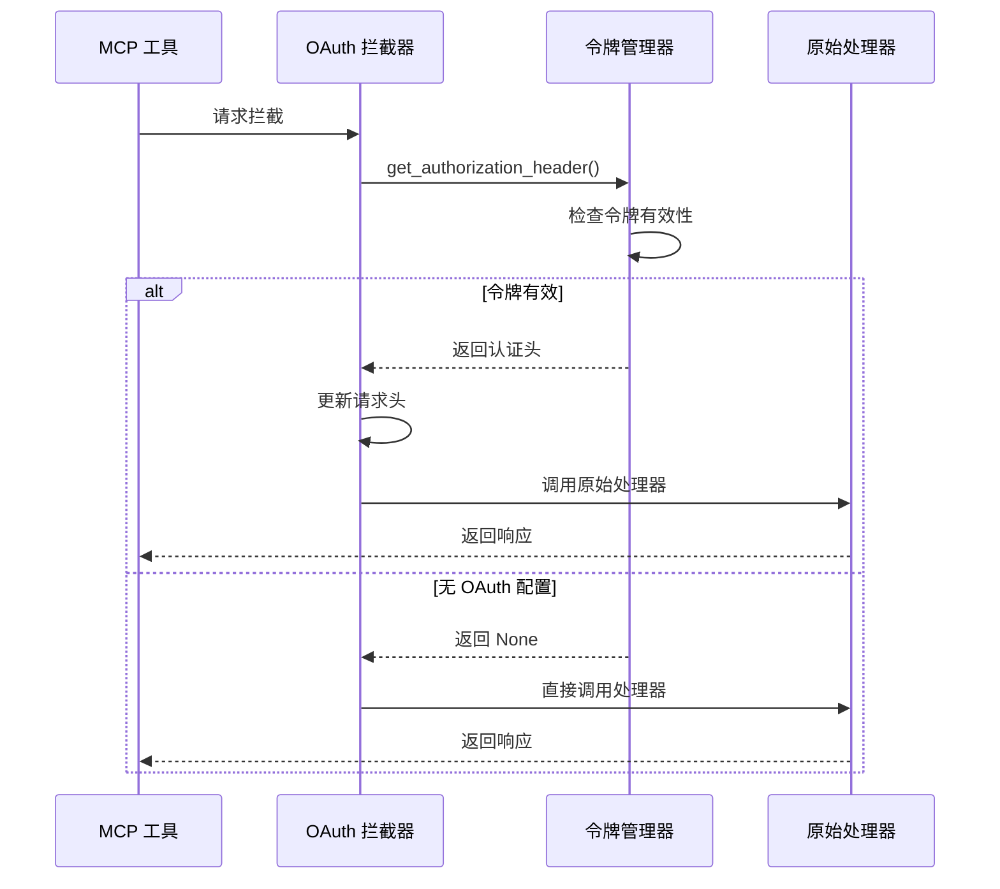
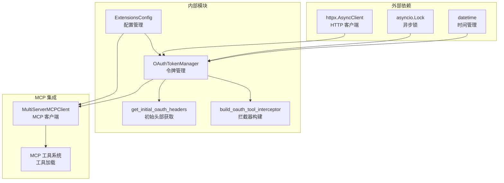

# OAuth 认证机制

<cite>
**本文档引用的文件**
- [oauth.py](file://backend/packages/harness/deerflow/mcp/oauth.py)
- [extensions_config.py](file://backend/packages/harness/deerflow/config/extensions_config.py)
- [client.py](file://backend/packages/harness/deerflow/mcp/client.py)
- [tools.py](file://backend/packages/harness/deerflow/mcp/tools.py)
- [mcp.py](file://backend/app/gateway/routers/mcp.py)
- [test_mcp_oauth.py](file://backend/tests/test_mcp_oauth.py)
</cite>

## 目录
1. [简介](#简介)
2. [项目结构](#项目结构)
3. [核心组件](#核心组件)
4. [架构概览](#架构概览)
5. [详细组件分析](#详细组件分析)
6. [依赖关系分析](#依赖关系分析)
7. [性能考虑](#性能考虑)
8. [故障排除指南](#故障排除指南)
9. [结论](#结论)

## 简介

DeerFlow 项目中的 OAuth 认证机制为 MCP（Model Context Protocol）服务器提供了完整的 OAuth 2.0 支持，包括令牌获取、缓存、刷新和自动注入功能。该机制特别针对 MCP 服务器的 HTTP 和 SSE 传输类型进行了优化，确保与外部服务的安全通信。

OAuth 认证机制主要解决以下问题：
- 为 MCP 服务器提供安全的身份验证
- 自动管理访问令牌的生命周期
- 支持多种 OAuth 授权模式
- 提供透明的令牌注入机制
- 处理令牌过期和刷新场景

## 项目结构

OAuth 认证机制在项目中的组织结构如下：

**图表来源**
- [oauth.py:1-151](file://backend/packages/harness/deerflow/mcp/oauth.py#L1-L151)
- [extensions_config.py:1-259](file://backend/packages/harness/deerflow/config/extensions_config.py#L1-L259)

**章节来源**
- [oauth.py:1-151](file://backend/packages/harness/deerflow/mcp/oauth.py#L1-L151)
- [extensions_config.py:1-259](file://backend/packages/harness/deerflow/config/extensions_config.py#L1-L259)

## 核心组件

### OAuth 令牌管理器 (OAuthTokenManager)

OAuth 令牌管理器是整个认证机制的核心组件，负责：
- 管理多个 MCP 服务器的 OAuth 配置
- 缓存和刷新访问令牌
- 提供线程安全的令牌获取机制
- 支持并发请求的令牌管理

### OAuth 配置模型

OAuth 配置模型定义了完整的 OAuth 参数支持：
- **令牌端点**: token_url - OAuth 令牌获取的终结点
- **授权类型**: grant_type - 支持 client_credentials 和 refresh_token
- **客户端凭证**: client_id 和 client_secret
- **刷新令牌**: refresh_token（用于 refresh_token 授权类型）
- **作用域和受众**: scope 和 audience 参数
- **响应字段**: token_field, token_type_field, expires_in_field
- **刷新策略**: refresh_skew_seconds（提前刷新时间）

### 工具拦截器

工具拦截器提供透明的 OAuth 令牌注入功能：
- 自动检测需要认证的 MCP 服务器
- 在工具调用时动态添加 Authorization 头
- 支持并发环境下的令牌管理

**章节来源**
- [oauth.py:25-151](file://backend/packages/harness/deerflow/mcp/oauth.py#L25-L151)
- [extensions_config.py:11-32](file://backend/packages/harness/deerflow/config/extensions_config.py#L11-L32)

## 架构概览

OAuth 认证机制的整体架构设计体现了分层和解耦的原则：

**图表来源**
- [tools.py:83-98](file://backend/packages/harness/deerflow/mcp/tools.py#L83-L98)
- [oauth.py:47-65](file://backend/packages/harness/deerflow/mcp/oauth.py#L47-L65)

该架构的关键特性：
- **透明性**: 客户端无需关心认证细节
- **缓存优化**: 减少不必要的令牌请求
- **并发安全**: 使用锁机制防止竞态条件
- **错误处理**: 提供健壮的异常处理机制

## 详细组件分析

### OAuth 令牌管理器类图

**图表来源**
- [oauth.py:16-120](file://backend/packages/harness/deerflow/mcp/oauth.py#L16-L120)
- [extensions_config.py:11-31](file://backend/packages/harness/deerflow/config/extensions_config.py#L11-L31)

### 令牌获取流程

令牌获取流程展示了 OAuth 机制的核心逻辑：

**图表来源**
- [oauth.py:47-65](file://backend/packages/harness/deerflow/mcp/oauth.py#L47-L65)
- [oauth.py:72-119](file://backend/packages/harness/deerflow/mcp/oauth.py#L72-L119)

### 工具拦截器工作流程

工具拦截器提供了透明的 OAuth 令牌注入机制：

**图表来源**
- [oauth.py:128-137](file://backend/packages/harness/deerflow/mcp/oauth.py#L128-L137)
- [tools.py:93-96](file://backend/packages/harness/deerflow/mcp/tools.py#L93-L96)

**章节来源**
- [oauth.py:25-151](file://backend/packages/harness/deerflow/mcp/oauth.py#L25-L151)
- [tools.py:56-114](file://backend/packages/harness/deerflow/mcp/tools.py#L56-L114)

## 依赖关系分析

OAuth 认证机制的依赖关系展现了清晰的模块化设计：

**图表来源**
- [oauth.py:73-119](file://backend/packages/harness/deerflow/mcp/oauth.py#L73-L119)
- [tools.py:72-98](file://backend/packages/harness/deerflow/mcp/tools.py#L72-L98)

**章节来源**
- [extensions_config.py:177-183](file://backend/packages/harness/deerflow/config/extensions_config.py#L177-L183)
- [client.py:54-68](file://backend/packages/harness/deerflow/mcp/client.py#L54-L68)

## 性能考虑

OAuth 认证机制在设计时充分考虑了性能优化：

### 并发控制
- 使用 asyncio.Lock 确保令牌刷新的原子性
- 避免多个并发请求同时刷新同一个令牌
- 支持高并发环境下的稳定运行

### 缓存策略
- 令牌过期前进行预刷新（默认提前 60 秒）
- 缓存有效的访问令牌，减少网络请求
- 支持多服务器令牌的独立缓存管理

### 错误处理
- 网络超时设置为 15 秒，避免长时间阻塞
- 详细的错误日志记录，便于调试
- 异常情况下的优雅降级

## 故障排除指南

### 常见问题及解决方案

**令牌获取失败**
- 检查 OAuth 服务器的可达性和配置正确性
- 验证客户端凭证的有效性
- 查看网络连接和防火墙设置

**令牌过期问题**
- 检查 refresh_skew_seconds 设置是否合理
- 确认系统时间同步状态
- 验证 OAuth 服务器的令牌有效期设置

**并发访问冲突**
- 确认 asyncio.Lock 正常工作
- 检查事件循环的状态
- 避免在同步环境中直接调用异步函数

**章节来源**
- [test_mcp_oauth.py:39-84](file://backend/tests/test_mcp_oauth.py#L39-L84)
- [test_mcp_oauth.py:148-192](file://backend/tests/test_mcp_oauth.py#L148-L192)

## 结论

DeerFlow 项目的 OAuth 认证机制提供了一个完整、健壮且高效的解决方案，适用于 MCP 服务器的安全通信需求。该机制的主要优势包括：

1. **模块化设计**: 清晰的组件分离和职责划分
2. **并发安全**: 完善的锁机制和异步支持
3. **配置灵活**: 支持多种 OAuth 授权模式和自定义参数
4. **性能优化**: 智能缓存和预刷新策略
5. **易于集成**: 透明的拦截器机制，无需修改现有代码

该机制为 MCP 服务器提供了企业级的 OAuth 支持，能够满足各种复杂的认证需求，同时保持了良好的可维护性和扩展性。