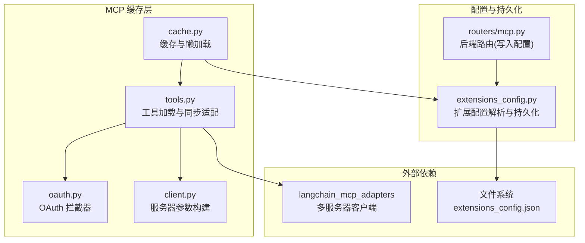
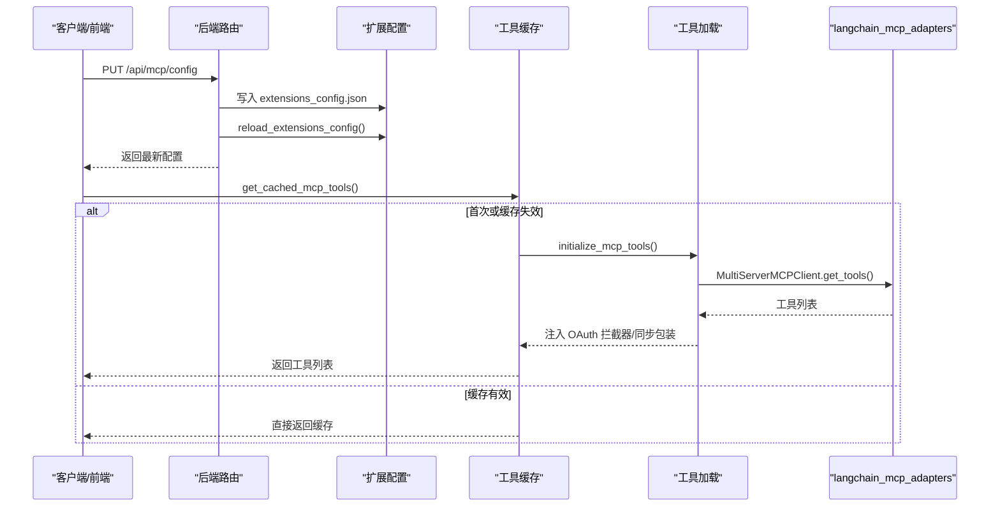
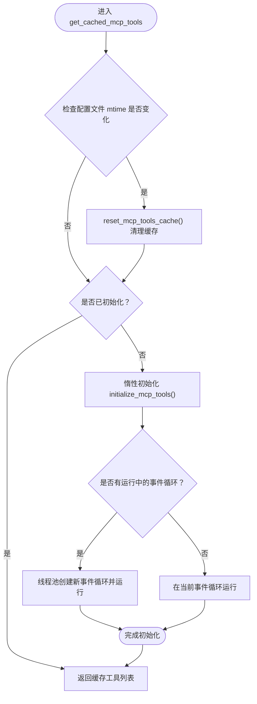
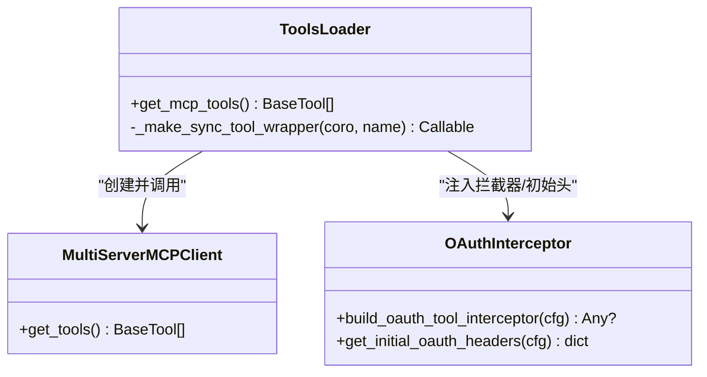
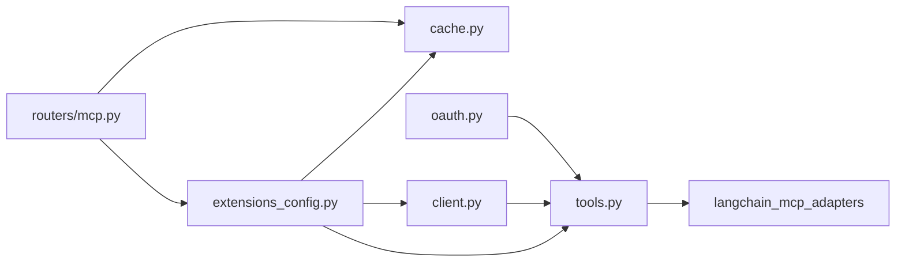

# 工具缓存管理

<cite>
**本文引用的文件列表**
- [cache.py](file://backend/packages/harness/deerflow/mcp/cache.py)
- [tools.py](file://backend/packages/harness/deerflow/mcp/tools.py)
- [client.py](file://backend/packages/harness/deerflow/mcp/client.py)
- [oauth.py](file://backend/packages/harness/deerflow/mcp/oauth.py)
- [extensions_config.py](file://backend/packages/harness/deerflow/config/extensions_config.py)
- [mcp.py](file://backend/app/gateway/routers/mcp.py)
- [MCP_SERVER.md](file://backend/docs/MCP_SERVER.md)
- [test_mcp_client_config.py](file://backend/tests/test_mcp_client_config.py)
- [test_mcp_oauth.py](file://backend/tests/test_mcp_oauth.py)
</cite>

## 目录
1. [简介](#简介)
2. [项目结构](#项目结构)
3. [核心组件](#核心组件)
4. [架构总览](#架构总览)
5. [组件详解](#组件详解)
6. [依赖关系分析](#依赖关系分析)
7. [性能考量](#性能考量)
8. [故障排查指南](#故障排查指南)
9. [结论](#结论)
10. [附录](#附录)

## 简介
本文件面向 MCP（模型上下文协议）工具缓存管理，系统性阐述缓存的实现原理、缓存策略与性能优化机制；详细说明缓存键生成、缓存失效与清理策略；涵盖缓存配置选项、内存管理与持久化机制；并提供缓存性能监控与调试方法，解释缓存与工具执行的关系及缓存一致性保障。

## 项目结构
围绕 MCP 工具缓存的关键模块分布如下：
- 缓存与懒加载：backend/packages/harness/deerflow/mcp/cache.py
- 工具加载与同步适配：backend/packages/harness/deerflow/mcp/tools.py
- MCP 客户端参数构建：backend/packages/harness/deerflow/mcp/client.py
- OAuth 支持与拦截器：backend/packages/harness/deerflow/mcp/oauth.py
- 扩展配置与持久化：backend/packages/harness/deerflow/config/extensions_config.py
- 后端路由（配置更新与持久化）：backend/app/gateway/routers/mcp.py
- 文档与示例：backend/docs/MCP_SERVER.md
- 单元测试：backend/tests/test_mcp_client_config.py、backend/tests/test_mcp_oauth.py

图表来源
- [cache.py:1-139](file://backend/packages/harness/deerflow/mcp/cache.py#L1-L139)
- [tools.py:1-114](file://backend/packages/harness/deerflow/mcp/tools.py#L1-L114)
- [client.py:1-69](file://backend/packages/harness/deerflow/mcp/client.py#L1-L69)
- [oauth.py:1-151](file://backend/packages/harness/deerflow/mcp/oauth.py#L1-L151)
- [extensions_config.py:1-259](file://backend/packages/harness/deerflow/config/extensions_config.py#L1-L259)
- [mcp.py:1-170](file://backend/app/gateway/routers/mcp.py#L1-L170)

章节来源
- [cache.py:1-139](file://backend/packages/harness/deerflow/mcp/cache.py#L1-L139)
- [tools.py:1-114](file://backend/packages/harness/deerflow/mcp/tools.py#L1-L114)
- [client.py:1-69](file://backend/packages/harness/deerflow/mcp/client.py#L1-L69)
- [oauth.py:1-151](file://backend/packages/harness/deerflow/mcp/oauth.py#L1-L151)
- [extensions_config.py:1-259](file://backend/packages/harness/deerflow/config/extensions_config.py#L1-L259)
- [mcp.py:1-170](file://backend/app/gateway/routers/mcp.py#L1-L170)

## 核心组件
- 缓存与懒加载：提供全局单例缓存、惰性初始化、基于配置文件修改时间的失效检测与重置能力，并在不同事件循环环境下安全初始化。
- 工具加载与同步适配：从启用的 MCP 服务器批量发现工具，注入 OAuth 拦截器，将异步工具包装为同步调用以兼容流式客户端。
- 服务器参数构建：根据扩展配置构建多服务器客户端参数，支持 stdio、sse、http 三种传输类型。
- OAuth 支持：按服务器维度缓存访问令牌，自动刷新，线程安全，提供工具拦截器与初始连接头注入。
- 扩展配置与持久化：统一解析 extensions_config.json，支持环境变量替换、路径解析优先级、读取/重载/重置缓存。
- 后端路由：提供 MCP 配置的读取与更新接口，更新时写入配置文件并重载缓存，触发工具缓存失效与重建。

章节来源
- [cache.py:56-139](file://backend/packages/harness/deerflow/mcp/cache.py#L56-L139)
- [tools.py:56-114](file://backend/packages/harness/deerflow/mcp/tools.py#L56-L114)
- [client.py:45-69](file://backend/packages/harness/deerflow/mcp/client.py#L45-L69)
- [oauth.py:25-151](file://backend/packages/harness/deerflow/mcp/oauth.py#L25-L151)
- [extensions_config.py:69-259](file://backend/packages/harness/deerflow/config/extensions_config.py#L69-L259)
- [mcp.py:66-170](file://backend/app/gateway/routers/mcp.py#L66-L170)

## 架构总览
MCP 工具缓存贯穿“配置解析—工具加载—缓存管理—工具执行”链路，确保在多进程、多事件循环场景下的一致性与性能。

图表来源
- [mcp.py:98-169](file://backend/app/gateway/routers/mcp.py#L98-L169)
- [cache.py:56-126](file://backend/packages/harness/deerflow/mcp/cache.py#L56-L126)
- [tools.py:56-114](file://backend/packages/harness/deerflow/mcp/tools.py#L56-L114)

## 组件详解

### 缓存与懒加载（cache.py）
- 全局状态
  - 工具缓存：list[BaseTool] 或 None
  - 初始化标志：是否已初始化
  - 初始化锁：防止并发重复初始化
  - 配置文件修改时间：记录上次缓存时的 mtime，用于失效判断
- 关键流程
  - 懒加载：首次调用时尝试在当前事件循环中初始化；若无运行中的事件循环，则创建新循环；若无事件循环则直接运行协程。
  - 失效检测：比较当前配置文件 mtime 与缓存记录，若配置被修改则重置缓存。
  - 重置：清空缓存、初始化标志与 mtime，便于后续重新加载。
- 并发与异常处理
  - 使用 asyncio.Lock 保护初始化过程。
  - 在不同事件循环环境中优雅降级，避免嵌套事件循环错误。
  - 捕获异常并记录日志，失败时返回空列表，不影响上层流程。

图表来源
- [cache.py:82-126](file://backend/packages/harness/deerflow/mcp/cache.py#L82-L126)

章节来源
- [cache.py:11-139](file://backend/packages/harness/deerflow/mcp/cache.py#L11-L139)

### 工具加载与同步适配（tools.py）
- 加载入口：get_mcp_tools
  - 从扩展配置中获取启用的 MCP 服务器集合，构建服务器参数字典。
  - 若存在 OAuth 配置，先注入初始 Authorization 头，再构建工具拦截器。
  - 创建 MultiServerMCPClient 并调用 get_tools 获取工具列表。
  - 对异步工具进行同步包装，使其可在同步流式客户端中调用。
- 同步包装器
  - _make_sync_tool_wrapper：在有运行事件循环时通过全局线程池提交任务，避免嵌套事件循环；否则直接运行协程。
  - 全局线程池：默认最大工作线程数为 10，线程名前缀为 mcp-sync-tool；进程退出时优雅关闭。
- 异常处理：捕获加载与调用异常并记录详细日志，失败时返回空列表。

图表来源
- [tools.py:56-114](file://backend/packages/harness/deerflow/mcp/tools.py#L56-L114)
- [oauth.py:122-151](file://backend/packages/harness/deerflow/mcp/oauth.py#L122-L151)

章节来源
- [tools.py:1-114](file://backend/packages/harness/deerflow/mcp/tools.py#L1-L114)

### 服务器参数构建（client.py）
- build_server_params：根据传输类型构造参数
  - stdio：要求 command 字段，可选 args、env。
  - http/sse：要求 url 字段，可选 headers。
  - 不支持的传输类型抛出异常。
- build_servers_config：筛选启用的服务器并逐个构建参数，忽略无效项并记录错误。

章节来源
- [client.py:11-69](file://backend/packages/harness/deerflow/mcp/client.py#L11-L69)
- [test_mcp_client_config.py:1-94](file://backend/tests/test_mcp_client_config.py#L1-L94)

### OAuth 支持与拦截器（oauth.py）
- OAuthTokenManager
  - 按服务器维度缓存访问令牌，带过期时间与刷新偏移。
  - 线程安全：每个服务器一个 asyncio.Lock，避免并发刷新。
  - 自动刷新：在过期前一定秒数内触发刷新。
- 工具拦截器
  - build_oauth_tool_interceptor：在请求头中注入 Authorization。
  - get_initial_oauth_headers：为服务器连接建立时注入初始头。
- 错误处理：缺失必要字段时抛出异常，响应格式不合法时抛出异常。

章节来源
- [oauth.py:1-151](file://backend/packages/harness/deerflow/mcp/oauth.py#L1-L151)
- [test_mcp_oauth.py:1-192](file://backend/tests/test_mcp_oauth.py#L1-L192)

### 扩展配置与持久化（extensions_config.py）
- 配置模型
  - McpServerConfig：enabled、type、command/args/env、url/headers、oauth、description。
  - McpOAuthConfig：token_url、grant_type、client_id/secret、refresh_token、scope/audience、token 字段映射、过期偏移等。
  - ExtensionsConfig：mcp_servers、skills。
- 路径解析与环境变量
  - resolve_config_path：按优先级解析配置文件路径（参数、环境变量、当前目录、父目录、向后兼容 mcp_config.json），不存在返回 None。
  - resolve_env_variables：递归解析字符串中的环境变量占位符。
- 缓存与重载
  - get_extensions_config：单例缓存，首次加载后复用。
  - reload_extensions_config：强制从文件重载并更新缓存。
  - reset_extensions_config：清空缓存，下次访问重新加载。
- 与 MCP 的集成
  - get_enabled_mcp_servers：仅返回启用的服务器。
  - from_file：从 JSON 文件加载并校验，支持环境变量解析。

章节来源
- [extensions_config.py:1-259](file://backend/packages/harness/deerflow/config/extensions_config.py#L1-L259)

### 后端路由（routers/mcp.py）
- GET /api/mcp/config：返回当前 MCP 配置。
- PUT /api/mcp/config：更新配置到 extensions_config.json，重载配置缓存，返回最新配置。
- 更新流程对缓存的影响
  - 本地更新：无需在此处重置工具缓存，因为后续通过配置文件 mtime 检测即可触发失效与重建。
  - 远程服务（LangGraph Server）：通过 mtime 检测自动重建缓存，保证跨进程一致性。

章节来源
- [mcp.py:66-169](file://backend/app/gateway/routers/mcp.py#L66-L169)

## 依赖关系分析
- 缓存依赖
  - cache.py 依赖 tools.py 进行工具加载；依赖 extensions_config.py 的配置路径解析与 mtime 获取。
- 工具加载依赖
  - tools.py 依赖 client.py 构建服务器参数；依赖 oauth.py 注入 OAuth 拦截器；依赖 langchain_mcp_adapters.MultiServerMCPClient 发现工具。
- 配置依赖
  - extensions_config.py 提供统一的配置模型与持久化路径解析；routers/mcp.py 负责写入与重载。
- 前后端交互
  - 前端通过 API 读取/更新 MCP 配置，后端写入配置文件并重载缓存，最终由缓存层在下一次访问时触发重建。

图表来源
- [cache.py:1-139](file://backend/packages/harness/deerflow/mcp/cache.py#L1-L139)
- [tools.py:1-114](file://backend/packages/harness/deerflow/mcp/tools.py#L1-L114)
- [client.py:1-69](file://backend/packages/harness/deerflow/mcp/client.py#L1-L69)
- [oauth.py:1-151](file://backend/packages/harness/deerflow/mcp/oauth.py#L1-L151)
- [extensions_config.py:1-259](file://backend/packages/harness/deerflow/config/extensions_config.py#L1-L259)
- [mcp.py:1-170](file://backend/app/gateway/routers/mcp.py#L1-L170)

## 性能考量
- 初始化成本控制
  - 一次性缓存：工具加载仅在首次或配置变更时发生，后续直接返回缓存，避免重复网络与解析开销。
  - 懒加载：在实际需要时才初始化，减少启动时延。
- 事件循环与并发
  - 初始化阶段使用 asyncio.Lock 串行化，避免并发重复初始化。
  - 同步包装器使用全局线程池，避免嵌套事件循环导致的阻塞与死锁风险。
- IO 与网络
  - 配置文件读取采用 mtime 检测，O(1) 时间复杂度，避免频繁全量扫描。
  - OAuth 刷新采用异步 httpx 客户端，超时可控，默认 15 秒。
- 内存管理
  - 工具对象生命周期与缓存绑定，重置缓存时释放旧对象引用。
  - 全局线程池在进程退出时优雅关闭，避免资源泄漏。
- 可观测性
  - 日志记录关键步骤（初始化开始/结束、配置变更检测、OAuth 刷新、错误信息），便于性能与问题定位。

[本节为通用性能讨论，不直接分析具体文件，故无章节来源]

## 故障排查指南
- 工具未加载或为空
  - 检查 MCP 服务器是否启用且配置正确（type/url/command 等字段）。
  - 查看后端日志中“Failed to load MCP tools”或“langchain-mcp-adapters not installed”的提示。
  - 确认 extensions_config.json 路径与权限。
- 配置更新后工具未生效
  - 确认已通过 /api/mcp/config PUT 成功写入配置文件并重载缓存。
  - 触发一次 get_cached_mcp_tools 调用，内部会检测 mtime 并重建缓存。
- OAuth 认证失败
  - 检查 oauth 配置字段是否完整（token_url、grant_type、client_id/secret 等）。
  - 查看 OAuth 刷新日志，确认 token 字段映射与响应格式一致。
- 事件循环相关错误
  - 若出现“嵌套事件循环”或“无法获取运行中的事件循环”，请确保在正确的事件循环上下文中调用缓存接口，或等待懒加载完成。
- 单元测试参考
  - 服务器参数构建：断言不同传输类型的参数与错误场景。
  - OAuth 行为：断言令牌缓存、拦截器注入与初始头设置。

章节来源
- [test_mcp_client_config.py:1-94](file://backend/tests/test_mcp_client_config.py#L1-L94)
- [test_mcp_oauth.py:1-192](file://backend/tests/test_mcp_oauth.py#L1-L192)

## 结论
MCP 工具缓存通过“配置文件 mtime 检测 + 懒加载 + 全局缓存 + 同步适配 + OAuth 拦截器”的组合，在保证缓存一致性的同时显著降低了工具加载成本。其设计兼顾多进程与多事件循环场景，具备良好的可维护性与可观测性。建议在生产环境中结合日志与监控，持续关注配置变更频率与工具加载耗时，以便进一步优化。

[本节为总结性内容，不直接分析具体文件，故无章节来源]

## 附录

### 缓存配置选项与持久化机制
- 配置文件位置与优先级
  - 参数指定 > 环境变量 > 当前目录 > 父目录 > 向后兼容 mcp_config.json。
- 配置项
  - mcpServers：每台服务器的 enabled、type、command/args/env、url/headers、oauth 等。
  - skills：技能启用状态（与工具缓存相关但非直接依赖）。
- 写入与重载
  - PUT /api/mcp/config 将新配置写入 extensions_config.json，并重载全局配置缓存。
  - 工具缓存通过 mtime 检测自动失效与重建，无需手动重置。

章节来源
- [extensions_config.py:69-176](file://backend/packages/harness/deerflow/config/extensions_config.py#L69-L176)
- [mcp.py:136-165](file://backend/app/gateway/routers/mcp.py#L136-L165)

### 缓存键生成与缓存失效策略
- 缓存键
  - 无显式键：全局单例缓存，键为模块级全局变量。
- 失效策略
  - 配置文件修改时间检测：记录缓存时的 mtime，每次访问比较当前 mtime，若变大则判定失效并重置。
  - 手动重置：reset_mcp_tools_cache() 清理缓存，适用于测试或强制刷新。
- 清理策略
  - 重置缓存时同时清除初始化标志与 mtime，确保下次访问触发重建。

章节来源
- [cache.py:17-139](file://backend/packages/harness/deerflow/mcp/cache.py#L17-L139)

### 缓存与工具执行的关系及一致性保证
- 工具执行路径
  - 客户端调用 get_cached_mcp_tools 获取工具列表。
  - 若缓存未初始化或已失效，触发懒加载与重建。
  - 工具加载过程中注入 OAuth 拦截器与同步包装，确保在同步流式客户端中可用。
- 一致性保证
  - 配置文件 mtime 作为失效信号，跨进程（如 Gateway API 与 LangGraph Server）共享同一文件，保证一致性。
  - OAuth 令牌按服务器维度缓存与刷新，避免并发冲突。

章节来源
- [cache.py:82-126](file://backend/packages/harness/deerflow/mcp/cache.py#L82-L126)
- [tools.py:56-114](file://backend/packages/harness/deerflow/mcp/tools.py#L56-L114)
- [oauth.py:25-151](file://backend/packages/harness/deerflow/mcp/oauth.py#L25-L151)