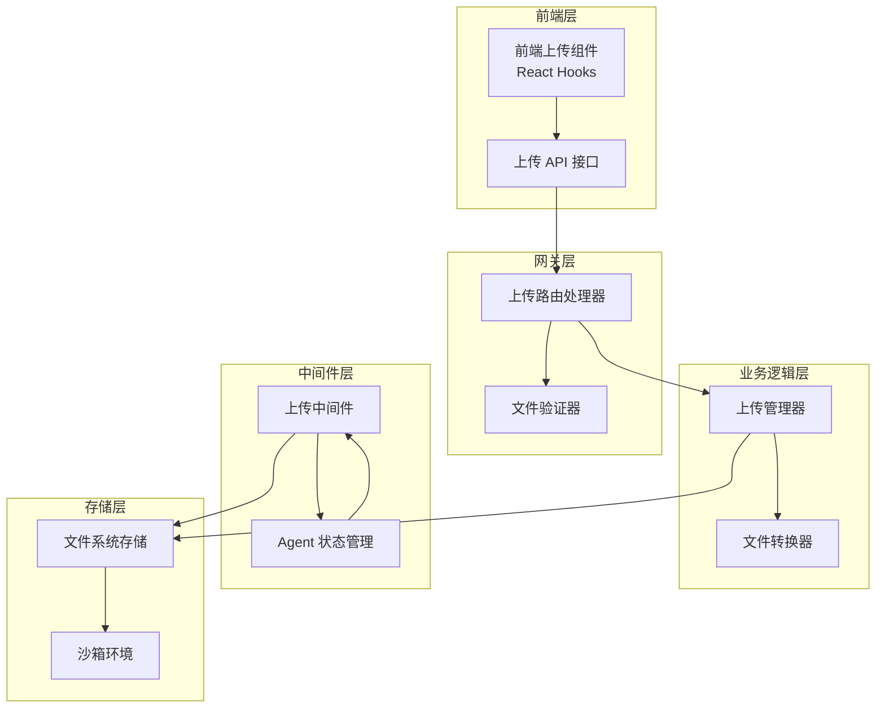
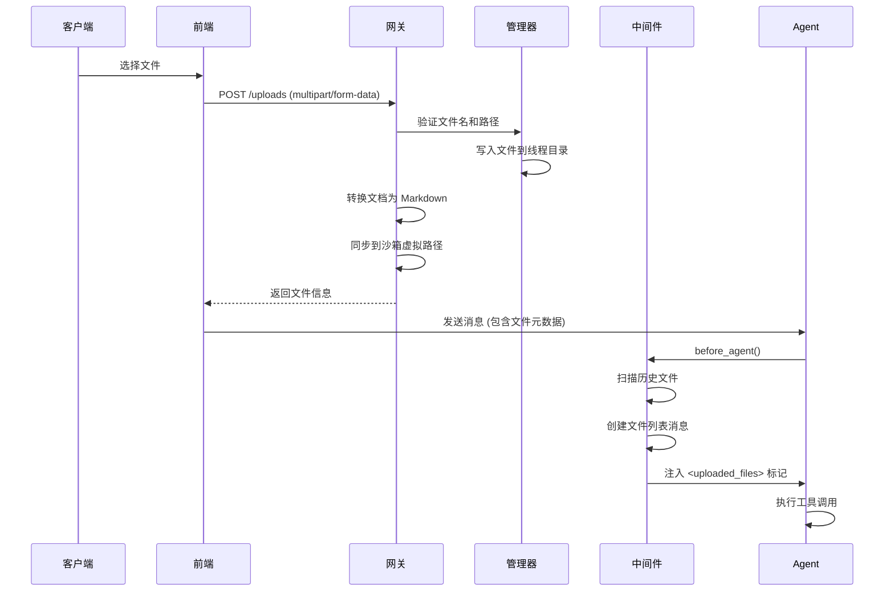
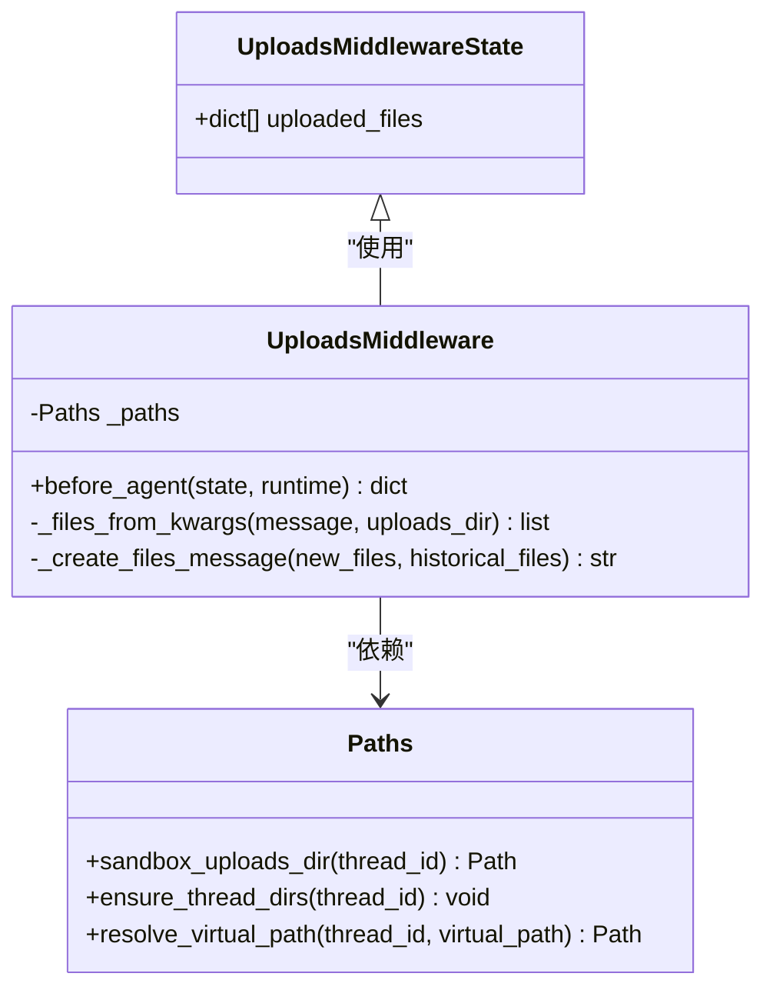
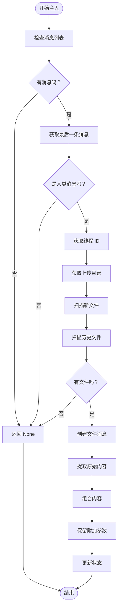
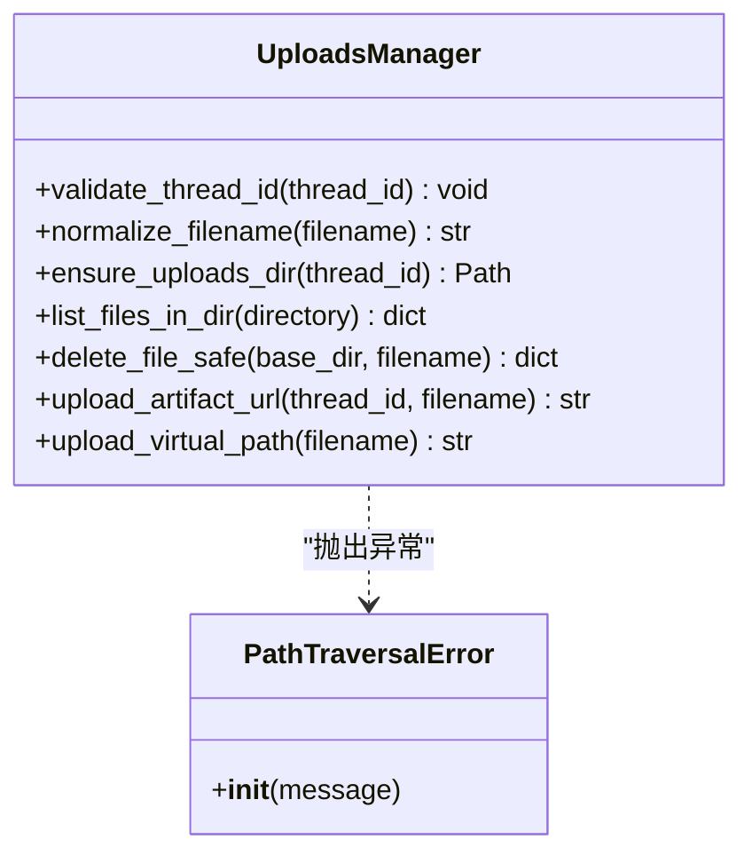
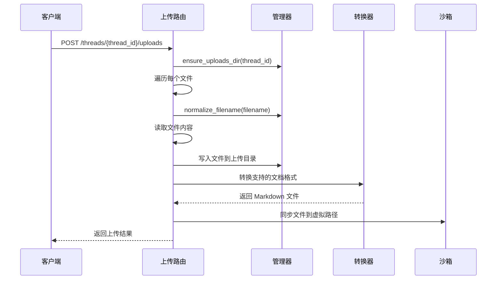
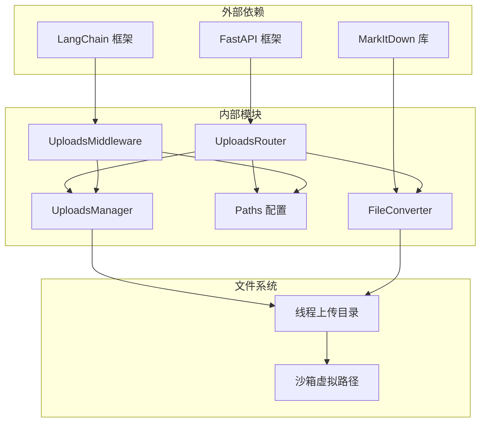

# 上传处理中间件

<cite>
**本文档引用的文件**
- [uploads_middleware.py](file://backend/packages/harness/deerflow/agents/middlewares/uploads_middleware.py)
- [manager.py](file://backend/packages/harness/deerflow/uploads/manager.py)
- [uploads.py](file://backend/app/gateway/routers/uploads.py)
- [paths.py](file://backend/packages/harness/deerflow/config/paths.py)
- [file_conversion.py](file://backend/packages/harness/deerflow/utils/file_conversion.py)
- [FILE_UPLOAD.md](file://backend/docs/FILE_UPLOAD.md)
- [test_uploads_middleware_core_logic.py](file://backend/tests/test_uploads_middleware_core_logic.py)
- [test_uploads_manager.py](file://backend/tests/test_uploads_manager.py)
- [api.ts](file://frontend/src/core/uploads/api.ts)
</cite>

## 目录
1. [简介](#简介)
2. [项目结构](#项目结构)
3. [核心组件](#核心组件)
4. [架构概览](#架构概览)
5. [详细组件分析](#详细组件分析)
6. [依赖关系分析](#依赖关系分析)
7. [性能考虑](#性能考虑)
8. [故障排除指南](#故障排除指南)
9. [结论](#结论)

## 简介

DeerFlow 的上传处理中间件是整个文件上传系统的核心组件，负责在对话流程中无缝集成文件上传功能。该中间件实现了智能的文件元数据注入机制，能够在 Agent 执行前自动检测并注入上传文件信息，同时提供完整的文件生命周期管理和安全控制。

该系统支持多文件上传、自动文档转换、历史文件追踪和虚拟路径映射等高级功能，为 AI Agent 提供了强大的文件处理能力。

## 项目结构

DeerFlow 的上传处理系统采用分层架构设计，主要包含以下几个关键层次：

**图表来源**
- [uploads_middleware.py:1-205](file://backend/packages/harness/deerflow/agents/middlewares/uploads_middleware.py#L1-L205)
- [uploads.py:1-147](file://backend/app/gateway/routers/uploads.py#L1-L147)
- [manager.py:1-202](file://backend/packages/harness/deerflow/uploads/manager.py#L1-L202)

**章节来源**
- [uploads_middleware.py:1-205](file://backend/packages/harness/deerflow/agents/middlewares/uploads_middleware.py#L1-L205)
- [uploads.py:1-147](file://backend/app/gateway/routers/uploads.py#L1-L147)
- [paths.py:1-243](file://backend/packages/harness/deerflow/config/paths.py#L1-L243)

## 核心组件

### 上传中间件 (UploadsMiddleware)

上传中间件是系统的核心组件，负责在 Agent 执行前自动注入文件上传信息。其主要职责包括：

- **文件元数据提取**：从人类消息的附加参数中提取上传文件信息
- **历史文件扫描**：扫描线程上传目录获取历史文件列表
- **上下文注入**：将格式化的文件信息注入到 Agent 的上下文中
- **状态管理**：维护 Agent 的上传文件状态

### 上传管理器 (UploadsManager)

上传管理器提供纯业务逻辑的上传处理功能：

- **路径管理**：管理线程隔离的上传目录结构
- **文件验证**：执行文件名安全检查和路径遍历防护
- **文件操作**：提供文件列表、删除等基础操作
- **虚拟路径映射**：生成 Agent 可用的虚拟路径

### 网关路由器 (UploadsRouter)

网关层负责处理 HTTP 请求和响应：

- **文件上传**：接收多文件上传请求
- **文档转换**：自动将支持的文档格式转换为 Markdown
- **沙箱同步**：在非本地沙箱环境中同步文件到虚拟路径
- **API 响应**：提供标准的 JSON 响应格式

**章节来源**
- [uploads_middleware.py:23-205](file://backend/packages/harness/deerflow/agents/middlewares/uploads_middleware.py#L23-L205)
- [manager.py:15-202](file://backend/packages/harness/deerflow/uploads/manager.py#L15-L202)
- [uploads.py:25-147](file://backend/app/gateway/routers/uploads.py#L25-L147)

## 架构概览

DeerFlow 的上传处理架构采用了分层设计，确保了系统的可扩展性和安全性：

**图表来源**
- [uploads_middleware.py:119-205](file://backend/packages/harness/deerflow/agents/middlewares/uploads_middleware.py#L119-L205)
- [uploads.py:36-111](file://backend/app/gateway/routers/uploads.py#L36-L111)

## 详细组件分析

### 上传中间件类结构

**图表来源**
- [uploads_middleware.py:17-41](file://backend/packages/harness/deerflow/agents/middlewares/uploads_middleware.py#L17-L41)
- [paths.py:118-124](file://backend/packages/harness/deerflow/config/paths.py#L118-L124)

#### 文件注入流程

上传中间件的核心工作流程如下：

**图表来源**
- [uploads_middleware.py:119-205](file://backend/packages/harness/deerflow/agents/middlewares/uploads_middleware.py#L119-L205)

#### 文件元数据提取机制

中间件通过以下方式提取文件元数据：

| 字段 | 类型 | 描述 | 示例 |
|------|------|------|------|
| filename | string | 文件名（仅保留基础名） | "document.pdf" |
| size | int | 文件大小（字节） | 1048576 |
| path | string | 虚拟路径（固定格式） | "/mnt/user-data/uploads/document.pdf" |
| extension | string | 文件扩展名 | ".pdf" |

**章节来源**
- [uploads_middleware.py:81-118](file://backend/packages/harness/deerflow/agents/middlewares/uploads_middleware.py#L81-L118)
- [uploads_middleware.py:152-170](file://backend/packages/harness/deerflow/agents/middlewares/uploads_middleware.py#L152-L170)

### 上传管理器功能

上传管理器提供了完整的文件管理功能：

**图表来源**
- [manager.py:23-44](file://backend/packages/harness/deerflow/uploads/manager.py#L23-L44)
- [manager.py:144-176](file://backend/packages/harness/deerflow/uploads/manager.py#L144-L176)

#### 文件安全验证

管理器实施了多层次的安全验证：

1. **线程 ID 验证**：确保线程 ID 只包含允许的字符
2. **文件名清理**：移除路径组件，防止目录遍历
3. **路径遍历检测**：验证文件路径不超出允许范围
4. **文件存在性检查**：确保文件在文件系统中存在

**章节来源**
- [manager.py:23-71](file://backend/packages/harness/deerflow/uploads/manager.py#L23-L71)
- [manager.py:99-109](file://backend/packages/harness/deerflow/uploads/manager.py#L99-L109)

### 网关上传处理

网关层负责处理 HTTP 层面的上传请求：

**图表来源**
- [uploads.py:36-111](file://backend/app/gateway/routers/uploads.py#L36-L111)

#### 支持的文档格式

系统自动转换以下文档格式为 Markdown：

| 格式 | 扩展名 | 转换后文件 |
|------|--------|------------|
| PDF | .pdf | document.md |
| PowerPoint | .ppt, .pptx | presentation.md |
| Excel | .xls, .xlsx | spreadsheet.md |
| Word | .doc, .docx | document.md |

**章节来源**
- [file_conversion.py:12-21](file://backend/packages/harness/deerflow/utils/file_conversion.py#L12-L21)
- [uploads.py:86-99](file://backend/app/gateway/routers/uploads.py#L86-L99)

## 依赖关系分析

### 组件依赖图

**图表来源**
- [uploads_middleware.py:12-14](file://backend/packages/harness/deerflow/agents/middlewares/uploads_middleware.py#L12-L14)
- [uploads.py:8-21](file://backend/app/gateway/routers/uploads.py#L8-L21)

### 关键依赖关系

1. **LangChain 集成**：中间件继承自 `AgentMiddleware`，确保与 Agent 框架的无缝集成
2. **FastAPI 路由**：网关层使用 FastAPI 处理 HTTP 请求，提供 RESTful API
3. **文件转换库**：依赖 `markitdown` 库进行文档格式转换
4. **路径管理**：通过 `Paths` 类统一管理文件系统路径

**章节来源**
- [uploads_middleware.py:7-14](file://backend/packages/harness/deerflow/agents/middlewares/uploads_middleware.py#L7-L14)
- [uploads.py:5-21](file://backend/app/gateway/routers/uploads.py#L5-L21)

## 性能考虑

### 存储优化策略

1. **异步文件读取**：网关层使用异步读取文件内容，避免阻塞
2. **增量文件扫描**：中间件只扫描必要的文件，减少 I/O 操作
3. **缓存机制**：历史文件信息在内存中缓存，避免重复扫描

### 内存管理

1. **流式处理**：大文件通过流式处理避免占用过多内存
2. **及时释放**：文件内容在转换完成后及时释放内存
3. **批量操作**：支持多文件同时处理，提高吞吐量

### 并发处理

1. **线程隔离**：每个线程拥有独立的上传目录，避免并发冲突
2. **文件锁机制**：在文件写入时使用适当的锁定机制
3. **资源池管理**：转换器使用连接池管理外部依赖

## 故障排除指南

### 常见问题及解决方案

#### 上传文件无法被 Agent 感知

**症状**：Agent 无法看到上传的文件

**可能原因**：
1. 上传中间件未正确注册
2. 线程 ID 不正确
3. 文件未成功写入上传目录

**解决步骤**：
1. 确认中间件已在 Agent 配置中注册
2. 验证线程 ID 格式是否正确
3. 检查上传目录是否存在且可写
4. 查看网关日志确认文件写入成功

#### 文件转换失败

**症状**：上传的文档无法转换为 Markdown

**可能原因**：
1. markitdown 库未正确安装
2. 文档格式不受支持
3. 文档已损坏或加密

**解决步骤**：
1. 验证 markitdown 库版本兼容性
2. 检查文档格式是否在支持列表中
3. 尝试手动转换验证文档完整性
4. 原始文件仍然会被保存，可手动处理

#### 路径遍历攻击防护

**症状**：文件上传被拒绝

**可能原因**：
1. 文件名包含非法字符
2. 路径中包含目录遍历组件
3. 线程 ID 包含不允许的字符

**解决步骤**：
1. 检查文件名是否只包含允许的字符
2. 移除路径组件，只保留文件名
3. 验证线程 ID 符合命名规则
4. 查看安全日志了解拒绝原因

**章节来源**
- [FILE_UPLOAD.md:232-253](file://backend/docs/FILE_UPLOAD.md#L232-L253)
- [uploads_middleware.py:105-108](file://backend/packages/harness/deerflow/agents/middlewares/uploads_middleware.py#L105-L108)

### 调试技巧

1. **启用详细日志**：在开发环境中启用 DEBUG 级别日志
2. **检查文件权限**：确保上传目录具有正确的权限设置
3. **验证沙箱同步**：确认非本地沙箱环境下的文件同步正常
4. **监控磁盘空间**：定期检查上传目录的磁盘使用情况

## 结论

DeerFlow 的上传处理中间件提供了一个完整、安全且高效的文件上传解决方案。通过精心设计的架构和严格的安全措施，该系统能够：

- **无缝集成**：与 Agent 框架深度集成，提供透明的文件处理体验
- **安全保障**：实施多层安全防护，防止路径遍历和恶意文件上传
- **功能丰富**：支持多文件上传、自动文档转换和历史文件追踪
- **易于扩展**：模块化设计便于功能扩展和定制

该中间件的设计充分考虑了生产环境的需求，提供了可靠的性能表现和良好的用户体验。通过合理的配置和监控，可以确保系统在各种使用场景下都能稳定运行。