# 中间件系统

<cite>
**本文引用的文件**
- [memory_middleware.py](file://backend/packages/harness/deerflow/agents/middlewares/memory_middleware.py)
- [tool_error_handling_middleware.py](file://backend/packages/harness/deerflow/agents/middlewares/tool_error_handling_middleware.py)
- [loop_detection_middleware.py](file://backend/packages/harness/deerflow/agents/middlewares/loop_detection_middleware.py)
- [uploads_middleware.py](file://backend/packages/harness/deerflow/agents/middlewares/uploads_middleware.py)
- [thread_data_middleware.py](file://backend/packages/harness/deerflow/agents/middlewares/thread_data_middleware.py)
- [dangling_tool_call_middleware.py](file://backend/packages/harness/deerflow/agents/middlewares/dangling_tool_call_middleware.py)
- [subagent_limit_middleware.py](file://backend/packages/harness/deerflow/agents/middlewares/subagent_limit_middleware.py)
- [title_middleware.py](file://backend/packages/harness/deerflow/agents/middlewares/title_middleware.py)
- [todo_middleware.py](file://backend/packages/harness/deerflow/agents/middlewares/todo_middleware.py)
- [token_usage_middleware.py](file://backend/packages/harness/deerflow/agents/middlewares/token_usage_middleware.py)
- [memory_config.py](file://backend/packages/harness/deerflow/config/memory_config.py)
- [guardrails_config.py](file://backend/packages/harness/deerflow/config/guardrails_config.py)
- [title_config.py](file://backend/packages/harness/deerflow/config/title_config.py)
- [__init__.py](file://backend/packages/harness/deerflow/agents/__init__.py)
</cite>

## 目录
1. [简介](#简介)
2. [项目结构](#项目结构)
3. [核心组件](#核心组件)
4. [架构总览](#架构总览)
5. [详细组件分析](#详细组件分析)
6. [依赖分析](#依赖分析)
7. [性能考虑](#性能考虑)
8. [故障排查指南](#故障排查指南)
9. [结论](#结论)
10. [附录](#附录)

## 简介
本文件面向 DeerFlow 的中间件系统，系统性阐述中间件的架构设计原则、执行顺序与数据流转机制，并对内存中间件、工具错误处理中间件、循环检测中间件、上传处理中间件等内置中间件进行功能说明与配置要点解析。同时提供中间件链调试技巧、性能优化建议以及与系统其他组件（线程状态、沙箱路径、守卫护栏、标题生成等）的集成关系说明，帮助开发者快速理解与扩展中间件体系。

## 项目结构
中间件位于后端 harness 包下的 agents/middlewares 目录中，围绕 AgentState 生命周期钩子组织，按职责划分为：
- 执行前/后阶段：before_agent、after_agent、before_model、after_model、wrap_model_call、awrap_model_call、abefore_model、aafter_model 等
- 状态模式：通过 state_schema 定义中间件期望的状态字段，确保链式调用时的数据一致性
- 配置驱动：通过独立配置模块（如 memory_config、guardrails_config、title_config）控制行为开关与参数

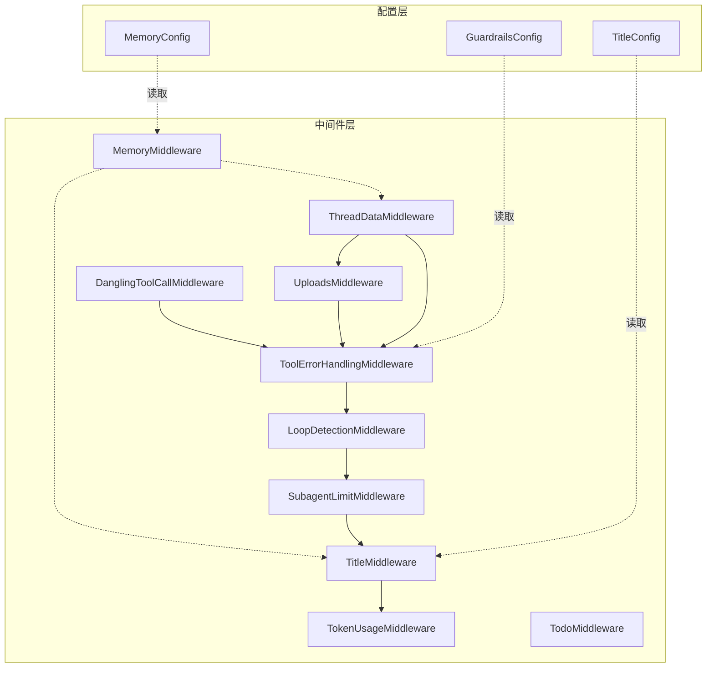

图表来源
- [thread_data_middleware.py:18-97](file://backend/packages/harness/deerflow/agents/middlewares/thread_data_middleware.py#L18-L97)
- [uploads_middleware.py:23-205](file://backend/packages/harness/deerflow/agents/middlewares/uploads_middleware.py#L23-L205)
- [dangling_tool_call_middleware.py:28-111](file://backend/packages/harness/deerflow/agents/middlewares/dangling_tool_call_middleware.py#L28-L111)
- [tool_error_handling_middleware.py:19-138](file://backend/packages/harness/deerflow/agents/middlewares/tool_error_handling_middleware.py#L19-L138)
- [loop_detection_middleware.py:69-228](file://backend/packages/harness/deerflow/agents/middlewares/loop_detection_middleware.py#L69-L228)
- [subagent_limit_middleware.py:24-76](file://backend/packages/harness/deerflow/agents/middlewares/subagent_limit_middleware.py#L24-L76)
- [title_middleware.py:22-150](file://backend/packages/harness/deerflow/agents/middlewares/title_middleware.py#L22-L150)
- [token_usage_middleware.py:13-38](file://backend/packages/harness/deerflow/agents/middlewares/token_usage_middleware.py#L13-L38)
- [memory_middleware.py:86-150](file://backend/packages/harness/deerflow/agents/middlewares/memory_middleware.py#L86-L150)
- [todo_middleware.py:47-101](file://backend/packages/harness/deerflow/agents/middlewares/todo_middleware.py#L47-L101)
- [memory_config.py:6-79](file://backend/packages/harness/deerflow/config/memory_config.py#L6-L79)
- [guardrails_config.py:13-49](file://backend/packages/harness/deerflow/config/guardrails_config.py#L13-L49)
- [title_config.py:6-54](file://backend/packages/harness/deerflow/config/title_config.py#L6-L54)

章节来源
- [__init__.py:1-6](file://backend/packages/harness/deerflow/agents/__init__.py#L1-L6)

## 核心组件
- 线程数据中间件（ThreadDataMiddleware）
  - 职责：在每次会话开始前，根据 thread_id 创建/解析线程专用目录（工作区、上传区、输出区），支持惰性/急切初始化策略
  - 关键点：从运行时上下文或可配置项提取 thread_id；通过 Paths 抽象统一路径管理
- 上传处理中间件（UploadsMiddleware）
  - 职责：将当前轮次上传的文件元数据注入到人类消息内容前，形成 <uploaded_files> 上下文块；同时扫描历史上传文件，构建完整可用文件清单
  - 关键点：过滤非法/不存在文件；保留原始 additional_kwargs 以便前端读取；更新消息内容并返回 uploaded_files 列表
- 工具错误处理中间件（ToolErrorHandlingMiddleware）
  - 览责：捕获工具执行异常，转换为 ToolMessage 并携带错误详情，使流程继续；保留 LangGraph 控制信号（中断/暂停/恢复）
  - 关键点：同步/异步包装工具调用；构造标准化错误消息；可选注入守卫护栏中间件
- 循环检测中间件（LoopDetectionMiddleware）
  - 职责：基于工具调用集合的哈希值滑动窗口统计，达到阈值时注入“重复警告”或强制清空 tool_calls 强制文本回复
  - 关键点：多线程安全（LRU 历史+互斥锁）；可配置阈值与窗口大小；避免 Anthropic 多系统消息限制
- 子代理并发限制中间件（SubagentLimitMiddleware）
  - 职责：限制单次模型响应中 task 工具调用的数量，防止过度并行导致资源压力
  - 关键点：对 AIMessage 的 tool_calls 进行截断；日志提示丢弃数量
- 标题生成中间件（TitleMiddleware）
  - 职责：在首次完整对话后自动生成标题；支持配置最大词数、字符数、模型与提示模板
  - 关键点：解析多形态消息内容；失败回退至用户首句摘要
- 待办提醒中间件（TodoMiddleware）
  - 职责：当 write_todos 工具调用被截断出上下文窗口时，注入提醒消息以维持计划意识
  - 关键点：识别上下文中是否仍可见 write_todos；避免重复注入
- 令牌用量中间件（TokenUsageMiddleware）
  - 职责：从模型响应的 usage_metadata 中提取输入/输出/总计令牌并记录日志
- 内存中间件（MemoryMiddleware）
  - 职责：在每次 Agent 执行后，将筛选后的对话片段入队，经去抖合并后异步汇总更新记忆
  - 关键点：仅保留用户输入与最终 AI 回复；过滤上传注入块；基于线程 ID 入队

章节来源
- [thread_data_middleware.py:18-97](file://backend/packages/harness/deerflow/agents/middlewares/thread_data_middleware.py#L18-L97)
- [uploads_middleware.py:23-205](file://backend/packages/harness/deerflow/agents/middlewares/uploads_middleware.py#L23-L205)
- [tool_error_handling_middleware.py:19-138](file://backend/packages/harness/deerflow/agents/middlewares/tool_error_handling_middleware.py#L19-L138)
- [loop_detection_middleware.py:69-228](file://backend/packages/harness/deerflow/agents/middlewares/loop_detection_middleware.py#L69-L228)
- [subagent_limit_middleware.py:24-76](file://backend/packages/harness/deerflow/agents/middlewares/subagent_limit_middleware.py#L24-L76)
- [title_middleware.py:22-150](file://backend/packages/harness/deerflow/agents/middlewares/title_middleware.py#L22-L150)
- [todo_middleware.py:47-101](file://backend/packages/harness/deerflow/agents/middlewares/todo_middleware.py#L47-L101)
- [token_usage_middleware.py:13-38](file://backend/packages/harness/deerflow/agents/middlewares/token_usage_middleware.py#L13-L38)
- [memory_middleware.py:86-150](file://backend/packages/harness/deerflow/agents/middlewares/memory_middleware.py#L86-L150)

## 架构总览
中间件遵循 LangGraph AgentMiddleware 接口，在 Agent 执行生命周期内按序插入，形成“链式处理”。典型顺序如下：
- 执行前：ThreadDataMiddleware → UploadsMiddleware（可选）→ DanglingToolCallMiddleware（可选）→ 守卫护栏中间件（可选）→ ToolErrorHandlingMiddleware
- 模型调用：wrap_model_call/awrap_model_call（用于在正确位置插入占位 ToolMessage）
- 模型后：LoopDetectionMiddleware → SubagentLimitMiddleware → TitleMiddleware → TokenUsageMiddleware → MemoryMiddleware
- 执行后：（可选）TodoMiddleware（扩展 TodoListMiddleware）

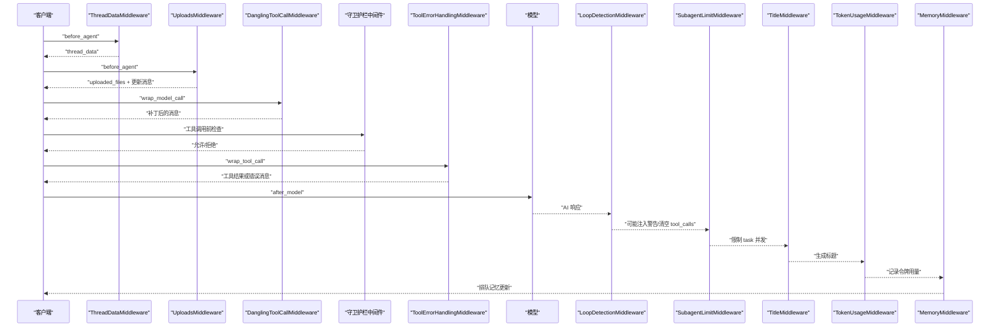

图表来源
- [thread_data_middleware.py:73-97](file://backend/packages/harness/deerflow/agents/middlewares/thread_data_middleware.py#L73-L97)
- [uploads_middleware.py:119-205](file://backend/packages/harness/deerflow/agents/middlewares/uploads_middleware.py#L119-L205)
- [dangling_tool_call_middleware.py:90-111](file://backend/packages/harness/deerflow/agents/middlewares/dangling_tool_call_middleware.py#L90-L111)
- [tool_error_handling_middleware.py:37-118](file://backend/packages/harness/deerflow/agents/middlewares/tool_error_handling_middleware.py#L37-L118)
- [loop_detection_middleware.py:211-218](file://backend/packages/harness/deerflow/agents/middlewares/loop_detection_middleware.py#L211-L218)
- [subagent_limit_middleware.py:69-76](file://backend/packages/harness/deerflow/agents/middlewares/subagent_limit_middleware.py#L69-L76)
- [title_middleware.py:143-150](file://backend/packages/harness/deerflow/agents/middlewares/title_middleware.py#L143-L150)
- [token_usage_middleware.py:16-38](file://backend/packages/harness/deerflow/agents/middlewares/token_usage_middleware.py#L16-L38)
- [memory_middleware.py:107-150](file://backend/packages/harness/deerflow/agents/middlewares/memory_middleware.py#L107-L150)

## 详细组件分析

### 线程数据中间件（ThreadDataMiddleware）
- 设计要点
  - 通过 state_schema 注入 thread_data 字段，包含工作区、上传区、输出区路径
  - 支持 lazy_init：仅计算路径不创建目录；或 eager：在 before_agent 中创建目录
  - 从 runtime.context 或 LangGraph 可配置项中提取 thread_id，缺失则抛错
- 数据流
  - 输入：AgentState（含 messages）、Runtime（含 thread_id）
  - 输出：更新后的 AgentState（新增 thread_data 字段）
- 性能与可靠性
  - 惰性初始化减少 IO 开销；必要时在需要写入时再创建目录
  - 路径解析统一由 Paths 提供，避免硬编码

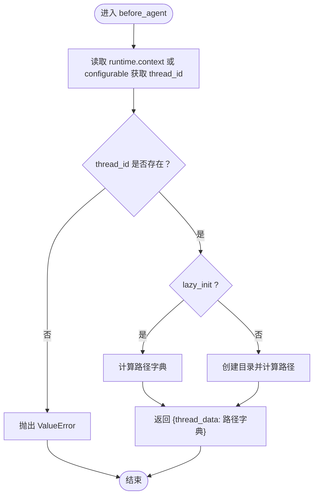

图表来源
- [thread_data_middleware.py:73-97](file://backend/packages/harness/deerflow/agents/middlewares/thread_data_middleware.py#L73-L97)

章节来源
- [thread_data_middleware.py:18-97](file://backend/packages/harness/deerflow/agents/middlewares/thread_data_middleware.py#L18-L97)

### 上传处理中间件（UploadsMiddleware）
- 设计要点
  - 从当前人类消息的 additional_kwargs.files 提取新上传文件元数据
  - 扫描线程上传目录，收集历史可用文件，排除本次新文件
  - 将 <uploaded_files> 块拼接至人类消息内容前，保留原始 additional_kwargs
- 数据流
  - 输入：AgentState（含 messages）、Runtime（含 thread_id）
  - 输出：更新后的 messages（最后一条人类消息内容前添加上传清单）与 uploaded_files 列表
- 安全与健壮性
  - 校验文件名合法性与物理存在性（可选）
  - 对空列表进行短路返回，避免无效更新

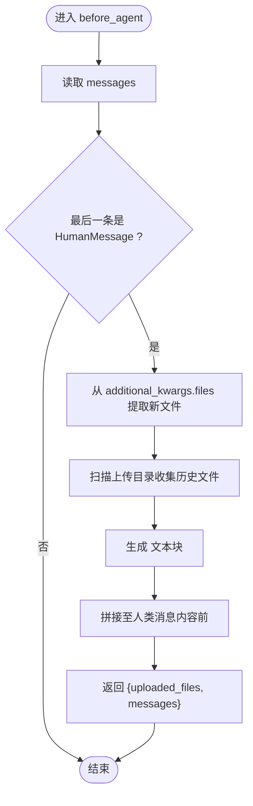

图表来源
- [uploads_middleware.py:119-205](file://backend/packages/harness/deerflow/agents/middlewares/uploads_middleware.py#L119-L205)

章节来源
- [uploads_middleware.py:23-205](file://backend/packages/harness/deerflow/agents/middlewares/uploads_middleware.py#L23-L205)

### 工具错误处理中间件（ToolErrorHandlingMiddleware）
- 设计要点
  - 同步/异步包装工具调用，捕获异常并转换为 ToolMessage
  - 保留 GraphBubbleUp 以传递中断/暂停/恢复等控制信号
  - 可按需注入守卫护栏中间件（GuardrailMiddleware），实现工具调用前授权
- 构建运行时中间件链
  - 提供 build_lead_runtime_middlewares 与 build_subagent_runtime_middlewares 两类工厂方法
  - 可选择性插入 UploadsMiddleware 与 DanglingToolCallMiddleware

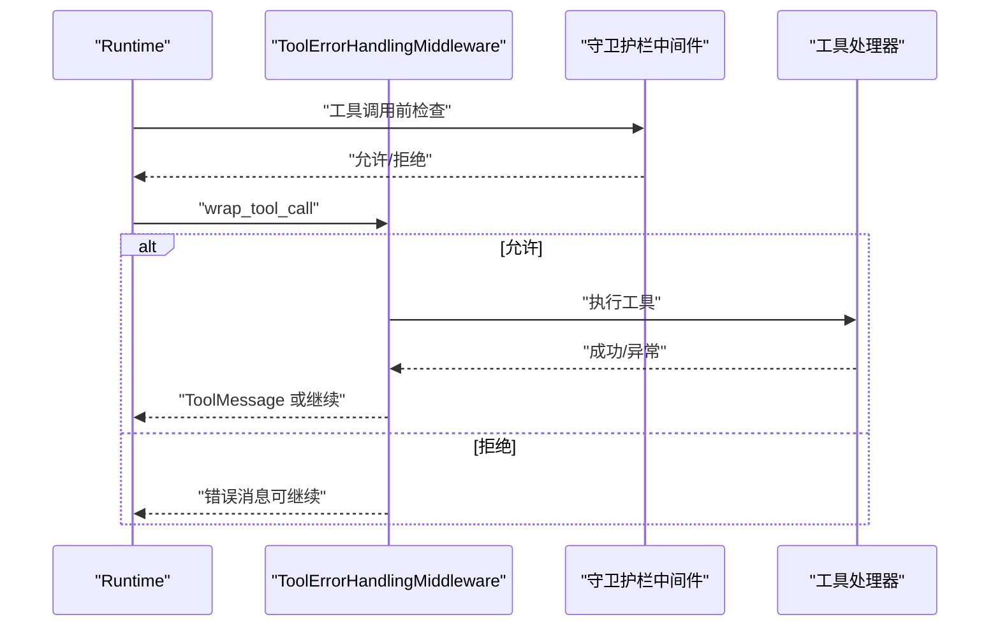

图表来源
- [tool_error_handling_middleware.py:37-118](file://backend/packages/harness/deerflow/agents/middlewares/tool_error_handling_middleware.py#L37-L118)

章节来源
- [tool_error_handling_middleware.py:19-138](file://backend/packages/harness/deerflow/agents/middlewares/tool_error_handling_middleware.py#L19-L138)
- [guardrails_config.py:13-49](file://backend/packages/harness/deerflow/config/guardrails_config.py#L13-L49)

### 循环检测中间件（LoopDetectionMiddleware）
- 设计要点
  - 对 AIMessage 的 tool_calls 进行规范化哈希（名称+参数排序序列化），滑动窗口统计出现次数
  - 达到警告阈值时注入“重复警告”消息；达到硬上限时清空 tool_calls 并强制文本回复
  - 多线程安全：每个 thread_id 维护独立历史与 LRU 驱逐
- 参数与行为
  - 可配置：warn_threshold、hard_limit、window_size、max_tracked_threads
  - 采用 HumanMessage 注入以兼容不同模型提供商的消息格式要求

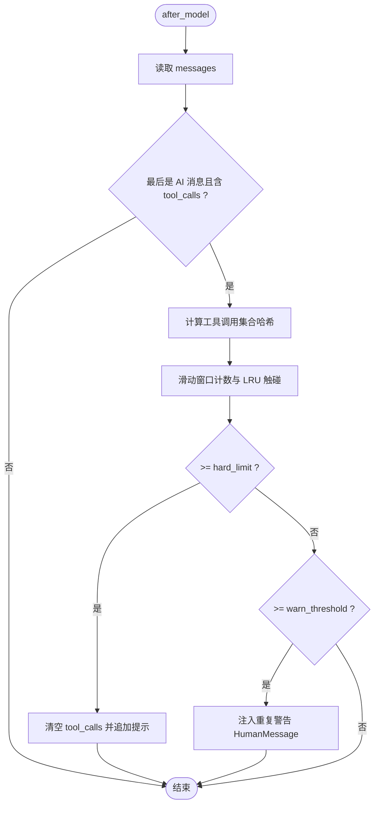

图表来源
- [loop_detection_middleware.py:185-218](file://backend/packages/harness/deerflow/agents/middlewares/loop_detection_middleware.py#L185-L218)

章节来源
- [loop_detection_middleware.py:69-228](file://backend/packages/harness/deerflow/agents/middlewares/loop_detection_middleware.py#L69-L228)

### 子代理并发限制中间件（SubagentLimitMiddleware）
- 设计要点
  - 仅对名为 “task” 的工具调用进行计数与截断
  - 保留前 N 个 task 调用，其余丢弃并记录日志
- 参数与行为
  - 默认上限来自 MAX_CONCURRENT_SUBAGENTS，范围限定在 [2, 4]

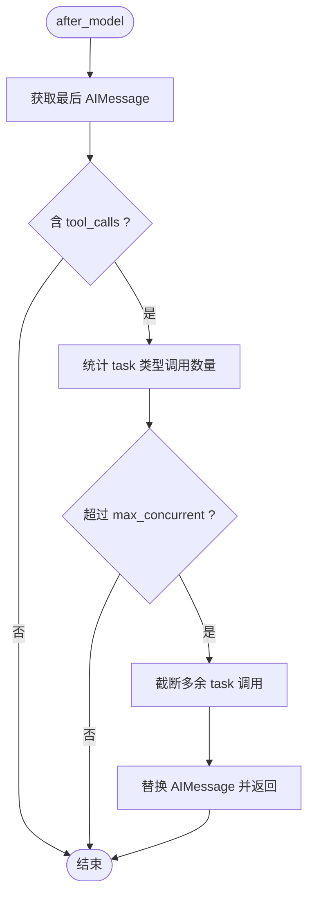

图表来源
- [subagent_limit_middleware.py:40-76](file://backend/packages/harness/deerflow/agents/middlewares/subagent_limit_middleware.py#L40-L76)

章节来源
- [subagent_limit_middleware.py:24-76](file://backend/packages/harness/deerflow/agents/middlewares/subagent_limit_middleware.py#L24-L76)

### 标题生成中间件（TitleMiddleware）
- 设计要点
  - 在首次完整对话（1 个用户消息 + ≥1 个助手回复）后生成标题
  - 使用配置化的模型与提示模板，解析模型输出并做长度裁剪
  - 失败时回退至用户首句摘要
- 参数与行为
  - 可配置：enabled、max_words、max_chars、model_name、prompt_template

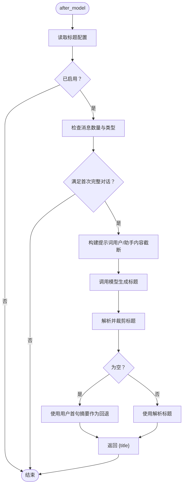

图表来源
- [title_middleware.py:103-150](file://backend/packages/harness/deerflow/agents/middlewares/title_middleware.py#L103-L150)
- [title_config.py:6-54](file://backend/packages/harness/deerflow/config/title_config.py#L6-L54)

章节来源
- [title_middleware.py:22-150](file://backend/packages/harness/deerflow/agents/middlewares/title_middleware.py#L22-L150)
- [title_config.py:6-54](file://backend/packages/harness/deerflow/config/title_config.py#L6-L54)

### 待办提醒中间件（TodoMiddleware）
- 设计要点
  - 当 write_todos 工具调用被截断出上下文窗口时，注入 todo_reminder 人类消息以维持计划意识
  - 避免重复注入：若已存在提醒消息则不再注入
- 行为
  - before_model/abefore_model 中检测并注入提醒

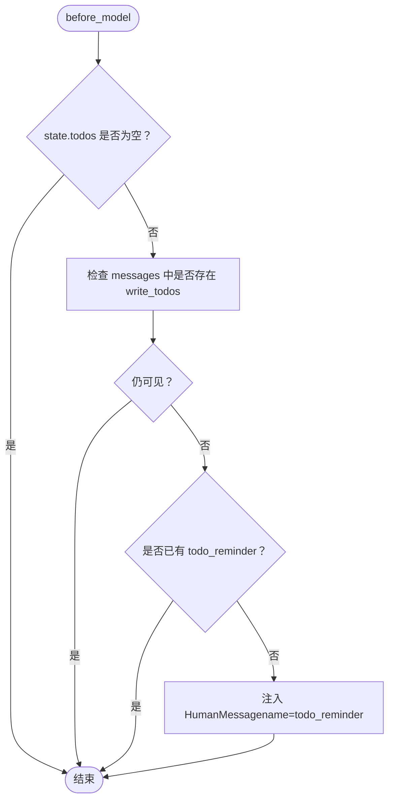

图表来源
- [todo_middleware.py:56-101](file://backend/packages/harness/deerflow/agents/middlewares/todo_middleware.py#L56-L101)

章节来源
- [todo_middleware.py:47-101](file://backend/packages/harness/deerflow/agents/middlewares/todo_middleware.py#L47-L101)

### 令牌用量中间件（TokenUsageMiddleware）
- 设计要点
  - 从最后一条消息的 usage_metadata 中提取 input_tokens、output_tokens、total_tokens 并记录日志
- 行为
  - after_model/aafter_model 中执行

章节来源
- [token_usage_middleware.py:13-38](file://backend/packages/harness/deerflow/agents/middlewares/token_usage_middleware.py#L13-L38)

### 内存中间件（MemoryMiddleware）
- 设计要点
  - after_agent 后将对话片段入队，经去抖合并后异步汇总更新记忆
  - 仅保留用户输入与最终 AI 回复，过滤工具消息与上传注入块
  - 基于线程 ID 分组，支持按 agent_name 维度存储
- 配置与行为
  - 依赖 MemoryConfig：enabled、debounce_seconds、storage_path、max_facts、injection_enabled、max_injection_tokens 等

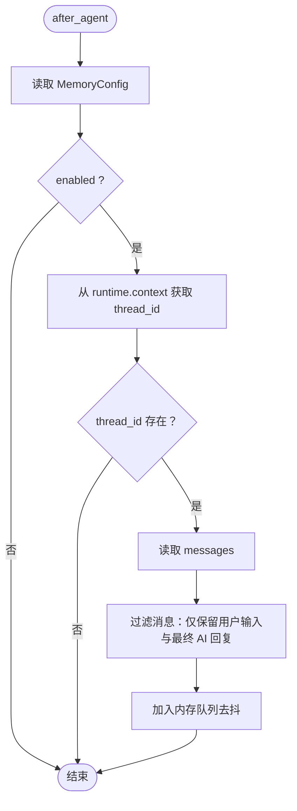

图表来源
- [memory_middleware.py:107-150](file://backend/packages/harness/deerflow/agents/middlewares/memory_middleware.py#L107-L150)
- [memory_config.py:6-79](file://backend/packages/harness/deerflow/config/memory_config.py#L6-L79)

章节来源
- [memory_middleware.py:86-150](file://backend/packages/harness/deerflow/agents/middlewares/memory_middleware.py#L86-L150)
- [memory_config.py:6-79](file://backend/packages/harness/deerflow/config/memory_config.py#L6-L79)

## 依赖分析
- 组件耦合
  - 中间件之间通过 AgentState 与 Runtime 解耦，仅依赖约定的钩子接口
  - ThreadDataMiddleware 与路径系统（Paths）耦合，负责目录生命周期管理
  - MemoryMiddleware 与 MemoryConfig、队列与异步任务耦合
  - TitleMiddleware 与模型工厂、TitleConfig 耦合
  - ToolErrorHandlingMiddleware 与守卫护栏配置耦合
- 外部依赖
  - LangChain/LangGraph 的 AgentMiddleware 接口与消息类型
  - Python 标准库（json、hashlib、threading）与第三方库（logging）

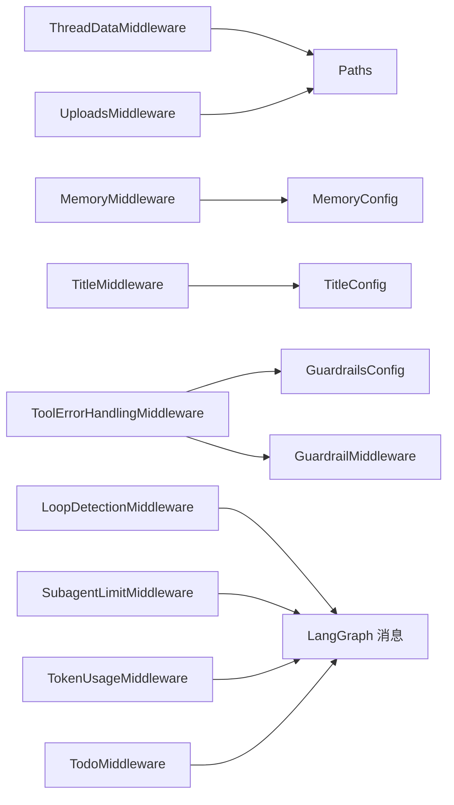

图表来源
- [thread_data_middleware.py:43-97](file://backend/packages/harness/deerflow/agents/middlewares/thread_data_middleware.py#L43-L97)
- [uploads_middleware.py:40-205](file://backend/packages/harness/deerflow/agents/middlewares/uploads_middleware.py#L40-L205)
- [memory_middleware.py:118-150](file://backend/packages/harness/deerflow/agents/middlewares/memory_middleware.py#L118-L150)
- [title_middleware.py:109-150](file://backend/packages/harness/deerflow/agents/middlewares/title_middleware.py#L109-L150)
- [tool_error_handling_middleware.py:94-118](file://backend/packages/harness/deerflow/agents/middlewares/tool_error_handling_middleware.py#L94-L118)
- [guardrails_config.py:13-49](file://backend/packages/harness/deerflow/config/guardrails_config.py#L13-L49)
- [memory_config.py:6-79](file://backend/packages/harness/deerflow/config/memory_config.py#L6-L79)
- [title_config.py:6-54](file://backend/packages/harness/deerflow/config/title_config.py#L6-L54)

章节来源
- [thread_data_middleware.py:18-97](file://backend/packages/harness/deerflow/agents/middlewares/thread_data_middleware.py#L18-L97)
- [uploads_middleware.py:23-205](file://backend/packages/harness/deerflow/agents/middlewares/uploads_middleware.py#L23-L205)
- [memory_middleware.py:86-150](file://backend/packages/harness/deerflow/agents/middlewares/memory_middleware.py#L86-L150)
- [title_middleware.py:22-150](file://backend/packages/harness/deerflow/agents/middlewares/title_middleware.py#L22-L150)
- [tool_error_handling_middleware.py:19-138](file://backend/packages/harness/deerflow/agents/middlewares/tool_error_handling_middleware.py#L19-L138)
- [guardrails_config.py:13-49](file://backend/packages/harness/deerflow/config/guardrails_config.py#L13-L49)
- [memory_config.py:6-79](file://backend/packages/harness/deerflow/config/memory_config.py#L6-L79)
- [title_config.py:6-54](file://backend/packages/harness/deerflow/config/title_config.py#L6-L54)

## 性能考虑
- 惰性初始化
  - ThreadDataMiddleware 默认惰性初始化，减少不必要的磁盘 IO；在需要写入时再创建目录
- 去抖与批处理
  - MemoryMiddleware 通过去抖队列合并多次更新，降低频繁写入与 LLM 调用成本
- 滑动窗口与 LRU
  - LoopDetectionMiddleware 使用固定窗口与 LRU 驱逐，控制跟踪状态规模，避免内存膨胀
- 并发限制
  - SubagentLimitMiddleware 限制 task 并发数量，避免资源争用与超时
- 日志与可观测性
  - TokenUsageMiddleware 记录令牌用量，便于成本与性能监控
- 配置优化
  - 合理设置 MemoryConfig.debounce_seconds、TitleConfig.max_words/chars、LoopDetectionMiddleware 的阈值与窗口大小

## 故障排查指南
- 无法生成标题
  - 检查 TitleConfig.enabled 与 prompt 模板；确认首次完整对话条件满足；查看模型调用异常日志
- 上传文件未生效
  - 确认 UploadsMiddleware 是否在链中；检查 additional_kwargs.files 是否存在且文件名合法；验证上传目录是否存在
- 工具调用异常导致中断
  - 查看 ToolErrorHandlingMiddleware 的日志；确认 GraphBubbleUp 是否被正确传播；检查守卫护栏配置
- 重复工具调用导致卡死
  - 检查 LoopDetectionMiddleware 的 warn_threshold 与 hard_limit；确认注入的警告消息是否被模型接受
- 子代理过多导致超时
  - 调整 SubagentLimitMiddleware 的 max_concurrent；观察日志中的丢弃数量
- 令牌用量异常
  - 检查 TokenUsageMiddleware 的日志输出；核对模型响应的 usage_metadata 字段
- 记忆未更新
  - 确认 MemoryConfig.enabled；检查线程 ID 是否存在；查看 MemoryMiddleware 的过滤逻辑与队列入队情况

章节来源
- [title_middleware.py:103-150](file://backend/packages/harness/deerflow/agents/middlewares/title_middleware.py#L103-L150)
- [uploads_middleware.py:119-205](file://backend/packages/harness/deerflow/agents/middlewares/uploads_middleware.py#L119-L205)
- [tool_error_handling_middleware.py:37-118](file://backend/packages/harness/deerflow/agents/middlewares/tool_error_handling_middleware.py#L37-L118)
- [loop_detection_middleware.py:185-218](file://backend/packages/harness/deerflow/agents/middlewares/loop_detection_middleware.py#L185-L218)
- [subagent_limit_middleware.py:40-76](file://backend/packages/harness/deerflow/agents/middlewares/subagent_limit_middleware.py#L40-L76)
- [token_usage_middleware.py:16-38](file://backend/packages/harness/deerflow/agents/middlewares/token_usage_middleware.py#L16-L38)
- [memory_middleware.py:107-150](file://backend/packages/harness/deerflow/agents/middlewares/memory_middleware.py#L107-L150)

## 结论
DeerFlow 中间件系统以 AgentState 生命周期钩子为核心，围绕“执行前/后、模型前后、模型调用前后”等关键节点构建了高内聚、低耦合的处理链。通过配置驱动与状态模式，系统实现了可插拔、可扩展的中间件生态。内置中间件覆盖了上传上下文注入、工具错误恢复、循环防护、并发限制、标题生成、待办提醒、令牌统计与记忆更新等关键能力。结合合理的配置与调试手段，可在保证稳定性的同时获得良好的性能表现。

## 附录
- 自定义中间件开发指南
  - 继承 AgentMiddleware 并实现所需钩子（如 before_agent、after_model、wrap_model_call 等）
  - 定义 state_schema 以声明中间件期望的状态字段
  - 通过 Runtime.context 获取 thread_id 等上下文信息
  - 在链中合理排序：上传/线程数据靠前，错误处理/守卫护栏靠前，循环检测/并发限制靠后，标题/令牌/记忆靠末尾
  - 注意保持幂等与可重入性，避免副作用累积
- 配置项速查
  - 内存配置（MemoryConfig）：enabled、storage_path、debounce_seconds、model_name、max_facts、fact_confidence_threshold、injection_enabled、max_injection_tokens
  - 守卫护栏配置（GuardrailsConfig）：enabled、fail_closed、passport、provider.use、provider.config
  - 标题配置（TitleConfig）：enabled、max_words、max_chars、model_name、prompt_template

章节来源
- [memory_config.py:6-79](file://backend/packages/harness/deerflow/config/memory_config.py#L6-L79)
- [guardrails_config.py:13-49](file://backend/packages/harness/deerflow/config/guardrails_config.py#L13-L49)
- [title_config.py:6-54](file://backend/packages/harness/deerflow/config/title_config.py#L6-L54)