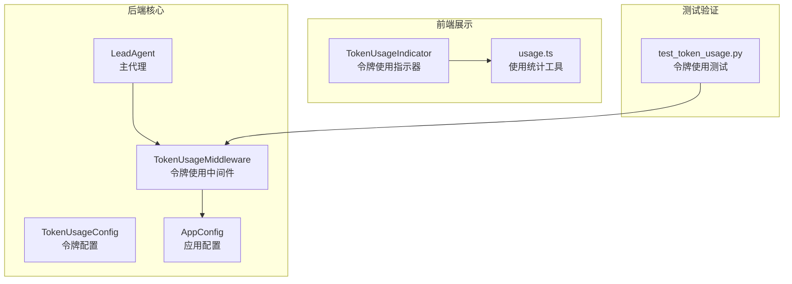
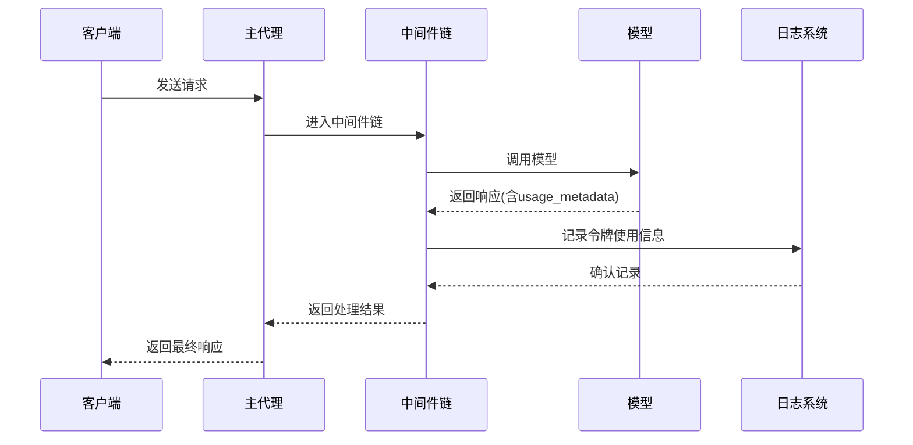
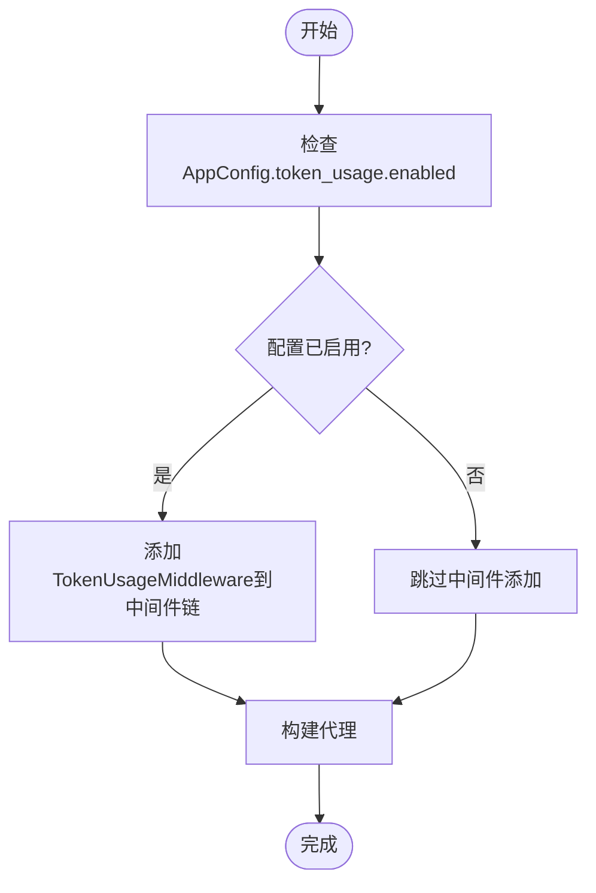
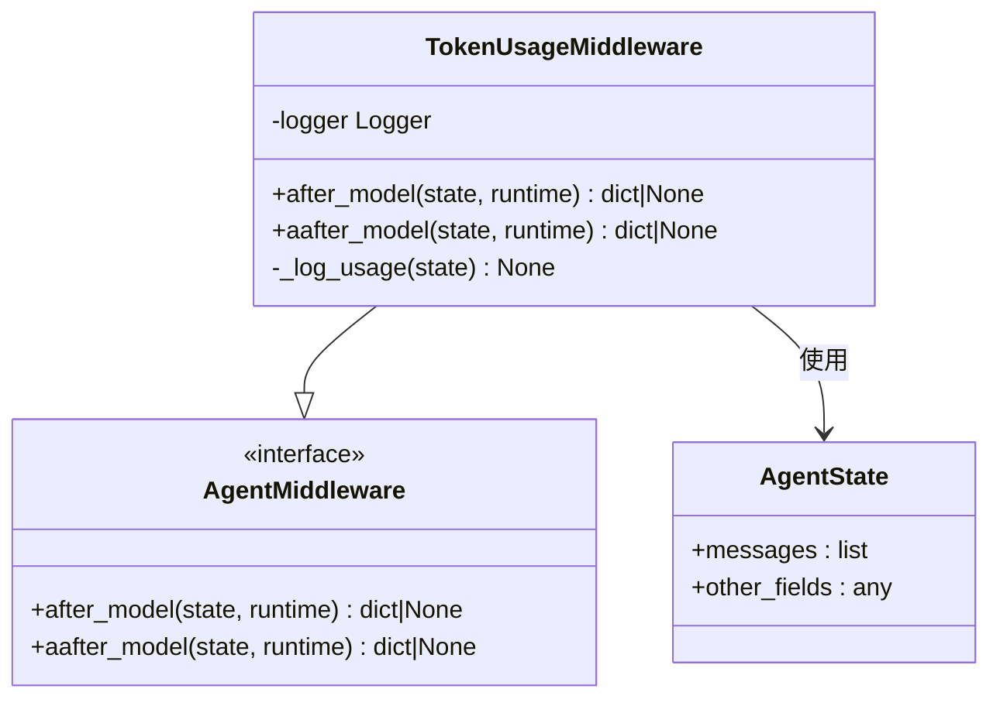
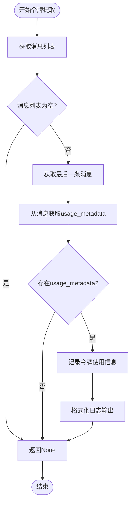
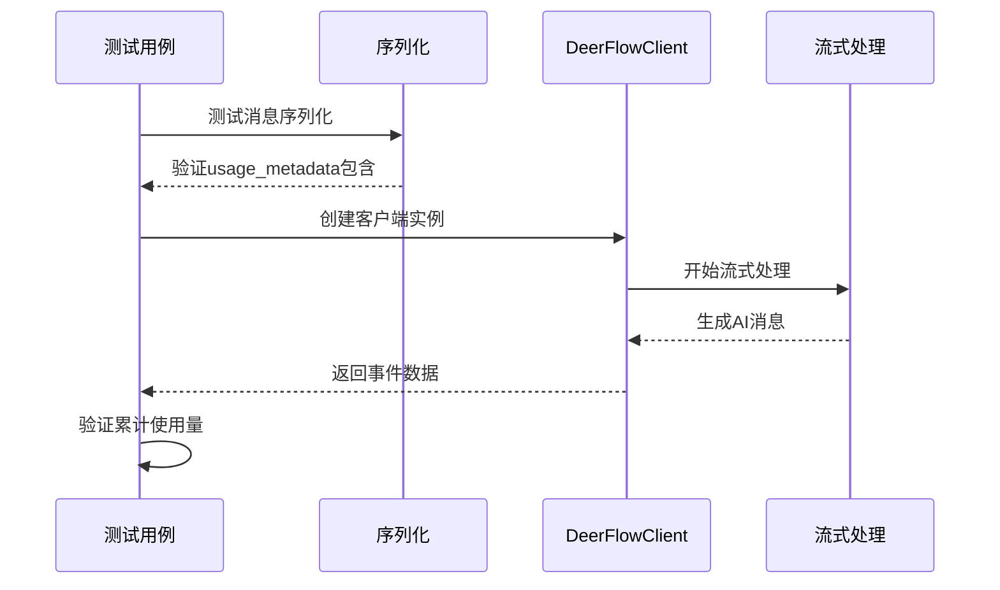
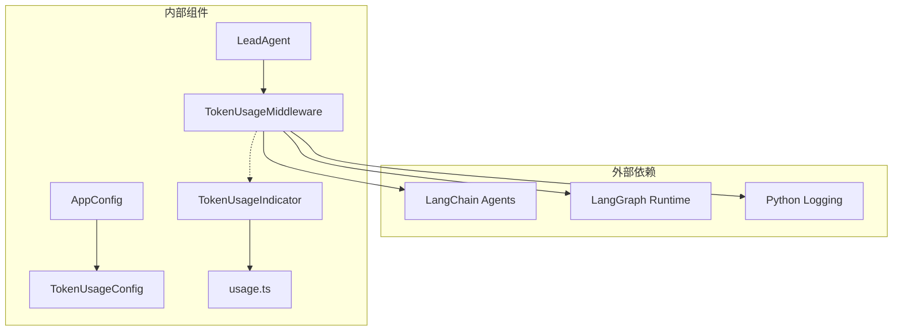

# 令牌使用中间件

<cite>
**本文档引用的文件**
- [token_usage_middleware.py](file://backend/packages/harness/deerflow/agents/middlewares/token_usage_middleware.py)
- [token_usage_config.py](file://backend/packages/harness/deerflow/config/token_usage_config.py)
- [agent.py](file://backend/packages/harness/deerflow/agents/lead_agent/agent.py)
- [app_config.py](file://backend/packages/harness/deerflow/config/app_config.py)
- [test_token_usage.py](file://backend/tests/test_token_usage.py)
- [token-usage-indicator.tsx](file://frontend/src/components/workspace/token-usage-indicator.tsx)
- [usage.ts](file://frontend/src/core/messages/usage.ts)
- [client.py](file://backend/packages/harness/deerflow/client.py)
</cite>

## 目录
1. [简介](#简介)
2. [项目结构](#项目结构)
3. [核心组件](#核心组件)
4. [架构概览](#架构概览)
5. [详细组件分析](#详细组件分析)
6. [依赖关系分析](#依赖关系分析)
7. [性能考虑](#性能考虑)
8. [故障排除指南](#故障排除指南)
9. [结论](#结论)

## 简介

DeerFlow 令牌使用中间件是一个专门设计用于监控和统计 LLM（大语言模型）令牌消耗的系统组件。该中间件通过拦截代理执行过程中的模型响应，提取并记录令牌使用元数据，为用户提供实时的令牌消耗监控和统计功能。

该中间件采用轻量级设计，仅在启用时才参与代理执行流程，避免对系统性能造成不必要的影响。它支持同步和异步两种模式，确保与不同运行环境的兼容性。

## 项目结构

令牌使用中间件在 DeerFlow 项目中的组织结构如下：

**图表来源**
- [token_usage_middleware.py:1-38](file://backend/packages/harness/deerflow/agents/middlewares/token_usage_middleware.py#L1-L38)
- [token_usage_config.py:1-8](file://backend/packages/harness/deerflow/config/token_usage_config.py#L1-L8)
- [agent.py:208-265](file://backend/packages/harness/deerflow/agents/lead_agent/agent.py#L208-L265)

**章节来源**
- [token_usage_middleware.py:1-38](file://backend/packages/harness/deerflow/agents/middlewares/token_usage_middleware.py#L1-L38)
- [agent.py:208-265](file://backend/packages/harness/deerflow/agents/lead_agent/agent.py#L208-L265)

## 核心组件

### 令牌使用中间件 (TokenUsageMiddleware)

令牌使用中间件是整个系统的核心组件，负责拦截代理执行过程并提取令牌使用信息。

**主要特性：**
- 实现了 `AgentMiddleware` 接口，支持同步和异步两种模式
- 自动从模型响应中提取 `usage_metadata` 信息
- 提供详细的令牌消耗日志记录
- 支持输入令牌、输出令牌和总令牌的完整统计

**关键实现细节：**
- 使用 `after_model` 和 `aafter_model` 方法拦截模型调用后的状态
- 通过 `state.get("messages", [])` 获取消息历史
- 从最后一条消息的 `usage_metadata` 属性提取令牌使用数据
- 使用结构化日志格式记录令牌消耗信息

### 令牌配置 (TokenUsageConfig)

令牌配置类定义了令牌使用跟踪的启用状态和相关参数。

**配置选项：**
- `enabled`: 布尔值，控制是否启用令牌使用跟踪中间件
- 默认值：`False`，表示默认禁用令牌跟踪功能

### 应用配置集成

应用配置 (`AppConfig`) 将令牌使用配置集成到全局配置系统中，支持动态配置管理。

**集成特点：**
- 作为 `AppConfig` 的子配置项存在
- 支持从 YAML 配置文件加载
- 提供类型安全的配置访问接口

**章节来源**
- [token_usage_middleware.py:13-37](file://backend/packages/harness/deerflow/agents/middlewares/token_usage_middleware.py#L13-L37)
- [token_usage_config.py:4-7](file://backend/packages/harness/deerflow/config/token_usage_config.py#L4-L7)
- [app_config.py:30-44](file://backend/packages/harness/deerflow/config/app_config.py#L30-L44)

## 架构概览

令牌使用中间件在整个 DeerFlow 系统中的架构位置如下：

**图表来源**
- [agent.py:208-265](file://backend/packages/harness/deerflow/agents/lead_agent/agent.py#L208-L265)
- [token_usage_middleware.py:16-36](file://backend/packages/harness/deerflow/agents/middlewares/token_usage_middleware.py#L16-L36)

### 中间件注册流程

令牌使用中间件通过以下流程被注册到代理执行链中：

**图表来源**
- [agent.py:231-233](file://backend/packages/harness/deerflow/agents/lead_agent/agent.py#L231-L233)

**章节来源**
- [agent.py:208-265](file://backend/packages/harness/deerflow/agents/lead_agent/agent.py#L208-L265)

## 详细组件分析

### 后端中间件实现

#### TokenUsageMiddleware 类结构

**图表来源**
- [token_usage_middleware.py:13-37](file://backend/packages/harness/deerflow/agents/middlewares/token_usage_middleware.py#L13-L37)

#### 令牌提取算法

令牌使用中间件采用以下算法从模型响应中提取令牌使用信息：

**图表来源**
- [token_usage_middleware.py:24-36](file://backend/packages/harness/deerflow/agents/middlewares/token_usage_middleware.py#L24-L36)

### 前端展示组件

#### 令牌使用指示器

前端提供了直观的令牌使用可视化组件：

**组件功能：**
- 实时显示累计令牌使用量
- 提供详细的输入、输出和总令牌统计
- 支持鼠标悬停查看详细信息
- 使用图标和数字格式化显示

**显示逻辑：**
- 通过 `accumulateUsage` 函数计算累计使用量
- 使用 `formatTokenCount` 函数格式化显示
- 支持千位分隔符和 K 单位缩写

**章节来源**
- [token-usage-indicator.tsx:21-74](file://frontend/src/components/workspace/token-usage-indicator.tsx#L21-L74)
- [usage.ts:35-62](file://frontend/src/core/messages/usage.ts#L35-L62)

### 测试验证机制

系统包含全面的测试套件来验证令牌使用功能的正确性：

#### 序列测试场景

**图表来源**
- [test_token_usage.py:16-76](file://backend/tests/test_token_usage.py#L16-L76)
- [test_token_usage.py:153-292](file://backend/tests/test_token_usage.py#L153-L292)

**章节来源**
- [test_token_usage.py:16-292](file://backend/tests/test_token_usage.py#L16-L292)

## 依赖关系分析

### 组件依赖图

**图表来源**
- [token_usage_middleware.py:6-8](file://backend/packages/harness/deerflow/agents/middlewares/token_usage_middleware.py#L6-L8)
- [agent.py:14](file://backend/packages/harness/deerflow/agents/lead_agent/agent.py#L14)

### 关键依赖关系

1. **LangChain 集成**：中间件继承自 `AgentMiddleware`，确保与 LangChain 代理框架的无缝集成
2. **LangGraph 支持**：利用 `Runtime` 对象获取代理执行上下文
3. **配置系统集成**：通过 `AppConfig` 获取令牌使用配置状态
4. **前端展示对接**：与前端的令牌使用指示器组件配合工作

**章节来源**
- [token_usage_middleware.py:6-10](file://backend/packages/harness/deerflow/agents/middlewares/token_usage_middleware.py#L6-L10)
- [agent.py:14](file://backend/packages/harness/deerflow/agents/lead_agent/agent.py#L14)

## 性能考虑

### 轻量级设计原则

令牌使用中间件遵循以下性能优化原则：

1. **按需启用**：默认禁用，仅在明确启用时才参与执行链
2. **最小化开销**：只进行必要的消息访问和属性读取
3. **异步支持**：同时支持同步和异步模式，适应不同执行环境
4. **内存效率**：不存储令牌使用历史，仅进行即时记录

### 执行成本分析

- **CPU 成本**：极低，主要是字典访问和字符串格式化操作
- **内存成本**：极低，仅在日志记录时临时分配少量内存
- **I/O 成本**：依赖于底层日志系统的性能，通常为异步写入

### 最佳实践建议

1. **生产环境配置**：建议在开发和测试环境中启用，在生产环境中谨慎使用
2. **日志级别**：根据需要调整日志级别以平衡信息详细程度和性能影响
3. **监控集成**：结合系统监控工具进行令牌使用趋势分析

## 故障排除指南

### 常见问题诊断

#### 令牌使用未记录

**可能原因：**
1. 令牌使用中间件未启用
2. 模型响应中缺少 `usage_metadata`
3. 消息历史为空

**解决方案：**
1. 检查 `AppConfig.token_usage.enabled` 配置
2. 确认使用的模型支持令牌使用元数据
3. 验证代理执行链的正确性

#### 前端显示异常

**可能原因：**
1. 消息格式不符合预期
2. 缺少必要的类型信息
3. 数据转换错误

**解决方案：**
1. 检查消息序列化过程
2. 验证 `usage_metadata` 字段的存在性
3. 确认前端组件的类型定义

### 调试技巧

1. **启用详细日志**：增加日志级别以获取更详细的执行信息
2. **单元测试验证**：使用现有的测试套件验证功能正确性
3. **配置验证**：检查配置文件的语法和完整性

**章节来源**
- [test_token_usage.py:16-76](file://backend/tests/test_token_usage.py#L16-L76)

## 结论

DeerFlow 令牌使用中间件是一个设计精良、实现简洁的监控组件。它成功地实现了以下目标：

1. **功能完整性**：准确提取和记录 LLM 令牌使用信息
2. **性能友好**：采用轻量级设计，最小化对系统性能的影响
3. **易于集成**：与现有 DeerFlow 架构无缝集成
4. **可扩展性**：支持未来功能扩展和定制

该中间件为 DeerFlow 用户提供了宝贵的令牌使用洞察，有助于优化成本控制和资源管理。通过合理的配置和监控策略，用户可以更好地理解和控制其 AI 应用的成本开销。

建议在未来版本中考虑添加：
- 更详细的成本计算功能
- 实时告警机制
- 历史趋势分析
- 预算控制集成