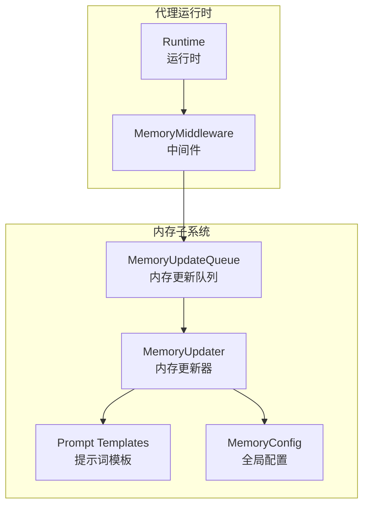
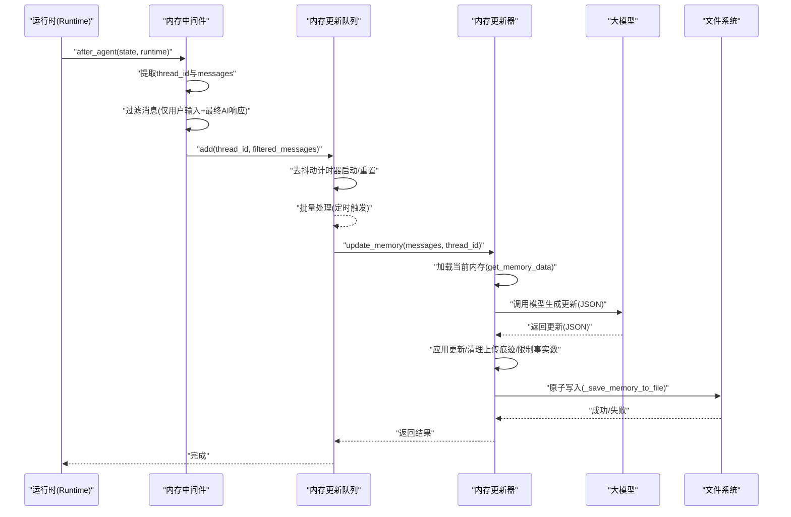
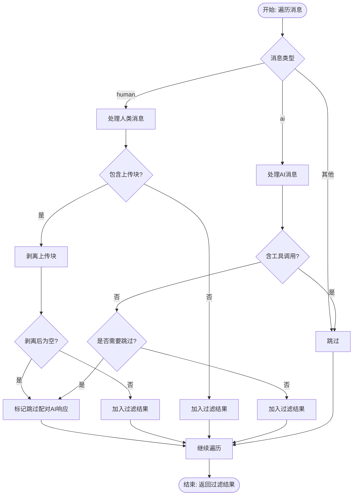
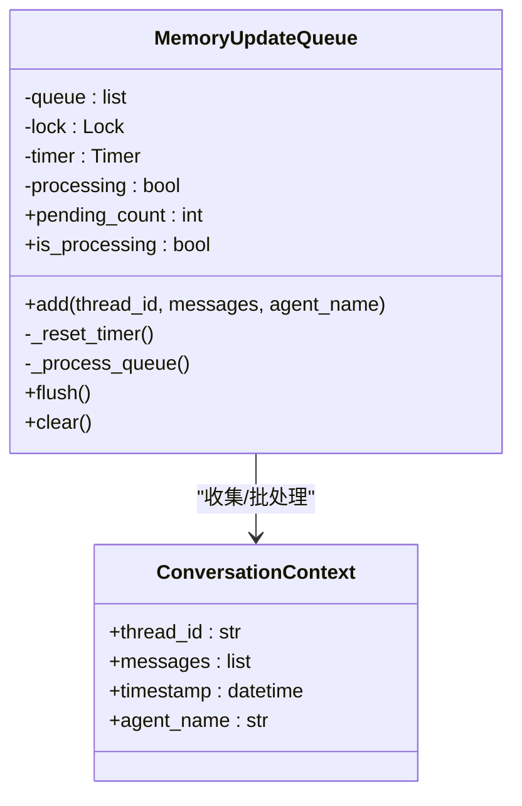
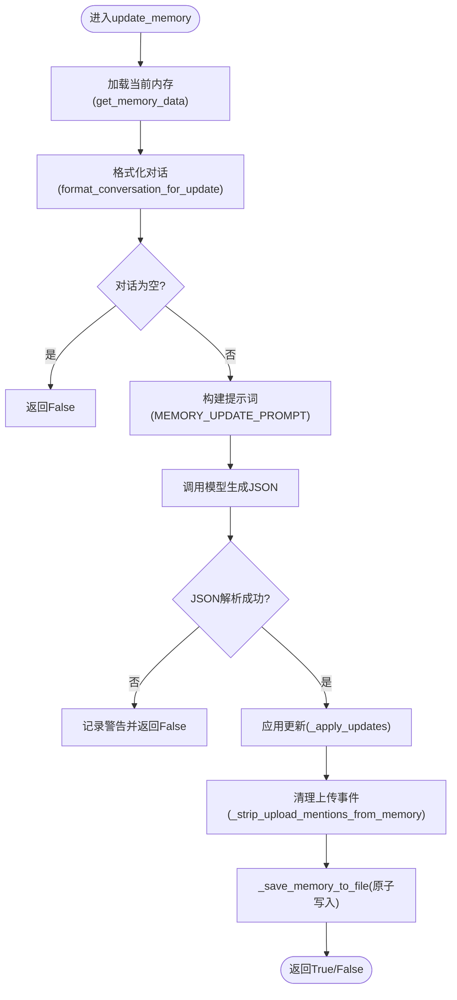
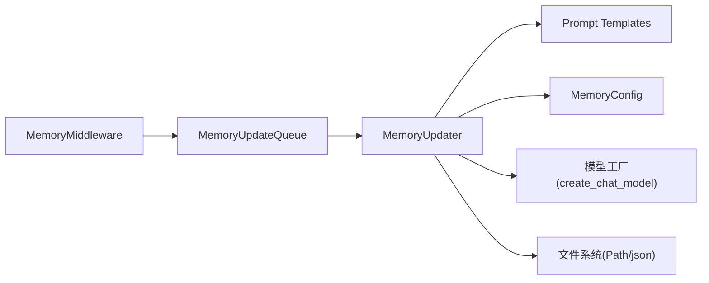

# 内存中间件

<cite>
**本文引用的文件**
- [memory_middleware.py](file://backend/packages/harness/deerflow/agents/middlewares/memory_middleware.py)
- [queue.py](file://backend/packages/harness/deerflow/agents/memory/queue.py)
- [updater.py](file://backend/packages/harness/deerflow/agents/memory/updater.py)
- [prompt.py](file://backend/packages/harness/deerflow/agents/memory/prompt.py)
- [memory_config.py](file://backend/packages/harness/deerflow/config/memory_config.py)
- [agent.py](file://backend/packages/harness/deerflow/agents/lead_agent/agent.py)
- [MEMORY_IMPROVEMENTS.md](file://backend/docs/MEMORY_IMPROVEMENTS.md)
- [MEMORY_IMPROVEMENTS_SUMMARY.md](file://backend/docs/MEMORY_IMPROVEMENTS_SUMMARY.md)
- [test_memory_upload_filtering.py](file://backend/tests/test_memory_upload_filtering.py)
- [test_memory_updater.py](file://backend/tests/test_memory_updater.py)
</cite>

## 目录
1. [简介](#简介)
2. [项目结构](#项目结构)
3. [核心组件](#核心组件)
4. [架构总览](#架构总览)
5. [详细组件分析](#详细组件分析)
6. [依赖关系分析](#依赖关系分析)
7. [性能考量](#性能考量)
8. [故障排除指南](#故障排除指南)
9. [结论](#结论)
10. [附录](#附录)

## 简介
本技术文档围绕 DeerFlow 的“内存中间件”展开，系统性阐述其核心功能与实现细节，包括：
- 对话消息过滤：仅保留用户输入与最终 AI 回答，剔除工具调用中间结果与上传事件痕迹。
- 队列管理与去抖动：通过内存更新队列对多轮对话进行去抖动聚合，降低频繁写入开销。
- 异步内存更新：基于 LLM 的记忆摘要与事实抽取，异步落盘持久化。
- 配置项与性能调优：存储路径、去抖动窗口、最大事实数、置信阈值、注入上限等。
- 与内存队列和更新器的集成关系：中间件在运行后置阶段触发，经由队列与更新器完成异步处理。

## 项目结构
内存中间件位于后端 harness 包中，与内存队列、更新器、提示词模板、全局配置共同组成完整的记忆子系统；同时在主代理构建流程中被注册为运行时中间件之一。

图示来源
- [memory_middleware.py:86-149](file://backend/packages/harness/deerflow/agents/middlewares/memory_middleware.py#L86-L149)
- [queue.py:22-166](file://backend/packages/harness/deerflow/agents/memory/queue.py#L22-L166)
- [updater.py:267-443](file://backend/packages/harness/deerflow/agents/memory/updater.py#L267-L443)
- [prompt.py:14-117](file://backend/packages/harness/deerflow/agents/memory/prompt.py#L14-L117)
- [memory_config.py:6-79](file://backend/packages/harness/deerflow/config/memory_config.py#L6-L79)

章节来源
- [memory_middleware.py:1-150](file://backend/packages/harness/deerflow/agents/middlewares/memory_middleware.py#L1-L150)
- [queue.py:1-196](file://backend/packages/harness/deerflow/agents/memory/queue.py#L1-L196)
- [updater.py:1-443](file://backend/packages/harness/deerflow/agents/memory/updater.py#L1-L443)
- [prompt.py:1-341](file://backend/packages/harness/deerflow/agents/memory/prompt.py#L1-L341)
- [memory_config.py:1-79](file://backend/packages/harness/deerflow/config/memory_config.py#L1-L79)

## 核心组件
- 内存中间件（MemoryMiddleware）：在代理执行完成后，从运行时上下文提取线程标识与消息列表，进行消息过滤后入队。
- 内存更新队列（MemoryUpdateQueue）：带去抖动的队列，同一线程的新消息会替换旧的待处理项，并在设定的去抖动时间后批量处理。
- 内存更新器（MemoryUpdater）：负责加载/保存记忆文件、调用模型生成更新、应用更新、清理上传事件痕迹、限制事实数量与置信度。
- 提示词模板（Prompt Templates）：定义记忆更新与注入的格式与约束，包含 JSON 输出结构、事实分类与置信度评分、令牌预算控制。
- 全局配置（MemoryConfig）：启用开关、存储路径、去抖动秒数、模型名、最大事实数、事实置信阈值、是否注入、最大注入令牌数。

章节来源
- [memory_middleware.py:86-149](file://backend/packages/harness/deerflow/agents/middlewares/memory_middleware.py#L86-L149)
- [queue.py:22-166](file://backend/packages/harness/deerflow/agents/memory/queue.py#L22-L166)
- [updater.py:267-443](file://backend/packages/harness/deerflow/agents/memory/updater.py#L267-L443)
- [prompt.py:14-117](file://backend/packages/harness/deerflow/agents/memory/prompt.py#L14-L117)
- [memory_config.py:6-79](file://backend/packages/harness/deerflow/config/memory_config.py#L6-L79)

## 架构总览
内存中间件在代理运行时的“后置阶段”被调用，它从运行时上下文中获取线程 ID 与消息列表，经过消息过滤后，将“用户输入 + 最终 AI 回答”的对话片段提交到内存更新队列。队列在去抖动窗口结束后，批量取出上下文交由更新器处理。更新器通过 LLM 生成新的记忆更新，应用到当前内存数据结构，清理上传事件痕迹，并按配置限制事实数量与置信度，最后原子性地写回磁盘。

图示来源
- [memory_middleware.py:107-149](file://backend/packages/harness/deerflow/agents/middlewares/memory_middleware.py#L107-L149)
- [queue.py:84-130](file://backend/packages/harness/deerflow/agents/memory/queue.py#L84-L130)
- [updater.py:284-348](file://backend/packages/harness/deerflow/agents/memory/updater.py#L284-L348)
- [prompt.py:14-117](file://backend/packages/harness/deerflow/agents/memory/prompt.py#L14-L117)

## 详细组件分析

### 消息过滤规则与逻辑
- 过滤目标
  - 工具消息与带有工具调用的 AI 消息（中间步骤）一律剔除。
  - 用户消息中的“上传文件块”标记会被剥离，若剥离后无实际文本，则整对“上传消息 + 配对 AI 响应”均被剔除。
  - 仅保留“人类用户输入”与“最终 AI 回答”（不含工具调用）。
- 多模态内容处理
  - 支持消息内容为字符串或列表（如多模态文本块），会拼接有效文本部分。
- 上传事件清理
  - 在中间件过滤阶段剥离上传块；在更新器落盘前再次扫描摘要与事实，移除上传事件描述，避免未来会话中出现不存在的文件引用。

图示来源
- [memory_middleware.py:20-83](file://backend/packages/harness/deerflow/agents/middlewares/memory_middleware.py#L20-L83)
- [test_memory_upload_filtering.py:38-136](file://backend/tests/test_memory_upload_filtering.py#L38-L136)

章节来源
- [memory_middleware.py:20-83](file://backend/packages/harness/deerflow/agents/middlewares/memory_middleware.py#L20-L83)
- [test_memory_upload_filtering.py:1-215](file://backend/tests/test_memory_upload_filtering.py#L1-L215)

### 内存队列与去抖动机制
- 去抖动窗口
  - 通过线程计时器在配置的秒数后触发批量处理，期间新消息到达会替换同一线程的待处理项，从而合并高频更新。
- 批量更新策略
  - 同一批次内逐条调用更新器，为避免速率限制，批次间有短延迟。
- 并发与锁
  - 使用互斥锁保护队列状态与计时器，防止并发竞态；处理过程中禁止重复触发。
- 清理与刷新
  - 提供强制刷新与清空接口，便于测试与优雅关闭。

图示来源
- [queue.py:22-166](file://backend/packages/harness/deerflow/agents/memory/queue.py#L22-L166)

章节来源
- [queue.py:22-166](file://backend/packages/harness/deerflow/agents/memory/queue.py#L22-L166)

### 异步内存更新机制与事实管理
- 更新流程
  - 加载当前内存数据（带文件修改时间缓存）。
  - 将过滤后的对话格式化为提示词输入。
  - 调用模型生成 JSON 结构的更新指令，解析后应用到内存。
  - 清理上传事件痕迹（摘要与事实）。
  - 应用事实去重、置信度阈值、最大数量限制。
  - 原子写回磁盘并更新缓存。
- 事实管理
  - 新增事实时去重（按标准化内容键），保留来源线程 ID。
  - 删除事实通过 ID 列表。
  - 超限时按置信度降序截断。
- 上传事件清理
  - 正则匹配上传事件句式，清除摘要与事实中的上传描述，保留合法的文件使用偏好等信息。

图示来源
- [updater.py:284-348](file://backend/packages/harness/deerflow/agents/memory/updater.py#L284-L348)
- [prompt.py:297-340](file://backend/packages/harness/deerflow/agents/memory/prompt.py#L297-L340)

章节来源
- [updater.py:267-443](file://backend/packages/harness/deerflow/agents/memory/updater.py#L267-L443)
- [prompt.py:14-117](file://backend/packages/harness/deerflow/agents/memory/prompt.py#L14-L117)

### 与代理运行时的集成
- 注册位置
  - 在主代理构建流程中，MemoryMiddleware 被添加到运行时中间件序列中，位于标题中间件之后、循环检测中间件之前。
- 触发时机
  - 在代理执行完成后（after_agent）进行消息过滤与入队，不改变代理状态。

章节来源
- [agent.py:238-239](file://backend/packages/harness/deerflow/agents/lead_agent/agent.py#L238-L239)
- [memory_middleware.py:107-149](file://backend/packages/harness/deerflow/agents/middlewares/memory_middleware.py#L107-L149)

## 依赖关系分析
- 中间件依赖
  - 依赖全局配置读取启用开关、去抖动秒数、模型名等。
  - 依赖内存队列单例，用于入队。
- 队列依赖
  - 依赖全局配置决定去抖动时间。
  - 依赖更新器执行实际的内存更新。
- 更新器依赖
  - 依赖提示词模板与格式化函数。
  - 依赖模型工厂创建聊天模型。
  - 依赖路径配置确定内存文件位置。
  - 依赖文件系统进行原子写入。
- 文档与测试
  - MEMORY_IMPROVEMENTS 系列文档说明了事实注入与令牌预算的现状与规划。
  - 测试覆盖上传事件过滤、事实去重与阈值、多模态内容处理、结构化响应解析等关键点。

图示来源
- [memory_middleware.py:10-11](file://backend/packages/harness/deerflow/agents/middlewares/memory_middleware.py#L10-L11)
- [queue.py:87-87](file://backend/packages/harness/deerflow/agents/memory/queue.py#L87-L87)
- [updater.py:11-17](file://backend/packages/harness/deerflow/agents/memory/updater.py#L11-L17)

章节来源
- [MEMORY_IMPROVEMENTS.md:1-66](file://backend/docs/MEMORY_IMPROVEMENTS.md#L1-L66)
- [MEMORY_IMPROVEMENTS_SUMMARY.md:1-39](file://backend/docs/MEMORY_IMPROVEMENTS_SUMMARY.md#L1-L39)
- [test_memory_updater.py:1-289](file://backend/tests/test_memory_updater.py#L1-L289)
- [test_memory_upload_filtering.py:1-215](file://backend/tests/test_memory_upload_filtering.py#L1-L215)

## 性能考量
- 去抖动窗口
  - 合理设置去抖动秒数可在吞吐与实时性之间平衡。窗口越长，批处理次数减少但延迟增加。
- 批处理与速率限制
  - 队列在批量处理时对多条更新施加短间隔，有助于缓解外部服务限流风险。
- 事实数量与置信阈值
  - 控制最大事实数与最低置信阈值可显著降低后续注入成本与噪声。
- 令牌预算与注入
  - 记忆注入采用精确令牌计数（优先 tiktoken），并在达到上限时进行截断，避免超出系统提示长度。
- 文件写入
  - 使用临时文件 + 原子替换写入，保证一致性与可恢复性。

章节来源
- [queue.py:123-125](file://backend/packages/harness/deerflow/agents/memory/queue.py#L123-L125)
- [updater.py:418-426](file://backend/packages/harness/deerflow/agents/memory/updater.py#L418-L426)
- [prompt.py:186-294](file://backend/packages/harness/deerflow/agents/memory/prompt.py#L186-L294)
- [MEMORY_IMPROVEMENTS.md:32-34](file://backend/docs/MEMORY_IMPROVEMENTS.md#L32-L34)

## 故障排除指南
- 未产生更新
  - 检查中间件是否启用、线程 ID 是否存在、消息列表是否为空、过滤后是否仍包含用户与 AI 消息。
- 上传事件残留
  - 确认中间件过滤与更新器清理两阶段均已生效；检查上传块正则是否覆盖到实际内容。
- JSON 解析失败
  - 模型返回非标准 JSON 或代码块包裹，需确保提示词严格要求纯 JSON 输出；必要时检查模型输出规范化逻辑。
- 写入失败
  - 检查存储路径权限、磁盘空间、文件锁定；确认原子写入流程未被中断。
- 注入超长
  - 若注入内容超过令牌预算，检查 max_injection_tokens 配置与事实数量；考虑降低事实数量或提高预算。

章节来源
- [memory_middleware.py:118-143](file://backend/packages/harness/deerflow/agents/middlewares/memory_middleware.py#L118-L143)
- [updater.py:343-348](file://backend/packages/harness/deerflow/agents/memory/updater.py#L343-L348)
- [prompt.py:324-328](file://backend/packages/harness/deerflow/agents/memory/prompt.py#L324-L328)
- [MEMORY_IMPROVEMENTS.md:57-62](file://backend/docs/MEMORY_IMPROVEMENTS.md#L57-L62)

## 结论
内存中间件通过“消息过滤 + 去抖动队列 + 异步更新器”的组合，实现了对对话记忆的高效、可控与可扩展管理。其设计兼顾了实时性与稳定性，配合严格的事实管理与上传事件清理，确保长期记忆的质量与一致性。未来可结合计划中的上下文感知检索与加权排序进一步提升注入效果。

## 附录

### 配置选项与默认值
- enabled: 是否启用内存机制
- storage_path: 内存文件存储路径（支持绝对/相对；相对路径基于基础目录）
- debounce_seconds: 去抖动等待秒数（1–300）
- model_name: 用于记忆更新的模型名称（None 表示使用默认）
- max_facts: 最大事实数量（10–500）
- fact_confidence_threshold: 事实置信度阈值（0.0–1.0）
- injection_enabled: 是否将记忆注入系统提示
- max_injection_tokens: 记忆注入的最大令牌数（100–8000）

章节来源
- [memory_config.py:6-79](file://backend/packages/harness/deerflow/config/memory_config.py#L6-L79)