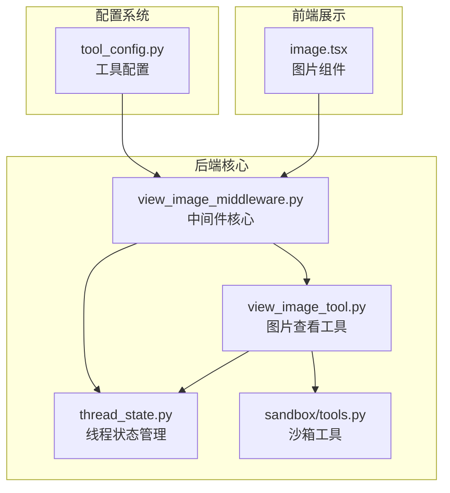
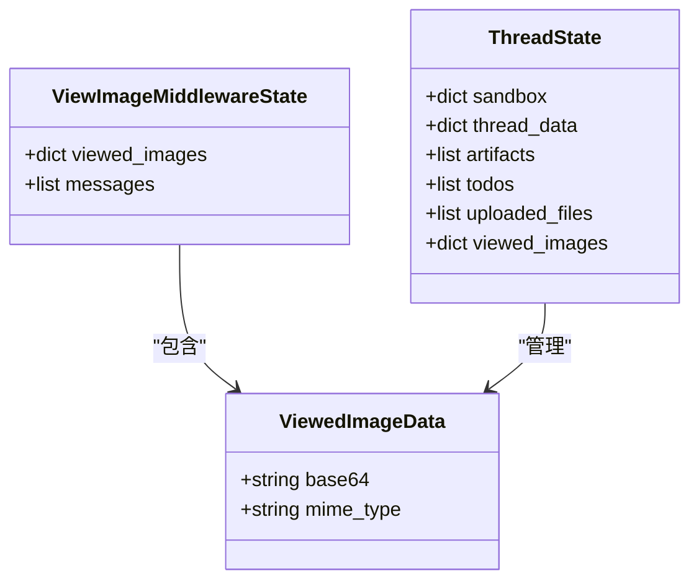
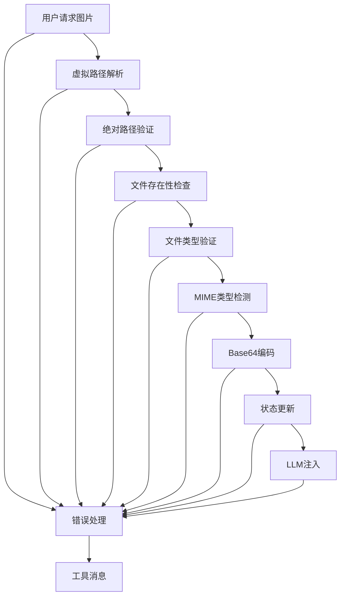
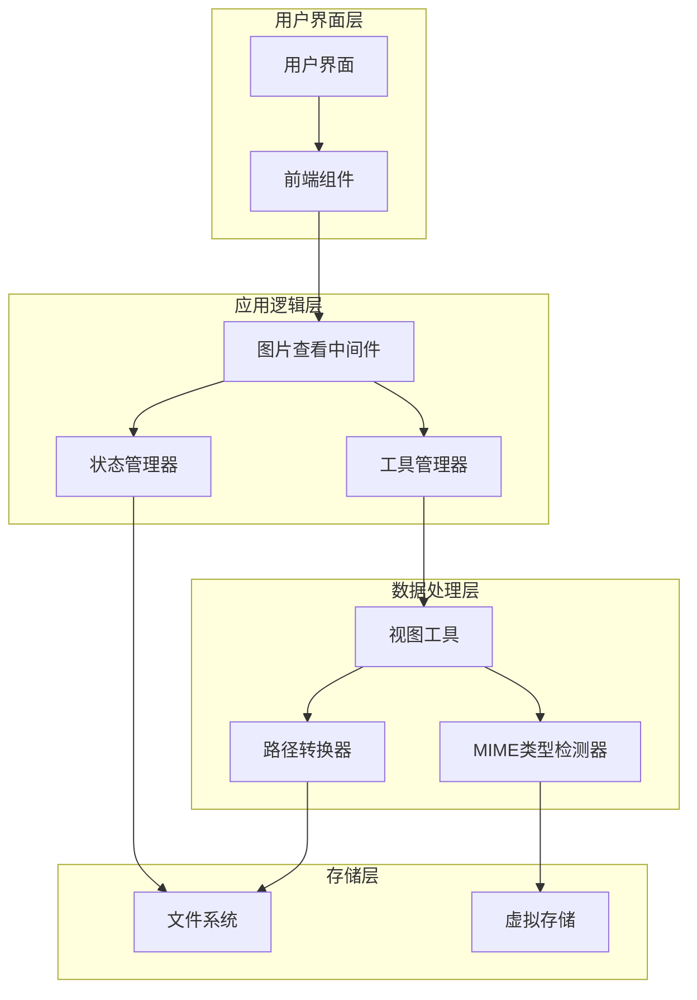
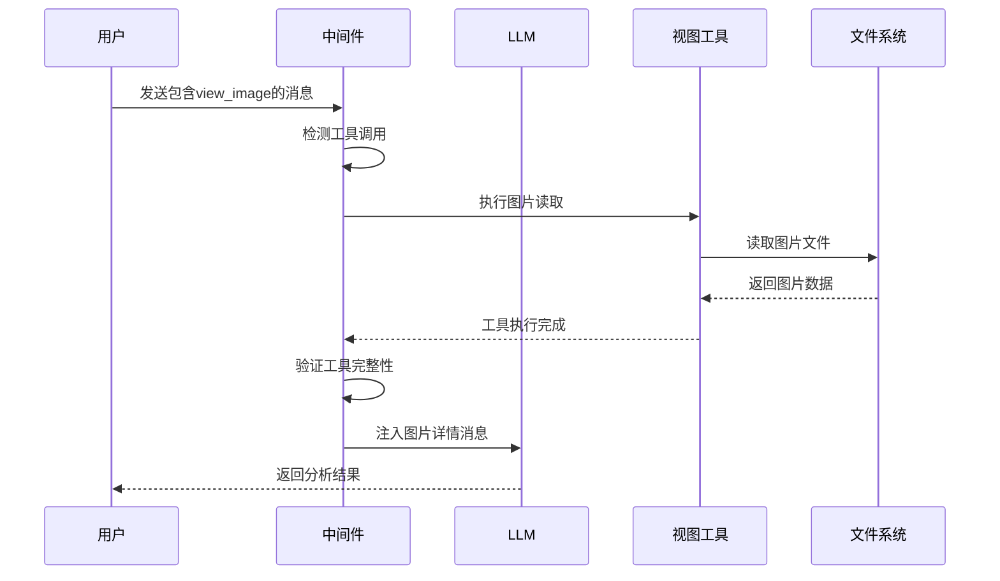
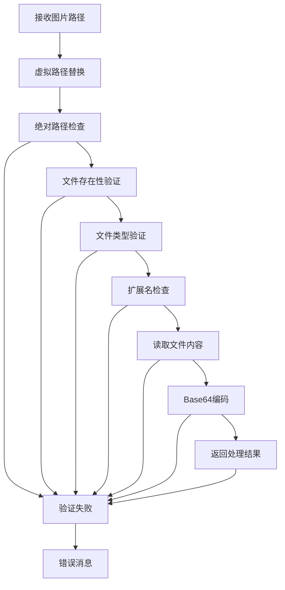
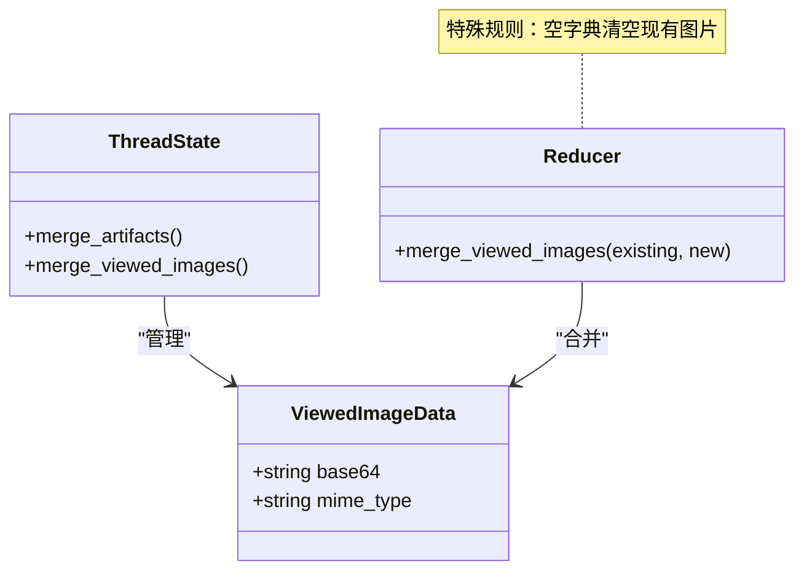
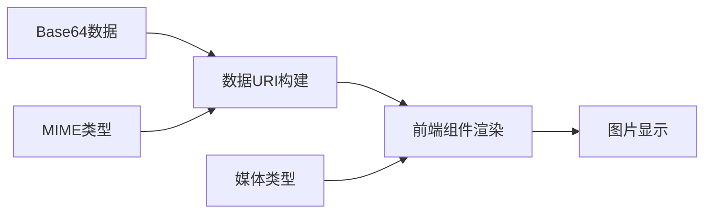
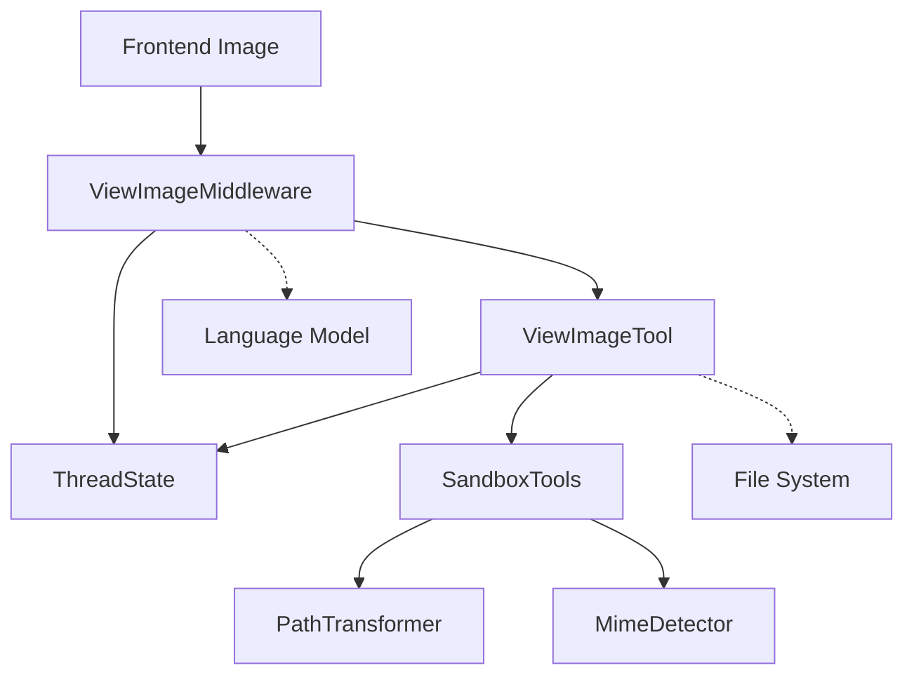
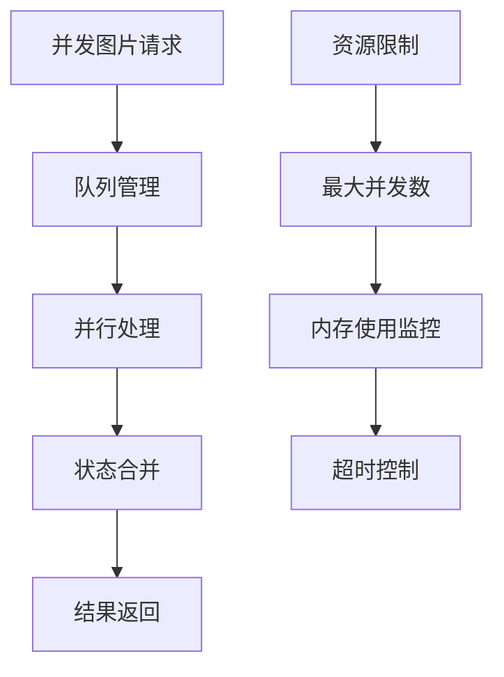

# 图片查看中间件

<cite>
**本文档引用的文件**
- [view_image_middleware.py](file://backend/packages/harness/deerflow/agents/middlewares/view_image_middleware.py)
- [view_image_tool.py](file://backend/packages/harness/deerflow/tools/builtins/view_image_tool.py)
- [thread_state.py](file://backend/packages/harness/deerflow/agents/thread_state.py)
- [tools.py](file://backend/packages/harness/deerflow/sandbox/tools.py)
- [image.tsx](file://frontend/src/components/ai-elements/image.tsx)
- [tool_config.py](file://backend/packages/harness/deerflow/config/tool_config.py)
</cite>

## 目录
1. [简介](#简介)
2. [项目结构](#项目结构)
3. [核心组件](#核心组件)
4. [架构概览](#架构概览)
5. [详细组件分析](#详细组件分析)
6. [依赖关系分析](#依赖关系分析)
7. [性能考虑](#性能考虑)
8. [故障排除指南](#故障排除指南)
9. [结论](#结论)

## 简介

 DeerFlow 图片查看中间件是一个智能的图像内容分析和展示系统，它能够自动检测、处理和展示用户上传或引用的图片文件。该中间件通过深度集成 LLM（大语言模型）和图像处理技术，实现了从图片识别到智能描述生成的完整工作流程。

该系统支持多种图片格式（JPG、PNG、WEBP），具备自动元数据提取、智能格式识别、安全路径验证等核心功能。通过独特的"视图图像"中间件机制，系统能够在用户不明确要求的情况下，自动向 LLM 提供图片分析结果，显著提升了用户体验和交互效率。

## 项目结构

图片查看中间件在 DeerFlow 项目中的组织结构如下：

**图表来源**
- [view_image_middleware.py:1-222](file://backend/packages/harness/deerflow/agents/middlewares/view_image_middleware.py#L1-L222)
- [view_image_tool.py:1-95](file://backend/packages/harness/deerflow/tools/builtins/view_image_tool.py#L1-L95)
- [thread_state.py:1-56](file://backend/packages/harness/deerflow/agents/thread_state.py#L1-L56)

**章节来源**
- [view_image_middleware.py:1-222](file://backend/packages/harness/deerflow/agents/middlewares/view_image_middleware.py#L1-L222)
- [view_image_tool.py:1-95](file://backend/packages/harness/deerflow/tools/builtins/view_image_tool.py#L1-L95)
- [thread_state.py:1-56](file://backend/packages/harness/deerflow/agents/thread_state.py#L1-L56)

## 核心组件

### 中间件状态管理

中间件使用专门的状态类来管理图片查看信息：

**图表来源**
- [view_image_middleware.py:13-33](file://backend/packages/harness/deerflow/agents/middlewares/view_image_middleware.py#L13-L33)
- [thread_state.py:16-55](file://backend/packages/harness/deerflow/agents/thread_state.py#L16-L55)

### 图片处理管道

系统采用多阶段处理机制，确保图片的安全性和有效性：

**图表来源**
- [view_image_tool.py:35-94](file://backend/packages/harness/deerflow/tools/builtins/view_image_tool.py#L35-L94)

**章节来源**
- [view_image_middleware.py:13-33](file://backend/packages/harness/deerflow/agents/middlewares/view_image_middleware.py#L13-L33)
- [thread_state.py:16-55](file://backend/packages/harness/deerflow/agents/thread_state.py#L16-L55)

## 架构概览

图片查看中间件的整体架构采用分层设计，确保了系统的可扩展性和安全性：

**图表来源**
- [view_image_middleware.py:19-31](file://backend/packages/harness/deerflow/agents/middlewares/view_image_middleware.py#L19-L31)
- [view_image_tool.py:15-34](file://backend/packages/harness/deerflow/tools/builtins/view_image_tool.py#L15-L34)

## 详细组件分析

### 图片查看中间件

中间件的核心职责是在 LLM 调用前自动注入图片详情信息：

#### 关键功能特性

1. **智能检测机制**：自动识别包含 `view_image` 工具调用的助手消息
2. **完整性验证**：确保所有工具调用都有对应的工具消息响应
3. **去重保护**：防止重复注入相同的图片详情消息
4. **异步支持**：同时支持同步和异步 LLM 调用场景

#### 处理流程

**图表来源**
- [view_image_middleware.py:189-221](file://backend/packages/harness/deerflow/agents/middlewares/view_image_middleware.py#L189-L221)

**章节来源**
- [view_image_middleware.py:19-31](file://backend/packages/harness/deerflow/agents/middlewares/view_image_middleware.py#L19-L31)
- [view_image_middleware.py:128-164](file://backend/packages/harness/deerflow/agents/middlewares/view_image_middleware.py#L128-L164)

### 视图图片工具

视图工具负责具体的图片处理和验证工作：

#### 支持的图片格式

| 格式 | MIME类型 | 描述 |
|------|----------|------|
| JPG | image/jpeg | 最通用的图片格式 |
| JPEG | image/jpeg | JPEG的另一种表示 |
| PNG | image/png | 支持透明度的位图格式 |
| WEBP | image/webp | Google开发的现代压缩格式 |

#### 安全验证机制

**图表来源**
- [view_image_tool.py:35-94](file://backend/packages/harness/deerflow/tools/builtins/view_image_tool.py#L35-L94)

**章节来源**
- [view_image_tool.py:15-34](file://backend/packages/harness/deerflow/tools/builtins/view_image_tool.py#L15-L34)
- [view_image_tool.py:59-76](file://backend/packages/harness/deerflow/tools/builtins/view_image_tool.py#L59-L76)

### 线程状态管理

系统使用专门的状态管理机制来跟踪图片查看历史：

#### 状态合并策略

**图表来源**
- [thread_state.py:31-45](file://backend/packages/harness/deerflow/agents/thread_state.py#L31-L45)

**章节来源**
- [thread_state.py:31-45](file://backend/packages/harness/deerflow/agents/thread_state.py#L31-L45)

### 前端图片展示

前端组件负责将 Base64 编码的图片数据正确渲染：

#### 渲染机制

**图表来源**
- [image.tsx:9-24](file://frontend/src/components/ai-elements/image.tsx#L9-L24)

**章节来源**
- [image.tsx:1-25](file://frontend/src/components/ai-elements/image.tsx#L1-L25)

## 依赖关系分析

### 组件间依赖

**图表来源**
- [view_image_middleware.py:10-11](file://backend/packages/harness/deerflow/agents/middlewares/view_image_middleware.py#L10-L11)
- [view_image_tool.py:11-12](file://backend/packages/harness/deerflow/tools/builtins/view_image_tool.py#L11-L12)

### 外部依赖

系统依赖以下关键外部组件：

1. **LangChain框架**：提供代理中间件接口和消息处理能力
2. **Base64编码库**：用于图片数据的编码和解码
3. **MIME类型检测**：自动识别图片格式
4. **路径安全验证**：防止目录遍历攻击

**章节来源**
- [view_image_middleware.py:3-8](file://backend/packages/harness/deerflow/agents/middlewares/view_image_middleware.py#L3-L8)
- [view_image_tool.py:1-3](file://backend/packages/harness/deerflow/tools/builtins/view_image_tool.py#L1-L3)

## 性能考虑

### 内存优化策略

1. **增量处理**：只在需要时才加载和处理图片数据
2. **缓存机制**：利用 LangGraph 的状态缓存减少重复计算
3. **流式处理**：对于大型图片文件，考虑实现流式读取机制

### 并发处理

### 性能监控指标

- 图片处理时间
- 内存使用量
- 并发请求数
- 错误率统计

## 故障排除指南

### 常见问题及解决方案

#### 图片无法显示

**症状**：图片在前端无法正常显示

**可能原因**：
1. Base64 数据格式错误
2. MIME 类型不匹配
3. 前端渲染错误

**解决步骤**：
1. 检查 Base64 编码是否正确
2. 验证 MIME 类型检测结果
3. 确认前端组件正确接收参数

#### 权限错误

**症状**：系统拒绝访问特定图片文件

**可能原因**：
1. 路径不在允许范围内
2. 目录遍历攻击防护触发
3. 文件权限不足

**解决步骤**：
1. 使用虚拟路径而非绝对路径
2. 检查路径映射配置
3. 验证文件访问权限

#### 性能问题

**症状**：图片处理响应缓慢

**可能原因**：
1. 图片文件过大
2. 并发请求过多
3. 内存不足

**优化建议**：
1. 实现图片尺寸限制
2. 添加请求队列管理
3. 启用内存池管理

**章节来源**
- [view_image_tool.py:40-57](file://backend/packages/harness/deerflow/tools/builtins/view_image_tool.py#L40-L57)
- [tools.py:359-411](file://backend/packages/harness/deerflow/sandbox/tools.py#L359-L411)

## 结论

DeerFlow 图片查看中间件通过精心设计的架构和严格的实现，成功地将图片识别、处理和展示功能无缝集成到 AI 代理系统中。该系统的主要优势包括：

1. **自动化程度高**：无需用户显式要求即可自动分析图片
2. **安全性强**：完整的路径验证和权限控制机制
3. **扩展性好**：模块化设计便于功能扩展和维护
4. **用户体验佳**：简洁的 API 和直观的前端展示

未来可以考虑的功能增强包括：
- 支持更多图片格式（如 HEIC、SVG）
- 实现图片质量检测和优化
- 添加批量图片处理能力
- 集成更高级的图片分析功能（如 OCR、对象检测）

该中间件为 DeerFlow 生态系统提供了强大的视觉内容处理能力，是构建智能 AI 应用的重要基础设施组件。