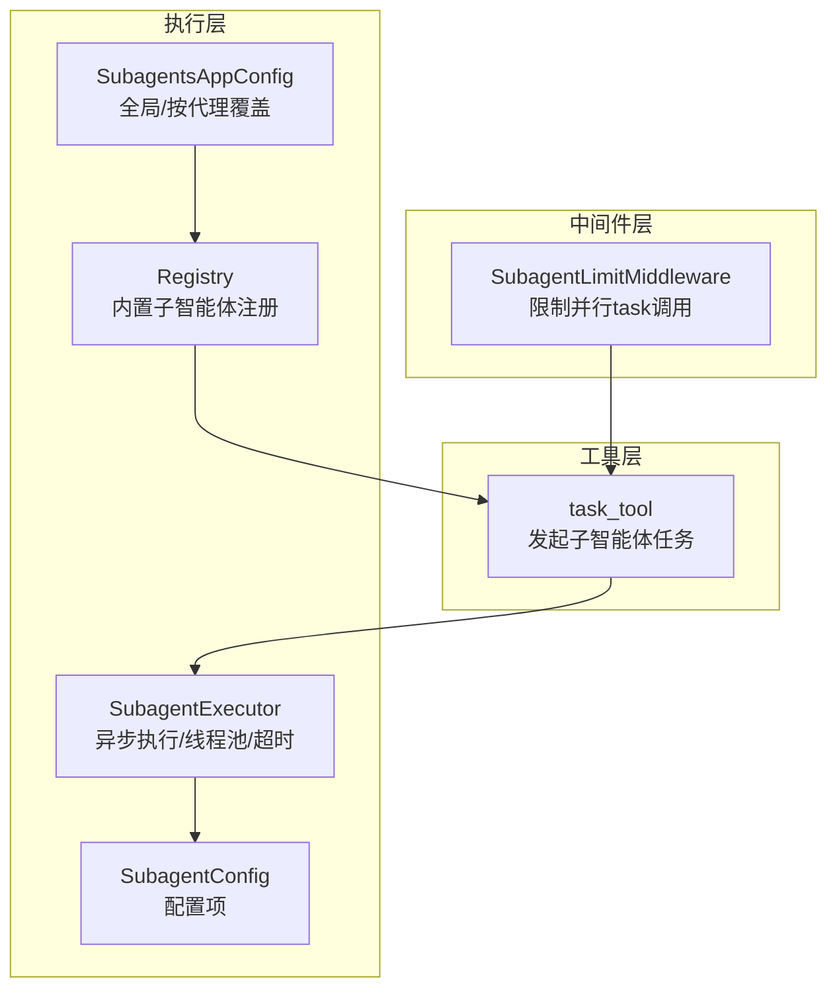
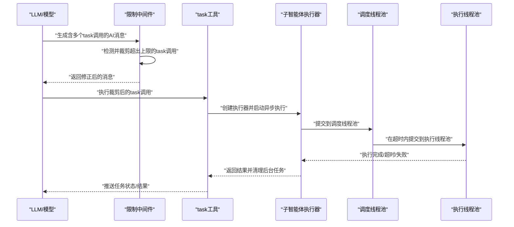
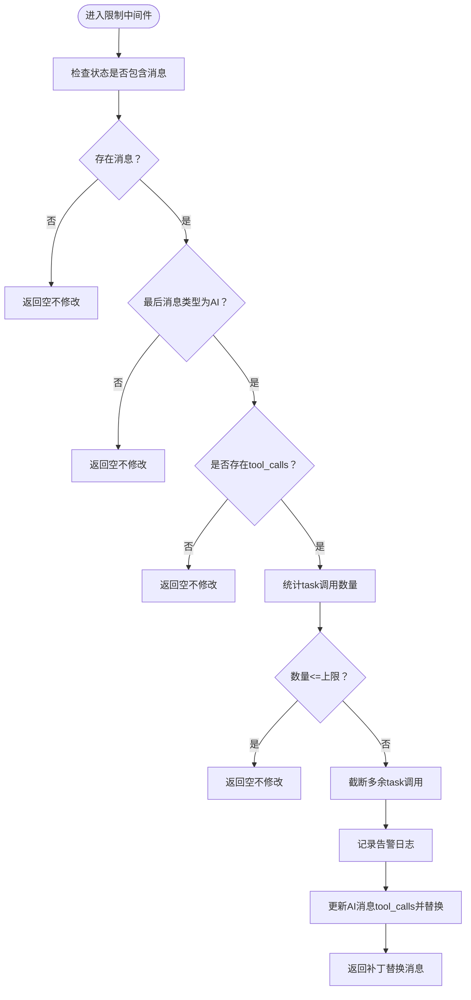
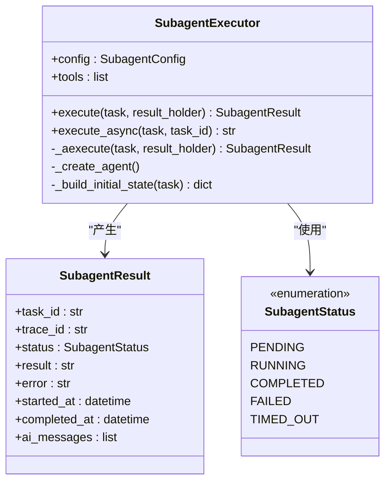
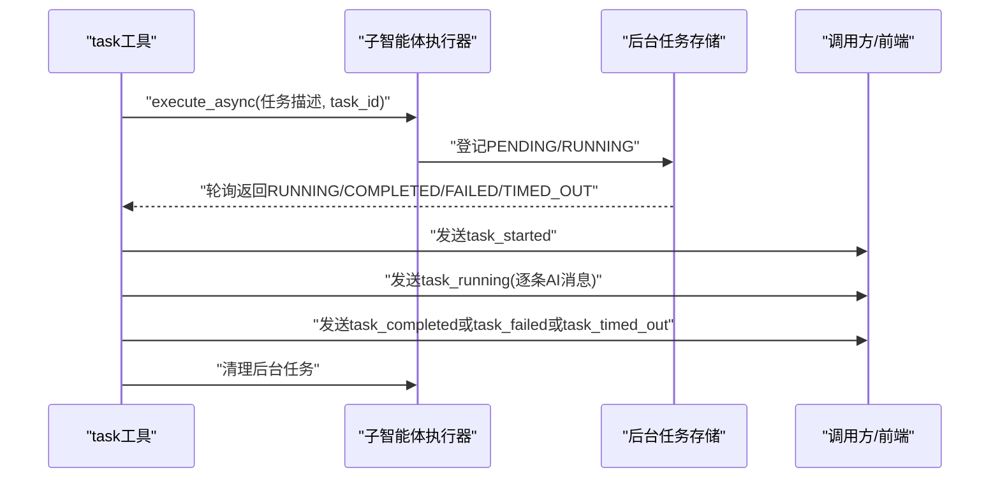
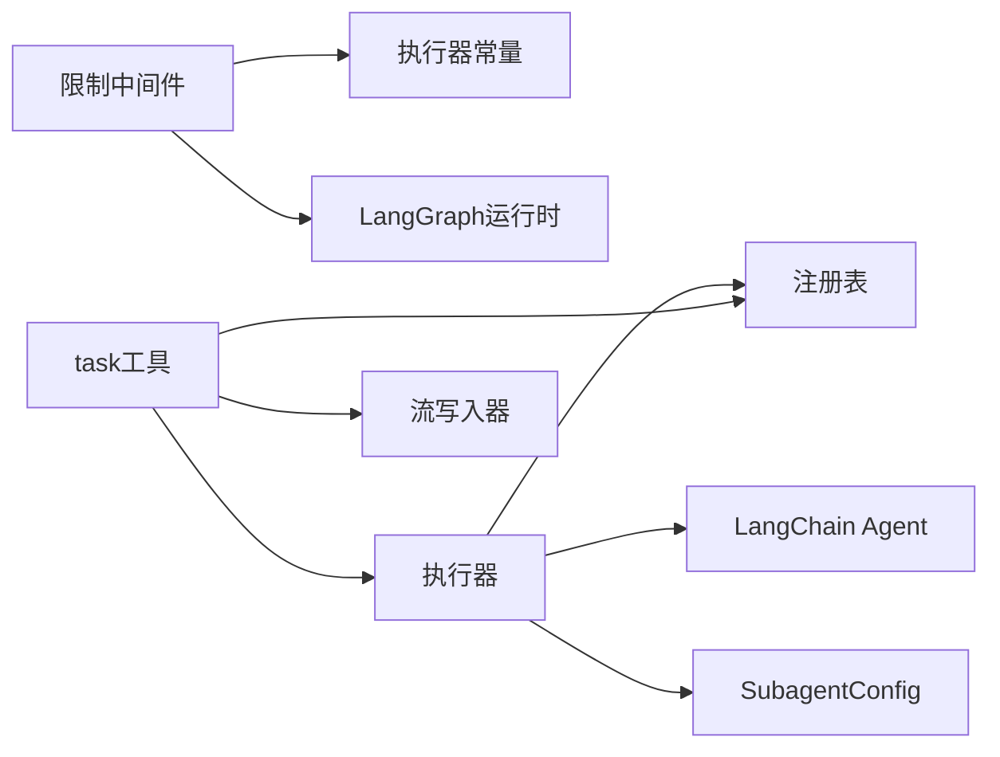

# 子智能体限制中间件

<cite>
**本文引用的文件**
- [subagent_limit_middleware.py](file://backend/packages/harness/deerflow/agents/middlewares/subagent_limit_middleware.py)
- [executor.py](file://backend/packages/harness/deerflow/subagents/executor.py)
- [config.py](file://backend/packages/harness/deerflow/subagents/config.py)
- [registry.py](file://backend/packages/harness/deerflow/subagents/registry.py)
- [task_tool.py](file://backend/packages/harness/deerflow/tools/builtins/task_tool.py)
- [subagents_config.py](file://backend/packages/harness/deerflow/config/subagents_config.py)
- [test_subagent_limit_middleware.py](file://backend/tests/test_subagent_limit_middleware.py)
- [test_subagent_timeout_config.py](file://backend/tests/test_subagent_timeout_config.py)
- [general_purpose.py](file://backend/packages/harness/deerflow/subagents/builtins/general_purpose.py)
- [bash_agent.py](file://backend/packages/harness/deerflow/subagents/builtins/bash_agent.py)
</cite>

## 目录
1. [简介](#简介)
2. [项目结构](#项目结构)
3. [核心组件](#核心组件)
4. [架构总览](#架构总览)
5. [详细组件分析](#详细组件分析)
6. [依赖分析](#依赖分析)
7. [性能考虑](#性能考虑)
8. [故障排查指南](#故障排查指南)
9. [结论](#结论)
10. [附录](#附录)

## 简介
本技术文档围绕 DeerFlow 的“子智能体限制中间件”展开，系统性阐述其在子智能体执行过程中的并发控制与资源限制机制。该中间件通过在模型生成响应后对“task”工具调用进行截断，确保单次响应中并行子智能体调用的数量不超过预设上限，从而避免系统资源被过度占用与执行冲突。同时，结合子智能体执行器的线程池并发模型、超时控制与后台任务管理，形成从“请求侧限制”到“执行侧约束”的完整闭环。

## 项目结构
与子智能体限制中间件直接相关的代码主要分布在以下模块：
- 中间件：agents/middlewares/subagent_limit_middleware.py
- 执行器：subagents/executor.py（包含线程池、超时与后台任务）
- 配置：subagents/config.py、config/subagents_config.py、subagents/registry.py
- 工具：tools/builtins/task_tool.py（触发子智能体执行）
- 内置子智能体：subagents/builtins/general_purpose.py、bash_agent.py
- 测试：tests/test_subagent_limit_middleware.py、tests/test_subagent_timeout_config.py

图表来源
- [subagent_limit_middleware.py:24-76](file://backend/packages/harness/deerflow/agents/middlewares/subagent_limit_middleware.py#L24-L76)
- [task_tool.py:21-196](file://backend/packages/harness/deerflow/tools/builtins/task_tool.py#L21-L196)
- [executor.py:123-453](file://backend/packages/harness/deerflow/subagents/executor.py#L123-L453)
- [config.py:6-29](file://backend/packages/harness/deerflow/subagents/config.py#L6-L29)
- [registry.py:12-34](file://backend/packages/harness/deerflow/subagents/registry.py#L12-L34)
- [subagents_config.py:20-46](file://backend/packages/harness/deerflow/config/subagents_config.py#L20-L46)

章节来源
- [subagent_limit_middleware.py:1-76](file://backend/packages/harness/deerflow/agents/middlewares/subagent_limit_middleware.py#L1-L76)
- [executor.py:1-517](file://backend/packages/harness/deerflow/subagents/executor.py#L1-L517)
- [config.py:1-29](file://backend/packages/harness/deerflow/subagents/config.py#L1-L29)
- [registry.py:1-53](file://backend/packages/harness/deerflow/subagents/registry.py#L1-L53)
- [task_tool.py:1-196](file://backend/packages/harness/deerflow/tools/builtins/task_tool.py#L1-L196)
- [subagents_config.py:1-66](file://backend/packages/harness/deerflow/config/subagents_config.py#L1-L66)

## 核心组件
- 子智能体限制中间件：在模型生成响应后，检测并裁剪超过上限的“task”工具调用，保证并发数稳定。
- 子智能体执行器：负责子智能体的异步执行、线程池调度、超时控制与后台任务管理。
- 配置体系：包含默认配置、应用级覆盖与按代理覆盖，支持超时等关键参数。
- 任务工具：对外暴露“task”工具，用于委托子智能体执行，并进行轮询与事件推送。
- 内置子智能体：提供通用型与 Bash 命令执行两类内置配置，避免递归嵌套。

章节来源
- [subagent_limit_middleware.py:24-76](file://backend/packages/harness/deerflow/agents/middlewares/subagent_limit_middleware.py#L24-L76)
- [executor.py:123-453](file://backend/packages/harness/deerflow/subagents/executor.py#L123-L453)
- [config.py:6-29](file://backend/packages/harness/deerflow/subagents/config.py#L6-L29)
- [task_tool.py:21-196](file://backend/packages/harness/deerflow/tools/builtins/task_tool.py#L21-L196)
- [general_purpose.py:5-47](file://backend/packages/harness/deerflow/subagents/builtins/general_purpose.py#L5-L47)
- [bash_agent.py:5-46](file://backend/packages/harness/deerflow/subagents/builtins/bash_agent.py#L5-L46)

## 架构总览
下图展示了从模型响应到子智能体执行的关键流程，以及限制中间件在其中的作用点。

图表来源
- [subagent_limit_middleware.py:69-76](file://backend/packages/harness/deerflow/agents/middlewares/subagent_limit_middleware.py#L69-L76)
- [task_tool.py:115-196](file://backend/packages/harness/deerflow/tools/builtins/task_tool.py#L115-L196)
- [executor.py:391-453](file://backend/packages/harness/deerflow/subagents/executor.py#L391-L453)

## 详细组件分析

### 子智能体限制中间件
- 功能定位：在模型生成的 AI 消息中，仅保留前 N 个“task”工具调用，其余截断；N 默认取自全局常量，且限定在 [2,4] 区间。
- 触发时机：after_model/async 后置钩子，在模型生成后、工具调用阶段生效。
- 实现要点：
  - 识别最后一条 AI 消息及其 tool_calls；
  - 统计“task”调用数量，若超过上限则截断多余调用；
  - 使用 model_copy 更新消息中的 tool_calls 并替换回状态；
  - 记录告警日志，便于审计与排障。

图表来源
- [subagent_limit_middleware.py:40-68](file://backend/packages/harness/deerflow/agents/middlewares/subagent_limit_middleware.py#L40-L68)

章节来源
- [subagent_limit_middleware.py:19-76](file://backend/packages/harness/deerflow/agents/middlewares/subagent_limit_middleware.py#L19-L76)
- [test_subagent_limit_middleware.py:58-141](file://backend/tests/test_subagent_limit_middleware.py#L58-L141)

### 子智能体执行器与并发控制
- 线程池设计：
  - 调度线程池：大小固定为 3，负责接收任务并设置初始状态；
  - 执行线程池：大小固定为 3，负责实际执行子智能体（支持超时）。
- 异步执行：
  - 使用 astream 获取实时 AI 消息，累积到结果对象；
  - 支持同步包装 execute，内部在新事件循环中运行，兼容异步工具（如 MCP 工具）。
- 超时控制：
  - 执行线程池提交任务时设置超时，捕获超时异常并标记为 TIMED_OUT；
  - 任务轮询安全网：轮询窗口为“执行超时+60秒”，每 5 秒一次，避免线程池未及时中断导致的卡死。
- 后台任务管理：
  - 全局字典保存任务结果，带锁保护；
  - 提供查询、清理接口，仅对终止态任务清理，避免竞态。

图表来源
- [executor.py:123-453](file://backend/packages/harness/deerflow/subagents/executor.py#L123-L453)
- [config.py:6-29](file://backend/packages/harness/deerflow/subagents/config.py#L6-L29)

章节来源
- [executor.py:66-76](file://backend/packages/harness/deerflow/subagents/executor.py#L66-L76)
- [executor.py:203-390](file://backend/packages/harness/deerflow/subagents/executor.py#L203-L390)
- [executor.py:391-453](file://backend/packages/harness/deerflow/subagents/executor.py#L391-L453)
- [executor.py:459-517](file://backend/packages/harness/deerflow/subagents/executor.py#L459-L517)

### 任务工具与调度策略
- 任务工具职责：
  - 解析子智能体类型，加载配置（可叠加系统提示段）；
  - 从运行时提取父上下文（沙箱、线程数据、trace_id），构建执行器；
  - 启动异步执行并将任务 ID 作为工具调用 ID，便于追踪；
  - 后端轮询任务状态，向流写入 task_started/task_running/task_completed/task_failed/task_timed_out 等事件。
- 轮询策略：
  - 轮询周期 5 秒；
  - 最大轮询次数由“(timeout_seconds + 60) // 5”计算，确保覆盖超时边界；
  - 若超过最大轮询次数仍未终止，视为轮询超时，返回提示信息。

图表来源
- [task_tool.py:115-196](file://backend/packages/harness/deerflow/tools/builtins/task_tool.py#L115-L196)
- [executor.py:417-453](file://backend/packages/harness/deerflow/subagents/executor.py#L417-L453)

章节来源
- [task_tool.py:21-196](file://backend/packages/harness/deerflow/tools/builtins/task_tool.py#L21-L196)

### 配置与限制参数
- 子智能体配置（默认值）：
  - 名称、描述、系统提示、允许/禁止工具列表、模型继承策略、最大回合数、超时秒数。
- 应用级配置覆盖：
  - 全局默认超时（默认 900 秒）；
  - 可按子智能体名称覆盖超时；
  - 注册表读取配置时应用覆盖。
- 限制中间件上限：
  - 默认上限来自全局常量，范围钳制在 [2,4]；
  - 初始化时会钳制传入值，确保稳定。

章节来源
- [config.py:6-29](file://backend/packages/harness/deerflow/subagents/config.py#L6-L29)
- [subagents_config.py:20-46](file://backend/packages/harness/deerflow/config/subagents_config.py#L20-L46)
- [registry.py:12-34](file://backend/packages/harness/deerflow/subagents/registry.py#L12-L34)
- [subagent_limit_middleware.py:14-39](file://backend/packages/harness/deerflow/agents/middlewares/subagent_limit_middleware.py#L14-L39)

### 内置子智能体与防递归
- 内置配置：
  - 通用型：适合复杂多步骤任务，禁用 task/clarification/present_files 等以避免递归与上下文污染；
  - Bash：专注命令执行，工具集受限于沙箱工具。
- 防递归策略：
  - 任务工具在构建子智能体可用工具集时禁用 task 工具，防止子智能体再次委托自身。

章节来源
- [general_purpose.py:5-47](file://backend/packages/harness/deerflow/subagents/builtins/general_purpose.py#L5-L47)
- [bash_agent.py:5-46](file://backend/packages/harness/deerflow/subagents/builtins/bash_agent.py#L5-L46)
- [task_tool.py:97-103](file://backend/packages/harness/deerflow/tools/builtins/task_tool.py#L97-L103)

## 依赖分析
- 中间件依赖：
  - 依赖执行器中的全局并发上限常量；
  - 依赖 LangGraph 运行时与 AgentState 结构。
- 执行器依赖：
  - 依赖 LangChain Agent 创建与流式执行；
  - 依赖线程池与超时错误类型；
  - 依赖配置模块与注册表。
- 工具依赖：
  - 依赖注册表获取配置；
  - 依赖执行器进行后台执行与轮询；
  - 依赖流写入器推送事件。

图表来源
- [subagent_limit_middleware.py:10-12](file://backend/packages/harness/deerflow/agents/middlewares/subagent_limit_middleware.py#L10-L12)
- [executor.py:14-23](file://backend/packages/harness/deerflow/subagents/executor.py#L14-L23)
- [task_tool.py:13-18](file://backend/packages/harness/deerflow/tools/builtins/task_tool.py#L13-L18)

章节来源
- [subagent_limit_middleware.py:1-76](file://backend/packages/harness/deerflow/agents/middlewares/subagent_limit_middleware.py#L1-L76)
- [executor.py:1-517](file://backend/packages/harness/deerflow/subagents/executor.py#L1-L517)
- [task_tool.py:1-196](file://backend/packages/harness/deerflow/tools/builtins/task_tool.py#L1-L196)

## 性能考虑
- 并发上限与线程池规模：
  - 限制中间件上限为 2~4，默认 3，与执行器两个 3 工作者的线程池相匹配，避免过载；
  - 建议在高负载场景下保持中间件上限与线程池规模一致，避免排队积压。
- 超时与轮询：
  - 执行超时与轮询超时共同构成安全网，减少僵尸任务；
  - 轮询间隔 5 秒，最大轮询次数随超时线性增长，兼顾实时性与开销。
- 资源隔离：
  - 子智能体在独立线程池中执行，避免阻塞主执行路径；
  - 通过禁用 task 工具防止递归，降低资源滥用风险。
- 监控与可观测性：
  - 建议在生产环境开启中间件告警日志与执行器状态日志，结合 trace_id 进行关联分析。

## 故障排查指南
- 症状：子智能体未按预期并发执行
  - 排查中间件是否正确裁剪了 task 调用，确认上限与日志；
  - 检查执行器线程池是否饱和，适当调整线程池规模。
- 症状：任务长时间无响应
  - 检查执行超时是否合理，必要时增大超时或缩短任务复杂度；
  - 关注轮询超时日志，确认是否出现后台任务卡死。
- 症状：内存持续增长
  - 确认已调用清理接口移除终止态任务；
  - 控制并发上限与超时，避免大量堆积任务。
- 症状：子智能体递归调用
  - 确认任务工具未启用 task 工具；
  - 检查内置配置是否正确禁用相关工具。

章节来源
- [test_subagent_limit_middleware.py:1-141](file://backend/tests/test_subagent_limit_middleware.py#L1-L141)
- [test_subagent_timeout_config.py:42-354](file://backend/tests/test_subagent_timeout_config.py#L42-L354)
- [executor.py:482-517](file://backend/packages/harness/deerflow/subagents/executor.py#L482-L517)
- [task_tool.py:97-103](file://backend/packages/harness/deerflow/tools/builtins/task_tool.py#L97-L103)

## 结论
子智能体限制中间件通过“请求侧截断”与“执行侧约束”双管齐下，有效控制了子智能体的并发数量与资源消耗，避免了系统过载与执行冲突。配合线程池并发模型、超时与轮询安全网、后台任务清理机制，形成了稳定可靠的子智能体执行闭环。建议在生产环境中根据业务负载动态调整并发上限与超时参数，并完善日志与监控，以获得最佳性能与稳定性。

## 附录
- 关键参数配置清单
  - 中间件上限：默认 3，范围 [2,4]；
  - 执行器线程池：调度池 3，执行池 3；
  - 默认超时：900 秒（可按代理覆盖）；
  - 轮询间隔：5 秒，轮询上限：(timeout+60)//5。
- 监控指标建议
  - 中间件裁剪次数与被截断的 task 数量；
  - 执行器任务状态分布（PENDING/RUNNING/COMPLETED/FAILED/TIMED_OUT）；
  - 轮询超时次数与比例；
  - 后台任务总数与清理率。