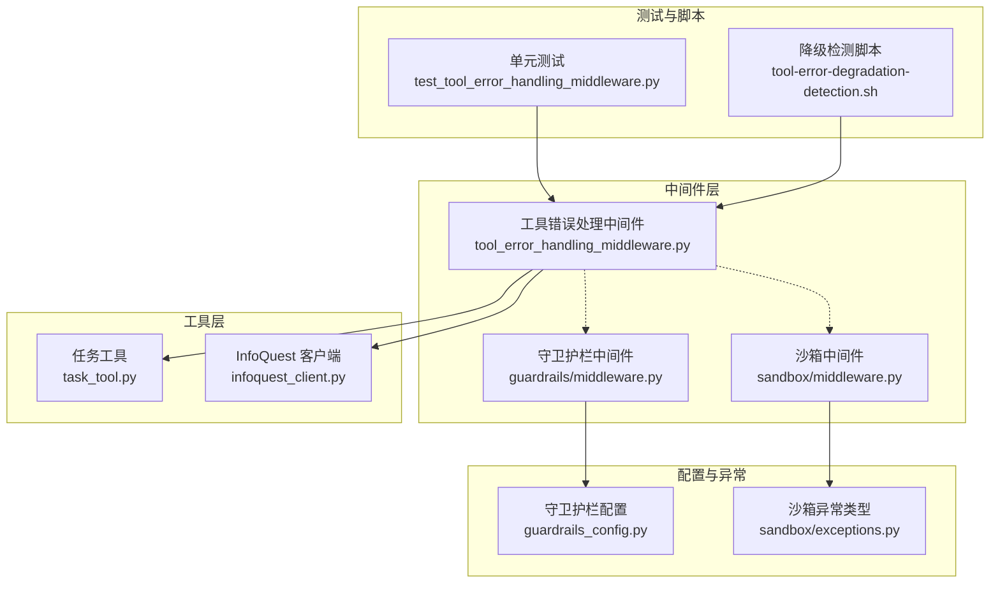
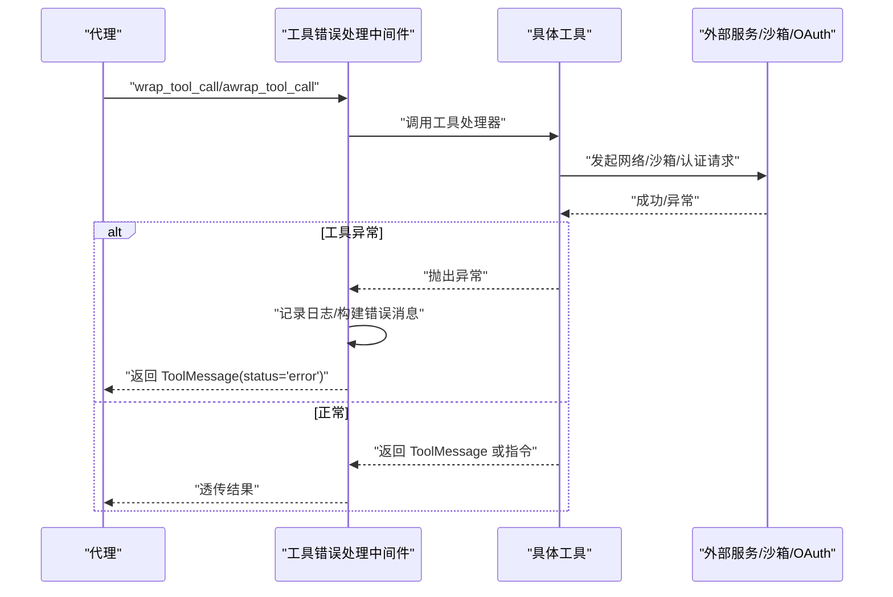
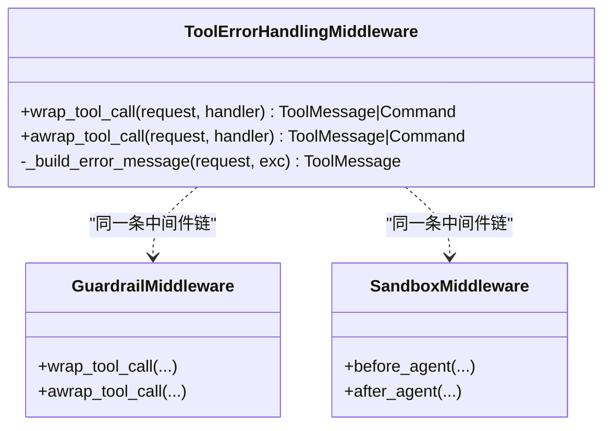
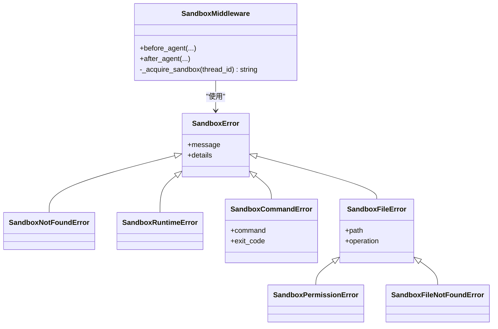
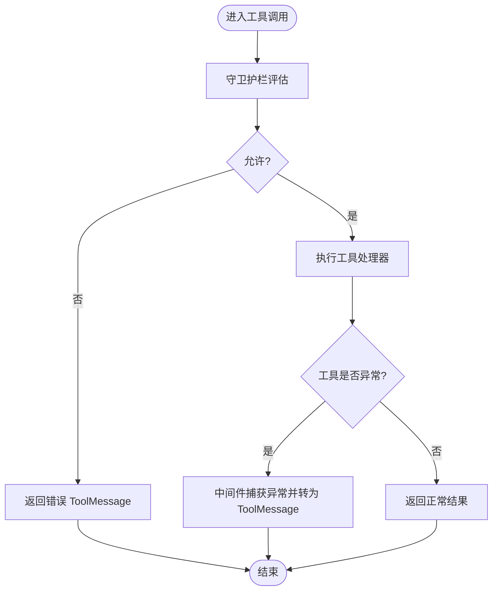
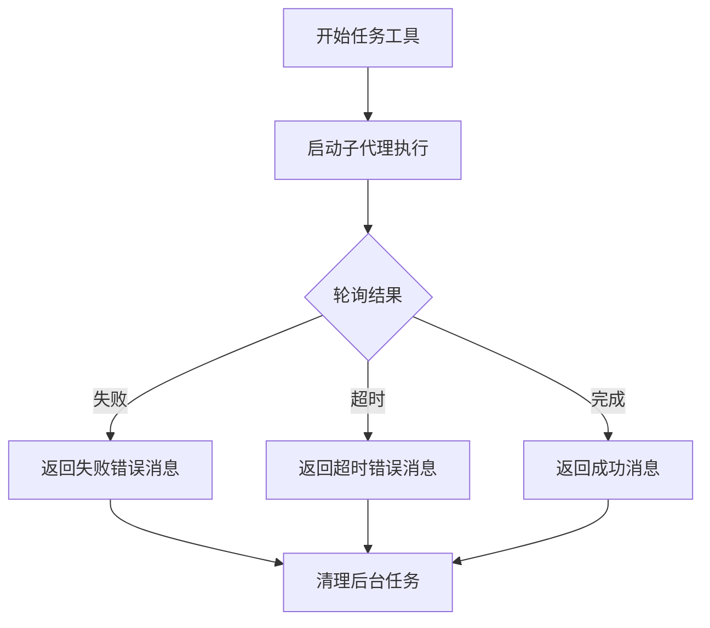

# 工具错误处理中间件

<cite>
**本文引用的文件**
- [tool_error_handling_middleware.py](file://backend/packages/harness/deerflow/agents/middlewares/tool_error_handling_middleware.py)
- [test_tool_error_handling_middleware.py](file://backend/tests/test_tool_error_handling_middleware.py)
- [middleware.py](file://backend/packages/harness/deerflow/guardrails/middleware.py)
- [guardrails_config.py](file://backend/packages/harness/deerflow/config/guardrails_config.py)
- [middleware.py](file://backend/packages/harness/deerflow/sandbox/middleware.py)
- [exceptions.py](file://backend/packages/harness/deerflow/sandbox/exceptions.py)
- [task_tool.py](file://backend/packages/harness/deerflow/tools/builtins/task_tool.py)
- [infoquest_client.py](file://backend/packages/harness/deerflow/community/infoquest/infoquest_client.py)
- [oauth.py](file://backend/packages/harness/deerflow/mcp/oauth.py)
- [API.md](file://backend/docs/API.md)
- [tool-error-degradation-detection.sh](file://scripts/tool-error-degradation-detection.sh)
</cite>

## 目录
1. [简介](#简介)
2. [项目结构](#项目结构)
3. [核心组件](#核心组件)
4. [架构总览](#架构总览)
5. [详细组件分析](#详细组件分析)
6. [依赖关系分析](#依赖关系分析)
7. [性能考量](#性能考量)
8. [故障排查指南](#故障排查指南)
9. [结论](#结论)
10. [附录](#附录)

## 简介
本技术文档围绕 DeerFlow 的“工具错误处理中间件”展开，系统性阐述工具调用过程中错误的捕获、转换与恢复机制。文档覆盖以下关键点：
- 错误分类与处理策略：网络错误、超时错误、认证错误、沙箱错误等
- 错误重试机制与降级策略：中间件如何保证流程不中断、如何生成用户可理解的错误消息
- 配置项与扩展点：Guardrails 中间件、沙箱中间件、OAuth 认证等对错误处理的影响
- 监控与可观测性：日志记录、错误消息内容规范、测试脚本验证
- 最佳实践：在工具执行系统中的集成方式与建议

## 项目结构
与工具错误处理中间件直接相关的模块分布如下：
- 中间件层：工具错误处理中间件、沙箱中间件、守卫护栏中间件
- 工具层：内置任务工具、第三方搜索工具等
- 配置层：守卫护栏配置
- 异常层：沙箱相关异常类型
- 测试与脚本：单元测试与降级检测脚本

图表来源
- [tool_error_handling_middleware.py:1-138](file://backend/packages/harness/deerflow/agents/middlewares/tool_error_handling_middleware.py#L1-L138)
- [middleware.py:1-84](file://backend/packages/harness/deerflow/sandbox/middleware.py#L1-L84)
- [middleware.py:1-99](file://backend/packages/harness/deerflow/guardrails/middleware.py#L1-L99)
- [guardrails_config.py:1-49](file://backend/packages/harness/deerflow/config/guardrails_config.py#L1-L49)
- [exceptions.py:1-72](file://backend/packages/harness/deerflow/sandbox/exceptions.py#L1-L72)
- [task_tool.py:1-196](file://backend/packages/harness/deerflow/tools/builtins/task_tool.py#L1-L196)
- [infoquest_client.py:1-405](file://backend/packages/harness/deerflow/community/infoquest/infoquest_client.py#L1-L405)
- [test_tool_error_handling_middleware.py:1-97](file://backend/tests/test_tool_error_handling_middleware.py#L1-L97)
- [tool-error-degradation-detection.sh:1-218](file://scripts/tool-error-degradation-detection.sh#L1-L218)

章节来源
- [tool_error_handling_middleware.py:1-138](file://backend/packages/harness/deerflow/agents/middlewares/tool_error_handling_middleware.py#L1-L138)
- [middleware.py:1-84](file://backend/packages/harness/deerflow/sandbox/middleware.py#L1-L84)
- [middleware.py:1-99](file://backend/packages/harness/deerflow/guardrails/middleware.py#L1-L99)
- [guardrails_config.py:1-49](file://backend/packages/harness/deerflow/config/guardrails_config.py#L1-L49)
- [exceptions.py:1-72](file://backend/packages/harness/deerflow/sandbox/exceptions.py#L1-L72)
- [task_tool.py:1-196](file://backend/packages/harness/deerflow/tools/builtins/task_tool.py#L1-L196)
- [infoquest_client.py:1-405](file://backend/packages/harness/deerflow/community/infoquest/infoquest_client.py#L1-L405)
- [test_tool_error_handling_middleware.py:1-97](file://backend/tests/test_tool_error_handling_middleware.py#L1-L97)
- [tool-error-degradation-detection.sh:1-218](file://scripts/tool-error-degradation-detection.sh#L1-L218)

## 核心组件
- 工具错误处理中间件（ToolErrorHandlingMiddleware）
  - 职责：将工具执行中的异常转换为 ToolMessage，使运行时继续，避免中断
  - 关键行为：捕获异常、构建统一错误消息、保留 Graph 控制信号（如中断/暂停/恢复）
  - 支持同步与异步工具调用包装
- 沙箱中间件（SandboxMiddleware）
  - 职责：按需获取/释放沙箱环境，复用线程上下文中的沙箱实例
  - 对错误处理的影响：若沙箱获取失败或命令执行失败，会通过沙箱异常类型提供结构化错误信息
- 守卫护栏中间件（GuardrailMiddleware）
  - 职责：在工具执行前进行策略评估；当提供方错误时，根据 fail_closed 决定阻断或放行
  - 对错误处理的影响：可能在工具执行前就返回错误 ToolMessage，或在执行后由工具错误处理中间件接管
- 任务工具（task_tool）
  - 职责：委派子代理执行复杂任务，并轮询结果；在失败/超时时返回结构化错误消息
- InfoQuest 客户端（infoquest_client）
  - 职责：封装网络请求与响应解析；在异常时返回统一的错误字符串
- OAuth 工具拦截器（mcp/oauth）
  - 职责：为 MCP 服务器注入认证头；认证失败或异常时影响工具可用性
- 守卫护栏配置（guardrails_config）
  - 职责：提供启用/禁用、fail-closed、passport、provider 等配置项

章节来源
- [tool_error_handling_middleware.py:19-66](file://backend/packages/harness/deerflow/agents/middlewares/tool_error_handling_middleware.py#L19-L66)
- [middleware.py:21-84](file://backend/packages/harness/deerflow/sandbox/middleware.py#L21-L84)
- [middleware.py:20-99](file://backend/packages/harness/deerflow/guardrails/middleware.py#L20-L99)
- [task_tool.py:120-196](file://backend/packages/harness/deerflow/tools/builtins/task_tool.py#L120-L196)
- [infoquest_client.py:45-108](file://backend/packages/harness/deerflow/community/infoquest/infoquest_client.py#L45-L108)
- [oauth.py:44-150](file://backend/packages/harness/deerflow/mcp/oauth.py#L44-L150)
- [guardrails_config.py:13-35](file://backend/packages/harness/deerflow/config/guardrails_config.py#L13-L35)

## 架构总览
工具错误处理中间件位于工具执行链路的关键位置，负责在异常发生时将其转换为可被下游消费的消息格式，从而维持对话/任务流程的连续性。

图表来源
- [tool_error_handling_middleware.py:37-66](file://backend/packages/harness/deerflow/agents/middlewares/tool_error_handling_middleware.py#L37-L66)
- [middleware.py:21-84](file://backend/packages/harness/deerflow/sandbox/middleware.py#L21-L84)
- [middleware.py:54-98](file://backend/packages/harness/deerflow/guardrails/middleware.py#L54-L98)
- [task_tool.py:120-196](file://backend/packages/harness/deerflow/tools/builtins/task_tool.py#L120-L196)
- [infoquest_client.py:45-108](file://backend/packages/harness/deerflow/community/infoquest/infoquest_client.py#L45-L108)
- [oauth.py:122-137](file://backend/packages/harness/deerflow/mcp/oauth.py#L122-L137)

## 详细组件分析

### 工具错误处理中间件（ToolErrorHandlingMiddleware）
- 设计要点
  - 同步与异步包装方法分别捕获异常并统一转换为 ToolMessage
  - 保留 Graph 控制信号（GraphBubbleUp），确保中断/暂停/恢复语义不被吞掉
  - 错误消息包含工具名、错误类型与摘要，必要时截断细节长度
  - 当工具调用 ID 缺失时使用占位符，保证消息完整性
- 错误分类与处理策略
  - 网络错误：由具体工具/客户端捕获并返回错误字符串，中间件将其转换为 ToolMessage
  - 超时错误：由具体工具的轮询/等待逻辑返回错误字符串，中间件同样转换
  - 认证错误：OAuth 失败或无效凭据导致工具不可用，中间件在工具抛出异常时转换
  - 沙箱错误：沙箱命令/文件操作失败，通过沙箱异常类型提供结构化细节，中间件转换为 ToolMessage
- 用户友好错误信息
  - 统一模板包含工具名、错误类型与简要描述，引导用户选择替代方案
  - 限制消息长度，避免过长输出影响下游处理

图表来源
- [tool_error_handling_middleware.py:19-66](file://backend/packages/harness/deerflow/agents/middlewares/tool_error_handling_middleware.py#L19-L66)
- [middleware.py:20-99](file://backend/packages/harness/deerflow/guardrails/middleware.py#L20-L99)
- [middleware.py:21-84](file://backend/packages/harness/deerflow/sandbox/middleware.py#L21-L84)

章节来源
- [tool_error_handling_middleware.py:19-66](file://backend/packages/harness/deerflow/agents/middlewares/tool_error_handling_middleware.py#L19-L66)
- [test_tool_error_handling_middleware.py:17-97](file://backend/tests/test_tool_error_handling_middleware.py#L17-L97)

### 沙箱中间件与沙箱异常
- 沙箱中间件
  - 支持惰性初始化与急切初始化两种模式，避免重复创建沙箱实例
  - 在代理生命周期结束后释放沙箱，减少资源浪费
- 沙箱异常类型
  - 提供基类与多种专用异常（未找到、运行时错误、命令错误、文件错误、权限错误、文件未找到等）
  - 异常对象携带结构化详情（如命令、退出码、路径、操作），便于诊断与日志记录

图表来源
- [middleware.py:21-84](file://backend/packages/harness/deerflow/sandbox/middleware.py#L21-L84)
- [exceptions.py:4-72](file://backend/packages/harness/deerflow/sandbox/exceptions.py#L4-L72)

章节来源
- [middleware.py:21-84](file://backend/packages/harness/deerflow/sandbox/middleware.py#L21-L84)
- [exceptions.py:4-72](file://backend/packages/harness/deerflow/sandbox/exceptions.py#L4-L72)

### 守卫护栏中间件与配置
- 守卫护栏中间件
  - 在工具执行前评估策略，若拒绝则返回错误 ToolMessage
  - 若提供方异常，根据 fail_closed 决定阻断或放行
- 配置项
  - enabled：是否启用
  - fail_closed：提供方错误时是否阻断
  - passport：代理标识
  - provider：提供方类路径与参数

图表来源
- [middleware.py:54-98](file://backend/packages/harness/deerflow/guardrails/middleware.py#L54-L98)
- [guardrails_config.py:13-35](file://backend/packages/harness/deerflow/config/guardrails_config.py#L13-L35)

章节来源
- [middleware.py:20-99](file://backend/packages/harness/deerflow/guardrails/middleware.py#L20-L99)
- [guardrails_config.py:13-35](file://backend/packages/harness/deerflow/config/guardrails_config.py#L13-L35)

### 具体工具的错误处理
- 任务工具（task_tool）
  - 背景执行与轮询：在失败/超时场景返回结构化错误消息，同时清理后台任务
  - 轮询超时保护：设置最大轮询次数，避免线程池超时不生效导致的卡死
- InfoQuest 客户端（infoquest_client）
  - 网络请求异常时返回统一错误字符串，便于上层中间件转换
  - 响应格式异常时提供回退逻辑与日志记录

图表来源
- [task_tool.py:120-196](file://backend/packages/harness/deerflow/tools/builtins/task_tool.py#L120-L196)

章节来源
- [task_tool.py:120-196](file://backend/packages/harness/deerflow/tools/builtins/task_tool.py#L120-L196)
- [infoquest_client.py:45-108](file://backend/packages/harness/deerflow/community/infoquest/infoquest_client.py#L45-L108)

### 认证与错误传播
- OAuth 工具拦截器
  - 为 MCP 服务器注入 Authorization 头；若获取令牌失败，工具无法获得有效凭据
  - 中间件在工具抛出异常时捕获并转换为 ToolMessage，保持流程连续

章节来源
- [oauth.py:44-150](file://backend/packages/harness/deerflow/mcp/oauth.py#L44-L150)
- [tool_error_handling_middleware.py:43-65](file://backend/packages/harness/deerflow/agents/middlewares/tool_error_handling_middleware.py#L43-L65)

## 依赖关系分析
- 中间件链路
  - 线程数据中间件 → 沙箱中间件 → 可选上传中间件 → 可选悬空工具调用修复中间件 → 守卫护栏中间件 → 工具错误处理中间件
- 关键耦合点
  - 工具错误处理中间件与具体工具/外部服务解耦，仅依赖 ToolMessage 规范
  - 沙箱中间件与沙箱提供者解耦，通过 Provider 接口管理生命周期
  - 守卫护栏中间件与提供方实现解耦，通过配置注入

图表来源
- [tool_error_handling_middleware.py:68-138](file://backend/packages/harness/deerflow/agents/middlewares/tool_error_handling_middleware.py#L68-L138)

章节来源
- [tool_error_handling_middleware.py:68-138](file://backend/packages/harness/deerflow/agents/middlewares/tool_error_handling_middleware.py#L68-L138)

## 性能考量
- 中间件开销
  - 同步/异步包装均为轻量封装，异常分支才产生额外日志与消息构造
- 沙箱复用
  - 惰性初始化与跨轮次复用可显著降低沙箱获取/释放成本
- 轮询与超时
  - 任务工具设置合理的轮询间隔与最大轮询次数，避免长时间占用资源
- 日志级别
  - 错误处理中间件在异常时记录详细日志，建议在生产中结合采样与结构化日志

## 故障排查指南
- 常见问题定位
  - 工具调用异常但流程中断：检查是否抛出了 Graph 控制信号（如中断）被中间件吞掉
  - 错误消息为空或过长：确认工具返回值与中间件消息截断逻辑
  - 沙箱相关错误：查看沙箱异常类型与详情字段，定位命令/文件/权限问题
  - 守卫护栏导致的阻断：检查 fail_closed 与提供方错误处理策略
- 单元测试与降级检测
  - 单元测试覆盖同步/异步异常、缺失工具调用 ID、Graph 控制信号透传
  - 降级检测脚本验证中间件链路在工具失败时不会导致对话流程中断

章节来源
- [test_tool_error_handling_middleware.py:17-97](file://backend/tests/test_tool_error_handling_middleware.py#L17-L97)
- [tool-error-degradation-detection.sh:1-218](file://scripts/tool-error-degradation-detection.sh#L1-L218)

## 结论
工具错误处理中间件通过“异常捕获-消息转换-流程恢复”的机制，确保工具调用失败不会中断整体对话/任务流程。配合沙箱中间件、守卫护栏中间件与具体工具的错误处理策略，系统实现了对网络、超时、认证、沙箱等多类错误的稳健应对。建议在生产环境中结合日志采样、结构化监控与合理的超时/重试策略，持续优化用户体验与系统稳定性。

## 附录

### 错误处理配置选项
- 守卫护栏配置（guardrails_config）
  - enabled：启用/禁用
  - fail_closed：提供方错误时阻断/放行
  - passport：代理标识
  - provider：提供方类路径与参数

章节来源
- [guardrails_config.py:13-35](file://backend/packages/harness/deerflow/config/guardrails_config.py#L13-L35)

### 错误重试与降级策略
- 重试策略
  - 中间件不内置自动重试；可在上游工具层实现指数退避与抖动（参考模型提供者的退避计算思路）
- 降级策略
  - 工具错误处理中间件将异常转换为 ToolMessage 并继续流程
  - 守卫护栏中间件在 fail_closed 下阻断，在 fail_closed=False 下放行并警告

章节来源
- [tool_error_handling_middleware.py:43-65](file://backend/packages/harness/deerflow/agents/middlewares/tool_error_handling_middleware.py#L43-L65)
- [middleware.py:66-71](file://backend/packages/harness/deerflow/guardrails/middleware.py#L66-L71)

### 监控指标与日志
- 日志记录
  - 中间件在同步/异步失败时记录异常详情与工具调用上下文
  - 沙箱中间件记录获取/释放沙箱的日志
- API 错误响应
  - 后端 API 使用统一的错误响应格式，便于前端展示与调试

章节来源
- [tool_error_handling_middleware.py:49-64](file://backend/packages/harness/deerflow/agents/middlewares/tool_error_handling_middleware.py#L49-L64)
- [middleware.py:45-79](file://backend/packages/harness/deerflow/sandbox/middleware.py#L45-L79)
- [API.md:508-538](file://backend/docs/API.md#L508-L538)