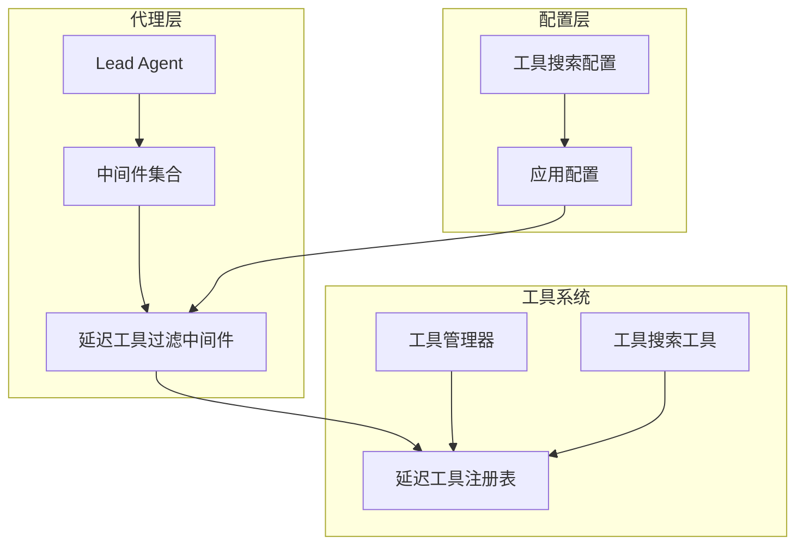
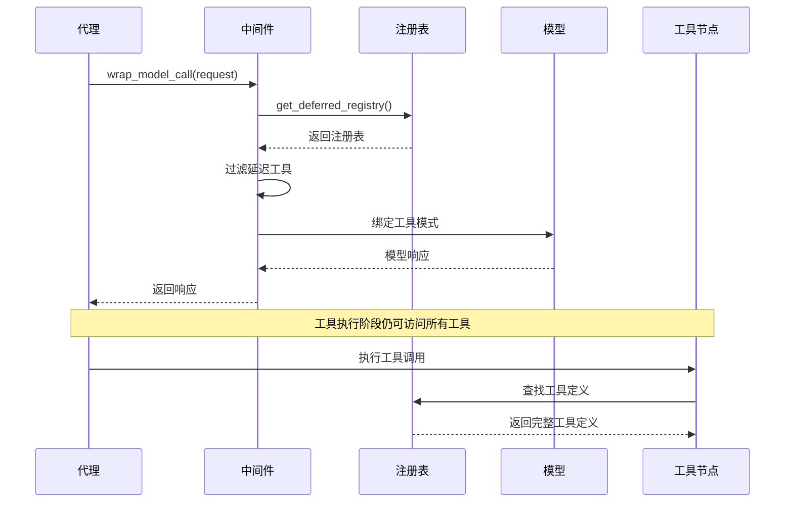
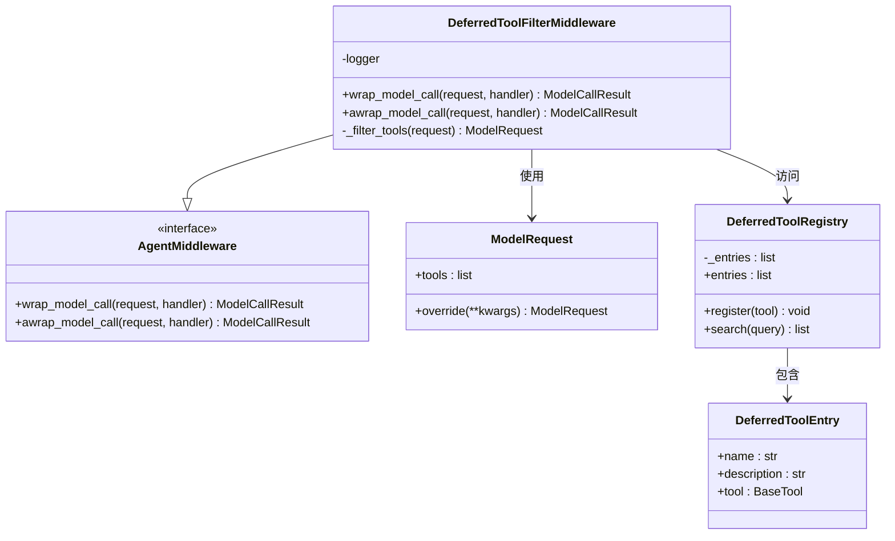
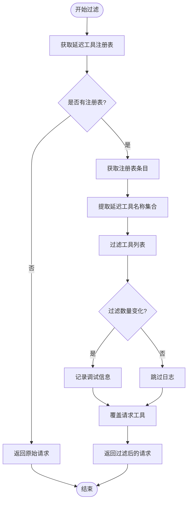
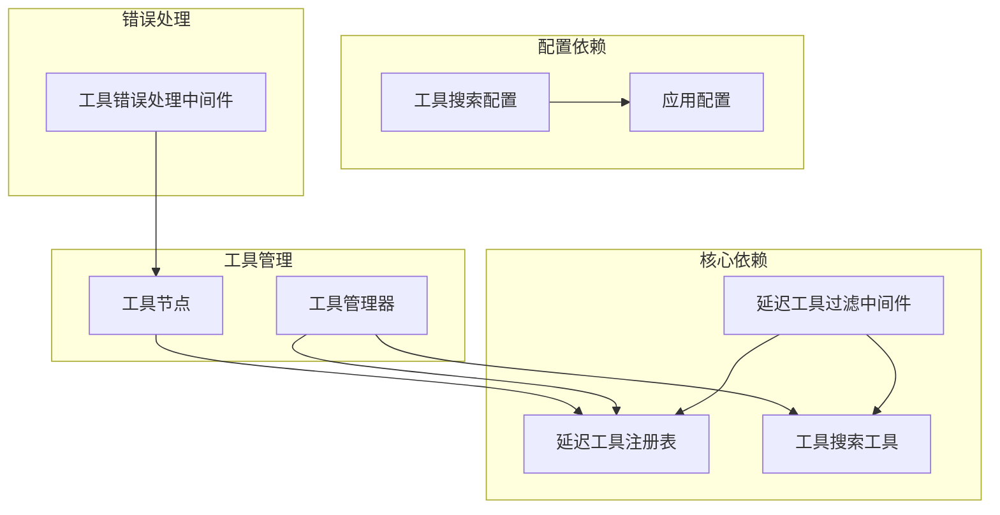

# 延迟工具过滤中间件

<cite>
**本文档引用的文件**
- [deferred_tool_filter_middleware.py](file://backend/packages/harness/deerflow/agents/middlewares/deferred_tool_filter_middleware.py)
- [tool_search.py](file://backend/packages/harness/deerflow/tools/builtins/tool_search.py)
- [tools.py](file://backend/packages/harness/deerflow/tools/tools.py)
- [agent.py](file://backend/packages/harness/deerflow/agents/lead_agent/agent.py)
- [tool_search_config.py](file://backend/packages/harness/deerflow/config/tool_search_config.py)
- [tool_error_handling_middleware.py](file://backend/packages/harness/deerflow/agents/middlewares/tool_error_handling_middleware.py)
- [test_tool_search.py](file://backend/tests/test_tool_search.py)
</cite>

## 目录
1. [简介](#简介)
2. [项目结构](#项目结构)
3. [核心组件](#核心组件)
4. [架构概览](#架构概览)
5. [详细组件分析](#详细组件分析)
6. [依赖关系分析](#依赖关系分析)
7. [性能考虑](#性能考虑)
8. [故障排除指南](#故障排除指南)
9. [结论](#结论)

## 简介

延迟工具过滤中间件是 DeerFlow 工具执行系统中的关键组件，负责在模型绑定阶段过滤掉延迟加载的工具模式定义。该中间件确保当启用工具搜索功能时，MCP 工具被注册到延迟工具注册表中，但其模式定义不会发送给 LLM 进行绑定，从而节省上下文令牌并提高系统效率。

该中间件通过拦截模型调用请求，在工具绑定之前移除延迟工具的模式定义，同时保持 ToolNode 拥有所有工具（包括延迟工具）用于执行路由。代理通过工具搜索工具在运行时发现延迟工具。

## 项目结构

DeerFlow 采用分层架构设计，延迟工具过滤中间件位于代理中间件层，与工具系统紧密集成：

**图表来源**
- [agent.py:248-252](file://backend/packages/harness/deerflow/agents/lead_agent/agent.py#L248-L252)
- [deferred_tool_filter_middleware.py:31-44](file://backend/packages/harness/deerflow/agents/middlewares/deferred_tool_filter_middleware.py#L31-L44)
- [tool_search.py:39-98](file://backend/packages/harness/deerflow/tools/builtins/tool_search.py#L39-L98)

**章节来源**
- [agent.py:248-265](file://backend/packages/harness/deerflow/agents/lead_agent/agent.py#L248-L265)
- [deferred_tool_filter_middleware.py:1-61](file://backend/packages/harness/deerflow/agents/middlewares/deferred_tool_filter_middleware.py#L1-L61)

## 核心组件

### 延迟工具过滤中间件

延迟工具过滤中间件是整个延迟工具系统的核心组件，负责在模型绑定阶段过滤工具模式定义：

- **主要职责**：拦截模型调用请求，移除延迟工具的模式定义
- **实现机制**：通过 `wrap_model_call` 和 `awrap_model_call` 方法拦截请求
- **过滤逻辑**：基于延迟工具注册表中的条目名称进行过滤
- **日志记录**：记录过滤操作的调试信息

### 延迟工具注册表

延迟工具注册表管理延迟加载的工具条目：

- **数据结构**：存储 `DeferredToolEntry` 对象列表
- **查询能力**：支持多种查询模式（精确匹配、关键字搜索、正则表达式）
- **上下文隔离**：使用 `ContextVar` 确保并发请求的独立性
- **结果限制**：最多返回 5 个匹配结果

### 工具搜索工具

工具搜索工具提供运行时工具发现功能：

- **查询语法**：支持 `select:`、`+` 前缀和正则表达式查询
- **序列化格式**：使用 OpenAI 函数格式进行工具模式定义序列化
- **错误处理**：优雅处理无可用工具和查询不匹配的情况

**章节来源**
- [deferred_tool_filter_middleware.py:23-61](file://backend/packages/harness/deerflow/agents/middlewares/deferred_tool_filter_middleware.py#L23-L61)
- [tool_search.py:39-177](file://backend/packages/harness/deerflow/tools/builtins/tool_search.py#L39-L177)

## 架构概览

延迟工具过滤中间件在整个 DeerFlow 架构中的位置和作用：

**图表来源**
- [deferred_tool_filter_middleware.py:46-60](file://backend/packages/harness/deerflow/agents/middlewares/deferred_tool_filter_middleware.py#L46-L60)
- [tool_search.py:142-177](file://backend/packages/harness/deerflow/tools/builtins/tool_search.py#L142-L177)

## 详细组件分析

### 延迟工具过滤中间件类图

**图表来源**
- [deferred_tool_filter_middleware.py:23-61](file://backend/packages/harness/deerflow/agents/middlewares/deferred_tool_filter_middleware.py#L23-L61)
- [tool_search.py:30-37](file://backend/packages/harness/deerflow/tools/builtins/tool_search.py#L30-L37)
- [tool_search.py:39-98](file://backend/packages/harness/deerflow/tools/builtins/tool_search.py#L39-L98)

### 过滤流程分析

延迟工具过滤的具体实现流程：

**图表来源**
- [deferred_tool_filter_middleware.py:31-44](file://backend/packages/harness/deerflow/agents/middlewares/deferred_tool_filter_middleware.py#L31-L44)

### 工具搜索查询机制

工具搜索支持三种查询模式：

1. **精确选择查询** (`select:name1,name2`)
   - 直接匹配指定的工具名称
   - 返回精确匹配的工具定义

2. **关键字查询** (`+keyword rest`)
   - 要求工具名称包含关键词
   - 按剩余关键词进行排序

3. **正则表达式查询** (`keyword query`)
   - 在名称和描述中进行正则匹配
   - 名称匹配优先于描述匹配

**章节来源**
- [deferred_tool_filter_middleware.py:31-44](file://backend/packages/harness/deerflow/agents/middlewares/deferred_tool_filter_middleware.py#L31-L44)
- [tool_search.py:54-94](file://backend/packages/harness/deerflow/tools/builtins/tool_search.py#L54-L94)

## 依赖关系分析

延迟工具过滤中间件与其他组件的依赖关系：

**图表来源**
- [agent.py:248-252](file://backend/packages/harness/deerflow/agents/lead_agent/agent.py#L248-L252)
- [tools.py:83-94](file://backend/packages/harness/deerflow/tools/tools.py#L83-L94)
- [tool_error_handling_middleware.py:19-66](file://backend/packages/harness/deerflow/agents/middlewares/tool_error_handling_middleware.py#L19-L66)

**章节来源**
- [agent.py:248-265](file://backend/packages/harness/deerflow/agents/lead_agent/agent.py#L248-L265)
- [tools.py:83-115](file://backend/packages/harness/deerflow/tools/tools.py#L83-L115)

## 性能考虑

### 上下文令牌优化

延迟工具过滤中间件通过以下方式优化上下文使用：

- **模式定义延迟**：仅在需要时才发送工具模式定义
- **工具数量控制**：限制每次查询返回的工具数量（最多 5 个）
- **名称优先匹配**：名称匹配比描述匹配更高效

### 并发安全性

使用 `ContextVar` 确保：

- **请求隔离**：每个异步上下文拥有独立的注册表实例
- **线程安全**：同步工具执行时正确继承上下文变量
- **内存管理**：避免并发请求之间的状态污染

### 内存使用优化

- **轻量级条目**：`DeferredToolEntry` 只存储必要信息
- **按需加载**：工具完整定义仅在查询时返回
- **结果缓存**：工具搜索结果在当前请求范围内缓存

## 故障排除指南

### 常见问题诊断

1. **工具未显示在模型绑定中**
   - 检查工具搜索配置是否启用
   - 验证延迟工具注册表是否正确设置
   - 确认中间件是否正确添加到代理配置中

2. **工具搜索无结果**
   - 检查查询语法是否正确
   - 验证工具名称和描述是否包含预期关键词
   - 确认最大结果数量限制

3. **并发请求冲突**
   - 检查 `ContextVar` 是否正确使用
   - 验证异步上下文的正确传递
   - 确认工具注册表重置逻辑

### 错误处理机制

工具错误处理中间件提供以下保护：

- **异常转换**：将工具异常转换为标准的 `ToolMessage`
- **状态标记**：错误消息带有明确的状态标识
- **ID 保护**：自动处理缺失的工具调用 ID
- **控制流保留**：正确处理中断和暂停信号

**章节来源**
- [tool_error_handling_middleware.py:19-66](file://backend/packages/harness/deerflow/agents/middlewares/tool_error_handling_middleware.py#L19-L66)
- [test_tool_search.py:331-394](file://backend/tests/test_tool_search.py#L331-L394)

## 结论

延迟工具过滤中间件是 DeerFlow 工具执行系统中实现延迟加载和上下文优化的关键组件。通过智能的工具模式过滤、灵活的查询机制和健壮的错误处理，该中间件实现了高效的工具管理，既保证了系统的响应能力，又提供了强大的工具发现和调用功能。

该组件的设计充分考虑了现代 AI 应用的需求，通过延迟加载机制显著减少了上下文开销，同时保持了工具调用的灵活性和可靠性。配合工具错误处理中间件，整个系统形成了一个高效、稳定且易于维护的工具执行环境。