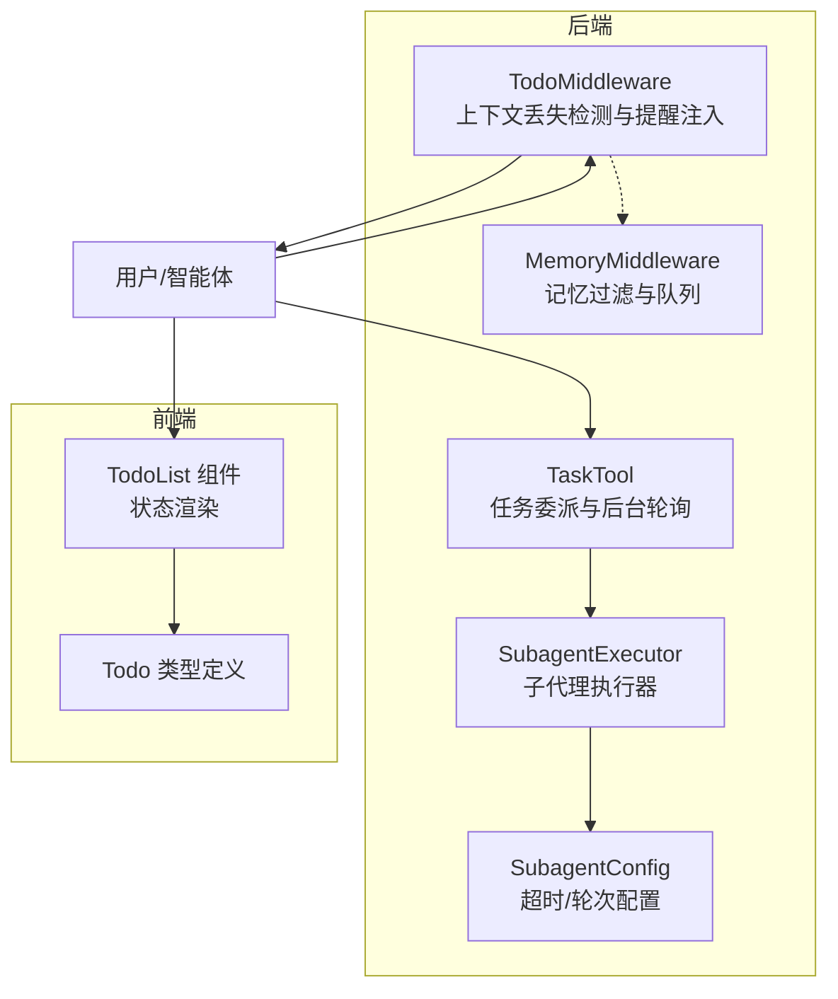
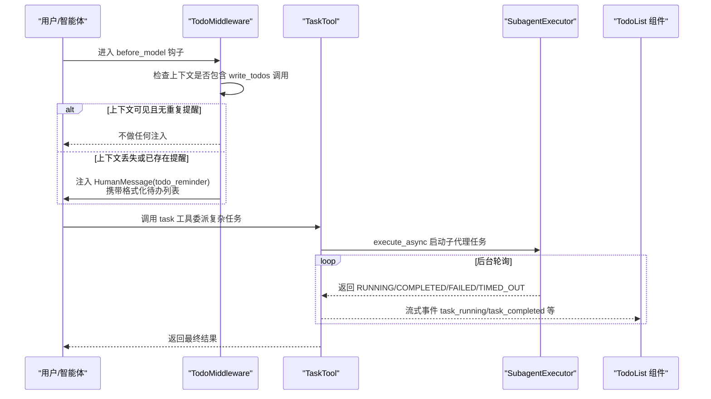
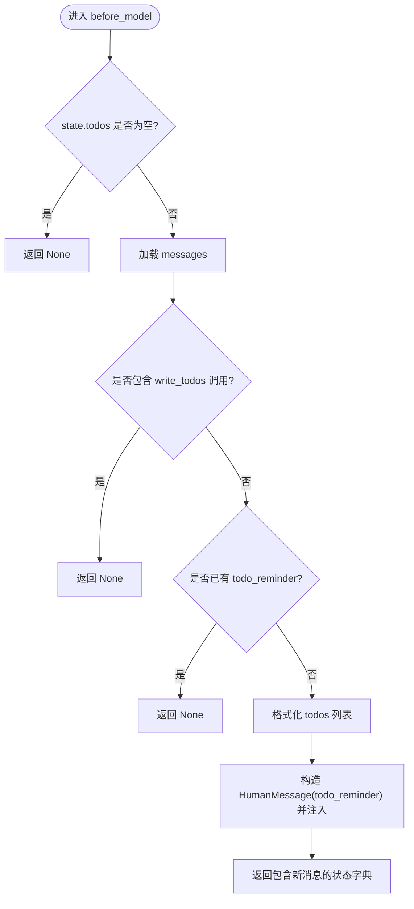
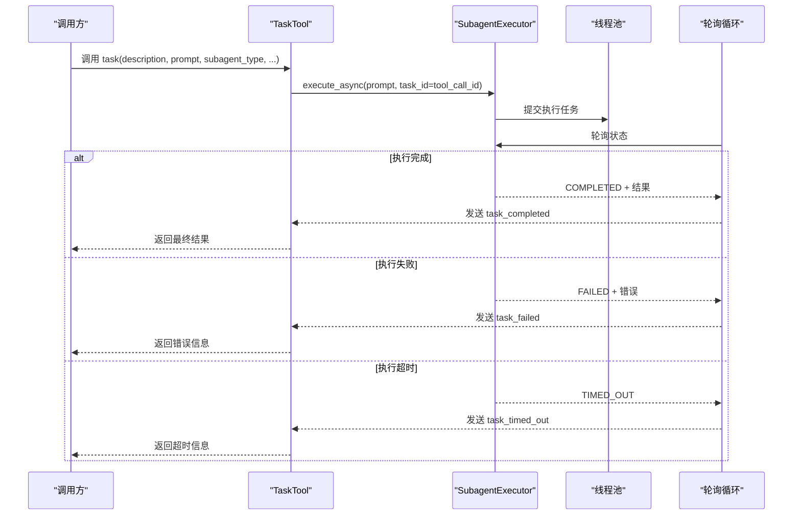
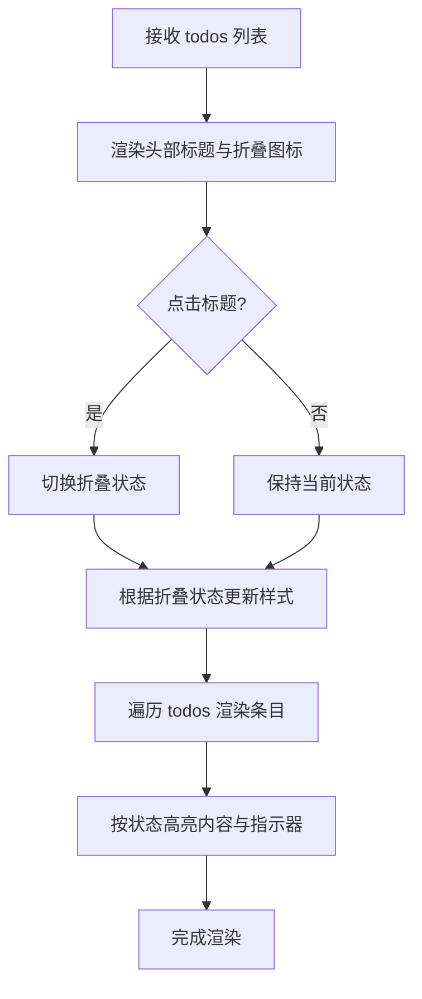
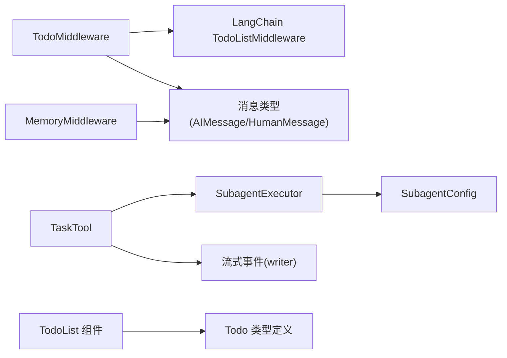

# 待办事项中间件

<cite>
**本文引用的文件**
- [todo_middleware.py](file://backend/packages/harness/deerflow/agents/middlewares/todo_middleware.py)
- [task_tool.py](file://backend/packages/harness/deerflow/tools/builtins/task_tool.py)
- [agent.py](file://backend/packages/harness/deerflow/agents/lead_agent/agent.py)
- [todo-list.tsx](file://frontend/src/components/workspace/todo-list.tsx)
- [types.ts](file://frontend/src/core/todos/types.ts)
- [task_tool_improvements.md](file://backend/docs/task_tool_improvements.md)
- [test_todo_middleware.py](file://backend/tests/test_todo_middleware.py)
- [test_task_tool_core_logic.py](file://backend/tests/test_task_tool_core_logic.py)
- [memory_middleware.py](file://backend/packages/harness/deerflow/agents/middlewares/memory_middleware.py)
- [config.py](file://backend/packages/harness/deerflow/subagents/config.py)
- [executor.py](file://backend/packages/harness/deerflow/subagents/executor.py)
</cite>

## 目录
1. [简介](#简介)
2. [项目结构](#项目结构)
3. [核心组件](#核心组件)
4. [架构总览](#架构总览)
5. [详细组件分析](#详细组件分析)
6. [依赖分析](#依赖分析)
7. [性能考虑](#性能考虑)
8. [故障排查指南](#故障排查指南)
9. [结论](#结论)
10. [附录](#附录)

## 简介
本技术文档围绕 DeerFlow 的“待办事项中间件”展开，系统性阐述智能体如何识别、管理与持续追踪待办任务列表；解释任务提取与写入流程、优先级与状态管理策略、复杂任务拆解为可执行子任务的方法；并给出任务管理配置项、状态跟踪机制、与任务工具的集成关系以及执行优化策略。文档同时覆盖前后端交互、中间件上下文丢失检测与恢复、以及子代理（Subagent）任务委托与进度监控。

## 项目结构
待办事项相关能力由后端中间件、工具与前端组件协同实现：
- 后端中间件：在消息上下文被截断时自动注入提醒，确保模型始终感知当前待办列表
- 任务工具：将复杂任务委派给子代理，异步执行并在后台轮询结果，向调用方返回最终结果
- 前端组件：展示实时待办列表，支持折叠/展开与状态高亮
- 配置与执行：子代理配置包含超时、最大轮次等参数，执行器负责线程池调度与超时控制

图表来源
- [todo_middleware.py:47-101](file://backend/packages/harness/deerflow/agents/middlewares/todo_middleware.py#L47-L101)
- [task_tool.py:21-196](file://backend/packages/harness/deerflow/tools/builtins/task_tool.py#L21-L196)
- [config.py:6-29](file://backend/packages/harness/deerflow/subagents/config.py#L6-L29)
- [executor.py:424-442](file://backend/packages/harness/deerflow/subagents/executor.py#L424-L442)
- [todo-list.tsx:14-100](file://frontend/src/components/workspace/todo-list.tsx#L14-L100)
- [types.ts:1-5](file://frontend/src/core/todos/types.ts#L1-L5)
- [memory_middleware.py:86-150](file://backend/packages/harness/deerflow/agents/middlewares/memory_middleware.py#L86-L150)

章节来源
- [todo_middleware.py:1-101](file://backend/packages/harness/deerflow/agents/middlewares/todo_middleware.py#L1-L101)
- [task_tool.py:1-196](file://backend/packages/harness/deerflow/tools/builtins/task_tool.py#L1-L196)
- [todo-list.tsx:1-100](file://frontend/src/components/workspace/todo-list.tsx#L1-L100)
- [types.ts:1-5](file://frontend/src/core/todos/types.ts#L1-L5)
- [memory_middleware.py:1-150](file://backend/packages/harness/deerflow/agents/middlewares/memory_middleware.py#L1-L150)
- [config.py:1-29](file://backend/packages/harness/deerflow/subagents/config.py#L1-L29)
- [executor.py:424-442](file://backend/packages/harness/deerflow/subagents/executor.py#L424-L442)

## 核心组件
- 待办事项中间件（TodoMiddleware）
  - 负责在消息历史被截断（如摘要中间件）导致原始写入待办工具调用不可见时，自动注入“待办提醒”消息，使模型继续跟踪与更新待办列表
  - 提供同步与异步的 before_model 钩子，统一处理上下文丢失场景
- 任务工具（TaskTool）
  - 将复杂任务委派给子代理（general-purpose 或 bash），在后台异步执行并轮询状态
  - 自动阻塞直到完成，返回最终结果；内置两层超时保护（执行超时 + 轮询超时）
  - 向流式写入器发送 task_started/task_running/task_completed/task_failed/task_timed_out 等事件，便于前端与日志追踪
- 子代理执行器（SubagentExecutor）
  - 使用独立线程池进行调度与执行，支持超时控制与状态持久化
  - 执行完成后更新后台任务状态与 AI 消息序列
- 前端待办列表组件（TodoList）
  - 渲染待办项，按状态高亮显示，支持折叠/展开
  - 与 Todo 类型定义保持一致的状态集合

章节来源
- [todo_middleware.py:47-101](file://backend/packages/harness/deerflow/agents/middlewares/todo_middleware.py#L47-L101)
- [task_tool.py:21-196](file://backend/packages/harness/deerflow/tools/builtins/task_tool.py#L21-L196)
- [config.py:6-29](file://backend/packages/harness/deerflow/subagents/config.py#L6-L29)
- [executor.py:424-442](file://backend/packages/harness/deerflow/subagents/executor.py#L424-L442)
- [todo-list.tsx:14-100](file://frontend/src/components/workspace/todo-list.tsx#L14-L100)
- [types.ts:1-5](file://frontend/src/core/todos/types.ts#L1-L5)

## 架构总览
下图展示了从用户/智能体到待办中间件、任务工具、子代理执行器，再到前端组件的完整链路，以及上下文丢失检测与恢复的关键路径。

图表来源
- [todo_middleware.py:56-91](file://backend/packages/harness/deerflow/agents/middlewares/todo_middleware.py#L56-L91)
- [task_tool.py:115-196](file://backend/packages/harness/deerflow/tools/builtins/task_tool.py#L115-L196)
- [executor.py:424-442](file://backend/packages/harness/deerflow/subagents/executor.py#L424-L442)
- [todo-list.tsx:14-100](file://frontend/src/components/workspace/todo-list.tsx#L14-L100)

## 详细组件分析

### 待办事项中间件（TodoMiddleware）
- 功能要点
  - 上下文丢失检测：扫描消息历史中是否存在 write_todos 工具调用
  - 防重复提醒：若已存在 todo_reminder，则不再重复注入
  - 提醒注入：当待办列表存在于状态但上下文缺失时，构造 HumanMessage 并携带格式化的待办内容
  - 格式化输出：将待办项转换为“- [状态] 内容”的人类可读字符串
- 关键逻辑
  - before_model/abefore_model：在推理前检查并注入提醒
  - _todos_in_messages/_reminder_in_messages/_format_todos：辅助函数
- 测试覆盖
  - 验证上下文包含/不包含 write_todos 的分支
  - 验证已存在提醒时的短路行为
  - 验证格式化输出的正确性与空列表边界

图表来源
- [todo_middleware.py:56-91](file://backend/packages/harness/deerflow/agents/middlewares/todo_middleware.py#L56-L91)

章节来源
- [todo_middleware.py:19-91](file://backend/packages/harness/deerflow/agents/middlewares/todo_middleware.py#L19-L91)
- [test_todo_middleware.py:38-157](file://backend/tests/test_todo_middleware.py#L38-L157)

### 任务工具（TaskTool）与子代理执行
- 功能要点
  - 子代理类型：general-purpose（通用）、bash（命令行）
  - 参数：描述、提示词、子代理类型、最大轮次（可选）
  - 执行策略：启动后台任务，每 5 秒轮询一次，直至完成/失败/超时
  - 事件流：task_started → task_running（多次） → task_completed/task_failed/task_timed_out
  - 两层超时保护：子代理执行超时（默认 5 分钟）+ 轮询超时（默认 5 分钟）
- 关键流程
  - 获取子代理配置与可用工具（排除 task 工具防止递归）
  - 创建 SubagentExecutor 并 execute_async 异步执行
  - 在轮询循环中根据状态发送事件并处理清理
- 性能与可靠性
  - 后台轮询避免 LLM 反复轮询，降低 API 成本与延迟不确定性
  - 线程池分离调度与执行，避免嵌套线程池资源浪费
  - 超时保护确保不会无限等待

图表来源
- [task_tool.py:115-196](file://backend/packages/harness/deerflow/tools/builtins/task_tool.py#L115-L196)
- [executor.py:424-442](file://backend/packages/harness/deerflow/subagents/executor.py#L424-L442)

章节来源
- [task_tool.py:21-196](file://backend/packages/harness/deerflow/tools/builtins/task_tool.py#L21-L196)
- [task_tool_improvements.md:64-175](file://backend/docs/task_tool_improvements.md#L64-L175)
- [test_task_tool_core_logic.py:78-138](file://backend/tests/test_task_tool_core_logic.py#L78-L138)
- [config.py:6-29](file://backend/packages/harness/deerflow/subagents/config.py#L6-L29)
- [executor.py:424-442](file://backend/packages/harness/deerflow/subagents/executor.py#L424-L442)

### 前端待办列表组件（TodoList）
- 功能要点
  - 展示 Todo 数组，按状态（pending/in_progress/completed）高亮
  - 支持受控/非受控折叠状态切换
  - 与 Todo 类型定义保持一致的状态枚举
- 交互特性
  - 点击标题切换折叠/展开
  - 根据状态动态调整文本颜色与指示器样式

图表来源
- [todo-list.tsx:14-100](file://frontend/src/components/workspace/todo-list.tsx#L14-L100)
- [types.ts:1-5](file://frontend/src/core/todos/types.ts#L1-L5)

章节来源
- [todo-list.tsx:14-100](file://frontend/src/components/workspace/todo-list.tsx#L14-L100)
- [types.ts:1-5](file://frontend/src/core/todos/types.ts#L1-L5)

### 任务提取与优先级排序、状态跟踪机制
- 任务提取与写入
  - 智能体通过 write_todos 工具调用写入/更新待办列表
  - 中间件在上下文丢失时注入提醒，确保后续推理仍能访问待办状态
- 优先级与状态
  - 状态集合：pending（未开始）、in_progress（进行中）、completed（已完成）
  - 最佳实践：立即完成步骤、保持最多一个 in_progress、实时更新列表
- 复杂任务拆解
  - 使用 task 工具委派给子代理，将多步骤、多工具的复杂任务拆分为可执行子任务
  - 子代理在隔离上下文中执行，完成后将结果与中间 AI 消息回传至主流程

章节来源
- [agent.py:100-193](file://backend/packages/harness/deerflow/agents/lead_agent/agent.py#L100-L193)
- [todo_middleware.py:37-44](file://backend/packages/harness/deerflow/agents/middlewares/todo_middleware.py#L37-L44)
- [task_tool.py:21-59](file://backend/packages/harness/deerflow/tools/builtins/task_tool.py#L21-L59)

### 与任务工具的集成关系与执行优化
- 集成点
  - TaskTool 作为任务委派入口，内部使用 SubagentExecutor 执行子代理
  - 通过流式事件向前端与日志推送进度，避免 LLM 主动轮询
- 优化策略
  - 后台轮询：减少 LLM 轮询请求，降低 API 成本与延迟波动
  - 两层超时：执行超时 + 轮询超时，确保系统稳定
  - 线程池分离：调度池与执行池职责清晰，避免嵌套线程池问题

章节来源
- [task_tool_improvements.md:64-175](file://backend/docs/task_tool_improvements.md#L64-L175)
- [task_tool.py:115-196](file://backend/packages/harness/deerflow/tools/builtins/task_tool.py#L115-L196)
- [executor.py:424-442](file://backend/packages/harness/deerflow/subagents/executor.py#L424-L442)

## 依赖分析
- 组件耦合
  - TodoMiddleware 依赖 LangChain 的 TodoListMiddleware，并与消息类型（AIMessage/HumanMessage）协作
  - TaskTool 依赖 SubagentExecutor 与子代理配置，间接依赖工具注册与技能提示段
  - 前端 TodoList 组件依赖 Todo 类型定义，与 UI 组件库协作
- 外部依赖
  - 线程池与超时控制：SubagentExecutor 使用独立线程池，避免资源竞争
  - 记忆中间件：过滤工具消息与中间响应，仅保留用户输入与最终 AI 回答，避免干扰待办上下文

图表来源
- [todo_middleware.py:13-16](file://backend/packages/harness/deerflow/agents/middlewares/todo_middleware.py#L13-L16)
- [task_tool.py:104-113](file://backend/packages/harness/deerflow/tools/builtins/task_tool.py#L104-L113)
- [config.py:6-29](file://backend/packages/harness/deerflow/subagents/config.py#L6-L29)
- [todo-list.tsx:14-100](file://frontend/src/components/workspace/todo-list.tsx#L14-L100)
- [types.ts:1-5](file://frontend/src/core/todos/types.ts#L1-L5)
- [memory_middleware.py:20-83](file://backend/packages/harness/deerflow/agents/middlewares/memory_middleware.py#L20-L83)

章节来源
- [todo_middleware.py:13-16](file://backend/packages/harness/deerflow/agents/middlewares/todo_middleware.py#L13-L16)
- [task_tool.py:104-113](file://backend/packages/harness/deerflow/tools/builtins/task_tool.py#L104-L113)
- [config.py:6-29](file://backend/packages/harness/deerflow/subagents/config.py#L6-L29)
- [memory_middleware.py:20-83](file://backend/packages/harness/deerflow/agents/middlewares/memory_middleware.py#L20-L83)

## 性能考虑
- 减少 LLM 轮询
  - TaskTool 在后台轮询，调用方只需一次工具调用即可获取结果，显著降低 API 请求次数
- 超时与稳定性
  - 子代理执行超时与轮询超时双重保护，避免长时间挂起
  - 线程池分离设计提升资源利用率，避免嵌套线程池带来的性能损耗
- 上下文窗口优化
  - TodoMiddleware 在上下文被截断时自动注入提醒，减少因上下文丢失导致的重复工作与无效调用

## 故障排查指南
- 待办提醒未注入
  - 检查 state.todos 是否为空，以及 messages 中是否已存在 write_todos 或 todo_reminder
  - 确认 before_model/abefore_model 的调用顺序与状态传递
- 任务工具卡住或超时
  - 查看轮询循环中的状态变化与事件输出，确认是否触发了轮询安全超时
  - 检查子代理执行超时配置与线程池健康状况
- 前端待办列表不更新
  - 确认流式事件是否到达前端，检查 TodoList 接收的 todos 数据源
  - 核对 Todo 类型定义与状态值一致性

章节来源
- [test_todo_middleware.py:93-157](file://backend/tests/test_todo_middleware.py#L93-L157)
- [test_task_tool_core_logic.py:208-242](file://backend/tests/test_task_tool_core_logic.py#L208-L242)
- [task_tool.py:128-196](file://backend/packages/harness/deerflow/tools/builtins/task_tool.py#L128-L196)

## 结论
DeerFlow 的待办事项中间件通过上下文丢失检测与提醒注入，确保复杂任务在长对话与上下文截断场景下的连续性；结合任务工具与子代理执行器，实现了复杂任务的委派、异步执行与进度可视化。前端组件提供直观的状态展示，配合两层超时保护与线程池优化，整体具备良好的稳定性与可维护性。

## 附录
- 配置选项与最佳实践
  - 子代理配置：超时时间、最大轮次、允许/禁止工具列表
  - 任务工具：描述、提示词、子代理类型、最大轮次（可选）
  - 智能体待办管理：立即完成步骤、保持单个进行中任务、实时更新列表
- 进度监控
  - 通过流式事件 task_started/task_running/task_completed/task_failed/task_timed_out 实时反馈
  - 前端 TodoList 组件按状态高亮展示，支持折叠/展开

章节来源
- [config.py:6-29](file://backend/packages/harness/deerflow/subagents/config.py#L6-L29)
- [task_tool.py:21-59](file://backend/packages/harness/deerflow/tools/builtins/task_tool.py#L21-L59)
- [agent.py:100-193](file://backend/packages/harness/deerflow/agents/lead_agent/agent.py#L100-L193)
- [task_tool_improvements.md:64-175](file://backend/docs/task_tool_improvements.md#L64-L175)