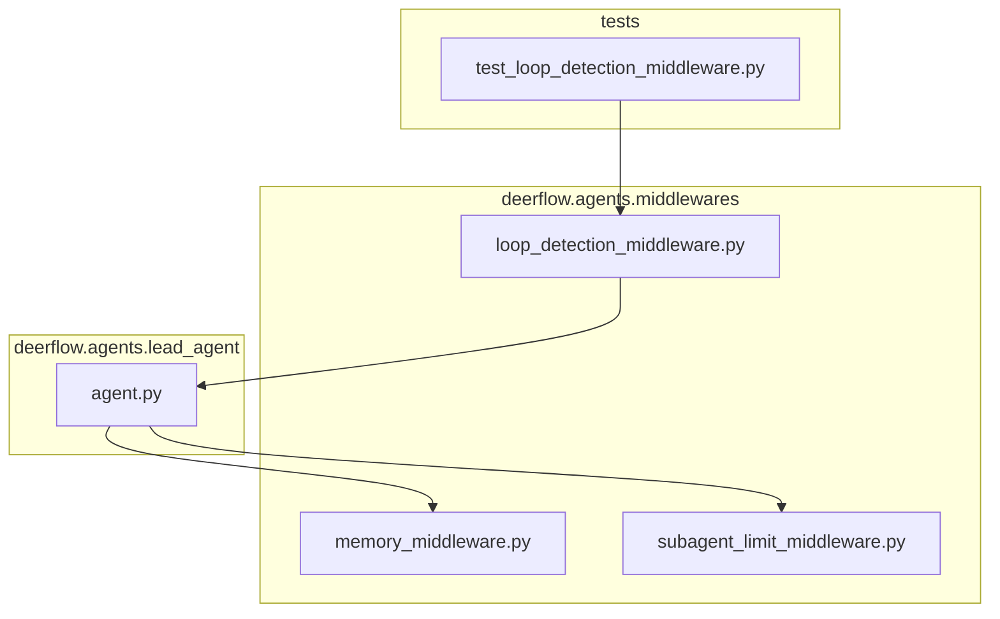
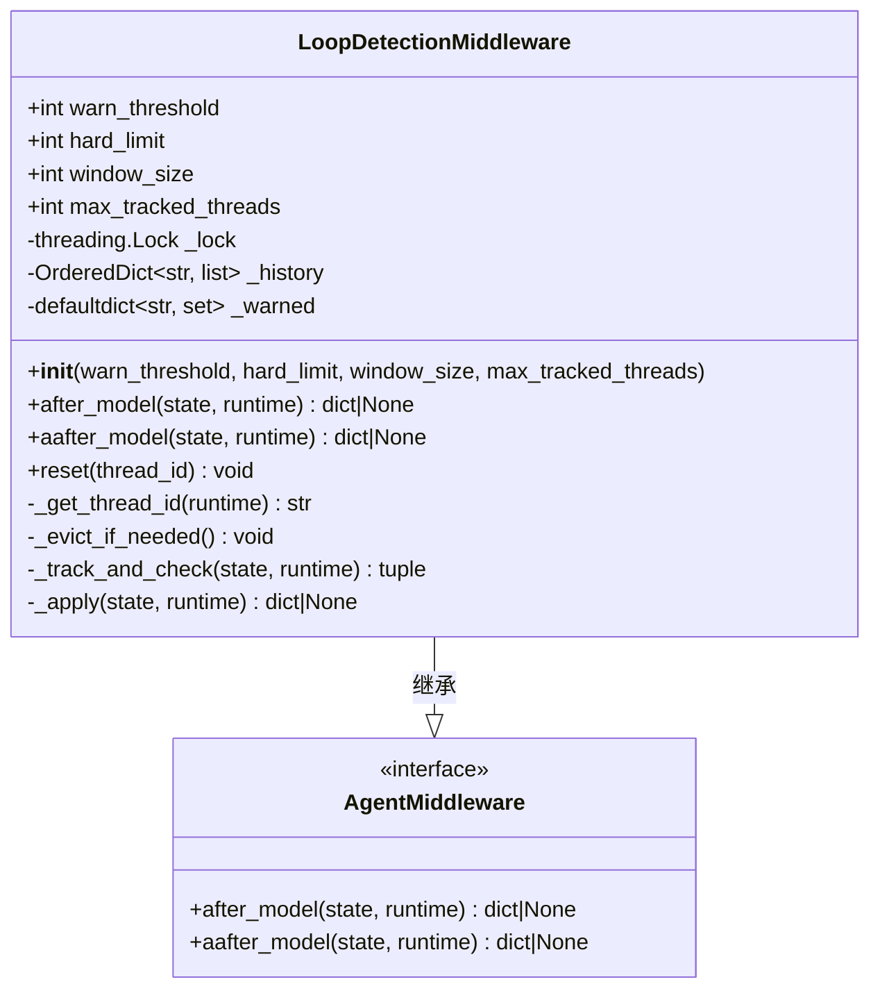
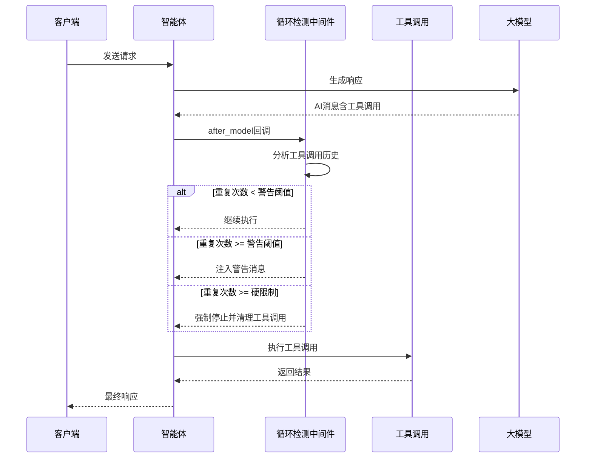
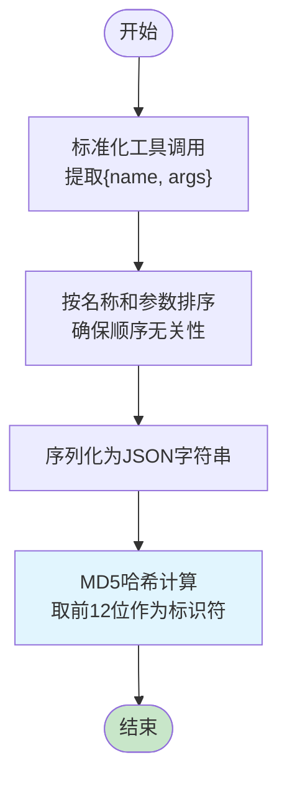
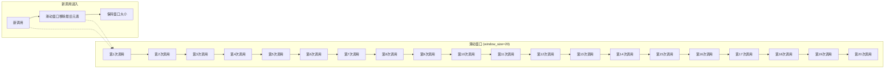
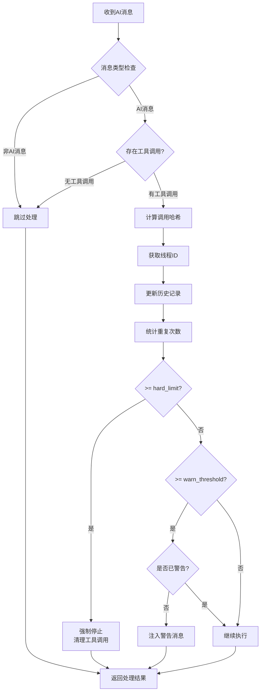
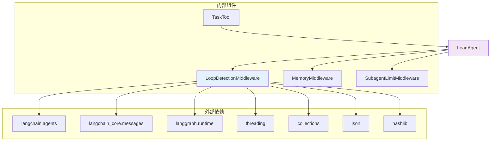
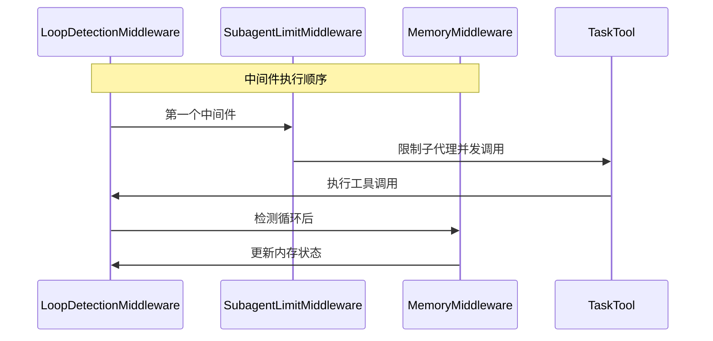

# 循环检测中间件

<cite>
**本文档引用的文件**
- [loop_detection_middleware.py](file://backend/packages/harness/deerflow/agents/middlewares/loop_detection_middleware.py)
- [test_loop_detection_middleware.py](file://backend/tests/test_loop_detection_middleware.py)
- [agent.py](file://backend/packages/harness/deerflow/agents/lead_agent/agent.py)
- [memory_middleware.py](file://backend/packages/harness/deerflow/agents/middlewares/memory_middleware.py)
- [subagent_limit_middleware.py](file://backend/packages/harness/deerflow/agents/middlewares/subagent_limit_middleware.py)
- [task_tool.py](file://backend/packages/harness/deerflow/tools/builtins/task_tool.py)
</cite>

## 目录
1. [简介](#简介)
2. [项目结构](#项目结构)
3. [核心组件](#核心组件)
4. [架构概览](#架构概览)
5. [详细组件分析](#详细组件分析)
6. [依赖关系分析](#依赖关系分析)
7. [性能考虑](#性能考虑)
8. [故障排除指南](#故障排除指南)
9. [结论](#结论)

## 简介

循环检测中间件是 DeerFlow 智能体执行流程中的关键安全组件，专门设计用于防止智能体陷入无限循环或重复执行相同操作。该中间件通过监控工具调用模式来识别潜在的循环行为，并在检测到重复模式时采取相应的防护措施。

该中间件采用先进的算法来分析智能体的工具调用历史，使用哈希技术和滑动窗口机制来跟踪重复模式。当检测到循环行为时，它会自动注入警告消息或强制停止智能体的工具调用，确保系统能够继续执行并产生最终的文本回答。

## 项目结构

循环检测中间件位于 DeerFlow 后端代码库的中间件模块中，与智能体执行框架紧密集成：



**图表来源**
- [loop_detection_middleware.py:1-228](file://backend/packages/harness/deerflow/agents/middlewares/loop_detection_middleware.py#L1-L228)
- [agent.py:250-265](file://backend/packages/harness/deerflow/agents/lead_agent/agent.py#L250-L265)

**章节来源**
- [loop_detection_middleware.py:1-228](file://backend/packages/harness/deerflow/agents/middlewares/loop_detection_middleware.py#L1-L228)
- [agent.py:250-265](file://backend/packages/harness/deerflow/agents/lead_agent/agent.py#L250-L265)

## 核心组件

循环检测中间件包含以下核心组件：

### 主要类结构



**图表来源**
- [loop_detection_middleware.py:69-228](file://backend/packages/harness/deerflow/agents/middlewares/loop_detection_middleware.py#L69-L228)

### 默认配置参数

中间件提供了可配置的默认参数：

| 参数名称 | 默认值 | 描述 |
|---------|--------|------|
| warn_threshold | 3 | 触发警告前的重复次数阈值 |
| hard_limit | 5 | 强制停止前的重复次数阈值 |
| window_size | 20 | 滑动窗口大小（跟踪最近N次调用） |
| max_tracked_threads | 100 | 最大线程跟踪数量（LRU淘汰） |

**章节来源**
- [loop_detection_middleware.py:29-34](file://backend/packages/harness/deerflow/agents/middlewares/loop_detection_middleware.py#L29-L34)
- [loop_detection_middleware.py:83-95](file://backend/packages/harness/deerflow/agents/middlewares/loop_detection_middleware.py#L83-L95)

## 架构概览

循环检测中间件在整个智能体执行流程中的位置和作用：



**图表来源**
- [loop_detection_middleware.py:211-218](file://backend/packages/harness/deerflow/agents/middlewares/loop_detection_middleware.py#L211-L218)
- [agent.py:260-261](file://backend/packages/harness/deerflow/agents/lead_agent/agent.py#L260-L261)

## 详细组件分析

### 算法实现机制

循环检测中间件采用多层防护策略来确保智能体不会陷入循环：

#### 1. 工具调用哈希计算



**图表来源**
- [loop_detection_middleware.py:36-61](file://backend/packages/harness/deerflow/agents/middlewares/loop_detection_middleware.py#L36-L61)

#### 2. 滑动窗口跟踪机制

中间件使用滑动窗口来跟踪最近的工具调用历史：



**图表来源**
- [loop_detection_middleware.py:147-149](file://backend/packages/harness/deerflow/agents/middlewares/loop_detection_middleware.py#L147-L149)

#### 3. 多级防护策略



**图表来源**
- [loop_detection_middleware.py:117-183](file://backend/packages/harness/deerflow/agents/middlewares/loop_detection_middleware.py#L117-L183)

### 触发条件和检测范围

#### 触发条件

循环检测中间件的触发条件基于以下规则：

1. **消息类型检查**：仅对AI消息进行处理
2. **工具调用存在性**：仅当AI消息包含工具调用时才进行检测
3. **重复次数阈值**：根据配置的阈值判断是否触发

#### 检测范围

- **时间范围**：基于滑动窗口内的历史记录
- **空间范围**：按线程ID隔离的独立跟踪
- **内容范围**：基于工具名称和参数的组合哈希

### 防护策略

#### 警告阶段（warn_threshold）

当检测到重复调用达到警告阈值时，中间件会：
- 注入人类消息（HumanMessage）而非系统消息
- 提供循环检测警告信息
- 避免与某些模型的系统消息限制冲突

#### 强制停止阶段（hard_limit）

当检测到重复调用达到硬限制时，中间件会：
- 清理AI消息中的所有工具调用
- 在消息内容中添加强制停止信息
- 强制智能体产生最终的文本回答

**章节来源**
- [loop_detection_middleware.py:64-67](file://backend/packages/harness/deerflow/agents/middlewares/loop_detection_middleware.py#L64-L67)
- [loop_detection_middleware.py:154-183](file://backend/packages/harness/deerflow/agents/middlewares/loop_detection_middleware.py#L154-L183)

## 依赖关系分析

循环检测中间件与其他组件的依赖关系：



**图表来源**
- [loop_detection_middleware.py:15-25](file://backend/packages/harness/deerflow/agents/middlewares/loop_detection_middleware.py#L15-L25)
- [agent.py:250-265](file://backend/packages/harness/deerflow/agents/lead_agent/agent.py#L250-L265)

### 集成点分析

#### Lead Agent 集成

循环检测中间件在 Lead Agent 创建时被自动添加到中间件列表中：

```python
# 在 _build_middlewares 函数中
middlewares.append(LoopDetectionMiddleware())
```

#### 与其他中间件的协作



**图表来源**
- [agent.py:250-265](file://backend/packages/harness/deerflow/agents/lead_agent/agent.py#L250-L265)

**章节来源**
- [agent.py:250-265](file://backend/packages/harness/deerflow/agents/lead_agent/agent.py#L250-L265)
- [memory_middleware.py:86-150](file://backend/packages/harness/deerflow/agents/middlewares/memory_middleware.py#L86-L150)
- [subagent_limit_middleware.py:24-76](file://backend/packages/harness/deerflow/agents/middlewares/subagent_limit_middleware.py#L24-L76)

## 性能考虑

### 时间复杂度分析

- **哈希计算**：O(n log n)，其中n是工具调用数量
- **历史记录维护**：O(k)，其中k是滑动窗口大小
- **重复计数**：O(w)，其中w是窗口内历史记录数量

### 空间复杂度分析

- **历史记录存储**：O(t × w)，其中t是跟踪的线程数，w是窗口大小
- **LRU淘汰机制**：O(t)，用于管理活跃线程
- **警告状态跟踪**：O(t × h)，其中h是已警告的哈希集合

### 性能优化策略

1. **线程安全锁**：使用细粒度锁保护共享状态
2. **LRU淘汰**：控制内存使用，避免无限增长
3. **滑动窗口**：限制历史记录长度，提高检测效率
4. **异步处理**：支持异步模型调用，不影响主执行流程

### 配置调优建议

| 参数 | 建议值 | 影响 |
|------|--------|------|
| warn_threshold | 3-5 | 平衡检测敏感性和误报率 |
| hard_limit | 5-8 | 控制强制停止的严格程度 |
| window_size | 10-30 | 平衡检测精度和性能 |
| max_tracked_threads | 50-200 | 控制内存使用和并发支持 |

**章节来源**
- [loop_detection_middleware.py:107-116](file://backend/packages/harness/deerflow/agents/middlewares/loop_detection_middleware.py#L107-L116)
- [loop_detection_middleware.py:147-149](file://backend/packages/harness/deerflow/agents/middlewares/loop_detection_middleware.py#L147-L149)

## 故障排除指南

### 常见问题诊断

#### 1. 循环检测不生效

**可能原因**：
- AI消息不包含工具调用
- 消息类型不是AI消息
- 线程ID未正确传递

**解决方案**：
- 检查智能体是否正确生成工具调用
- 验证消息类型和内容格式
- 确保 runtime.context 包含 thread_id

#### 2. 过度警告或误报

**可能原因**：
- warn_threshold 设置过低
- 工具调用参数变化导致哈希不同
- 并发线程过多导致LRU淘汰

**解决方案**：
- 调整 warn_threshold 到更合适的值
- 检查工具调用参数的一致性
- 增加 max_tracked_threads 或调整窗口大小

#### 3. 强制停止过于激进

**可能原因**：
- hard_limit 设置过低
- 工具调用逻辑需要多次尝试
- 复杂任务的正常执行流程

**解决方案**：
- 提高 hard_limit 值
- 分析任务的正常执行模式
- 考虑任务的超时设置

### 调试技巧

#### 1. 日志分析

中间件提供详细的日志输出：
- 错误级别日志：硬限制触发时
- 警告级别日志：警告注入时  
- 调试级别日志：LRU淘汰时

#### 2. 状态检查

```python
# 检查当前跟踪状态
print(f"活动线程数: {len(mw._history)}")
print(f"示例线程历史: {list(mw._history.keys())[:5]}")
```

#### 3. 测试验证

使用单元测试验证中间件行为：
- 哈希函数正确性
- 阈值触发时机
- 窗口滑动效果
- 线程隔离功能

**章节来源**
- [test_loop_detection_middleware.py:31-51](file://backend/tests/test_loop_detection_middleware.py#L31-L51)
- [test_loop_detection_middleware.py:106-123](file://backend/tests/test_loop_detection_middleware.py#L106-L123)
- [test_loop_detection_middleware.py:198-214](file://backend/tests/test_loop_detection_middleware.py#L198-L214)

## 结论

循环检测中间件为 DeerFlow 智能体执行流程提供了重要的安全防护机制。通过多层检测策略、智能的哈希计算和滑动窗口跟踪，该中间件能够有效防止智能体陷入无限循环或重复执行相同操作。

### 主要优势

1. **多层次防护**：从警告到强制停止的渐进式防护策略
2. **智能检测**：基于工具调用内容的哈希计算，避免顺序敏感性
3. **线程隔离**：支持多线程环境下的独立跟踪
4. **性能友好**：使用LRU淘汰和滑动窗口控制资源使用
5. **易于配置**：提供灵活的参数调整选项

### 最佳实践建议

1. **合理配置阈值**：根据具体应用场景调整 warn_threshold 和 hard_limit
2. **监控性能指标**：定期检查日志和性能数据
3. **任务设计优化**：避免设计容易产生循环的任务流程
4. **持续测试验证**：在部署前充分测试循环检测功能

该中间件的成功实施显著提升了 DeerFlow 系统的稳定性和可靠性，为智能体的安全执行提供了重要保障。