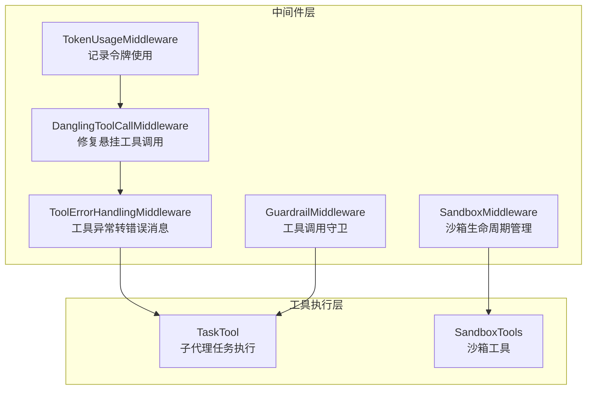
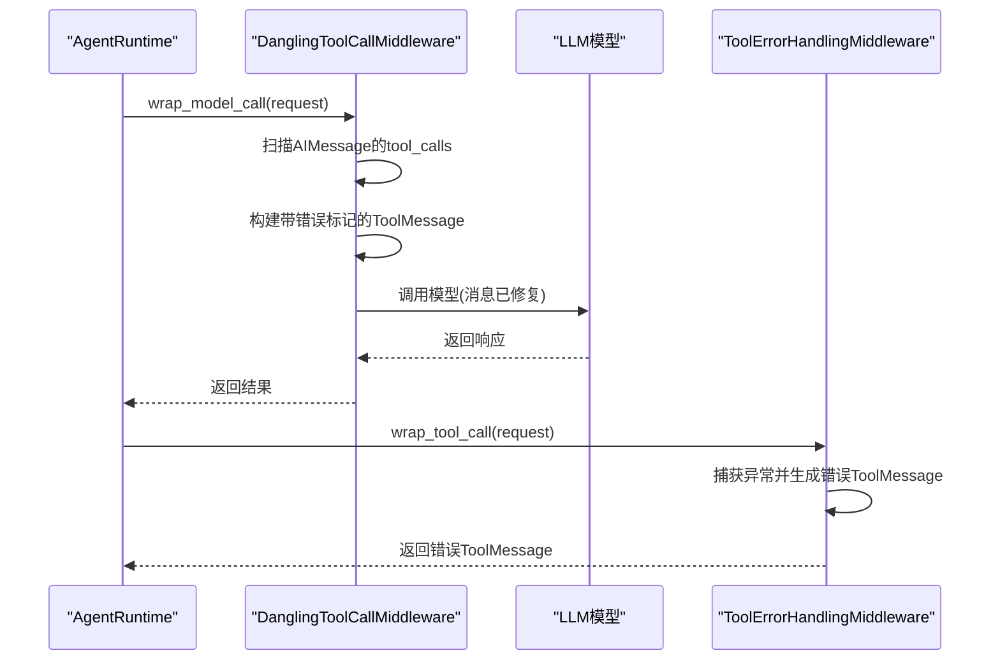
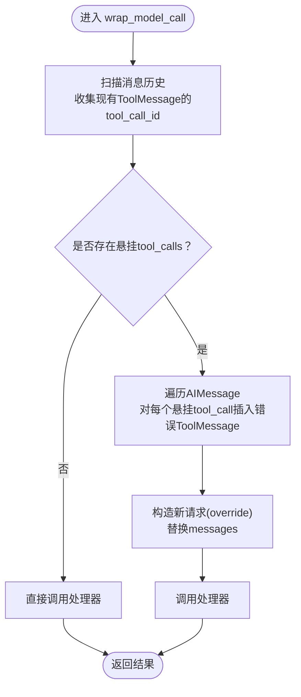
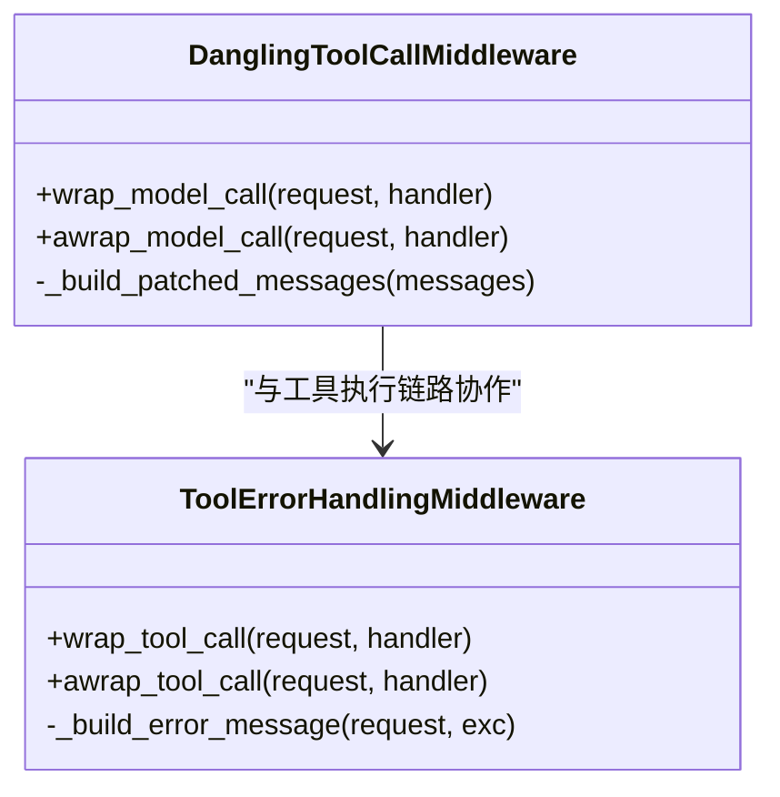
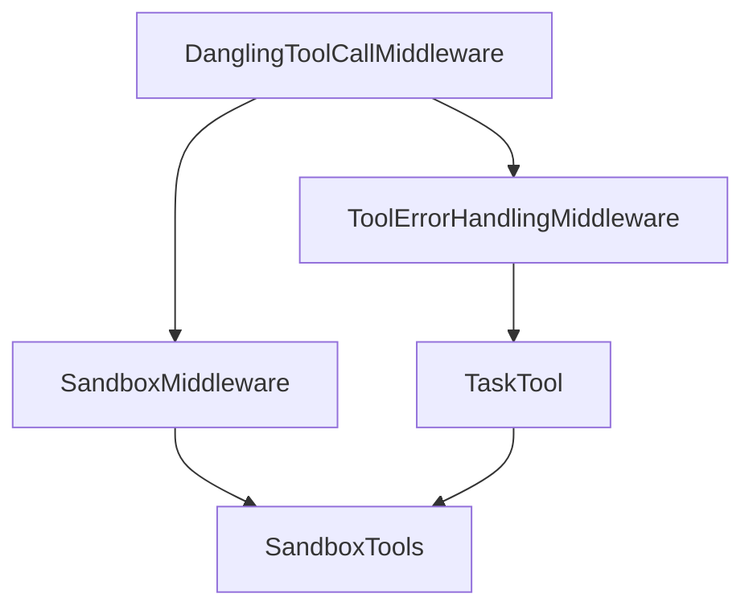
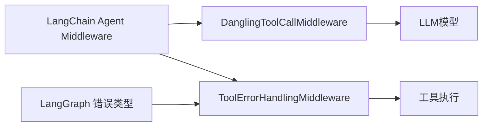

# 悬挂工具调用中间件

<cite>
**本文档引用的文件**
- [dangling_tool_call_middleware.py](file://backend/packages/harness/deerflow/agents/middlewares/dangling_tool_call_middleware.py)
- [test_dangling_tool_call_middleware.py](file://backend/tests/test_dangling_tool_call_middleware.py)
- [tool_error_handling_middleware.py](file://backend/packages/harness/deerflow/agents/middlewares/tool_error_handling_middleware.py)
- [token_usage_middleware.py](file://backend/packages/harness/deerflow/agents/middlewares/token_usage_middleware.py)
- [guardrails_config.py](file://backend/packages/harness/deerflow/config/guardrails_config.py)
- [middleware.py](file://backend/packages/harness/deerflow/guardrails/middleware.py)
- [middleware.py](file://backend/packages/harness/deerflow/sandbox/middleware.py)
- [tools.py](file://backend/packages/harness/deerflow/sandbox/tools.py)
- [task_tool.py](file://backend/packages/harness/deerflow/tools/builtins/task_tool.py)
- [TODO.md](file://backend/docs/TODO.md)
</cite>

## 目录
1. [简介](#简介)
2. [项目结构](#项目结构)
3. [核心组件](#核心组件)
4. [架构概览](#架构概览)
5. [详细组件分析](#详细组件分析)
6. [依赖关系分析](#依赖关系分析)
7. [性能考虑](#性能考虑)
8. [故障排查指南](#故障排查指南)
9. [结论](#结论)

## 简介
本文件针对 DeerFlow 的“悬挂工具调用中间件”进行深入技术文档化，重点解释以下方面：
- 如何检测和处理未完成或悬挂的工具调用（即 AIMessage 中存在 tool_calls，但消息历史中缺少对应 ToolMessage 的情况）
- 工具调用状态的监控与清理机制
- 悬挂调用的识别算法、清理策略与数据一致性保证
- 悬挂调用配置选项、监控指标与故障恢复机制
- 与工具执行系统的集成关系与异常处理

该中间件通过在模型调用前拦截并修复消息历史中的“悬挂工具调用”，确保 LLM 接收格式正确的对话历史，避免因消息不完整导致的推理失败。

## 项目结构
悬挂工具调用中间件位于后端 harness 包的 agents.middlewares 子模块中，并与工具错误处理、令牌使用统计、沙箱中间件等共同构成运行时中间件栈。测试用例覆盖了多种悬挂场景与异步路径。

**图表来源**
- [dangling_tool_call_middleware.py:28-111](file://backend/packages/harness/deerflow/agents/middlewares/dangling_tool_call_middleware.py#L28-L111)
- [tool_error_handling_middleware.py:19-137](file://backend/packages/harness/deerflow/agents/middlewares/tool_error_handling_middleware.py#L19-L137)
- [token_usage_middleware.py:13-38](file://backend/packages/harness/deerflow/agents/middlewares/token_usage_middleware.py#L13-L38)
- [middleware.py:32-83](file://backend/packages/harness/deerflow/sandbox/middleware.py#L32-L83)
- [task_tool.py:164-195](file://backend/packages/harness/deerflow/tools/builtins/task_tool.py#L164-L195)

**章节来源**
- [dangling_tool_call_middleware.py:1-111](file://backend/packages/harness/deerflow/agents/middlewares/dangling_tool_call_middleware.py#L1-L111)
- [tool_error_handling_middleware.py:68-137](file://backend/packages/harness/deerflow/agents/middlewares/tool_error_handling_middleware.py#L68-L137)

## 核心组件
- 悬挂工具调用中间件：在模型调用前扫描消息历史，识别 AIMessage 中存在但历史中缺失的 tool_calls，并插入带有错误标记的合成 ToolMessage，确保消息顺序正确。
- 工具错误处理中间件：捕获工具执行异常，将其转换为 ToolMessage 并标注 status="error"，使流程可继续。
- 令牌使用中间件：从模型响应中提取 usage_metadata 并记录输入/输出/总计令牌数，便于成本控制与性能分析。
- 沙箱中间件：负责沙箱资源的获取与释放，保障工具执行环境的一致性与隔离性。
- 守卫中间件：在工具调用前进行授权检查，支持白名单/黑名单等策略。

**章节来源**
- [dangling_tool_call_middleware.py:28-111](file://backend/packages/harness/deerflow/agents/middlewares/dangling_tool_call_middleware.py#L28-L111)
- [tool_error_handling_middleware.py:19-66](file://backend/packages/harness/deerflow/agents/middlewares/tool_error_handling_middleware.py#L19-L66)
- [token_usage_middleware.py:13-38](file://backend/packages/harness/deerflow/agents/middlewares/token_usage_middleware.py#L13-L38)
- [middleware.py:32-83](file://backend/packages/harness/deerflow/sandbox/middleware.py#L32-L83)

## 架构概览
悬挂工具调用中间件在 Agent 运行时的调用链中处于“模型调用前”的位置，通过 wrap_model_call 注入修复后的消息列表。其与工具错误处理中间件形成互补：前者解决消息格式完整性问题，后者解决工具执行异常问题。

**图表来源**
- [dangling_tool_call_middleware.py:90-111](file://backend/packages/harness/deerflow/agents/middlewares/dangling_tool_call_middleware.py#L90-L111)
- [tool_error_handling_middleware.py:37-66](file://backend/packages/harness/deerflow/agents/middlewares/tool_error_handling_middleware.py#L37-L66)

## 详细组件分析

### 悬挂工具调用中间件（DanglingToolCallMiddleware）
- 功能定位：在模型调用前修复 AIMessage 的 tool_calls 缺失问题，插入错误标记的 ToolMessage，确保消息顺序正确。
- 关键算法：
  - 收集历史中所有 ToolMessage 的 tool_call_id，建立集合。
  - 遍历 AIMessage 的 tool_calls，若某 tool_call_id 不在集合中，则判定为“悬挂”。
  - 对每个悬挂的 tool_call，在其对应的 AIMessage 后立即插入一个合成 ToolMessage，内容包含中断提示，状态标记为 error。
- 异步与同步：同时实现同步与异步的 wrap_model_call/awrap_model_call，保持行为一致。
- 日志与可观测性：当注入错误消息时记录警告日志，便于追踪修复次数与频率。

**图表来源**
- [dangling_tool_call_middleware.py:36-88](file://backend/packages/harness/deerflow/agents/middlewares/dangling_tool_call_middleware.py#L36-L88)
- [dangling_tool_call_middleware.py:90-111](file://backend/packages/harness/deerflow/agents/middlewares/dangling_tool_call_middleware.py#L90-L111)

**章节来源**
- [dangling_tool_call_middleware.py:28-111](file://backend/packages/harness/deerflow/agents/middlewares/dangling_tool_call_middleware.py#L28-L111)
- [test_dangling_tool_call_middleware.py:25-121](file://backend/tests/test_dangling_tool_call_middleware.py#L25-L121)

### 与工具错误处理中间件的协作
- 工具错误处理中间件负责将工具执行异常转换为 ToolMessage，状态为 error，从而让后续流程（如 LLM）能基于统一的消息格式继续推进。
- 两者配合可覆盖两类问题：
  - 消息格式不完整（悬挂工具调用）
  - 工具执行失败（异常）

**图表来源**
- [dangling_tool_call_middleware.py:28-111](file://backend/packages/harness/deerflow/agents/middlewares/dangling_tool_call_middleware.py#L28-L111)
- [tool_error_handling_middleware.py:19-66](file://backend/packages/harness/deerflow/agents/middlewares/tool_error_handling_middleware.py#L19-L66)

**章节来源**
- [tool_error_handling_middleware.py:19-66](file://backend/packages/harness/deerflow/agents/middlewares/tool_error_handling_middleware.py#L19-L66)

### 与沙箱中间件及工具执行系统的集成
- 沙箱中间件负责在首次工具调用时按需获取沙箱资源，并在会话结束时释放，确保资源一致性与隔离性。
- 任务工具（TaskTool）提供子代理任务的执行与轮询，内置两层超时保护（执行超时与轮询超时），防止长时间阻塞。
- 悬挂工具调用中间件与上述组件协同工作，确保即使出现用户中断或取消，消息历史仍保持完整，便于后续恢复与重试。

**图表来源**
- [middleware.py:32-83](file://backend/packages/harness/deerflow/sandbox/middleware.py#L32-L83)
- [tools.py:592-636](file://backend/packages/harness/deerflow/sandbox/tools.py#L592-L636)
- [task_tool.py:164-195](file://backend/packages/harness/deerflow/tools/builtins/task_tool.py#L164-L195)

**章节来源**
- [middleware.py:32-83](file://backend/packages/harness/deerflow/sandbox/middleware.py#L32-L83)
- [tools.py:592-636](file://backend/packages/harness/deerflow/sandbox/tools.py#L592-L636)
- [task_tool.py:164-195](file://backend/packages/harness/deerflow/tools/builtins/task_tool.py#L164-L195)

### 配置选项与监控指标
- 中间件启用方式：
  - 通过运行时中间件构建器选择性包含悬挂工具调用修复逻辑。Lead Agent 会包含该中间件，而子代理运行时默认不包含。
- 守卫配置：
  - 可通过守卫配置启用工具调用前的授权检查，支持白名单/黑名单与失败闭合策略。
- 令牌使用监控：
  - 令牌使用中间件从模型响应中提取 usage_metadata 并记录，便于成本控制与性能分析。

**章节来源**
- [tool_error_handling_middleware.py:122-137](file://backend/packages/harness/deerflow/agents/middlewares/tool_error_handling_middleware.py#L122-L137)
- [guardrails_config.py:13-25](file://backend/packages/harness/deerflow/config/guardrails_config.py#L13-L25)
- [token_usage_middleware.py:13-38](file://backend/packages/harness/deerflow/agents/middlewares/token_usage_middleware.py#L13-L38)

## 依赖关系分析
- 组件耦合：
  - DanglingToolCallMiddleware 依赖 LangChain Agent 中间件类型（ModelRequest/ModelResponse）与 ToolMessage 类型。
  - 与 ToolErrorHandlingMiddleware 在工具执行阶段互补，共同提升鲁棒性。
- 外部依赖：
  - LangChain Agent 中间件框架用于拦截模型调用与工具调用。
  - LangGraph 错误类型（如 GraphBubbleUp）用于保留控制流信号。
- 循环依赖：
  - 中间件之间无循环导入；通过延迟导入避免运行时循环依赖。

**图表来源**
- [dangling_tool_call_middleware.py:20-25](file://backend/packages/harness/deerflow/agents/middlewares/dangling_tool_call_middleware.py#L20-L25)
- [tool_error_handling_middleware.py:8-13](file://backend/packages/harness/deerflow/agents/middlewares/tool_error_handling_middleware.py#L8-L13)

**章节来源**
- [dangling_tool_call_middleware.py:20-25](file://backend/packages/harness/deerflow/agents/middlewares/dangling_tool_call_middleware.py#L20-L25)
- [tool_error_handling_middleware.py:8-13](file://backend/packages/harness/deerflow/agents/middlewares/tool_error_handling_middleware.py#L8-L13)

## 性能考虑
- 时间复杂度：扫描消息历史与构建新列表的时间复杂度为 O(n)，其中 n 为消息数量；对每个 AIMessage 的 tool_calls 扫描为 O(m)，m 为 tool_calls 数量。整体为 O(n·m)。
- 空间复杂度：额外使用集合存储现有 ToolMessage 的 tool_call_id，以及临时列表存储修复后的消息，空间复杂度为 O(n+m)。
- 优化建议：
  - 仅在需要时才进行修复（当前实现已通过 needs_patch 判断避免不必要的操作）。
  - 合理设置中间件顺序，减少重复扫描与复制。
  - 在高并发场景下，结合令牌使用监控与资源池化策略（见 TODO 计划）。

[本节为通用性能讨论，无需特定文件来源]

## 故障排查指南
- 症状：LLM 报错或无法继续推理，提示消息格式不完整。
  - 排查：确认是否发生用户中断或请求取消导致的悬挂工具调用。
  - 处理：悬挂工具调用中间件会自动注入错误标记的 ToolMessage，修复消息格式。
- 症状：工具执行抛出异常。
  - 排查：检查工具错误处理中间件的日志与生成的错误 ToolMessage。
  - 处理：根据错误内容选择替代工具或重试策略。
- 症状：沙箱资源泄漏或获取失败。
  - 排查：检查沙箱中间件的获取与释放逻辑，确认线程 ID 与上下文传递。
  - 处理：确保 after_agent 阶段正确释放沙箱；必要时调整懒加载策略。
- 症状：任务执行长时间阻塞或轮询超时。
  - 排查：检查任务工具的两层超时保护是否生效。
  - 处理：根据日志定位卡点，必要时增加超时阈值或优化后台任务。

**章节来源**
- [dangling_tool_call_middleware.py:87-88](file://backend/packages/harness/deerflow/agents/middlewares/dangling_tool_call_middleware.py#L87-L88)
- [tool_error_handling_middleware.py:48-50](file://backend/packages/harness/deerflow/agents/middlewares/tool_error_handling_middleware.py#L48-L50)
- [middleware.py:68-83](file://backend/packages/harness/deerflow/sandbox/middleware.py#L68-L83)
- [task_tool.py:185-195](file://backend/packages/harness/deerflow/tools/builtins/task_tool.py#L185-L195)

## 结论
悬挂工具调用中间件通过在模型调用前修复消息历史中的格式缺陷，有效避免了因用户中断或请求取消导致的 LLM 推理失败。配合工具错误处理中间件、令牌使用监控与沙箱资源管理，形成了从消息完整性到执行鲁棒性的完整保障体系。未来可在资源池化、指标监控与异步优化等方面进一步完善，以提升整体性能与可维护性。