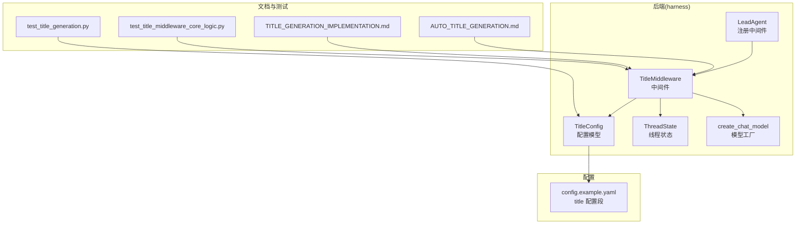
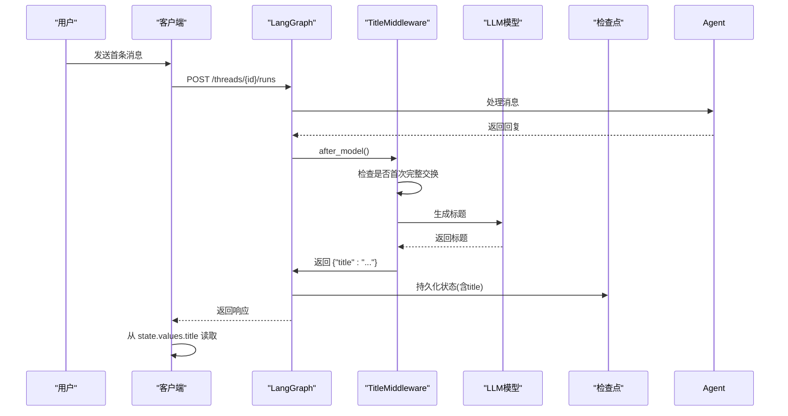
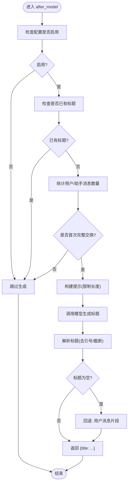
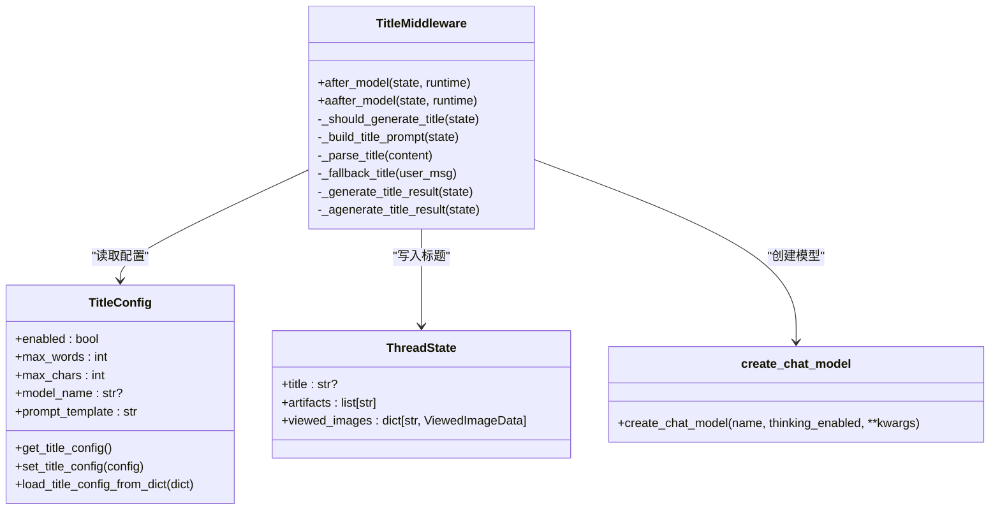

# 标题生成中间件

<cite>
**本文档引用的文件**
- [title_middleware.py](file://backend/packages/harness/deerflow/agents/middlewares/title_middleware.py)
- [title_config.py](file://backend/packages/harness/deerflow/config/title_config.py)
- [thread_state.py](file://backend/packages/harness/deerflow/agents/thread_state.py)
- [agent.py](file://backend/packages/harness/deerflow/agents/lead_agent/agent.py)
- [factory.py](file://backend/packages/harness/deerflow/models/factory.py)
- [AUTO_TITLE_GENERATION.md](file://backend/docs/AUTO_TITLE_GENERATION.md)
- [TITLE_GENERATION_IMPLEMENTATION.md](file://backend/docs/TITLE_GENERATION_IMPLEMENTATION.md)
- [test_title_generation.py](file://backend/tests/test_title_generation.py)
- [test_title_middleware_core_logic.py](file://backend/tests/test_title_middleware_core_logic.py)
- [config.example.yaml](file://config.example.yaml)
</cite>

## 目录
1. [简介](#简介)
2. [项目结构](#项目结构)
3. [核心组件](#核心组件)
4. [架构总览](#架构总览)
5. [详细组件分析](#详细组件分析)
6. [依赖关系分析](#依赖关系分析)
7. [性能考量](#性能考量)
8. [故障排查指南](#故障排查指南)
9. [结论](#结论)
10. [附录](#附录)

## 简介
本文件系统性阐述 DeerFlow 中“标题生成中间件”的实现机制与优化策略，覆盖触发时机、内容提取与格式化、配置项、质量评估与个性化定制，并给出与实现文档的关联及最佳实践。该中间件在用户首次提问并获得回复后，自动为对话线程生成简洁标题，存储于线程状态中并通过检查点持久化，确保跨进程重启后仍可读取。

## 项目结构
标题生成中间件位于后端 harness 包内，围绕以下模块协同工作：
- 中间件主体：agents/middlewares/title_middleware.py
- 配置模型：config/title_config.py
- 线程状态：agents/thread_state.py
- Lead Agent 注册：agents/lead_agent/agent.py
- 模型工厂：models/factory.py
- 文档：docs/AUTO_TITLE_GENERATION.md、docs/TITLE_GENERATION_IMPLEMENTATION.md
- 测试：tests/test_title_generation.py、tests/test_title_middleware_core_logic.py
- 示例配置：config.example.yaml

**图表来源**
- [title_middleware.py:1-150](file://backend/packages/harness/deerflow/agents/middlewares/title_middleware.py#L1-L150)
- [title_config.py:1-54](file://backend/packages/harness/deerflow/config/title_config.py#L1-L54)
- [thread_state.py:48-56](file://backend/packages/harness/deerflow/agents/thread_state.py#L48-L56)
- [agent.py:208-265](file://backend/packages/harness/deerflow/agents/lead_agent/agent.py#L208-L265)
- [factory.py:11-96](file://backend/packages/harness/deerflow/models/factory.py#L11-L96)
- [AUTO_TITLE_GENERATION.md:1-259](file://backend/docs/AUTO_TITLE_GENERATION.md#L1-L259)
- [TITLE_GENERATION_IMPLEMENTATION.md:1-223](file://backend/docs/TITLE_GENERATION_IMPLEMENTATION.md#L1-L223)
- [test_title_generation.py:1-91](file://backend/tests/test_title_generation.py#L1-L91)
- [test_title_middleware_core_logic.py:1-201](file://backend/tests/test_title_middleware_core_logic.py#L1-L201)
- [config.example.yaml:430-439](file://config.example.yaml#L430-L439)

**章节来源**
- [title_middleware.py:1-150](file://backend/packages/harness/deerflow/agents/middlewares/title_middleware.py#L1-L150)
- [title_config.py:1-54](file://backend/packages/harness/deerflow/config/title_config.py#L1-L54)
- [thread_state.py:48-56](file://backend/packages/harness/deerflow/agents/thread_state.py#L48-L56)
- [agent.py:208-265](file://backend/packages/harness/deerflow/agents/lead_agent/agent.py#L208-L265)
- [factory.py:11-96](file://backend/packages/harness/deerflow/models/factory.py#L11-L96)
- [AUTO_TITLE_GENERATION.md:1-259](file://backend/docs/AUTO_TITLE_GENERATION.md#L1-L259)
- [TITLE_GENERATION_IMPLEMENTATION.md:1-223](file://backend/docs/TITLE_GENERATION_IMPLEMENTATION.md#L1-L223)
- [test_title_generation.py:1-91](file://backend/tests/test_title_generation.py#L1-L91)
- [test_title_middleware_core_logic.py:1-201](file://backend/tests/test_title_middleware_core_logic.py#L1-L201)
- [config.example.yaml:430-439](file://config.example.yaml#L430-L439)

## 核心组件
- 标题中间件：在首次完整对话交换后触发，调用 LLM 生成标题，失败时回退至用户消息片段。
- 配置模型：集中管理启用开关、最大词数、最大字符数、模型名与提示模板。
- 线程状态：在 ThreadState 中新增 title 字段，便于持久化与客户端读取。
- 模型工厂：根据配置解析并创建聊天模型实例，支持思维模式与推理努力度等参数。
- Lead Agent 注册：将 TitleMiddleware 插入中间件链，确保在 MemoryMiddleware 之后执行。

**章节来源**
- [title_middleware.py:22-150](file://backend/packages/harness/deerflow/agents/middlewares/title_middleware.py#L22-L150)
- [title_config.py:6-54](file://backend/packages/harness/deerflow/config/title_config.py#L6-L54)
- [thread_state.py:48-56](file://backend/packages/harness/deerflow/agents/thread_state.py#L48-L56)
- [factory.py:11-96](file://backend/packages/harness/deerflow/models/factory.py#L11-L96)
- [agent.py:235-239](file://backend/packages/harness/deerflow/agents/lead_agent/agent.py#L235-L239)

## 架构总览
标题生成中间件通过 LangGraph 中间件钩子在 agent 执行后触发，遵循“首次完整对话交换”条件，构建提示并调用 LLM，最终将标题写入 ThreadState 并由检查点持久化。

**图表来源**
- [AUTO_TITLE_GENERATION.md:146-167](file://backend/docs/AUTO_TITLE_GENERATION.md#L146-L167)
- [title_middleware.py:143-150](file://backend/packages/harness/deerflow/agents/middlewares/title_middleware.py#L143-L150)

**章节来源**
- [AUTO_TITLE_GENERATION.md:144-167](file://backend/docs/AUTO_TITLE_GENERATION.md#L144-L167)
- [title_middleware.py:143-150](file://backend/packages/harness/deerflow/agents/middlewares/title_middleware.py#L143-L150)

## 详细组件分析

### 标题中间件（TitleMiddleware）
- 触发条件：仅当配置启用、线程尚未有标题、且已发生至少一次“用户消息 + 至少一次助手回复”的完整交换时才触发。
- 内容归一化：对消息内容进行递归归一化，将结构化内容（列表/字典）转换为纯文本，避免泄漏原始 repr。
- 提示构建：从第一条用户消息与第一条助手回复中抽取内容，限制长度并注入模板变量。
- 标题解析：去除引号与多余空白，按最大字符数截断。
- 回退策略：若 LLM 返回为空或异常，则使用用户消息前若干字符作为标题；若用户消息为空则回退为“新对话”。

**图表来源**
- [title_middleware.py:46-121](file://backend/packages/harness/deerflow/agents/middlewares/title_middleware.py#L46-L121)

**章节来源**
- [title_middleware.py:22-150](file://backend/packages/harness/deerflow/agents/middlewares/title_middleware.py#L22-L150)

### 配置模型（TitleConfig）
- 字段与约束：enabled、max_words（1..20）、max_chars（10..200）、model_name、prompt_template。
- 全局单例：提供 get/set/load 方法，支持从配置字典加载。
- 默认模板：要求模型仅返回标题，不带引号与解释。

**章节来源**
- [title_config.py:6-54](file://backend/packages/harness/deerflow/config/title_config.py#L6-L54)

### 线程状态（ThreadState）
- 新增字段：title: NotRequired[str | None]，用于存储标题。
- 与检查点：标题随 ThreadState 一起持久化，客户端从 state.values.title 读取。

**章节来源**
- [thread_state.py:48-56](file://backend/packages/harness/deerflow/agents/thread_state.py#L48-L56)

### 模型工厂（create_chat_model）
- 解析模型：根据名称从应用配置中解析模型类与设置，合并思维模式与推理努力度等参数。
- 错误处理：当模型不支持思维模式或推理努力度时抛出明确异常。
- Tracing：可选附加 LangSmith Tracer。

**章节来源**
- [factory.py:11-96](file://backend/packages/harness/deerflow/models/factory.py#L11-L96)

### Lead Agent 注册
- 中间件顺序：TitleMiddleware 在 MemoryMiddleware 之前插入，确保标题生成后再进行记忆队列更新。
- 作用：保证标题生成与后续中间件的正确时序。

**章节来源**
- [agent.py:208-265](file://backend/packages/harness/deerflow/agents/lead_agent/agent.py#L208-L265)

## 依赖关系分析
- 中间件依赖配置模型与模型工厂，通过全局配置决定行为与模型选择。
- 线程状态承载标题，与检查点配合实现持久化。
- Lead Agent 负责组装中间件链，确保标题生成在合适阶段执行。

**图表来源**
- [title_middleware.py:22-150](file://backend/packages/harness/deerflow/agents/middlewares/title_middleware.py#L22-L150)
- [title_config.py:6-54](file://backend/packages/harness/deerflow/config/title_config.py#L6-L54)
- [thread_state.py:48-56](file://backend/packages/harness/deerflow/agents/thread_state.py#L48-L56)
- [factory.py:11-96](file://backend/packages/harness/deerflow/models/factory.py#L11-L96)

**章节来源**
- [title_middleware.py:22-150](file://backend/packages/harness/deerflow/agents/middlewares/title_middleware.py#L22-L150)
- [title_config.py:6-54](file://backend/packages/harness/deerflow/config/title_config.py#L6-L54)
- [thread_state.py:48-56](file://backend/packages/harness/deerflow/agents/thread_state.py#L48-L56)
- [factory.py:11-96](file://backend/packages/harness/deerflow/models/factory.py#L11-L96)

## 性能考量
- 延迟：一次 LLM 调用带来约 0.5–1 秒延迟，属于轻量开销。
- 并发：在 after_model 钩子中执行，不阻塞主流程。
- 资源：每条线程仅生成一次标题，避免重复计算。
- 优化建议：
  - 使用更快模型（如 gpt-3.5-turbo）。
  - 降低 max_words 与 max_chars。
  - 简化提示模板，减少上下文长度。
  - 在本地开发启用检查点以避免重启丢失。

**章节来源**
- [AUTO_TITLE_GENERATION.md:189-200](file://backend/docs/AUTO_TITLE_GENERATION.md#L189-L200)
- [TITLE_GENERATION_IMPLEMENTATION.md:189-200](file://backend/docs/TITLE_GENERATION_IMPLEMENTATION.md#L189-L200)

## 故障排查指南
- 标题未生成
  - 检查配置 enabled 是否为 true。
  - 确认是否满足“首次完整交换”条件（1 个用户消息 + ≥1 个助手回复）。
  - 查看日志中是否有异常堆栈。
- 标题生成但客户端看不到
  - 确认从 state.values.title 读取，而非 thread.metadata.title。
  - 重新获取 state 并检查响应体。
- 重启后标题丢失
  - 本地开发需配置检查点（sqlite/postgres）。
  - 平台部署默认持久化。
  - 检查数据库连接与检查点工作状态。

**章节来源**
- [AUTO_TITLE_GENERATION.md:197-216](file://backend/docs/AUTO_TITLE_GENERATION.md#L197-L216)
- [TITLE_GENERATION_IMPLEMENTATION.md:167-186](file://backend/docs/TITLE_GENERATION_IMPLEMENTATION.md#L167-L186)

## 结论
标题生成中间件通过简洁的触发条件、稳健的内容归一化与回退策略，实现了可靠的自动标题生成。结合配置化与检查点持久化，既满足个性化需求又具备良好的工程实践。建议在生产环境适当优化模型与提示模板，以平衡质量与性能。

## 附录

### 配置选项与示例
- 启用/禁用：title.enabled
- 最大词数：title.max_words（1..20）
- 最大字符数：title.max_chars（10..200）
- 模型名：title.model_name（null 表示使用默认模型）
- 提示模板：title.prompt_template（默认模板要求仅返回标题）

**章节来源**
- [config.example.yaml:434-439](file://config.example.yaml#L434-L439)
- [title_config.py:9-32](file://backend/packages/harness/deerflow/config/title_config.py#L9-L32)

### 质量评估指标与个性化定制
- 指标建议
  - 成功率：首次触发后成功生成标题的比例。
  - 延迟：平均与 P95 的 LLM 调用耗时。
  - 标题长度分布：词数与字符数统计。
  - 回退率：因 LLM 失败而使用用户消息片段的比例。
- 个性化
  - 调整 max_words 与 max_chars 适配不同场景。
  - 自定义 prompt_template 以提升领域相关性。
  - 选择更合适的模型以兼顾速度与质量。

**章节来源**
- [AUTO_TITLE_GENERATION.md:189-200](file://backend/docs/AUTO_TITLE_GENERATION.md#L189-L200)
- [TITLE_GENERATION_IMPLEMENTATION.md:189-200](file://backend/docs/TITLE_GENERATION_IMPLEMENTATION.md#L189-L200)

### 关联实现文档与最佳实践
- 完整实现说明与工作流图见 AUTO_TITLE_GENERATION.md。
- 核心设计决策与持久化对比见 TITLE_GENERATION_IMPLEMENTATION.md。
- 最佳实践
  - 在 MemoryMiddleware 之后插入 TitleMiddleware，确保标题生成后再更新记忆。
  - 本地开发启用检查点，避免标题丢失。
  - 通过测试覆盖触发条件、内容归一化与回退逻辑。

**章节来源**
- [AUTO_TITLE_GENERATION.md:1-259](file://backend/docs/AUTO_TITLE_GENERATION.md#L1-L259)
- [TITLE_GENERATION_IMPLEMENTATION.md:1-223](file://backend/docs/TITLE_GENERATION_IMPLEMENTATION.md#L1-L223)
- [agent.py:235-239](file://backend/packages/harness/deerflow/agents/lead_agent/agent.py#L235-L239)