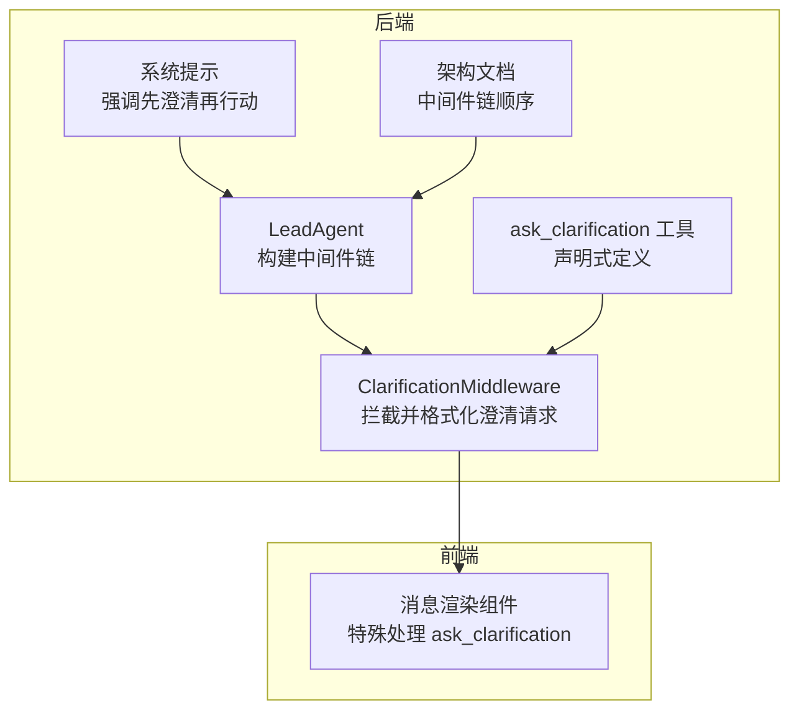
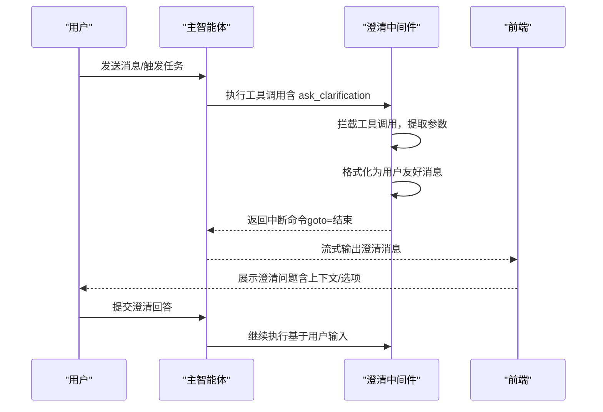
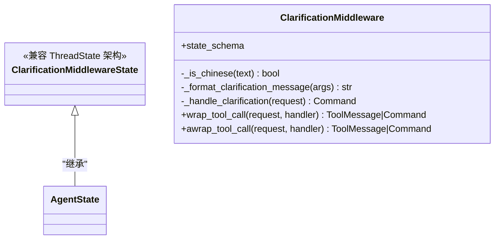
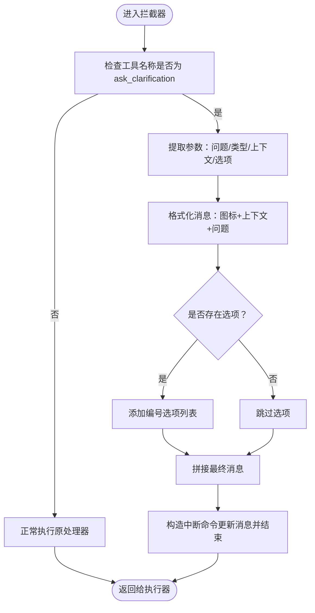
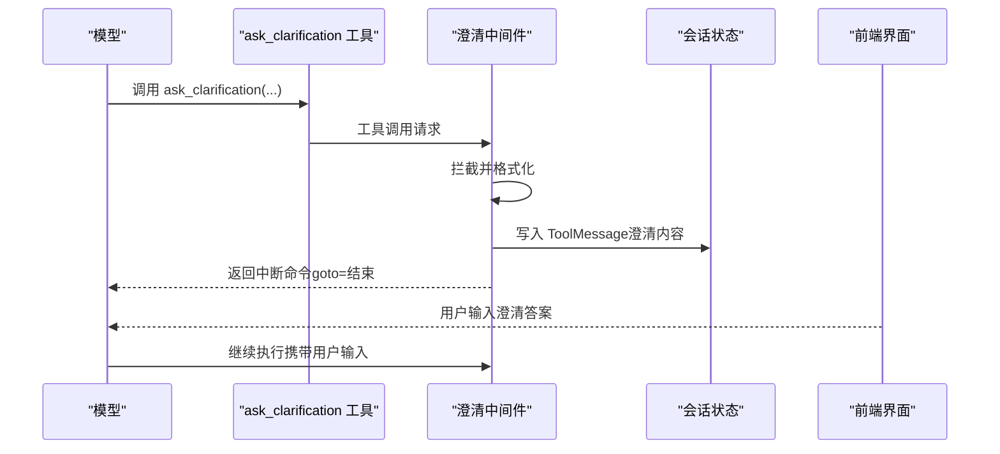
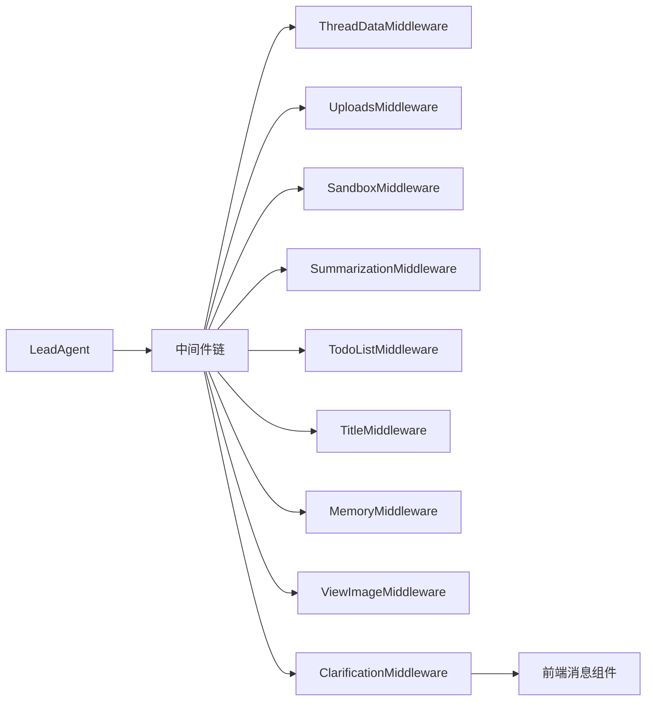

# 澄清中间件

<cite>
**本文引用的文件**
- [clarification_middleware.py](file://backend/packages/harness/deerflow/agents/middlewares/clarification_middleware.py)
- [clarification_tool.py](file://backend/packages/harness/deerflow/tools/builtins/clarification_tool.py)
- [agent.py](file://backend/packages/harness/deerflow/agents/lead_agent/agent.py)
- [prompt.py](file://backend/packages/harness/deerflow/agents/lead_agent/prompt.py)
- [ARCHITECTURE.md](file://backend/docs/ARCHITECTURE.md)
- [README.md](file://backend/README.md)
- [message-group.tsx](file://frontend/src/components/workspace/messages/message-group.tsx)
</cite>

## 目录
1. [简介](#简介)
2. [项目结构](#项目结构)
3. [核心组件](#核心组件)
4. [架构总览](#架构总览)
5. [详细组件分析](#详细组件分析)
6. [依赖关系分析](#依赖关系分析)
7. [性能考量](#性能考量)
8. [故障排查指南](#故障排查指南)
9. [结论](#结论)
10. [附录](#附录)

## 简介
本文件系统性阐述 DeerFlow 中“澄清中间件”的设计与实现，解释智能体如何通过该中间件向用户请求更多信息以提升任务完成质量。内容涵盖澄清问题的生成逻辑、触发条件、对话流程、模糊信息识别与引导策略，以及前端展示与交互优化建议。

澄清中间件位于中间件链末端，拦截模型调用的“ask_clarification”工具请求，将其转换为可读性强的消息并中断执行，等待用户响应后再继续。该机制替代了“工具型澄清”直接推进对话的做法，使用户在关键决策点获得明确提示，从而降低歧义、减少错误路径重试，显著提升成功率。

## 项目结构
澄清中间件与相关组件在后端与前端的分布如下：
- 后端中间件：clarification_middleware.py
- 后端工具：clarification_tool.py（声明式工具，实际逻辑由中间件接管）
- 后端集成：agent.py（将中间件按顺序挂载到主智能体）、prompt.py（系统提示中强调“先澄清再行动”）
- 前端展示：message-group.tsx（对 ask_clarification 的特殊渲染）
- 架构文档：ARCHITECTURE.md（明确中间件链顺序与作用）

图表来源
- [clarification_middleware.py:1-174](file://backend/packages/harness/deerflow/agents/middlewares/clarification_middleware.py#L1-L174)
- [clarification_tool.py:1-56](file://backend/packages/harness/deerflow/tools/builtins/clarification_tool.py#L1-L56)
- [agent.py:260-266](file://backend/packages/harness/deerflow/agents/lead_agent/agent.py#L260-L266)
- [prompt.py:200-236](file://backend/packages/harness/deerflow/agents/lead_agent/prompt.py#L200-L236)
- [ARCHITECTURE.md:360-370](file://backend/docs/ARCHITECTURE.md#L360-L370)
- [message-group.tsx:396-403](file://frontend/src/components/workspace/messages/message-group.tsx#L396-L403)

章节来源
- [clarification_middleware.py:1-174](file://backend/packages/harness/deerflow/agents/middlewares/clarification_middleware.py#L1-L174)
- [clarification_tool.py:1-56](file://backend/packages/harness/deerflow/tools/builtins/clarification_tool.py#L1-L56)
- [agent.py:260-266](file://backend/packages/harness/deerflow/agents/lead_agent/agent.py#L260-L266)
- [prompt.py:200-236](file://backend/packages/harness/deerflow/agents/lead_agent/prompt.py#L200-L236)
- [ARCHITECTURE.md:360-370](file://backend/docs/ARCHITECTURE.md#L360-L370)
- [README.md:56-70](file://backend/README.md#L56-L70)
- [message-group.tsx:396-403](file://frontend/src/components/workspace/messages/message-group.tsx#L396-L403)

## 核心组件
- 澄清中间件（ClarificationMiddleware）：拦截 ask_clarification 调用，提取参数，格式化为用户友好消息，返回中断命令，使执行停留在澄清状态，等待用户输入。
- 澄清工具（ask_clarification）：声明式工具，定义参数类型与用途；实际执行由中间件接管。
- 主智能体（LeadAgent）：在中间件链末尾挂载澄清中间件，确保所有澄清请求被统一处理。
- 系统提示（prompt.py）：强制要求“先澄清再行动”，并在示例中演示澄清调用与后续交互。
- 前端消息组件（message-group.tsx）：针对 ask_clarification 的特殊标签与图标展示，增强用户感知。

章节来源
- [clarification_middleware.py:20-31](file://backend/packages/harness/deerflow/agents/middlewares/clarification_middleware.py#L20-L31)
- [clarification_tool.py:6-51](file://backend/packages/harness/deerflow/tools/builtins/clarification_tool.py#L6-L51)
- [agent.py:263-264](file://backend/packages/harness/deerflow/agents/lead_agent/agent.py#L263-L264)
- [prompt.py:200-236](file://backend/packages/harness/deerflow/agents/lead_agent/prompt.py#L200-L236)
- [message-group.tsx:396-403](file://frontend/src/components/workspace/messages/message-group.tsx#L396-L403)

## 架构总览
澄清中间件在中间件链中的位置至关重要：它必须位于链末端，以便在所有前置中间件处理完毕后，统一拦截并处理澄清请求。其工作流如下：

图表来源
- [clarification_middleware.py:91-129](file://backend/packages/harness/deerflow/agents/middlewares/clarification_middleware.py#L91-L129)
- [agent.py:263-264](file://backend/packages/harness/deerflow/agents/lead_agent/agent.py#L263-L264)
- [ARCHITECTURE.md:360-370](file://backend/docs/ARCHITECTURE.md#L360-L370)
- [message-group.tsx:396-403](file://frontend/src/components/workspace/messages/message-group.tsx#L396-L403)

章节来源
- [ARCHITECTURE.md:360-370](file://backend/docs/ARCHITECTURE.md#L360-L370)
- [agent.py:263-264](file://backend/packages/harness/deerflow/agents/lead_agent/agent.py#L263-L264)
- [clarification_middleware.py:91-129](file://backend/packages/harness/deerflow/agents/middlewares/clarification_middleware.py#L91-L129)

## 详细组件分析

### 澄清中间件类图

图表来源
- [clarification_middleware.py:14-33](file://backend/packages/harness/deerflow/agents/middlewares/clarification_middleware.py#L14-L33)

章节来源
- [clarification_middleware.py:14-33](file://backend/packages/harness/deerflow/agents/middlewares/clarification_middleware.py#L14-L33)

### 澄清问题生成逻辑
- 参数提取：从工具调用请求中读取问题、类型、上下文与选项列表。
- 类型映射：根据类型选择对应的表情符号，增强可读性与语义提示。
- 上下文优先：若存在上下文，先展示背景说明，再呈现具体问题，形成自然的阅读顺序。
- 选项格式化：当提供选项时，以编号列表形式展示，便于用户快速选择。
- 异步/同步适配：同时支持同步与异步工具调用拦截，保证一致行为。

图表来源
- [clarification_middleware.py:46-89](file://backend/packages/harness/deerflow/agents/middlewares/clarification_middleware.py#L46-L89)
- [clarification_middleware.py:91-129](file://backend/packages/harness/deerflow/agents/middlewares/clarification_middleware.py#L91-L129)

章节来源
- [clarification_middleware.py:46-89](file://backend/packages/harness/deerflow/agents/middlewares/clarification_middleware.py#L46-L89)
- [clarification_middleware.py:91-129](file://backend/packages/harness/deerflow/agents/middlewares/clarification_middleware.py#L91-L129)

### 触发条件与对话流程
- 触发条件：模型在推理过程中识别到“缺失信息、需求模糊、多种可行方案、高风险操作、建议性决策”等情形，调用 ask_clarification 工具。
- 对话流程：中间件拦截后，将澄清消息写入消息历史并中断执行；前端检测到该消息类型后直接展示；用户回复后，智能体继续执行并基于用户输入推进任务。
- 系统提示约束：系统提示明确要求“先澄清再行动”，并在示例中展示调用与后续交互，强化一致性。

图表来源
- [clarification_tool.py:6-51](file://backend/packages/harness/deerflow/tools/builtins/clarification_tool.py#L6-L51)
- [clarification_middleware.py:91-129](file://backend/packages/harness/deerflow/agents/middlewares/clarification_middleware.py#L91-L129)
- [prompt.py:200-236](file://backend/packages/harness/deerflow/agents/lead_agent/prompt.py#L200-L236)

章节来源
- [clarification_tool.py:6-51](file://backend/packages/harness/deerflow/tools/builtins/clarification_tool.py#L6-L51)
- [prompt.py:200-236](file://backend/packages/harness/deerflow/agents/lead_agent/prompt.py#L200-L236)
- [clarification_middleware.py:91-129](file://backend/packages/harness/deerflow/agents/middlewares/clarification_middleware.py#L91-L129)

### 模糊或不完整信息的识别与引导
- 识别策略：系统提示强调“先澄清再行动”，并在示例中给出典型场景（如部署目标环境），帮助模型在思考阶段就识别需要澄清的点。
- 引导技巧：
  - 明确指出“为什么需要该信息”（上下文），帮助用户理解背景。
  - 将复杂问题拆分为单一、清晰的问题，避免一次提出多个待决事项。
  - 对于多选项场景，提供简洁、互斥的选项列表，减少用户认知负担。
  - 风险操作必须显式确认，确保用户充分知情。

章节来源
- [prompt.py:200-236](file://backend/packages/harness/deerflow/agents/lead_agent/prompt.py#L200-L236)
- [clarification_tool.py:19-51](file://backend/packages/harness/deerflow/tools/builtins/clarification_tool.py#L19-L51)

### 前端交互优化
- 特殊展示：前端组件针对 ask_clarification 的消息进行特殊标签与图标渲染，提升用户感知与点击意愿。
- 体验建议：
  - 在澄清消息旁提供快捷按钮（如“一键选择第X项”），降低用户操作成本。
  - 对长选项列表提供折叠/展开能力，避免信息过载。
  - 支持键盘快捷键（如回车确认），提升连续输入效率。

章节来源
- [message-group.tsx:396-403](file://frontend/src/components/workspace/messages/message-group.tsx#L396-L403)

## 依赖关系分析
- 中间件链顺序：中间件按严格顺序执行，澄清中间件必须位于链末端，以确保其能拦截所有工具调用并统一处理。
- 组件耦合：
  - 中间件依赖工具调用请求结构（包含工具名、参数、调用ID）。
  - 前端依赖消息名称（ask_clarification）进行差异化渲染。
  - 系统提示约束模型行为，确保澄清触发时机合理。

图表来源
- [agent.py:260-266](file://backend/packages/harness/deerflow/agents/lead_agent/agent.py#L260-L266)
- [README.md:56-70](file://backend/README.md#L56-L70)
- [ARCHITECTURE.md:360-370](file://backend/docs/ARCHITECTURE.md#L360-L370)

章节来源
- [agent.py:260-266](file://backend/packages/harness/deerflow/agents/lead_agent/agent.py#L260-L266)
- [README.md:56-70](file://backend/README.md#L56-L70)
- [ARCHITECTURE.md:360-370](file://backend/docs/ARCHITECTURE.md#L360-L370)

## 性能考量
- 中断开销：澄清中间件仅在触发 ask_clarification 时产生额外处理，通常为常数级开销，对整体性能影响可忽略。
- 前端渲染：特殊消息的渲染逻辑简单，不会引入显著的 UI 渲染压力。
- 流式输出：澄清消息作为独立消息插入，不影响后续工具执行的流式输出节奏。

## 故障排查指南
- 症状：模型频繁调用澄清但未见前端展示
  - 排查要点：确认前端组件是否正确识别消息名称为 ask_clarification；检查消息是否被正确写入消息历史。
- 症状：澄清消息未显示上下文或选项
  - 排查要点：确认工具调用参数包含上下文与选项；检查中间件格式化逻辑是否正确拼接。
- 症状：澄清后继续执行但未携带用户输入
  - 排查要点：确认前端已提交用户输入；检查会话状态是否正确传递用户回复。
- 症状：中间件未生效
  - 排查要点：确认中间件链顺序，澄清中间件必须位于链末端；检查工具调用名称是否为 ask_clarification。

章节来源
- [message-group.tsx:396-403](file://frontend/src/components/workspace/messages/message-group.tsx#L396-L403)
- [clarification_middleware.py:91-129](file://backend/packages/harness/deerflow/agents/middlewares/clarification_middleware.py#L91-L129)
- [agent.py:263-264](file://backend/packages/harness/deerflow/agents/lead_agent/agent.py#L263-L264)

## 结论
澄清中间件通过拦截与格式化 ask_clarification 请求，将“先澄清再行动”的原则落实到执行层面，有效降低了任务歧义与失败率。配合系统提示约束与前端差异化展示，形成了从模型决策、消息格式化到用户交互的闭环。建议在实际使用中遵循“单一问题、明确上下文、清晰选项”的最佳实践，并持续优化前端交互细节以提升用户体验。

## 附录
- 最佳实践清单
  - 一次只提一个澄清问题，避免叠加多个待决事项。
  - 明确说明“为何需要该信息”，帮助用户快速理解背景。
  - 对于多选项场景，提供互斥且清晰的选项列表。
  - 风险操作必须显式确认，不可默认假设。
  - 前端提供快捷操作与键盘支持，降低用户输入成本。