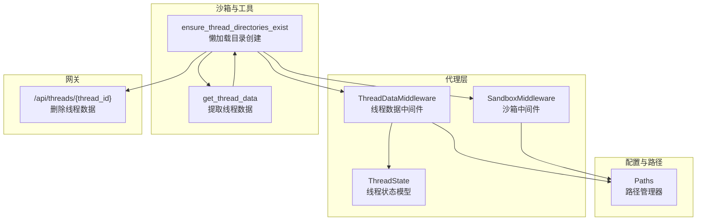
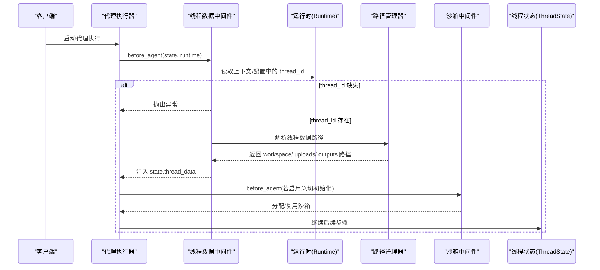
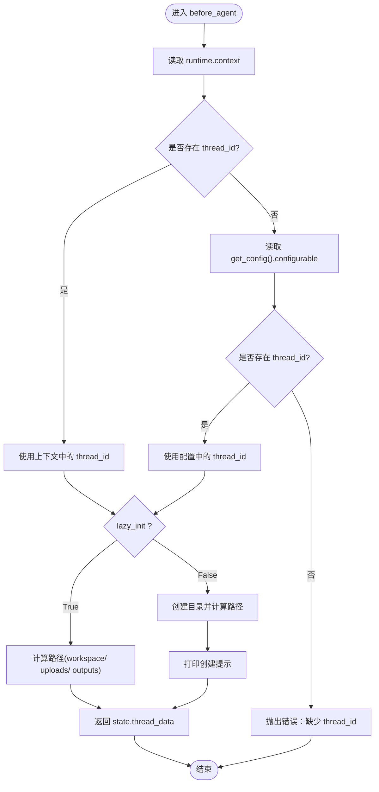
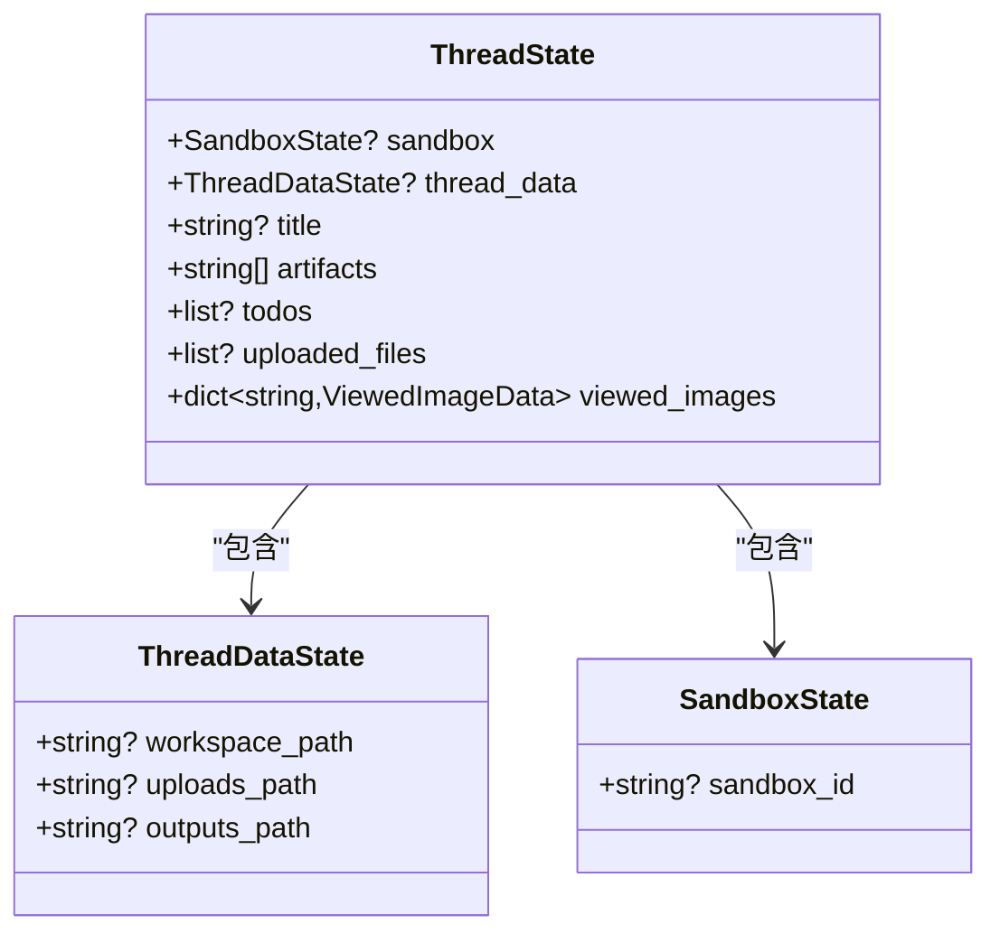
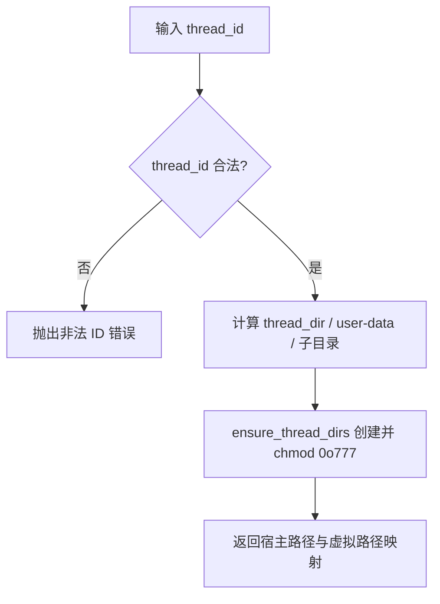
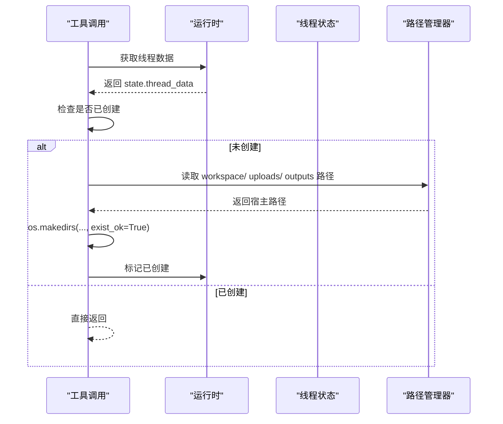
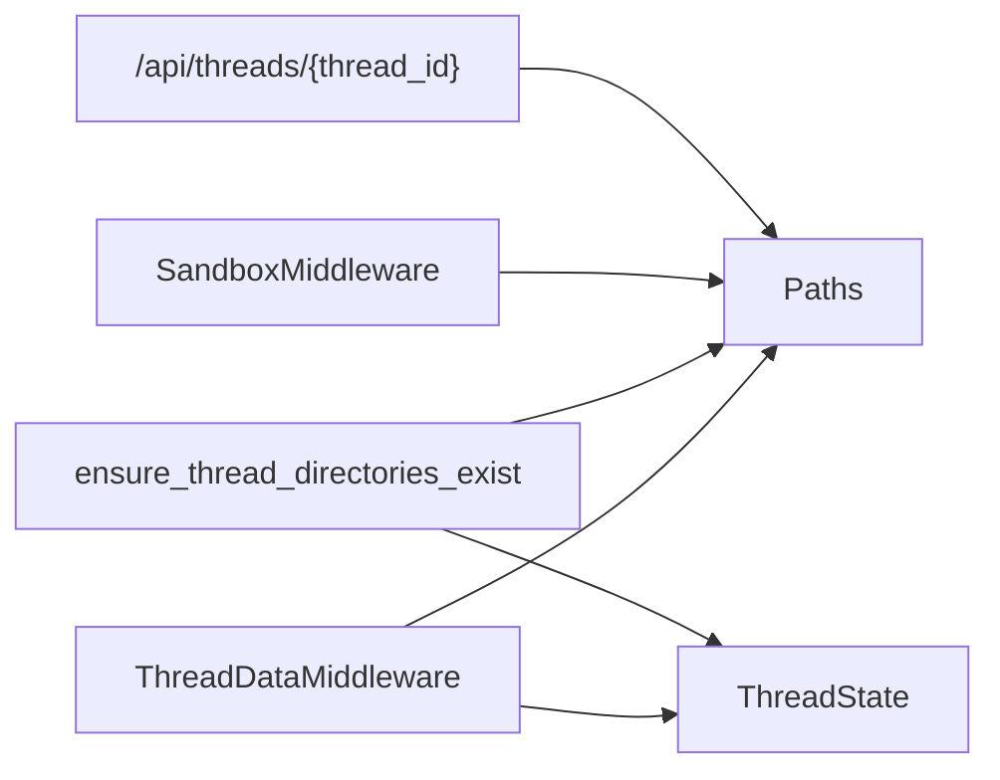

# 线程数据中间件

<cite>
**本文引用的文件**
- [backend/packages/harness/deerflow/agents/middlewares/thread_data_middleware.py](file://backend/packages/harness/deerflow/agents/middlewares/thread_data_middleware.py)
- [backend/packages/harness/deerflow/agents/thread_state.py](file://backend/packages/harness/deerflow/agents/thread_state.py)
- [backend/packages/harness/deerflow/config/paths.py](file://backend/packages/harness/deerflow/config/paths.py)
- [backend/packages/harness/deerflow/sandbox/tools.py](file://backend/packages/harness/deerflow/sandbox/tools.py)
- [backend/packages/harness/deerflow/sandbox/middleware.py](file://backend/packages/harness/deerflow/sandbox/middleware.py)
- [backend/app/gateway/routers/threads.py](file://backend/app/gateway/routers/threads.py)
- [backend/tests/test_thread_data_middleware.py](file://backend/tests/test_thread_data_middleware.py)
</cite>

## 目录
1. [引言](#引言)
2. [项目结构](#项目结构)
3. [核心组件](#核心组件)
4. [架构总览](#架构总览)
5. [详细组件分析](#详细组件分析)
6. [依赖分析](#依赖分析)
7. [性能考虑](#性能考虑)
8. [故障排查指南](#故障排查指南)
9. [结论](#结论)
10. [附录](#附录)

## 引言
本技术文档围绕 DeerFlow 线程数据中间件展开，系统阐述会话上下文数据在代理执行生命周期中的传递与管理机制，重点覆盖以下方面：
- 线程 ID 的提取、验证与传递路径
- 线程数据目录结构的创建与挂载策略
- 会话状态的一致性与完整性保障
- 线程数据配置选项、状态同步策略与并发访问控制
- 与会话管理系统（LangGraph）及沙箱中间件的集成关系与数据一致性保证

## 项目结构
线程数据中间件位于后端 Harness 包中，与路径管理、沙箱工具与中间件、以及网关线程清理接口共同构成完整的线程数据生命周期管理链路。

**图表来源**
- [backend/packages/harness/deerflow/agents/middlewares/thread_data_middleware.py:18-96](file://backend/packages/harness/deerflow/agents/middlewares/thread_data_middleware.py#L18-L96)
- [backend/packages/harness/deerflow/agents/thread_state.py:48-56](file://backend/packages/harness/deerflow/agents/thread_state.py#L48-L56)
- [backend/packages/harness/deerflow/config/paths.py:12-174](file://backend/packages/harness/deerflow/config/paths.py#L12-L174)
- [backend/packages/harness/deerflow/sandbox/tools.py:647-682](file://backend/packages/harness/deerflow/sandbox/tools.py#L647-L682)
- [backend/app/gateway/routers/threads.py:19-31](file://backend/app/gateway/routers/threads.py#L19-L31)

**章节来源**
- [backend/packages/harness/deerflow/agents/middlewares/thread_data_middleware.py:18-96](file://backend/packages/harness/deerflow/agents/middlewares/thread_data_middleware.py#L18-L96)
- [backend/packages/harness/deerflow/config/paths.py:12-174](file://backend/packages/harness/deerflow/config/paths.py#L12-L174)
- [backend/app/gateway/routers/threads.py:19-31](file://backend/app/gateway/routers/threads.py#L19-L31)

## 核心组件
- 线程数据中间件：负责在代理执行前从运行时上下文或配置中提取线程 ID，并注入线程数据路径到状态中；支持惰性初始化与急切初始化两种模式。
- 线程状态模型：定义线程状态字段，包括线程数据路径、工件列表、待办事项、上传文件、已查看图片等，提供合并规则以保证状态一致性。
- 路径管理器：集中管理线程数据目录结构与虚拟路径解析，确保宿主与沙箱之间的路径映射正确且安全。
- 沙箱工具与中间件：在工具调用时进行线程目录的懒加载创建，并与沙箱中间件协同完成沙箱生命周期管理。
- 网关线程清理接口：提供线程本地持久化数据的删除能力，配合路径管理器的安全删除逻辑。

**章节来源**
- [backend/packages/harness/deerflow/agents/middlewares/thread_data_middleware.py:18-96](file://backend/packages/harness/deerflow/agents/middlewares/thread_data_middleware.py#L18-L96)
- [backend/packages/harness/deerflow/agents/thread_state.py:48-56](file://backend/packages/harness/deerflow/agents/thread_state.py#L48-L56)
- [backend/packages/harness/deerflow/config/paths.py:12-174](file://backend/packages/harness/deerflow/config/paths.py#L12-L174)
- [backend/packages/harness/deerflow/sandbox/tools.py:647-682](file://backend/packages/harness/deerflow/sandbox/tools.py#L647-L682)
- [backend/packages/harness/deerflow/sandbox/middleware.py:21-84](file://backend/packages/harness/deerflow/sandbox/middleware.py#L21-L84)
- [backend/app/gateway/routers/threads.py:19-31](file://backend/app/gateway/routers/threads.py#L19-L31)

## 架构总览
线程数据中间件在代理执行前注入线程数据路径，随后沙箱中间件按需分配并复用沙箱环境。工具调用期间对线程目录进行懒加载创建，确保不同执行阶段的数据隔离与一致性。

**图表来源**
- [backend/packages/harness/deerflow/agents/middlewares/thread_data_middleware.py:73-96](file://backend/packages/harness/deerflow/agents/middlewares/thread_data_middleware.py#L73-L96)
- [backend/packages/harness/deerflow/config/paths.py:110-132](file://backend/packages/harness/deerflow/config/paths.py#L110-L132)
- [backend/packages/harness/deerflow/sandbox/middleware.py:51-65](file://backend/packages/harness/deerflow/sandbox/middleware.py#L51-L65)

## 详细组件分析

### 线程数据中间件（ThreadDataMiddleware）
职责与行为：
- 提取线程 ID：优先从运行时上下文读取，其次从配置的 configurable 中读取，均缺失则抛出明确错误。
- 路径计算：根据线程 ID 计算工作区、上传与输出目录的宿主路径，供沙箱挂载使用。
- 初始化策略：惰性初始化仅计算路径不创建目录；急切初始化在 before_agent 阶段创建目录并打印提示。
- 状态注入：返回包含线程数据路径的状态更新，供后续中间件与工具使用。

**图表来源**
- [backend/packages/harness/deerflow/agents/middlewares/thread_data_middleware.py:73-96](file://backend/packages/harness/deerflow/agents/middlewares/thread_data_middleware.py#L73-L96)
- [backend/packages/harness/deerflow/config/paths.py:110-132](file://backend/packages/harness/deerflow/config/paths.py#L110-L132)

**章节来源**
- [backend/packages/harness/deerflow/agents/middlewares/thread_data_middleware.py:33-96](file://backend/packages/harness/deerflow/agents/middlewares/thread_data_middleware.py#L33-L96)

### 线程状态模型（ThreadState）
职责与行为：
- 定义线程状态字段：沙箱信息、线程数据路径、标题、工件列表、待办事项、上传文件、已查看图片等。
- 提供合并规则：
  - 工件列表：去重合并，保持顺序。
  - 已查看图片：字典合并，空字典表示清空。
- 与中间件协作：作为中间件返回状态的承载对象，确保状态在多轮对话中被持久化与传播。

**图表来源**
- [backend/packages/harness/deerflow/agents/thread_state.py:10-56](file://backend/packages/harness/deerflow/agents/thread_state.py#L10-L56)

**章节来源**
- [backend/packages/harness/deerflow/agents/thread_state.py:10-56](file://backend/packages/harness/deerflow/agents/thread_state.py#L10-L56)

### 路径管理器（Paths）
职责与行为：
- 目录布局：统一管理线程数据目录结构（工作区、上传、输出、ACP 工作区），并确保权限兼容。
- 安全校验：对线程 ID 进行字符集限制，防止路径遍历；对虚拟路径解析进行边界匹配与相对路径校验。
- 单例与全局：提供全局实例与路径解析函数，便于跨模块共享。

**图表来源**
- [backend/packages/harness/deerflow/config/paths.py:95-173](file://backend/packages/harness/deerflow/config/paths.py#L95-L173)
- [backend/packages/harness/deerflow/config/paths.py:184-217](file://backend/packages/harness/deerflow/config/paths.py#L184-L217)

**章节来源**
- [backend/packages/harness/deerflow/config/paths.py:12-174](file://backend/packages/harness/deerflow/config/paths.py#L12-L174)

### 沙箱工具与懒加载目录创建
职责与行为：
- 在工具首次调用时，针对本地沙箱进行线程目录的懒加载创建，避免不必要的磁盘操作。
- 通过运行时状态标记避免重复创建，提升性能。
- 与线程数据中间件配合，确保工具执行时线程数据目录可用。

**图表来源**
- [backend/packages/harness/deerflow/sandbox/tools.py:647-682](file://backend/packages/harness/deerflow/sandbox/tools.py#L647-L682)
- [backend/packages/harness/deerflow/config/paths.py:110-132](file://backend/packages/harness/deerflow/config/paths.py#L110-L132)

**章节来源**
- [backend/packages/harness/deerflow/sandbox/tools.py:647-682](file://backend/packages/harness/deerflow/sandbox/tools.py#L647-L682)

### 沙箱中间件（SandboxMiddleware）
职责与行为：
- 按需分配与复用沙箱：支持惰性初始化（首次工具调用）与急切初始化（首次代理调用）。
- 生命周期管理：在 after_agent 阶段释放沙箱，避免频繁重建。
- 与线程数据中间件协同：两者均依赖线程 ID，确保同一线程的沙箱与数据路径一致。

**章节来源**
- [backend/packages/harness/deerflow/sandbox/middleware.py:21-84](file://backend/packages/harness/deerflow/sandbox/middleware.py#L21-L84)

### 网关线程清理接口
职责与行为：
- 提供删除线程本地持久化数据的 API，仅清理 DeerFlow 管理的线程目录，LangGraph 线程状态由 LangGraph API 处理。
- 删除前进行参数校验与异常转换，保证接口健壮性。

**章节来源**
- [backend/app/gateway/routers/threads.py:19-31](file://backend/app/gateway/routers/threads.py#L19-L31)

## 依赖分析
- 线程数据中间件依赖路径管理器以解析线程数据目录，并依赖 LangGraph 运行时上下文与配置。
- 线程状态模型作为状态载体，被多个中间件与工具共享。
- 沙箱工具依赖线程状态中的线程数据路径，结合路径管理器进行本地路径替换与校验。
- 网关线程清理接口依赖路径管理器进行安全删除。

**图表来源**
- [backend/packages/harness/deerflow/agents/middlewares/thread_data_middleware.py:18-96](file://backend/packages/harness/deerflow/agents/middlewares/thread_data_middleware.py#L18-L96)
- [backend/packages/harness/deerflow/agents/thread_state.py:48-56](file://backend/packages/harness/deerflow/agents/thread_state.py#L48-L56)
- [backend/packages/harness/deerflow/config/paths.py:12-174](file://backend/packages/harness/deerflow/config/paths.py#L12-L174)
- [backend/packages/harness/deerflow/sandbox/tools.py:647-682](file://backend/packages/harness/deerflow/sandbox/tools.py#L647-L682)
- [backend/app/gateway/routers/threads.py:19-31](file://backend/app/gateway/routers/threads.py#L19-L31)

**章节来源**
- [backend/packages/harness/deerflow/agents/middlewares/thread_data_middleware.py:18-96](file://backend/packages/harness/deerflow/agents/middlewares/thread_data_middleware.py#L18-L96)
- [backend/packages/harness/deerflow/agents/thread_state.py:48-56](file://backend/packages/harness/deerflow/agents/thread_state.py#L48-L56)
- [backend/packages/harness/deerflow/config/paths.py:12-174](file://backend/packages/harness/deerflow/config/paths.py#L12-L174)
- [backend/packages/harness/deerflow/sandbox/tools.py:647-682](file://backend/packages/harness/deerflow/sandbox/tools.py#L647-L682)
- [backend/app/gateway/routers/threads.py:19-31](file://backend/app/gateway/routers/threads.py#L19-L31)

## 性能考虑
- 惰性初始化：默认启用惰性初始化，仅计算路径不创建目录，减少不必要的 I/O 开销。
- 目录懒加载：工具首次调用时才创建本地沙箱目录，避免空转场景下的资源占用。
- 权限设置：目录创建时显式设置权限，避免因 umask 导致的权限问题引发重试与失败。
- 并发控制：沙箱分配采用线程锁与文件锁，确保同一线程在多进程场景下的一致性与原子性。

[本节为通用性能讨论，无需列出具体文件来源]

## 故障排查指南
常见问题与定位要点：
- 线程 ID 缺失
  - 现象：中间件抛出“缺少 thread_id”的错误。
  - 排查：检查运行时上下文与配置的 configurable 是否包含 thread_id；参考单元测试用例断言。
- 目录创建失败或权限不足
  - 现象：工具执行时报错或无法写入。
  - 排查：确认路径管理器已创建目录且权限为 0o777；检查本地沙箱懒加载是否执行。
- 虚拟路径解析错误
  - 现象：路径不在预期前缀或出现路径遍历。
  - 排查：确认虚拟路径以固定前缀开头，且解析后未越出 user-data 根目录。
- 线程数据清理无效
  - 现象：删除接口返回成功但数据仍存在。
  - 排查：确认传入的 thread_id 合法且路径管理器允许删除；检查异常处理分支。

**章节来源**
- [backend/tests/test_thread_data_middleware.py:46-54](file://backend/tests/test_thread_data_middleware.py#L46-L54)
- [backend/packages/harness/deerflow/config/paths.py:184-217](file://backend/packages/harness/deerflow/config/paths.py#L184-L217)
- [backend/app/gateway/routers/threads.py:19-31](file://backend/app/gateway/routers/threads.py#L19-L31)

## 结论
线程数据中间件通过明确的线程 ID 提取与验证、灵活的初始化策略、以及与路径管理器和沙箱中间件的紧密协作，实现了会话上下文中线程数据的可靠传递与管理。其惰性初始化与懒加载目录创建有效平衡了性能与可用性，配合严格的路径安全校验与并发控制，保障了会话状态的一致性与完整性。

[本节为总结性内容，无需列出具体文件来源]

## 附录

### 线程数据配置选项与状态同步策略
- 初始化模式
  - 惰性初始化（默认）：仅计算路径，不创建目录。
  - 急切初始化：在 before_agent 阶段创建目录。
- 状态同步
  - 中间件返回的线程数据路径写入状态，后续中间件与工具可直接读取。
  - 线程状态模型提供合并规则，确保多轮对话中工件与图片状态的正确累积与清空。

**章节来源**
- [backend/packages/harness/deerflow/agents/middlewares/thread_data_middleware.py:33-44](file://backend/packages/harness/deerflow/agents/middlewares/thread_data_middleware.py#L33-L44)
- [backend/packages/harness/deerflow/agents/thread_state.py:21-45](file://backend/packages/harness/deerflow/agents/thread_state.py#L21-L45)

### 并发访问控制与一致性保证
- 线程 ID 校验：仅允许安全字符，防止路径遍历。
- 沙箱分配锁：线程级锁与文件锁确保同一 thread_id 的分配原子性。
- 目录权限：显式 chmod 0o777，避免容器与宿主 UID 差异导致的权限问题。
- 状态合并：TypedDict 与自定义合并器保证状态字段的类型安全与一致性。

**章节来源**
- [backend/packages/harness/deerflow/config/paths.py:9-10](file://backend/packages/harness/deerflow/config/paths.py#L9-L10)
- [backend/packages/harness/deerflow/community/aio_sandbox/aio_sandbox_provider.py:319-351](file://backend/packages/harness/deerflow/community/aio_sandbox/aio_sandbox_provider.py#L319-L351)
- [backend/packages/harness/deerflow/config/paths.py:153-173](file://backend/packages/harness/deerflow/config/paths.py#L153-L173)