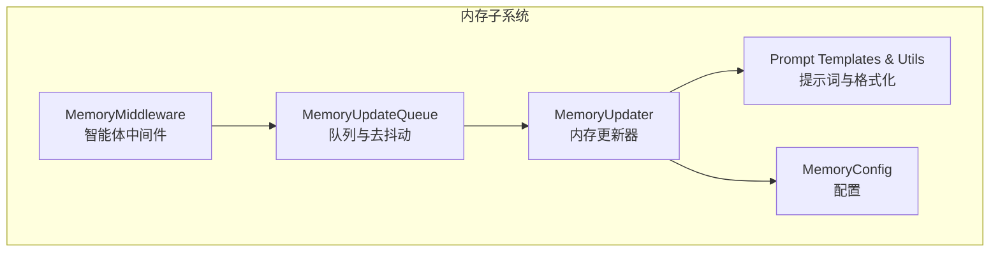
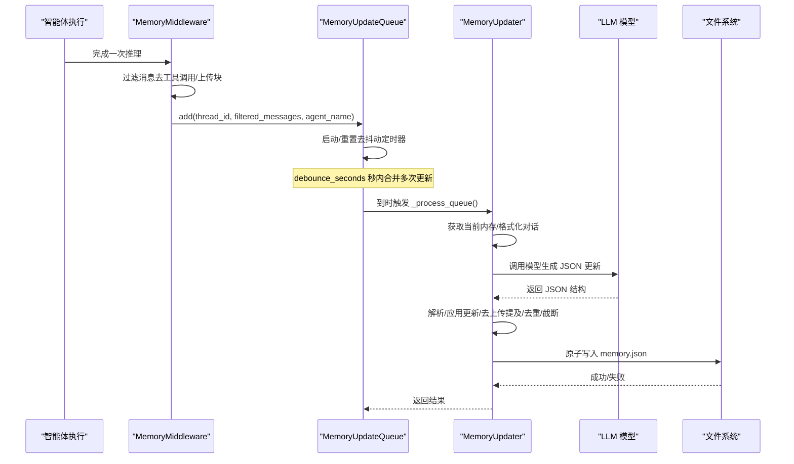
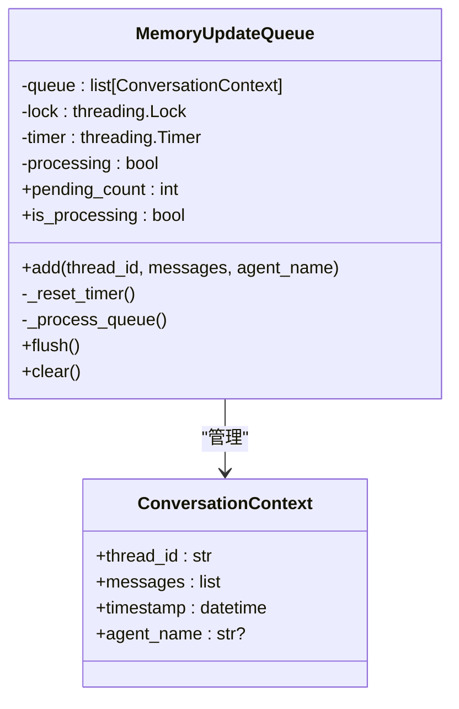
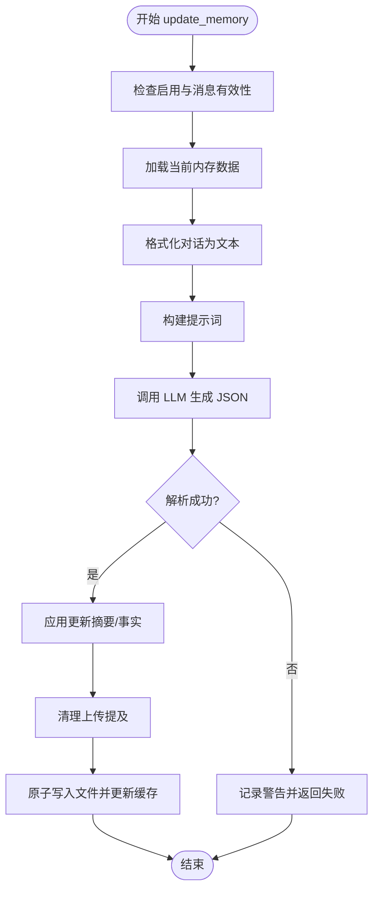
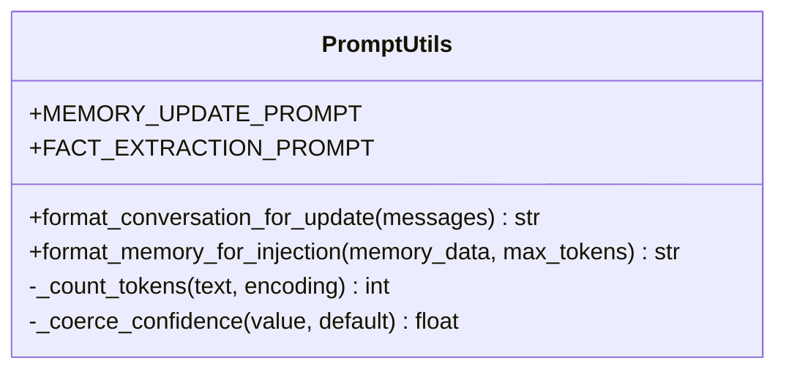
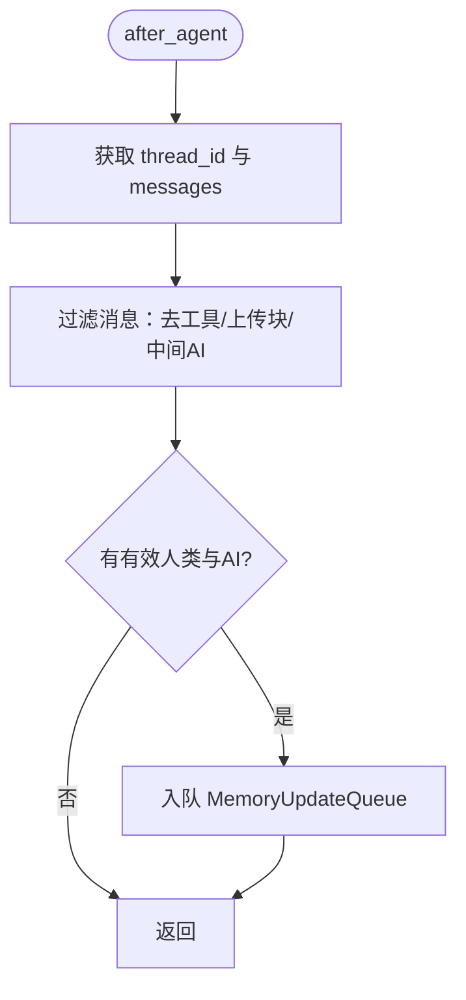
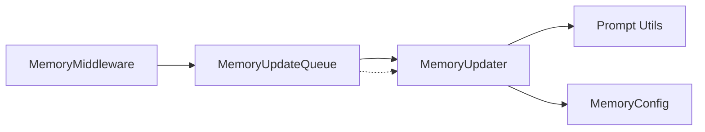

# 内存更新器

<cite>
**本文引用的文件**
- [updater.py](file://backend/packages/harness/deerflow/agents/memory/updater.py)
- [queue.py](file://backend/packages/harness/deerflow/agents/memory/queue.py)
- [prompt.py](file://backend/packages/harness/deerflow/agents/memory/prompt.py)
- [memory_config.py](file://backend/packages/harness/deerflow/config/memory_config.py)
- [memory_middleware.py](file://backend/packages/harness/deerflow/agents/middlewares/memory_middleware.py)
- [test_memory_updater.py](file://backend/tests/test_memory_updater.py)
</cite>

## 目录
1. [简介](#简介)
2. [项目结构](#项目结构)
3. [核心组件](#核心组件)
4. [架构总览](#架构总览)
5. [详细组件分析](#详细组件分析)
6. [依赖分析](#依赖分析)
7. [性能考虑](#性能考虑)
8. [故障排查指南](#故障排查指南)
9. [结论](#结论)
10. [附录](#附录)

## 简介
本文件面向 DeerFlow 的“内存更新器”，系统性阐述其核心算法、消息过滤策略与异步更新机制，覆盖工作流程、错误处理与重试策略、配置项、性能监控与容量管理，并提供与队列系统、智能体系统的集成关系说明。读者可据此实现内存更新示例、自定义更新策略与调试技巧。

## 项目结构
内存更新器由以下模块协同完成：
- 队列模块：负责收集与去抖动（debounce）批量处理，避免频繁写入磁盘与 LLM 调用。
- 更新器模块：负责从对话中抽取事实、更新用户与历史摘要、持久化到 JSON 文件。
- 提示词模块：提供记忆更新与注入的提示模板、对话格式化工具与令牌计数。
- 配置模块：集中管理启用开关、存储路径、模型名、最大事实数、置信度阈值、注入开关与令牌上限等。
- 中间件模块：在智能体执行后自动收集对话并入队，进行消息过滤以剔除工具调用与上传块。

图表来源
- [queue.py:22-196](file://backend/packages/harness/deerflow/agents/memory/queue.py#L22-L196)
- [updater.py:267-443](file://backend/packages/harness/deerflow/agents/memory/updater.py#L267-L443)
- [prompt.py:14-341](file://backend/packages/harness/deerflow/agents/memory/prompt.py#L14-L341)
- [memory_config.py:6-79](file://backend/packages/harness/deerflow/config/memory_config.py#L6-L79)
- [memory_middleware.py:86-150](file://backend/packages/harness/deerflow/agents/middlewares/memory_middleware.py#L86-L150)

章节来源
- [queue.py:1-196](file://backend/packages/harness/deerflow/agents/memory/queue.py#L1-L196)
- [updater.py:1-443](file://backend/packages/harness/deerflow/agents/memory/updater.py#L1-L443)
- [prompt.py:1-341](file://backend/packages/harness/deerflow/agents/memory/prompt.py#L1-L341)
- [memory_config.py:1-79](file://backend/packages/harness/deerflow/config/memory_config.py#L1-L79)
- [memory_middleware.py:1-150](file://backend/packages/harness/deerflow/agents/middlewares/memory_middleware.py#L1-L150)

## 核心组件
- MemoryUpdateQueue：线程安全的队列，支持去抖动定时器、批处理、并发保护与全局单例访问。
- MemoryUpdater：基于 LLM 的内存更新器，负责构建提示词、调用模型、解析响应、应用更新、清理上传提及、持久化。
- Prompt 模板与工具：提供 MEMORY_UPDATE_PROMPT、FACT_EXTRACTION_PROMPT、format_conversation_for_update、format_memory_for_injection、令牌计数与置信度归一化。
- MemoryConfig：集中配置启用状态、存储路径、去抖秒数、模型名、最大事实数、事实置信度阈值、是否注入、注入最大令牌数。
- MemoryMiddleware：在智能体执行后自动收集对话，过滤工具调用与上传块，入队等待去抖动后统一更新。

章节来源
- [queue.py:22-196](file://backend/packages/harness/deerflow/agents/memory/queue.py#L22-L196)
- [updater.py:267-443](file://backend/packages/harness/deerflow/agents/memory/updater.py#L267-L443)
- [prompt.py:14-341](file://backend/packages/harness/deerflow/agents/memory/prompt.py#L14-L341)
- [memory_config.py:6-79](file://backend/packages/harness/deerflow/config/memory_config.py#L6-L79)
- [memory_middleware.py:86-150](file://backend/packages/harness/deerflow/agents/middlewares/memory_middleware.py#L86-L150)

## 架构总览
内存更新器采用“中间件触发 → 队列去抖 → 批量更新 → LLM 解析 → 写入持久化”的流水线式设计。消息过滤确保只保留最终人类输入与最终 AI 响应，避免工具调用与上传块污染长期记忆。

图表来源
- [memory_middleware.py:107-149](file://backend/packages/harness/deerflow/agents/middlewares/memory_middleware.py#L107-L149)
- [queue.py:84-130](file://backend/packages/harness/deerflow/agents/memory/queue.py#L84-L130)
- [updater.py:284-348](file://backend/packages/harness/deerflow/agents/memory/updater.py#L284-L348)

## 详细组件分析

### 组件一：MemoryUpdateQueue（队列与去抖动）
- 设计要点
  - 使用线程锁保证并发安全；Timer 实现去抖动；批处理合并同一 thread_id 的最新上下文。
  - 处理中避免重复触发，通过标志位与复制队列避免竞态。
  - 支持 flush 强制处理、clear 清空、pending_count 与 is_processing 状态查询。
- 关键行为
  - add：去重旧同 thread_id 上下文，追加新上下文，重置去抖动定时器。
  - _process_queue：串行处理队列，逐条调用 MemoryUpdater.update_memory，小延迟避免限流。
  - flush/clear：测试与优雅关闭场景使用。
- 并发与容错
  - Timer 取消与重新启动；处理中再次入队会延后至下一轮。
  - 异常捕获并打印，不影响其他上下文处理。

图表来源
- [queue.py:12-196](file://backend/packages/harness/deerflow/agents/memory/queue.py#L12-L196)

章节来源
- [queue.py:22-196](file://backend/packages/harness/deerflow/agents/memory/queue.py#L22-L196)

### 组件二：MemoryUpdater（内存更新器）
- 设计要点
  - 基于提示词模板与对话格式化函数，调用 LLM 生成 JSON 更新结构。
  - 解析响应时兼容字符串与列表内容块，去除代码块包装，再进行 JSON 解析。
  - 应用更新时严格遵循 shouldUpdate 与摘要长度约束；事实去重、按置信度截断、移除指定事实。
  - 在保存前清理上传提及，避免未来会话找不到已过期文件。
- 关键流程
  - update_memory：校验启用与消息有效性；获取当前内存；格式化对话；构建提示词；调用模型；解析并应用更新；清理上传提及；原子写入。
  - _apply_updates：更新 user/history 摘要；删除指定事实；新增高置信度事实；去重；按置信度排序并限制数量。
  - _extract_text：将 LLM 多模态内容块拼接为纯文本，避免 repr 影响 JSON 解析。
  - _save_memory_to_file：目录创建、时间戳更新、临时文件写入与原子替换、缓存更新。
- 错误处理
  - JSON 解析失败记录警告；其他异常记录异常日志并返回失败。
  - 文件读写异常记录错误日志并返回失败。

图表来源
- [updater.py:284-348](file://backend/packages/harness/deerflow/agents/memory/updater.py#L284-L348)
- [updater.py:350-427](file://backend/packages/harness/deerflow/agents/memory/updater.py#L350-L427)
- [updater.py:225-265](file://backend/packages/harness/deerflow/agents/memory/updater.py#L225-L265)

章节来源
- [updater.py:267-443](file://backend/packages/harness/deerflow/agents/memory/updater.py#L267-L443)

### 组件三：提示词与格式化（Prompt 与工具）
- 提示词模板
  - MEMORY_UPDATE_PROMPT：指导 LLM 分析对话并输出 JSON，包含 user/history 摘要更新与 newFacts/factsToRemove。
  - FACT_EXTRACTION_PROMPT：从单条消息提取事实。
- 工具函数
  - format_conversation_for_update：将消息列表格式化为“User/Assistant”文本，剥离人类消息中的上传块，长消息截断。
  - format_memory_for_injection：将内存格式化为系统提示注入文本，按令牌预算动态裁剪。
  - _count_tokens：优先使用 tiktoken 计数，不可用时退化为字符估算。
  - _coerce_confidence：对置信度进行边界归一化，避免非有限值影响排序。

图表来源
- [prompt.py:14-341](file://backend/packages/harness/deerflow/agents/memory/prompt.py#L14-L341)

章节来源
- [prompt.py:14-341](file://backend/packages/harness/deerflow/agents/memory/prompt.py#L14-L341)

### 组件四：配置（MemoryConfig）
- 关键字段
  - enabled：是否启用内存机制。
  - storage_path：内存文件存储路径（相对路径按 base_dir 解析）。
  - debounce_seconds：去抖动秒数（1–300）。
  - model_name：用于内存更新的模型名（None 表示默认）。
  - max_facts：最大事实数（10–500）。
  - fact_confidence_threshold：事实置信度阈值（0–1）。
  - injection_enabled：是否将内存注入系统提示。
  - max_injection_tokens：注入最大令牌数（100–8000）。
- 全局实例与加载：提供 get/set/load_memory_config_from_dict。

章节来源
- [memory_config.py:6-79](file://backend/packages/harness/deerflow/config/memory_config.py#L6-L79)

### 组件五：智能体中间件（MemoryMiddleware）
- 设计要点
  - after_agent 钩子在智能体执行后触发，从运行时上下文提取 thread_id，从状态中获取 messages。
  - 消息过滤策略：仅保留人类输入（去除上传块）与最终 AI 响应（不含 tool_calls），丢弃工具消息与中间 AI 步骤。
  - 将过滤后的对话入队，交由 MemoryUpdateQueue 去抖动与批处理。
- 过滤规则
  - 上传块正则匹配并剥离；若剥离后为空，则整轮对话被跳过（配对的人类与 AI 均忽略）。
  - 仅保留最终 AI 回复，避免工具调用中间结果进入记忆。

图表来源
- [memory_middleware.py:107-149](file://backend/packages/harness/deerflow/agents/middlewares/memory_middleware.py#L107-L149)
- [memory_middleware.py:20-83](file://backend/packages/harness/deerflow/agents/middlewares/memory_middleware.py#L20-L83)

章节来源
- [memory_middleware.py:1-150](file://backend/packages/harness/deerflow/agents/middlewares/memory_middleware.py#L1-L150)

## 依赖分析
- 组件耦合
  - MemoryMiddleware 依赖 MemoryUpdateQueue；Queue 在处理时反向依赖 MemoryUpdater，形成单向链路，避免循环导入。
  - MemoryUpdater 依赖 Prompt 模板与工具、配置模块、路径与模型工厂。
  - Updater 与 Queue 均依赖 MemoryConfig。
- 外部依赖
  - tiktoken：用于准确令牌计数；缺失时退化为字符估算。
  - LLM 模型：通过 create_chat_model 创建，具体实现由上层配置决定。
  - 文件系统：原子写入（临时文件 + 替换）保障一致性。

图表来源
- [memory_middleware.py:10,11:10-11](file://backend/packages/harness/deerflow/agents/middlewares/memory_middleware.py#L10-L11)
- [queue.py:87](file://backend/packages/harness/deerflow/agents/memory/queue.py#L87)
- [updater.py:11,15,17:11-17](file://backend/packages/harness/deerflow/agents/memory/updater.py#L11-L17)

章节来源
- [memory_middleware.py:1-150](file://backend/packages/harness/deerflow/agents/middlewares/memory_middleware.py#L1-L150)
- [queue.py:1-196](file://backend/packages/harness/deerflow/agents/memory/queue.py#L1-L196)
- [updater.py:1-443](file://backend/packages/harness/deerflow/agents/memory/updater.py#L1-L443)

## 性能考虑
- 去抖动与批处理
  - debounce_seconds 控制合并窗口，减少频繁 I/O 与 LLM 调用；窗口内多次更新会被合并为一次处理。
- 写入优化
  - 原子写入：先写临时文件，再替换目标文件，降低中断风险。
  - 缓存：按文件修改时间缓存内存数据，避免重复读取。
- 令牌预算与截断
  - format_memory_for_injection 动态计算令牌，超出 max_injection_tokens 时按比例截断，确保系统提示不越界。
- 事实容量管理
  - max_facts 限制事实总数；按置信度降序保留高质量事实，低置信度自动淘汰。
- 并发与限流
  - 处理队列串行化，队列内多条更新之间有短间隔，避免 LLM 限流或资源争用。

章节来源
- [queue.py:66-83](file://backend/packages/harness/deerflow/agents/memory/queue.py#L66-L83)
- [updater.py:225-265](file://backend/packages/harness/deerflow/agents/memory/updater.py#L225-L265)
- [prompt.py:186-294](file://backend/packages/harness/deerflow/agents/memory/prompt.py#L186-L294)
- [memory_config.py:36-57](file://backend/packages/harness/deerflow/config/memory_config.py#L36-L57)

## 故障排查指南
- 常见问题与定位
  - LLM 返回非标准 JSON 或带代码块：_extract_text 会剥离代码块并拼接文本，确保 JSON 解析；如仍失败，检查提示词模板与模型输出稳定性。
  - 内存文件读取失败：_load_memory_from_file 对 JSONDecodeError 与 OSError 进行降级处理，返回空内存结构；检查文件权限与路径。
  - 写入失败：_save_memory_to_file 捕获 OSError 并记录错误；检查存储路径是否存在且可写。
  - 上传文件导致记忆异常：_strip_upload_mentions_from_memory 与提示词明确禁止记录上传事件；确认中间件过滤与提示词规则生效。
- 单元测试参考
  - 测试事实去重、阈值与截断、列表内容块解析、上传块剥离等关键逻辑，便于回归验证与自定义扩展。

章节来源
- [updater.py:156-177](file://backend/packages/harness/deerflow/agents/memory/updater.py#L156-L177)
- [updater.py:343-348](file://backend/packages/harness/deerflow/agents/memory/updater.py#L343-L348)
- [test_memory_updater.py:1-289](file://backend/tests/test_memory_updater.py#L1-L289)

## 结论
内存更新器通过“中间件触发 + 队列去抖 + 批量更新 + LLM 解析 + 原子写入”的闭环，实现了稳定、可扩展的记忆维护。其消息过滤策略确保长期记忆的准确性与时效性；配置化参数满足不同部署场景；测试用例覆盖关键路径，便于持续演进。

## 附录

### 配置项速查
- enabled：是否启用
- storage_path：内存文件存储路径
- debounce_seconds：去抖动秒数
- model_name：模型名
- max_facts：最大事实数
- fact_confidence_threshold：事实置信度阈值
- injection_enabled：是否注入
- max_injection_tokens：注入最大令牌数

章节来源
- [memory_config.py:6-79](file://backend/packages/harness/deerflow/config/memory_config.py#L6-L79)

### 示例与最佳实践
- 示例：在智能体执行完成后自动入队，等待去抖动后统一更新。
- 自定义策略：调整 debounce_seconds 以平衡实时性与吞吐；提高 max_facts 与 max_injection_tokens 以承载更丰富记忆；提升 fact_confidence_threshold 以增强事实质量。
- 调试技巧：开启日志观察队列大小与处理耗时；在测试中使用 flush 强制处理；利用单元测试覆盖自定义逻辑。

章节来源
- [memory_middleware.py:107-149](file://backend/packages/harness/deerflow/agents/middlewares/memory_middleware.py#L107-L149)
- [queue.py:131-141](file://backend/packages/harness/deerflow/agents/memory/queue.py#L131-L141)
- [test_memory_updater.py:1-289](file://backend/tests/test_memory_updater.py#L1-L289)