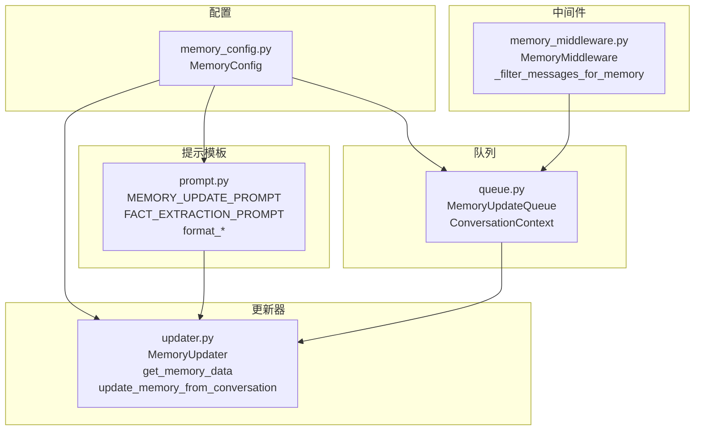
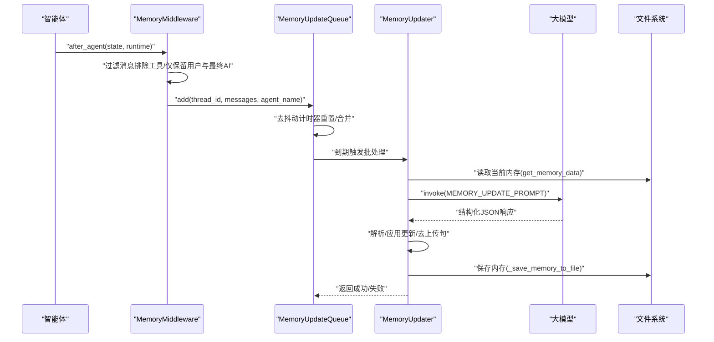
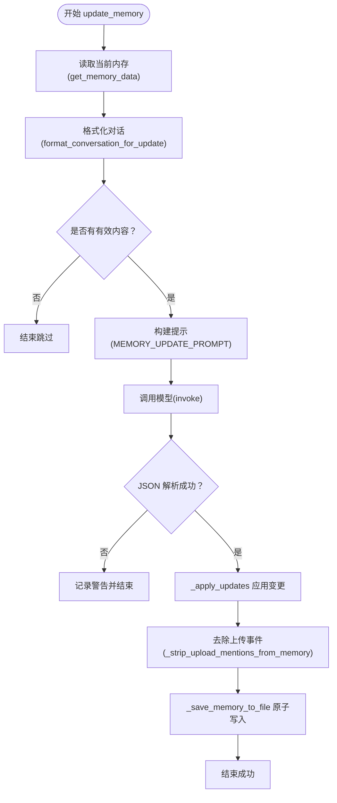
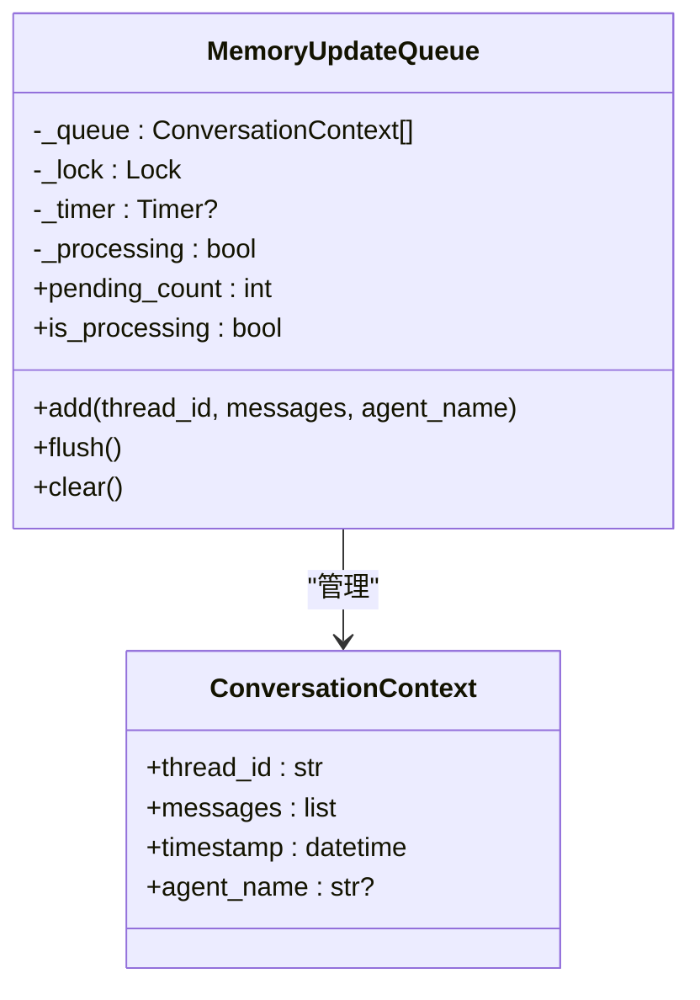
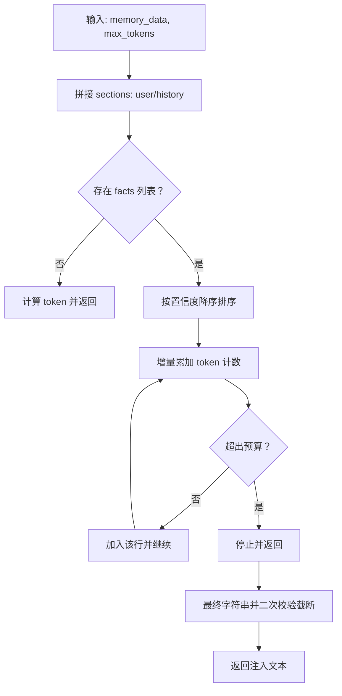
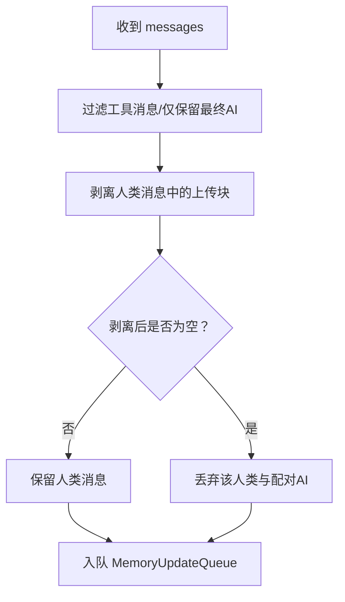
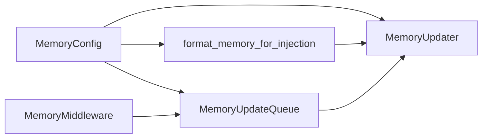

# 内存管理系统

<cite>
**本文引用的文件**
- [backend/packages/harness/deerflow/agents/memory/__init__.py](file://backend/packages/harness/deerflow/agents/memory/__init__.py)
- [backend/packages/harness/deerflow/agents/memory/updater.py](file://backend/packages/harness/deerflow/agents/memory/updater.py)
- [backend/packages/harness/deerflow/agents/memory/queue.py](file://backend/packages/harness/deerflow/agents/memory/queue.py)
- [backend/packages/harness/deerflow/agents/memory/prompt.py](file://backend/packages/harness/deerflow/agents/memory/prompt.py)
- [backend/packages/harness/deerflow/config/memory_config.py](file://backend/packages/harness/deerflow/config/memory_config.py)
- [backend/packages/harness/deerflow/agents/middlewares/memory_middleware.py](file://backend/packages/harness/deerflow/agents/middlewares/memory_middleware.py)
- [backend/docs/MEMORY_IMPROVEMENTS.md](file://backend/docs/MEMORY_IMPROVEMENTS.md)
- [backend/docs/MEMORY_IMPROVEMENTS_SUMMARY.md](file://backend/docs/MEMORY_IMPROVEMENTS_SUMMARY.md)
- [backend/tests/test_memory_updater.py](file://backend/tests/test_memory_updater.py)
- [backend/tests/test_memory_prompt_injection.py](file://backend/tests/test_memory_prompt_injection.py)
- [backend/tests/test_memory_upload_filtering.py](file://backend/tests/test_memory_upload_filtering.py)
</cite>

## 目录
1. [简介](#简介)
2. [项目结构](#项目结构)
3. [核心组件](#核心组件)
4. [架构总览](#架构总览)
5. [详细组件分析](#详细组件分析)
6. [依赖分析](#依赖分析)
7. [性能考虑](#性能考虑)
8. [故障排查指南](#故障排查指南)
9. [结论](#结论)
10. [附录：使用示例与自定义策略开发](#附录使用示例与自定义策略开发)

## 简介
本文件系统性阐述 DeerFlow 的长期记忆（Long-Term Memory）架构，涵盖以下主题：
- 长期记忆的数据模型与存储位置
- 内存队列与异步更新机制
- 提示工程与记忆过滤策略
- 内存配置项、容量管理与性能优化
- 与智能体、会话管理的集成关系
- 使用示例与自定义内存策略开发指南

## 项目结构
内存系统主要由以下模块组成：
- 配置层：内存开关、存储路径、去抖动窗口、最大事实数、置信度阈值、注入开关与令牌预算等
- 提示模板层：用于记忆更新与注入格式化的提示词
- 更新器层：负责读取/写入内存、调用大模型进行总结、应用更新、持久化
- 队列层：带去抖动的内存更新队列，聚合多轮对话，异步批处理
- 中间件层：在智能体执行后自动收集对话片段，过滤上传事件，入队异步更新
- 文档与测试：记录当前实现与未来规划，提供回归测试覆盖

图表来源
- [backend/packages/harness/deerflow/config/memory_config.py:6-79](file://backend/packages/harness/deerflow/config/memory_config.py#L6-L79)
- [backend/packages/harness/deerflow/agents/memory/prompt.py:14-146](file://backend/packages/harness/deerflow/agents/memory/prompt.py#L14-L146)
- [backend/packages/harness/deerflow/agents/memory/updater.py:267-443](file://backend/packages/harness/deerflow/agents/memory/updater.py#L267-L443)
- [backend/packages/harness/deerflow/agents/memory/queue.py:22-196](file://backend/packages/harness/deerflow/agents/memory/queue.py#L22-L196)
- [backend/packages/harness/deerflow/agents/middlewares/memory_middleware.py:86-150](file://backend/packages/harness/deerflow/agents/middlewares/memory_middleware.py#L86-L150)

章节来源
- [backend/packages/harness/deerflow/agents/memory/__init__.py:1-45](file://backend/packages/harness/deerflow/agents/memory/__init__.py#L1-L45)

## 核心组件
- MemoryConfig：集中式内存配置，包含启用开关、存储路径、去抖动秒数、模型名、最大事实数、事实置信度阈值、是否注入、最大注入令牌数等
- 提示模板：MEMORY_UPDATE_PROMPT 定义记忆更新任务与输出结构；FACT_EXTRACTION_PROMPT 用于单条消息的事实抽取；format_memory_for_injection 将记忆格式化为系统提示注入文本
- MemoryUpdater：负责加载/保存内存、调用模型、解析响应、应用更新、清理上传事件、持久化
- MemoryUpdateQueue：线程安全队列，支持去抖动合并、并发保护、批量处理、强制刷新与清空
- MemoryMiddleware：在智能体执行后过滤消息、入队异步更新，并与运行时上下文中的 thread_id 绑定

章节来源
- [backend/packages/harness/deerflow/config/memory_config.py:6-79](file://backend/packages/harness/deerflow/config/memory_config.py#L6-L79)
- [backend/packages/harness/deerflow/agents/memory/prompt.py:14-146](file://backend/packages/harness/deerflow/agents/memory/prompt.py#L14-L146)
- [backend/packages/harness/deerflow/agents/memory/updater.py:267-443](file://backend/packages/harness/deerflow/agents/memory/updater.py#L267-L443)
- [backend/packages/harness/deerflow/agents/memory/queue.py:22-196](file://backend/packages/harness/deerflow/agents/memory/queue.py#L22-L196)
- [backend/packages/harness/deerflow/agents/middlewares/memory_middleware.py:86-150](file://backend/packages/harness/deerflow/agents/middlewares/memory_middleware.py#L86-L150)

## 架构总览
下图展示从智能体到内存更新的端到端流程，包括消息过滤、队列去抖动、异步批处理与模型更新。

图表来源
- [backend/packages/harness/deerflow/agents/middlewares/memory_middleware.py:108-149](file://backend/packages/harness/deerflow/agents/middlewares/memory_middleware.py#L108-L149)
- [backend/packages/harness/deerflow/agents/memory/queue.py:84-130](file://backend/packages/harness/deerflow/agents/memory/queue.py#L84-L130)
- [backend/packages/harness/deerflow/agents/memory/updater.py:284-348](file://backend/packages/harness/deerflow/agents/memory/updater.py#L284-L348)

## 详细组件分析

### MemoryUpdater 工作原理
- 加载与缓存：按 agent_name 或全局路径定位内存文件，基于文件修改时间缓存，避免重复 IO
- 对话格式化：将消息列表转为纯文本，剥离人类消息中的上传块，限制单条长度
- 调用模型：构造 MEMORY_UPDATE_PROMPT，调用指定模型，解析 JSON 响应
- 应用更新：更新 user/history 段落摘要、新增/删除事实、去重与置信度阈值控制、事实上限裁剪
- 过滤上传事件：对所有摘要与事实进行正则清洗，避免会话级上传信息进入长期记忆
- 持久化：原子写入（临时文件 + 重命名），更新缓存与 mtime

图表来源
- [backend/packages/harness/deerflow/agents/memory/updater.py:284-348](file://backend/packages/harness/deerflow/agents/memory/updater.py#L284-L348)
- [backend/packages/harness/deerflow/agents/memory/prompt.py:297-341](file://backend/packages/harness/deerflow/agents/memory/prompt.py#L297-L341)

章节来源
- [backend/packages/harness/deerflow/agents/memory/updater.py:67-117](file://backend/packages/harness/deerflow/agents/memory/updater.py#L67-L117)
- [backend/packages/harness/deerflow/agents/memory/updater.py:156-177](file://backend/packages/harness/deerflow/agents/memory/updater.py#L156-L177)
- [backend/packages/harness/deerflow/agents/memory/updater.py:193-214](file://backend/packages/harness/deerflow/agents/memory/updater.py#L193-L214)
- [backend/packages/harness/deerflow/agents/memory/updater.py:225-265](file://backend/packages/harness/deerflow/agents/memory/updater.py#L225-L265)
- [backend/packages/harness/deerflow/agents/memory/updater.py:350-427](file://backend/packages/harness/deerflow/agents/memory/updater.py#L350-L427)
- [backend/packages/harness/deerflow/agents/memory/updater.py:430-443](file://backend/packages/harness/deerflow/agents/memory/updater.py#L430-L443)

### MemoryUpdateQueue 异步更新机制
- 去抖动：同一 thread_id 在 debounce_seconds 内的新消息替换旧队列项，重置计时器
- 批处理：到期后复制队列、清空原队列、串行处理每个上下文，小延迟避免限流
- 并发安全：锁保护队列状态与处理标志，防止竞态
- 可控接口：flush 强制立即处理；clear 清空不处理；pending_count/is_processing 查询状态

图表来源
- [backend/packages/harness/deerflow/agents/memory/queue.py:12-20](file://backend/packages/harness/deerflow/agents/memory/queue.py#L12-L20)
- [backend/packages/harness/deerflow/agents/memory/queue.py:22-166](file://backend/packages/harness/deerflow/agents/memory/queue.py#L22-L166)

章节来源
- [backend/packages/harness/deerflow/agents/memory/queue.py:37-83](file://backend/packages/harness/deerflow/agents/memory/queue.py#L37-L83)
- [backend/packages/harness/deerflow/agents/memory/queue.py:84-130](file://backend/packages/harness/deerflow/agents/memory/queue.py#L84-L130)
- [backend/packages/harness/deerflow/agents/memory/queue.py:131-166](file://backend/packages/harness/deerflow/agents/memory/queue.py#L131-L166)

### 提示工程与记忆注入
- MEMORY_UPDATE_PROMPT：明确用户上下文（workContext/personalContext/topOfMind）、历史（recentMonths/earlierContext/longTermBackground）、事实抽取类别与置信度规则，要求只返回合法 JSON
- FACT_EXTRACTION_PROMPT：针对单条消息抽取事实，便于细粒度事实提取
- format_memory_for_injection：将 user/history/facts 拼接为系统提示注入文本，按置信度降序、令牌预算上限进行截断，支持 tiktoken 准确计数或回退估算

图表来源
- [backend/packages/harness/deerflow/agents/memory/prompt.py:186-295](file://backend/packages/harness/deerflow/agents/memory/prompt.py#L186-L295)

章节来源
- [backend/packages/harness/deerflow/agents/memory/prompt.py:14-118](file://backend/packages/harness/deerflow/agents/memory/prompt.py#L14-L118)
- [backend/packages/harness/deerflow/agents/memory/prompt.py:120-146](file://backend/packages/harness/deerflow/agents/memory/prompt.py#L120-L146)
- [backend/packages/harness/deerflow/agents/memory/prompt.py:186-295](file://backend/packages/harness/deerflow/agents/memory/prompt.py#L186-L295)

### 记忆过滤策略（上传事件）
- 中间件过滤：在入队前移除工具消息、仅保留最终 AI 回复；对人类消息中的 <uploaded_files> 块进行剥离，若剥离后为空则整对（人类+配对 AI）被丢弃
- 更新器清洗：对 user/history 所有摘要与 facts 列表进行正则匹配，删除上传事件相关句子，确保长期记忆不包含会话级文件路径

图表来源
- [backend/packages/harness/deerflow/agents/middlewares/memory_middleware.py:20-84](file://backend/packages/harness/deerflow/agents/middlewares/memory_middleware.py#L20-L84)
- [backend/packages/harness/deerflow/agents/memory/updater.py:193-214](file://backend/packages/harness/deerflow/agents/memory/updater.py#L193-L214)

章节来源
- [backend/packages/harness/deerflow/agents/middlewares/memory_middleware.py:20-84](file://backend/packages/harness/deerflow/agents/middlewares/memory_middleware.py#L20-L84)
- [backend/packages/harness/deerflow/agents/middlewares/memory_middleware.py:108-149](file://backend/packages/harness/deerflow/agents/middlewares/memory_middleware.py#L108-L149)
- [backend/packages/harness/deerflow/agents/memory/updater.py:193-214](file://backend/packages/harness/deerflow/agents/memory/updater.py#L193-L214)

### 与智能体、会话管理的集成
- 中间件在 after_agent 钩子中读取 runtime.context 的 thread_id，结合过滤后的 messages 入队
- 队列与更新器解耦，通过全局单例访问，保证跨组件一致性
- 支持 per-agent 内存（agent_name 非空）与全局内存两种模式

章节来源
- [backend/packages/harness/deerflow/agents/middlewares/memory_middleware.py:108-149](file://backend/packages/harness/deerflow/agents/middlewares/memory_middleware.py#L108-L149)
- [backend/packages/harness/deerflow/agents/memory/queue.py:173-196](file://backend/packages/harness/deerflow/agents/memory/queue.py#L173-L196)
- [backend/packages/harness/deerflow/agents/memory/updater.py:22-41](file://backend/packages/harness/deerflow/agents/memory/updater.py#L22-L41)

## 依赖分析
- 配置依赖：MemoryUpdater、MemoryUpdateQueue、format_memory_for_injection 均依赖 MemoryConfig 获取模型名、去抖动秒数、最大事实数、置信度阈值、注入开关与令牌预算
- 提示依赖：MemoryUpdater 依赖 MEMORY_UPDATE_PROMPT 与 format_conversation_for_update；注入依赖 format_memory_for_injection
- 文件系统依赖：get_memory_data/_save_memory_to_file 依赖路径与文件读写，含原子写入与缓存失效
- 中间件依赖：MemoryMiddleware 依赖 MemoryUpdateQueue 单例与 thread_id 上下文

图表来源
- [backend/packages/harness/deerflow/config/memory_config.py:6-79](file://backend/packages/harness/deerflow/config/memory_config.py#L6-L79)
- [backend/packages/harness/deerflow/agents/memory/prompt.py:14-146](file://backend/packages/harness/deerflow/agents/memory/prompt.py#L14-L146)
- [backend/packages/harness/deerflow/agents/memory/updater.py:267-443](file://backend/packages/harness/deerflow/agents/memory/updater.py#L267-L443)
- [backend/packages/harness/deerflow/agents/memory/queue.py:22-196](file://backend/packages/harness/deerflow/agents/memory/queue.py#L22-L196)
- [backend/packages/harness/deerflow/agents/middlewares/memory_middleware.py:86-150](file://backend/packages/harness/deerflow/agents/middlewares/memory_middleware.py#L86-L150)

章节来源
- [backend/packages/harness/deerflow/config/memory_config.py:6-79](file://backend/packages/harness/deerflow/config/memory_config.py#L6-L79)
- [backend/packages/harness/deerflow/agents/memory/__init__.py:9-26](file://backend/packages/harness/deerflow/agents/memory/__init__.py#L9-L26)

## 性能考虑
- 去抖动批处理：通过 debounce_seconds 合并高频更新，减少模型调用与磁盘写入次数
- 缓存与原子写入：内存文件按 mtime 缓存，写入采用临时文件 + 重命名，降低损坏风险
- 注入令牌预算：format_memory_for_injection 使用 tiktoken 精确计数，按置信度优先保留高价值事实
- 速率控制：队列批处理时对多条更新增加短间隔，缓解外部服务限流
- 正则清洗：上传事件清洗在更新器阶段一次性完成，避免重复扫描

章节来源
- [backend/packages/harness/deerflow/agents/memory/queue.py:66-83](file://backend/packages/harness/deerflow/agents/memory/queue.py#L66-L83)
- [backend/packages/harness/deerflow/agents/memory/updater.py:79-96](file://backend/packages/harness/deerflow/agents/memory/updater.py#L79-L96)
- [backend/packages/harness/deerflow/agents/memory/updater.py:225-265](file://backend/packages/harness/deerflow/agents/memory/updater.py#L225-L265)
- [backend/packages/harness/deerflow/agents/memory/prompt.py:186-295](file://backend/packages/harness/deerflow/agents/memory/prompt.py#L186-L295)
- [backend/packages/harness/deerflow/agents/memory/queue.py:123-125](file://backend/packages/harness/deerflow/agents/memory/queue.py#L123-L125)

## 故障排查指南
- 更新失败
  - 检查配置 enabled 是否开启
  - 查看日志中 JSON 解析失败与异常堆栈
  - 确认模型返回内容形态（字符串或结构化块），_extract_text 已兼容多种形态
- 注入内容为空
  - 确认 memory_data 结构与 facts 字段
  - 检查 max_injection_tokens 是否过小导致全部截断
- 上传事件残留
  - 确认中间件过滤逻辑是否生效（<uploaded_files> 块剥离）
  - 确认更新器清洗函数是否执行（摘要与 facts 去上传句）
- 队列未处理
  - 检查去抖动计时器是否仍在运行
  - 使用 flush 强制处理或 clear 清空队列
- 缓存脏数据
  - 使用 reload_memory_data 强制重新加载

章节来源
- [backend/packages/harness/deerflow/agents/memory/updater.py:296-348](file://backend/packages/harness/deerflow/agents/memory/updater.py#L296-L348)
- [backend/packages/harness/deerflow/agents/memory/prompt.py:186-295](file://backend/packages/harness/deerflow/agents/memory/prompt.py#L186-L295)
- [backend/packages/harness/deerflow/agents/middlewares/memory_middleware.py:20-84](file://backend/packages/harness/deerflow/agents/middlewares/memory_middleware.py#L20-L84)
- [backend/packages/harness/deerflow/agents/memory/queue.py:131-166](file://backend/packages/harness/deerflow/agents/memory/queue.py#L131-L166)

## 结论
DeerFlow 的内存系统以“配置驱动 + 提示工程 + 队列批处理 + 去上传清洗”为核心，实现了可扩展、可维护且对会话敏感的长期记忆能力。当前已实现准确令牌计数、事实按置信度注入与预算控制、上传事件过滤与清洗。未来计划引入基于 TF-IDF 的上下文感知检索与加权排序，进一步提升记忆召回质量。

## 附录：使用示例与自定义策略开发

### 内存配置选项速览
- enabled：是否启用内存机制
- storage_path：内存文件存储路径（绝对/相对），相对路径基于基础目录解析
- debounce_seconds：去抖动秒数（1–300）
- model_name：用于记忆更新的大模型名称（None 表示使用默认）
- max_facts：最大事实数（10–500）
- fact_confidence_threshold：事实置信度阈值（0–1）
- injection_enabled：是否将记忆注入系统提示
- max_injection_tokens：记忆注入的最大令牌数（100–8000）

章节来源
- [backend/packages/harness/deerflow/config/memory_config.py:9-57](file://backend/packages/harness/deerflow/config/memory_config.py#L9-L57)

### 内存使用示例（概念性步骤）
- 在智能体执行后，MemoryMiddleware 自动过滤消息并入队
- MemoryUpdateQueue 在去抖动窗口结束后批处理，调用 MemoryUpdater
- MemoryUpdater 读取当前内存、调用模型、应用更新、清洗上传事件、原子写入
- format_memory_for_injection 将 user/history/facts 按置信度与预算注入系统提示

章节来源
- [backend/packages/harness/deerflow/agents/middlewares/memory_middleware.py:108-149](file://backend/packages/harness/deerflow/agents/middlewares/memory_middleware.py#L108-L149)
- [backend/packages/harness/deerflow/agents/memory/queue.py:84-130](file://backend/packages/harness/deerflow/agents/memory/queue.py#L84-L130)
- [backend/packages/harness/deerflow/agents/memory/updater.py:284-348](file://backend/packages/harness/deerflow/agents/memory/updater.py#L284-L348)
- [backend/packages/harness/deerflow/agents/memory/prompt.py:186-295](file://backend/packages/harness/deerflow/agents/memory/prompt.py#L186-L295)

### 自定义内存策略开发指南
- 自定义提示模板
  - 修改 MEMORY_UPDATE_PROMPT 的段落结构与事实分类，确保输出 JSON 符合解析预期
  - 如需单条消息事实抽取，可复用 FACT_EXTRACTION_PROMPT
- 自定义过滤策略
  - 在中间件 _filter_messages_for_memory 中扩展过滤规则（如保留特定工具结果）
  - 在更新器 _strip_upload_mentions_from_memory 中扩展清洗正则，覆盖新场景
- 自定义注入策略
  - 在 format_memory_for_injection 中调整 sections 拼接顺序与权重
  - 若未来引入 context-aware 排序，可在注入前计算相似度并加权
- 自定义容量与阈值
  - 通过 MemoryConfig 调整 max_facts 与 fact_confidence_threshold，平衡记忆容量与准确性
- 测试与验证
  - 参考现有测试用例，覆盖事实去重、阈值裁剪、注入预算、上传事件过滤等关键路径

章节来源
- [backend/packages/harness/deerflow/agents/memory/prompt.py:14-146](file://backend/packages/harness/deerflow/agents/memory/prompt.py#L14-L146)
- [backend/packages/harness/deerflow/agents/middlewares/memory_middleware.py:20-84](file://backend/packages/harness/deerflow/agents/middlewares/memory_middleware.py#L20-L84)
- [backend/packages/harness/deerflow/agents/memory/updater.py:193-214](file://backend/packages/harness/deerflow/agents/memory/updater.py#L193-L214)
- [backend/tests/test_memory_updater.py:33-139](file://backend/tests/test_memory_updater.py#L33-L139)
- [backend/tests/test_memory_prompt_injection.py:8-122](file://backend/tests/test_memory_prompt_injection.py#L8-L122)
- [backend/tests/test_memory_upload_filtering.py:38-215](file://backend/tests/test_memory_upload_filtering.py#L38-L215)
- [backend/docs/MEMORY_IMPROVEMENTS.md:13-56](file://backend/docs/MEMORY_IMPROVEMENTS.md#L13-L56)
- [backend/docs/MEMORY_IMPROVEMENTS_SUMMARY.md:14-39](file://backend/docs/MEMORY_IMPROVEMENTS_SUMMARY.md#L14-L39)