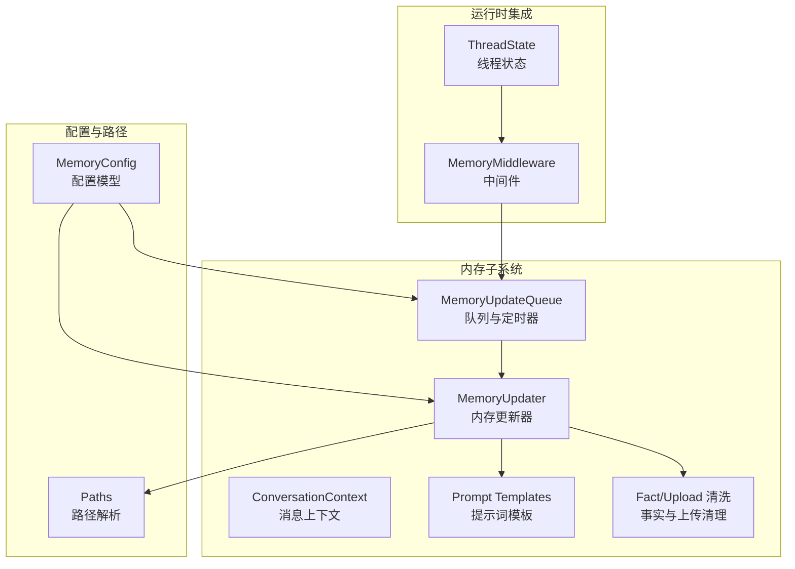
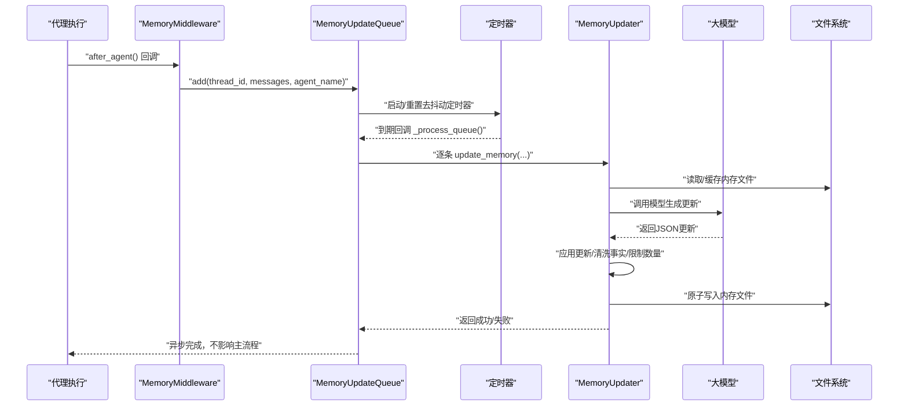
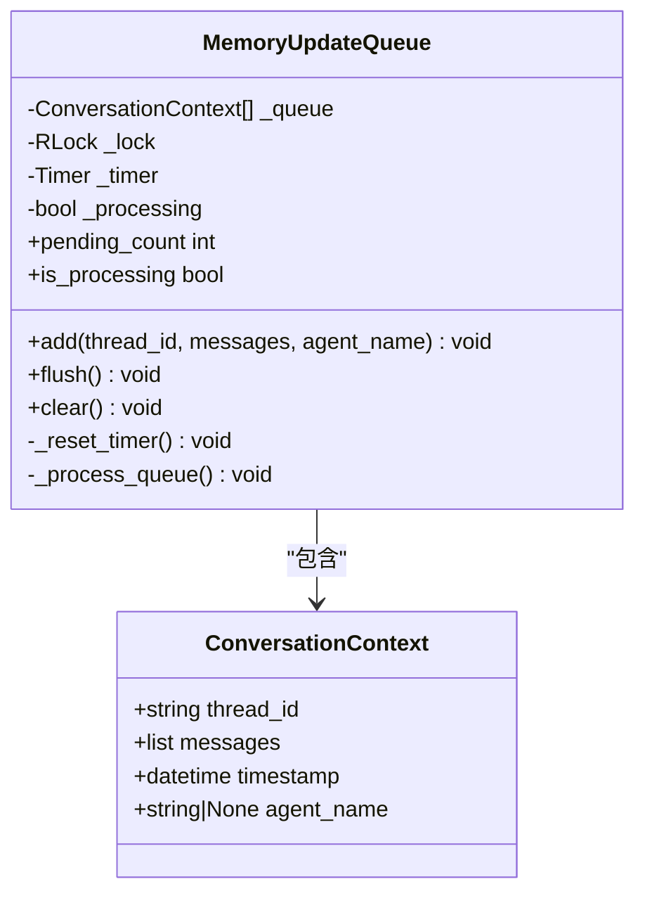
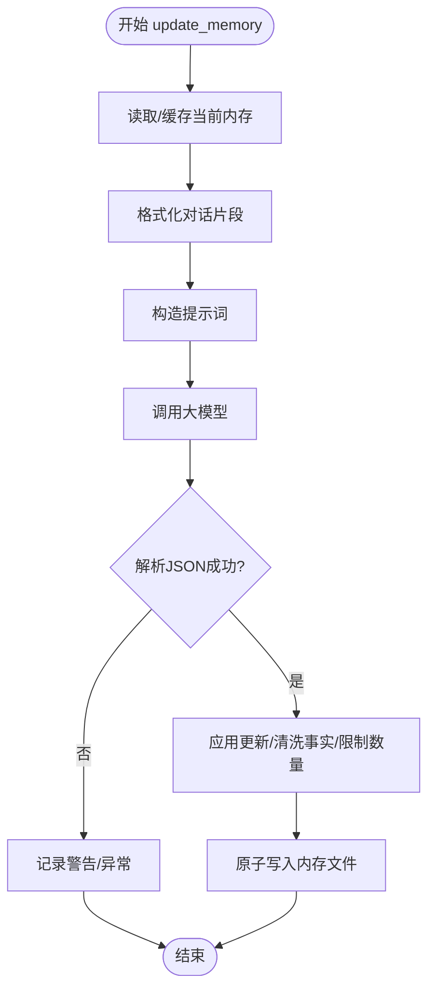
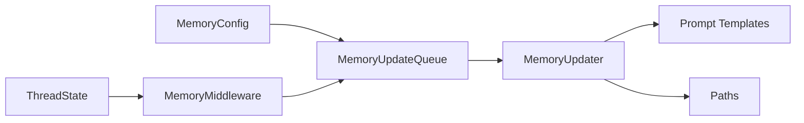
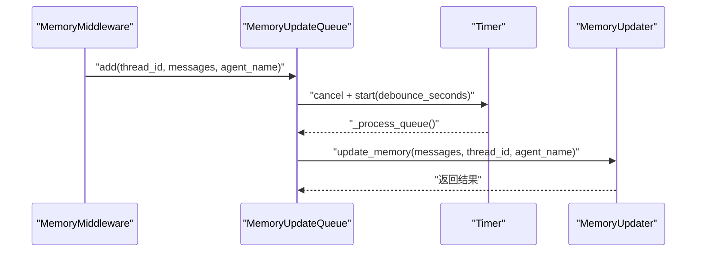

# 内存队列管理

<cite>
**本文引用的文件**
- [queue.py](file://backend/packages/harness/deerflow/agents/memory/queue.py)
- [updater.py](file://backend/packages/harness/deerflow/agents/memory/updater.py)
- [memory_config.py](file://backend/packages/harness/deerflow/config/memory_config.py)
- [memory_middleware.py](file://backend/packages/harness/deerflow/agents/middlewares/memory_middleware.py)
- [prompt.py](file://backend/packages/harness/deerflow/agents/memory/prompt.py)
- [paths.py](file://backend/packages/harness/deerflow/config/paths.py)
- [thread_state.py](file://backend/packages/harness/deerflow/agents/thread_state.py)
- [test_memory_updater.py](file://backend/tests/test_memory_updater.py)
</cite>

## 目录
1. [简介](#简介)
2. [项目结构](#项目结构)
3. [核心组件](#核心组件)
4. [架构总览](#架构总览)
5. [详细组件分析](#详细组件分析)
6. [依赖分析](#依赖分析)
7. [性能考虑](#性能考虑)
8. [故障排查指南](#故障排查指南)
9. [结论](#结论)
10. [附录](#附录)

## 简介
本文件面向 DeerFlow 的“内存队列管理系统”，系统性阐述内存更新队列的架构设计、去抖动机制与批处理策略；详解 ConversationContext 数据结构、线程安全机制与定时器管理；覆盖队列添加、处理流程、强制刷新与清理操作；并提供配置参数、性能优化建议与并发控制策略，解释队列与内存更新器的集成关系及错误处理机制。

## 项目结构
内存队列相关代码主要位于以下模块：
- 队列与上下文：agents/memory/queue.py
- 内存更新器：agents/memory/updater.py
- 配置：config/memory_config.py
- 中间件：agents/middlewares/memory_middleware.py
- 提示词与格式化：agents/memory/prompt.py
- 路径配置：config/paths.py
- 线程状态：agents/thread_state.py
- 测试：tests/test_memory_updater.py

图表来源
- [queue.py:22-196](file://backend/packages/harness/deerflow/agents/memory/queue.py#L22-L196)
- [updater.py:267-443](file://backend/packages/harness/deerflow/agents/memory/updater.py#L267-L443)
- [memory_config.py:6-79](file://backend/packages/harness/deerflow/config/memory_config.py#L6-L79)
- [memory_middleware.py:86-150](file://backend/packages/harness/deerflow/agents/middlewares/memory_middleware.py#L86-L150)
- [prompt.py:14-341](file://backend/packages/harness/deerflow/agents/memory/prompt.py#L14-L341)
- [paths.py:12-243](file://backend/packages/harness/deerflow/config/paths.py#L12-L243)
- [thread_state.py:48-56](file://backend/packages/harness/deerflow/agents/thread_state.py#L48-L56)

章节来源
- [queue.py:1-196](file://backend/packages/harness/deerflow/agents/memory/queue.py#L1-L196)
- [updater.py:1-443](file://backend/packages/harness/deerflow/agents/memory/updater.py#L1-L443)
- [memory_config.py:1-79](file://backend/packages/harness/deerflow/config/memory_config.py#L1-L79)
- [memory_middleware.py:1-150](file://backend/packages/harness/deerflow/agents/middlewares/memory_middleware.py#L1-L150)
- [prompt.py:1-341](file://backend/packages/harness/deerflow/agents/memory/prompt.py#L1-L341)
- [paths.py:1-243](file://backend/packages/harness/deerflow/config/paths.py#L1-L243)
- [thread_state.py:1-56](file://backend/packages/harness/deerflow/agents/thread_state.py#L1-L56)

## 核心组件
- ConversationContext：封装一次内存更新所需的会话上下文（线程标识、消息列表、时间戳、可选代理名）。
- MemoryUpdateQueue：带去抖动的内存更新队列，支持批量处理、定时触发、强制刷新与清理。
- MemoryUpdater：负责读取/缓存内存、调用大模型生成更新、应用变更、持久化与事实清洗。
- MemoryMiddleware：在代理执行后收集对话片段，过滤工具消息，入队等待去抖动处理。
- MemoryConfig：内存机制的全局配置（启用开关、存储路径、去抖动秒数、模型名、最大事实数、置信阈值等）。
- Prompt 模板：定义记忆更新与注入的提示词格式。
- Paths：集中管理数据目录与文件路径，支持相对/绝对路径解析。

章节来源
- [queue.py:12-20](file://backend/packages/harness/deerflow/agents/memory/queue.py#L12-L20)
- [queue.py:22-196](file://backend/packages/harness/deerflow/agents/memory/queue.py#L22-L196)
- [updater.py:267-443](file://backend/packages/harness/deerflow/agents/memory/updater.py#L267-L443)
- [memory_middleware.py:86-150](file://backend/packages/harness/deerflow/agents/middlewares/memory_middleware.py#L86-L150)
- [memory_config.py:6-79](file://backend/packages/harness/deerflow/config/memory_config.py#L6-L79)
- [prompt.py:14-341](file://backend/packages/harness/deerflow/agents/memory/prompt.py#L14-L341)
- [paths.py:12-243](file://backend/packages/harness/deerflow/config/paths.py#L12-L243)

## 架构总览
内存更新从代理执行后的中间件开始，经由 MemoryMiddleware 过滤有效对话片段，写入 MemoryUpdateQueue。队列以去抖动定时器聚合多条更新，到期后交由 MemoryUpdater 逐条调用大模型进行更新，应用变更并持久化到磁盘。配置通过 MemoryConfig 控制行为，路径通过 Paths 统一管理。

图表来源
- [memory_middleware.py:107-149](file://backend/packages/harness/deerflow/agents/middlewares/memory_middleware.py#L107-L149)
- [queue.py:66-130](file://backend/packages/harness/deerflow/agents/memory/queue.py#L66-L130)
- [updater.py:284-348](file://backend/packages/harness/deerflow/agents/memory/updater.py#L284-L348)

## 详细组件分析

### ConversationContext 数据结构
- 字段
  - thread_id：线程标识，用于去重与批处理
  - messages：参与本次更新的对话片段（已过滤）
  - timestamp：UTC 时间戳，默认当前时间
  - agent_name：可选，None 表示全局内存，否则按代理隔离
- 作用
  - 作为队列元素承载一次更新所需信息
  - 支持 per-agent 与全局内存的区分

章节来源
- [queue.py:12-20](file://backend/packages/harness/deerflow/agents/memory/queue.py#L12-L20)

### MemoryUpdateQueue：去抖动与批处理
- 去抖动机制
  - 每次 add(thread_id, messages, agent_name) 时，先取消旧定时器，再以配置的 debounce_seconds 启动新定时器
  - 若同一 thread_id 已在队列中，先移除旧项，再追加新的上下文，实现“最近更新覆盖”
- 批处理策略
  - 定时器到期后复制队列快照，清空队列并置空定时器，避免处理期间的新消息被立即处理
  - 逐个调用 MemoryUpdater.update_memory(...)，并在多条更新之间加入小延迟，缓解限流
- 线程安全
  - 使用 threading.Lock 保护队列、处理状态与定时器对象
  - 处理标志位 processing 防止并发重复处理
- 公共接口
  - add：入队
  - flush：强制立即处理并清空定时器
  - clear：清空队列并复位处理状态
  - pending_count/is_processing：查询状态
- 单例与全局访问
  - 提供 get_memory_queue()/reset_memory_queue()，线程安全地获取/重置单例

图表来源
- [queue.py:12-20](file://backend/packages/harness/deerflow/agents/memory/queue.py#L12-L20)
- [queue.py:22-196](file://backend/packages/harness/deerflow/agents/memory/queue.py#L22-L196)

章节来源
- [queue.py:22-196](file://backend/packages/harness/deerflow/agents/memory/queue.py#L22-L196)

### MemoryUpdater：内存更新器
- 功能
  - 读取/缓存内存文件（基于文件修改时间自动失效）
  - 将对话片段格式化为提示词，调用大模型生成 JSON 更新
  - 应用用户/历史区段更新、删除指定事实、新增高置信度事实，并限制事实总数
  - 清洗上传事件相关语句，避免过期文件路径进入长期记忆
  - 原子写入内存文件，更新缓存与 mtime
- 关键流程
  - 获取当前内存 -> 格式化对话 -> 构造提示词 -> 调用模型 -> 解析 JSON -> 应用更新 -> 清洗事实 -> 保存
- 错误处理
  - JSON 解析失败、IO 异常均记录日志并返回失败
  - 对 LLM 返回内容进行文本提取与清洗，兼容字符串与多块内容

图表来源
- [updater.py:284-348](file://backend/packages/harness/deerflow/agents/memory/updater.py#L284-L348)
- [prompt.py:297-341](file://backend/packages/harness/deerflow/agents/memory/prompt.py#L297-L341)

章节来源
- [updater.py:267-443](file://backend/packages/harness/deerflow/agents/memory/updater.py#L267-L443)
- [prompt.py:14-341](file://backend/packages/harness/deerflow/agents/memory/prompt.py#L14-L341)

### MemoryMiddleware：队列触发点
- 触发时机：代理执行后 after_agent
- 过滤规则：仅保留人类输入与最终助手回复，剔除工具消息、带工具调用的 AI 消息以及仅包含上传块的人类消息
- 入队：根据 thread_id 与过滤后的 messages 调用队列 add；支持 per-agent 内存

章节来源
- [memory_middleware.py:86-150](file://backend/packages/harness/deerflow/agents/middlewares/memory_middleware.py#L86-L150)

### 配置与路径
- MemoryConfig
  - enabled：是否启用内存机制
  - storage_path：内存文件存储路径（相对路径按 base_dir 解析）
  - debounce_seconds：去抖动秒数
  - model_name：用于内存更新的大模型名称
  - max_facts：最大事实数量
  - fact_confidence_threshold：新增事实的最低置信阈值
  - injection_enabled/max_injection_tokens：记忆注入系统提示的开关与令牌上限
- Paths
  - 提供 memory.json、agent memory.json、threads/*/user-data/* 等路径解析与校验
  - 支持虚拟路径到宿主机路径的解析，防止路径穿越

章节来源
- [memory_config.py:6-79](file://backend/packages/harness/deerflow/config/memory_config.py#L6-L79)
- [paths.py:12-243](file://backend/packages/harness/deerflow/config/paths.py#L12-L243)

## 依赖分析
- 组件耦合
  - MemoryUpdateQueue 依赖 MemoryConfig（去抖动秒数）、线程锁与定时器
  - MemoryUpdateQueue 在处理时动态导入 MemoryUpdater，避免循环依赖
  - MemoryUpdater 依赖 Prompt 模板、路径配置、模型工厂与文件系统
  - MemoryMiddleware 依赖 MemoryUpdateQueue 与 MemoryConfig
- 外部依赖
  - tiktoken（可选）用于令牌计数
  - 文件系统 IO 与 JSON 解析
  - 大模型调用接口（抽象于 create_chat_model）

图表来源
- [memory_config.py:6-79](file://backend/packages/harness/deerflow/config/memory_config.py#L6-L79)
- [queue.py:84-130](file://backend/packages/harness/deerflow/agents/memory/queue.py#L84-L130)
- [updater.py:11-17](file://backend/packages/harness/deerflow/agents/memory/updater.py#L11-L17)
- [memory_middleware.py:10-11](file://backend/packages/harness/deerflow/agents/middlewares/memory_middleware.py#L10-L11)
- [thread_state.py:48-56](file://backend/packages/harness/deerflow/agents/thread_state.py#L48-L56)

章节来源
- [queue.py:84-130](file://backend/packages/harness/deerflow/agents/memory/queue.py#L84-L130)
- [updater.py:11-17](file://backend/packages/harness/deerflow/agents/memory/updater.py#L11-L17)
- [memory_middleware.py:10-11](file://backend/packages/harness/deerflow/agents/middlewares/memory_middleware.py#L10-L11)
- [thread_state.py:48-56](file://backend/packages/harness/deerflow/agents/thread_state.py#L48-L56)

## 性能考虑
- 去抖动窗口
  - debounce_seconds 越长，批处理越大，吞吐量提升但延迟增加；建议根据业务交互频率调整
- 批内限流
  - 多条更新间的小延迟有助于避免外部服务限流；可根据实际模型/服务端限流策略微调
- 缓存与文件 IO
  - MemoryUpdater 使用文件 mtime 与缓存组合，避免重复读取；保存采用临时文件 + 原子替换，减少损坏风险
- 事实数量与置信阈值
  - max_facts 与 fact_confidence_threshold 控制事实增长速率与质量；过高阈值可能遗漏隐含信息，过低则导致噪声
- 注入令牌预算
  - max_injection_tokens 控制注入系统提示的长度，避免超出模型上下文；tiktoken 计数更精确，缺失时以字符估算回退

章节来源
- [memory_config.py:26-57](file://backend/packages/harness/deerflow/config/memory_config.py#L26-L57)
- [updater.py:340-348](file://backend/packages/harness/deerflow/agents/memory/updater.py#L340-L348)
- [prompt.py:186-294](file://backend/packages/harness/deerflow/agents/memory/prompt.py#L186-L294)

## 故障排查指南
- 常见问题
  - 内存未更新：检查 MemoryConfig.enabled 是否开启；确认 MemoryMiddleware 是否正确挂载；检查线程状态是否包含 thread_id
  - 更新失败：查看日志中 JSON 解析失败或 IO 异常；确认模型响应是否为合法 JSON；检查磁盘权限与路径
  - 事实过多：max_facts 达到上限时会按置信度裁剪；如需保留更多，请适当提高上限
  - 上传事件残留：确保 MemoryUpdater 在保存前调用了上传事件清洗逻辑
- 排查步骤
  - 使用 flush() 强制处理队列，观察输出日志
  - 使用 clear() 清空队列，验证定时器是否正确取消
  - 通过 pending_count 与 is_processing 判断队列状态
  - 在测试中模拟不同 LLM 响应形态，验证 _extract_text 与 update_memory 的健壮性

章节来源
- [memory_middleware.py:107-149](file://backend/packages/harness/deerflow/agents/middlewares/memory_middleware.py#L107-L149)
- [queue.py:131-154](file://backend/packages/harness/deerflow/agents/memory/queue.py#L131-L154)
- [updater.py:343-348](file://backend/packages/harness/deerflow/agents/memory/updater.py#L343-L348)
- [test_memory_updater.py:146-289](file://backend/tests/test_memory_updater.py#L146-L289)

## 结论
内存队列管理系统通过去抖动与批处理显著降低大模型调用频次，结合 per-agent/全局内存与事实清洗策略，在保证长期记忆质量的同时兼顾性能与稳定性。合理的配置参数与并发控制（锁与定时器）确保了在高并发下的可靠性。建议在生产环境中根据业务特征调整去抖动窗口与事实阈值，并持续监控日志与磁盘 IO。

## 附录

### 队列添加与处理流程（时序图）

图表来源
- [memory_middleware.py:146-147](file://backend/packages/harness/deerflow/agents/middlewares/memory_middleware.py#L146-L147)
- [queue.py:66-130](file://backend/packages/harness/deerflow/agents/memory/queue.py#L66-L130)
- [updater.py:284-348](file://backend/packages/harness/deerflow/agents/memory/updater.py#L284-L348)

### 配置参数一览
- enabled：是否启用内存机制
- storage_path：内存文件存储路径（相对/绝对）
- debounce_seconds：去抖动秒数
- model_name：用于内存更新的大模型名称
- max_facts：最大事实数量
- fact_confidence_threshold：新增事实的最低置信阈值
- injection_enabled：是否注入记忆到系统提示
- max_injection_tokens：注入的最大令牌数

章节来源
- [memory_config.py:6-79](file://backend/packages/harness/deerflow/config/memory_config.py#L6-L79)