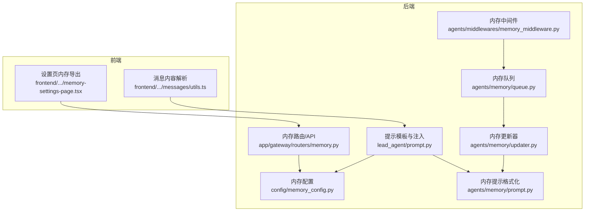
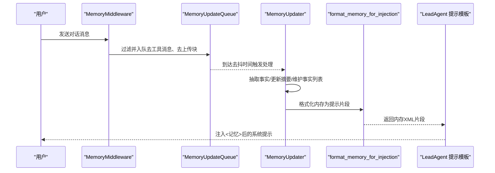
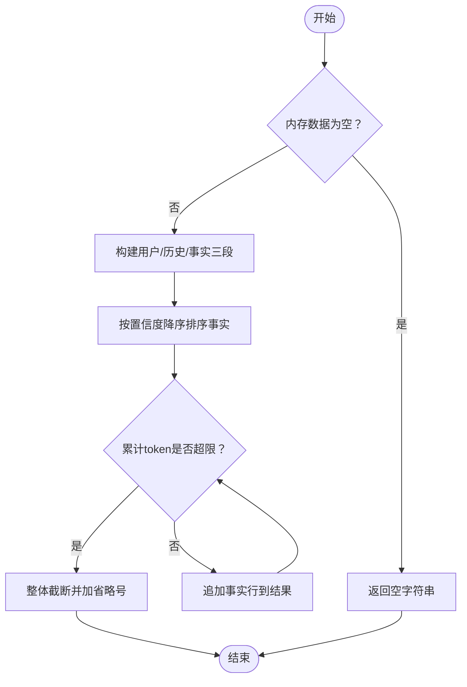
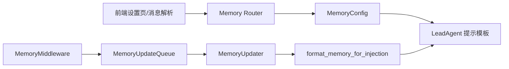

# 提示工程

<cite>
**本文引用的文件**
- [backend/packages/harness/deerflow/agents/lead_agent/prompt.py](file://backend/packages/harness/deerflow/agents/lead_agent/prompt.py)
- [backend/packages/harness/deerflow/agents/memory/prompt.py](file://backend/packages/harness/deerflow/agents/memory/prompt.py)
- [backend/packages/harness/deerflow/agents/memory/updater.py](file://backend/packages/harness/deerflow/agents/memory/updater.py)
- [backend/packages/harness/deerflow/agents/memory/queue.py](file://backend/packages/harness/deerflow/agents/memory/queue.py)
- [backend/packages/harness/deerflow/agents/middlewares/memory_middleware.py](file://backend/packages/harness/deerflow/agents/middlewares/memory_middleware.py)
- [backend/packages/harness/deerflow/config/memory_config.py](file://backend/packages/harness/deerflow/config/memory_config.py)
- [backend/app/gateway/routers/memory.py](file://backend/app/gateway/routers/memory.py)
- [backend/docs/MEMORY_IMPROVEMENTS.md](file://backend/docs/MEMORY_IMPROVEMENTS.md)
- [backend/docs/MEMORY_IMPROVEMENTS_SUMMARY.md](file://backend/docs/MEMORY_IMPROVEMENTS_SUMMARY.md)
- [backend/tests/test_memory_prompt_injection.py](file://backend/tests/test_memory_prompt_injection.py)
- [backend/tests/test_memory_updater.py](file://backend/tests/test_memory_updater.py)
- [backend/packages/harness/deerflow/agents/lead_agent/agent.py](file://backend/packages/harness/deerflow/agents/lead_agent/agent.py)
- [backend/packages/harness/deerflow/agents/middlewares/token_usage_middleware.py](file://backend/packages/harness/deerflow/agents/middlewares/token_usage_middleware.py)
- [frontend/src/components/workspace/settings/memory-settings-page.tsx](file://frontend/src/components/workspace/settings/memory-settings-page.tsx)
- [frontend/src/core/messages/utils.ts](file://frontend/src/core/messages/utils.ts)
</cite>

## 目录
1. [简介](#简介)
2. [项目结构](#项目结构)
3. [核心组件](#核心组件)
4. [架构总览](#架构总览)
5. [详细组件分析](#详细组件分析)
6. [依赖分析](#依赖分析)
7. [性能考量](#性能考量)
8. [故障排查指南](#故障排查指南)
9. [结论](#结论)
10. [附录](#附录)

## 简介
本文件面向 DeerFlow 的“内存提示工程”系统，系统性阐述提示模板设计、上下文构建与消息格式化机制；详解提示工程最佳实践、模板定制与动态内容生成；并给出提示优化策略、性能考虑与质量评估方法。文档同时解释提示工程与内存更新、智能体推理之间的关系，并提供模板示例、自定义提示开发与测试指南。

## 项目结构
围绕提示工程与内存系统的相关模块主要分布在后端 harness 包中，前端负责展示与交互。关键路径如下：
- 后端提示模板与注入：lead_agent/prompt.py
- 内存提示格式化与更新：agents/memory/prompt.py、agents/memory/updater.py
- 内存队列与中间件：agents/memory/queue.py、agents/middlewares/memory_middleware.py
- 配置与路由：config/memory_config.py、app/gateway/routers/memory.py
- 文档与测试：docs/MEMORY_IMPROVEMENTS*.md、tests/test_memory_*.py
- 前端展示：frontend/src/components/workspace/settings/memory-settings-page.tsx、frontend/src/core/messages/utils.ts

图表来源
- [backend/packages/harness/deerflow/agents/lead_agent/prompt.py:150-336](file://backend/packages/harness/deerflow/agents/lead_agent/prompt.py#L150-L336)
- [backend/packages/harness/deerflow/agents/memory/prompt.py:186-294](file://backend/packages/harness/deerflow/agents/memory/prompt.py#L186-L294)
- [backend/packages/harness/deerflow/agents/memory/updater.py:340-427](file://backend/packages/harness/deerflow/agents/memory/updater.py#L340-L427)
- [backend/packages/harness/deerflow/agents/memory/queue.py:22-83](file://backend/packages/harness/deerflow/agents/memory/queue.py#L22-L83)
- [backend/packages/harness/deerflow/agents/middlewares/memory_middleware.py:86-149](file://backend/packages/harness/deerflow/agents/middlewares/memory_middleware.py#L86-L149)
- [backend/packages/harness/deerflow/config/memory_config.py:6-79](file://backend/packages/harness/deerflow/config/memory_config.py#L6-L79)
- [backend/app/gateway/routers/memory.py:184-201](file://backend/app/gateway/routers/memory.py#L184-L201)
- [frontend/src/components/workspace/settings/memory-settings-page.tsx:34-115](file://frontend/src/components/workspace/settings/memory-settings-page.tsx#L34-L115)
- [frontend/src/core/messages/utils.ts:128-218](file://frontend/src/core/messages/utils.ts#L128-L218)

章节来源
- [backend/packages/harness/deerflow/agents/lead_agent/prompt.py:150-336](file://backend/packages/harness/deerflow/agents/lead_agent/prompt.py#L150-L336)
- [backend/packages/harness/deerflow/agents/memory/prompt.py:186-294](file://backend/packages/harness/deerflow/agents/memory/prompt.py#L186-L294)
- [backend/packages/harness/deerflow/agents/memory/updater.py:340-427](file://backend/packages/harness/deerflow/agents/memory/updater.py#L340-L427)
- [backend/packages/harness/deerflow/agents/memory/queue.py:22-83](file://backend/packages/harness/deerflow/agents/memory/queue.py#L22-L83)
- [backend/packages/harness/deerflow/agents/middlewares/memory_middleware.py:86-149](file://backend/packages/harness/deerflow/agents/middlewares/memory_middleware.py#L86-L149)
- [backend/packages/harness/deerflow/config/memory_config.py:6-79](file://backend/packages/harness/deerflow/config/memory_config.py#L6-L79)
- [backend/app/gateway/routers/memory.py:184-201](file://backend/app/gateway/routers/memory.py#L184-L201)
- [frontend/src/components/workspace/settings/memory-settings-page.tsx:34-115](file://frontend/src/components/workspace/settings/memory-settings-page.tsx#L34-L115)
- [frontend/src/core/messages/utils.ts:128-218](file://frontend/src/core/messages/utils.ts#L128-L218)

## 核心组件
- 系统提示模板与动态注入
  - lead_agent/prompt.py 提供系统提示模板与动态拼装逻辑，支持记忆上下文注入、技能系统、延迟工具、子代理模式等。
  - 注入入口：_get_memory_context 调用 format_memory_for_injection 获取内存片段并包裹在 <memory>XML 标签内。
- 内存提示格式化
  - agents/memory/prompt.py 实现 format_memory_for_injection，按用户上下文、历史、事实三段式组织，并基于置信度排序、token 预算截断。
- 内存更新与事实抽取
  - agents/memory/updater.py 负责从对话中抽取事实、更新用户/历史摘要、维护事实列表（含置信度、分类、去重）。
- 内存队列与中间件
  - memory_middleware 在每次执行后过滤并排队对话，queue 将多条会话合并处理，updater 异步调用模型进行总结与写回。
- 配置与路由
  - memory_config 提供启用开关、最大事实数、注入 token 上限等参数；gateway 路由暴露内存状态查询接口。
- 前端展示
  - 设置页将内存结构转为 Markdown；消息解析工具支持从 AI 消息中提取思考与正文。

章节来源
- [backend/packages/harness/deerflow/agents/lead_agent/prompt.py:339-368](file://backend/packages/harness/deerflow/agents/lead_agent/prompt.py#L339-L368)
- [backend/packages/harness/deerflow/agents/memory/prompt.py:186-294](file://backend/packages/harness/deerflow/agents/memory/prompt.py#L186-L294)
- [backend/packages/harness/deerflow/agents/memory/updater.py:340-427](file://backend/packages/harness/deerflow/agents/memory/updater.py#L340-L427)
- [backend/packages/harness/deerflow/agents/middlewares/memory_middleware.py:86-149](file://backend/packages/harness/deerflow/agents/middlewares/memory_middleware.py#L86-L149)
- [backend/packages/harness/deerflow/config/memory_config.py:6-79](file://backend/packages/harness/deerflow/config/memory_config.py#L6-L79)
- [backend/app/gateway/routers/memory.py:184-201](file://backend/app/gateway/routers/memory.py#L184-L201)
- [frontend/src/components/workspace/settings/memory-settings-page.tsx:34-115](file://frontend/src/components/workspace/settings/memory-settings-page.tsx#L34-L115)
- [frontend/src/core/messages/utils.ts:128-218](file://frontend/src/core/messages/utils.ts#L128-L218)

## 架构总览
提示工程贯穿“中间件收集—队列聚合—模型更新—提示注入”的闭环，确保智能体在每次推理前能获得准确、可控的上下文。

图表来源
- [backend/packages/harness/deerflow/agents/middlewares/memory_middleware.py:108-149](file://backend/packages/harness/deerflow/agents/middlewares/memory_middleware.py#L108-L149)
- [backend/packages/harness/deerflow/agents/memory/queue.py:84-141](file://backend/packages/harness/deerflow/agents/memory/queue.py#L84-L141)
- [backend/packages/harness/deerflow/agents/memory/updater.py:340-427](file://backend/packages/harness/deerflow/agents/memory/updater.py#L340-L427)
- [backend/packages/harness/deerflow/agents/memory/prompt.py:186-294](file://backend/packages/harness/deerflow/agents/memory/prompt.py#L186-L294)
- [backend/packages/harness/deerflow/agents/lead_agent/prompt.py:339-368](file://backend/packages/harness/deerflow/agents/lead_agent/prompt.py#L339-L368)

## 详细组件分析

### 组件一：系统提示模板与动态注入
- 动态能力
  - 记忆上下文注入：_get_memory_context 读取配置与内存数据，调用 format_memory_for_injection 并包裹 <memory>XML。
  - 子代理模式：根据并发限制生成子任务分解与并行执行指导。
  - 技能系统与延迟工具：列出可用技能与可延迟加载工具，便于按需加载。
  - ACP 代理提示：当存在 ACP 代理时，补充独立工作区与输出交付规则。
- 最佳实践
  - 将记忆片段置于系统提示的显著位置，避免被后续指令覆盖。
  - 使用明确的 XML 标签包裹记忆，便于解析与调试。
  - 控制子代理并发上限，防止过度拆分导致吞吐下降。
- 参考路径
  - [backend/packages/harness/deerflow/agents/lead_agent/prompt.py:468-516](file://backend/packages/harness/deerflow/agents/lead_agent/prompt.py#L468-L516)

章节来源
- [backend/packages/harness/deerflow/agents/lead_agent/prompt.py:339-368](file://backend/packages/harness/deerflow/agents/lead_agent/prompt.py#L339-L368)
- [backend/packages/harness/deerflow/agents/lead_agent/prompt.py:468-516](file://backend/packages/harness/deerflow/agents/lead_agent/prompt.py#L468-L516)

### 组件二：内存提示格式化（format_memory_for_injection）
- 结构化输出
  - 用户上下文：工作、个人、当前关注
  - 历史：最近、早期、长期背景
  - 事实：按置信度降序，逐条累加至 token 预算上限
- 精准计数与截断
  - 优先使用 tiktoken 计数；失败则退化为字符估算。
  - 先计算现有段落 token 数，再增量加入每条事实，最后整体截断留余量。
- 边界处理
  - 忽略非字符串内容的事实条目，避免污染输出。
  - 对置信度进行数值校正，防止 NaN/Inf 影响排序。
- 参考路径
  - [backend/packages/harness/deerflow/agents/memory/prompt.py:186-294](file://backend/packages/harness/deerflow/agents/memory/prompt.py#L186-L294)

图表来源
- [backend/packages/harness/deerflow/agents/memory/prompt.py:237-294](file://backend/packages/harness/deerflow/agents/memory/prompt.py#L237-L294)

章节来源
- [backend/packages/harness/deerflow/agents/memory/prompt.py:186-294](file://backend/packages/harness/deerflow/agents/memory/prompt.py#L186-L294)

### 组件三：内存更新与事实抽取（MemoryUpdater）
- 更新流程
  - 从对话中抽取事实与摘要更新，维护事实列表（去重、裁剪、置信度管理）。
  - 支持 per-agent 与全局内存，文件缓存与 mtime 校验。
  - 解析 LLM 输出（兼容文本块数组），安全地提取 JSON。
- 关键点
  - 去除上传事件类句子，避免未来会话误检索。
  - 严格控制最大事实数量，按置信度保留高质量事实。
- 参考路径
  - [backend/packages/harness/deerflow/agents/memory/updater.py:340-427](file://backend/packages/harness/deerflow/agents/memory/updater.py#L340-L427)

章节来源
- [backend/packages/harness/deerflow/agents/memory/updater.py:340-427](file://backend/packages/harness/deerflow/agents/memory/updater.py#L340-L427)

### 组件四：内存队列与中间件（MemoryMiddleware + MemoryUpdateQueue）
- 中间件职责
  - 执行后过滤消息：仅保留人类输入与最终助手回复，剔除工具消息与上传块。
  - 依据线程 ID 入队，支持去抖合并。
- 队列策略
  - 去抖窗口内合并同类线程，避免频繁写盘。
  - 处理中避免重复触发，必要时重置定时器。
- 参考路径
  - [backend/packages/harness/deerflow/agents/middlewares/memory_middleware.py:86-149](file://backend/packages/harness/deerflow/agents/middlewares/memory_middleware.py#L86-L149)
  - [backend/packages/harness/deerflow/agents/memory/queue.py:22-83](file://backend/packages/harness/deerflow/agents/memory/queue.py#L22-L83)

章节来源
- [backend/packages/harness/deerflow/agents/middlewares/memory_middleware.py:86-149](file://backend/packages/harness/deerflow/agents/middlewares/memory_middleware.py#L86-L149)
- [backend/packages/harness/deerflow/agents/memory/queue.py:22-83](file://backend/packages/harness/deerflow/agents/memory/queue.py#L22-L83)

### 组件五：配置与路由（MemoryConfig + Memory Router）
- 配置项
  - enabled、storage_path、debounce_seconds、model_name、max_facts、fact_confidence_threshold、injection_enabled、max_injection_tokens。
- 路由
  - 提供内存配置与当前数据的查询接口，便于前端展示与调试。
- 参考路径
  - [backend/packages/harness/deerflow/config/memory_config.py:6-79](file://backend/packages/harness/deerflow/config/memory_config.py#L6-L79)
  - [backend/app/gateway/routers/memory.py:184-201](file://backend/app/gateway/routers/memory.py#L184-L201)

章节来源
- [backend/packages/harness/deerflow/config/memory_config.py:6-79](file://backend/packages/harness/deerflow/config/memory_config.py#L6-L79)
- [backend/app/gateway/routers/memory.py:184-201](file://backend/app/gateway/routers/memory.py#L184-L201)

### 组件六：前端展示与消息解析
- 设置页导出
  - 将内存结构转换为 Markdown，包含各节标题、内容与更新时间。
- 消息解析
  - 从 AI 消息中分离 inline thinking 与正文，支持图片与多模态内容提取。
- 参考路径
  - [frontend/src/components/workspace/settings/memory-settings-page.tsx:34-115](file://frontend/src/components/workspace/settings/memory-settings-page.tsx#L34-L115)
  - [frontend/src/core/messages/utils.ts:128-218](file://frontend/src/core/messages/utils.ts#L128-L218)

章节来源
- [frontend/src/components/workspace/settings/memory-settings-page.tsx:34-115](file://frontend/src/components/workspace/settings/memory-settings-page.tsx#L34-L115)
- [frontend/src/core/messages/utils.ts:128-218](file://frontend/src/core/messages/utils.ts#L128-L218)

## 依赖分析
- 组件耦合
  - LeadAgent 提示模板依赖 MemoryConfig 与 get_memory_data/format_memory_for_injection。
  - MemoryMiddleware 依赖 MemoryUpdateQueue；Queue 依赖 MemoryConfig。
  - MemoryUpdater 依赖 format_conversation_for_update 与模型工厂。
- 外部依赖
  - tiktoken 用于精确 token 计数；失败时退化为字符估算。
  - 前端通过路由获取内存状态，用于可视化与调试。

图表来源
- [backend/packages/harness/deerflow/agents/lead_agent/prompt.py:339-368](file://backend/packages/harness/deerflow/agents/lead_agent/prompt.py#L339-L368)
- [backend/packages/harness/deerflow/agents/memory/prompt.py:186-294](file://backend/packages/harness/deerflow/agents/memory/prompt.py#L186-L294)
- [backend/packages/harness/deerflow/agents/middlewares/memory_middleware.py:86-149](file://backend/packages/harness/deerflow/agents/middlewares/memory_middleware.py#L86-L149)
- [backend/packages/harness/deerflow/agents/memory/queue.py:22-83](file://backend/packages/harness/deerflow/agents/memory/queue.py#L22-L83)
- [backend/packages/harness/deerflow/agents/memory/updater.py:340-427](file://backend/packages/harness/deerflow/agents/memory/updater.py#L340-L427)
- [backend/app/gateway/routers/memory.py:184-201](file://backend/app/gateway/routers/memory.py#L184-L201)

章节来源
- [backend/packages/harness/deerflow/agents/lead_agent/prompt.py:339-368](file://backend/packages/harness/deerflow/agents/lead_agent/prompt.py#L339-L368)
- [backend/packages/harness/deerflow/agents/memory/prompt.py:186-294](file://backend/packages/harness/deerflow/agents/memory/prompt.py#L186-L294)
- [backend/packages/harness/deerflow/agents/middlewares/memory_middleware.py:86-149](file://backend/packages/harness/deerflow/agents/middlewares/memory_middleware.py#L86-L149)
- [backend/packages/harness/deerflow/agents/memory/queue.py:22-83](file://backend/packages/harness/deerflow/agents/memory/queue.py#L22-L83)
- [backend/packages/harness/deerflow/agents/memory/updater.py:340-427](file://backend/packages/harness/deerflow/agents/memory/updater.py#L340-L427)
- [backend/app/gateway/routers/memory.py:184-201](file://backend/app/gateway/routers/memory.py#L184-L201)

## 性能考量
- 计数与预算
  - 优先使用 tiktoken 精确计数；在高并发场景下建议预估 token 上限，避免反复截断。
  - 事实注入采用增量计数与“留余量”截断策略，减少整体重算成本。
- 去抖与批处理
  - MemoryUpdateQueue 的去抖窗口可平衡更新频率与延迟；合理设置 debounce_seconds。
- 缓存与文件 IO
  - MemoryUpdater 对内存文件进行 mtime 校验缓存，避免重复读取。
- 日志与可观测性
  - TokenUsageMiddleware 记录输入/输出/总计 token，便于监控与优化。

章节来源
- [backend/packages/harness/deerflow/agents/memory/prompt.py:148-167](file://backend/packages/harness/deerflow/agents/memory/prompt.py#L148-L167)
- [backend/packages/harness/deerflow/agents/memory/queue.py:66-82](file://backend/packages/harness/deerflow/agents/memory/queue.py#L66-L82)
- [backend/packages/harness/deerflow/agents/memory/updater.py:67-95](file://backend/packages/harness/deerflow/agents/memory/updater.py#L67-L95)
- [backend/packages/harness/deerflow/agents/middlewares/token_usage_middleware.py:13-37](file://backend/packages/harness/deerflow/agents/middlewares/token_usage_middleware.py#L13-L37)

## 故障排查指南
- 记忆注入为空
  - 检查 MemoryConfig.injection_enabled 与 enabled 是否开启；确认 get_memory_data 是否返回有效数据。
  - 参考：[backend/packages/harness/deerflow/agents/lead_agent/prompt.py:339-368](file://backend/packages/harness/deerflow/agents/lead_agent/prompt.py#L339-L368)
- 事实未生效或顺序异常
  - 确认 format_memory_for_injection 的置信度归一化逻辑与排序；检查测试用例验证行为。
  - 参考：[backend/tests/test_memory_prompt_injection.py:25-37](file://backend/tests/test_memory_prompt_injection.py#L25-L37)
- JSON 解析失败
  - MemoryUpdater 对 LLM 输出进行文本提取与 JSON 解析，注意兼容 list-of-blocks。
  - 参考：[backend/tests/test_memory_updater.py:267-287](file://backend/tests/test_memory_updater.py#L267-L287)
- 上传事件污染记忆
  - 确保中间件已去除 <uploaded_files> 块；必要时在上游清理。
  - 参考：[backend/packages/harness/deerflow/agents/middlewares/memory_middleware.py:20-83](file://backend/packages/harness/deerflow/agents/middlewares/memory_middleware.py#L20-L83)
- token 超限导致截断
  - 调整 max_injection_tokens 或降低事实数量；观察整体长度与预算。
  - 参考：[backend/packages/harness/deerflow/agents/memory/prompt.py:285-293](file://backend/packages/harness/deerflow/agents/memory/prompt.py#L285-L293)

章节来源
- [backend/packages/harness/deerflow/agents/lead_agent/prompt.py:339-368](file://backend/packages/harness/deerflow/agents/lead_agent/prompt.py#L339-L368)
- [backend/tests/test_memory_prompt_injection.py:25-37](file://backend/tests/test_memory_prompt_injection.py#L25-L37)
- [backend/tests/test_memory_updater.py:267-287](file://backend/tests/test_memory_updater.py#L267-L287)
- [backend/packages/harness/deerflow/agents/middlewares/memory_middleware.py:20-83](file://backend/packages/harness/deerflow/agents/middlewares/memory_middleware.py#L20-L83)
- [backend/packages/harness/deerflow/agents/memory/prompt.py:285-293](file://backend/packages/harness/deerflow/agents/memory/prompt.py#L285-L293)

## 结论
DeerFlow 的提示工程以“精准计数 + 分层注入 + 动态裁剪”为核心，结合中间件与队列实现低延迟、高吞吐的记忆更新闭环。通过配置化参数与测试保障，系统在保证质量的同时兼顾性能与可维护性。建议在实际部署中持续监控 token 使用、事实质量与注入效果，迭代优化提示模板与注入策略。

## 附录

### 提示工程最佳实践清单
- 模板设计
  - 明确记忆片段位置与标签，避免被后续指令覆盖。
  - 将“思考风格”“行动风格”“引用规范”等纳入系统提示，提升一致性。
- 上下文构建
  - 优先注入高置信度事实；严格控制 token 预算，避免截断破坏语义。
  - 历史与用户上下文按重要性分层，突出近期与当前关注。
- 动态内容生成
  - 子代理并发限制应与模型能力匹配；批量执行与合成策略清晰。
  - 技能与工具列表按需注入，避免冗余信息干扰。
- 质量评估
  - 使用回归测试覆盖事实注入、排序与预算行为。
  - 通过前端导出 Markdown 快速核对记忆结构与更新时间。
- 性能优化
  - 合理设置去抖窗口与最大事实数；启用 tiktoken 计数。
  - 使用 TokenUsageMiddleware 观察 token 使用趋势，及时调整预算。

章节来源
- [backend/docs/MEMORY_IMPROVEMENTS.md:1-66](file://backend/docs/MEMORY_IMPROVEMENTS.md#L1-L66)
- [backend/docs/MEMORY_IMPROVEMENTS_SUMMARY.md:1-39](file://backend/docs/MEMORY_IMPROVEMENTS_SUMMARY.md#L1-L39)
- [backend/tests/test_memory_prompt_injection.py:8-22](file://backend/tests/test_memory_prompt_injection.py#L8-L22)
- [frontend/src/components/workspace/settings/memory-settings-page.tsx:34-115](file://frontend/src/components/workspace/settings/memory-settings-page.tsx#L34-L115)

### 自定义提示开发与测试指南
- 开发步骤
  - 在 lead_agent/prompt.py 中扩展或调整 SYSTEM_PROMPT_TEMPLATE 片段。
  - 如需变更记忆注入格式，修改 format_memory_for_injection 的段落与排序策略。
  - 通过 MemoryMiddleware 与 MemoryUpdateQueue 验证端到端流程。
- 测试要点
  - 单元测试覆盖：事实注入、排序、预算截断、置信度边界值。
  - 集成测试覆盖：中间件过滤、队列合并、更新器解析与写盘。
- 参考路径
  - [backend/packages/harness/deerflow/agents/lead_agent/prompt.py:468-516](file://backend/packages/harness/deerflow/agents/lead_agent/prompt.py#L468-L516)
  - [backend/packages/harness/deerflow/agents/memory/prompt.py:186-294](file://backend/packages/harness/deerflow/agents/memory/prompt.py#L186-L294)
  - [backend/tests/test_memory_prompt_injection.py:1-122](file://backend/tests/test_memory_prompt_injection.py#L1-L122)
  - [backend/tests/test_memory_updater.py:1-288](file://backend/tests/test_memory_updater.py#L1-L288)

章节来源
- [backend/packages/harness/deerflow/agents/lead_agent/prompt.py:468-516](file://backend/packages/harness/deerflow/agents/lead_agent/prompt.py#L468-L516)
- [backend/packages/harness/deerflow/agents/memory/prompt.py:186-294](file://backend/packages/harness/deerflow/agents/memory/prompt.py#L186-L294)
- [backend/tests/test_memory_prompt_injection.py:1-122](file://backend/tests/test_memory_prompt_injection.py#L1-L122)
- [backend/tests/test_memory_updater.py:1-288](file://backend/tests/test_memory_updater.py#L1-L288)