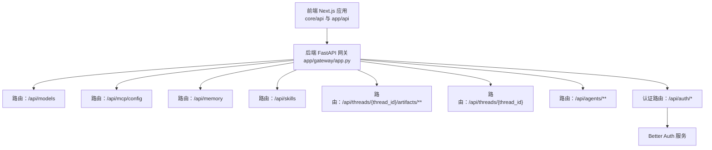
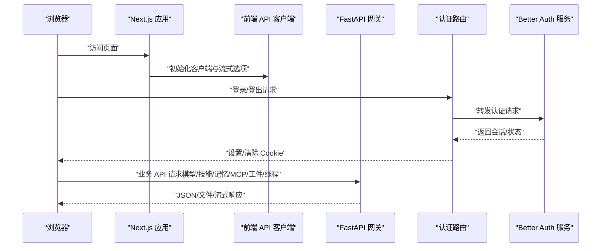
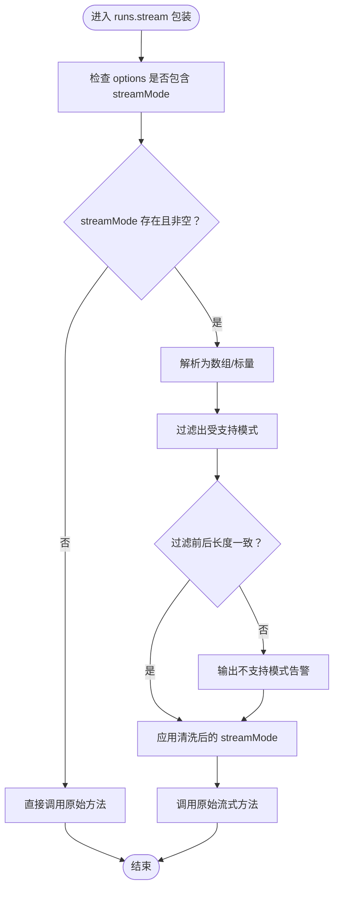
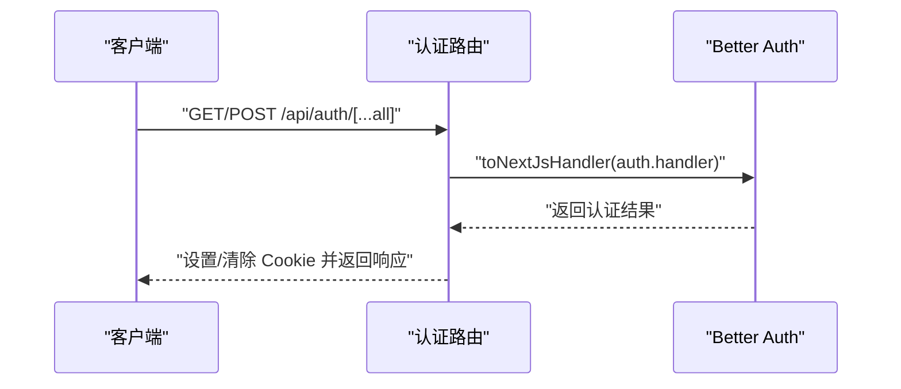
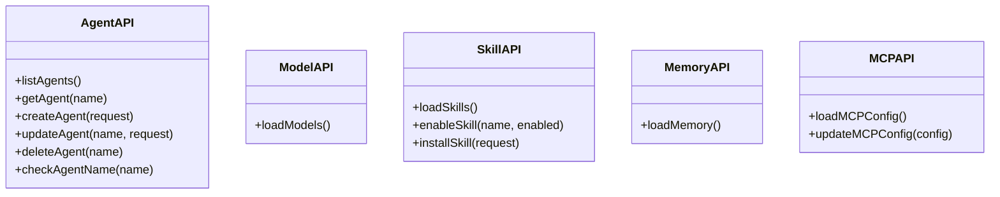
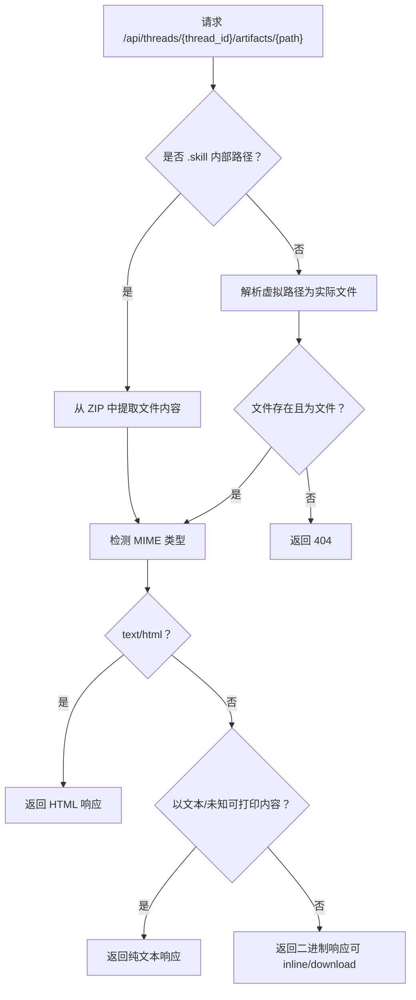
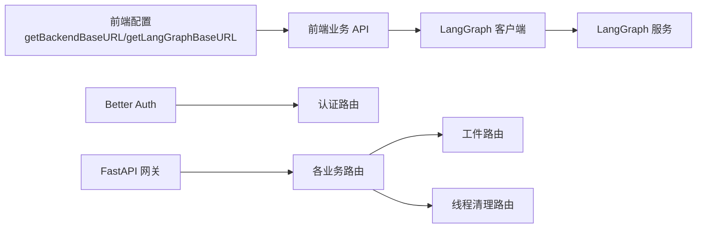

# API 集成

<cite>
**本文引用的文件**
- [frontend/src/core/api/api-client.ts](file://frontend/src/core/api/api-client.ts)
- [frontend/src/core/api/stream-mode.ts](file://frontend/src/core/api/stream-mode.ts)
- [frontend/src/core/config/index.ts](file://frontend/src/core/config/index.ts)
- [frontend/src/app/api/auth/[...all]/route.ts](file://frontend/src/app/api/auth/[...all]/route.ts)
- [frontend/src/server/better-auth/config.ts](file://frontend/src/server/better-auth/config.ts)
- [frontend/src/core/agents/api.ts](file://frontend/src/core/agents/api.ts)
- [frontend/src/core/models/api.ts](file://frontend/src/core/models/api.ts)
- [frontend/src/core/skills/api.ts](file://frontend/src/core/skills/api.ts)
- [frontend/src/core/memory/api.ts](file://frontend/src/core/memory/api.ts)
- [frontend/src/core/mcp/api.ts](file://frontend/src/core/mcp/api.ts)
- [backend/app/gateway/app.py](file://backend/app/gateway/app.py)
- [backend/app/gateway/routers/threads.py](file://backend/app/gateway/routers/threads.py)
- [backend/app/gateway/routers/artifacts.py](file://backend/app/gateway/routers/artifacts.py)
</cite>

## 目录
1. [引言](#引言)
2. [项目结构](#项目结构)
3. [核心组件](#核心组件)
4. [架构总览](#架构总览)
5. [详细组件分析](#详细组件分析)
6. [依赖分析](#依赖分析)
7. [性能考虑](#性能考虑)
8. [故障排查指南](#故障排查指南)
9. [结论](#结论)
10. [附录](#附录)

## 引言
本文件面向 DeerFlow 的 API 集成机制，系统性阐述前端与后端 API 的交互模式、请求处理与响应管理；详解 API 客户端设计、HTTP 请求配置与错误处理策略；覆盖流式响应处理、实时数据更新与 WebSocket 连接管理现状；给出认证机制、请求拦截器与响应转换器的实现思路；解释 API 版本管理、缓存策略与性能监控建议；并提供 API 测试方法与调试工具使用指南。

## 项目结构
- 前端（Next.js 应用）通过统一的后端基础地址与 LangGraph 基础地址进行 API 调用，核心位于 core 目录下的各模块 API 文件中，并在 app/api 下提供认证路由。
- 后端（FastAPI 网关）集中挂载多类业务路由（模型、MCP、记忆、技能、工件、上传、线程、代理等），并通过健康检查与 OpenAPI 文档暴露接口。

图表来源
- [backend/app/gateway/app.py:156-186](file://backend/app/gateway/app.py#L156-L186)
- [frontend/src/app/api/auth/[...all]/route.ts:1-6](file://frontend/src/app/api/auth/[...all]/route.ts#L1-L6)

章节来源
- [backend/app/gateway/app.py:73-201](file://backend/app/gateway/app.py#L73-L201)
- [frontend/src/core/config/index.ts:1-34](file://frontend/src/core/config/index.ts#L1-L34)

## 核心组件
- 前端 API 客户端与流式模式
  - LangGraph 客户端封装与流式选项兼容：通过单例客户端与流式选项清洗，确保仅传递受支持的流式模式。
  - 统一后端与 LangGraph 基础地址解析，支持 Mock 模式与 SSR 场景。
- 认证与会话
  - 使用 Better Auth 提供的 Next.js 适配器，将认证处理器桥接到 Next.js 路由。
- 业务 API
  - 代理、模型、技能、记忆、MCP 配置等均以标准 HTTP 接口形式提供，返回 JSON 或文件响应。
- 后端网关
  - FastAPI 应用集中注册路由，提供健康检查与 OpenAPI 文档；工件路由支持文本、HTML、二进制文件自动识别与下载控制。

章节来源
- [frontend/src/core/api/api-client.ts:1-38](file://frontend/src/core/api/api-client.ts#L1-L38)
- [frontend/src/core/api/stream-mode.ts:1-69](file://frontend/src/core/api/stream-mode.ts#L1-L69)
- [frontend/src/core/config/index.ts:1-34](file://frontend/src/core/config/index.ts#L1-L34)
- [frontend/src/app/api/auth/[...all]/route.ts:1-6](file://frontend/src/app/api/auth/[...all]/route.ts#L1-L6)
- [frontend/src/server/better-auth/config.ts:1-10](file://frontend/src/server/better-auth/config.ts#L1-L10)
- [frontend/src/core/agents/api.ts:1-68](file://frontend/src/core/agents/api.ts#L1-L68)
- [frontend/src/core/models/api.ts:1-10](file://frontend/src/core/models/api.ts#L1-L10)
- [frontend/src/core/skills/api.ts:1-63](file://frontend/src/core/skills/api.ts#L1-L63)
- [frontend/src/core/memory/api.ts:1-10](file://frontend/src/core/memory/api.ts#L1-L10)
- [frontend/src/core/mcp/api.ts:1-22](file://frontend/src/core/mcp/api.ts#L1-L22)
- [backend/app/gateway/app.py:156-196](file://backend/app/gateway/app.py#L156-L196)

## 架构总览
下图展示从浏览器到后端网关的整体调用链路，以及认证流程与 LangGraph 流式调用的集成点。

图表来源
- [frontend/src/core/api/api-client.ts:9-31](file://frontend/src/core/api/api-client.ts#L9-L31)
- [frontend/src/core/api/stream-mode.ts:36-68](file://frontend/src/core/api/stream-mode.ts#L36-L68)
- [frontend/src/app/api/auth/[...all]/route.ts:1-6](file://frontend/src/app/api/auth/[...all]/route.ts#L1-L6)
- [frontend/src/server/better-auth/config.ts:3-7](file://frontend/src/server/better-auth/config.ts#L3-L7)
- [backend/app/gateway/app.py:156-196](file://backend/app/gateway/app.py#L156-L196)

## 详细组件分析

### 前端 API 客户端与流式处理
- 客户端设计
  - 单例客户端：避免重复实例化，统一配置基础地址与流式方法包装。
  - 流式方法增强：对 runs.stream 与 runs.joinStream 进行包装，注入流式选项清洗逻辑。
- 流式模式兼容
  - 支持模式集合：values、messages、messages-tuple、updates、events、debug、tasks、checkpoints、custom。
  - 不支持模式警告：首次出现时输出告警，避免静默丢弃。
  - 清洗策略：过滤非法模式，保持数组或标量格式一致。
- 基础地址解析
  - 后端基础地址：优先使用环境变量 NEXT_PUBLIC_BACKEND_BASE_URL，否则为空字符串。
  - LangGraph 基础地址：优先使用 NEXT_PUBLIC_LANGGRAPH_BASE_URL；若启用 Mock 则指向本地 /mock/api；否则基于当前域构造 /api/langgraph；SSR 场景提供回退地址。

图表来源
- [frontend/src/core/api/stream-mode.ts:36-68](file://frontend/src/core/api/stream-mode.ts#L36-L68)
- [frontend/src/core/api/api-client.ts:14-28](file://frontend/src/core/api/api-client.ts#L14-L28)

章节来源
- [frontend/src/core/api/api-client.ts:1-38](file://frontend/src/core/api/api-client.ts#L1-L38)
- [frontend/src/core/api/stream-mode.ts:1-69](file://frontend/src/core/api/stream-mode.ts#L1-L69)
- [frontend/src/core/config/index.ts:14-33](file://frontend/src/core/config/index.ts#L14-L33)

### 认证机制与会话管理
- 认证路由
  - 将 Better Auth 的处理器桥接为 Next.js 的 GET/POST 处理器，统一暴露 /api/auth/*。
- Better Auth 配置
  - 启用邮箱+密码认证，导出会话类型定义，便于前端消费。
- 会话持久化
  - 通过 Cookie 传输会话信息，配合路由层处理登录/登出。

图表来源
- [frontend/src/app/api/auth/[...all]/route.ts:1-6](file://frontend/src/app/api/auth/[...all]/route.ts#L1-L6)
- [frontend/src/server/better-auth/config.ts:3-7](file://frontend/src/server/better-auth/config.ts#L3-L7)

章节来源
- [frontend/src/app/api/auth/[...all]/route.ts:1-6](file://frontend/src/app/api/auth/[...all]/route.ts#L1-L6)
- [frontend/src/server/better-auth/config.ts:1-10](file://frontend/src/server/better-auth/config.ts#L1-L10)

### 业务 API（代理/模型/技能/记忆/MCP）
- 代理 API
  - 列表、详情、创建、更新、删除、名称可用性校验。
- 模型 API
  - 加载可用模型列表。
- 技能 API
  - 查询技能列表、启用/禁用、安装（含错误处理与返回结构）。
- 记忆 API
  - 获取用户记忆数据。
- MCP 配置 API
  - 读取与更新 MCP 配置。

图表来源
- [frontend/src/core/agents/api.ts:5-67](file://frontend/src/core/agents/api.ts#L5-L67)
- [frontend/src/core/models/api.ts:5-9](file://frontend/src/core/models/api.ts#L5-L9)
- [frontend/src/core/skills/api.ts:5-62](file://frontend/src/core/skills/api.ts#L5-L62)
- [frontend/src/core/memory/api.ts:5-9](file://frontend/src/core/memory/api.ts#L5-L9)
- [frontend/src/core/mcp/api.ts:5-21](file://frontend/src/core/mcp/api.ts#L5-L21)

章节来源
- [frontend/src/core/agents/api.ts:1-68](file://frontend/src/core/agents/api.ts#L1-L68)
- [frontend/src/core/models/api.ts:1-10](file://frontend/src/core/models/api.ts#L1-L10)
- [frontend/src/core/skills/api.ts:1-63](file://frontend/src/core/skills/api.ts#L1-L63)
- [frontend/src/core/memory/api.ts:1-10](file://frontend/src/core/memory/api.ts#L1-L10)
- [frontend/src/core/mcp/api.ts:1-22](file://frontend/src/core/mcp/api.ts#L1-L22)

### 后端网关与工件路由
- 网关应用
  - 注册模型、MCP、记忆、技能、工件、上传、线程、代理、建议、通道等路由。
  - 提供健康检查与 OpenAPI 文档。
- 工件路由
  - 支持路径虚拟化解析，自动识别文本、HTML、二进制文件类型。
  - 支持从 .skill 归档中提取内部文件并缓存 5 分钟。
  - 支持强制下载参数，自动编码文件名。
  - 对非法路径、越权访问、未找到等情况返回相应 HTTP 错误码。

图表来源
- [backend/app/gateway/routers/artifacts.py:61-158](file://backend/app/gateway/routers/artifacts.py#L61-L158)

章节来源
- [backend/app/gateway/app.py:156-196](file://backend/app/gateway/app.py#L156-L196)
- [backend/app/gateway/routers/artifacts.py:1-159](file://backend/app/gateway/routers/artifacts.py#L1-159)

### 线程清理路由
- 删除指定线程的本地持久化目录，返回清理结果。
- 对无效值与异常分别返回 422 与 500。

章节来源
- [backend/app/gateway/routers/threads.py:19-41](file://backend/app/gateway/routers/threads.py#L19-L41)

## 依赖分析
- 前端依赖
  - LangGraph SDK 客户端用于与 LangGraph 服务通信。
  - Better Auth 用于认证与会话管理。
  - 各业务模块 API 依赖统一的基础地址解析函数。
- 后端依赖
  - FastAPI 应用集中注册路由，日志与生命周期管理。
  - 工件路由依赖路径解析与 MIME 类型推断。

图表来源
- [frontend/src/core/config/index.ts:3-33](file://frontend/src/core/config/index.ts#L3-L33)
- [frontend/src/core/api/api-client.ts:9-31](file://frontend/src/core/api/api-client.ts#L9-L31)
- [frontend/src/app/api/auth/[...all]/route.ts:1-6](file://frontend/src/app/api/auth/[...all]/route.ts#L1-L6)
- [backend/app/gateway/app.py:156-196](file://backend/app/gateway/app.py#L156-L196)
- [backend/app/gateway/routers/artifacts.py:61-158](file://backend/app/gateway/routers/artifacts.py#L61-L158)
- [backend/app/gateway/routers/threads.py:34-41](file://backend/app/gateway/routers/threads.py#L34-L41)

章节来源
- [frontend/src/core/config/index.ts:1-34](file://frontend/src/core/config/index.ts#L1-L34)
- [frontend/src/core/api/api-client.ts:1-38](file://frontend/src/core/api/api-client.ts#L1-L38)
- [frontend/src/app/api/auth/[...all]/route.ts:1-6](file://frontend/src/app/api/auth/[...all]/route.ts#L1-L6)
- [backend/app/gateway/app.py:73-201](file://backend/app/gateway/app.py#L73-L201)

## 性能考虑
- 流式响应
  - 通过清洗与限制流式模式，减少不必要的数据传输，提升前端渲染效率。
- 缓存策略
  - 工件路由对 .skill 内部文件设置 5 分钟私有缓存，降低重复解压开销。
- 基础地址解析
  - 在 SSR 场景提供回退地址，避免因缺少全局对象导致的异常。
- 建议
  - 对高频查询接口增加本地缓存与去抖策略。
  - 对大文件下载使用分块或 Range 请求优化带宽占用。
  - 在前端引入请求去重与并发限制，避免重复请求。

## 故障排查指南
- 认证相关
  - 若登录失败，检查认证路由是否正确桥接 Better Auth，确认 Cookie 设置与跨域配置。
- API 返回错误
  - 代理/技能/记忆/MCP 等接口在错误时返回 JSON 错误体，前端已捕获 detail 字段用于提示。
  - 工件路由返回 400/403/404 等错误码，需检查路径合法性与权限。
- 流式响应
  - 若出现不支持的流式模式，查看控制台告警，调整 streamMode 参数。
- 基础地址
  - 若请求 404 或跨域问题，确认 NEXT_PUBLIC_BACKEND_BASE_URL 与 NEXT_PUBLIC_LANGGRAPH_BASE_URL 配置。

章节来源
- [frontend/src/core/agents/api.ts:24-27](file://frontend/src/core/agents/api.ts#L24-L27)
- [frontend/src/core/skills/api.ts:49-59](file://frontend/src/core/skills/api.ts#L49-L59)
- [frontend/src/core/api/stream-mode.ts:15-34](file://frontend/src/core/api/stream-mode.ts#L15-L34)
- [backend/app/gateway/routers/artifacts.py:134-138](file://backend/app/gateway/routers/artifacts.py#L134-L138)

## 结论
DeerFlow 的 API 集成采用“前端统一客户端 + 后端 FastAPI 网关”的清晰分层：前端负责认证、流式处理与业务请求；后端负责路由聚合与资源访问控制。通过流式模式清洗、Mock 支持与缓存策略，系统在易用性与性能之间取得平衡。后续可在请求拦截器、版本化路由与性能监控方面进一步完善。

## 附录
- API 版本管理建议
  - 采用路径前缀版本化（如 /v1/...），并在 OpenAPI 中标注版本信息。
- 请求拦截器与响应转换器
  - 前端可在 fetch 包装层加入统一头部、鉴权令牌注入与响应转换。
- 实时与 WebSocket
  - 当前代码未见 WebSocket 连接管理实现；若需实时更新，建议引入独立 WS 通道并与现有流式接口互补。
- 测试与调试
  - 使用 Next.js 内置测试与 Jest；对 API 层编写端到端测试，覆盖错误分支与边界条件。
  - 后端使用 pytest 与 HTTPX 发送请求，结合 OpenAPI 文档验证契约一致性。