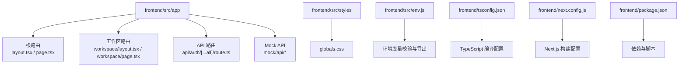
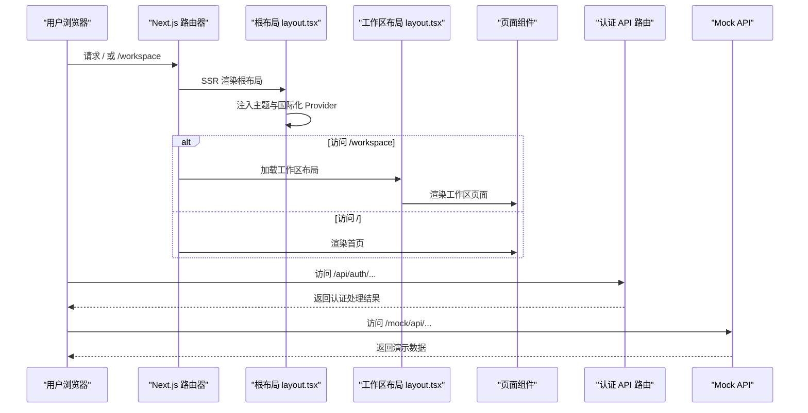
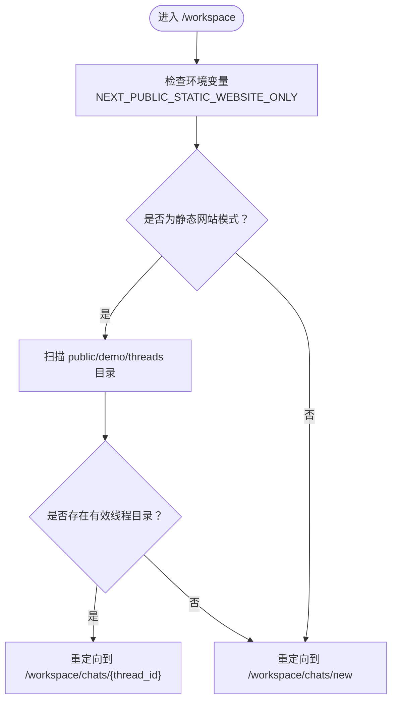
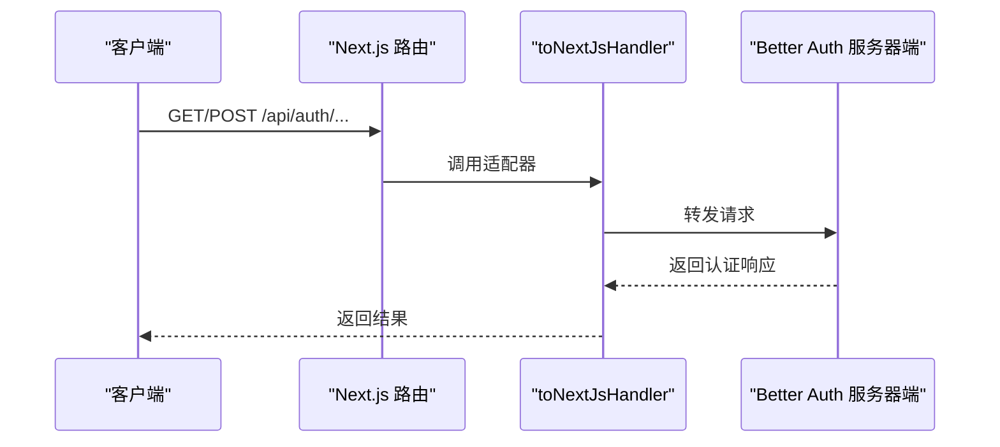
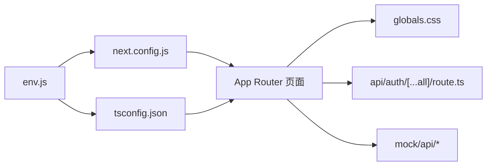

# Next.js 应用结构

<cite>
**本文引用的文件**
- [next.config.js](file://frontend/next.config.js)
- [tsconfig.json](file://frontend/tsconfig.json)
- [package.json](file://frontend/package.json)
- [env.js](file://frontend/src/env.js)
- [layout.tsx（根布局）](file://frontend/src/app/layout.tsx)
- [page.tsx（首页）](file://frontend/src/app/page.tsx)
- [layout.tsx（工作区布局）](file://frontend/src/app/workspace/layout.tsx)
- [page.tsx（工作区首页）](file://frontend/src/app/workspace/page.tsx)
- [route.ts（认证 API）](file://frontend/src/app/api/auth/[...all]/route.ts)
- [route.ts（模型列表 Mock API）](file://frontend/src/app/mock/api/models/route.ts)
- [route.ts（技能列表 Mock API）](file://frontend/src/app/mock/api/skills/route.ts)
- [route.ts（MCP 配置 Mock API）](file://frontend/src/app/mock/api/mcp/config/route.ts)
- [globals.css](file://frontend/src/styles/globals.css)
- [index.ts（Better Auth 导出）](file://frontend/src/server/better-auth/index.ts)
</cite>

## 目录
1. [引言](#引言)
2. [项目结构](#项目结构)
3. [核心组件](#核心组件)
4. [架构总览](#架构总览)
5. [组件与路由详解](#组件与路由详解)
6. [依赖关系分析](#依赖关系分析)
7. [性能与构建优化](#性能与构建优化)
8. [故障排查指南](#故障排查指南)
9. [结论](#结论)
10. [附录](#附录)

## 引言
本文件系统性梳理 DeerFlow 前端（Next.js）应用的结构与实现，重点覆盖：
- App Router 的目录结构与路由组织方式
- 根布局、元数据与全局样式的配置
- Next.js 与 TypeScript 配置要点
- 路由规则、页面渲染模式与静态生成策略
- 应用启动流程、SSR/SSG 实现与性能优化建议
- 认证与 Mock API 的集成方式

## 项目结构
前端采用 Next.js App Router 结构，核心位于 frontend/src/app 下，按功能域划分页面与布局；公共样式与主题在 frontend/src/styles 中统一管理；环境变量通过 @t3-oss/env-nextjs 进行校验与导出；TypeScript 使用 Bundler 模块解析与严格模式。

图表来源
- [layout.tsx（根布局）:1-29](file://frontend/src/app/layout.tsx#L1-L29)
- [page.tsx（首页）:1-26](file://frontend/src/app/page.tsx#L1-L26)
- [layout.tsx（工作区布局）:1-48](file://frontend/src/app/workspace/layout.tsx#L1-L48)
- [page.tsx（工作区首页）:1-21](file://frontend/src/app/workspace/page.tsx#L1-L21)
- [route.ts（认证 API）:1-6](file://frontend/src/app/api/auth/[...all]/route.ts#L1-L6)
- [route.ts（模型列表 Mock API）:1-35](file://frontend/src/app/mock/api/models/route.ts#L1-L35)
- [route.ts（技能列表 Mock API）:1-87](file://frontend/src/app/mock/api/skills/route.ts#L1-L87)
- [route.ts（MCP 配置 Mock API）:1-27](file://frontend/src/app/mock/api/mcp/config/route.ts#L1-L27)
- [globals.css:1-393](file://frontend/src/styles/globals.css#L1-L393)
- [env.js:1-61](file://frontend/src/env.js#L1-L61)
- [tsconfig.json:1-46](file://frontend/tsconfig.json#L1-L46)
- [next.config.js:1-13](file://frontend/next.config.js#L1-L13)
- [package.json:1-111](file://frontend/package.json#L1-L111)

章节来源
- [layout.tsx（根布局）:1-29](file://frontend/src/app/layout.tsx#L1-L29)
- [page.tsx（首页）:1-26](file://frontend/src/app/page.tsx#L1-L26)
- [layout.tsx（工作区布局）:1-48](file://frontend/src/app/workspace/layout.tsx#L1-L48)
- [page.tsx（工作区首页）:1-21](file://frontend/src/app/workspace/page.tsx#L1-L21)
- [route.ts（认证 API）:1-6](file://frontend/src/app/api/auth/[...all]/route.ts#L1-L6)
- [route.ts（模型列表 Mock API）:1-35](file://frontend/src/app/mock/api/models/route.ts#L1-L35)
- [route.ts（技能列表 Mock API）:1-87](file://frontend/src/app/mock/api/skills/route.ts#L1-L87)
- [route.ts（MCP 配置 Mock API）:1-27](file://frontend/src/app/mock/api/mcp/config/route.ts#L1-L27)
- [globals.css:1-393](file://frontend/src/styles/globals.css#L1-L393)
- [env.js:1-61](file://frontend/src/env.js#L1-L61)
- [tsconfig.json:1-46](file://frontend/tsconfig.json#L1-L46)
- [next.config.js:1-13](file://frontend/next.config.js#L1-L13)
- [package.json:1-111](file://frontend/package.json#L1-L111)

## 核心组件
- 根布局与元数据：定义站点标题、描述与语言，注入主题与国际化 Provider，启用 SSR。
- 工作区布局：客户端侧状态管理、侧边栏控制、全局查询客户端与通知组件。
- 首页与工作区首页：展示 Landing 页面内容与工作区重定向逻辑。
- 认证 API：基于 Better Auth 的 Next.js 适配器，暴露 GET/POST。
- Mock API：模型、技能、MCP 配置等前端演示数据接口。
- 全局样式：Tailwind、动画与暗色主题变量，统一样式与动效。

章节来源
- [layout.tsx（根布局）:1-29](file://frontend/src/app/layout.tsx#L1-L29)
- [page.tsx（首页）:1-26](file://frontend/src/app/page.tsx#L1-L26)
- [layout.tsx（工作区布局）:1-48](file://frontend/src/app/workspace/layout.tsx#L1-L48)
- [page.tsx（工作区首页）:1-21](file://frontend/src/app/workspace/page.tsx#L1-L21)
- [route.ts（认证 API）:1-6](file://frontend/src/app/api/auth/[...all]/route.ts#L1-L6)
- [route.ts（模型列表 Mock API）:1-35](file://frontend/src/app/mock/api/models/route.ts#L1-L35)
- [route.ts（技能列表 Mock API）:1-87](file://frontend/src/app/mock/api/skills/route.ts#L1-L87)
- [route.ts（MCP 配置 Mock API）:1-27](file://frontend/src/app/mock/api/mcp/config/route.ts#L1-L27)
- [globals.css:1-393](file://frontend/src/styles/globals.css#L1-L393)

## 架构总览
下图展示了从浏览器到服务端与 Mock API 的交互路径，以及认证与国际化/主题 Provider 的注入顺序。

图表来源
- [layout.tsx（根布局）:1-29](file://frontend/src/app/layout.tsx#L1-L29)
- [layout.tsx（工作区布局）:1-48](file://frontend/src/app/workspace/layout.tsx#L1-L48)
- [page.tsx（首页）:1-26](file://frontend/src/app/page.tsx#L1-L26)
- [page.tsx（工作区首页）:1-21](file://frontend/src/app/workspace/page.tsx#L1-L21)
- [route.ts（认证 API）:1-6](file://frontend/src/app/api/auth/[...all]/route.ts#L1-L6)
- [route.ts（模型列表 Mock API）:1-35](file://frontend/src/app/mock/api/models/route.ts#L1-L35)
- [route.ts（技能列表 Mock API）:1-87](file://frontend/src/app/mock/api/skills/route.ts#L1-L87)
- [route.ts（MCP 配置 Mock API）:1-27](file://frontend/src/app/mock/api/mcp/config/route.ts#L1-L27)

## 组件与路由详解

### 根布局与元数据
- 元数据：站点标题与描述在根布局中集中声明，确保所有页面共享一致的 SEO 信息。
- 国际化与主题：服务端检测语言后注入 I18nProvider 与 ThemeProvider，支持暗色主题与系统跟随。
- HTML 标签：设置 lang 属性，并抑制内容可编辑警告与水合警告以提升首屏体验。

章节来源
- [layout.tsx（根布局）:1-29](file://frontend/src/app/layout.tsx#L1-L29)
- [env.js:1-61](file://frontend/src/env.js#L1-L61)

### 首页（Landing）
- 页面结构：包含头部、英雄、案例研究、技能、沙盒、新特性与社区等模块。
- 样式：使用深色背景与模块化布局，配合全局样式中的动画与颜色变量。

章节来源
- [page.tsx（首页）:1-26](file://frontend/src/app/page.tsx#L1-L26)
- [globals.css:1-393](file://frontend/src/styles/globals.css#L1-L393)

### 工作区布局与页面
- 布局职责：客户端状态管理（侧边栏展开/收起）、全局查询客户端、通知与命令面板。
- 页面重定向：根据环境变量决定是否进入演示模式，自动跳转至第一个演示线程或新建聊天页。

图表来源
- [page.tsx（工作区首页）:1-21](file://frontend/src/app/workspace/page.tsx#L1-L21)

章节来源
- [layout.tsx（工作区布局）:1-48](file://frontend/src/app/workspace/layout.tsx#L1-L48)
- [page.tsx（工作区首页）:1-21](file://frontend/src/app/workspace/page.tsx#L1-L21)
- [env.js:1-61](file://frontend/src/env.js#L1-L61)

### 认证 API（Better Auth）
- 适配器：使用 toNextJsHandler 将 Better Auth handler 暴露为 Next.js 的 GET/POST。
- 配置：Better Auth 的具体配置在 server/better-auth/config 中导出，供此处使用。

图表来源
- [route.ts（认证 API）:1-6](file://frontend/src/app/api/auth/[...all]/route.ts#L1-L6)
- [index.ts（Better Auth 导出）:1-2](file://frontend/src/server/better-auth/index.ts#L1-L2)

章节来源
- [route.ts（认证 API）:1-6](file://frontend/src/app/api/auth/[...all]/route.ts#L1-L6)
- [index.ts（Better Auth 导出）:1-2](file://frontend/src/server/better-auth/index.ts#L1-L2)

### Mock API（模型、技能、MCP 配置）
- 模型列表：返回多模型示例数据，包含名称、显示名与思考能力标记。
- 技能列表：返回技能清单，含分类、许可证与启用状态。
- MCP 配置：返回可用 MCP 服务器列表及其运行参数与描述。

章节来源
- [route.ts（模型列表 Mock API）:1-35](file://frontend/src/app/mock/api/models/route.ts#L1-L35)
- [route.ts（技能列表 Mock API）:1-87](file://frontend/src/app/mock/api/skills/route.ts#L1-L87)
- [route.ts（MCP 配置 Mock API）:1-27](file://frontend/src/app/mock/api/mcp/config/route.ts#L1-L27)

### 全局样式与主题
- Tailwind 与动画：引入 Tailwind 与 tw-animate-css，提供丰富的原子类与动效。
- 动画与关键帧：定义多种动画（淡入、弹跳、骨架屏等），用于消息与界面元素。
- 主题变量：定义明/暗两套颜色体系与圆角变量，支持暗色主题切换。
- 容器宽度：提供容器最大宽度断点，适配不同屏幕尺寸。

章节来源
- [globals.css:1-393](file://frontend/src/styles/globals.css#L1-L393)

## 依赖关系分析
- 环境变量：通过 @t3-oss/env-nextjs 在构建期与运行期进行校验，区分服务端与客户端变量前缀。
- 构建配置：Next.js 默认配置，关闭开发指示器，提前加载 env。
- TypeScript：严格模式、Bundler 解析、路径别名 @/* 指向 src/*。
- 依赖：React 19、Next 16、better-auth、@tanstack/react-query、Tailwind 4、Sonner 等。

图表来源
- [env.js:1-61](file://frontend/src/env.js#L1-L61)
- [next.config.js:1-13](file://frontend/next.config.js#L1-L13)
- [tsconfig.json:1-46](file://frontend/tsconfig.json#L1-L46)
- [layout.tsx（根布局）:1-29](file://frontend/src/app/layout.tsx#L1-L29)
- [page.tsx（首页）:1-26](file://frontend/src/app/page.tsx#L1-L26)
- [layout.tsx（工作区布局）:1-48](file://frontend/src/app/workspace/layout.tsx#L1-L48)
- [page.tsx（工作区首页）:1-21](file://frontend/src/app/workspace/page.tsx#L1-L21)
- [route.ts（认证 API）:1-6](file://frontend/src/app/api/auth/[...all]/route.ts#L1-L6)
- [route.ts（模型列表 Mock API）:1-35](file://frontend/src/app/mock/api/models/route.ts#L1-L35)
- [route.ts（技能列表 Mock API）:1-87](file://frontend/src/app/mock/api/skills/route.ts#L1-L87)
- [route.ts（MCP 配置 Mock API）:1-27](file://frontend/src/app/mock/api/mcp/config/route.ts#L1-L27)
- [globals.css:1-393](file://frontend/src/styles/globals.css#L1-L393)

章节来源
- [env.js:1-61](file://frontend/src/env.js#L1-L61)
- [next.config.js:1-13](file://frontend/next.config.js#L1-L13)
- [tsconfig.json:1-46](file://frontend/tsconfig.json#L1-L46)
- [package.json:1-111](file://frontend/package.json#L1-L111)

## 性能与构建优化
- 开发体验：启用 --turbo 参数加速开发服务器启动与热更新。
- 构建配置：默认 Next.js 行为，关闭 devIndicators 降低控制台噪音。
- 类型安全：严格 TypeScript 配置，结合 ESLint 与增量编译提升迭代效率。
- 样式体积：通过 Tailwind 原子类减少自定义 CSS，配合动画库按需使用。
- 环境变量：仅暴露必要的 NEXT_PUBLIC_* 变量，避免敏感信息泄漏。
- 重定向策略：工作区首页根据环境变量快速定位演示或新建入口，减少无效渲染。

章节来源
- [package.json:1-111](file://frontend/package.json#L1-L111)
- [next.config.js:1-13](file://frontend/next.config.js#L1-L13)
- [tsconfig.json:1-46](file://frontend/tsconfig.json#L1-L46)
- [page.tsx（工作区首页）:1-21](file://frontend/src/app/workspace/page.tsx#L1-L21)
- [env.js:1-61](file://frontend/src/env.js#L1-L61)

## 故障排查指南
- 环境变量错误
  - 症状：构建失败或运行时报错。
  - 排查：确认 server/client 字段与 runtimeEnv 对应键值，必要时设置 SKIP_ENV_VALIDATION 跳过校验。
- 认证异常
  - 症状：登录/登出失败或会话状态异常。
  - 排查：检查 Better Auth 的密钥与第三方 OAuth 配置，确认路由 /api/auth/[...all] 是否正确转发。
- 静态网站模式
  - 症状：访问 /workspace 未跳转到演示线程。
  - 排查：确认 NEXT_PUBLIC_STATIC_WEBSITE_ONLY=true 且 public/demo/threads 存在有效目录。
- 样式不生效
  - 症状：动画或颜色未出现。
  - 排查：确认 globals.css 已被导入，Tailwind 与动画库版本兼容。

章节来源
- [env.js:1-61](file://frontend/src/env.js#L1-L61)
- [route.ts（认证 API）:1-6](file://frontend/src/app/api/auth/[...all]/route.ts#L1-L6)
- [page.tsx（工作区首页）:1-21](file://frontend/src/app/workspace/page.tsx#L1-L21)
- [globals.css:1-393](file://frontend/src/styles/globals.css#L1-L393)

## 结论
DeerFlow 的 Next.js 前端以 App Router 为核心，结合 Better Auth 提供认证能力，使用 Mock API 支持演示场景，通过严格的 TypeScript 与环境变量配置保障安全性与可维护性。根布局与工作区布局分别承担国际化/主题与客户端状态管理职责，页面层聚焦业务展示与重定向策略。整体架构清晰、职责分离明确，具备良好的扩展性与性能基础。

## 附录
- 关键配置与脚本
  - 构建：next build
  - 开发：next dev --turbo
  - 预览：next build && next start
  - 类型检查：tsc --noEmit
  - 代码检查：eslint . --ext .ts,.tsx

章节来源
- [package.json:1-111](file://frontend/package.json#L1-L111)
- [tsconfig.json:1-46](file://frontend/tsconfig.json#L1-L46)
- [next.config.js:1-13](file://frontend/next.config.js#L1-L13)