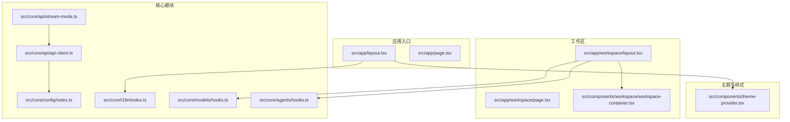
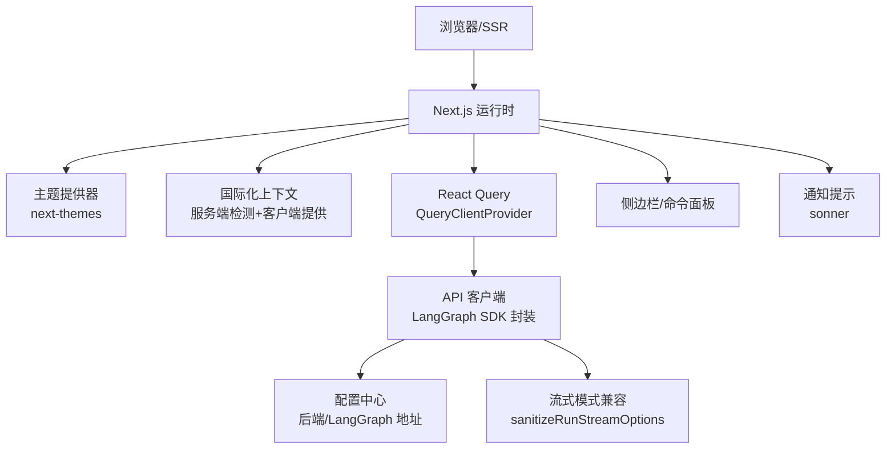
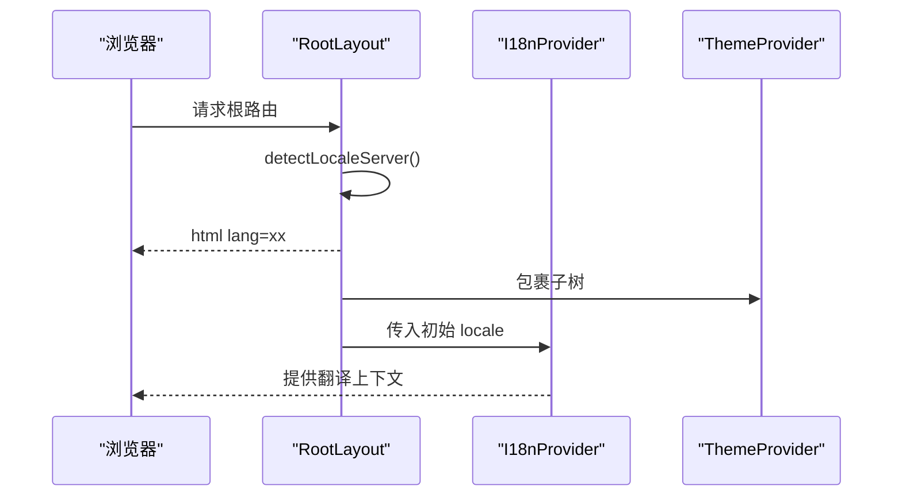
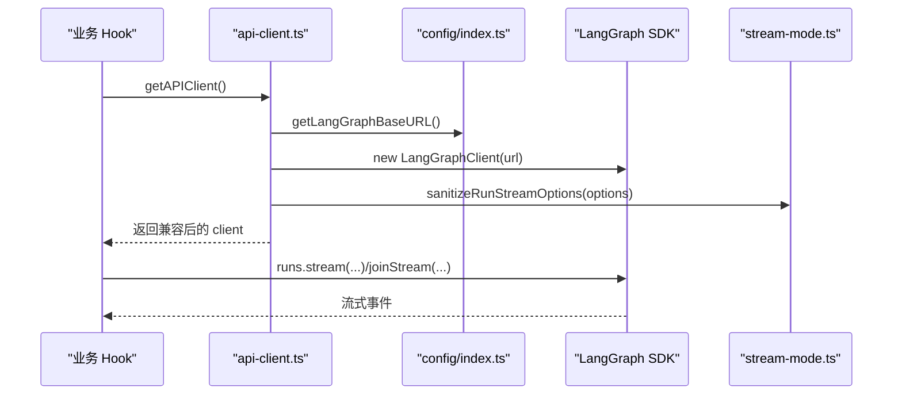
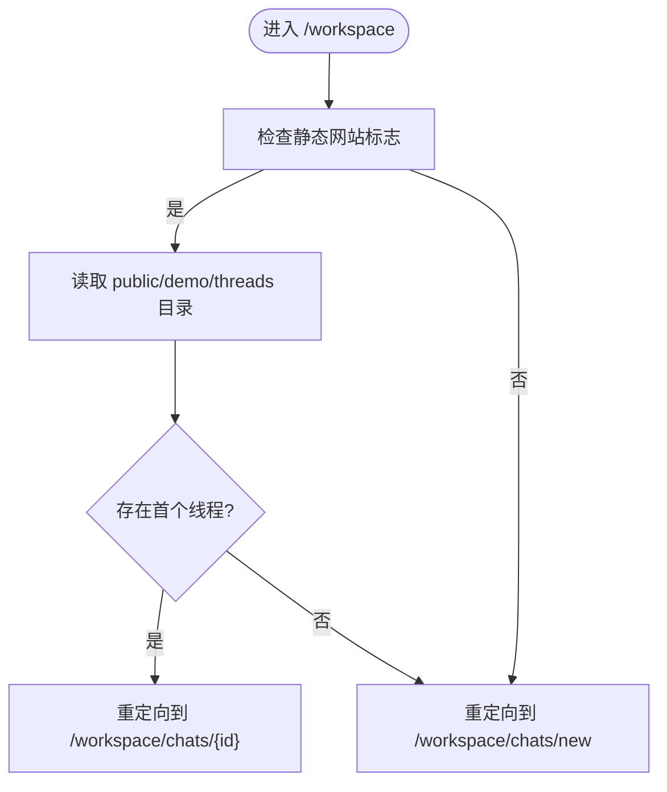
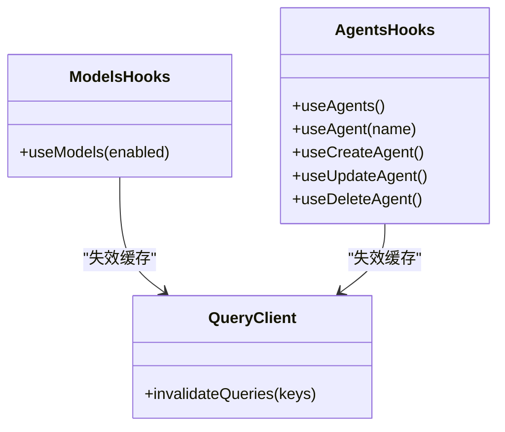
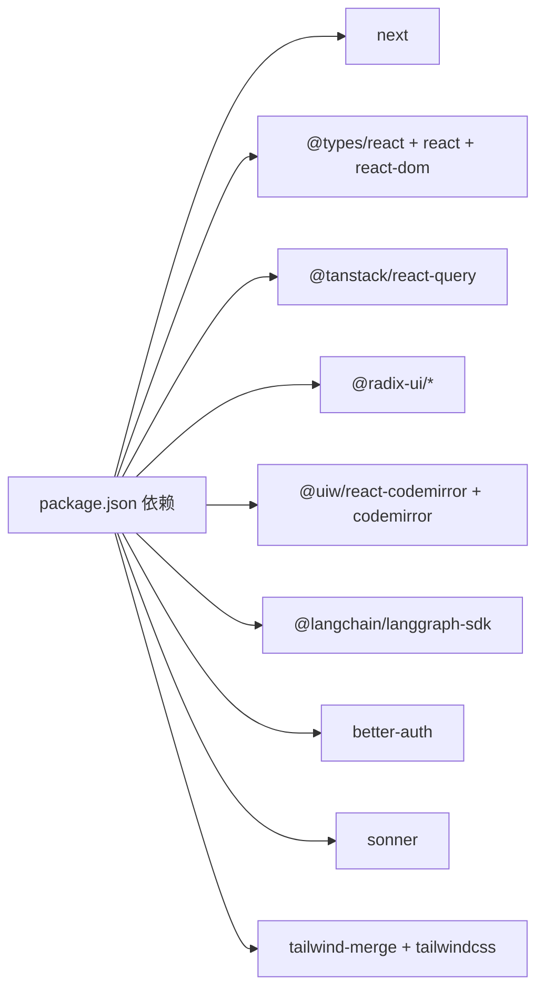

# 前端架构

<cite>
**本文引用的文件**
- [package.json](file://frontend/package.json)
- [next.config.js](file://frontend/next.config.js)
- [tsconfig.json](file://frontend/tsconfig.json)
- [src/app/layout.tsx](file://frontend/src/app/layout.tsx)
- [src/app/page.tsx](file://frontend/src/app/page.tsx)
- [src/components/theme-provider.tsx](file://frontend/src/components/theme-provider.tsx)
- [src/components/workspace/workspace-container.tsx](file://frontend/src/components/workspace/workspace-container.tsx)
- [src/app/workspace/layout.tsx](file://frontend/src/app/workspace/layout.tsx)
- [src/app/workspace/page.tsx](file://frontend/src/app/workspace/page.tsx)
- [src/core/config/index.ts](file://frontend/src/core/config/index.ts)
- [src/core/api/api-client.ts](file://frontend/src/core/api/api-client.ts)
- [src/core/api/stream-mode.ts](file://frontend/src/core/api/stream-mode.ts)
- [src/core/i18n/index.ts](file://frontend/src/core/i18n/index.ts)
- [src/core/models/hooks.ts](file://frontend/src/core/models/hooks.ts)
- [src/core/agents/hooks.ts](file://frontend/src/core/agents/hooks.ts)
</cite>

## 目录
1. [引言](#引言)
2. [项目结构](#项目结构)
3. [核心组件](#核心组件)
4. [架构总览](#架构总览)
5. [详细组件分析](#详细组件分析)
6. [依赖分析](#依赖分析)
7. [性能考虑](#性能考虑)
8. [故障排查指南](#故障排查指南)
9. [结论](#结论)
10. [附录](#附录)

## 引言
本文件面向 DeerFlow 前端团队与协作开发者，系统性阐述基于 Next.js 的前端架构与实现细节。内容涵盖应用结构、组件设计模式、状态管理策略、API 集成机制、国际化支持、构建配置、性能优化与部署策略，并提供组件开发指南、样式定制与主题配置方法，以及前后端交互模式与数据流管理说明。

## 项目结构
前端采用 Next.js App Router 结构，按功能域划分目录，核心模块包括：
- 应用入口与根布局：定义全局样式、主题与国际化上下文
- 页面路由：包含落地页与工作区页面（聊天、代理等）
- 组件层：通用 UI 组件、AI 元素组件、工作区专用组件
- 核心模块：配置中心、国际化、API 客户端、React Query Hooks、工具函数
- 构建与类型：Next 配置、TypeScript 配置、包管理与脚本

图表来源
- [src/app/layout.tsx:1-29](file://frontend/src/app/layout.tsx#L1-L29)
- [src/app/page.tsx:1-26](file://frontend/src/app/page.tsx#L1-L26)
- [src/app/workspace/layout.tsx:1-48](file://frontend/src/app/workspace/layout.tsx#L1-L48)
- [src/app/workspace/page.tsx:1-21](file://frontend/src/app/workspace/page.tsx#L1-L21)
- [src/components/workspace/workspace-container.tsx:1-136](file://frontend/src/components/workspace/workspace-container.tsx#L1-L136)
- [src/components/theme-provider.tsx:1-20](file://frontend/src/components/theme-provider.tsx#L1-L20)
- [src/core/config/index.ts:1-34](file://frontend/src/core/config/index.ts#L1-L34)
- [src/core/api/api-client.ts:1-38](file://frontend/src/core/api/api-client.ts#L1-L38)
- [src/core/api/stream-mode.ts:1-69](file://frontend/src/core/api/stream-mode.ts#L1-L69)
- [src/core/i18n/index.ts:1-12](file://frontend/src/core/i18n/index.ts#L1-L12)

章节来源
- [package.json:1-111](file://frontend/package.json#L1-L111)
- [next.config.js:1-13](file://frontend/next.config.js#L1-L13)
- [tsconfig.json:1-46](file://frontend/tsconfig.json#L1-L46)

## 核心组件
- 主题提供器：基于 next-themes 实现明暗主题切换与系统偏好同步，首页强制深色以提升视觉体验
- 国际化上下文：服务端检测语言、客户端提供翻译与类型安全
- API 客户端：封装 LangGraph SDK 客户端，统一处理流式模式兼容与单例缓存
- 工作区布局：集成 React Query、命令面板、侧边栏与通知提示
- 页面容器：工作区头部面包屑、GitHub 链接与内容主体

章节来源
- [src/components/theme-provider.tsx:1-20](file://frontend/src/components/theme-provider.tsx#L1-L20)
- [src/core/i18n/index.ts:1-12](file://frontend/src/core/i18n/index.ts#L1-L12)
- [src/core/api/api-client.ts:1-38](file://frontend/src/core/api/api-client.ts#L1-L38)
- [src/app/workspace/layout.tsx:1-48](file://frontend/src/app/workspace/layout.tsx#L1-L48)
- [src/components/workspace/workspace-container.tsx:1-136](file://frontend/src/components/workspace/workspace-container.tsx#L1-L136)

## 架构总览
前端通过 App Router 管理页面与路由，使用 React Server Components 与客户端组件混合渲染；状态管理以 React Query 为核心，结合本地设置持久化与主题/国际化上下文；API 层通过配置中心统一后端与 LangGraph 地址，屏蔽环境差异；UI 组件遵循可组合与可复用原则，工作区组件与通用 UI 分离。

图表来源
- [src/app/layout.tsx:1-29](file://frontend/src/app/layout.tsx#L1-L29)
- [src/app/workspace/layout.tsx:1-48](file://frontend/src/app/workspace/layout.tsx#L1-L48)
- [src/core/config/index.ts:1-34](file://frontend/src/core/config/index.ts#L1-L34)
- [src/core/api/api-client.ts:1-38](file://frontend/src/core/api/api-client.ts#L1-L38)
- [src/core/api/stream-mode.ts:1-69](file://frontend/src/core/api/stream-mode.ts#L1-L69)

## 详细组件分析

### 主题与国际化
- 主题策略：在首页强制深色，在其他页面允许用户/系统偏好切换；避免首屏闪烁
- 国际化策略：服务端检测语言，传递给客户端上下文；导出默认语言、支持列表与类型

图表来源
- [src/app/layout.tsx:1-29](file://frontend/src/app/layout.tsx#L1-L29)
- [src/components/theme-provider.tsx:1-20](file://frontend/src/components/theme-provider.tsx#L1-L20)
- [src/core/i18n/index.ts:1-12](file://frontend/src/core/i18n/index.ts#L1-L12)

章节来源
- [src/app/layout.tsx:1-29](file://frontend/src/app/layout.tsx#L1-L29)
- [src/components/theme-provider.tsx:1-20](file://frontend/src/components/theme-provider.tsx#L1-L20)
- [src/core/i18n/index.ts:1-12](file://frontend/src/core/i18n/index.ts#L1-L12)

### API 客户端与流式模式
- 单例客户端：延迟初始化 LangGraph SDK 客户端，保证全局一致性
- 流式兼容：对 runs.stream 与 joinStream 的参数进行模式过滤与警告，确保只使用受支持的流模式
- 地址解析：优先使用显式配置，否则根据运行环境推断默认地址

图表来源
- [src/core/api/api-client.ts:1-38](file://frontend/src/core/api/api-client.ts#L1-L38)
- [src/core/config/index.ts:1-34](file://frontend/src/core/config/index.ts#L1-L34)
- [src/core/api/stream-mode.ts:1-69](file://frontend/src/core/api/stream-mode.ts#L1-L69)

章节来源
- [src/core/api/api-client.ts:1-38](file://frontend/src/core/api/api-client.ts#L1-L38)
- [src/core/api/stream-mode.ts:1-69](file://frontend/src/core/api/stream-mode.ts#L1-L69)
- [src/core/config/index.ts:1-34](file://frontend/src/core/config/index.ts#L1-L34)

### 工作区布局与页面导航
- 布局职责：初始化 QueryClient、侧边栏状态、命令面板与通知；承载工作区页面
- 页面逻辑：根据静态网站模式重定向到演示线程或新建聊天
- 头部容器：生成面包屑、展示 GitHub 链接与工具提示

图表来源
- [src/app/workspace/page.tsx:1-21](file://frontend/src/app/workspace/page.tsx#L1-L21)

章节来源
- [src/app/workspace/layout.tsx:1-48](file://frontend/src/app/workspace/layout.tsx#L1-L48)
- [src/app/workspace/page.tsx:1-21](file://frontend/src/app/workspace/page.tsx#L1-L21)
- [src/components/workspace/workspace-container.tsx:1-136](file://frontend/src/components/workspace/workspace-container.tsx#L1-L136)

### React Query Hooks 设计
- 模型列表：查询键固定为 ["models"]，禁用窗口聚焦自动刷新
- 代理 CRUD：查询键包含名称，启用条件查询；成功后失效相关查询缓存
- 通用模式：Mutation 成功后主动失效相关 QueryKey，保持缓存一致性

图表来源
- [src/core/models/hooks.ts:1-14](file://frontend/src/core/models/hooks.ts#L1-L14)
- [src/core/agents/hooks.ts:1-65](file://frontend/src/core/agents/hooks.ts#L1-L65)

章节来源
- [src/core/models/hooks.ts:1-14](file://frontend/src/core/models/hooks.ts#L1-L14)
- [src/core/agents/hooks.ts:1-65](file://frontend/src/core/agents/hooks.ts#L1-L65)

## 依赖分析
- 运行时依赖：Next.js、React、TanStack React Query、Radix UI、CodeMirror、LangGraph SDK、better-auth、Sonner、Tailwind Merge 等
- 开发依赖：TypeScript、ESLint、Prettier、TailwindCSS、PostCSS 等
- 脚本：开发、构建、预览、类型检查与代码质量检查

图表来源
- [package.json:1-111](file://frontend/package.json#L1-L111)

章节来源
- [package.json:1-111](file://frontend/package.json#L1-L111)

## 性能考虑
- 构建与运行时
  - 关闭开发指示器以减少构建输出噪声
  - 使用 TypeScript Bundler 解析与严格模式，提升类型安全性与 Tree-shaking 效果
- 状态与缓存
  - React Query 查询键命名规范，避免不必要的重复请求
  - 模型列表禁用窗口聚焦刷新，降低网络压力
  - Mutation 成功后精准失效相关缓存，避免全量刷新
- 主题与国际化
  - 首页强制深色，减少主题切换带来的布局抖动
  - 服务端检测语言，避免客户端闪烁
- 流式传输
  - 对不支持的流模式进行过滤与告警，确保稳定性与可观测性

章节来源
- [next.config.js:1-13](file://frontend/next.config.js#L1-L13)
- [tsconfig.json:1-46](file://frontend/tsconfig.json#L1-L46)
- [src/app/workspace/layout.tsx:1-48](file://frontend/src/app/workspace/layout.tsx#L1-L48)
- [src/core/models/hooks.ts:1-14](file://frontend/src/core/models/hooks.ts#L1-L14)
- [src/core/api/stream-mode.ts:1-69](file://frontend/src/core/api/stream-mode.ts#L1-L69)

## 故障排查指南
- 国际化问题
  - 确认服务端语言检测逻辑是否返回预期 locale
  - 检查客户端 I18nProvider 是否正确接收 initialLocale
- 主题异常
  - 首页强制深色由路径判断决定，确认当前路由是否为根路径
  - 系统主题切换需确保 next-themes 配置一致
- API 访问失败
  - 检查 LangGraph 基础地址解析逻辑，确认环境变量或默认值
  - 若使用 Mock 模式，确认 /mock/api 路由可用
- 流式模式错误
  - 不支持的 streamMode 将被过滤并发出警告，检查调用方传参
- 工作区页面重定向
  - 静态网站模式下需确保 public/demo/threads 存在有效线程目录

章节来源
- [src/app/layout.tsx:1-29](file://frontend/src/app/layout.tsx#L1-L29)
- [src/components/theme-provider.tsx:1-20](file://frontend/src/components/theme-provider.tsx#L1-L20)
- [src/core/config/index.ts:1-34](file://frontend/src/core/config/index.ts#L1-L34)
- [src/core/api/stream-mode.ts:1-69](file://frontend/src/core/api/stream-mode.ts#L1-L69)
- [src/app/workspace/page.tsx:1-21](file://frontend/src/app/workspace/page.tsx#L1-L21)

## 结论
DeerFlow 前端以 Next.js App Router 为基础，结合 React Server Components、React Query、国际化与主题系统，形成清晰的分层架构。通过配置中心与 API 客户端抽象，实现跨环境的一致性与可维护性；通过工作区组件与通用 UI 的分离，提升复用性与扩展性。建议在后续迭代中持续完善 Mock API 与错误边界、增强性能监控与缓存策略。

## 附录

### 组件开发指南
- 组件组织
  - 通用 UI 放置于 components/ui，工作区专用组件置于 components/workspace
  - 使用 className 合并与 Tailwind 工具类，避免内联样式
- 状态管理
  - 优先使用 React Query 管理远端状态，本地状态使用 useState/useReducer
  - Mutation 成功后统一失效相关查询键，保持缓存一致性
- 国际化
  - 在组件中使用 useI18n 获取翻译函数，避免硬编码文本
  - 新增语言时更新 core/i18n 与服务端检测逻辑
- 主题与样式
  - 使用 next-themes 控制主题，避免直接操作 DOM
  - 通过 Tailwind Merge 合并类名，减少冲突

### 构建与部署
- 构建
  - 使用 Next.js 内置构建流程，配合 TypeScript 严格模式与 ESLint/Prettier 规范
- 部署
  - 支持静态网站模式（仅演示），通过环境变量控制
  - Docker 环境可通过 SKIP_ENV_VALIDATION 跳过环境校验

章节来源
- [package.json:1-111](file://frontend/package.json#L1-L111)
- [next.config.js:1-13](file://frontend/next.config.js#L1-L13)
- [src/app/workspace/page.tsx:1-21](file://frontend/src/app/workspace/page.tsx#L1-L21)