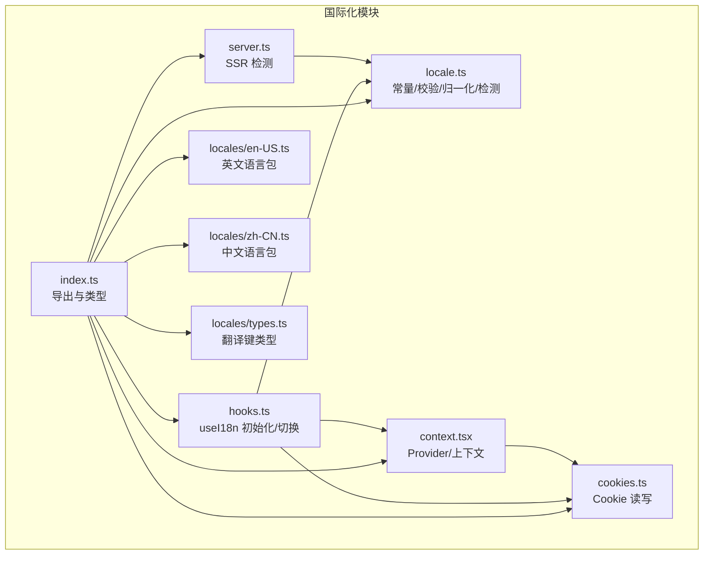
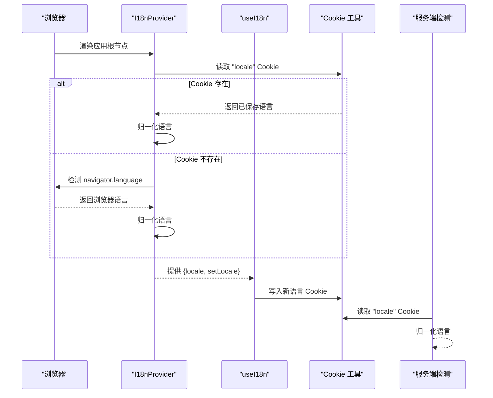
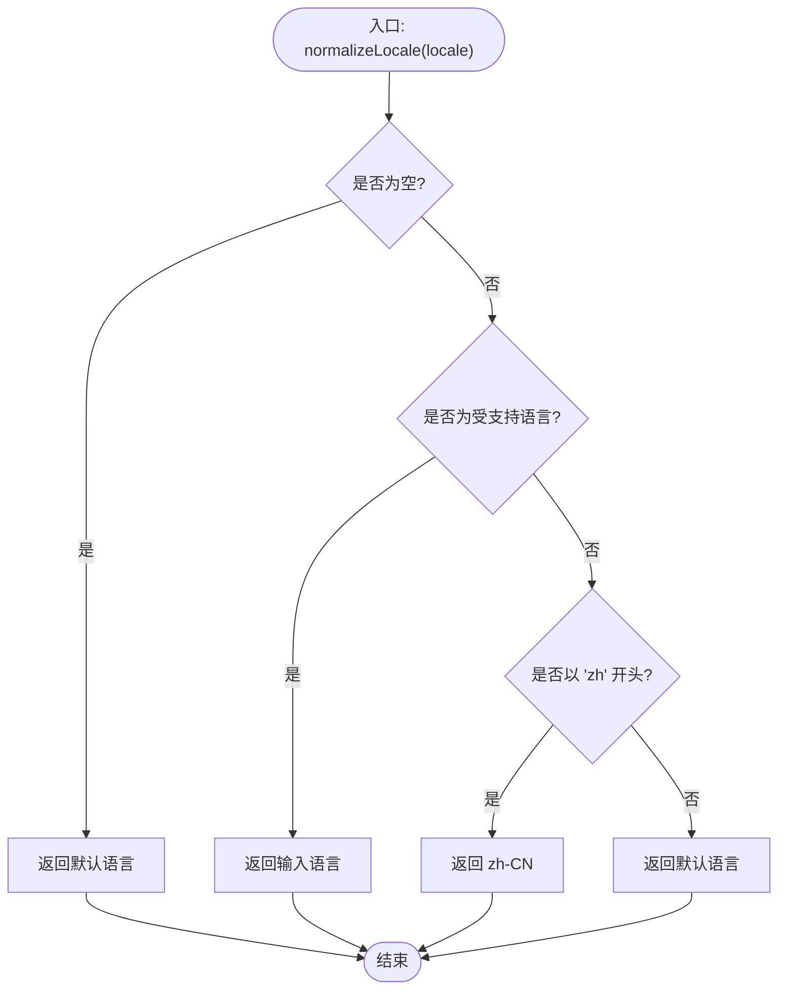
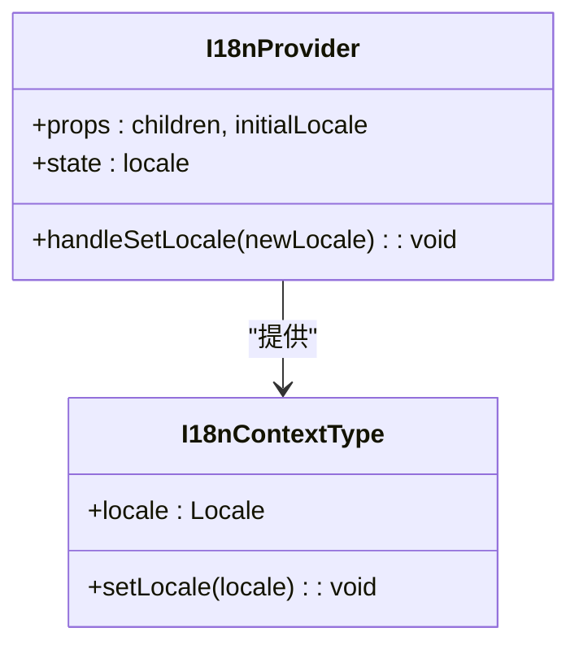
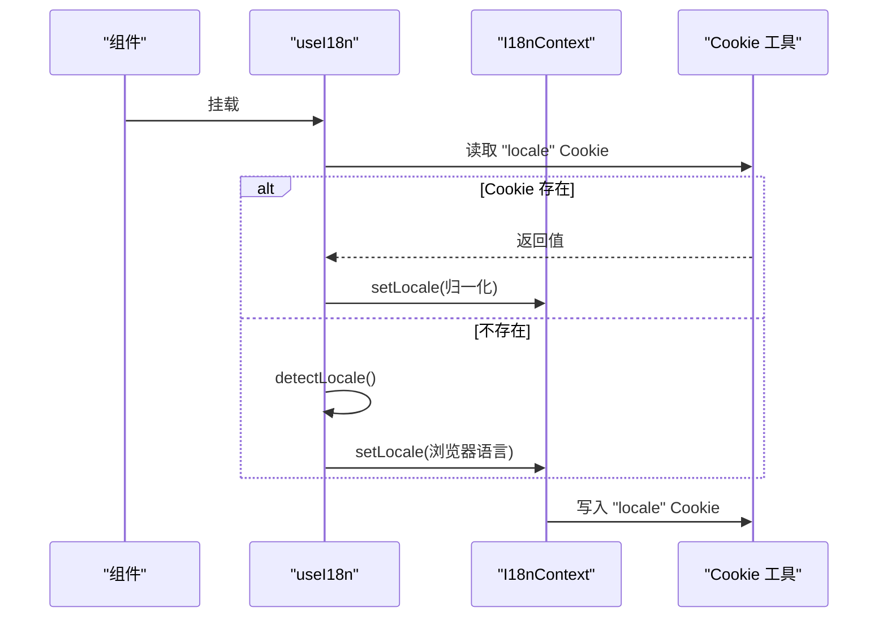
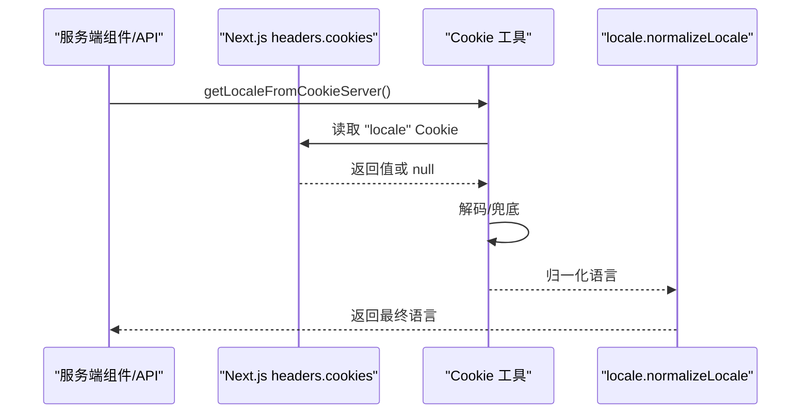
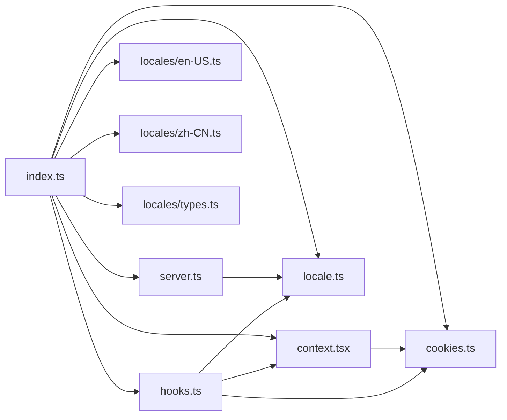

# 国际化支持

<cite>
**本文引用的文件**
- [frontend/src/core/i18n/index.ts](file://frontend/src/core/i18n/index.ts)
- [frontend/src/core/i18n/locale.ts](file://frontend/src/core/i18n/locale.ts)
- [frontend/src/core/i18n/context.tsx](file://frontend/src/core/i18n/context.tsx)
- [frontend/src/core/i18n/hooks.ts](file://frontend/src/core/i18n/hooks.ts)
- [frontend/src/core/i18n/server.ts](file://frontend/src/core/i18n/server.ts)
- [frontend/src/core/i18n/cookies.ts](file://frontend/src/core/i18n/cookies.ts)
- [frontend/src/core/i18n/locales/en-US.ts](file://frontend/src/core/i18n/locales/en-US.ts)
- [frontend/src/core/i18n/locales/zh-CN.ts](file://frontend/src/core/i18n/locales/zh-CN.ts)
- [frontend/src/core/i18n/locales/types.ts](file://frontend/src/core/i18n/locales/types.ts)
</cite>

## 目录
1. [简介](#简介)
2. [项目结构](#项目结构)
3. [核心组件](#核心组件)
4. [架构总览](#架构总览)
5. [详细组件分析](#详细组件分析)
6. [依赖关系分析](#依赖关系分析)
7. [性能考量](#性能考量)
8. [故障排查指南](#故障排查指南)
9. [结论](#结论)
10. [附录](#附录)

## 简介
本文件面向 DeerFlow 的国际化（i18n）支持系统，系统性阐述多语言架构设计、语言检测机制与本地化资源管理方式；详解 i18n Provider 配置、语言切换逻辑与文本翻译实现；覆盖语言包结构、按需加载策略与语言环境配置、区域设置及格式化规则；解释 SSR 语言检测、客户端回退机制与语言存储方案，并提供新增语言流程与翻译工作流优化建议。

## 项目结构
国际化模块位于前端核心层，采用“声明式 Provider + 客户端 hooks + 服务端检测 + Cookie 存储”的分层设计。关键文件组织如下：
- 核心导出与类型：index.ts
- 语言常量与检测：locale.ts
- React Provider 与上下文：context.tsx
- 客户端 hooks 与初始化：hooks.ts
- 服务端语言检测：server.ts
- Cookie 工具：cookies.ts
- 语言包：locales/en-US.ts、locales/zh-CN.ts、locales/types.ts

图表来源
- [frontend/src/core/i18n/index.ts:1-12](file://frontend/src/core/i18n/index.ts#L1-L12)
- [frontend/src/core/i18n/locale.ts:1-37](file://frontend/src/core/i18n/locale.ts#L1-L37)
- [frontend/src/core/i18n/context.tsx:1-42](file://frontend/src/core/i18n/context.tsx#L1-L42)
- [frontend/src/core/i18n/hooks.ts:1-56](file://frontend/src/core/i18n/hooks.ts#L1-L56)
- [frontend/src/core/i18n/server.ts:1-18](file://frontend/src/core/i18n/server.ts#L1-L18)
- [frontend/src/core/i18n/cookies.ts:1-53](file://frontend/src/core/i18n/cookies.ts#L1-L53)
- [frontend/src/core/i18n/locales/en-US.ts](file://frontend/src/core/i18n/locales/en-US.ts)
- [frontend/src/core/i18n/locales/zh-CN.ts](file://frontend/src/core/i18n/locales/zh-CN.ts)
- [frontend/src/core/i18n/locales/types.ts](file://frontend/src/core/i18n/locales/types.ts)

章节来源
- [frontend/src/core/i18n/index.ts:1-12](file://frontend/src/core/i18n/index.ts#L1-L12)
- [frontend/src/core/i18n/locale.ts:1-37](file://frontend/src/core/i18n/locale.ts#L1-L37)
- [frontend/src/core/i18n/context.tsx:1-42](file://frontend/src/core/i18n/context.tsx#L1-L42)
- [frontend/src/core/i18n/hooks.ts:1-56](file://frontend/src/core/i18n/hooks.ts#L1-L56)
- [frontend/src/core/i18n/server.ts:1-18](file://frontend/src/core/i18n/server.ts#L1-L18)
- [frontend/src/core/i18n/cookies.ts:1-53](file://frontend/src/core/i18n/cookies.ts#L1-L53)
- [frontend/src/core/i18n/locales/en-US.ts](file://frontend/src/core/i18n/locales/en-US.ts)
- [frontend/src/core/i18n/locales/zh-CN.ts](file://frontend/src/core/i18n/locales/zh-CN.ts)
- [frontend/src/core/i18n/locales/types.ts](file://frontend/src/core/i18n/locales/types.ts)

## 核心组件
- 导出与类型聚合：统一从 index.ts 导出语言包、类型与工具函数，便于上层按需引入。
- 语言常量与检测：定义受支持语言列表、默认语言、类型守卫、语言归一化与浏览器语言检测。
- Provider 与上下文：在应用根部注入 I18nProvider，提供当前语言与切换方法，并持久化到 Cookie。
- 客户端 hooks：负责首次挂载时的初始化（优先读取 Cookie，其次浏览器语言），并提供切换语言能力。
- 服务端检测：在服务端组件或 API 路由中读取 Cookie 并进行语言归一化。
- Cookie 工具：提供客户端与服务端的 Cookie 读写封装，确保跨端一致性。
- 语言包：以键值对形式组织翻译内容，类型由 locales/types.ts 统一约束。

章节来源
- [frontend/src/core/i18n/index.ts:1-12](file://frontend/src/core/i18n/index.ts#L1-L12)
- [frontend/src/core/i18n/locale.ts:1-37](file://frontend/src/core/i18n/locale.ts#L1-L37)
- [frontend/src/core/i18n/context.tsx:1-42](file://frontend/src/core/i18n/context.tsx#L1-L42)
- [frontend/src/core/i18n/hooks.ts:1-56](file://frontend/src/core/i18n/hooks.ts#L1-L56)
- [frontend/src/core/i18n/server.ts:1-18](file://frontend/src/core/i18n/server.ts#L1-L18)
- [frontend/src/core/i18n/cookies.ts:1-53](file://frontend/src/core/i18n/cookies.ts#L1-L53)
- [frontend/src/core/i18n/locales/types.ts](file://frontend/src/core/i18n/locales/types.ts)

## 架构总览
整体采用“客户端初始化 + 服务端检测 + Cookie 同步”的双端一致化策略，确保 SSR 与 CSR 场景下语言状态一致。

图表来源
- [frontend/src/core/i18n/context.tsx:14-33](file://frontend/src/core/i18n/context.tsx#L14-L33)
- [frontend/src/core/i18n/hooks.ts:23-48](file://frontend/src/core/i18n/hooks.ts#L23-L48)
- [frontend/src/core/i18n/cookies.ts:11-37](file://frontend/src/core/i18n/cookies.ts#L11-L37)
- [frontend/src/core/i18n/server.ts:5-17](file://frontend/src/core/i18n/server.ts#L5-L17)
- [frontend/src/core/i18n/locale.ts:25-36](file://frontend/src/core/i18n/locale.ts#L25-L36)

## 详细组件分析

### 语言检测与归一化
- 支持语言列表与默认语言：通过常量定义受支持语言集合与默认语言。
- 类型守卫：确保运行时语言值属于受支持集合。
- 归一化策略：空值返回默认语言；若非 zh 前缀则返回默认语言，否则固定为 zh-CN。
- 浏览器检测：在浏览器环境下优先使用 navigator.language/userLanguage，兜底返回默认语言。

图表来源
- [frontend/src/core/i18n/locale.ts:9-23](file://frontend/src/core/i18n/locale.ts#L9-L23)

章节来源
- [frontend/src/core/i18n/locale.ts:1-37](file://frontend/src/core/i18n/locale.ts#L1-L37)

### Provider 与上下文
- 上下文接口：暴露当前语言与设置语言的方法。
- Provider 行为：维护本地状态，更新后同步写入 Cookie；错误处理：在缺少上下文时抛出明确异常。
- Cookie 同步：设置一年有效期与 SameSite=Lax，保证跨页面与跨路由可用。

图表来源
- [frontend/src/core/i18n/context.tsx:7-33](file://frontend/src/core/i18n/context.tsx#L7-L33)

章节来源
- [frontend/src/core/i18n/context.tsx:1-42](file://frontend/src/core/i18n/context.tsx#L1-L42)

### 客户端 hooks：初始化与切换
- 翻译表：在 hooks 中集中维护语言到翻译对象的映射。
- 初始化流程：优先读取 Cookie，若存在则归一化并写回；否则检测浏览器语言并写回。
- 切换流程：调用 Provider 的 setLocale 并同步写入 Cookie。

图表来源
- [frontend/src/core/i18n/hooks.ts:23-48](file://frontend/src/core/i18n/hooks.ts#L23-L48)
- [frontend/src/core/i18n/context.tsx:23-26](file://frontend/src/core/i18n/context.tsx#L23-L26)
- [frontend/src/core/i18n/cookies.ts:11-37](file://frontend/src/core/i18n/cookies.ts#L11-L37)
- [frontend/src/core/i18n/locale.ts:25-36](file://frontend/src/core/i18n/locale.ts#L25-L36)

章节来源
- [frontend/src/core/i18n/hooks.ts:1-56](file://frontend/src/core/i18n/hooks.ts#L1-L56)

### 服务端检测与回退
- 服务端读取：通过 Next.js headers.cookies 获取 Cookie 并解码，随后进行语言归一化。
- 兜底策略：当无法获取或解析失败时，返回默认语言，避免渲染中断。

图表来源
- [frontend/src/core/i18n/server.ts:5-17](file://frontend/src/core/i18n/server.ts#L5-L17)
- [frontend/src/core/i18n/cookies.ts:43-52](file://frontend/src/core/i18n/cookies.ts#L43-L52)
- [frontend/src/core/i18n/locale.ts:9-23](file://frontend/src/core/i18n/locale.ts#L9-L23)

章节来源
- [frontend/src/core/i18n/server.ts:1-18](file://frontend/src/core/i18n/server.ts#L1-L18)
- [frontend/src/core/i18n/cookies.ts:43-52](file://frontend/src/core/i18n/cookies.ts#L43-L52)

### Cookie 存储与跨端一致性
- 客户端：读取 document.cookie，写入带过期时间与 SameSite 属性的 Cookie。
- 服务端：通过 next/headers.cookies 读取，兼容中间件场景下的降级处理。
- 编解码：写入前编码，读取后尝试解码，失败时保留原始值以增强健壮性。

章节来源
- [frontend/src/core/i18n/cookies.ts:1-53](file://frontend/src/core/i18n/cookies.ts#L1-L53)

### 语言包结构与类型约束
- 语言包：每个语言对应一个模块，导出完整的翻译键值对象。
- 类型约束：locales/types.ts 统一定义翻译键的类型，确保编译期校验与 IDE 提示。
- 扩展性：新增语言只需新增对应文件并加入 SUPPORTED_LOCALES 即可。

章节来源
- [frontend/src/core/i18n/locales/en-US.ts](file://frontend/src/core/i18n/locales/en-US.ts)
- [frontend/src/core/i18n/locales/zh-CN.ts](file://frontend/src/core/i18n/locales/zh-CN.ts)
- [frontend/src/core/i18n/locales/types.ts](file://frontend/src/core/i18n/locales/types.ts)

### 动态导入与按需加载策略
- 当前实现：语言包在 hooks 中集中导入并缓存于内存映射，减少重复加载。
- 按需加载建议：可将语言包改为动态 import，结合路由或用户切换触发懒加载，降低首屏体积；同时保持现有内存缓存以避免重复请求。
- 代码分割：按语言拆分 chunk，结合路由懒加载进一步优化加载体验。

章节来源
- [frontend/src/core/i18n/hooks.ts:7-8](file://frontend/src/core/i18n/hooks.ts#L7-L8)
- [frontend/src/core/i18n/index.ts:1-3](file://frontend/src/core/i18n/index.ts#L1-L3)

## 依赖关系分析
- 模块内聚：locale.ts 提供纯函数与常量，context.tsx 与 hooks.ts 依赖其进行语言判定与归一化。
- 外部依赖：Next.js headers.cookies 用于服务端读取 Cookie；React Context 用于状态共享。
- 可能的循环依赖：当前文件间无直接循环导入，但 hooks.ts 同时依赖 locale.ts 与 cookies.ts，应避免在 locale.ts 中反向依赖 hooks 或 cookies。

图表来源
- [frontend/src/core/i18n/hooks.ts:1-16](file://frontend/src/core/i18n/hooks.ts#L1-L16)
- [frontend/src/core/i18n/context.tsx:1-42](file://frontend/src/core/i18n/context.tsx#L1-L42)
- [frontend/src/core/i18n/server.ts:1-18](file://frontend/src/core/i18n/server.ts#L1-L18)
- [frontend/src/core/i18n/locale.ts:1-37](file://frontend/src/core/i18n/locale.ts#L1-L37)
- [frontend/src/core/i18n/cookies.ts:1-53](file://frontend/src/core/i18n/cookies.ts#L1-L53)
- [frontend/src/core/i18n/index.ts:1-12](file://frontend/src/core/i18n/index.ts#L1-L12)
- [frontend/src/core/i18n/locales/en-US.ts](file://frontend/src/core/i18n/locales/en-US.ts)
- [frontend/src/core/i18n/locales/zh-CN.ts](file://frontend/src/core/i18n/locales/zh-CN.ts)
- [frontend/src/core/i18n/locales/types.ts](file://frontend/src/core/i18n/locales/types.ts)

章节来源
- [frontend/src/core/i18n/index.ts:1-12](file://frontend/src/core/i18n/index.ts#L1-L12)
- [frontend/src/core/i18n/locale.ts:1-37](file://frontend/src/core/i18n/locale.ts#L1-L37)
- [frontend/src/core/i18n/context.tsx:1-42](file://frontend/src/core/i18n/context.tsx#L1-L42)
- [frontend/src/core/i18n/hooks.ts:1-56](file://frontend/src/core/i18n/hooks.ts#L1-L56)
- [frontend/src/core/i18n/server.ts:1-18](file://frontend/src/core/i18n/server.ts#L1-L18)
- [frontend/src/core/i18n/cookies.ts:1-53](file://frontend/src/core/i18n/cookies.ts#L1-L53)
- [frontend/src/core/i18n/locales/en-US.ts](file://frontend/src/core/i18n/locales/en-US.ts)
- [frontend/src/core/i18n/locales/zh-CN.ts](file://frontend/src/core/i18n/locales/zh-CN.ts)
- [frontend/src/core/i18n/locales/types.ts](file://frontend/src/core/i18n/locales/types.ts)

## 性能考量
- 首屏优化：将语言包静态导入并缓存，避免重复加载；如需按需加载，建议结合路由懒加载与 Webpack 分包。
- Cookie 访问：客户端读写 Cookie 为 O(n) 遍历，但数量有限；可在 hooks 中缓存结果，减少重复解析。
- SSR 一致性：服务端检测与客户端初始化均走归一化逻辑，避免不一致导致的重渲染。
- 体积控制：按语言拆分包，仅加载当前语言或常用语言，减少主包体积。

## 故障排查指南
- 语言未生效
  - 检查 Cookie 是否正确写入与解码；确认 SameSite/Lax 设置与路径匹配。
  - 确认服务端是否正确读取 Cookie 并进行归一化。
- 语言切换无效
  - 确认 Provider 的 setLocale 是否被调用且 Cookie 同步成功。
  - 检查 normalizeLocale 是否将输入语言归一化为受支持语言。
- SSR 与 CSR 不一致
  - 确保服务端检测与客户端初始化使用相同归一化策略。
  - 在服务端组件中优先使用服务端检测结果，避免客户端覆盖。

章节来源
- [frontend/src/core/i18n/cookies.ts:11-37](file://frontend/src/core/i18n/cookies.ts#L11-L37)
- [frontend/src/core/i18n/server.ts:5-17](file://frontend/src/core/i18n/server.ts#L5-L17)
- [frontend/src/core/i18n/locale.ts:9-23](file://frontend/src/core/i18n/locale.ts#L9-L23)
- [frontend/src/core/i18n/context.tsx:23-26](file://frontend/src/core/i18n/context.tsx#L23-L26)

## 结论
DeerFlow 的国际化系统以简洁的 Provider + hooks + Cookie 同步为核心，结合服务端检测与语言归一化，实现了 SSR 与 CSR 的语言一致性。当前语言包采用静态导入与内存缓存，具备良好的性能与可维护性；未来可通过动态导入与按需加载进一步优化首屏体积与用户体验。

## 附录

### 新增语言流程
- 创建语言包：在 locales 下新增对应语言文件，导出完整翻译对象，并在 types.ts 中完善类型。
- 更新支持列表：在 locale.ts 中将新语言加入 SUPPORTED_LOCALES。
- 导出入口：在 index.ts 中导出新语言包与类型。
- 验证初始化：在 hooks.ts 中确认新语言包被正确导入并纳入映射。
- SSR 检测：确认服务端检测逻辑可正确处理新语言（如需特殊归一化规则请扩展）。

章节来源
- [frontend/src/core/i18n/locale.ts:1-3](file://frontend/src/core/i18n/locale.ts#L1-L3)
- [frontend/src/core/i18n/index.ts:1-3](file://frontend/src/core/i18n/index.ts#L1-L3)
- [frontend/src/core/i18n/locales/types.ts](file://frontend/src/core/i18n/locales/types.ts)
- [frontend/src/core/i18n/hooks.ts:18-21](file://frontend/src/core/i18n/hooks.ts#L18-L21)

### 翻译工作流优化建议
- 键名规范化：统一使用层级式键名（如 ui.button.submit），便于提取与管理。
- 提取与比对：定期导出缺失键清单，对比各语言包差异，确保覆盖率。
- 自动化校验：在 CI 中增加类型检查与缺失键扫描，防止遗漏。
- 文档化约定：制定翻译键命名规范与注释模板，提升协作效率。