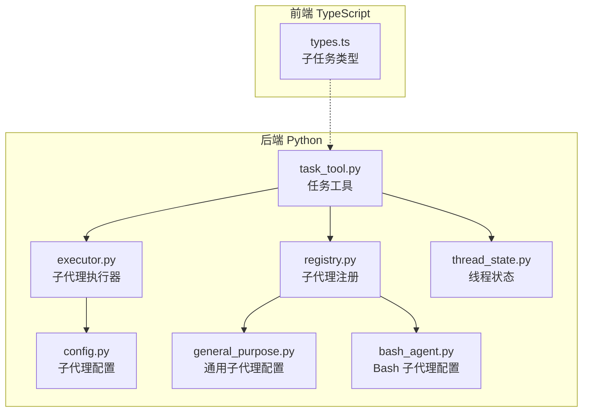
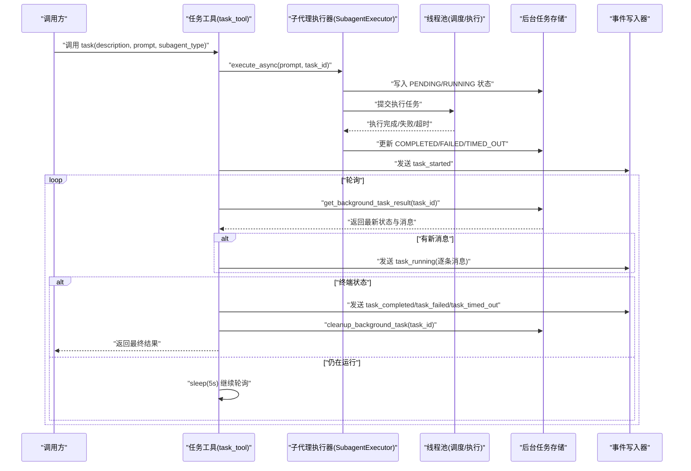
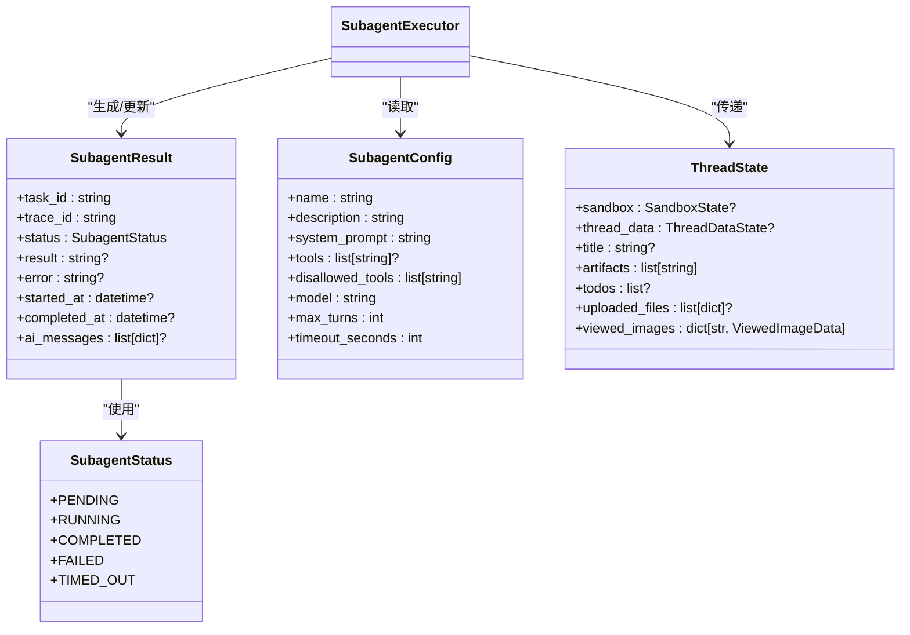
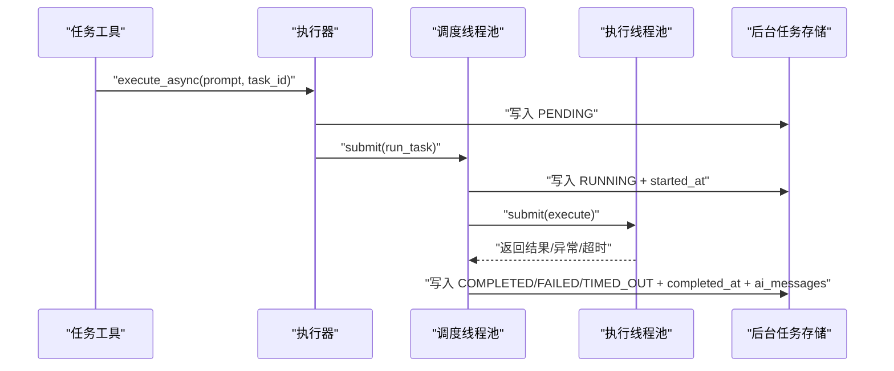
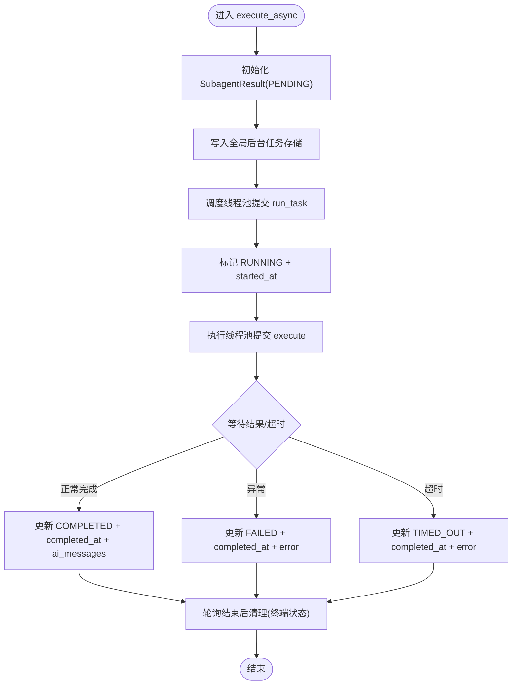
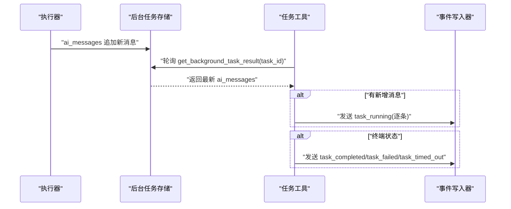
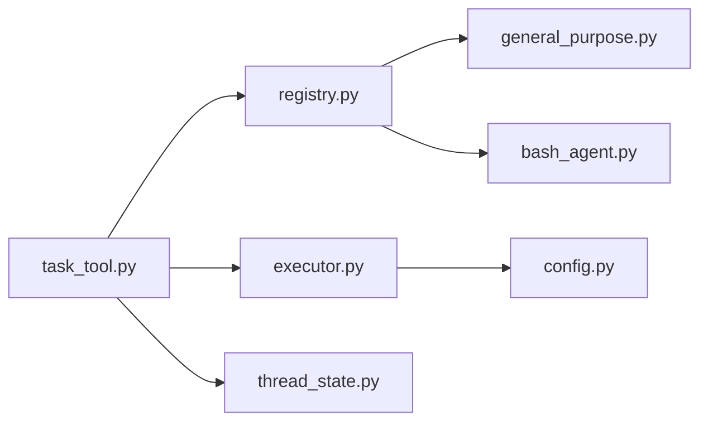

# 任务状态管理

<cite>
**本文引用的文件**
- [task_tool.py](file://backend/packages/harness/deerflow/tools/builtins/task_tool.py)
- [executor.py](file://backend/packages/harness/deerflow/subagents/executor.py)
- [config.py](file://backend/packages/harness/deerflow/subagents/config.py)
- [registry.py](file://backend/packages/harness/deerflow/subagents/registry.py)
- [general_purpose.py](file://backend/packages/harness/deerflow/subagents/builtins/general_purpose.py)
- [bash_agent.py](file://backend/packages/harness/deerflow/subagents/builtins/bash_agent.py)
- [thread_state.py](file://backend/packages/harness/deerflow/agents/thread_state.py)
- [types.ts](file://frontend/src/core/tasks/types.ts)
- [task_tool_improvements.md](file://backend/docs/task_tool_improvements.md)
- [test_task_tool_core_logic.py](file://backend/tests/test_task_tool_core_logic.py)
- [test_subagent_executor.py](file://backend/tests/test_subagent_executor.py)
</cite>

## 目录
1. [简介](#简介)
2. [项目结构](#项目结构)
3. [核心组件](#核心组件)
4. [架构总览](#架构总览)
5. [详细组件分析](#详细组件分析)
6. [依赖分析](#依赖分析)
7. [性能考量](#性能考量)
8. [故障排查指南](#故障排查指南)
9. [结论](#结论)
10. [附录](#附录)

## 简介
本技术文档聚焦 DeerFlow 的任务状态管理系统，系统性阐述任务数据模型、执行状态机、子任务管理机制与状态传播流程。文档覆盖任务从创建、执行、暂停（通过超时与取消策略）、取消与完成的全生命周期管理；解释后台任务队列状态、实时进度跟踪与结果状态回传；并给出持久化存储、状态恢复与并发控制策略建议，以及任务状态与消息状态的集成与传播机制。

## 项目结构
围绕任务状态管理的关键代码分布在后端 Python 包与前端 TypeScript 类型定义中：
- 后端 Python
  - 工具层：任务工具负责启动子任务、轮询状态、事件推送与清理
  - 执行器层：子代理执行引擎负责异步执行、状态更新、超时处理与并发控制
  - 配置层：子代理配置、内置子代理注册与超时覆盖
  - 状态层：线程状态与上下文传递
- 前端 TypeScript
  - 子任务类型定义，用于前端渲染与交互

**图表来源**
- [task_tool.py:1-196](file://backend/packages/harness/deerflow/tools/builtins/task_tool.py#L1-L196)
- [executor.py:1-517](file://backend/packages/harness/deerflow/subagents/executor.py#L1-L517)
- [config.py:1-29](file://backend/packages/harness/deerflow/subagents/config.py#L1-L29)
- [registry.py:1-53](file://backend/packages/harness/deerflow/subagents/registry.py#L1-L53)
- [general_purpose.py:1-48](file://backend/packages/harness/deerflow/subagents/builtins/general_purpose.py#L1-L48)
- [bash_agent.py:1-47](file://backend/packages/harness/deerflow/subagents/builtins/bash_agent.py#L1-L47)
- [thread_state.py:1-56](file://backend/packages/harness/deerflow/agents/thread_state.py#L1-L56)
- [types.ts:1-12](file://frontend/src/core/tasks/types.ts#L1-L12)

**章节来源**
- [task_tool.py:1-196](file://backend/packages/harness/deerflow/tools/builtins/task_tool.py#L1-L196)
- [executor.py:1-517](file://backend/packages/harness/deerflow/subagents/executor.py#L1-L517)
- [config.py:1-29](file://backend/packages/harness/deerflow/subagents/config.py#L1-L29)
- [registry.py:1-53](file://backend/packages/harness/deerflow/subagents/registry.py#L1-L53)
- [general_purpose.py:1-48](file://backend/packages/harness/deerflow/subagents/builtins/general_purpose.py#L1-L48)
- [bash_agent.py:1-47](file://backend/packages/harness/deerflow/subagents/builtins/bash_agent.py#L1-L47)
- [thread_state.py:1-56](file://backend/packages/harness/deerflow/agents/thread_state.py#L1-L56)
- [types.ts:1-12](file://frontend/src/core/tasks/types.ts#L1-L12)

## 核心组件
- 任务工具（task_tool）
  - 负责解析子代理配置、构建执行器、启动后台执行、轮询状态、推送事件流、返回最终结果并清理
- 子代理执行器（SubagentExecutor）
  - 封装子代理执行、状态更新、超时控制、并发池调度与全局后台任务存储
- 子代理配置（SubagentConfig）
  - 定义系统提示、工具白/黑名单、模型继承、最大回合数与执行超时
- 子代理注册（registry）
  - 提供内置子代理配置、应用配置覆盖（如超时）与列表查询
- 线程状态（ThreadState）
  - 传递沙箱、线程数据与上下文，支持多轮对话与中间件状态合并
- 前端子任务类型（types.ts）
  - 定义子任务的状态、描述、提示词、结果与错误字段，支撑前端展示

**章节来源**
- [task_tool.py:21-196](file://backend/packages/harness/deerflow/tools/builtins/task_tool.py#L21-L196)
- [executor.py:26-517](file://backend/packages/harness/deerflow/subagents/executor.py#L26-L517)
- [config.py:6-29](file://backend/packages/harness/deerflow/subagents/config.py#L6-L29)
- [registry.py:12-53](file://backend/packages/harness/deerflow/subagents/registry.py#L12-L53)
- [thread_state.py:48-56](file://backend/packages/harness/deerflow/agents/thread_state.py#L48-L56)
- [types.ts:3-12](file://frontend/src/core/tasks/types.ts#L3-L12)

## 架构总览
任务状态管理采用“工具层-执行器层-配置层-状态层”的分层设计，并通过事件流在后端与前端之间进行状态传播。

**图表来源**
- [task_tool.py:115-195](file://backend/packages/harness/deerflow/tools/builtins/task_tool.py#L115-L195)
- [executor.py:391-453](file://backend/packages/harness/deerflow/subagents/executor.py#L391-L453)
- [executor.py:459-517](file://backend/packages/harness/deerflow/subagents/executor.py#L459-L517)

**章节来源**
- [task_tool.py:115-195](file://backend/packages/harness/deerflow/tools/builtins/task_tool.py#L115-L195)
- [executor.py:391-453](file://backend/packages/harness/deerflow/subagents/executor.py#L391-L453)
- [executor.py:459-517](file://backend/packages/harness/deerflow/subagents/executor.py#L459-L517)

## 详细组件分析

### 数据模型与状态机
- 子代理状态枚举（SubagentStatus）
  - 状态：PENDING、RUNNING、COMPLETED、FAILED、TIMED_OUT
- 子代理结果（SubagentResult）
  - 字段：task_id、trace_id、status、result、error、started_at、completed_at、ai_messages
- 子代理配置（SubagentConfig）
  - 字段：name、description、system_prompt、tools、disallowed_tools、model、max_turns、timeout_seconds
- 线程状态（ThreadState）
  - 字段：sandbox、thread_data、title、artifacts、todos、uploaded_files、viewed_images
- 前端子任务类型（Subtask）
  - 字段：id、status、subagent_type、description、latestMessage、prompt、result、error

**图表来源**
- [executor.py:26-64](file://backend/packages/harness/deerflow/subagents/executor.py#L26-L64)
- [config.py:6-29](file://backend/packages/harness/deerflow/subagents/config.py#L6-L29)
- [thread_state.py:48-56](file://backend/packages/harness/deerflow/agents/thread_state.py#L48-L56)

**章节来源**
- [executor.py:26-64](file://backend/packages/harness/deerflow/subagents/executor.py#L26-L64)
- [config.py:6-29](file://backend/packages/harness/deerflow/subagents/config.py#L6-L29)
- [thread_state.py:48-56](file://backend/packages/harness/deerflow/agents/thread_state.py#L48-L56)
- [types.ts:3-12](file://frontend/src/core/tasks/types.ts#L3-L12)

### 任务创建与执行
- 任务工具启动流程
  - 解析子代理配置，应用技能提示与最大回合数覆盖
  - 构建执行器（过滤工具、继承父模型、传递线程上下文）
  - 调用 execute_async 启动后台执行，使用 tool_call_id 作为 task_id
  - 发送 task_started 事件
- 执行器执行流程
  - 初始化 PENDING 状态并写入全局后台任务存储
  - 调度线程池将任务标记为 RUNNING 并设置开始时间
  - 执行线程池提交实际执行，等待结果或超时
  - 更新状态为 COMPLETED/FAILED/TIMED_OUT，并记录完成时间与 AI 消息

**图表来源**
- [task_tool.py:104-118](file://backend/packages/harness/deerflow/tools/builtins/task_tool.py#L104-L118)
- [executor.py:391-453](file://backend/packages/harness/deerflow/subagents/executor.py#L391-L453)
- [executor.py:418-450](file://backend/packages/harness/deerflow/subagents/executor.py#L418-L450)

**章节来源**
- [task_tool.py:104-118](file://backend/packages/harness/deerflow/tools/builtins/task_tool.py#L104-L118)
- [executor.py:391-453](file://backend/packages/harness/deerflow/subagents/executor.py#L391-L453)
- [executor.py:418-450](file://backend/packages/harness/deerflow/subagents/executor.py#L418-L450)

### 任务队列状态与并发控制
- 全局后台任务存储
  - 使用字典保存所有后台任务，配合线程锁保证并发安全
- 两套线程池
  - 调度线程池：负责状态切换与任务入口
  - 执行线程池：负责实际执行与超时控制
- 并发上限
  - MAX_CONCURRENT_SUBAGENTS 控制最大并发数
- 清理策略
  - 仅在终端状态或已设置完成时间时清理，避免竞态

**图表来源**
- [executor.py:414-453](file://backend/packages/harness/deerflow/subagents/executor.py#L414-L453)
- [executor.py:482-517](file://backend/packages/harness/deerflow/subagents/executor.py#L482-L517)

**章节来源**
- [executor.py:414-453](file://backend/packages/harness/deerflow/subagents/executor.py#L414-L453)
- [executor.py:482-517](file://backend/packages/harness/deerflow/subagents/executor.py#L482-L517)

### 任务进度跟踪与消息传播
- 实时消息捕获
  - 在异步执行过程中，逐条提取 AI 消息并追加到 ai_messages 列表
- 事件推送
  - 任务工具在检测到新消息时，向事件写入器发送 task_running 事件
  - 终止状态分别发送 task_completed、task_failed、task_timed_out
- 前端类型映射
  - 前端 Subtask 的 status 与后端 SubagentStatus 对应，便于 UI 展示

**图表来源**
- [executor.py:244-267](file://backend/packages/harness/deerflow/subagents/executor.py#L244-L267)
- [task_tool.py:146-162](file://backend/packages/harness/deerflow/tools/builtins/task_tool.py#L146-L162)
- [task_tool.py:165-179](file://backend/packages/harness/deerflow/tools/builtins/task_tool.py#L165-L179)

**章节来源**
- [executor.py:244-267](file://backend/packages/harness/deerflow/subagents/executor.py#L244-L267)
- [task_tool.py:146-179](file://backend/packages/harness/deerflow/tools/builtins/task_tool.py#L146-L179)
- [types.ts:3-12](file://frontend/src/core/tasks/types.ts#L3-L12)

### 任务状态的持久化存储、状态恢复与并发控制策略
- 当前实现
  - 后台任务存储为内存字典，键为 task_id，值为 SubagentResult
  - 通过线程锁保护并发访问
- 推荐持久化方案
  - 使用数据库或缓存（如 Redis）持久化 SubagentResult，键空间可按 trace_id 或 thread_id 分区
  - 写入策略：先写入内存，再异步持久化；读取优先本地，缺失时回源数据库
  - 恢复策略：重启后扫描未完成任务并恢复状态；对 TIMED_OUT 任务可选择重试
- 并发控制
  - 保持现有线程池分离（调度/执行），限制最大并发数
  - 对外部请求侧增加速率限制与排队，避免过载

[本节为通用实践建议，不直接分析具体文件，故无“章节来源”]

### 任务状态与消息状态的集成与状态传播机制
- 事件驱动传播
  - 任务工具通过事件写入器将任务状态与消息推送到流式接口，前端监听并渲染
- 状态一致性
  - 通过 task_id 关联同一任务的多次事件；completed_at 作为安全网确保即使状态仍为 RUNNING 也能被清理
- 上下文传递
  - 线程状态与沙箱信息随执行器传递，保证子代理在隔离环境中工作

**章节来源**
- [task_tool.py:128-195](file://backend/packages/harness/deerflow/tools/builtins/task_tool.py#L128-L195)
- [executor.py:482-517](file://backend/packages/harness/deerflow/subagents/executor.py#L482-L517)
- [thread_state.py:48-56](file://backend/packages/harness/deerflow/agents/thread_state.py#L48-L56)

## 依赖分析
- 任务工具依赖
  - 子代理配置解析、执行器、后台任务存储与事件写入器
- 执行器依赖
  - 子代理配置、线程池、异步执行链路与全局存储
- 注册与配置
  - 内置子代理配置与配置覆盖（如超时）

**图表来源**
- [task_tool.py:60-118](file://backend/packages/harness/deerflow/tools/builtins/task_tool.py#L60-L118)
- [executor.py:126-162](file://backend/packages/harness/deerflow/subagents/executor.py#L126-L162)
- [registry.py:21-34](file://backend/packages/harness/deerflow/subagents/registry.py#L21-L34)
- [general_purpose.py:5-47](file://backend/packages/harness/deerflow/subagents/builtins/general_purpose.py#L5-L47)
- [bash_agent.py:5-46](file://backend/packages/harness/deerflow/subagents/builtins/bash_agent.py#L5-L46)

**章节来源**
- [task_tool.py:60-118](file://backend/packages/harness/deerflow/tools/builtins/task_tool.py#L60-L118)
- [executor.py:126-162](file://backend/packages/harness/deerflow/subagents/executor.py#L126-L162)
- [registry.py:21-34](file://backend/packages/harness/deerflow/subagents/registry.py#L21-L34)
- [general_purpose.py:5-47](file://backend/packages/harness/deerflow/subagents/builtins/general_purpose.py#L5-L47)
- [bash_agent.py:5-46](file://backend/packages/harness/deerflow/subagents/builtins/bash_agent.py#L5-L46)

## 性能考量
- 轮询间隔与超时
  - 后端轮询间隔为 5 秒，轮询超时为执行超时 + 60 秒，防止无限等待
- 线程池分离
  - 调度与执行线程池分离，避免阻塞；执行池更大以提升吞吐
- 事件流优化
  - 仅在出现新消息时推送 task_running，减少冗余事件
- 资源回收
  - 终端状态清理后台任务，避免内存泄漏

**章节来源**
- [task_tool.py:120-195](file://backend/packages/harness/deerflow/tools/builtins/task_tool.py#L120-L195)
- [executor.py:70-75](file://backend/packages/harness/deerflow/subagents/executor.py#L70-L75)
- [task_tool_improvements.md:118-175](file://backend/docs/task_tool_improvements.md#L118-L175)

## 故障排查指南
- 常见问题与定位
  - 任务消失：后台任务存储中找不到 task_id，返回失败并清理
  - 执行超时：线程池超时触发 TIMED_OUT，同时尝试取消未来任务
  - 失败：异常被捕获并标记 FAILED，记录错误信息
  - 轮询超时：安全网超时，记录日志并返回提示
- 测试验证
  - 单测覆盖未知子代理类型、事件发射顺序、失败与超时分支
  - 执行器单测覆盖同步/异步路径、错误处理与并发场景

**章节来源**
- [task_tool.py:132-195](file://backend/packages/harness/deerflow/tools/builtins/task_tool.py#L132-L195)
- [executor.py:437-450](file://backend/packages/harness/deerflow/subagents/executor.py#L437-L450)
- [test_task_tool_core_logic.py:64-200](file://backend/tests/test_task_tool_core_logic.py#L64-L200)
- [test_subagent_executor.py:727-773](file://backend/tests/test_subagent_executor.py#L727-L773)

## 结论
DeerFlow 的任务状态管理系统通过清晰的分层设计与事件驱动机制，实现了从任务创建、执行、轮询到完成/失败/超时的完整闭环。执行器层提供可靠的并发与超时控制，工具层负责状态传播与用户体验，前端类型定义确保一致的展示语义。建议在生产环境中引入持久化存储与状态恢复策略，进一步增强系统的可靠性与可观测性。

## 附录
- 内置子代理
  - 通用子代理：适用于复杂多步骤任务
  - Bash 子代理：专注于命令执行
- 配置要点
  - 超时秒数可在应用配置中覆盖
  - 工具白/黑名单与模型继承策略由配置决定

**章节来源**
- [general_purpose.py:5-47](file://backend/packages/harness/deerflow/subagents/builtins/general_purpose.py#L5-L47)
- [bash_agent.py:5-46](file://backend/packages/harness/deerflow/subagents/builtins/bash_agent.py#L5-L46)
- [registry.py:25-34](file://backend/packages/harness/deerflow/subagents/registry.py#L25-L34)
- [config.py:25-28](file://backend/packages/harness/deerflow/subagents/config.py#L25-L28)