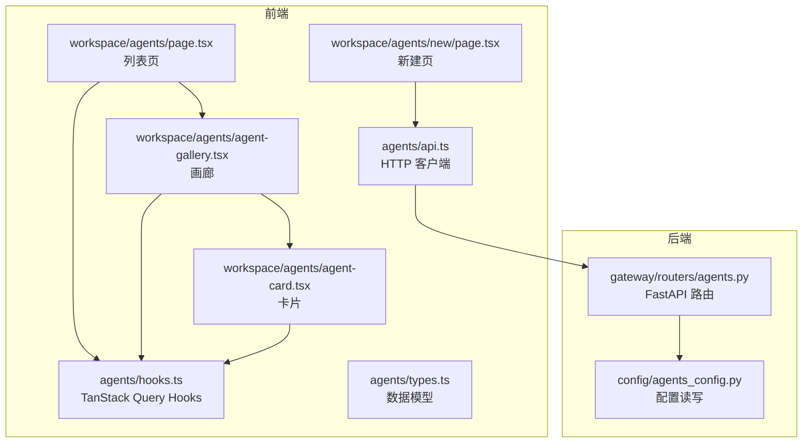
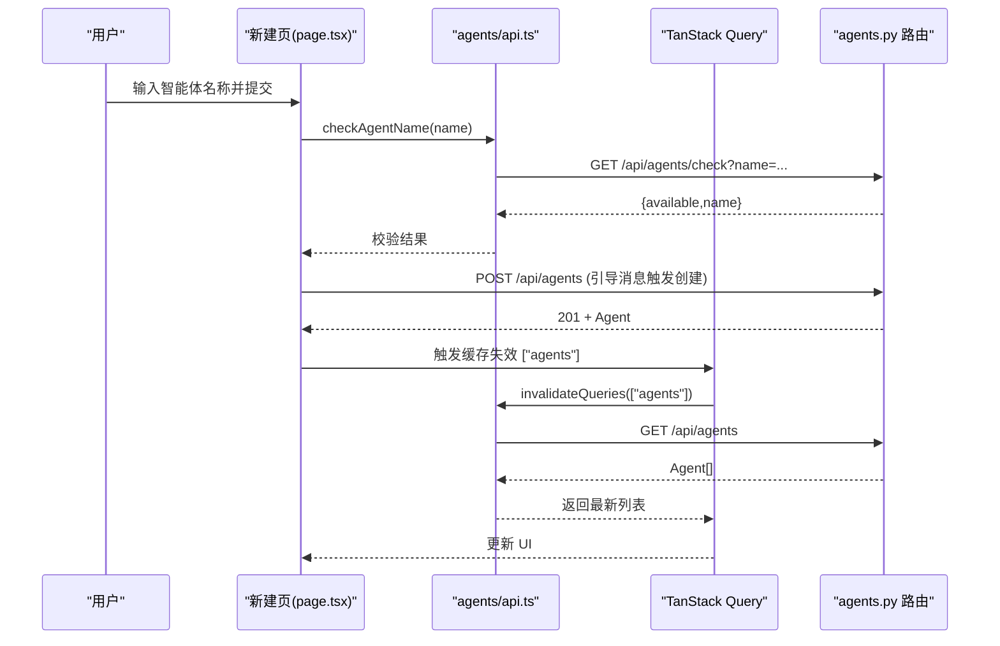
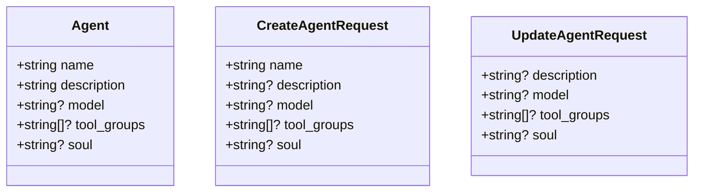
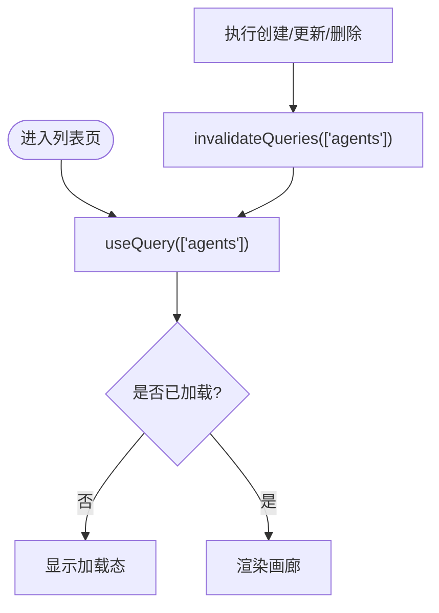
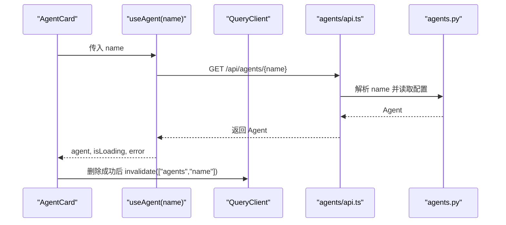
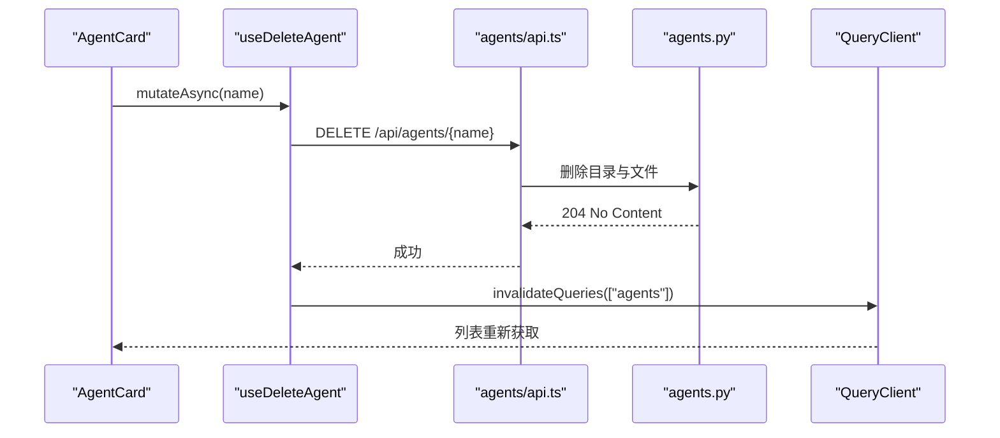
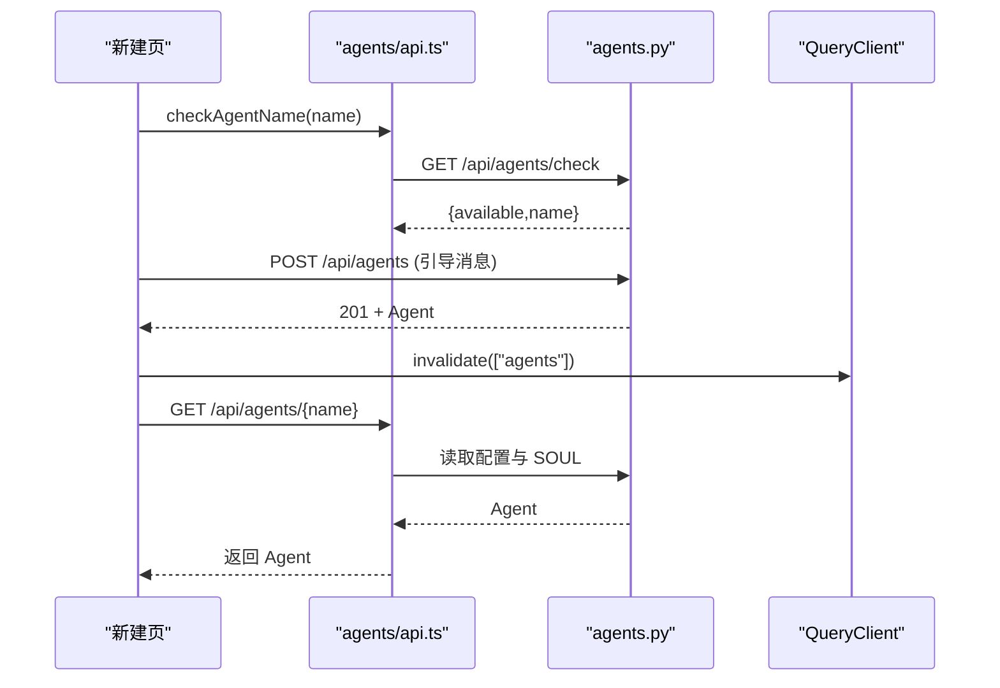
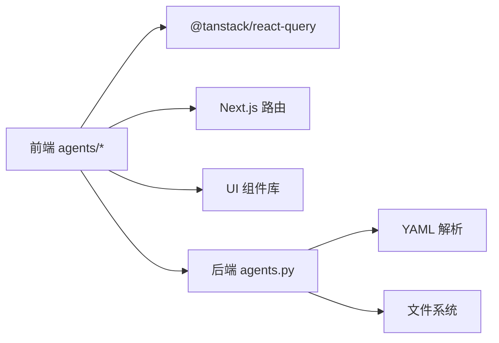

# 智能体状态管理

<cite>
**本文引用的文件**
- [frontend/src/core/agents/index.ts](file://frontend/src/core/agents/index.ts)
- [frontend/src/core/agents/types.ts](file://frontend/src/core/agents/types.ts)
- [frontend/src/core/agents/api.ts](file://frontend/src/core/agents/api.ts)
- [frontend/src/core/agents/hooks.ts](file://frontend/src/core/agents/hooks.ts)
- [frontend/src/app/workspace/agents/page.tsx](file://frontend/src/app/workspace/agents/page.tsx)
- [frontend/src/components/workspace/agents/agent-gallery.tsx](file://frontend/src/components/workspace/agents/agent-gallery.tsx)
- [frontend/src/components/workspace/agents/agent-card.tsx](file://frontend/src/components/workspace/agents/agent-card.tsx)
- [frontend/src/app/workspace/agents/new/page.tsx](file://frontend/src/app/workspace/agents/new/page.tsx)
- [backend/app/gateway/routers/agents.py](file://backend/app/gateway/routers/agents.py)
- [backend/packages/harness/deerflow/config/agents_config.py](file://backend/packages/harness/deerflow/config/agents_config.py)
</cite>

## 目录
1. [简介](#简介)
2. [项目结构](#项目结构)
3. [核心组件](#核心组件)
4. [架构总览](#架构总览)
5. [详细组件分析](#详细组件分析)
6. [依赖分析](#依赖分析)
7. [性能考虑](#性能考虑)
8. [故障排查指南](#故障排查指南)
9. [结论](#结论)
10. [附录](#附录)

## 简介
本文件系统性阐述 DeerFlow 智能体状态管理的设计与实现，覆盖以下方面：
- 智能体数据模型与字段定义
- 列表状态、详情状态与配置状态的管理方式
- CRUD 操作流程与错误处理
- 实时更新与状态缓存策略（基于 TanStack React Query）
- 订阅模式与路由状态同步
- 性能优化建议与最佳实践

## 项目结构
前端采用“核心模块 + 页面组件 + UI 组件”的分层组织：
- 核心模块：在 core/agents 下封装类型、API 与 Hooks，统一对外暴露
- 页面组件：负责路由与页面级交互
- UI 组件：复用卡片、对话等通用元素

后端通过 FastAPI 路由提供智能体的完整 CRUD 接口，并以 YAML 配置与 SOUL.md 文件持久化智能体配置。

图表来源
- [frontend/src/core/agents/api.ts:1-68](file://frontend/src/core/agents/api.ts#L1-L68)
- [frontend/src/core/agents/hooks.ts:1-65](file://frontend/src/core/agents/hooks.ts#L1-L65)
- [frontend/src/core/agents/types.ts:1-23](file://frontend/src/core/agents/types.ts#L1-L23)
- [frontend/src/app/workspace/agents/page.tsx:1-6](file://frontend/src/app/workspace/agents/page.tsx#L1-L6)
- [frontend/src/components/workspace/agents/agent-gallery.tsx:1-70](file://frontend/src/components/workspace/agents/agent-gallery.tsx#L1-L70)
- [frontend/src/components/workspace/agents/agent-card.tsx:1-141](file://frontend/src/components/workspace/agents/agent-card.tsx#L1-L141)
- [frontend/src/app/workspace/agents/new/page.tsx:1-253](file://frontend/src/app/workspace/agents/new/page.tsx#L1-L253)
- [backend/app/gateway/routers/agents.py:1-384](file://backend/app/gateway/routers/agents.py#L1-L384)
- [backend/packages/harness/deerflow/config/agents_config.py:1-121](file://backend/packages/harness/deerflow/config/agents_config.py#L1-L121)

章节来源
- [frontend/src/core/agents/index.ts:1-4](file://frontend/src/core/agents/index.ts#L1-L4)
- [frontend/src/core/agents/types.ts:1-23](file://frontend/src/core/agents/types.ts#L1-L23)
- [frontend/src/core/agents/api.ts:1-68](file://frontend/src/core/agents/api.ts#L1-L68)
- [frontend/src/core/agents/hooks.ts:1-65](file://frontend/src/core/agents/hooks.ts#L1-L65)
- [frontend/src/app/workspace/agents/page.tsx:1-6](file://frontend/src/app/workspace/agents/page.tsx#L1-L6)
- [frontend/src/components/workspace/agents/agent-gallery.tsx:1-70](file://frontend/src/components/workspace/agents/agent-gallery.tsx#L1-L70)
- [frontend/src/components/workspace/agents/agent-card.tsx:1-141](file://frontend/src/components/workspace/agents/agent-card.tsx#L1-L141)
- [frontend/src/app/workspace/agents/new/page.tsx:1-253](file://frontend/src/app/workspace/agents/new/page.tsx#L1-L253)
- [backend/app/gateway/routers/agents.py:1-384](file://backend/app/gateway/routers/agents.py#L1-L384)
- [backend/packages/harness/deerflow/config/agents_config.py:1-121](file://backend/packages/harness/deerflow/config/agents_config.py#L1-L121)

## 核心组件
- 数据模型
  - Agent：包含名称、描述、模型、工具组、可选 soul 内容
  - CreateAgentRequest / UpdateAgentRequest：用于创建与更新的请求载荷
- API 层
  - listAgents / getAgent / createAgent / updateAgent / deleteAgent / checkAgentName
- Hooks 层
  - useAgents / useAgent：查询列表与单个详情
  - useCreateAgent / useUpdateAgent / useDeleteAgent：变更操作与缓存失效
- 页面与 UI
  - 列表页与画廊展示智能体列表
  - 卡片组件支持删除确认与跳转聊天
  - 新建页支持命名校验与引导式创建

章节来源
- [frontend/src/core/agents/types.ts:1-23](file://frontend/src/core/agents/types.ts#L1-L23)
- [frontend/src/core/agents/api.ts:1-68](file://frontend/src/core/agents/api.ts#L1-L68)
- [frontend/src/core/agents/hooks.ts:1-65](file://frontend/src/core/agents/hooks.ts#L1-L65)
- [frontend/src/components/workspace/agents/agent-gallery.tsx:1-70](file://frontend/src/components/workspace/agents/agent-gallery.tsx#L1-L70)
- [frontend/src/components/workspace/agents/agent-card.tsx:1-141](file://frontend/src/components/workspace/agents/agent-card.tsx#L1-L141)
- [frontend/src/app/workspace/agents/new/page.tsx:1-253](file://frontend/src/app/workspace/agents/new/page.tsx#L1-L253)

## 架构总览
前端通过 TanStack Query 管理智能体状态，后端提供 REST 接口并以文件系统存储配置。新建流程通过引导对话触发后端创建，随后刷新本地缓存。

图表来源
- [frontend/src/app/workspace/agents/new/page.tsx:63-98](file://frontend/src/app/workspace/agents/new/page.tsx#L63-L98)
- [frontend/src/core/agents/api.ts:54-67](file://frontend/src/core/agents/api.ts#L54-L67)
- [backend/app/gateway/routers/agents.py:111-131](file://backend/app/gateway/routers/agents.py#L111-L131)
- [backend/app/gateway/routers/agents.py:165-225](file://backend/app/gateway/routers/agents.py#L165-L225)

## 详细组件分析

### 数据模型与类型
- Agent：用于展示与交互的稳定形态
- CreateAgentRequest / UpdateAgentRequest：允许部分字段为空以支持增量更新
- 后端响应模型与请求模型与前端类型保持一致，便于序列化/反序列化

图表来源
- [frontend/src/core/agents/types.ts:1-23](file://frontend/src/core/agents/types.ts#L1-L23)

章节来源
- [frontend/src/core/agents/types.ts:1-23](file://frontend/src/core/agents/types.ts#L1-L23)

### 列表状态管理（useAgents）
- 查询键：["agents"]
- 行为：首次进入页面拉取列表；任何列表变更都会使该查询失效并重新获取
- 加载与错误：通过 isLoading 与 error 字段暴露给 UI

图表来源
- [frontend/src/core/agents/hooks.ts:12-18](file://frontend/src/core/agents/hooks.ts#L12-L18)
- [frontend/src/core/agents/hooks.ts:39-54](file://frontend/src/core/agents/hooks.ts#L39-L54)

章节来源
- [frontend/src/core/agents/hooks.ts:12-18](file://frontend/src/core/agents/hooks.ts#L12-L18)
- [frontend/src/core/agents/hooks.ts:39-54](file://frontend/src/core/agents/hooks.ts#L39-L54)
- [frontend/src/components/workspace/agents/agent-gallery.tsx:14-14](file://frontend/src/components/workspace/agents/agent-gallery.tsx#L14-L14)

### 单个智能体详情状态（useAgent）
- 查询键：["agents", name]
- 行为：仅当 name 存在时启用查询；更新或删除成功后同时失效列表与详情缓存
- 错误处理：未找到时返回 null，UI 呈现空态或错误提示

图表来源
- [frontend/src/core/agents/hooks.ts:20-27](file://frontend/src/core/agents/hooks.ts#L20-L27)
- [frontend/src/core/agents/api.ts:12-16](file://frontend/src/core/agents/api.ts#L12-L16)
- [backend/app/gateway/routers/agents.py:134-163](file://backend/app/gateway/routers/agents.py#L134-L163)

章节来源
- [frontend/src/core/agents/hooks.ts:20-27](file://frontend/src/core/agents/hooks.ts#L20-L27)
- [frontend/src/core/agents/api.ts:12-16](file://frontend/src/core/agents/api.ts#L12-L16)
- [backend/app/gateway/routers/agents.py:134-163](file://backend/app/gateway/routers/agents.py#L134-L163)

### 智能体配置状态与 CRUD 操作
- 创建（useCreateAgent）
  - 请求：POST /api/agents
  - 成功回调：失效 ["agents"]，触发列表刷新
- 更新（useUpdateAgent）
  - 请求：PUT /api/agents/{name}
  - 成功回调：失效 ["agents"] 与 ["agents", name]，确保列表与详情一致
- 删除（useDeleteAgent）
  - 请求：DELETE /api/agents/{name}
  - 成功回调：失效 ["agents"]

图表来源
- [frontend/src/core/agents/hooks.ts:56-64](file://frontend/src/core/agents/hooks.ts#L56-L64)
- [frontend/src/core/agents/api.ts:47-52](file://frontend/src/core/agents/api.ts#L47-L52)
- [backend/app/gateway/routers/agents.py:355-384](file://backend/app/gateway/routers/agents.py#L355-L384)

章节来源
- [frontend/src/core/agents/hooks.ts:29-54](file://frontend/src/core/agents/hooks.ts#L29-L54)
- [frontend/src/core/agents/api.ts:18-52](file://frontend/src/core/agents/api.ts#L18-L52)
- [backend/app/gateway/routers/agents.py:165-292](file://backend/app/gateway/routers/agents.py#L165-L292)

### 新建流程与实时更新
- 前端新建页先进行名称可用性检查，再发送引导消息触发后端创建
- 后端创建成功后，前端通过工具回调触发一次详情拉取，以等待后端写入完成
- 列表缓存被统一失效，保证画廊与详情一致性

图表来源
- [frontend/src/app/workspace/agents/new/page.tsx:63-98](file://frontend/src/app/workspace/agents/new/page.tsx#L63-L98)
- [frontend/src/core/agents/api.ts:54-67](file://frontend/src/core/agents/api.ts#L54-L67)
- [backend/app/gateway/routers/agents.py:111-131](file://backend/app/gateway/routers/agents.py#L111-L131)
- [backend/app/gateway/routers/agents.py:165-225](file://backend/app/gateway/routers/agents.py#L165-L225)

章节来源
- [frontend/src/app/workspace/agents/new/page.tsx:29-98](file://frontend/src/app/workspace/agents/new/page.tsx#L29-L98)
- [frontend/src/core/agents/api.ts:54-67](file://frontend/src/core/agents/api.ts#L54-L67)
- [backend/app/gateway/routers/agents.py:111-131](file://backend/app/gateway/routers/agents.py#L111-L131)
- [backend/app/gateway/routers/agents.py:165-225](file://backend/app/gateway/routers/agents.py#L165-L225)

### 错误处理与加载状态管理
- HTTP 错误：所有 API 方法在 res.ok 为假时抛出错误，错误信息来自后端 JSON 或状态文本
- 查询错误：useAgents/useAgent 将错误暴露给调用方，UI 可据此呈现错误提示
- 删除确认：卡片组件提供二次确认对话框，避免误删

章节来源
- [frontend/src/core/agents/api.ts:7-8](file://frontend/src/core/agents/api.ts#L7-L8)
- [frontend/src/core/agents/api.ts:14-15](file://frontend/src/core/agents/api.ts#L14-L15)
- [frontend/src/core/agents/api.ts:24-27](file://frontend/src/core/agents/api.ts#L24-L27)
- [frontend/src/core/agents/api.ts:40-43](file://frontend/src/core/agents/api.ts#L40-L43)
- [frontend/src/core/agents/api.ts:50-51](file://frontend/src/core/agents/api.ts#L50-L51)
- [frontend/src/components/workspace/agents/agent-card.tsx:44-52](file://frontend/src/components/workspace/agents/agent-card.tsx#L44-L52)

### 路由状态同步
- 列表页直接渲染画廊，不引入额外路由参数
- 卡片点击进入聊天页，新建页通过 Next.js 路由跳转
- 通过 QueryClient 的缓存失效策略，确保跨页面状态一致

章节来源
- [frontend/src/app/workspace/agents/page.tsx:1-6](file://frontend/src/app/workspace/agents/page.tsx#L1-L6)
- [frontend/src/components/workspace/agents/agent-gallery.tsx:17-19](file://frontend/src/components/workspace/agents/agent-gallery.tsx#L17-L19)
- [frontend/src/components/workspace/agents/agent-card.tsx:40-42](file://frontend/src/components/workspace/agents/agent-card.tsx#L40-L42)

## 依赖分析
- 前端依赖
  - TanStack Query：提供查询、缓存、失效与乐观更新能力
  - Next.js Navigation：页面跳转与路由状态
  - UI 组件库：按钮、对话框、卡片等
- 后端依赖
  - FastAPI：路由与异常处理
  - YAML：智能体配置序列化
  - 文件系统：SOUL.md 与 config.yaml 的持久化

图表来源
- [frontend/src/core/agents/hooks.ts:1-10](file://frontend/src/core/agents/hooks.ts#L1-L10)
- [backend/app/gateway/routers/agents.py:1-15](file://backend/app/gateway/routers/agents.py#L1-L15)
- [backend/packages/harness/deerflow/config/agents_config.py:1-12](file://backend/packages/harness/deerflow/config/agents_config.py#L1-L12)

章节来源
- [frontend/src/core/agents/hooks.ts:1-10](file://frontend/src/core/agents/hooks.ts#L1-L10)
- [backend/app/gateway/routers/agents.py:1-15](file://backend/app/gateway/routers/agents.py#L1-L15)
- [backend/packages/harness/deerflow/config/agents_config.py:1-12](file://backend/packages/harness/deerflow/config/agents_config.py#L1-L12)

## 性能考虑
- 缓存策略
  - 使用稳定的查询键，确保跨组件共享缓存
  - 在关键变更后仅失效必要查询键，减少网络请求
- 避免重复请求
  - useAgent 在 name 为空时不启用查询，防止无效请求
- 批量更新
  - 列表与详情同时失效，避免竞态导致的不一致
- I/O 优化
  - 后端按需读取配置与 SOUL，避免不必要的解析
- 前端渲染
  - 列表页使用虚拟滚动与懒加载，提升大列表性能（如后续扩展）

## 故障排查指南
- 常见错误
  - 名称非法：后端对名称格式有正则限制，前端应提前校验
  - 名称冲突：新建前调用检查接口，避免 409
  - 代理不存在：GET 详情失败时返回 null，UI 应提示重试或返回列表
- 排查步骤
  - 检查网络面板：确认 /api/agents/* 请求状态码与响应体
  - 查看 Query Devtools：确认查询键、缓存命中与失效时机
  - 后端日志：关注创建/更新/删除过程中的异常堆栈
- 临时修复
  - 强制刷新：手动触发列表查询或刷新页面
  - 清理缓存：在极端情况下清理 Query 缓存并重试

章节来源
- [frontend/src/core/agents/api.ts:54-67](file://frontend/src/core/agents/api.ts#L54-L67)
- [backend/app/gateway/routers/agents.py:55-69](file://backend/app/gateway/routers/agents.py#L55-L69)
- [backend/app/gateway/routers/agents.py:189-191](file://backend/app/gateway/routers/agents.py#L189-L191)

## 结论
DeerFlow 的智能体状态管理以“类型驱动 + TanStack Query 缓存 + 后端 REST 接口”为核心，实现了清晰的 CRUD 流程与可靠的缓存一致性。通过合理的查询键设计与失效策略，配合前端 UI 的加载与错误处理，整体具备良好的可维护性与用户体验。后续可在大列表场景引入虚拟化与更细粒度的缓存控制，进一步优化性能。

## 附录
- 关键路径参考
  - 列表查询：["agents"] → useAgents
  - 详情查询：["agents", name] → useAgent
  - 创建：POST /api/agents → 失效 ["agents"]
  - 更新：PUT /api/agents/{name} → 失效 ["agents","name"]
  - 删除：DELETE /api/agents/{name} → 失效 ["agents"]
- 后端存储
  - 智能体配置：agents/<name>/config.yaml
  - 人格文件：agents/<name>/SOUL.md