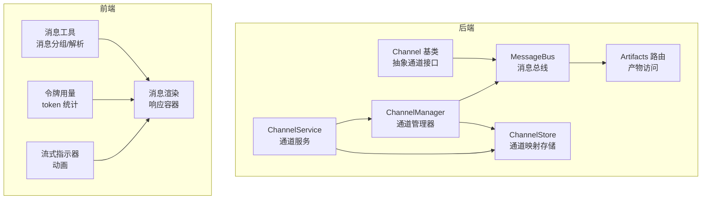
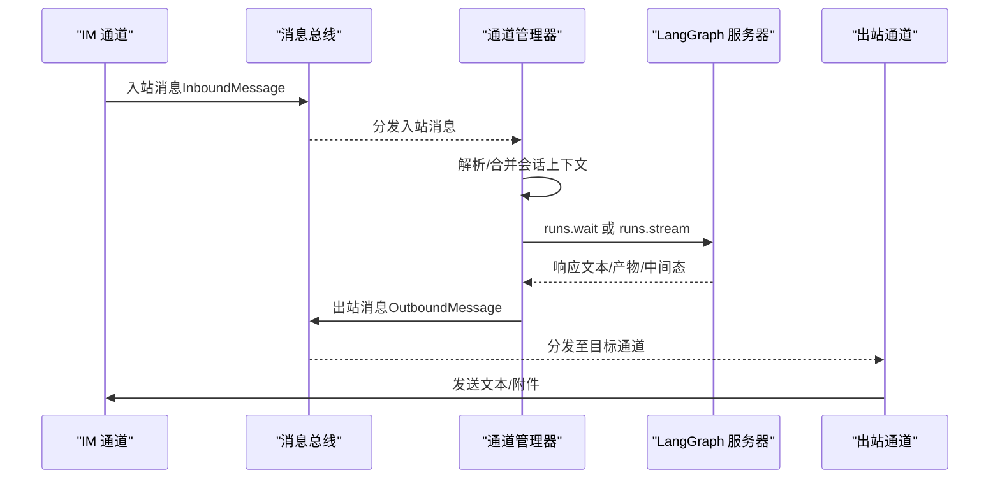
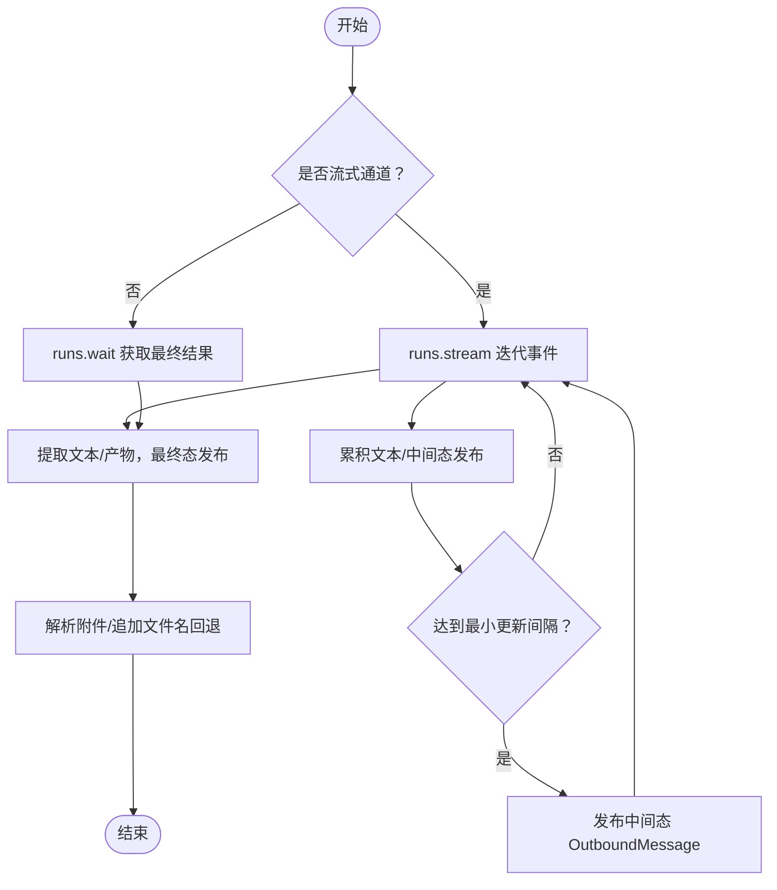
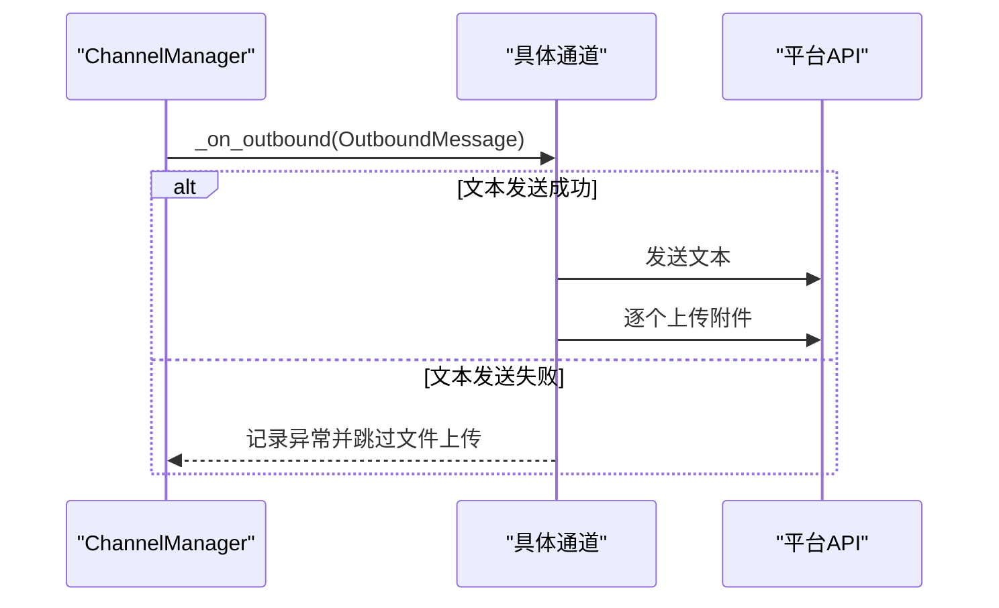
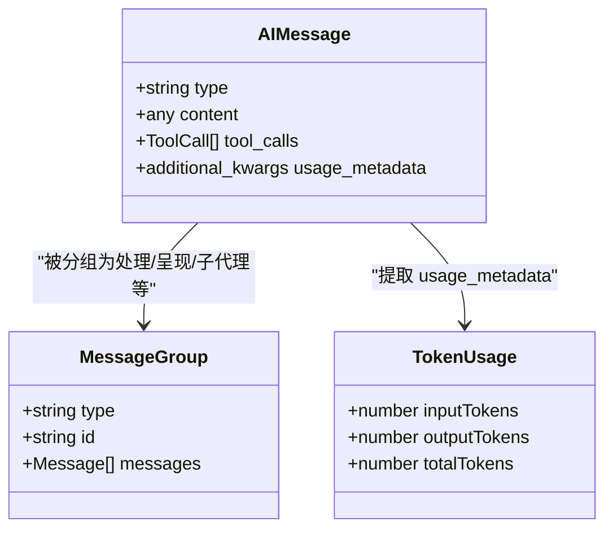
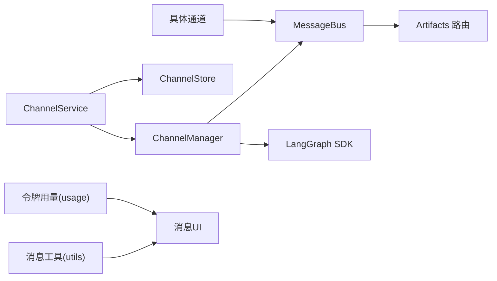

# 消息状态管理

<cite>
**本文档引用的文件**
- [backend/app/channels/message_bus.py](file://backend/app/channels/message_bus.py)
- [backend/app/channels/base.py](file://backend/app/channels/base.py)
- [backend/app/channels/manager.py](file://backend/app/channels/manager.py)
- [backend/app/channels/store.py](file://backend/app/channels/store.py)
- [backend/app/channels/service.py](file://backend/app/channels/service.py)
- [backend/app/gateway/routers/artifacts.py](file://backend/app/gateway/routers/artifacts.py)
- [backend/tests/test_channels.py](file://backend/tests/test_channels.py)
- [frontend/src/core/messages/utils.ts](file://frontend/src/core/messages/utils.ts)
- [frontend/src/core/messages/usage.ts](file://frontend/src/core/messages/usage.ts)
- [frontend/src/components/workspace/streaming-indicator.tsx](file://frontend/src/components/workspace/streaming-indicator.tsx)
- [frontend/src/components/ai-elements/message.tsx](file://frontend/src/components/ai-elements/message.tsx)
</cite>

## 目录
1. [简介](#简介)
2. [项目结构](#项目结构)
3. [核心组件](#核心组件)
4. [架构总览](#架构总览)
5. [详细组件分析](#详细组件分析)
6. [依赖关系分析](#依赖关系分析)
7. [性能考虑](#性能考虑)
8. [故障排查指南](#故障排查指南)
9. [结论](#结论)
10. [附录](#附录)

## 简介
本文件系统性阐述 DeerFlow 的消息状态管理系统，覆盖消息数据结构、消息流状态与实时消息处理机制；针对不同消息类型（文本、文件、产物）的状态管理策略；消息发送、接收与渲染状态的协同；并发处理、重试与错误恢复；以及消息状态与任务状态的关联与同步机制。目标是帮助开发者与运维人员快速理解并高效扩展消息状态管理能力。

## 项目结构
消息状态管理涉及后端通道层、消息总线、通道管理器、持久化存储、通道服务以及前端消息渲染与工具函数等模块。下图展示与消息状态管理直接相关的模块关系：

**图表来源**
- [backend/app/channels/message_bus.py:117-174](file://backend/app/channels/message_bus.py#L117-L174)
- [backend/app/channels/manager.py:317-732](file://backend/app/channels/manager.py#L317-L732)
- [backend/app/channels/store.py:16-154](file://backend/app/channels/store.py#L16-L154)
- [backend/app/channels/base.py:14-109](file://backend/app/channels/base.py#L14-L109)
- [backend/app/channels/service.py:22-179](file://backend/app/channels/service.py#L22-L179)
- [backend/app/gateway/routers/artifacts.py:61-159](file://backend/app/gateway/routers/artifacts.py#L61-L159)
- [frontend/src/core/messages/utils.ts:1-376](file://frontend/src/core/messages/utils.ts#L1-L376)
- [frontend/src/core/messages/usage.ts:1-63](file://frontend/src/core/messages/usage.ts#L1-L63)
- [frontend/src/components/workspace/streaming-indicator.tsx:1-34](file://frontend/src/components/workspace/streaming-indicator.tsx#L1-L34)
- [frontend/src/components/ai-elements/message.tsx:305-320](file://frontend/src/components/ai-elements/message.tsx#L305-L320)

**章节来源**
- [backend/app/channels/message_bus.py:1-174](file://backend/app/channels/message_bus.py#L1-L174)
- [backend/app/channels/manager.py:1-732](file://backend/app/channels/manager.py#L1-L732)
- [backend/app/channels/store.py:1-154](file://backend/app/channels/store.py#L1-L154)
- [backend/app/channels/base.py:1-109](file://backend/app/channels/base.py#L1-L109)
- [backend/app/channels/service.py:1-179](file://backend/app/channels/service.py#L1-L179)
- [backend/app/gateway/routers/artifacts.py:1-159](file://backend/app/gateway/routers/artifacts.py#L1-L159)
- [frontend/src/core/messages/utils.ts:1-376](file://frontend/src/core/messages/utils.ts#L1-L376)
- [frontend/src/core/messages/usage.ts:1-63](file://frontend/src/core/messages/usage.ts#L1-L63)
- [frontend/src/components/workspace/streaming-indicator.tsx:1-34](file://frontend/src/components/workspace/streaming-indicator.tsx#L1-L34)
- [frontend/src/components/ai-elements/message.tsx:305-320](file://frontend/src/components/ai-elements/message.tsx#L305-L320)

## 核心组件
- 消息总线（MessageBus）：异步发布/订阅枢纽，解耦通道与代理调度器，负责入站消息队列与出站回调分发。
- 通道管理器（ChannelManager）：桥接 IM 通道与 LangGraph 服务器，处理命令与聊天消息，支持流式与非流式响应，维护消息到线程的映射。
- 通道存储（ChannelStore）：持久化 IM 会话到 DeerFlow 线程的映射，提供线程 ID 查询与更新。
- 通道基类（Channel）：定义通道生命周期与发送接口，统一出站消息处理与文件上传策略。
- 通道服务（ChannelService）：从应用配置加载通道，启动/停止通道与管理器。
- 前端消息工具（messages/utils.ts）：消息分组、内容提取、产物文件解析与上传状态标记。
- 前端令牌用量（messages/usage.ts）：从 AI 消息中提取 token 使用量并累计统计。
- 前端流式指示器（streaming-indicator.tsx）：流式渲染时的视觉反馈。
- 产物路由（artifacts.py）：后端提供产物文件访问接口，支持下载与内联显示。

**章节来源**
- [backend/app/channels/message_bus.py:117-174](file://backend/app/channels/message_bus.py#L117-L174)
- [backend/app/channels/manager.py:317-732](file://backend/app/channels/manager.py#L317-L732)
- [backend/app/channels/store.py:16-154](file://backend/app/channels/store.py#L16-L154)
- [backend/app/channels/base.py:14-109](file://backend/app/channels/base.py#L14-L109)
- [backend/app/channels/service.py:22-179](file://backend/app/channels/service.py#L22-L179)
- [frontend/src/core/messages/utils.ts:1-376](file://frontend/src/core/messages/utils.ts#L1-L376)
- [frontend/src/core/messages/usage.ts:1-63](file://frontend/src/core/messages/usage.ts#L1-L63)
- [frontend/src/components/workspace/streaming-indicator.tsx:1-34](file://frontend/src/components/workspace/streaming-indicator.tsx#L1-L34)
- [backend/app/gateway/routers/artifacts.py:61-159](file://backend/app/gateway/routers/artifacts.py#L61-L159)

## 架构总览
消息状态管理采用“通道 → 总线 → 管理器 → LangGraph → 出站通道”的链路，结合“线程映射存储”实现跨消息的上下文延续与状态同步。

**图表来源**
- [backend/app/channels/message_bus.py:131-174](file://backend/app/channels/message_bus.py#L131-L174)
- [backend/app/channels/manager.py:479-545](file://backend/app/channels/manager.py#L479-L545)
- [backend/app/channels/base.py:87-109](file://backend/app/channels/base.py#L87-L109)

## 详细组件分析

### 消息数据结构与状态
- 入站消息（InboundMessage）：包含渠道名、会话标识、用户标识、消息文本、消息类型（聊天/命令）、线程标识、话题标识、文件列表、元数据与时间戳。用于描述来自外部平台的消息及其上下文。
- 出站消息（OutboundMessage）：包含目标渠道、会话标识、DeerFlow 线程 ID、响应文本、产物路径列表、附件列表、是否最终消息、平台线程标识、元数据与时间戳。用于描述代理返回给用户的响应。
- 附件（ResolvedAttachment）：虚拟路径解析后的宿主路径、文件名、MIME 类型、大小与是否图像类型，用于安全地上传与回退显示。

上述结构确保消息在发送、接收与渲染三阶段具备一致的状态载体与可追溯性。

**章节来源**
- [backend/app/channels/message_bus.py:29-107](file://backend/app/channels/message_bus.py#L29-L107)

### 消息流状态与实时处理
- 非流式：管理器调用 runs.wait 获取最终响应，提取文本与产物，封装为出站消息并发布到总线。
- 流式：管理器调用 runs.stream，按事件累积文本，限定最小更新间隔进行多次出站发布，最终以 is_final=True 结束流式会话。
- 文本/产物/文件三者状态：
  - 文本状态：通过 is_final 字段区分中间态与最终态；前端根据 is_final 切换渲染与流式指示器。
  - 产物状态：产物路径在 AI 响应中通过工具调用携带，管理器提取并解析为附件，同时在文本中追加文件名回退提示。
  - 文件状态：附件解析与上传遵循“先文本后文件”的顺序，失败则跳过文件上传，避免部分投递。

**图表来源**
- [backend/app/channels/manager.py:546-642](file://backend/app/channels/manager.py#L546-L642)
- [backend/app/channels/manager.py:290-315](file://backend/app/channels/manager.py#L290-L315)

**章节来源**
- [backend/app/channels/manager.py:496-642](file://backend/app/channels/manager.py#L496-L642)

### 并发处理与限流
- 通道管理器使用信号量限制最大并发任务数，默认值为 5，避免对 LangGraph 与下游通道造成瞬时压力。
- 后台任务异常通过回调记录日志，防止异常扩散影响整体调度循环。

**章节来源**
- [backend/app/channels/manager.py:330-416](file://backend/app/channels/manager.py#L330-L416)

### 错误恢复与重试机制
- 通道基类的出站回调在发送文本失败时不会尝试文件上传，避免部分投递；同时捕获异常并记录日志。
- Slack/Telegram 等通道实现发送重试：指数退避（含抖动），在多次失败后添加失败反应或抛出异常。
- 测试用例验证了重试次数与最终抛出异常的行为，确保在网络波动场景下的稳定性。

**图表来源**
- [backend/app/channels/base.py:87-109](file://backend/app/channels/base.py#L87-L109)

**章节来源**
- [backend/app/channels/base.py:54-109](file://backend/app/channels/base.py#L54-L109)
- [backend/tests/test_channels.py:1690-1792](file://backend/tests/test_channels.py#L1690-L1792)

### 消息状态与任务状态的关联与同步
- 任务状态（子任务）与消息状态通过消息分组与工具调用关联：前端工具函数识别 AI 消息中的工具调用（如 present_files、task），并据此生成“处理中/呈现文件/子代理”等消息分组，驱动 UI 渲染与交互。
- 令牌用量（TokenUsage）从 AI 消息中提取并累计，用于成本与性能监控，间接反映任务执行状态与资源消耗。
- 线程映射存储（ChannelStore）将 IM 会话与 DeerFlow 线程绑定，保证跨消息的上下文一致性与状态同步。

**图表来源**
- [frontend/src/core/messages/utils.ts:1-126](file://frontend/src/core/messages/utils.ts#L1-L126)
- [frontend/src/core/messages/usage.ts:1-63](file://frontend/src/core/messages/usage.ts#L1-L63)

**章节来源**
- [frontend/src/core/messages/utils.ts:1-376](file://frontend/src/core/messages/utils.ts#L1-L376)
- [frontend/src/core/messages/usage.ts:1-63](file://frontend/src/core/messages/usage.ts#L1-L63)
- [backend/app/channels/store.py:82-107](file://backend/app/channels/store.py#L82-L107)

### 不同类型消息的状态管理策略
- 文本消息
  - 状态：中间态（is_final=False）与最终态（is_final=True）；前端根据 is_final 控制渲染与流式指示器。
  - 策略：流式通道按最小间隔发布中间态，最终态包含完整文本与产物信息。
- 文件消息
  - 状态：解析附件（ResolvedAttachment）→ 上传（成功/失败）→ 回退显示（文件名列表）。
  - 策略：先文本后文件，失败跳过文件上传；在文本中追加文件名回退提示，确保可发现性。
- 产物消息
  - 状态：AI 工具调用 present_files 返回产物路径列表；管理器解析为附件并格式化为人类可读文本。
  - 策略：仅包含本次生成的产物，避免历史产物污染；后端提供产物访问路由，支持下载与内联显示。

**章节来源**
- [backend/app/channels/manager.py:290-315](file://backend/app/channels/manager.py#L290-L315)
- [backend/app/gateway/routers/artifacts.py:61-159](file://backend/app/gateway/routers/artifacts.py#L61-L159)

### 接收状态与渲染状态
- 接收状态：后端通过 MessageBus 的入站队列与 get_inbound 阻塞获取消息，保证 FIFO 顺序与可靠性。
- 渲染状态：前端根据 is_final 与消息分组决定 UI 行为；流式指示器在中间态时显示，最终态隐藏；消息响应容器承载最终文本与产物展示。

**章节来源**
- [backend/app/channels/message_bus.py:142-148](file://backend/app/channels/message_bus.py#L142-L148)
- [frontend/src/components/workspace/streaming-indicator.tsx:1-34](file://frontend/src/components/workspace/streaming-indicator.tsx#L1-L34)
- [frontend/src/components/ai-elements/message.tsx:305-320](file://frontend/src/components/ai-elements/message.tsx#L305-L320)

## 依赖关系分析
- 通道服务（ChannelService）负责启动 ChannelManager 与各通道实例，并通过 MessageBus 与 ChannelStore 协作。
- 通道管理器（ChannelManager）依赖 MessageBus 进行消息分发，依赖 ChannelStore 进行线程映射，依赖 LangGraph SDK 执行推理。
- 通道基类（Channel）定义统一的出站回调与文件上传策略，具体通道（Slack/Telegram/Feishu）实现平台特定发送逻辑与重试。
- 前端消息工具与 UI 组件依赖后端消息状态（is_final、附件、产物）与令牌用量信息进行渲染与交互。

**图表来源**
- [backend/app/channels/service.py:22-179](file://backend/app/channels/service.py#L22-L179)
- [backend/app/channels/manager.py:317-732](file://backend/app/channels/manager.py#L317-L732)
- [backend/app/channels/message_bus.py:117-174](file://backend/app/channels/message_bus.py#L117-L174)
- [backend/app/gateway/routers/artifacts.py:61-159](file://backend/app/gateway/routers/artifacts.py#L61-L159)
- [frontend/src/core/messages/utils.ts:1-376](file://frontend/src/core/messages/utils.ts#L1-L376)
- [frontend/src/core/messages/usage.ts:1-63](file://frontend/src/core/messages/usage.ts#L1-L63)

**章节来源**
- [backend/app/channels/service.py:22-179](file://backend/app/channels/service.py#L22-L179)
- [backend/app/channels/manager.py:317-732](file://backend/app/channels/manager.py#L317-L732)
- [backend/app/channels/message_bus.py:117-174](file://backend/app/channels/message_bus.py#L117-L174)
- [backend/app/gateway/routers/artifacts.py:61-159](file://backend/app/gateway/routers/artifacts.py#L61-L159)
- [frontend/src/core/messages/utils.ts:1-376](file://frontend/src/core/messages/utils.ts#L1-L376)
- [frontend/src/core/messages/usage.ts:1-63](file://frontend/src/core/messages/usage.ts#L1-L63)

## 性能考虑
- 并发限制：通过信号量控制最大并发，避免对 LangGraph 与下游通道造成拥塞。
- 流式更新节流：最小更新间隔减少频繁 UI 刷新与网络开销。
- 附件安全解析：仅允许输出目录内的产物路径，避免路径穿越与无效文件导致的 IO 开销。
- 令牌用量聚合：前端累计 token 使用，便于成本控制与性能优化。

[本节为通用指导，无需列出具体文件来源]

## 故障排查指南
- 发送失败但未上传文件
  - 现象：文本发送异常，后续文件上传被跳过。
  - 处理：检查通道发送实现与异常日志；确认 is_final=False 的中间态是否正确传播。
  - 参考
    - [backend/app/channels/base.py:87-109](file://backend/app/channels/base.py#L87-L109)
- Slack/Telegram 重试失败
  - 现象：多次重试后仍失败并抛出异常。
  - 处理：查看指数退避日志与失败反应；检查网络与凭证配置。
  - 参考
    - [backend/tests/test_channels.py:1690-1792](file://backend/tests/test_channels.py#L1690-L1792)
    - [backend/app/channels/slack.py:91-129](file://backend/app/channels/slack.py#L91-L129)
- 产物无法访问
  - 现象：前端无法下载或查看产物。
  - 处理：确认产物路径前缀与解析逻辑；检查后端路由权限与文件存在性。
  - 参考
    - [backend/app/gateway/routers/artifacts.py:61-159](file://backend/app/gateway/routers/artifacts.py#L61-L159)
- 令牌用量缺失
  - 现象：前端未显示 token 统计。
  - 处理：确认后端是否注入 usage_metadata；前端类型兼容性。
  - 参考
    - [frontend/src/core/messages/usage.ts:1-63](file://frontend/src/core/messages/usage.ts#L1-L63)

**章节来源**
- [backend/app/channels/base.py:87-109](file://backend/app/channels/base.py#L87-L109)
- [backend/tests/test_channels.py:1690-1792](file://backend/tests/test_channels.py#L1690-L1792)
- [backend/app/gateway/routers/artifacts.py:61-159](file://backend/app/gateway/routers/artifacts.py#L61-L159)
- [frontend/src/core/messages/usage.ts:1-63](file://frontend/src/core/messages/usage.ts#L1-L63)

## 结论
DeerFlow 的消息状态管理通过“消息总线 + 通道管理器 + 存储 + 通道服务”的架构实现了跨平台、跨消息类型的稳定流转。其设计强调：
- 明确的消息状态（中间态/最终态）与渲染策略；
- 安全可控的产物与文件处理流程；
- 并发与重试保障的可靠性；
- 与任务状态（消息分组、工具调用、令牌用量）的自然衔接。

该体系为扩展新通道、增强流式体验与完善错误恢复提供了清晰的落点。

[本节为总结，无需列出具体文件来源]

## 附录
- 关键流程参考路径
  - 流式处理：[backend/app/channels/manager.py:546-642](file://backend/app/channels/manager.py#L546-L642)
  - 非流式处理：[backend/app/channels/manager.py:507-545](file://backend/app/channels/manager.py#L507-L545)
  - 出站回调与文件上传：[backend/app/channels/base.py:87-109](file://backend/app/channels/base.py#L87-L109)
  - 线程映射存储：[backend/app/channels/store.py:82-107](file://backend/app/channels/store.py#L82-L107)
  - 产物访问路由：[backend/app/gateway/routers/artifacts.py:61-159](file://backend/app/gateway/routers/artifacts.py#L61-L159)
  - 前端消息分组与解析：[frontend/src/core/messages/utils.ts:1-376](file://frontend/src/core/messages/utils.ts#L1-L376)
  - 前端令牌用量统计：[frontend/src/core/messages/usage.ts:1-63](file://frontend/src/core/messages/usage.ts#L1-L63)

[本节为补充说明，无需列出具体文件来源]