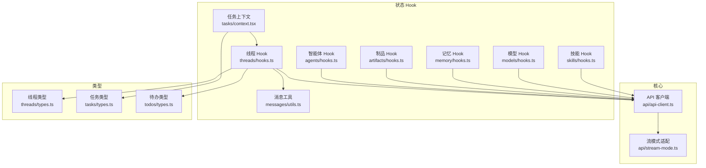
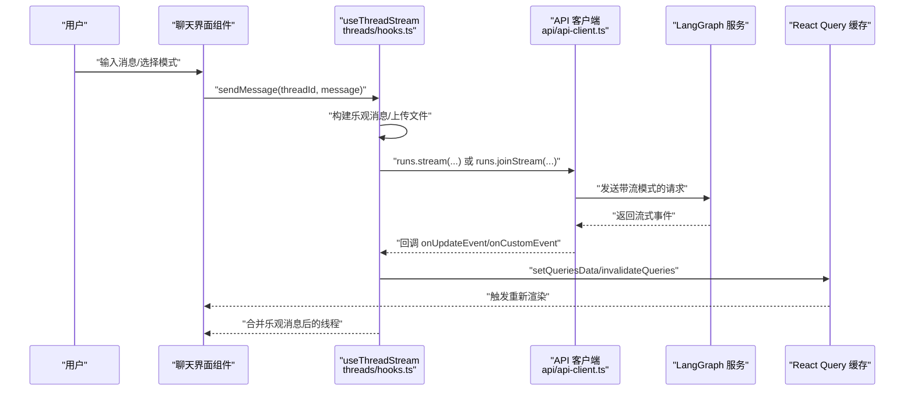
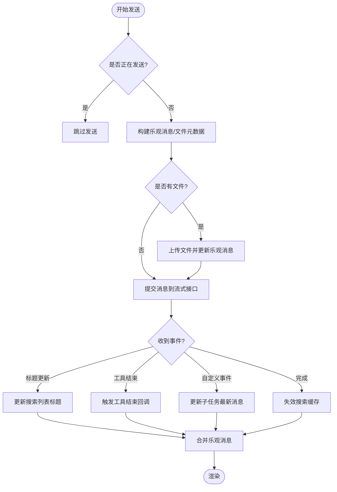
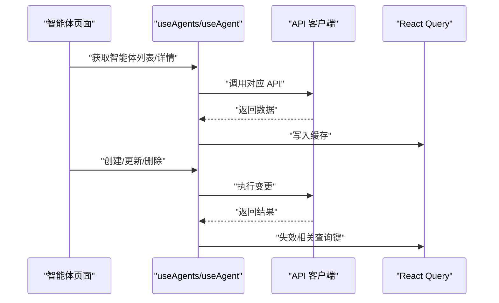
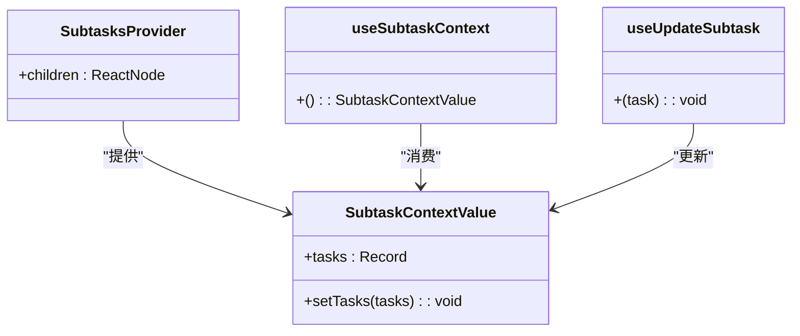
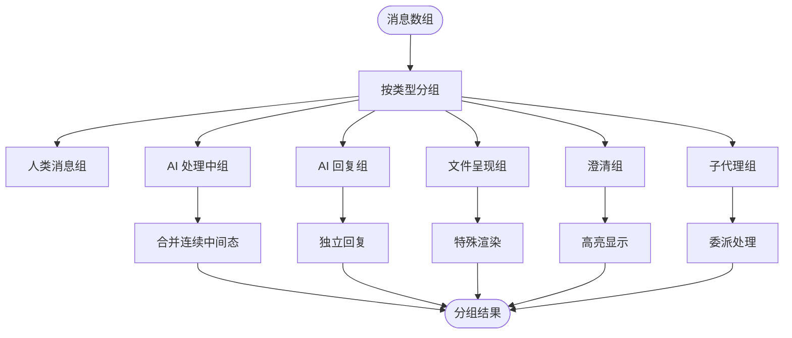
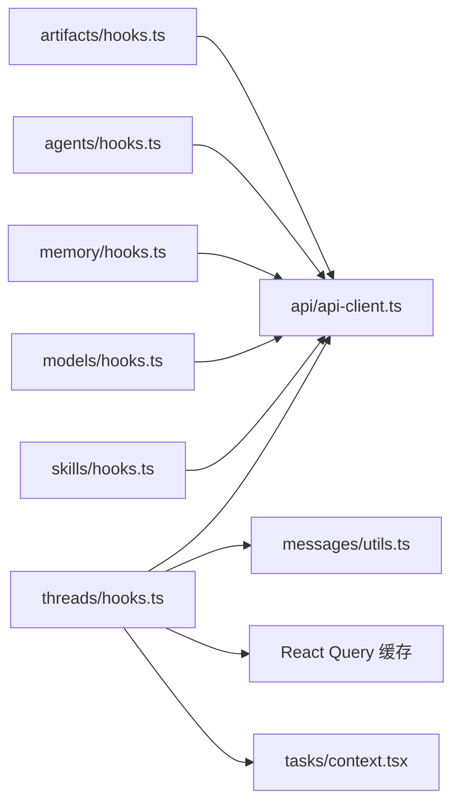

# 状态管理

<cite>
**本文引用的文件**
- [hooks.ts](file://frontend/src/core/agents/hooks.ts)
- [hooks.ts](file://frontend/src/core/threads/hooks.ts)
- [context.tsx](file://frontend/src/core/tasks/context.tsx)
- [utils.ts](file://frontend/src/core/messages/utils.ts)
- [hooks.ts](file://frontend/src/core/artifacts/hooks.ts)
- [hooks.ts](file://frontend/src/core/memory/hooks.ts)
- [hooks.ts](file://frontend/src/core/models/hooks.ts)
- [hooks.ts](file://frontend/src/core/skills/hooks.ts)
- [types.ts](file://frontend/src/core/threads/types.ts)
- [types.ts](file://frontend/src/core/todos/types.ts)
- [types.ts](file://frontend/src/core/tasks/types.ts)
- [stream-mode.ts](file://frontend/src/core/api/stream-mode.ts)
- [api-client.ts](file://frontend/src/core/api/api-client.ts)
- [hooks.ts](file://frontend/src/core/settings/hooks.ts)
</cite>

## 目录
1. [简介](#简介)
2. [项目结构](#项目结构)
3. [核心组件](#核心组件)
4. [架构总览](#架构总览)
5. [详细组件分析](#详细组件分析)
6. [依赖关系分析](#依赖关系分析)
7. [性能考量](#性能考量)
8. [故障排查指南](#故障排查指南)
9. [结论](#结论)
10. [附录](#附录)

## 简介
本文件系统性梳理 DeerFlow 前端状态管理的设计与实现，覆盖以下方面：
- 前端状态架构：以查询客户端为中心的声明式状态模型
- 数据流管理：从用户交互到后端流式响应的完整链路
- 组件通信模式：基于上下文与自定义 Hook 的解耦协作
- 智能体状态、线程状态、消息状态、任务状态的管理策略
- 自定义 Hook 设计、状态订阅机制与异步状态更新
- 状态持久化、缓存策略与性能优化
- 状态同步、错误处理与并发控制
- 调试工具与开发体验优化

## 项目结构
前端状态管理主要分布在 core 子模块中，围绕“查询客户端 + 自定义 Hook + 类型定义”的分层组织：
- 核心 API 客户端与流式模式适配
- 各领域状态的 Hook（智能体、线程、消息、任务、制品、记忆、模型、技能）
- 类型定义与消息分组工具
- 本地设置与持久化

图表来源
- [api-client.ts:1-38](file://frontend/src/core/api/api-client.ts#L1-L38)
- [stream-mode.ts:1-69](file://frontend/src/core/api/stream-mode.ts#L1-L69)
- [hooks.ts:1-65](file://frontend/src/core/agents/hooks.ts#L1-L65)
- [hooks.ts:1-559](file://frontend/src/core/threads/hooks.ts#L1-L559)
- [utils.ts:1-376](file://frontend/src/core/messages/utils.ts#L1-L376)
- [context.tsx:1-54](file://frontend/src/core/tasks/context.tsx#L1-L54)
- [hooks.ts:1-39](file://frontend/src/core/artifacts/hooks.ts#L1-L39)
- [hooks.ts:1-12](file://frontend/src/core/memory/hooks.ts#L1-L12)
- [hooks.ts:1-14](file://frontend/src/core/models/hooks.ts#L1-L14)
- [hooks.ts:1-32](file://frontend/src/core/skills/hooks.ts#L1-L32)
- [types.ts:1-23](file://frontend/src/core/threads/types.ts#L1-L23)
- [types.ts:1-13](file://frontend/src/core/tasks/types.ts#L1-L13)
- [types.ts:1-13](file://frontend/src/core/todos/types.ts#L1-L13)

章节来源
- [api-client.ts:1-38](file://frontend/src/core/api/api-client.ts#L1-L38)
- [stream-mode.ts:1-69](file://frontend/src/core/api/stream-mode.ts#L1-L69)
- [hooks.ts:1-65](file://frontend/src/core/agents/hooks.ts#L1-L65)
- [hooks.ts:1-559](file://frontend/src/core/threads/hooks.ts#L1-L559)
- [utils.ts:1-376](file://frontend/src/core/messages/utils.ts#L1-L376)
- [context.tsx:1-54](file://frontend/src/core/tasks/context.tsx#L1-L54)
- [hooks.ts:1-39](file://frontend/src/core/artifacts/hooks.ts#L1-L39)
- [hooks.ts:1-12](file://frontend/src/core/memory/hooks.ts#L1-L12)
- [hooks.ts:1-14](file://frontend/src/core/models/hooks.ts#L1-L14)
- [hooks.ts:1-32](file://frontend/src/core/skills/hooks.ts#L1-L32)
- [types.ts:1-23](file://frontend/src/core/threads/types.ts#L1-L23)
- [types.ts:1-13](file://frontend/src/core/tasks/types.ts#L1-L13)
- [types.ts:1-13](file://frontend/src/core/todos/types.ts#L1-L13)

## 核心组件
- 查询客户端与流式适配
  - API 客户端封装 LangGraph SDK，并在运行时自动裁剪不支持的流模式，保证兼容性与稳定性。
  - 流模式清洗器对请求参数进行校验与过滤，避免无效模式导致的异常。
- 自定义 Hook
  - 智能体：列表、详情、创建、更新、删除，统一使用查询键与失效策略保持一致性。
  - 线程：流式对话、乐观消息、文件上传、标题更新、删除、重命名；通过查询客户端与 React Query 实现状态订阅与缓存。
  - 任务：子任务上下文，提供任务状态的局部更新与共享。
  - 制品：按路径加载内容，带缓存时间配置，减少重复拉取。
  - 记忆、模型、技能：基础查询 Hook，支持启用/禁用切换后的缓存失效。
- 类型体系
  - 线程状态包含标题、消息、制品与待办等字段，作为流式事件的承载对象。
  - 任务类型描述子任务的生命周期与结果。
  - 消息工具提供消息分组、推理内容提取、文件元数据解析等能力。

章节来源
- [api-client.ts:1-38](file://frontend/src/core/api/api-client.ts#L1-L38)
- [stream-mode.ts:1-69](file://frontend/src/core/api/stream-mode.ts#L1-L69)
- [hooks.ts:1-65](file://frontend/src/core/agents/hooks.ts#L1-L65)
- [hooks.ts:1-559](file://frontend/src/core/threads/hooks.ts#L1-L559)
- [context.tsx:1-54](file://frontend/src/core/tasks/context.tsx#L1-L54)
- [hooks.ts:1-39](file://frontend/src/core/artifacts/hooks.ts#L1-L39)
- [hooks.ts:1-12](file://frontend/src/core/memory/hooks.ts#L1-L12)
- [hooks.ts:1-14](file://frontend/src/core/models/hooks.ts#L1-L14)
- [hooks.ts:1-32](file://frontend/src/core/skills/hooks.ts#L1-L32)
- [types.ts:1-23](file://frontend/src/core/threads/types.ts#L1-L23)
- [types.ts:1-13](file://frontend/src/core/tasks/types.ts#L1-L13)
- [utils.ts:1-376](file://frontend/src/core/messages/utils.ts#L1-L376)

## 架构总览
下图展示从前端交互到后端流式响应与状态更新的全链路：

图表来源
- [hooks.ts:202-411](file://frontend/src/core/threads/hooks.ts#L202-L411)
- [api-client.ts:9-37](file://frontend/src/core/api/api-client.ts#L9-L37)
- [stream-mode.ts:36-68](file://frontend/src/core/api/stream-mode.ts#L36-L68)

## 详细组件分析

### 线程状态与流式对话
- 流式订阅与事件处理
  - 使用 SDK 提供的流式接口订阅状态更新，支持工具结束事件与自定义事件（如任务运行）。
  - 在更新回调中对标题变更进行乐观更新，同时在完成回调中失效搜索缓存并触发全局刷新。
- 乐观消息与并发控制
  - 发送前生成人类消息与 AI 预览，结合上传进度与文件元数据，提升交互即时性。
  - 通过发送中的标志位防止并发发送，确保消息顺序与一致性。
- 文件上传与消息合并
  - 将上传进度与最终虚拟路径写入消息附加信息，随后在服务器响应到达后清理乐观消息。
  - 合并乐观消息与真实消息用于渲染，保证 UI 一致。

图表来源
- [hooks.ts:113-183](file://frontend/src/core/threads/hooks.ts#L113-L183)
- [hooks.ts:202-411](file://frontend/src/core/threads/hooks.ts#L202-L411)

章节来源
- [hooks.ts:113-183](file://frontend/src/core/threads/hooks.ts#L113-L183)
- [hooks.ts:202-411](file://frontend/src/core/threads/hooks.ts#L202-L411)
- [types.ts:5-22](file://frontend/src/core/threads/types.ts#L5-L22)

### 智能体状态
- 列表与详情
  - 列表 Hook 返回智能体数组与加载状态；详情 Hook 支持按名称查询并可禁用查询以等待名称就绪。
- 变更操作
  - 创建、更新、删除均通过 Mutation 完成，并在成功后失效相关查询键，确保视图与后端一致。

图表来源
- [hooks.ts:12-27](file://frontend/src/core/agents/hooks.ts#L12-L27)
- [hooks.ts:29-64](file://frontend/src/core/agents/hooks.ts#L29-L64)

章节来源
- [hooks.ts:12-27](file://frontend/src/core/agents/hooks.ts#L12-L27)
- [hooks.ts:29-64](file://frontend/src/core/agents/hooks.ts#L29-L64)

### 任务状态与子任务上下文
- 上下文设计
  - 使用 React Context 提供任务字典与更新函数，支持局部更新并在最新消息存在时强制刷新以触发渲染。
- 与线程流的集成
  - 线程流在自定义事件中推送任务运行状态，由上下文接收并更新对应子任务。

图表来源
- [context.tsx:5-34](file://frontend/src/core/tasks/context.tsx#L5-L34)
- [context.tsx:41-53](file://frontend/src/core/tasks/context.tsx#L41-L53)

章节来源
- [context.tsx:1-54](file://frontend/src/core/tasks/context.tsx#L1-L54)
- [hooks.ts:15-17](file://frontend/src/core/threads/hooks.ts#L15-L17)

### 消息状态与消息分组
- 分组策略
  - 将人类消息、AI 处理中、AI 回复、文件呈现、澄清与子代理消息进行逻辑分组，便于 UI 渲染与交互。
- 内容与推理提取
  - 支持从 AI 消息中提取文本、推理内容、图片链接等；提供剥离标签与解析上传文件列表的能力。
- 工具调用关联
  - 将工具消息与前序处理组关联，确保工具输出与调用顺序正确。

图表来源
- [utils.ts:29-126](file://frontend/src/core/messages/utils.ts#L29-L126)

章节来源
- [utils.ts:1-376](file://frontend/src/core/messages/utils.ts#L1-L376)

### 制品状态与缓存策略
- 加载策略
  - 对于写文件类路径，直接从工具调用结果加载；对于普通路径，使用查询客户端按线程 ID 与路径加载。
  - 设置合理的过期时间，避免频繁拉取大体积制品（如 ZIP 解压产物）。

章节来源
- [hooks.ts:8-38](file://frontend/src/core/artifacts/hooks.ts#L8-L38)

### 记忆、模型与技能状态
- 记忆：基础查询 Hook，返回当前记忆快照。
- 模型：查询可用模型列表，支持窗口聚焦时不自动刷新。
- 技能：查询技能清单并提供启用/禁用 Mutation，成功后失效缓存。

章节来源
- [hooks.ts:1-12](file://frontend/src/core/memory/hooks.ts#L1-L12)
- [hooks.ts:1-14](file://frontend/src/core/models/hooks.ts#L1-L14)
- [hooks.ts:7-31](file://frontend/src/core/skills/hooks.ts#L7-L31)

### 线程搜索与分页
- 搜索 Hook
  - 支持分页与排序，内部按默认页大小迭代拉取直至满足上限或无更多数据。
  - 通过查询键缓存搜索结果，避免重复请求。

章节来源
- [hooks.ts:413-477](file://frontend/src/core/threads/hooks.ts#L413-L477)

### 线程标题与删除
- 重命名：更新线程状态中的标题，并同步更新搜索列表中的标题。
- 删除：先删除远端线程，再删除本地数据，失败时回滚并提示错误。

章节来源
- [hooks.ts:520-558](file://frontend/src/core/threads/hooks.ts#L520-L558)
- [hooks.ts:479-518](file://frontend/src/core/threads/hooks.ts#L479-L518)

### 本地设置与持久化
- 本地设置 Hook
  - 在挂载后读取本地存储，提供键值更新方法，更新后立即保存至本地存储。
  - 通过布局副作用确保只在客户端读取一次，避免同构渲染差异。

章节来源
- [hooks.ts:10-46](file://frontend/src/core/settings/hooks.ts#L10-L46)

## 依赖关系分析
- 组件耦合
  - 线程 Hook 依赖 API 客户端与消息工具，同时通过 React Query 与任务上下文进行跨组件通信。
  - 制品 Hook 依赖线程上下文与工具调用结果。
- 外部依赖
  - LangGraph SDK 客户端与流式接口
  - React Query 查询缓存与失效机制
  - 本地存储（浏览器）

图表来源
- [hooks.ts:1-559](file://frontend/src/core/threads/hooks.ts#L1-L559)
- [api-client.ts:1-38](file://frontend/src/core/api/api-client.ts#L1-L38)
- [utils.ts:1-376](file://frontend/src/core/messages/utils.ts#L1-L376)
- [context.tsx:1-54](file://frontend/src/core/tasks/context.tsx#L1-L54)
- [hooks.ts:1-39](file://frontend/src/core/artifacts/hooks.ts#L1-L39)
- [hooks.ts:1-65](file://frontend/src/core/agents/hooks.ts#L1-L65)
- [hooks.ts:1-12](file://frontend/src/core/memory/hooks.ts#L1-L12)
- [hooks.ts:1-14](file://frontend/src/core/models/hooks.ts#L1-L14)
- [hooks.ts:1-32](file://frontend/src/core/skills/hooks.ts#L1-L32)

## 性能考量
- 缓存与过期
  - 制品内容设置 5 分钟过期时间，降低重复拉取成本。
  - 模型列表关闭窗口焦点刷新，减少不必要的网络请求。
- 分页与批量
  - 线程搜索按默认页大小迭代拉取，避免一次性请求过多数据。
- 乐观 UI
  - 乐观消息与文件上传预览显著提升感知性能，服务器响应到达后自动清理。
- 流模式裁剪
  - 在请求阶段剔除不支持的流模式，避免无效模式带来的额外开销与错误日志。

章节来源
- [hooks.ts:34-35](file://frontend/src/core/artifacts/hooks.ts#L34-L35)
- [hooks.ts:10](file://frontend/src/core/models/hooks.ts#L10)
- [hooks.ts:436-471](file://frontend/src/core/threads/hooks.ts#L436-L471)
- [hooks.ts:218-246](file://frontend/src/core/threads/hooks.ts#L218-L246)
- [stream-mode.ts:36-68](file://frontend/src/core/api/stream-mode.ts#L36-L68)

## 故障排查指南
- 流式错误处理
  - 错误消息统一提取逻辑，优先使用字符串或嵌套错误信息，兜底为通用失败提示。
  - 出错时清空乐观消息并弹出通知，避免 UI 不一致。
- 并发控制
  - 发送中的标志位防止重复提交；文件上传期间禁用再次发送。
- 状态同步
  - 标题更新通过查询键精确更新搜索列表；删除线程时同步移除本地缓存项并失效查询。
- 开发调试
  - 流模式清洗器会记录未支持模式的首次出现，便于定位问题。
  - 本地设置 Hook 在客户端挂载后读取，避免 SSR 异常。

章节来源
- [hooks.ts:35-56](file://frontend/src/core/threads/hooks.ts#L35-L56)
- [hooks.ts:175-178](file://frontend/src/core/threads/hooks.ts#L175-L178)
- [hooks.ts:208-211](file://frontend/src/core/threads/hooks.ts#L208-L211)
- [hooks.ts:250-335](file://frontend/src/core/threads/hooks.ts#L250-L335)
- [hooks.ts:535-556](file://frontend/src/core/threads/hooks.ts#L535-L556)
- [hooks.ts:499-517](file://frontend/src/core/threads/hooks.ts#L499-L517)
- [stream-mode.ts:15-34](file://frontend/src/core/api/stream-mode.ts#L15-L34)
- [hooks.ts:19-24](file://frontend/src/core/settings/hooks.ts#L19-L24)

## 结论
DeerFlow 前端状态管理以查询客户端为核心，结合 React Query 的缓存与失效机制，实现了稳定、可扩展且高性能的状态体系。通过乐观 UI、流式事件与上下文共享，系统在复杂对话场景下仍能保持良好的用户体验与开发效率。建议在后续迭代中进一步完善调试面板与状态导出能力，以增强可观测性与排障效率。

## 附录
- 关键流程回顾
  - 线程发送：构建乐观消息 → 上传文件 → 提交流式请求 → 更新缓存 → 合并 UI
  - 智能体变更：Mutation 执行 → 失效查询 → 视图刷新
  - 任务更新：自定义事件 → 上下文更新 → 局部渲染
- 最佳实践
  - 为长耗时操作提供明确的加载与错误提示
  - 合理设置缓存过期时间，平衡实时性与性能
  - 使用查询键隔离不同维度的数据，避免不必要的全局刷新