# 线程状态管理

<cite>
**本文档引用的文件**
- [backend/packages/harness/deerflow/agents/thread_state.py](file://backend/packages/harness/deerflow/agents/thread_state.py)
- [backend/packages/harness/deerflow/agents/middlewares/thread_data_middleware.py](file://backend/packages/harness/deerflow/agents/middlewares/thread_data_middleware.py)
- [backend/packages/harness/deerflow/agents/middlewares/title_middleware.py](file://backend/packages/harness/deerflow/agents/middlewares/title_middleware.py)
- [backend/packages/harness/deerflow/agents/checkpointer/provider.py](file://backend/packages/harness/deerflow/agents/checkpointer/provider.py)
- [backend/packages/harness/deerflow/config/paths.py](file://backend/packages/harness/deerflow/config/paths.py)
- [backend/app/gateway/routers/threads.py](file://backend/app/gateway/routers/threads.py)
- [frontend/src/core/threads/hooks.ts](file://frontend/src/core/threads/hooks.ts)
- [frontend/src/core/threads/types.ts](file://frontend/src/core/threads/types.ts)
- [frontend/src/components/workspace/messages/context.ts](file://frontend/src/components/workspace/messages/context.ts)
- [frontend/src/app/workspace/chats/[thread_id]/page.tsx](file://frontend/src/app/workspace/chats/[thread_id]/page.tsx)
- [frontend/src/app/workspace/agents/new/page.tsx](file://frontend/src/app/workspace/agents/new/page.tsx)
- [backend/docs/AUTO_TITLE_GENERATION.md](file://backend/docs/AUTO_TITLE_GENERATION.md)
</cite>

## 目录
1. [简介](#简介)
2. [项目结构](#项目结构)
3. [核心组件](#核心组件)
4. [架构概览](#架构概览)
5. [详细组件分析](#详细组件分析)
6. [依赖关系分析](#依赖关系分析)
7. [性能考量](#性能考量)
8. [故障排除指南](#故障排除指南)
9. [结论](#结论)

## 简介

DeerFlow 的线程状态管理系统是一个基于 LangGraph 的分布式状态管理解决方案，负责维护对话线程的完整生命周期状态。该系统实现了完整的线程数据模型、消息历史管理、会话状态维护和持久化机制。

系统采用前后端分离架构，后端使用 Python 实现状态管理，前端使用 React 实现实时交互。核心特性包括：

- **线程数据模型**：完整的 ThreadState 结构，支持多维状态管理
- **消息历史管理**：支持增量更新和分页加载的消息历史
- **会话状态维护**：实时状态同步和乐观更新机制
- **持久化机制**：支持多种后端存储（内存、SQLite、PostgreSQL）
- **离线恢复**：断线重连和状态恢复能力
- **状态清理**：自动清理过期和无效状态

## 项目结构

DeerFlow 的线程状态管理涉及以下关键模块：

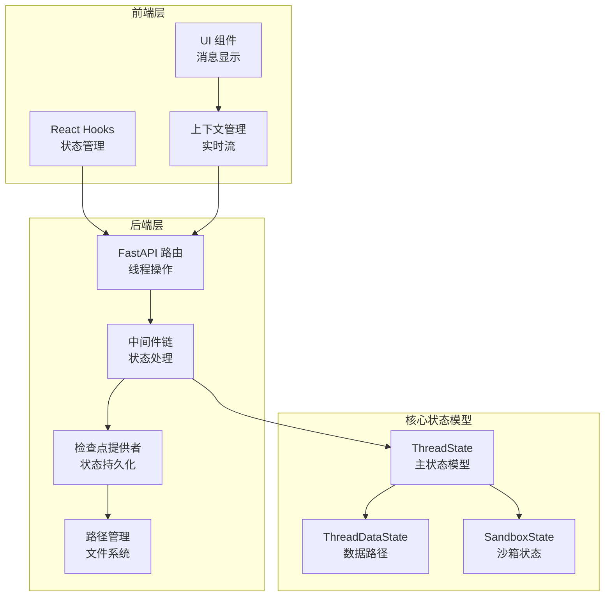

**图表来源**
- [frontend/src/core/threads/hooks.ts:1-559](file://frontend/src/core/threads/hooks.ts#L1-L559)
- [backend/app/gateway/routers/threads.py:1-42](file://backend/app/gateway/routers/threads.py#L1-L42)
- [backend/packages/harness/deerflow/agents/thread_state.py:1-56](file://backend/packages/harness/deerflow/agents/thread_state.py#L1-L56)

**章节来源**
- [frontend/src/core/threads/hooks.ts:1-559](file://frontend/src/core/threads/hooks.ts#L1-L559)
- [backend/app/gateway/routers/threads.py:1-42](file://backend/app/gateway/routers/threads.py#L1-L42)
- [backend/packages/harness/deerflow/agents/thread_state.py:1-56](file://backend/packages/harness/deerflow/agents/thread_state.py#L1-L56)

## 核心组件

### 线程状态数据模型

ThreadState 是整个系统的核心数据结构，定义了线程状态的完整结构：

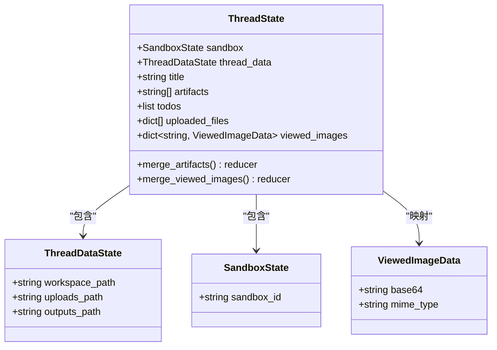

**图表来源**
- [backend/packages/harness/deerflow/agents/thread_state.py:48-56](file://backend/packages/harness/deerflow/agents/thread_state.py#L48-L56)

### 线程数据中间件

ThreadDataMiddleware 负责线程数据目录的创建和管理：

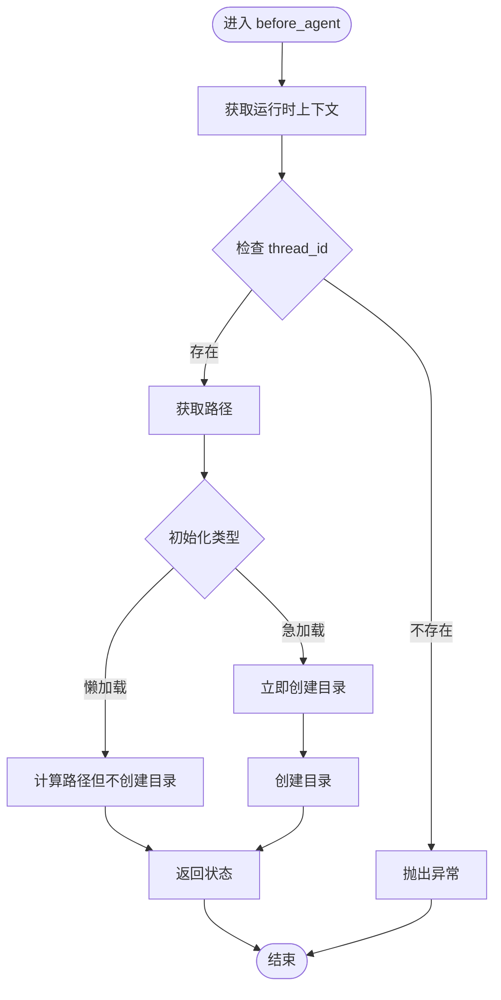

**图表来源**
- [backend/packages/harness/deerflow/agents/middlewares/thread_data_middleware.py:73-96](file://backend/packages/harness/deerflow/agents/middlewares/thread_data_middleware.py#L73-L96)

**章节来源**
- [backend/packages/harness/deerflow/agents/thread_state.py:1-56](file://backend/packages/harness/deerflow/agents/thread_state.py#L1-L56)
- [backend/packages/harness/deerflow/agents/middlewares/thread_data_middleware.py:1-97](file://backend/packages/harness/deerflow/agents/middlewares/thread_data_middleware.py#L1-L97)

## 架构概览

DeerFlow 的线程状态管理采用分层架构设计，确保系统的可扩展性和可维护性：

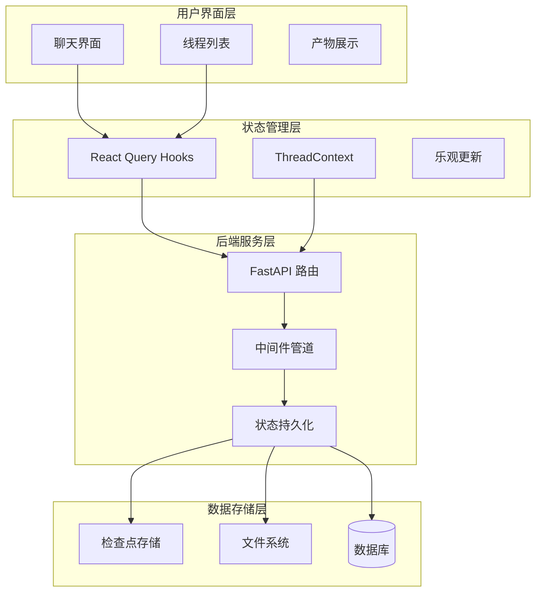

**图表来源**
- [frontend/src/core/threads/hooks.ts:58-183](file://frontend/src/core/threads/hooks.ts#L58-L183)
- [backend/app/gateway/routers/threads.py:19-41](file://backend/app/gateway/routers/threads.py#L19-L41)

## 详细组件分析

### 线程列表状态管理

前端使用 React Query 实现线程列表的高效状态管理：

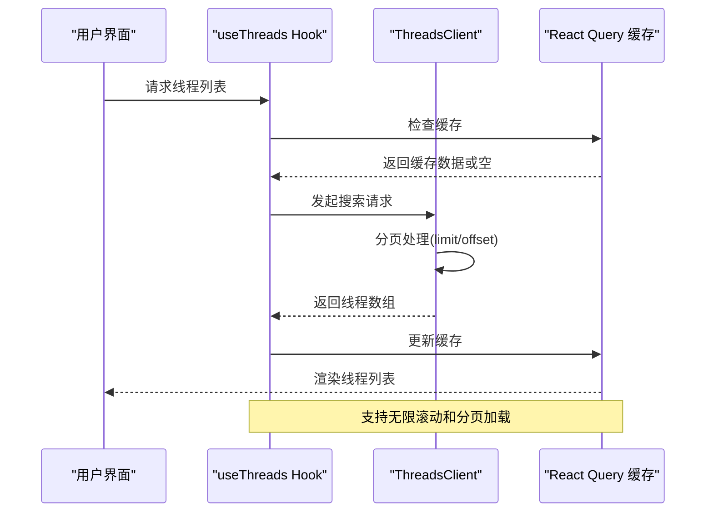

**图表来源**
- [frontend/src/core/threads/hooks.ts:413-477](file://frontend/src/core/threads/hooks.ts#L413-L477)

线程列表状态包含以下关键字段：
- `thread_id`: 线程唯一标识符
- `updated_at`: 最后更新时间戳
- `values`: 线程状态值对象，包含标题、消息等

**章节来源**
- [frontend/src/core/threads/hooks.ts:413-477](file://frontend/src/core/threads/hooks.ts#L413-L477)
- [frontend/src/core/threads/types.ts:1-23](file://frontend/src/core/threads/types.ts#L1-L23)

### 线程详情状态管理

线程详情页面实现了完整的实时状态管理：

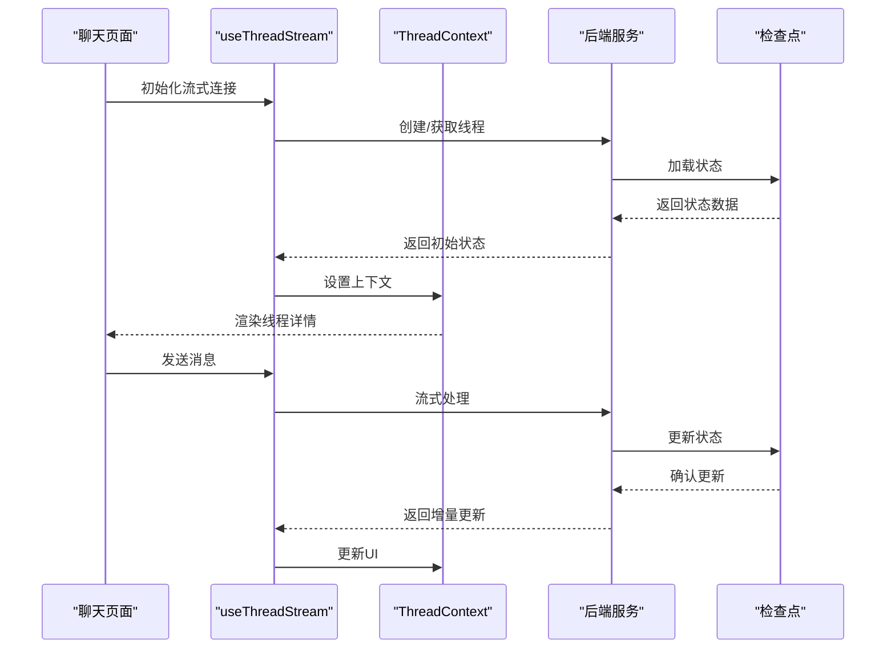

**图表来源**
- [frontend/src/app/workspace/chats/[thread_id]/page.tsx](file://frontend/src/app/workspace/chats/[thread_id]/page.tsx#L37-L62)
- [frontend/src/components/workspace/messages/context.ts:1-21](file://frontend/src/components/workspace/messages/context.ts#L1-L21)

**章节来源**
- [frontend/src/app/workspace/chats/[thread_id]/page.tsx](file://frontend/src/app/workspace/chats/[thread_id]/page.tsx#L1-L158)
- [frontend/src/components/workspace/messages/context.ts:1-21](file://frontend/src/components/workspace/messages/context.ts#L1-L21)

### 消息流状态管理

消息流实现了高效的增量更新和实时同步：

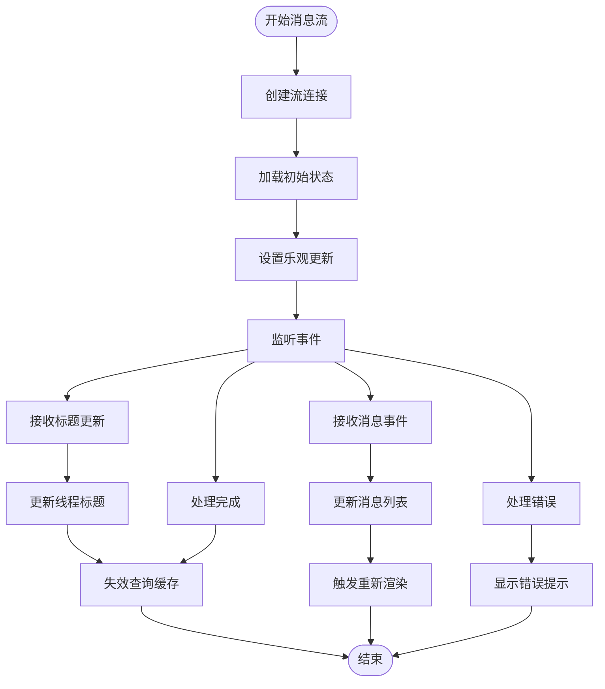

**图表来源**
- [frontend/src/core/threads/hooks.ts:113-183](file://frontend/src/core/threads/hooks.ts#L113-L183)

**章节来源**
- [frontend/src/core/threads/hooks.ts:58-183](file://frontend/src/core/threads/hooks.ts#L58-L183)

### 线程创建、删除、重命名和搜索

系统提供了完整的线程生命周期管理功能：

#### 线程创建
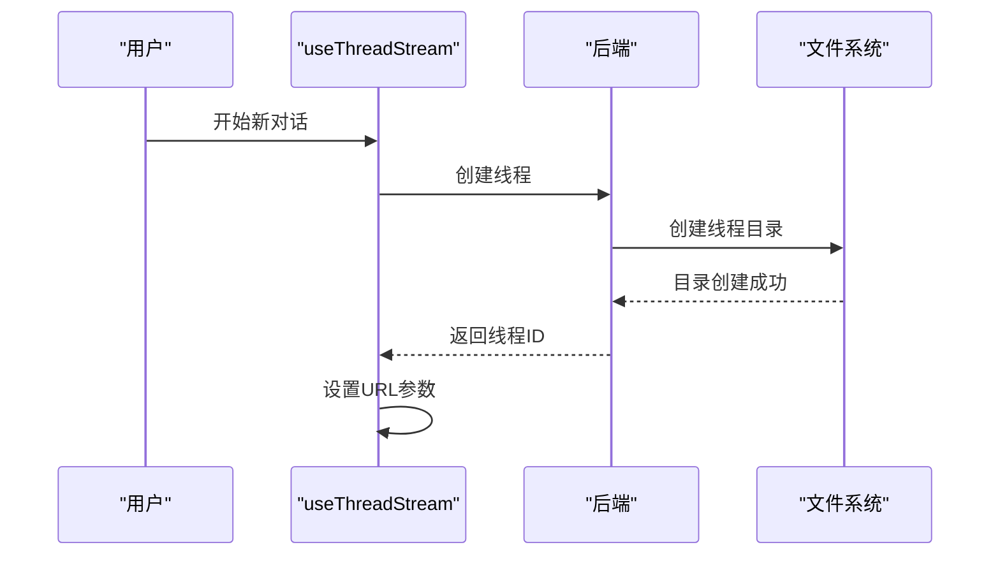

#### 线程删除
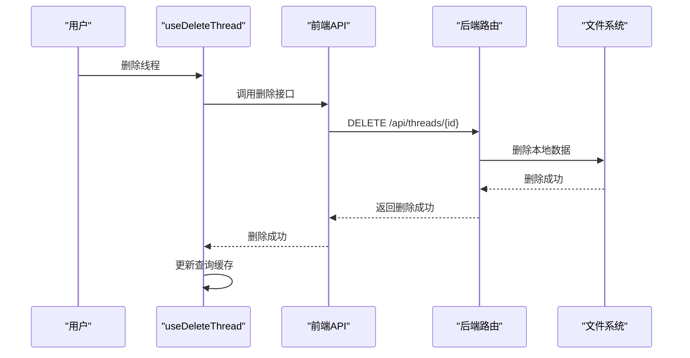

#### 线程重命名
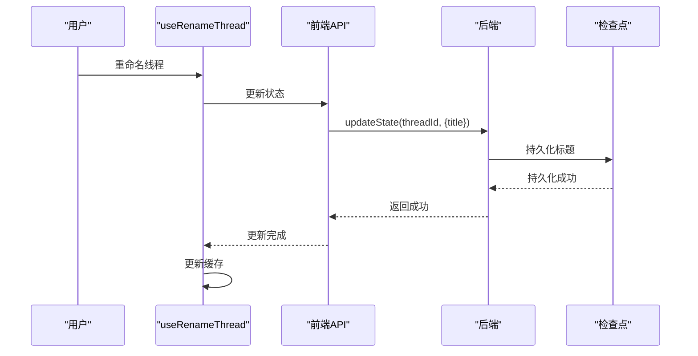

**图表来源**
- [frontend/src/core/threads/hooks.ts:479-558](file://frontend/src/core/threads/hooks.ts#L479-L558)
- [backend/app/gateway/routers/threads.py:34-41](file://backend/app/gateway/routers/threads.py#L34-L41)

**章节来源**
- [frontend/src/core/threads/hooks.ts:479-558](file://frontend/src/core/threads/hooks.ts#L479-L558)
- [backend/app/gateway/routers/threads.py:1-42](file://backend/app/gateway/routers/threads.py#L1-L42)

### 状态持久化机制

系统支持多种持久化后端，确保状态的可靠存储：

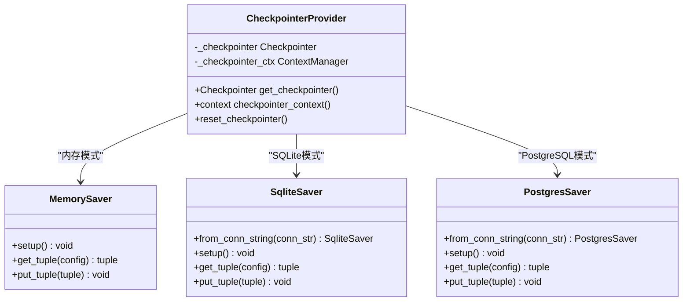

**图表来源**
- [backend/packages/harness/deerflow/agents/checkpointer/provider.py:114-204](file://backend/packages/harness/deerflow/agents/checkpointer/provider.py#L114-L204)

**章节来源**
- [backend/packages/harness/deerflow/agents/checkpointer/provider.py:1-204](file://backend/packages/harness/deerflow/agents/checkpointer/provider.py#L1-L204)

### 线程状态清理机制

系统实现了完善的线程状态清理机制：

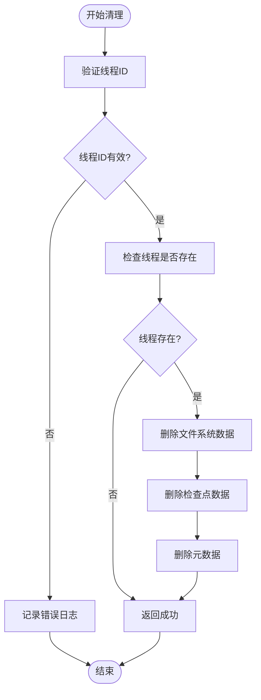

**图表来源**
- [backend/packages/harness/deerflow/config/paths.py:175-183](file://backend/packages/harness/deerflow/config/paths.py#L175-L183)
- [backend/app/gateway/routers/threads.py:19-31](file://backend/app/gateway/routers/threads.py#L19-L31)

**章节来源**
- [backend/packages/harness/deerflow/config/paths.py:153-183](file://backend/packages/harness/deerflow/config/paths.py#L153-L183)
- [backend/app/gateway/routers/threads.py:19-31](file://backend/app/gateway/routers/threads.py#L19-L31)

## 依赖关系分析

系统各组件之间的依赖关系如下：

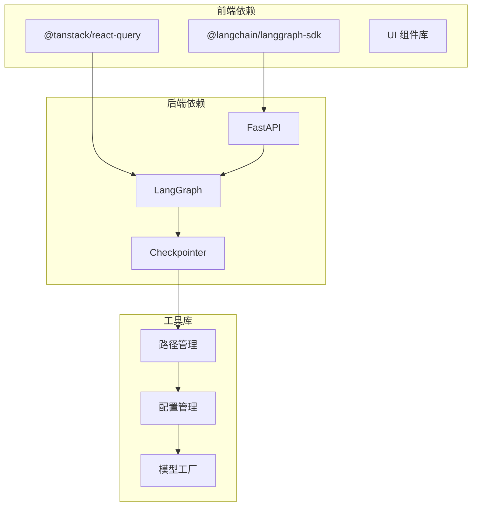

**图表来源**
- [frontend/src/core/threads/hooks.ts:1-10](file://frontend/src/core/threads/hooks.ts#L1-L10)
- [backend/packages/harness/deerflow/agents/checkpointer/provider.py:26-30](file://backend/packages/harness/deerflow/agents/checkpointer/provider.py#L26-L30)

**章节来源**
- [frontend/src/core/threads/hooks.ts:1-10](file://frontend/src/core/threads/hooks.ts#L1-L10)
- [backend/packages/harness/deerflow/agents/checkpointer/provider.py:1-20](file://backend/packages/harness/deerflow/agents/checkpointer/provider.py#L1-L20)

## 性能考量

### 增量更新策略

系统采用增量更新策略来优化性能：

1. **消息增量更新**：只更新新增的消息，避免全量重渲染
2. **状态局部更新**：使用 React Query 的局部状态更新
3. **缓存策略**：智能缓存最近访问的线程状态

### 分页加载优化

线程列表实现了智能分页加载：

- 默认每页50条记录
- 支持动态调整页面大小
- 智能终止条件（当返回结果少于请求数量时停止）

### 实时同步优化

消息流采用了多项优化措施：

- **乐观更新**：立即显示用户操作结果，后续同步服务器状态
- **去抖动处理**：合并频繁的状态更新
- **断线重连**：自动恢复网络中断后的状态同步

## 故障排除指南

### 常见问题及解决方案

#### 线程标题未生成

**症状**：新创建的线程没有自动标题

**可能原因**：
1. 标题生成功能未启用
2. 配置文件中的标题配置错误
3. 检查点未正确配置

**解决步骤**：
1. 检查配置文件中的 `title.enabled` 设置
2. 验证 `config.yaml` 中的标题配置
3. 确认检查点提供者已正确初始化

#### 线程状态不同步

**症状**：前端显示的线程状态与实际状态不一致

**可能原因**：
1. WebSocket 连接中断
2. 缓存未正确失效
3. 并发更新冲突

**解决步骤**：
1. 检查网络连接状态
2. 手动刷新页面强制重新加载
3. 清除浏览器缓存

#### 文件上传失败

**症状**：文件上传过程中出现错误

**可能原因**：
1. 文件大小超出限制
2. 文件格式不受支持
3. 网络连接不稳定

**解决步骤**：
1. 检查文件大小和格式限制
2. 确认网络连接稳定
3. 重新尝试上传

**章节来源**
- [backend/docs/AUTO_TITLE_GENERATION.md:197-216](file://backend/docs/AUTO_TITLE_GENERATION.md#L197-L216)

## 结论

DeerFlow 的线程状态管理系统通过精心设计的架构和实现，提供了完整的线程生命周期管理能力。系统的主要优势包括：

1. **完整的状态模型**：基于 ThreadState 的全面状态管理
2. **高效的实时同步**：基于流式传输的实时状态更新
3. **灵活的持久化**：支持多种后端存储方案
4. **优秀的用户体验**：乐观更新和智能缓存提升响应速度
5. **可靠的错误处理**：完善的错误处理和恢复机制

该系统为 DeerFlow 提供了强大的基础能力，支持复杂的多轮对话场景和丰富的交互功能。通过持续的优化和改进，系统能够满足各种规模的应用需求。