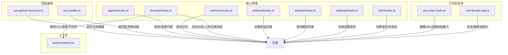
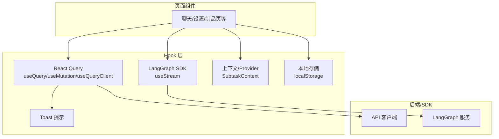
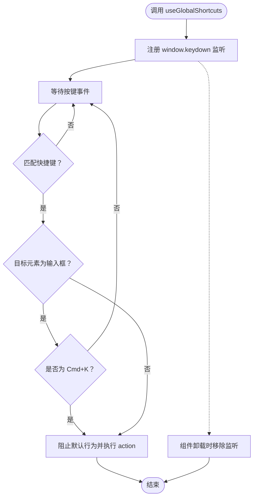
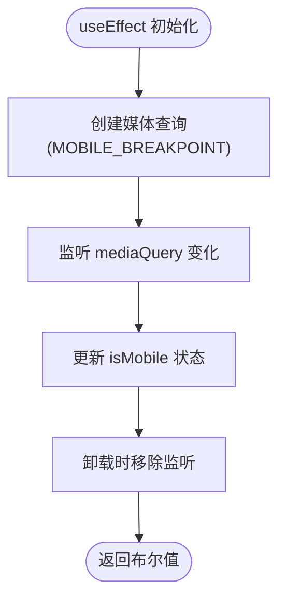
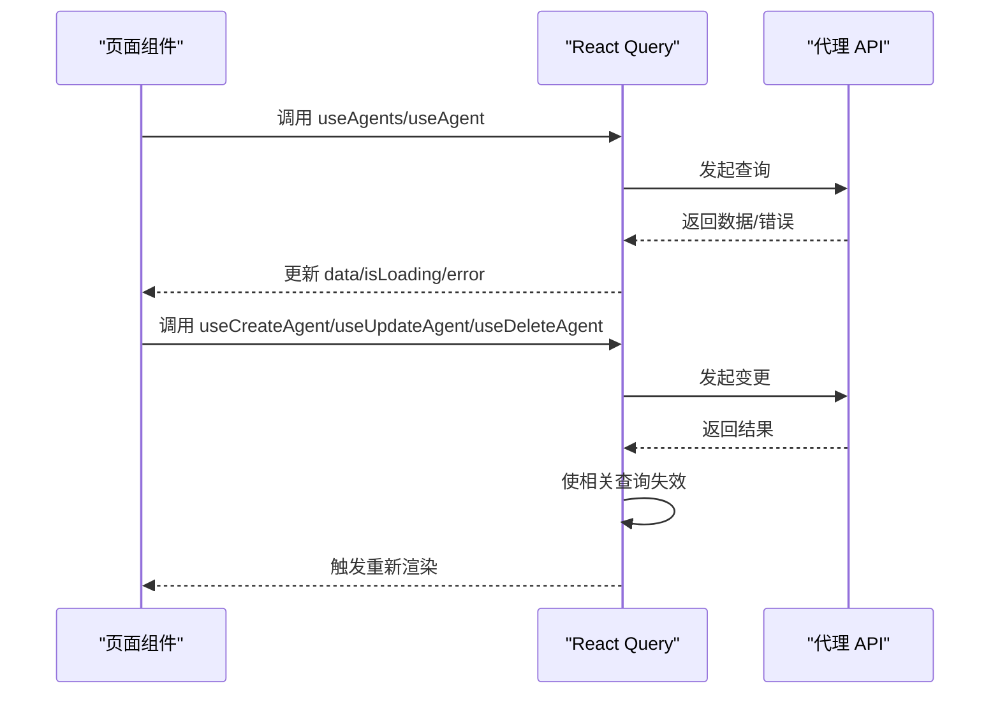
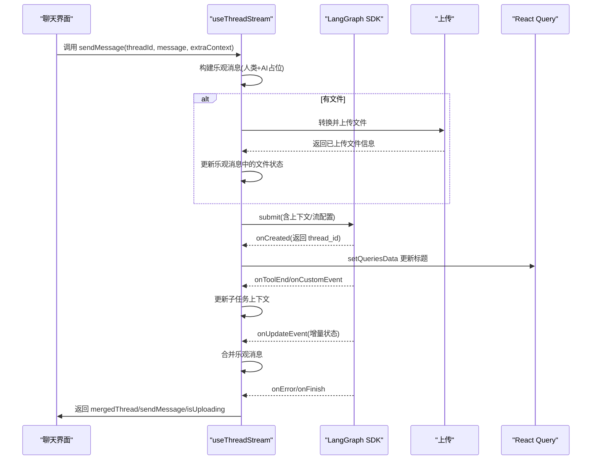
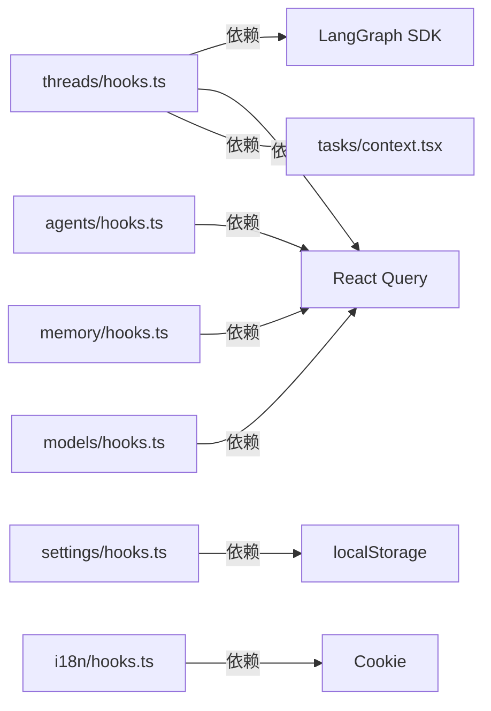

# 自定义 Hook 系统

<cite>
**本文引用的文件**
- [use-global-shortcuts.ts](file://frontend/src/hooks/use-global-shortcuts.ts)
- [use-mobile.ts](file://frontend/src/hooks/use-mobile.ts)
- [hooks.ts（代理）](file://frontend/src/core/agents/hooks.ts)
- [hooks.ts（记忆）](file://frontend/src/core/memory/hooks.ts)
- [hooks.ts（线程）](file://frontend/src/core/threads/hooks.ts)
- [hooks.ts（制品）](file://frontend/src/core/artifacts/hooks.ts)
- [hooks.ts（模型）](file://frontend/src/core/models/hooks.ts)
- [use-chat-mode.ts](file://frontend/src/components/workspace/chats/use-chat-mode.ts)
- [use-thread-chat.ts](file://frontend/src/components/workspace/chats/use-thread-chat.ts)
- [context.tsx（子任务上下文）](file://frontend/src/core/tasks/context.tsx)
- [hooks.ts（设置）](file://frontend/src/core/settings/hooks.ts)
- [hooks.ts（国际化）](file://frontend/src/core/i18n/hooks.ts)
</cite>

## 目录
1. [简介](#简介)
2. [项目结构](#项目结构)
3. [核心组件](#核心组件)
4. [架构总览](#架构总览)
5. [详细组件分析](#详细组件分析)
6. [依赖关系分析](#依赖关系分析)
7. [性能考量](#性能考量)
8. [故障排查指南](#故障排查指南)
9. [结论](#结论)
10. [附录](#附录)

## 简介
本文件系统性梳理 DeerFlow 前端的自定义 Hook 设计与实现，覆盖以下主题：
- 设计原则：关注点分离、可复用、可测试、可组合
- 复用模式：数据获取（查询/变更）、状态封装、副作用管理、流式处理
- 最佳实践：缓存策略、乐观更新、错误边界、性能优化
- 全局状态 Hook、设备适配 Hook、流式处理 Hook 的实现细节
- Hook 组合使用、错误边界处理与调试技巧
- 与状态管理库（React Query、上下文）的集成与状态共享机制

## 项目结构
DeerFlow 前端采用按“领域/功能”分层的组织方式，Hook 主要分布在以下位置：
- 顶层通用 Hook：键盘快捷键、移动端检测
- 核心领域 Hook：代理、记忆、线程、制品、模型、设置、国际化
- 工作区组件 Hook：聊天模式、线程聊天参数
- 子任务上下文：提供子任务状态共享

图表来源
- [use-global-shortcuts.ts:1-54](file://frontend/src/hooks/use-global-shortcuts.ts#L1-L54)
- [use-mobile.ts:1-20](file://frontend/src/hooks/use-mobile.ts#L1-L20)
- [hooks.ts（代理）:1-65](file://frontend/src/core/agents/hooks.ts#L1-L65)
- [hooks.ts（记忆）:1-12](file://frontend/src/core/memory/hooks.ts#L1-L12)
- [hooks.ts（线程）:1-559](file://frontend/src/core/threads/hooks.ts#L1-L559)
- [hooks.ts（制品）:1-39](file://frontend/src/core/artifacts/hooks.ts#L1-L39)
- [hooks.ts（模型）:1-14](file://frontend/src/core/models/hooks.ts#L1-L14)
- [use-chat-mode.ts:1-42](file://frontend/src/components/workspace/chats/use-chat-mode.ts#L1-L42)
- [use-thread-chat.ts:1-30](file://frontend/src/components/workspace/chats/use-thread-chat.ts#L1-L30)
- [context.tsx（子任务上下文）:1-54](file://frontend/src/core/tasks/context.tsx#L1-L54)

章节来源
- [use-global-shortcuts.ts:1-54](file://frontend/src/hooks/use-global-shortcuts.ts#L1-L54)
- [use-mobile.ts:1-20](file://frontend/src/hooks/use-mobile.ts#L1-L20)
- [hooks.ts（代理）:1-65](file://frontend/src/core/agents/hooks.ts#L1-L65)
- [hooks.ts（记忆）:1-12](file://frontend/src/core/memory/hooks.ts#L1-L12)
- [hooks.ts（线程）:1-559](file://frontend/src/core/threads/hooks.ts#L1-L559)
- [hooks.ts（制品）:1-39](file://frontend/src/core/artifacts/hooks.ts#L1-L39)
- [hooks.ts（模型）:1-14](file://frontend/src/core/models/hooks.ts#L1-L14)
- [use-chat-mode.ts:1-42](file://frontend/src/components/workspace/chats/use-chat-mode.ts#L1-L42)
- [use-thread-chat.ts:1-30](file://frontend/src/components/workspace/chats/use-thread-chat.ts#L1-L30)
- [context.tsx（子任务上下文）:1-54](file://frontend/src/core/tasks/context.tsx#L1-L54)

## 核心组件
- 全局快捷键 Hook：在窗口级别注册快捷键，支持 Meta/Shift 组合，并对输入框进行抑制策略。
- 移动端检测 Hook：基于媒体查询与窗口尺寸变化，返回布尔值表示是否移动端。
- 代理相关 Hook：基于 React Query 的查询/变更 Hook，封装代理列表、详情、创建、更新、删除。
- 记忆相关 Hook：查询当前会话记忆。
- 线程相关 Hook：核心流式处理 Hook，负责流式连接、事件回调、乐观消息、文件上传、标题同步、错误提示与完成回调。
- 制品内容 Hook：根据路径或工具调用加载制品内容，支持缓存与启用开关。
- 模型列表 Hook：查询可用模型列表，支持禁用自动刷新。
- 设置 Hook：本地设置持久化与更新，支持部分字段合并更新。
- 国际化 Hook：语言切换、初始化与翻译对象访问。
- 聊天模式 Hook：根据 URL 参数决定初始输入值。
- 线程聊天 Hook：生成/解析线程 ID，区分新建与已有线程，支持 mock 模式。
- 子任务上下文：提供子任务状态共享与更新函数。

章节来源
- [use-global-shortcuts.ts:1-54](file://frontend/src/hooks/use-global-shortcuts.ts#L1-L54)
- [use-mobile.ts:1-20](file://frontend/src/hooks/use-mobile.ts#L1-L20)
- [hooks.ts（代理）:1-65](file://frontend/src/core/agents/hooks.ts#L1-L65)
- [hooks.ts（记忆）:1-12](file://frontend/src/core/memory/hooks.ts#L1-L12)
- [hooks.ts（线程）:1-559](file://frontend/src/core/threads/hooks.ts#L1-L559)
- [hooks.ts（制品）:1-39](file://frontend/src/core/artifacts/hooks.ts#L1-L39)
- [hooks.ts（模型）:1-14](file://frontend/src/core/models/hooks.ts#L1-L14)
- [hooks.ts（设置）:1-47](file://frontend/src/core/settings/hooks.ts#L1-L47)
- [hooks.ts（国际化）:1-56](file://frontend/src/core/i18n/hooks.ts#L1-L56)
- [use-chat-mode.ts:1-42](file://frontend/src/components/workspace/chats/use-chat-mode.ts#L1-L42)
- [use-thread-chat.ts:1-30](file://frontend/src/components/workspace/chats/use-thread-chat.ts#L1-L30)
- [context.tsx（子任务上下文）:1-54](file://frontend/src/core/tasks/context.tsx#L1-L54)

## 架构总览
下图展示 Hook 与外部系统的交互：React Query 用于数据获取与缓存；LangGraph SDK 提供流式连接；上下文与 Provider 提供状态共享；Toast 用于错误提示；本地存储用于设置持久化。

图表来源
- [hooks.ts（线程）:1-559](file://frontend/src/core/threads/hooks.ts#L1-L559)
- [hooks.ts（代理）:1-65](file://frontend/src/core/agents/hooks.ts#L1-L65)
- [hooks.ts（设置）:1-47](file://frontend/src/core/settings/hooks.ts#L1-L47)
- [context.tsx（子任务上下文）:1-54](file://frontend/src/core/tasks/context.tsx#L1-L54)

## 详细组件分析

### 全局快捷键 Hook（useGlobalShortcuts）
- 设计要点
  - 在组件挂载时向 window 注册 keydown 监听，在卸载时移除，避免内存泄漏。
  - 支持 Meta/Shift 组合键匹配，针对特定键（如 K）允许在输入框内触发。
  - 通过传入的快捷键数组动态匹配，执行对应动作。
- 状态封装
  - 无内部状态，仅依赖传入的快捷键配置数组。
- 副作用管理
  - 使用 useEffect 管理事件监听器生命周期。
- 性能优化
  - 以常量时间遍历快捷键数组；事件处理中尽早返回，减少无效计算。
- 错误边界与调试
  - 若 action 抛错，需在上层捕获；建议在 action 内部包裹 try/catch 并使用 Toast 提示。

图表来源
- [use-global-shortcuts.ts:1-54](file://frontend/src/hooks/use-global-shortcuts.ts#L1-L54)

章节来源
- [use-global-shortcuts.ts:1-54](file://frontend/src/hooks/use-global-shortcuts.ts#L1-L54)

### 移动端检测 Hook（useIsMobile）
- 设计要点
  - 使用媒体查询与窗口尺寸变化监听，返回布尔值。
  - 首次渲染时立即确定结果，避免闪烁。
- 状态封装
  - 内部 useState 保存当前移动端状态。
- 副作用管理
  - useEffect 初始化监听并在卸载时清理。
- 性能优化
  - 仅在窗口尺寸变化时重算，避免频繁重排。
- 最佳实践
  - 将断点常量化，便于统一维护。

图表来源
- [use-mobile.ts:1-20](file://frontend/src/hooks/use-mobile.ts#L1-L20)

章节来源
- [use-mobile.ts:1-20](file://frontend/src/hooks/use-mobile.ts#L1-L20)

### 代理相关 Hook（useAgents/useAgent/useCreateAgent/useUpdateAgent/useDeleteAgent）
- 设计要点
  - 基于 React Query 的查询/变更 Hook，统一管理代理数据。
  - 查询键包含代理名称，支持按需启用。
  - 变更成功后通过 queryClient 使相关查询失效，确保数据一致性。
- 状态封装
  - 返回 data/isLoading/error，由 React Query 管理。
- 副作用管理
  - useQuery/useMutation 生命周期由 React Query 管理。
- 性能优化
  - 合理使用 enabled 控制查询触发时机；利用缓存避免重复请求。
- 错误边界与调试
  - 将 error 透传至 UI，结合 Toast 或错误页展示；可在 mutation 中记录日志。

图表来源
- [hooks.ts（代理）:1-65](file://frontend/src/core/agents/hooks.ts#L1-L65)

章节来源
- [hooks.ts（代理）:1-65](file://frontend/src/core/agents/hooks.ts#L1-L65)

### 记忆相关 Hook（useMemory）
- 设计要点
  - 简单查询 Hook，返回当前会话记忆。
- 状态封装
  - 返回 memory/isLoading/error。
- 副作用管理
  - 由 React Query 管理。
- 性能优化
  - 合理设置 staleTime/refetch 策略，避免频繁拉取。

章节来源
- [hooks.ts（记忆）:1-12](file://frontend/src/core/memory/hooks.ts#L1-L12)

### 线程相关 Hook（useThreadStream）
- 设计要点
  - 基于 LangGraph SDK 的流式连接，支持事件回调、自定义事件、错误处理与完成回调。
  - 通过 ref 与状态组合，保证回调与状态的一致性。
  - 实现乐观消息：在服务器响应前显示人类消息与占位 AI 消息，响应后清除。
  - 文件上传：在发送前转换并上传附件，更新乐观消息中的文件状态。
  - 标题同步：当流事件包含标题时，更新线程搜索列表中的标题。
  - 子任务更新：接收自定义事件，更新子任务上下文。
- 状态封装
  - 返回 mergedThread（合并乐观消息）、sendMessage、isUploading。
  - 内部状态：optimisticMessages、isUploading、sendInFlightRef、prevMsgCountRef、threadIdRef、startedRef。
- 副作用管理
  - useEffect 管理监听器、线程 ID 同步、开始/完成回调。
  - useCallback 包装回调，减少不必要重渲染。
- 性能优化
  - 乐观消息仅在必要时合并；文件上传并发处理；查询失效粒度控制。
- 错误边界与调试
  - 统一错误消息提取；失败时清空乐观消息；Toast 提示；在 action 内捕获异常。
- 与其他 Hook 的集成
  - 与子任务上下文配合，实时更新子任务最新消息。
  - 与设置 Hook 结合，注入推理强度、思考模式等上下文。

图表来源
- [hooks.ts（线程）:1-559](file://frontend/src/core/threads/hooks.ts#L1-L559)
- [context.tsx（子任务上下文）:1-54](file://frontend/src/core/tasks/context.tsx#L1-L54)

章节来源
- [hooks.ts（线程）:1-559](file://frontend/src/core/threads/hooks.ts#L1-L559)
- [context.tsx（子任务上下文）:1-54](file://frontend/src/core/tasks/context.tsx#L1-L54)

### 制品内容 Hook（useArtifactContent）
- 设计要点
  - 根据路径判断是否为写文件场景，分别从工具调用或常规路径加载内容。
  - 支持启用开关与缓存策略，避免重复请求。
- 状态封装
  - 返回 content/isLoading/error。
- 副作用管理
  - 由 React Query 管理查询生命周期。
- 性能优化
  - 设置合理的 staleTime，适合大体积制品（如 ZIP 解压）。

章节来源
- [hooks.ts（制品）:1-39](file://frontend/src/core/artifacts/hooks.ts#L1-L39)

### 模型列表 Hook（useModels）
- 设计要点
  - 查询可用模型列表，支持禁用自动刷新。
- 状态封装
  - 返回 models/isLoading/error。
- 副作用管理
  - 由 React Query 管理。

章节来源
- [hooks.ts（模型）:1-14](file://frontend/src/core/models/hooks.ts#L1-L14)

### 设置 Hook（useLocalSettings）
- 设计要点
  - 读取/保存本地设置，支持部分字段合并更新。
  - 使用 useLayoutEffect 首次挂载时读取，避免闪烁。
- 状态封装
  - 返回 [state, setter]。
- 副作用管理
  - useLayoutEffect 初始化；setter 通过 setState 与持久化结合。
- 性能优化
  - 合理拆分设置项，避免全量重渲染。

章节来源
- [hooks.ts（设置）:1-47](file://frontend/src/core/settings/hooks.ts#L1-L47)

### 国际化 Hook（useI18n）
- 设计要点
  - 从 Cookie 检测/设置语言，初始化翻译对象。
  - 提供 changeLocale 方法切换语言并持久化。
- 状态封装
  - 返回 { locale, t, changeLocale }。
- 副作用管理
  - useEffect 初始化语言；setLocaleInCookie 写入 Cookie。

章节来源
- [hooks.ts（国际化）:1-56](file://frontend/src/core/i18n/hooks.ts#L1-L56)

### 聊天模式 Hook（useSpecificChatMode）
- 设计要点
  - 根据 URL 参数决定是否进入特定模式（如技能创作），并设置初始输入值。
  - 使用 ref 保持最新输入值，避免不必要的重渲染。
- 状态封装
  - 无内部状态，仅影响输入框初始值。
- 副作用管理
  - useEffect 在满足条件时延迟设置输入并聚焦。

章节来源
- [use-chat-mode.ts:1-42](file://frontend/src/components/workspace/chats/use-chat-mode.ts#L1-L42)

### 线程聊天 Hook（useThreadChat）
- 设计要点
  - 解析路径中的线程 ID，区分新建与已有线程；新建时生成 UUID。
  - 支持 mock 参数控制是否走模拟流程。
- 状态封装
  - 返回 { threadId, isNewThread, setIsNewThread, isMock }。
- 副作用管理
  - useEffect 监听路由变化，更新状态。

章节来源
- [use-thread-chat.ts:1-30](file://frontend/src/components/workspace/chats/use-thread-chat.ts#L1-L30)

## 依赖关系分析
- 组件耦合
  - useThreadStream 与子任务上下文存在直接依赖，用于实时更新子任务状态。
  - 多个 Hook 依赖 React Query 进行数据获取与缓存。
  - useThreadStream 依赖 LangGraph SDK 进行流式连接。
- 外部依赖
  - React Query：查询/变更/缓存/失效
  - LangGraph SDK：流式事件与状态更新
  - 上下文：子任务状态共享
  - 本地存储：设置持久化
- 循环依赖
  - 当前文件间未见循环导入；若后续扩展，应避免跨层互相依赖。

图表来源
- [hooks.ts（线程）:1-559](file://frontend/src/core/threads/hooks.ts#L1-L559)
- [hooks.ts（代理）:1-65](file://frontend/src/core/agents/hooks.ts#L1-L65)
- [hooks.ts（记忆）:1-12](file://frontend/src/core/memory/hooks.ts#L1-L12)
- [hooks.ts（模型）:1-14](file://frontend/src/core/models/hooks.ts#L1-L14)
- [hooks.ts（设置）:1-47](file://frontend/src/core/settings/hooks.ts#L1-L47)
- [hooks.ts（国际化）:1-56](file://frontend/src/core/i18n/hooks.ts#L1-L56)
- [context.tsx（子任务上下文）:1-54](file://frontend/src/core/tasks/context.tsx#L1-L54)

章节来源
- [hooks.ts（线程）:1-559](file://frontend/src/core/threads/hooks.ts#L1-L559)
- [hooks.ts（代理）:1-65](file://frontend/src/core/agents/hooks.ts#L1-L65)
- [hooks.ts（记忆）:1-12](file://frontend/src/core/memory/hooks.ts#L1-L12)
- [hooks.ts（模型）:1-14](file://frontend/src/core/models/hooks.ts#L1-L14)
- [hooks.ts（设置）:1-47](file://frontend/src/core/settings/hooks.ts#L1-L47)
- [hooks.ts（国际化）:1-56](file://frontend/src/core/i18n/hooks.ts#L1-L56)
- [context.tsx（子任务上下文）:1-54](file://frontend/src/core/tasks/context.tsx#L1-L54)

## 性能考量
- 缓存与失效
  - React Query 的查询键设计合理，变更后主动失效，避免脏读。
  - 制品内容设置 5 分钟 staleTime，降低重复请求成本。
- 乐观更新
  - 流式对话中使用乐观消息，提升感知性能；服务器响应后及时清理。
- 并发与节流
  - 文件上传并发处理；发送防抖（sendInFlightRef）避免重复提交。
- 渲染优化
  - useCallback 包装回调；useMemo 优化依赖；避免在渲染阶段做重计算。
- 网络与错误
  - 统一错误消息提取与 Toast 提示；失败时回滚乐观状态。

## 故障排查指南
- 快捷键无效
  - 检查是否在输入框内触发；确认快捷键数组传入正确；确认组件已挂载。
- 流式对话异常
  - 查看 onError 回调是否被触发；检查 threadId 是否变化导致回调丢失；确认 isMock 参数。
  - 关注 onToolEnd/onCustomEvent 是否正确传递；核对子任务上下文更新逻辑。
- 上传失败
  - 检查文件转换与上传接口返回；确认线程 ID 已就绪；查看 Toast 错误提示。
- 数据未更新
  - 确认 queryClient.invalidateQueries 是否调用；检查查询键是否一致。
- 语言切换不生效
  - 检查 Cookie 写入与 locale 初始化逻辑；确认翻译对象是否正确选择。

章节来源
- [use-global-shortcuts.ts:1-54](file://frontend/src/hooks/use-global-shortcuts.ts#L1-L54)
- [hooks.ts（线程）:1-559](file://frontend/src/core/threads/hooks.ts#L1-L559)
- [hooks.ts（设置）:1-47](file://frontend/src/core/settings/hooks.ts#L1-L47)
- [hooks.ts（国际化）:1-56](file://frontend/src/core/i18n/hooks.ts#L1-L56)

## 结论
DeerFlow 的自定义 Hook 系统遵循“单一职责、可组合、可测试”的设计原则，围绕数据获取、状态封装、副作用管理与流式处理构建了清晰的抽象层。通过 React Query 与 LangGraph SDK 的集成，实现了高效的数据同步与实时交互；通过上下文与本地存储，提供了状态共享与持久化能力。建议在后续迭代中进一步完善错误边界与监控埋点，持续优化性能与用户体验。

## 附录
- 组合使用模式
  - 在聊天页面同时使用 useThreadStream、useLocalSettings、useI18n 与 useThreadChat，形成完整的对话体验。
  - 在设置页面使用 useLocalSettings 与 useI18n，实现语言与偏好设置的持久化。
- 最佳实践清单
  - 合理划分 Hook 职责，避免过度耦合。
  - 明确查询键与失效策略，确保数据一致性。
  - 使用 useCallback/useMemo 降低重渲染成本。
  - 对关键流程添加错误处理与用户反馈。
  - 对大体量资源设置缓存策略，平衡性能与新鲜度。